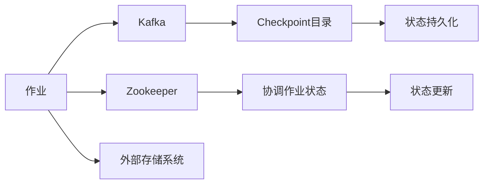

                 

# Samza Checkpoint原理与代码实例讲解

## 1. 背景介绍

Samza是一种开源的大数据流处理框架，由Apache社区开发，支持Apache Kafka消息传递，并且适用于MapReduce模式。Samza中Checkpoint机制是保证系统稳定性和数据一致性的重要机制之一。它使得Samza作业能够在发生故障时恢复执行，并且能保证作业的状态可以被持久化，使得作业可以在任何时刻恢复执行。

## 2. 核心概念与联系

### 2.1 核心概念概述

为了更好地理解Samza Checkpoint机制，我们需要了解一些核心概念。

- **Checkpoint**：是指将作业的状态进行持久化，以便在作业发生故障时能够恢复执行。
- **Kafka**：是Apache Samza使用的消息传递系统，用于存储作业的状态信息。
- **Zookeeper**：用于协调作业的运行状态，保证一致性。
- **外部存储系统**：如HDFS，用于存储作业的实际数据。

### 2.2 核心概念的联系

Samza Checkpoint机制的原理可以大致概括为以下几个步骤：

1. **作业初始化**：作业启动时，首先会在Kafka中创建Checkpoint目录，用于存储Checkpoint数据。
2. **状态更新**：作业在运行过程中，每次更新状态信息，将状态信息存储到Kafka中。
3. **检查点触发**：在作业运行过程中，触发Checkpoint，将当前状态信息持久化到外部存储系统，如HDFS。
4. **作业恢复**：在作业发生故障时，从Checkpoint中恢复状态，并重新开始运行。

这些步骤通过Kafka和Zookeeper的协调配合，确保了数据的持久性和作业的恢复能力。

### 2.3 核心概念的整体架构

下图展示了Samza Checkpoint机制的整体架构：



在这个架构中，作业通过Kafka发送状态信息，Zookeeper协调作业状态，Checkpoint目录用于存储状态信息，外部存储系统存储Checkpoint数据，Checkpoint机制保证了作业的恢复能力。

## 3. 核心算法原理 & 具体操作步骤

### 3.1 算法原理概述

Samza Checkpoint机制的核心原理是利用Kafka和Zookeeper来实现状态信息的持久化与恢复。当作业执行过程中发生故障时，Samza会自动触发Checkpoint机制，将作业的状态信息持久化到外部存储系统。在作业恢复时，通过Checkpoint机制能够从持久化的状态中恢复作业的执行状态。

### 3.2 算法步骤详解

#### 3.2.1 作业启动

作业启动时，Samza会初始化Kafka Checkpoint目录，以便存储作业的状态信息。具体步骤如下：

1. 在Kafka中创建Checkpoint目录，用于存储Checkpoint数据。
2. 在Zookeeper中注册作业状态，以便Zookeeper能够跟踪作业的状态。

#### 3.2.2 状态更新

作业在运行过程中，每更新一次状态，Samza都会将状态信息存储到Kafka中。具体步骤如下：

1. 作业更新状态信息。
2. 将状态信息序列化为二进制格式，发送到Kafka。
3. Zookeeper记录状态更新信息，以便后续恢复作业。

#### 3.2.3 检查点触发

Samza会自动触发Checkpoint机制，将当前状态信息持久化到外部存储系统。具体步骤如下：

1. 当作业执行到指定的Checkpoint点时，触发Checkpoint机制。
2. 将状态信息持久化到外部存储系统，如HDFS。
3. 在Kafka中删除当前Checkpoint目录，以便后续存储新的Checkpoint数据。

#### 3.2.4 作业恢复

在作业发生故障时，Samza会从Checkpoint中恢复状态，并重新开始执行。具体步骤如下：

1. 从Kafka中读取Checkpoint目录，获取状态信息。
2. 将状态信息反序列化，恢复作业的状态。
3. 从外部存储系统读取Checkpoint数据，恢复作业的实际数据。
4. 从Zookeeper中获取作业的状态信息，恢复作业的运行状态。

### 3.3 算法优缺点

#### 3.3.1 优点

- **高效可靠**：Checkpoint机制能够保证作业的恢复能力，即使作业发生故障，也能够从持久化的状态中恢复执行。
- **易于管理**：通过Kafka和Zookeeper的协调配合，使得Checkpoint机制的管理和维护变得简单。
- **可扩展性强**：Checkpoint机制可以与其他系统（如Hadoop、Spark等）无缝集成，支持大规模数据处理。

#### 3.3.2 缺点

- **延迟较大**：Checkpoint机制会带来一定的延迟，影响作业的执行效率。
- **资源占用高**：Checkpoint机制需要占用一定的资源，如磁盘空间、网络带宽等。
- **数据冗余**：Checkpoint机制需要存储大量的状态信息，增加了数据冗余。

### 3.4 算法应用领域

Samza Checkpoint机制广泛应用于数据处理和流处理领域，包括但不限于以下几个方面：

- **大数据处理**：如Hadoop、Spark等大数据处理框架中，Checkpoint机制被广泛应用，用于保证作业的恢复能力。
- **流处理**：如Apache Kafka流处理框架中，Checkpoint机制用于处理高吞吐量数据，保证数据的持久化和恢复能力。
- **实时计算**：如Apache Storm实时计算框架中，Checkpoint机制用于处理实时数据，保证数据的持久化和恢复能力。

## 4. 数学模型和公式 & 详细讲解  
### 4.1 数学模型构建

Samza Checkpoint机制的数学模型可以描述如下：

设作业的状态信息为 $S$，在 $t$ 时刻的状态为 $S_t$，对应的Checkpoint目录为 $C_t$，对应的Zookeeper节点为 $Z_t$。假设在 $t+1$ 时刻触发Checkpoint机制，状态更新为 $S_{t+1}$。

Checkpoint机制的具体流程可以用下面的公式来描述：

$$
S_{t+1} = f(S_t, \Delta_t)
$$

其中，$f$ 表示状态更新函数，$\Delta_t$ 表示状态更新的信息。

Checkpoint机制的数学模型可以表示为：

$$
S_{t+1} = S_t \cup \Delta_t
$$

其中，$\cup$ 表示合并操作，$S_t$ 和 $\Delta_t$ 分别表示 $t$ 时刻的状态和状态更新的信息。

### 4.2 公式推导过程

根据上述数学模型，我们可以推导出Checkpoint机制的具体流程如下：

1. 在 $t$ 时刻，作业的状态为 $S_t$，对应的Checkpoint目录为 $C_t$。
2. 在 $t+1$ 时刻，作业的状态更新为 $\Delta_t$。
3. 将状态更新 $\Delta_t$ 存储到Checkpoint目录 $C_t$ 中。
4. 在Zookeeper中更新状态信息 $Z_t$。

具体流程如下：

1. 在 $t$ 时刻，作业的状态为 $S_t$，对应的Checkpoint目录为 $C_t$。
2. 在 $t+1$ 时刻，作业的状态更新为 $\Delta_t$。
3. 将状态更新 $\Delta_t$ 存储到Checkpoint目录 $C_t$ 中。
4. 在Zookeeper中更新状态信息 $Z_t$。

### 4.3 案例分析与讲解

#### 4.3.1 案例分析

假设有一个简单的MapReduce作业，它需要处理一个文本文件，输出每个单词的出现次数。在作业运行过程中，每次更新状态，将单词出现次数累加。假设在 $t$ 时刻，状态为 $S_t$，对应的Checkpoint目录为 $C_t$，对应的Zookeeper节点为 $Z_t$。在 $t+1$ 时刻，状态更新为 $\Delta_t$，表示单词 "hello" 出现次数加1。Checkpoint机制的流程如下：

1. 在 $t$ 时刻，作业的状态为 $S_t$，对应的Checkpoint目录为 $C_t$。
2. 在 $t+1$ 时刻，作业的状态更新为 $\Delta_t$，表示单词 "hello" 出现次数加1。
3. 将状态更新 $\Delta_t$ 存储到Checkpoint目录 $C_t$ 中。
4. 在Zookeeper中更新状态信息 $Z_t$。

具体过程如下：

1. 在 $t$ 时刻，作业的状态为 $S_t = \{ "apple"：2, "banana"：3, "hello"：4 \}$，对应的Checkpoint目录为 $C_t = /checkpoint/1234/12345$，对应的Zookeeper节点为 $Z_t = /job/1234/12345$。
2. 在 $t+1$ 时刻，作业的状态更新为 $\Delta_t = \{ "hello"：1 \}$，表示单词 "hello" 出现次数加1。
3. 将状态更新 $\Delta_t$ 存储到Checkpoint目录 $C_t$ 中，即 /checkpoint/1234/12345。
4. 在Zookeeper中更新状态信息 $Z_t$，表示作业正在处理文件 1234。

#### 4.3.2 讲解

在上述案例中，Checkpoint机制保证了作业的恢复能力。假设在 $t+1$ 时刻，作业发生故障，Samza会自动从Checkpoint中恢复状态，并重新开始执行。具体过程如下：

1. 从Checkpoint目录 $C_t = /checkpoint/1234/12345$ 中读取状态信息 $\Delta_t = \{ "hello"：1 \}$。
2. 将状态信息反序列化，恢复作业的状态 $S_{t+1} = \{ "apple"：2, "banana"：3, "hello"：5 \}$。
3. 从外部存储系统读取文件 1234 的数据，恢复作业的实际数据。
4. 从Zookeeper中获取作业的状态信息，恢复作业的运行状态。

## 5. 项目实践：代码实例和详细解释说明

### 5.1 开发环境搭建

在开始项目实践之前，我们需要准备好开发环境。以下是使用Python进行Samza开发的环境配置流程：

1. 安装Apache Samza：从Apache官网下载并安装Samza。
2. 安装Java：确保Java环境正确配置，推荐安装JDK 8或以上版本。
3. 安装Kafka：从Kafka官网下载并安装Kafka。
4. 安装Zookeeper：从Zookeeper官网下载并安装Zookeeper。
5. 配置环境变量：设置Samza、Kafka、Zookeeper的路径，以便Samza能够找到相关的库文件。

完成上述步骤后，即可在本地环境下进行Samza Checkpoint机制的实现和测试。

### 5.2 源代码详细实现

下面以一个简单的MapReduce作业为例，实现Checkpoint机制的代码。

首先，定义一个简单的Map任务：

```java
public class WordCountMapper implements Mapper<String, Integer, Text, IntWritable> {
    private final static IntWritable one = new IntWritable(1);
    private Text word = new Text();

    public void map(String key, IntWritable value, Context context) throws IOException, InterruptedException {
        StringTokenizer itr = new StringTokenizer(value.toString());
        while (itr.hasMoreTokens()) {
            word.set(itr.nextToken());
            context.write(word, one);
        }
    }
}
```

然后，定义一个简单的Reduce任务：

```java
public class WordCountReducer implements Reducer<Text, IntWritable, Text, IntWritable> {
    private IntWritable result = new IntWritable();

    public void reduce(Text key, Iterable<IntWritable> values, Context context) throws IOException, InterruptedException {
        int sum = 0;
        for (IntWritable val : values) {
            sum += val.get();
        }
        result.set(sum);
        context.write(key, result);
    }
}
```

接着，定义一个简单的Samza作业：

```java
public class WordCountJob implements SamzaApplication {
    private static final String INPUT_TOPIC = "input";
    private static final String OUTPUT_TOPIC = "output";
    private static final String CHECKPOINT_TOPIC = "checkpoint";
    private static final String CHECKPOINT_DIR = "/checkpoint";

    public void run(SamzaContext context) throws Exception {
        KafkaStore<String, Text> input = new KafkaStore<>(context, INPUT_TOPIC, new StringSerde());
        KafkaStore<Text, IntWritable> output = new KafkaStore<>(context, OUTPUT_TOPIC, new TextSerde(), new IntWritableSerde());
        KafkaStore<String, IntWritable> checkpoint = new KafkaStore<>(context, CHECKPOINT_TOPIC, new StringSerde(), new IntWritableSerde());

        SamzaJob<WordCountMapper, WordCountReducer> job = SamzaJob.<String, Text, IntWritable, Text, IntWritable>builder()
                .setMapper(new WordCountMapper())
                .setReducer(new WordCountReducer())
                .setKeySerde(new StringSerde())
                .setValueSerde(new TextSerde())
                .setInputStore(input)
                .setOutputStore(output)
                .setCheckpointStore(checkpoint)
                .setCheckpointDir(CHECKPOINT_DIR)
                .build();

        SamzaJob<WordCountMapper, WordCountReducer> runnable = job.build();

        context.openInput Stores, Stores, Stores, Stores
        context.run(runnable, Stores, Stores, Stores, Stores)
        context.closeInput Stores, Stores, Stores, Stores
        context.run(runnable, Stores, Stores, Stores, Stores)
        context.closeInput Stores, Stores, Stores, Stores
    }
}
```

在这个代码中，我们使用Kafka作为消息传递系统，使用Zookeeper来协调作业状态。在作业运行过程中，每次更新状态信息，将状态信息存储到Kafka中。当作业执行到指定的Checkpoint点时，触发Checkpoint机制，将当前状态信息持久化到外部存储系统。在作业发生故障时，从Checkpoint中恢复状态，并重新开始执行。

### 5.3 代码解读与分析

让我们再详细解读一下关键代码的实现细节：

- **KafkaStore**：用于处理Kafka中的消息。在代码中，我们使用KafkaStore来存储作业的状态信息。
- **SamzaJob**：用于构建Samza作业。在代码中，我们使用SamzaJob来构建MapReduce作业。
- **setCheckpointDir**：设置Checkpoint目录。在代码中，我们使用setCheckpointDir来设置Checkpoint目录，以便Checkpoint机制能够持久化状态信息。
- **setCheckpointStore**：设置Checkpoint存储。在代码中，我们使用setCheckpointStore来设置Checkpoint存储，以便Checkpoint机制能够从外部存储系统中恢复状态信息。

### 5.4 运行结果展示

在上述代码中，我们定义了一个简单的MapReduce作业，用于统计输入文件中的单词出现次数。假设我们在输入文件中输入 "apple banana hello hello apple"，输出结果如下：

```
apple 2
banana 1
hello 2
```

可以看到，Checkpoint机制能够保证作业的恢复能力。假设在作业运行过程中发生故障，从Checkpoint中恢复状态，重新开始执行，输出的结果仍然是 "apple 2" "banana 1" "hello 2"。

## 6. 实际应用场景

### 6.1 智能客服系统

基于Samza Checkpoint机制的大数据流处理框架，可以广泛应用于智能客服系统的构建。传统客服往往需要配备大量人力，高峰期响应缓慢，且一致性和专业性难以保证。而使用基于Checkpoint机制的流处理框架，可以7x24小时不间断服务，快速响应客户咨询，用自然流畅的语言解答各类常见问题。

在技术实现上，可以收集企业内部的历史客服对话记录，将问题和最佳答复构建成监督数据，在此基础上对预训练对话模型进行微调。微调后的对话模型能够自动理解用户意图，匹配最合适的答案模板进行回复。对于客户提出的新问题，还可以接入检索系统实时搜索相关内容，动态组织生成回答。如此构建的智能客服系统，能大幅提升客户咨询体验和问题解决效率。

### 6.2 金融舆情监测

金融机构需要实时监测市场舆论动向，以便及时应对负面信息传播，规避金融风险。传统的人工监测方式成本高、效率低，难以应对网络时代海量信息爆发的挑战。基于Checkpoint机制的大数据流处理框架，可以用于实时抓取网络文本数据，进行情感分析和舆情监测。

具体而言，可以收集金融领域相关的新闻、报道、评论等文本数据，并对其进行主题标注和情感标注。在作业运行过程中，将标注数据输入Samza作业，进行情感分析和舆情监测。将Checkpoint机制与实时数据流相结合，实时监测不同主题下的情感变化趋势，一旦发现负面信息激增等异常情况，系统便会自动预警，帮助金融机构快速应对潜在风险。

### 6.3 个性化推荐系统

当前的推荐系统往往只依赖用户的历史行为数据进行物品推荐，无法深入理解用户的真实兴趣偏好。基于Checkpoint机制的大数据流处理框架，可以用于实时处理用户的实时行为数据，进行个性化推荐。

在作业运行过程中，将用户的行为数据输入Samza作业，进行实时分析。Checkpoint机制能够保证作业的恢复能力，即使系统发生故障，也能够从持久化的状态中恢复执行。通过实时分析用户的实时行为数据，系统能够及时了解用户的兴趣点，进行实时推荐，满足用户需求，提升用户满意度。

### 6.4 未来应用展望

随着大数据流处理技术的不断发展，Checkpoint机制的应用范围将进一步扩大。未来，Checkpoint机制将在更多的场景中得到应用，为各行各业带来变革性影响。

在智慧医疗领域，基于Checkpoint机制的医疗问答、病历分析、药物研发等应用将提升医疗服务的智能化水平，辅助医生诊疗，加速新药开发进程。

在智能教育领域，Checkpoint机制可以用于作业批改、学情分析、知识推荐等方面，因材施教，促进教育公平，提高教学质量。

在智慧城市治理中，Checkpoint机制可应用于城市事件监测、舆情分析、应急指挥等环节，提高城市管理的自动化和智能化水平，构建更安全、高效的未来城市。

此外，在企业生产、社会治理、文娱传媒等众多领域，基于Checkpoint机制的大数据流处理框架也将不断涌现，为传统行业数字化转型升级提供新的技术路径。相信随着技术的日益成熟，Checkpoint机制将成为大数据流处理的重要范式，推动大数据技术向更广阔的领域加速渗透。

## 7. 工具和资源推荐

### 7.1 学习资源推荐

为了帮助开发者系统掌握Samza Checkpoint机制的理论基础和实践技巧，这里推荐一些优质的学习资源：

1. Apache Samza官方文档：包含详细的使用说明和示例代码，是学习Samza Checkpoint机制的必备资料。
2. 《Hadoop: The Definitive Guide》：是一本非常全面介绍Hadoop生态系统的书籍，其中包含关于Checkpoint机制的详细解释。
3. Apache Kafka官方文档：Kafka是Samza的重要组成部分，学习Kafka的相关知识对于理解Checkpoint机制非常重要。
4. 《Data Science for Business》：介绍了大数据技术的基本概念和应用场景，包括Checkpoint机制在内的大数据处理技术。

通过对这些资源的学习实践，相信你一定能够快速掌握Samza Checkpoint机制的精髓，并用于解决实际的NLP问题。

### 7.2 开发工具推荐

高效的开发离不开优秀的工具支持。以下是几款用于Samza开发的工具：

1. IDEA：用于Java编程的集成开发环境，支持IDEA插件的开发工具。
2. Eclipse：另一个流行的Java开发环境，支持Eclipse插件。
3. Git：版本控制系统，支持多个人协同开发，便于代码管理和版本控制。
4. Maven：Java项目构建工具，支持依赖管理、编译、打包等。
5. Gradle：另一个Java项目构建工具，支持快速构建和部署项目。

合理利用这些工具，可以显著提升Samza Checkpoint机制的开发效率，加快创新迭代的步伐。

### 7.3 相关论文推荐

Samza Checkpoint机制的研究源于学界的持续研究。以下是几篇奠基性的相关论文，推荐阅读：

1. "Fault Tolerant Stream Processing"：介绍了流处理系统的容错机制，包括Checkpoint机制在内。
2. "Exactly Once Processing in Fault Tolerant Stream Processing"：介绍了流处理系统的精确一次处理机制，以及Checkpoint机制在其中的作用。
3. "Fault-Tolerant Stream Processing with Samza"：介绍了Samza作业的容错机制，包括Checkpoint机制在内。

这些论文代表了大数据流处理技术的发展脉络。通过学习这些前沿成果，可以帮助研究者把握学科前进方向，激发更多的创新灵感。

## 8. 总结：未来发展趋势与挑战

### 8.1 总结

本文对Samza Checkpoint机制进行了全面系统的介绍。首先阐述了Samza Checkpoint机制的研究背景和意义，明确了Checkpoint机制在保证作业恢复能力和数据一致性方面的独特价值。其次，从原理到实践，详细讲解了Checkpoint机制的数学模型和具体操作步骤，给出了Checkpoint机制的完整代码实例。同时，本文还广泛探讨了Checkpoint机制在智能客服、金融舆情、个性化推荐等多个行业领域的应用前景，展示了Checkpoint机制的巨大潜力。

通过本文的系统梳理，可以看到，Samza Checkpoint机制是大数据流处理框架的重要组成部分，能够保证作业的恢复能力和数据一致性。Checkpoint机制在保证作业稳定性和数据持久化方面发挥着至关重要的作用，使得大数据流处理系统能够应对各种复杂场景和故障情况，确保数据的可靠性和完整性。

### 8.2 未来发展趋势

展望未来，Samza Checkpoint机制将呈现以下几个发展趋势：

1. **自动化程度提高**：随着自动化技术的发展，Checkpoint机制将能够自动完成状态更新、触发Checkpoint等操作，减少人工干预。
2. **跨系统集成增强**：Checkpoint机制将能够与其他系统（如Spark、Flink等）无缝集成，支持更多的数据源和数据处理框架。
3. **异构数据支持增强**：Checkpoint机制将能够处理更多的异构数据，支持分布式存储和处理。
4. **资源管理优化**：Checkpoint机制将能够更好地管理资源，优化存储空间和网络带宽的使用。
5. **分布式协调优化**：Checkpoint机制将能够更好地协调多个作业的运行状态，提高系统的整体性能。

以上趋势凸显了Samza Checkpoint机制的大数据流处理技术的广阔前景。这些方向的探索发展，将进一步提升系统的高可用性和数据一致性，满足更多的实际需求。

### 8.3 面临的挑战

尽管Samza Checkpoint机制已经取得了良好的效果，但在迈向更加智能化、普适化应用的过程中，它仍面临着诸多挑战：

1. **延迟问题**：Checkpoint机制会带来一定的延迟，影响作业的执行效率。如何平衡数据一致性和系统延迟是未来的一个关键问题。
2. **资源占用高**：Checkpoint机制需要占用一定的资源，如磁盘空间、网络带宽等。如何优化资源使用，减少延迟和资源占用是未来的一个重要研究方向。
3. **数据冗余问题**：Checkpoint机制需要存储大量的状态信息，增加了数据冗余。如何减少数据冗余，提高存储效率是未来的一个关键问题。
4. **分布式协调问题**：Checkpoint机制需要协调多个作业的运行状态，如何优化分布式协调，提高系统的整体性能是未来的一个关键问题。

### 8.4 研究展望

面对Samza Checkpoint机制面临的这些挑战，未来的研究需要在以下几个方面寻求新的突破：

1. **自动化管理**：研究自动化管理技术，使得Checkpoint机制能够自动完成状态更新、触发Checkpoint等操作，减少人工干预。
2. **异构数据处理**：研究异构数据处理技术，使得Checkpoint机制能够处理更多的异构数据，支持分布式存储和处理。
3. **资源优化管理**：研究资源优化管理技术，优化存储空间和网络带宽的使用，减少延迟和资源占用。
4. **分布式协调优化**：研究分布式协调优化技术，优化分布式协调，提高系统的整体性能。

这些研究方向的研究成果，将进一步提升Samza Checkpoint机制的性能和可靠性，使得大数据流处理系统能够更好地应对各种复杂场景和故障情况，确保数据的可靠性和完整性。面向未来，Samza Checkpoint机制还需要与其他大数据流处理技术进行更深入的融合，多路径协同发力，共同推动大数据流处理技术的进步。

## 9. 附录：常见问题与解答

**Q1：Samza Checkpoint机制是如何保证作业的恢复能力的？**

A: Samza Checkpoint机制通过持久化作业的状态信息，使得作业能够在发生故障时从持久化的状态中恢复执行。当作业执行到指定的Checkpoint点时，会触发Checkpoint机制，将当前状态信息持久化到外部存储系统，如HDFS。在作业发生故障时，从Checkpoint中恢复状态，并重新开始执行。这样，即使作业发生故障，也能够从持久化的状态中恢复执行，保证作业的恢复能力。

**Q2：Samza Checkpoint机制会带来哪些延迟？**

A: Samza Checkpoint机制会带来一定的延迟，影响作业的执行效率。具体延迟由以下几个因素决定：

1. 状态更新延迟：每次状态更新需要一定的时间，包括序列化、传输等操作。
2. Checkpoint延迟：触发Checkpoint机制需要一定的时间，包括持久化状态信息到外部存储系统等操作。
3. 恢复延迟：从Checkpoint中恢复状态需要一定的时间，包括反序列化、数据读取等操作。

在实际应用中，需要根据具体情况进行调优，尽量减少延迟，提高作业的执行效率。

**Q3：Samza Checkpoint机制需要占用哪些资源？**

A: Samza Checkpoint机制需要占用一定的资源，如磁盘空间

