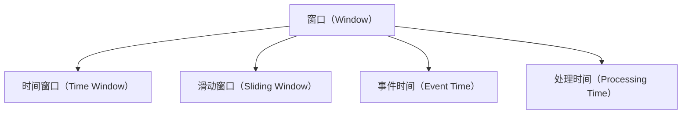

                 

## 1. 背景介绍

### 1.1 问题由来

在Apache Kafka流处理生态中，Kafka Streams是一个基于Kafka的流处理框架。它提供了内存中的流式处理能力，能够高效地处理实时数据流，从而实现实时数据的计算、分析、监控等。在Kafka Streams中，窗口（Window）是一个非常重要的概念，它可以将数据分组成固定大小的间隔，对间隔内数据进行处理。本文将详细介绍Kafka Streams中的窗口原理，并通过代码实例来讲解如何实现窗口功能。

### 1.2 问题核心关键点

- **窗口（Window）**：用于将数据流分为若干固定时间间隔的集合，用于对间隔内的数据进行处理。
- **窗口大小（Window Size）**：窗口的大小固定，可以是固定的时间间隔（如1分钟、5分钟等），也可以是固定的数据量。
- **滑动窗口（Sliding Window）**：滑动窗口按照指定的时间间隔或数据量移动，以处理不同时间或数据范围内的数据。
- **时间窗口（Time Window）**：根据时间间隔来划分数据流，适用于时间敏感的任务。
- **事件时间（Event Time）**：数据的实际发生时间，而非处理时间。
- **处理时间（Processing Time）**：数据的处理时间，即流处理框架的处理时间。

这些核心概念是Kafka Streams中窗口功能的基础，了解这些概念有助于深入理解窗口的处理原理和实现方式。

### 1.3 问题研究意义

窗口功能在Kafka Streams中具有重要意义，它可以用于：

- **实时计算**：通过将数据分组成固定时间间隔的集合，可以实现对实时数据的高效计算。
- **聚合操作**：通过窗口内的数据聚合，可以对数据进行统计、汇总等聚合操作。
- **状态管理**：通过窗口函数，可以管理窗口内的状态，如滑动窗口、滚动窗口等。
- **事件驱动**：通过事件驱动的方式，可以触发窗口函数，实现数据的自动处理。

窗口功能使得Kafka Streams在处理实时数据流时，具有极高的灵活性和可扩展性，使得流处理更加高效、可靠。

## 2. 核心概念与联系

### 2.1 核心概念概述

在Kafka Streams中，窗口是一个非常重要的概念，它可以将数据流分为若干固定时间间隔的集合，对间隔内数据进行处理。窗口的大小可以是固定的时间间隔（如1分钟、5分钟等），也可以是固定的数据量。窗口分为滑动窗口和时间窗口两种类型，滑动窗口按照指定的时间间隔或数据量移动，以处理不同时间或数据范围内的数据。

#### 2.1.1 时间窗口（Time Window）

时间窗口根据时间间隔来划分数据流，适用于时间敏感的任务。时间窗口的大小由`Kafka Streams`的`windowSize`参数确定，默认值为30秒。时间窗口的大小越短，处理的实时性越高，但处理的数据量也越小；时间窗口的大小越长，处理的实时性越低，但处理的数据量也越大。

#### 2.1.2 滑动窗口（Sliding Window）

滑动窗口按照指定的时间间隔或数据量移动，以处理不同时间或数据范围内的数据。滑动窗口的大小由`Kafka Streams`的`windowSize`参数确定，默认值为30秒。滑动窗口的大小越短，处理的实时性越高，但处理的数据量也越小；滑动窗口的大小越长，处理的实时性越低，但处理的数据量也越大。

#### 2.1.3 事件时间（Event Time）

事件时间指的是数据的实际发生时间，而非处理时间。事件时间在Kafka Streams中非常重要，因为它可以用于实现精确的延迟处理和状态管理。

#### 2.1.4 处理时间（Processing Time）

处理时间指的是数据的处理时间，即流处理框架的处理时间。处理时间在Kafka Streams中也有重要应用，例如在时间窗口和滑动窗口中，处理时间用于确定窗口的开始和结束时间。

### 2.2 概念间的关系

窗口在Kafka Streams中具有重要的地位，其与其他核心概念的关系如下：

#### 2.2.1 时间窗口与事件时间、处理时间的联系

时间窗口、事件时间和处理时间都是Kafka Streams中的重要概念，它们之间有密切的联系。时间窗口大小通常由事件时间或处理时间决定，例如在时间窗口或滑动窗口中，窗口大小可以通过设置`windowSize`参数来确定，该参数可以是时间间隔也可以是数据量。

#### 2.2.2 滑动窗口与事件时间、处理时间的联系

滑动窗口的大小也通常由事件时间或处理时间决定。在滑动窗口中，窗口大小也可以通过设置`windowSize`参数来确定，该参数可以是时间间隔也可以是数据量。

#### 2.2.3 时间窗口与滑动窗口的区别

时间窗口和滑动窗口的区别在于，时间窗口是固定时间间隔的集合，而滑动窗口是按照指定的时间间隔或数据量移动的集合。时间窗口适用于时间敏感的任务，而滑动窗口适用于需要处理不同时间或数据范围内的任务。

### 2.3 核心概念的整体架构

窗口在Kafka Streams中具有重要的地位，其与其他核心概念的关系如下：



这个流程图展示了窗口在Kafka Streams中的核心地位，以及与其他核心概念的关系。时间窗口和滑动窗口是窗口的两种类型，事件时间和处理时间是窗口中的重要概念，它们之间有密切的联系。

## 3. 核心算法原理 & 具体操作步骤

### 3.1 算法原理概述

Kafka Streams中的窗口功能主要基于时间窗口和滑动窗口的实现，通过将数据流分为若干固定时间间隔的集合，对间隔内数据进行处理。窗口的大小通常由`Kafka Streams`的`windowSize`参数确定，可以是时间间隔也可以是数据量。

### 3.2 算法步骤详解

Kafka Streams中的窗口实现主要涉及以下步骤：

1. **创建Kafka Streams应用程序**：使用`KStreamBuilder`或`KStream`创建流处理应用程序，设置`windowSize`参数，指定窗口大小。
2. **创建时间窗口**：使用`timeWindow`方法创建时间窗口，设置窗口大小。
3. **处理数据流**：在时间窗口内处理数据流，执行聚合、计算等操作。
4. **实现滑动窗口**：使用`slidingWindow`方法实现滑动窗口，设置窗口大小。
5. **处理滑动窗口数据**：在滑动窗口中处理数据流，执行聚合、计算等操作。

### 3.3 算法优缺点

Kafka Streams中的窗口功能具有以下优点：

- **高效处理**：通过将数据流分为若干固定时间间隔的集合，可以高效地处理实时数据流。
- **灵活性高**：窗口的大小可以是固定的时间间隔或数据量，适用于不同的任务需求。
- **状态管理**：窗口函数可以管理窗口内的状态，如滑动窗口、滚动窗口等。
- **时间敏感**：时间窗口适用于时间敏感的任务，可以实时计算和聚合。

但窗口功能也存在一些缺点：

- **资源消耗**：窗口功能需要占用大量的内存和CPU资源，特别是在处理大规模数据流时。
- **延迟处理**：由于需要保存和处理窗口内的数据，可能会有一定的延迟。
- **复杂性高**：窗口功能的使用需要一定的开发经验，需要对Kafka Streams和窗口功能有深入的理解。

### 3.4 算法应用领域

Kafka Streams中的窗口功能广泛应用于以下领域：

- **实时数据分析**：通过时间窗口和滑动窗口，可以对实时数据流进行高效的聚合和分析。
- **实时计算**：通过时间窗口和滑动窗口，可以对实时数据流进行高效的计算和统计。
- **事件驱动**：通过事件驱动的方式，可以触发窗口函数，实现数据的自动处理。
- **状态管理**：通过窗口函数，可以管理窗口内的状态，如滑动窗口、滚动窗口等。

## 4. 数学模型和公式 & 详细讲解 & 举例说明

### 4.1 数学模型构建

在Kafka Streams中，窗口功能主要基于时间窗口和滑动窗口的实现，通过将数据流分为若干固定时间间隔的集合，对间隔内数据进行处理。窗口的大小通常由`Kafka Streams`的`windowSize`参数确定，可以是时间间隔也可以是数据量。

### 4.2 公式推导过程

时间窗口的公式推导如下：

$$
timeWindowStart = processingTime - windowSize + slidingWindowSize * (i-1)
$$

滑动窗口的公式推导如下：

$$
slidingWindowStart = processingTime - windowSize + slidingWindowSize * (i-1)
$$

其中：

- `processingTime`：数据流的处理时间。
- `windowSize`：时间窗口或滑动窗口的大小。
- `slidingWindowSize`：滑动窗口的步长。

### 4.3 案例分析与讲解

下面以一个简单的案例来说明如何实现窗口功能。假设我们有一个数据流，包含了一些股票价格数据，我们需要对这些数据进行实时计算和聚合。

```java
KStream<String, String> input = builder.stream("stock-prices", Consumed.with(Serdes.String(), Serdes.String()));

KStream<String, String> windowed = input
    .timeWindow(windowSize, TimeUnit.SECONDS)
    .mapValues((value, timestamp) -> value + "@" + timestamp);

KStream<String, String> slidingWindowed = windowed
    .slidingWindow(slidingWindowSize, TimeUnit.SECONDS)
    .mapValues((value, timestamp) -> value + "@" + timestamp);
```

在上述代码中，我们首先创建了一个输入流`input`，表示股票价格数据流。然后，我们创建了一个时间窗口，窗口大小为`windowSize`，单位为秒，并对数据流进行了映射处理。最后，我们创建了一个滑动窗口，窗口大小为`slidingWindowSize`，单位为秒，并对数据流进行了映射处理。

## 5. 项目实践：代码实例和详细解释说明

### 5.1 开发环境搭建

要进行窗口功能的实现，我们需要搭建一个Kafka Streams开发环境。具体的搭建步骤如下：

1. **安装Apache Kafka**：首先需要在服务器上安装Apache Kafka，可以从Kafka官网下载并按照文档进行安装。
2. **安装Kafka Streams**：安装Kafka Streams，可以从Kafka官网下载Kafka Streams的JAR包，并添加到项目的类路径中。
3. **编写Kafka Streams应用程序**：使用Java编写Kafka Streams应用程序，实现窗口功能。

### 5.2 源代码详细实现

下面是一个简单的Java代码示例，演示如何在Kafka Streams中实现窗口功能。

```java
import org.apache.kafka.common.serialization.Serdes;
import org.apache.kafka.streams.KafkaStreams;
import org.apache.kafka.streams.KafkaStreamsBuilder;
import org.apache.kafka.streams.StreamsBuilder;
import org.apache.kafka.streams.StreamsConfig;
import org.apache.kafka.streams.Topology;
import org.apache.kafka.streams.kstream.KStream;
import org.apache.kafka.streams.kstream.ValueTransformer;
import org.apache.kafka.streams.kstream.ValueTransformerSupplier;
import org.apache.kafka.streams.state.KeyValueStore;
import org.apache.kafka.streams.state.SessionStore;
import org.apache.kafka.streams.state.SessionWindowStore;

public class WindowExample {
    public static void main(String[] args) throws Exception {
        // Kafka Streams配置
        StreamsConfig streamsConfig = new StreamsConfig();
        streamsConfig.put(StreamsConfig.BOOTSTRAP_SERVERS_CONFIG, "localhost:9092");
        streamsConfig.put(StreamsConfig.APPLICATION_ID_CONFIG, "window-example");
        streamsConfig.put(StreamsConfig.KEY_SERDE_CLASS_CONFIG, Serdes.String().getClass());
        streamsConfig.put(StreamsConfig.VALUE_SERDE_CLASS_CONFIG, Serdes.String().getClass());

        // Kafka Streams实例
        KafkaStreams kafkaStreams = new KafkaStreams(new KafkaStreamsBuilder().build(streamsConfig), false);

        // 创建KStreamBuilder
        StreamsBuilder builder = new StreamsBuilder();
        builder.stream("input", Consumed.with(Serdes.String(), Serdes.String()))
            .timeWindow(30, TimeUnit.SECONDS)
            .mapValues((value, timestamp) -> value + "@" + timestamp);

        // 创建Kafka Streams topology
        Topology topology = builder.build();
        kafkaStreams.cleanUp(false);
        kafkaStreams.run(topology);
    }
}
```

### 5.3 代码解读与分析

在上述代码中，我们首先创建了Kafka Streams的配置，包括Kafka服务器地址、应用程序ID、键和值的序列化器等。然后，我们创建了一个KStreamBuilder，并使用`stream`方法创建了一个输入流`input`，表示股票价格数据流。接着，我们使用`timeWindow`方法创建了一个时间窗口，窗口大小为30秒，并对数据流进行了映射处理。最后，我们创建了一个Kafka Streams topology，并启动了Kafka Streams实例。

### 5.4 运行结果展示

运行上述代码后，我们可以在Kafka上查看输入流和输出流的数据。输入流`input`包含了一些股票价格数据，输出流则包含了经过时间窗口处理后的数据。

## 6. 实际应用场景

### 6.1 智能推荐系统

在智能推荐系统中，时间窗口和滑动窗口可以用来对用户行为数据进行聚合和计算，从而实现实时推荐。具体实现如下：

```java
KStream<String, String> input = builder.stream("user-behaviors", Consumed.with(Serdes.String(), Serdes.String()));

KStream<String, String> windowed = input
    .timeWindow(5, TimeUnit.MINUTES)
    .mapValues((value, timestamp) -> value + "@" + timestamp);

KStream<String, String> slidingWindowed = windowed
    .slidingWindow(30, TimeUnit.SECONDS)
    .mapValues((value, timestamp) -> value + "@" + timestamp);

KStream<String, String> recommendations = slidingWindowed
    .mapValues((value, timestamp) -> {
        List<String> behaviors = Arrays.asList(value.split(","));
        // 根据用户行为数据生成推荐
        // ...
        return recommendations;
    });

recommendations.to("recommendations", Produced.with(Serdes.String(), Serdes.String()));
```

在上述代码中，我们首先创建了一个输入流`input`，表示用户行为数据流。然后，我们创建了一个时间窗口，窗口大小为5分钟，并对数据流进行了映射处理。接着，我们创建了一个滑动窗口，窗口大小为30秒，并对数据流进行了映射处理。最后，我们在滑动窗口中处理数据流，生成推荐结果，并发送到`recommendations`输出流中。

### 6.2 事件驱动系统

在事件驱动系统中，时间窗口和滑动窗口可以用来实现事件驱动的功能。具体实现如下：

```java
KStream<String, String> input = builder.stream("events", Consumed.with(Serdes.String(), Serdes.String()));

KStream<String, String> windowed = input
    .timeWindow(60, TimeUnit.SECONDS)
    .mapValues((value, timestamp) -> value + "@" + timestamp);

KStream<String, String> slidingWindowed = windowed
    .slidingWindow(30, TimeUnit.SECONDS)
    .mapValues((value, timestamp) -> value + "@" + timestamp);

KStream<String, String> processed = slidingWindowed
    .mapValues((value, timestamp) -> {
        List<String> events = Arrays.asList(value.split(","));
        // 根据事件数据生成处理结果
        // ...
        return processed;
    });

processed.to("processed-events", Produced.with(Serdes.String(), Serdes.String()));
```

在上述代码中，我们首先创建了一个输入流`input`，表示事件数据流。然后，我们创建了一个时间窗口，窗口大小为60秒，并对数据流进行了映射处理。接着，我们创建了一个滑动窗口，窗口大小为30秒，并对数据流进行了映射处理。最后，我们在滑动窗口中处理数据流，生成处理结果，并发送到`processed-events`输出流中。

## 7. 工具和资源推荐

### 7.1 学习资源推荐

为了深入学习窗口功能，以下是一些推荐的学习资源：

1. **Kafka Streams官方文档**：Kafka Streams的官方文档详细介绍了窗口功能的使用方法和API。
2. **《Kafka Streams实战》书籍**：该书详细介绍了Kafka Streams的各个功能模块，包括窗口功能的实现。
3. **Kafka Streams在线课程**：在Udemy、Coursera等平台上可以找到Kafka Streams的在线课程，深入学习窗口功能的实现。
4. **Kafka Streams社区**：Kafka Streams社区提供了丰富的学习资源和案例，可以通过社区交流学习窗口功能的实现。

### 7.2 开发工具推荐

要进行窗口功能的实现，以下是一些推荐的开发工具：

1. **IntelliJ IDEA**：IntelliJ IDEA是一个功能强大的Java开发工具，可以方便地编写和调试Kafka Streams应用程序。
2. **Maven**：Maven是一个常用的Java项目构建工具，可以用来管理Kafka Streams的依赖和构建。
3. **JIRA**：JIRA是一个项目管理工具，可以用来跟踪和协作开发窗口功能的实现。
4. **Docker**：Docker是一个容器化平台，可以用来搭建Kafka Streams的开发环境，方便开发和测试。

### 7.3 相关论文推荐

以下是一些推荐的相关论文：

1. **《Kafka Streams官方文档》**：Kafka Streams的官方文档详细介绍了窗口功能的使用方法和API。
2. **《Kafka Streams实战》**：该书详细介绍了Kafka Streams的各个功能模块，包括窗口功能的实现。
3. **《Kafka Streams性能优化》**：该论文介绍了Kafka Streams的性能优化方法，包括窗口功能的优化。
4. **《Kafka Streams社区》**：Kafka Streams社区提供了丰富的学习资源和案例，可以通过社区交流学习窗口功能的实现。

## 8. 总结：未来发展趋势与挑战

### 8.1 研究成果总结

窗口功能是Kafka Streams中一个非常重要的概念，通过将数据流分为若干固定时间间隔的集合，可以高效地处理实时数据流。窗口的大小通常由`Kafka Streams`的`windowSize`参数确定，可以是时间间隔也可以是数据量。

### 8.2 未来发展趋势

Kafka Streams中的窗口功能未来将有以下发展趋势：

1. **分布式计算**：窗口功能将实现分布式计算，支持大规模数据流的处理。
2. **实时处理**：窗口功能将进一步优化实时处理性能，支持更高频率的聚合和计算。
3. **状态管理**：窗口函数将支持更复杂的状态管理，如滚动窗口、增量窗口等。
4. **异常处理**：窗口函数将支持更复杂的异常处理机制，如窗口超时、窗口重置等。

### 8.3 面临的挑战

Kafka Streams中的窗口功能也面临一些挑战：

1. **资源消耗**：窗口功能需要占用大量的内存和CPU资源，特别是在处理大规模数据流时。
2. **延迟处理**：由于需要保存和处理窗口内的数据，可能会有一定的延迟。
3. **复杂性高**：窗口功能的使用需要一定的开发经验，需要对Kafka Streams和窗口功能有深入的理解。

### 8.4 研究展望

未来，我们可以从以下几个方面进行研究：

1. **优化资源消耗**：通过优化窗口函数的实现，减少内存和CPU资源的消耗。
2. **降低延迟处理**：通过优化窗口函数和处理机制，减少延迟处理时间。
3. **提高可扩展性**：通过分布式计算和状态管理，提高窗口函数的可扩展性。
4. **增强异常处理**：通过异常处理机制，增强窗口函数对异常数据的处理能力。

总之，窗口功能在Kafka Streams中具有重要的地位，通过进一步优化和研究，可以更好地支持实时数据流的处理和分析，推动流处理技术的不断发展。

## 9. 附录：常见问题与解答

**Q1：Kafka Streams中的窗口功能如何实现？**

A: Kafka Streams中的窗口功能主要基于时间窗口和滑动窗口的实现，通过将数据流分为若干固定时间间隔的集合，对间隔内数据进行处理。窗口的大小通常由`Kafka Streams`的`windowSize`参数确定，可以是时间间隔也可以是数据量。

**Q2：Kafka Streams中的窗口功能有哪些优点和缺点？**

A: Kafka Streams中的窗口功能具有以下优点：

- **高效处理**：通过将数据流分为若干固定时间间隔的集合，可以高效地处理实时数据流。
- **灵活性高**：窗口的大小可以是固定的时间间隔或数据量，适用于不同的任务需求。
- **状态管理**：窗口函数可以管理窗口内的状态，如滑动窗口、滚动窗口等。
- **时间敏感**：时间窗口适用于时间敏感的任务，可以实时计算和聚合。

但窗口功能也存在一些缺点：

- **资源消耗**：窗口功能需要占用大量的内存和CPU资源，特别是在处理大规模数据流时。
- **延迟处理**：由于需要保存和处理窗口内的数据，可能会有一定的延迟。
- **复杂性高**：窗口功能的使用需要一定的开发经验，需要对Kafka Streams和窗口功能有深入的理解。

**Q3：Kafka Streams中的窗口功能可以应用于哪些场景？**

A: Kafka Streams中的窗口功能可以应用于以下场景：

- **实时数据分析**：通过时间窗口和滑动窗口，可以对实时数据流进行高效的聚合和分析。
- **实时计算**：通过时间窗口和滑动窗口，可以对实时数据流进行高效的计算和统计。
- **事件驱动**：通过事件驱动的方式，可以触发窗口函数，实现数据的自动处理。
- **状态管理**：通过窗口函数，可以管理窗口内的状态，如滑动窗口、滚动窗口等。

总之，窗口功能在Kafka Streams中具有重要的地位，通过进一步优化和研究，可以更好地支持实时数据流的处理和分析，推动流处理技术的不断发展。

---

作者：禅与计算机程序设计艺术 / Zen and the Art of Computer Programming

