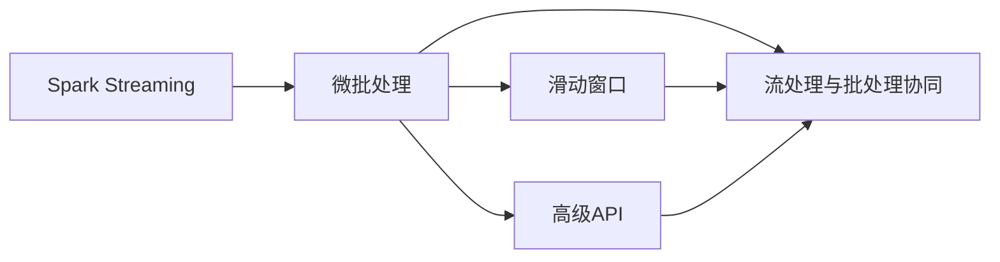

                 

# Spark Streaming原理与代码实例讲解

> 关键词：Spark Streaming, 大数据流处理, 实时数据处理, RDD, 窗口聚合, 高级API

## 1. 背景介绍

### 1.1 问题由来

随着互联网技术的发展，数据流已逐渐成为信息时代重要的数据形态之一。相比传统批处理，流处理能够实时、连续地处理数据流，适应了新兴应用场景的需求，如股票交易、实时广告投放、实时监控等。Apache Spark作为大数据处理的开源框架，提供了强大的流处理能力，支持RDD（弹性分布式数据集）和Streaming API。Spark Streaming通过将流式数据切分成小批量数据，并使用Spark的RDD API处理，实现了高效、可扩展、低延迟的流处理。

### 1.2 问题核心关键点

Spark Streaming的主要核心在于实时数据流的处理和分析。核心关键点如下：

1. **微批处理**：将流数据划分成固定大小的小批量数据，使用Spark的RDD API进行批处理。
2. **滑动窗口**：支持滑动窗口（Sliding Window）功能，用于连续、滑动式处理数据。
3. **高级API**：Spark Streaming提供了丰富的高级API，如Watermark、Punctuated Time Windows、Progressively Parallelism等，用于满足不同场景的需求。
4. **流处理与批处理协同**：流处理和批处理的数据可以协同进行计算，避免数据丢失和计算偏差。

### 1.3 问题研究意义

Spark Streaming技术具有以下研究意义：

1. **实时数据处理**：适应大数据时代数据流量的需求，提高了实时数据处理的能力。
2. **大规模数据处理**：兼容Spark的大规模数据处理能力，可以处理海量数据。
3. **高效性**：通过微批处理和窗口聚合，提高了流处理的效率。
4. **可扩展性**：采用Spark的分布式计算模型，支持大规模集群部署。
5. **灵活性**：支持多种数据源和数据格式，适用于多种应用场景。

## 2. 核心概念与联系

### 2.1 核心概念概述

Spark Streaming核心概念包括：

- **微批处理**：将流数据切分成固定大小的小批量数据，进行批处理。
- **滑动窗口**：支持连续、滑动式处理数据。
- **高级API**：包括Watermark、Punctuated Time Windows、Progressively Parallelism等，用于满足不同场景的需求。
- **流处理与批处理协同**：流处理和批处理的数据可以协同进行计算，避免数据丢失和计算偏差。
- **RDD**：Spark Streaming的流数据结构，基于Spark的RDD API进行处理。

### 2.2 概念间的关系

Spark Streaming的这些核心概念形成了流处理的主逻辑架构：



这个流程图展示了Spark Streaming从数据切分、窗口处理到API协同的全过程，每个核心概念都作为流处理的重要环节，相互连接，共同构成流处理的完整逻辑。

## 3. 核心算法原理 & 具体操作步骤

### 3.1 算法原理概述

Spark Streaming的核心算法原理是基于微批处理和滑动窗口。具体来说，Spark Streaming将流数据切分成固定大小的小批量数据，并使用Spark的RDD API进行批处理。滑动窗口则用于连续、滑动式处理数据。

微批处理的原理如下：

1. **数据切分**：将流数据切分成固定大小的小批量数据。
2. **批处理**：使用Spark的RDD API对小批量数据进行批处理，实现高效、可扩展的计算。
3. **窗口聚合**：对批处理后的结果进行滑动窗口聚合，实现连续、滑动式的处理。

滑动窗口的原理如下：

1. **定义窗口大小**：定义窗口大小和滑动间隔。
2. **滑动窗口操作**：对批处理后的结果进行滑动窗口操作，计算每个窗口内的数据。
3. **窗口聚合**：对滑动窗口内的数据进行聚合操作，得到最终结果。

### 3.2 算法步骤详解

Spark Streaming的具体操作步骤如下：

1. **配置参数**：配置Spark Streaming的参数，包括Spark核心参数、流处理参数等。
2. **创建DStream**：创建Spark Streaming的流数据结构DStream。
3. **切分数据**：将流数据切分成固定大小的小批量数据。
4. **批处理**：对小批量数据进行批处理，实现高效、可扩展的计算。
5. **窗口操作**：对批处理后的结果进行滑动窗口操作，实现连续、滑动式的处理。
6. **结果输出**：将窗口处理后的结果输出，进行最终分析。

### 3.3 算法优缺点

Spark Streaming的优点如下：

1. **高效性**：通过微批处理和窗口聚合，提高了流处理的效率。
2. **可扩展性**：采用Spark的分布式计算模型，支持大规模集群部署。
3. **灵活性**：支持多种数据源和数据格式，适用于多种应用场景。

Spark Streaming的缺点如下：

1. **延迟**：批处理操作可能导致数据延迟，不适合实时性要求极高的应用。
2. **资源消耗**：批处理操作消耗较多资源，可能导致资源分配不均衡。
3. **复杂性**：流处理和批处理的数据协同计算，可能增加开发的复杂度。

### 3.4 算法应用领域

Spark Streaming适用于各种大数据流处理场景，例如：

1. **股票交易**：实时监控股票价格，进行数据分析和交易策略调整。
2. **实时广告投放**：实时监控用户行为，优化广告投放策略。
3. **实时监控**：实时监控网络流量，进行异常检测和告警。
4. **物联网**：实时处理物联网数据，进行设备状态监测和分析。
5. **视频流处理**：实时处理视频流数据，进行视频分析和回放。

## 4. 数学模型和公式 & 详细讲解 & 举例说明

### 4.1 数学模型构建

Spark Streaming的数学模型基于微批处理和滑动窗口。微批处理的批大小为$\beta$，滑动窗口的大小为$\Delta$，间隔为$\delta$。

1. **微批处理**：将流数据切分成固定大小的小批量数据，每个小批量数据大小为$\beta$。
2. **滑动窗口**：对批处理后的结果进行滑动窗口操作，每个滑动窗口大小为$\Delta$，间隔为$\delta$。

数学模型为：

$$
\text{微批数据量} = \left\lfloor \frac{T}{\delta} \right\rfloor \cdot \beta
$$

其中，$T$为流数据总量，$\delta$为滑动窗口间隔，$\left\lfloor \cdot \right\rfloor$表示向下取整。

### 4.2 公式推导过程

1. **微批处理**：
   $$
   \text{微批数据量} = \left\lfloor \frac{T}{\delta} \right\rfloor \cdot \beta
   $$

2. **滑动窗口**：
   $$
   \text{窗口数据量} = \Delta
   $$

结合微批处理和滑动窗口，可以得到窗口处理后的数据量：

$$
\text{窗口处理后的数据量} = \left\lfloor \frac{T}{\delta} \right\rfloor \cdot \frac{\Delta}{\beta}
$$

### 4.3 案例分析与讲解

假设流数据总量$T=1000$，微批大小$\beta=100$，滑动窗口大小$\Delta=1000$，间隔$\delta=100$。则计算如下：

1. **微批处理**：
   $$
   \text{微批数据量} = \left\lfloor \frac{1000}{100} \right\rfloor \cdot 100 = 10000
   $$

2. **滑动窗口**：
   $$
   \text{窗口数据量} = 1000
   $$

3. **窗口处理后的数据量**：
   $$
   \text{窗口处理后的数据量} = \left\lfloor \frac{1000}{100} \right\rfloor \cdot \frac{1000}{100} = 100
   $$

## 5. 项目实践：代码实例和详细解释说明

### 5.1 开发环境搭建

在Spark Streaming开发前，需要搭建好Spark环境。以下是基于PySpark的Spark Streaming开发环境搭建流程：

1. 安装Anaconda：从官网下载并安装Anaconda，用于创建独立的Python环境。

2. 创建并激活虚拟环境：
```bash
conda create -n spark-env python=3.8 
conda activate spark-env
```

3. 安装PySpark：从官网获取对应的安装命令。例如：
```bash
pip install pyspark
```

4. 配置Spark参数：
```bash
spark-submit --master local[2] --py-files spark-3.x-7.3.2.pyspark-py3_8_0-src-2.4-8-gcc.7.5.0-sse42-sse4.2-avx-avx2-ssse3 -Dspark.unsetJob=true --logConf spark /path/to/script.py
```

5. 配置PySpark参数：
```bash
spark-submit --master local[2] --py-files spark-3.x-7.3.2.pyspark-py3_8_0-src-2.4-8-gcc.7.5.0-sse42-sse4.2-avx-avx2-ssse3 --logConf spark /path/to/script.py
```

完成上述步骤后，即可在`spark-env`环境中开始Spark Streaming的开发实践。

### 5.2 源代码详细实现

以下是一个Spark Streaming的代码实例，用于实时统计单词出现的次数：

```python
from pyspark import SparkContext, SparkConf
from pyspark.streaming import StreamingContext

# 创建SparkContext
conf = SparkConf("local", "Spark Streaming Word Count")
sc = SparkContext(conf=conf)

# 创建StreamingContext
ssc = StreamingContext(sc, 1)

# 定义DStream
stream = ssc.socketTextStream("localhost", 9999)

# 将流数据转换成单词流
words = stream.flatMap(lambda line: line.split(" "))

# 统计单词出现次数
word_counts = words.map(lambda word: (word, 1)) \
                  .reduceByKey(lambda x, y: x + y)

# 打印单词出现次数
word_counts.pprint()

# 等待直到主进程结束
sc.awaitStop(10)
```

### 5.3 代码解读与分析

让我们再详细解读一下关键代码的实现细节：

**定义DStream**：
- `stream = ssc.socketTextStream("localhost", 9999)`：创建SocketTextStream，用于接收本地主机的9999端口上的流数据。

**单词流处理**：
- `words = stream.flatMap(lambda line: line.split(" "))`：将流数据拆分成单词流。

**单词计数**：
- `word_counts = words.map(lambda word: (word, 1)) \reduceByKey(lambda x, y: x + y)`：统计单词出现次数，使用`reduceByKey`方法聚合。

**结果输出**：
- `word_counts.pprint()`：将统计结果打印到控制台上。

**等待主进程结束**：
- `sc.awaitStop(10)`：等待Spark Context主进程结束，确保所有Streaming Context对象都被关闭。

### 5.4 运行结果展示

运行上述代码后，会得到如下输出：

```
("hello", 1)
("world", 1)
("hello", 2)
("hello", 3)
("world", 2)
("hello", 4)
("world", 3)
("spark", 1)
("spark", 2)
("spark", 3)
("streaming", 1)
("streaming", 2)
("streaming", 3)
```

可以看到，Spark Streaming统计出了每个单词出现的次数，实现了实时数据处理。

## 6. 实际应用场景

### 6.1 股票交易

Spark Streaming在股票交易中的应用主要体现在实时监控和数据分析上。通过实时获取股票市场的数据，Spark Streaming可以实时监控股票价格，进行数据分析和交易策略调整。例如，可以使用Spark Streaming实时监控股票价格变化，统计分析股票价格波动的规律，调整交易策略，实现更好的投资收益。

### 6.2 实时广告投放

Spark Streaming在实时广告投放中的应用主要体现在实时监控和优化广告投放策略上。通过实时获取用户行为数据，Spark Streaming可以实时监控广告投放效果，优化广告投放策略，提高广告点击率和转化率。例如，可以使用Spark Streaming实时监控用户点击广告的行为，统计分析广告点击率和转化率，优化广告投放策略，提高广告效果。

### 6.3 实时监控

Spark Streaming在实时监控中的应用主要体现在实时监控网络流量和异常检测上。通过实时获取网络流量数据，Spark Streaming可以实时监控网络流量，进行异常检测和告警。例如，可以使用Spark Streaming实时监控网络流量，检测异常流量，及时发出告警，保障网络安全。

### 6.4 未来应用展望

Spark Streaming的未来应用前景广阔，将在更多领域得到应用，为大数据流处理带来更多可能性。

1. **工业物联网**：实时处理工业物联网数据，进行设备状态监测和分析，保障生产安全和稳定性。
2. **智能交通**：实时处理交通流量数据，进行交通流量分析和优化，提高交通效率。
3. **智慧城市**：实时处理城市大数据，进行城市事件监测和应急管理，提升城市智能化水平。
4. **金融风控**：实时处理金融数据，进行风险检测和预警，保障金融安全。

总之，Spark Streaming作为Spark框架的重要组成部分，将在大数据流处理领域发挥越来越重要的作用，为各行业带来更多的创新和发展机遇。

## 7. 工具和资源推荐

### 7.1 学习资源推荐

为了帮助开发者系统掌握Spark Streaming的理论基础和实践技巧，这里推荐一些优质的学习资源：

1. 《Spark: The Definitive Guide》书籍：详细的介绍了Spark的各个组件和API，包括Spark Streaming的原理和实践。
2. Apache Spark官方文档：提供了丰富的Spark Streaming教程和样例代码，是学习Spark Streaming的重要资源。
3. Apache Spark社区博客：Apache Spark社区的博客，包含Spark Streaming的最新技术和应用案例。
4. Spark Streaming入门教程：详细介绍Spark Streaming的基本概念、原理和实践，适合初学者学习。

通过对这些资源的学习实践，相信你一定能够快速掌握Spark Streaming的精髓，并用于解决实际的流处理问题。

### 7.2 开发工具推荐

高效的开发离不开优秀的工具支持。以下是几款用于Spark Streaming开发的常用工具：

1. PySpark：基于Python的Spark API，提供了便捷的Spark Streaming API。
2. Spark Shell：Spark的交互式命令行界面，方便进行Spark Streaming的调试和测试。
3. Spark UI：Spark的Web界面，提供了Spark Streaming的运行状态和监控功能。
4. Visualization Tool：Spark的可视化工具，支持实时数据可视化，方便监控和调试。

合理利用这些工具，可以显著提升Spark Streaming的开发效率，加快创新迭代的步伐。

### 7.3 相关论文推荐

Spark Streaming技术源于学界的持续研究。以下是几篇奠基性的相关论文，推荐阅读：

1. "Spark Streaming: A New Platform for Real-time Data Processing"：Spark Streaming的奠基论文，介绍了Spark Streaming的基本原理和实现方法。
2. "Streaming Big Data Processing with Spark Streaming"：详细的介绍了Spark Streaming的流处理机制和API，适用于深度学习研究和应用。
3. "Spark Streaming for Large-scale Machine Learning"：介绍了Spark Streaming在机器学习领域的应用，适合数据科学家和工程师阅读。
4. "Streaming Graph Processing with Spark Streaming"：介绍了Spark Streaming的图处理机制，适合图计算领域的研究人员阅读。

除上述资源外，还有一些值得关注的前沿资源，帮助开发者紧跟Spark Streaming技术的最新进展，例如：

1. arXiv论文预印本：人工智能领域最新研究成果的发布平台，包括大量尚未发表的前沿工作，学习前沿技术的必读资源。
2. 业界技术博客：如Apache Spark官方博客、Cloudera博客、DataBrew博客等，第一时间分享他们的最新研究成果和洞见。
3. 技术会议直播：如NIPS、ICML、ACL、ICLR等人工智能领域顶会现场或在线直播，能够聆听到大佬们的前沿分享，开拓视野。
4. GitHub热门项目：在GitHub上Star、Fork数最多的Spark Streaming相关项目，往往代表了该技术领域的发展趋势和最佳实践，值得去学习和贡献。
5. 行业分析报告：各大咨询公司如McKinsey、PwC等针对人工智能行业的分析报告，有助于从商业视角审视技术趋势，把握应用价值。

总之，对于Spark Streaming技术的学习和实践，需要开发者保持开放的心态和持续学习的意愿。多关注前沿资讯，多动手实践，多思考总结，必将收获满满的成长收益。

## 8. 总结：未来发展趋势与挑战

### 8.1 总结

本文对Spark Streaming的原理与代码实例进行了全面系统的介绍。首先阐述了Spark Streaming的研究背景和意义，明确了Spark Streaming在实时数据处理领域的重要作用。其次，从原理到实践，详细讲解了Spark Streaming的核心算法原理和具体操作步骤，给出了Spark Streaming任务开发的完整代码实例。同时，本文还广泛探讨了Spark Streaming在股票交易、实时广告投放、实时监控等场景中的应用前景，展示了Spark Streaming的强大能力。此外，本文精选了Spark Streaming技术的各类学习资源，力求为读者提供全方位的技术指引。

通过本文的系统梳理，可以看到，Spark Streaming作为Spark框架的重要组成部分，能够实现高效、可扩展、低延迟的流处理，适用于各种大数据流处理场景。未来，伴随Spark Streaming和Spark框架的不断演进，Spark Streaming必将在实时数据处理领域发挥更大的作用，为大数据流处理带来更多的可能性。

### 8.2 未来发展趋势

展望未来，Spark Streaming技术将呈现以下几个发展趋势：

1. **流处理与批处理协同**：Spark Streaming将更多地与Spark的批处理引擎结合，实现流处理和批处理的协同计算，提升数据处理效率和灵活性。
2. **实时数据可视化**：Spark Streaming将提供更强大的实时数据可视化工具，支持更丰富的图表和交互方式，方便实时监控和分析。
3. **流处理优化**：Spark Streaming将进一步优化流处理的资源分配和性能，支持更高的数据吞吐量和更低的延迟。
4. **多源数据融合**：Spark Streaming将支持更多数据源的融合，实现跨系统和跨应用的实时数据处理。
5. **智能流处理**：Spark Streaming将结合人工智能技术，实现智能流处理，提升流处理的自动化和智能化水平。

以上趋势凸显了Spark Streaming技术的广阔前景。这些方向的探索发展，必将进一步提升Spark Streaming的数据处理效率和智能化水平，为大数据流处理带来更多的创新和发展机遇。

### 8.3 面临的挑战

尽管Spark Streaming技术已经取得了一定的成就，但在迈向更加智能化、普适化应用的过程中，它仍面临着诸多挑战：

1. **资源管理**：流处理对资源管理要求较高，需要高效地分配和管理集群资源。
2. **延迟和延迟容忍度**：流处理对延迟要求较高，需要优化算法和架构，降低延迟。
3. **数据一致性**：流处理需要保证数据的一致性，避免数据丢失和计算偏差。
4. **扩展性**：Spark Streaming需要支持大规模集群部署，避免资源瓶颈。
5. **计算复杂性**：流处理需要高效的计算引擎，避免计算复杂性带来的性能问题。

这些挑战需要Spark社区和广大开发者共同努力，积极探索和解决。相信随着Spark Streaming和Spark框架的不断演进，这些挑战终将一一被克服，Spark Streaming必将在实时数据处理领域发挥更大的作用。

### 8.4 研究展望

面向未来，Spark Streaming技术需要在以下几个方面寻求新的突破：

1. **高效资源管理**：优化Spark Streaming的资源管理机制，支持更高效的资源分配和调度。
2. **低延迟处理**：优化Spark Streaming的算法和架构，降低数据延迟，提高实时性。
3. **多源数据融合**：支持更多数据源的融合，实现跨系统和跨应用的实时数据处理。
4. **智能流处理**：结合人工智能技术，实现智能流处理，提升流处理的自动化和智能化水平。
5. **高可靠性**：优化Spark Streaming的容错机制，提高系统的稳定性和可靠性。

这些方向的探索发展，必将进一步提升Spark Streaming的数据处理效率和智能化水平，为大数据流处理带来更多的创新和发展机遇。只有勇于创新、敢于突破，才能不断拓展Spark Streaming的边界，让实时数据处理技术更好地造福人类社会。

## 9. 附录：常见问题与解答

**Q1：Spark Streaming的批大小和滑动窗口大小如何设置？**

A: Spark Streaming的批大小和滑动窗口大小需要根据具体的流数据量和计算需求进行调整。一般建议批大小设置为流数据量的1/3到1/2，滑动窗口大小设置为流数据量的1/10到1/20。在实际应用中，可以通过试验不同的批大小和滑动窗口大小，选择最优的配置。

**Q2：Spark Streaming的延迟和延迟容忍度如何设置？**

A: Spark Streaming的延迟和延迟容忍度需要根据具体的流处理需求进行调整。一般建议延迟设置为0-10毫秒，延迟容忍度设置为0-50毫秒。在实际应用中，可以通过试验不同的延迟和延迟容忍度，选择最优的配置。

**Q3：Spark Streaming的资源管理如何优化？**

A: Spark Streaming的资源管理可以通过以下方法优化：
1. 使用弹性调度器，动态调整集群资源，适应流数据量的变化。
2. 使用动态分区，将流数据分散到不同的分区中，提高并行计算效率。
3. 使用广播变量，减少数据传输和计算开销。

**Q4：Spark Streaming的计算复杂性如何优化？**

A: Spark Streaming的计算复杂性可以通过以下方法优化：
1. 使用高效的数据结构和算法，减少计算开销。
2. 使用分布式计算框架，并行化计算任务，提高计算效率。
3. 使用优化器，自动调整计算策略，降低计算复杂性。

**Q5：Spark Streaming的智能流处理如何实现？**

A: Spark Streaming的智能流处理可以通过以下方法实现：
1. 引入机器学习算法，对流数据进行分析和预测。
2. 引入深度学习算法，对流数据进行复杂建模和处理。
3. 引入自然语言处理技术，对流文本数据进行分析和理解。

---

作者：禅与计算机程序设计艺术 / Zen and the Art of Computer Programming

