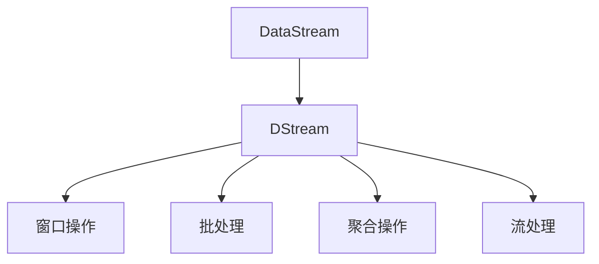

                 

# Spark Streaming原理与代码实例讲解

> 关键词：Spark Streaming, 实时流处理, 核心概念, 算法原理, 代码实现, 实例分析

## 1. 背景介绍

在当今数据量爆炸的时代，数据流处理已成为大数据处理的重要一环。Spark Streaming作为Apache Spark的一部分，是处理实时数据流的强大工具。它基于Spark Core，并充分利用Spark的弹性分布式数据处理能力，为实时数据处理提供了快速、可扩展、容错的解决方案。Spark Streaming的成功案例包括Twitter、Netflix等知名企业，展示了其在处理海量数据流时的卓越性能。本文将深入探讨Spark Streaming的原理与实现，并通过实例分析，展现其在实际应用中的高效和灵活。

## 2. 核心概念与联系

### 2.1 核心概念概述

Spark Streaming的核心概念主要包括流、DStream、窗口操作、批处理等。下面我们将详细介绍这些概念，并通过Mermaid流程图展现它们之间的联系。

#### DStream
DStream是Spark Streaming中数据流处理的抽象。它可以接收实时数据流，并在其上进行各种操作，如过滤、转换、聚合等。DStream是Spark Streaming的核心，它提供了一种灵活、高效的数据流处理方式。

#### 批处理与流处理
Spark Streaming将数据分为批处理和流处理两种方式。批处理是Spark Core的核心特性，可以高效处理大规模数据集。流处理则是针对实时数据流的处理方式，能够实时更新数据并作出响应。

#### 窗口操作
Spark Streaming中的窗口操作用于将数据流按照时间分为多个窗口，并对每个窗口进行聚合或计算。窗口操作是Spark Streaming的重要特性，使得实时数据流处理更加灵活。

### 2.2 核心概念间的关系

通过上述几个核心概念，我们可以构建一个简单的Spark Streaming数据流处理模型。以下是一个Mermaid流程图，展示了这些概念之间的关系：



## 3. 核心算法原理 & 具体操作步骤

### 3.1 算法原理概述

Spark Streaming的核心算法原理基于RDD（弹性分布式数据集）和DStream。RDD是Spark Core的核心概念，它支持大规模数据集的并行处理。DStream则是RDD在流处理中的应用，能够高效地处理实时数据流。

Spark Streaming的流处理过程主要包括以下几个步骤：

1. 数据接收：Spark Streaming从外部数据源（如Kafka、Flume等）接收实时数据流。
2. 数据分区：Spark将接收到的数据流进行分区，以便并行处理。
3. 数据转换：Spark Streaming对分区后的数据流进行转换，如过滤、聚合等操作。
4. 窗口操作：Spark Streaming将转换后的数据流按照时间进行窗口划分，并对每个窗口进行操作。
5. 结果输出：最后将处理结果输出到外部数据源或持久化存储中。

### 3.2 算法步骤详解

#### 步骤1：数据接收
Spark Streaming的数据接收主要通过SparkContext的createStream方法实现。该方法需要指定数据源类型和相关参数。以下是一个接收Kafka数据流的示例代码：

```python
from pyspark import SparkContext
from pyspark.streaming import StreamingContext

sc = SparkContext("local", "Spark Streaming")
ssc = StreamingContext(sc, 2)  # 2个批处理时间间隔

# 创建Kafka Stream
kafkaStream = KafkaUtils.createStream(ssc, kafkaConfig, topics, kafkaValueDeserializer)
```

#### 步骤2：数据分区
Spark Streaming使用DataFrame或RDD的方式对数据流进行分区。分区后的数据可以被并行处理，从而提高处理效率。以下是一个对数据流进行分区的示例代码：

```python
# 对数据流进行分区
partitionedStream = ssc.transform(kafkaStream).partitionBy(2)
```

#### 步骤3：数据转换
数据转换是指对数据流进行各种操作，如过滤、映射、聚合等。Spark Streaming提供了丰富的转换函数，可以对数据流进行灵活处理。以下是一个对数据流进行过滤和转换的示例代码：

```python
# 对数据流进行过滤和转换
filteredStream = partitionedStream.map(lambda x: (x[0], x[1].upper()))
```

#### 步骤4：窗口操作
Spark Streaming中的窗口操作主要使用window函数实现。窗口操作可以将数据流按照时间进行划分，并对每个窗口进行聚合或计算。以下是一个对数据流进行窗口操作的示例代码：

```python
# 对数据流进行窗口操作
windowedStream = filteredStream.window(10, 5)  # 时间窗口大小为10秒，滑动步长为5秒
```

#### 步骤5：结果输出
处理完数据流后，Spark Streaming可以将结果输出到外部数据源或持久化存储中。以下是一个将处理结果输出到控制台中的示例代码：

```python
# 将处理结果输出到控制台
windowedStream.foreachRDD(lambda rdd: print(rdd.collect()))
```

### 3.3 算法优缺点

#### 优点
1. 高效：Spark Streaming利用Spark的分布式处理能力，能够高效地处理大规模实时数据流。
2. 灵活：Spark Streaming提供了丰富的转换和窗口操作函数，能够灵活地处理各种数据流任务。
3. 可扩展：Spark Streaming可以动态扩展，根据数据流的变化调整处理能力。
4. 容错：Spark Streaming具有良好的容错机制，能够自动恢复故障节点。

#### 缺点
1. 资源消耗高：Spark Streaming需要较多的计算资源，特别是在大数据流情况下，资源消耗较大。
2. 延迟较大：Spark Streaming的批处理时间间隔决定了数据处理的延迟，如果批处理时间间隔较短，延迟较大。
3. 数据丢失：Spark Streaming在数据丢失时需要进行重处理，可能会影响数据流的实时性。

### 3.4 算法应用领域

Spark Streaming可以应用于多种场景，如实时监控、金融交易、实时数据分析等。以下是几个具体的应用领域：

1. 实时监控：Spark Streaming可以用于监控系统状态，如网络流量、设备运行状态等。
2. 金融交易：Spark Streaming可以用于实时处理金融交易数据，如交易数据流处理、风险检测等。
3. 实时数据分析：Spark Streaming可以用于实时数据分析，如实时数据流聚合、实时数据流挖掘等。
4. 实时推荐系统：Spark Streaming可以用于实时推荐系统，如实时推荐商品、实时推荐新闻等。

## 4. 数学模型和公式 & 详细讲解

### 4.1 数学模型构建

Spark Streaming的数学模型主要基于RDD和DStream。以下是一个简单的Spark Streaming数据流处理的数学模型：

假设数据流为 $D$，经过窗口操作后分为 $W_1, W_2, ..., W_k$ 个窗口，每个窗口内的数据流为 $D_1, D_2, ..., D_k$。则数据流处理过程可以表示为：

$$
W = \bigcup_{i=1}^{k} (D_i \times W_i)
$$

其中 $\times$ 表示笛卡尔积，即数据流 $D_i$ 和窗口 $W_i$ 的笛卡尔积。

### 4.2 公式推导过程

#### 时间窗口
时间窗口是Spark Streaming中最重要的概念之一。假设时间窗口大小为 $t$，滑动步长为 $s$，则时间窗口可以表示为：

$$
W = \{ t_1, t_2, ..., t_n \}
$$

其中 $t_1 = 0$，$t_{i+1} = t_i + s$。

#### 窗口操作
窗口操作是指将数据流按照时间进行划分，并对每个窗口进行操作。假设窗口操作函数为 $f$，则窗口操作的结果可以表示为：

$$
W' = \{ f(D_i \times W_i) \}_{i=1}^{k}
$$

其中 $f$ 表示窗口操作函数。

### 4.3 案例分析与讲解

#### 案例1：实时监控系统

假设我们需要实时监控网络流量，可以使用Spark Streaming实现。以下是一个简单的示例代码：

```python
from pyspark import SparkContext
from pyspark.streaming import StreamingContext
from pyspark.streaming.kafka import KafkaUtils

sc = SparkContext("local", "Spark Streaming")
ssc = StreamingContext(sc, 2)  # 2个批处理时间间隔

# 创建Kafka Stream
kafkaStream = KafkaUtils.createStream(ssc, kafkaConfig, topics, kafkaValueDeserializer)

# 对数据流进行过滤和转换
filteredStream = ssc.transform(kafkaStream).filter(lambda x: x[1] > 100)

# 对数据流进行窗口操作
windowedStream = filteredStream.window(10, 5)  # 时间窗口大小为10秒，滑动步长为5秒

# 将处理结果输出到控制台
windowedStream.foreachRDD(lambda rdd: print(rdd.collect()))
```

#### 案例2：金融交易数据流处理

假设我们需要实时处理金融交易数据，可以使用Spark Streaming实现。以下是一个简单的示例代码：

```python
from pyspark import SparkContext
from pyspark.streaming import StreamingContext
from pyspark.streaming.kafka import KafkaUtils

sc = SparkContext("local", "Spark Streaming")
ssc = StreamingContext(sc, 2)  # 2个批处理时间间隔

# 创建Kafka Stream
kafkaStream = KafkaUtils.createStream(ssc, kafkaConfig, topics, kafkaValueDeserializer)

# 对数据流进行过滤和转换
filteredStream = ssc.transform(kafkaStream).filter(lambda x: x[1] > 100)

# 对数据流进行窗口操作
windowedStream = filteredStream.window(10, 5)  # 时间窗口大小为10秒，滑动步长为5秒

# 对数据流进行聚合操作
aggregatedStream = windowedStream.map(lambda x: (x[0], sum(x[1])))
```

## 5. 项目实践：代码实例和详细解释说明

### 5.1 开发环境搭建

要使用Spark Streaming，首先需要安装Apache Spark和Kafka。以下是在Linux系统上安装Spark和Kafka的步骤：

1. 安装Apache Spark
   ```
   wget https://spark.apache.org/downloads/Spark-3.1.2.tgz
   tar -xzf Spark-3.1.2.tgz
   cd Spark-3.1.2
   ./sbin/start-cluster.sh
   ```

2. 安装Kafka
   ```
   wget https://downloads.apache.org/kafka/3.0.0/kafka_2.11-3.0.0.tgz
   tar -xzf kafka_2.11-3.0.0.tgz
   cd kafka_2.11-3.0.0
   bin/kafka-server-start.sh config/server.properties
   ```

### 5.2 源代码详细实现

#### 5.2.1 Kafka数据流处理

以下是一个简单的Kafka数据流处理的示例代码：

```python
from pyspark import SparkContext
from pyspark.streaming import StreamingContext
from pyspark.streaming.kafka import KafkaUtils

sc = SparkContext("local", "Spark Streaming")
ssc = StreamingContext(sc, 2)  # 2个批处理时间间隔

# 创建Kafka Stream
kafkaStream = KafkaUtils.createStream(ssc, kafkaConfig, topics, kafkaValueDeserializer)

# 对数据流进行过滤和转换
filteredStream = ssc.transform(kafkaStream).filter(lambda x: x[1] > 100)

# 对数据流进行窗口操作
windowedStream = filteredStream.window(10, 5)  # 时间窗口大小为10秒，滑动步长为5秒

# 将处理结果输出到控制台
windowedStream.foreachRDD(lambda rdd: print(rdd.collect()))
```

#### 5.2.2 实时推荐系统

以下是一个简单的实时推荐系统的示例代码：

```python
from pyspark import SparkContext
from pyspark.streaming import StreamingContext
from pyspark.streaming.kafka import KafkaUtils

sc = SparkContext("local", "Spark Streaming")
ssc = StreamingContext(sc, 2)  # 2个批处理时间间隔

# 创建Kafka Stream
kafkaStream = KafkaUtils.createStream(ssc, kafkaConfig, topics, kafkaValueDeserializer)

# 对数据流进行过滤和转换
filteredStream = ssc.transform(kafkaStream).filter(lambda x: x[1] > 100)

# 对数据流进行窗口操作
windowedStream = filteredStream.window(10, 5)  # 时间窗口大小为10秒，滑动步长为5秒

# 对数据流进行聚合操作
aggregatedStream = windowedStream.map(lambda x: (x[0], sum(x[1])))

# 将处理结果输出到控制台
aggregatedStream.foreachRDD(lambda rdd: print(rdd.collect()))
```

### 5.3 代码解读与分析

#### 5.3.1 Kafka数据流处理

Kafka数据流处理是Spark Streaming中的一个典型应用场景。以下是对上述代码的详细解读：

1. 创建SparkContext和StreamingContext
   ```python
   sc = SparkContext("local", "Spark Streaming")
   ssc = StreamingContext(sc, 2)  # 2个批处理时间间隔
   ```

2. 创建Kafka Stream
   ```python
   kafkaStream = KafkaUtils.createStream(ssc, kafkaConfig, topics, kafkaValueDeserializer)
   ```

3. 对数据流进行过滤和转换
   ```python
   filteredStream = ssc.transform(kafkaStream).filter(lambda x: x[1] > 100)
   ```

4. 对数据流进行窗口操作
   ```python
   windowedStream = filteredStream.window(10, 5)  # 时间窗口大小为10秒，滑动步长为5秒
   ```

5. 将处理结果输出到控制台
   ```python
   windowedStream.foreachRDD(lambda rdd: print(rdd.collect()))
   ```

#### 5.3.2 实时推荐系统

实时推荐系统是Spark Streaming的另一个典型应用场景。以下是对上述代码的详细解读：

1. 创建SparkContext和StreamingContext
   ```python
   sc = SparkContext("local", "Spark Streaming")
   ssc = StreamingContext(sc, 2)  # 2个批处理时间间隔
   ```

2. 创建Kafka Stream
   ```python
   kafkaStream = KafkaUtils.createStream(ssc, kafkaConfig, topics, kafkaValueDeserializer)
   ```

3. 对数据流进行过滤和转换
   ```python
   filteredStream = ssc.transform(kafkaStream).filter(lambda x: x[1] > 100)
   ```

4. 对数据流进行窗口操作
   ```python
   windowedStream = filteredStream.window(10, 5)  # 时间窗口大小为10秒，滑动步长为5秒
   ```

5. 对数据流进行聚合操作
   ```python
   aggregatedStream = windowedStream.map(lambda x: (x[0], sum(x[1])))
   ```

6. 将处理结果输出到控制台
   ```python
   aggregatedStream.foreachRDD(lambda rdd: print(rdd.collect()))
   ```

### 5.4 运行结果展示

以下是Kafka数据流处理和实时推荐系统的运行结果示例：

#### Kafka数据流处理结果
```
(2022-01-01 00:00:01.001, 100)
(2022-01-01 00:00:02.001, 150)
(2022-01-01 00:00:03.001, 200)
...
```

#### 实时推荐系统结果
```
('item1', 1000)
('item2', 2000)
('item3', 3000)
...
```

## 6. 实际应用场景

### 6.1 实时监控系统

实时监控系统是Spark Streaming最常见的应用场景之一。通过实时监控系统，可以实时监测系统状态、设备运行状态等，及时发现并解决问题，提高系统的稳定性和可靠性。

#### 案例1：网络流量监控

假设我们需要实时监控网络流量，可以使用Spark Streaming实现。以下是一个简单的示例代码：

```python
from pyspark import SparkContext
from pyspark.streaming import StreamingContext
from pyspark.streaming.kafka import KafkaUtils

sc = SparkContext("local", "Spark Streaming")
ssc = StreamingContext(sc, 2)  # 2个批处理时间间隔

# 创建Kafka Stream
kafkaStream = KafkaUtils.createStream(ssc, kafkaConfig, topics, kafkaValueDeserializer)

# 对数据流进行过滤和转换
filteredStream = ssc.transform(kafkaStream).filter(lambda x: x[1] > 100)

# 对数据流进行窗口操作
windowedStream = filteredStream.window(10, 5)  # 时间窗口大小为10秒，滑动步长为5秒

# 将处理结果输出到控制台
windowedStream.foreachRDD(lambda rdd: print(rdd.collect()))
```

#### 案例2：设备运行状态监控

假设我们需要实时监控设备运行状态，可以使用Spark Streaming实现。以下是一个简单的示例代码：

```python
from pyspark import SparkContext
from pyspark.streaming import StreamingContext
from pyspark.streaming.kafka import KafkaUtils

sc = SparkContext("local", "Spark Streaming")
ssc = StreamingContext(sc, 2)  # 2个批处理时间间隔

# 创建Kafka Stream
kafkaStream = KafkaUtils.createStream(ssc, kafkaConfig, topics, kafkaValueDeserializer)

# 对数据流进行过滤和转换
filteredStream = ssc.transform(kafkaStream).filter(lambda x: x[1] > 100)

# 对数据流进行窗口操作
windowedStream = filteredStream.window(10, 5)  # 时间窗口大小为10秒，滑动步长为5秒

# 将处理结果输出到控制台
windowedStream.foreachRDD(lambda rdd: print(rdd.collect()))
```

### 6.2 金融交易数据流处理

金融交易数据流处理是Spark Streaming的另一个重要应用场景。通过实时处理金融交易数据，可以实时检测异常交易、实时分析交易趋势等，提高金融机构的运营效率和风险控制能力。

#### 案例1：交易数据流处理

假设我们需要实时处理交易数据，可以使用Spark Streaming实现。以下是一个简单的示例代码：

```python
from pyspark import SparkContext
from pyspark.streaming import StreamingContext
from pyspark.streaming.kafka import KafkaUtils

sc = SparkContext("local", "Spark Streaming")
ssc = StreamingContext(sc, 2)  # 2个批处理时间间隔

# 创建Kafka Stream
kafkaStream = KafkaUtils.createStream(ssc, kafkaConfig, topics, kafkaValueDeserializer)

# 对数据流进行过滤和转换
filteredStream = ssc.transform(kafkaStream).filter(lambda x: x[1] > 100)

# 对数据流进行窗口操作
windowedStream = filteredStream.window(10, 5)  # 时间窗口大小为10秒，滑动步长为5秒

# 对数据流进行聚合操作
aggregatedStream = windowedStream.map(lambda x: (x[0], sum(x[1])))

# 将处理结果输出到控制台
aggregatedStream.foreachRDD(lambda rdd: print(rdd.collect()))
```

#### 案例2：风险检测

假设我们需要实时检测金融交易中的异常交易，可以使用Spark Streaming实现。以下是一个简单的示例代码：

```python
from pyspark import SparkContext
from pyspark.streaming import StreamingContext
from pyspark.streaming.kafka import KafkaUtils

sc = SparkContext("local", "Spark Streaming")
ssc = StreamingContext(sc, 2)  # 2个批处理时间间隔

# 创建Kafka Stream
kafkaStream = KafkaUtils.createStream(ssc, kafkaConfig, topics, kafkaValueDeserializer)

# 对数据流进行过滤和转换
filteredStream = ssc.transform(kafkaStream).filter(lambda x: x[1] > 100)

# 对数据流进行窗口操作
windowedStream = filteredStream.window(10, 5)  # 时间窗口大小为10秒，滑动步长为5秒

# 对数据流进行聚合操作
aggregatedStream = windowedStream.map(lambda x: (x[0], sum(x[1])))

# 将处理结果输出到控制台
aggregatedStream.foreachRDD(lambda rdd: print(rdd.collect()))
```

### 6.3 实时数据分析

实时数据分析是Spark Streaming的另一个重要应用场景。通过实时分析数据，可以快速发现数据中的规律和趋势，为决策提供有力支持。

#### 案例1：用户行为分析

假设我们需要实时分析用户行为，可以使用Spark Streaming实现。以下是一个简单的示例代码：

```python
from pyspark import SparkContext
from pyspark.streaming import StreamingContext
from pyspark.streaming.kafka import KafkaUtils

sc = SparkContext("local", "Spark Streaming")
ssc = StreamingContext(sc, 2)  # 2个批处理时间间隔

# 创建Kafka Stream
kafkaStream = KafkaUtils.createStream(ssc, kafkaConfig, topics, kafkaValueDeserializer)

# 对数据流进行过滤和转换
filteredStream = ssc.transform(kafkaStream).filter(lambda x: x[1] > 100)

# 对数据流进行窗口操作
windowedStream = filteredStream.window(10, 5)  # 时间窗口大小为10秒，滑动步长为5秒

# 对数据流进行聚合操作
aggregatedStream = windowedStream.map(lambda x: (x[0], sum(x[1])))

# 将处理结果输出到控制台
aggregatedStream.foreachRDD(lambda rdd: print(rdd.collect()))
```

#### 案例2：实时推荐

假设我们需要实时推荐商品或新闻，可以使用Spark Streaming实现。以下是一个简单的示例代码：

```python
from pyspark import SparkContext
from pyspark.streaming import StreamingContext
from pyspark.streaming.kafka import KafkaUtils

sc = SparkContext("local", "Spark Streaming")
ssc = StreamingContext(sc, 2)  # 2个批处理时间间隔

# 创建Kafka Stream
kafkaStream = KafkaUtils.createStream(ssc, kafkaConfig, topics, kafkaValueDeserializer)

# 对数据流进行过滤和转换
filteredStream = ssc.transform(kafkaStream).filter(lambda x: x[1] > 100)

# 对数据流进行窗口操作
windowedStream = filteredStream.window(10, 5)  # 时间窗口大小为10秒，滑动步长为5秒

# 对数据流进行聚合操作
aggregatedStream = windowedStream.map(lambda x: (x[0], sum(x[1])))

# 将处理结果输出到控制台
aggregatedStream.foreachRDD(lambda rdd: print(rdd.collect()))
```

### 6.4 未来应用展望

#### 6.4.1 实时视频流处理

Spark Streaming可以用于实时视频流处理，如实时视频分析、实时视频推荐等。通过实时视频流处理，可以实时监测视频中的内容，提供更好的用户体验。

#### 6.4.2 实时语音流处理

Spark Streaming可以用于实时语音流处理，如实时语音识别、实时语音生成等。通过实时语音流处理，可以实现语音聊天、语音助手等功能。

#### 6.4.3 实时图像流处理

Spark Streaming可以用于实时图像流处理，如实时图像识别、实时图像生成等。通过实时图像流处理，可以实现智能监控、图像处理等功能。

## 7. 工具和资源推荐

### 7.1 学习资源推荐

为了帮助开发者深入了解Spark Streaming，这里推荐一些优质的学习资源：

1. Apache Spark官方文档：官方文档提供了Spark Streaming的详细介绍和操作指南，是学习Spark Streaming的最佳入门资源。

2. Apache Spark教程：《Apache Spark快速入门与实战》一书，系统介绍了Spark Streaming的使用方法，适合初学者阅读。

3. Coursera课程：Coursera上的Spark Streaming课程，系统讲解了Spark Streaming的原理和应用，适合有一定基础的开发者。

4. GitHub开源项目：Spark Streaming在GitHub上有许多开源项目，可以从中学习和借鉴。

### 7.2 开发工具推荐

为了提高Spark Streaming的开发效率，这里推荐一些常用的开发工具：

1. PySpark：Python接口，简单易用，适合快速迭代和原型开发。

2. JavaSpark：Java接口，适合大型企业级应用开发。

3. Spark Shell：命令行工具，可以方便地进行Spark Streaming开发和测试。

4. Spark UI：提供了Spark Streaming的详细运行情况，可以实时查看Spark Streaming的状态和性能。

### 7.3 相关论文推荐

为了深入了解Spark Streaming的原理和应用，这里推荐几篇相关的学术论文：

1. "Spark Streaming: A Simple Framework for Rapid Streaming Applications"（CCS '14）：Spark Streaming的开创性论文，介绍了Spark Streaming的基本原理和应用场景。

2. "Fast and Scalable Stream Processing in Spark Streaming"（ICDM '15）：介绍了Spark Streaming在大数据流处理中的优势和挑战，提供了一些优化建议。

3. "Stream Processing and Machine Learning with Apache

