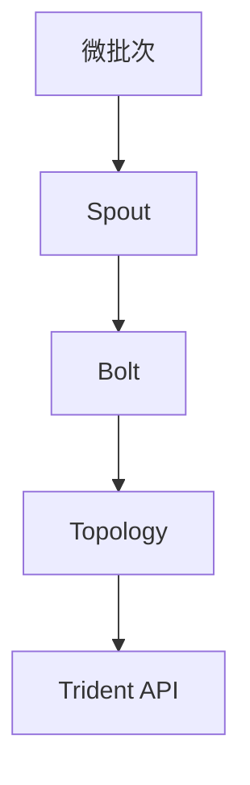
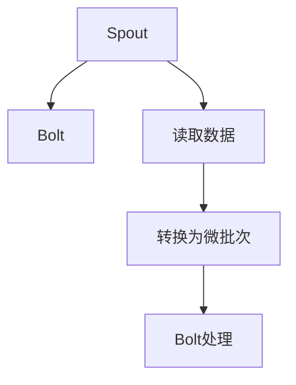
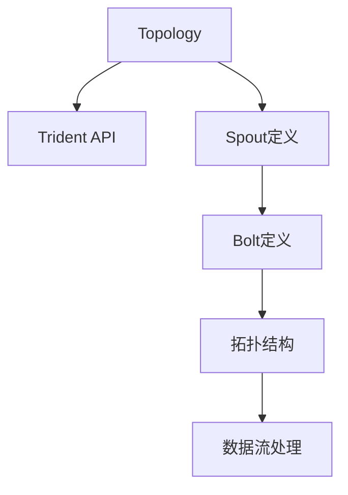
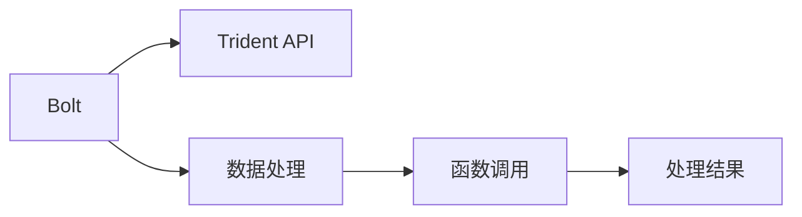
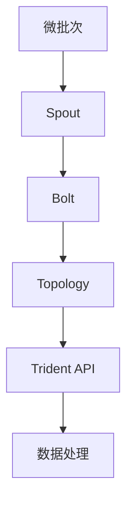

                 

# Storm Trident原理与代码实例讲解

## 1. 背景介绍

Storm Trident是一款分布式实时流处理系统，是Apache Storm项目的延续和升级。它由Apache软件基金会维护，专门用于处理实时数据流。Storm Trident的出现，极大地简化了实时流处理任务，使得开发者可以轻松构建高效、可扩展的流处理系统。

### 1.1 问题由来
随着互联网的迅猛发展，实时数据流处理变得越来越重要。实时数据流包括但不限于Web访问日志、社交媒体消息、传感器数据、事件记录等，这些数据流实时产生、持续变化，需要快速处理和分析。传统的批处理系统无法满足实时处理需求，而Storm Trident则提供了一种高效、灵活的解决方案。

### 1.2 问题核心关键点
Storm Trident的核心设计目标是：
1. 高效处理实时数据流，满足低延迟要求。
2. 提供可扩展的分布式架构，支持大规模数据处理。
3. 提供丰富的组件和工具，简化数据处理流程。
4. 支持多种数据源和存储系统，兼容主流大数据生态。
5. 提供强大的实时监控和运维支持。

Storm Trident通过将实时数据流划分为微批次(Micro-Batch)，利用分布式并行处理，使得它能够高效地处理实时数据流。同时，它还提供了Spout、Bolt、Topology等核心组件，使得开发者可以灵活构建复杂的数据处理流程。

### 1.3 问题研究意义
Storm Trident为实时流处理提供了一种灵活、高效、易于维护的解决方案，具有以下几方面的重要意义：

1. 提升实时数据分析能力。Storm Trident可以实时处理海量数据流，满足企业对实时数据的高需求。
2. 加速数据驱动决策。实时数据分析可以及时发现业务问题，帮助企业做出更快速的决策。
3. 优化系统资源利用。Storm Trident的高效分布式架构，可以在需要时动态调整资源，优化系统性能。
4. 提高系统可扩展性。通过水平扩展拓扑，可以轻松应对数据流量的增长。
5. 降低系统开发复杂度。Storm Trident提供了丰富的组件和工具，大大降低了实时流处理的开发难度。

## 2. 核心概念与联系

### 2.1 核心概念概述
Storm Trident的核心概念包括微批次、Spout、Bolt、Topology、Trident API等，这些概念之间有着紧密的联系。以下我们将详细介绍这些核心概念，并通过Mermaid流程图展示它们之间的关系。

#### 2.1.1 微批次(Micro-Batch)
微批次是指将实时数据流划分为若干个固定大小的批处理单元，每个微批次可以并行处理，从而提高实时数据处理的效率。微批次的大小通常为1秒或更小的间隔，使得系统能够实时响应数据流。

#### 2.1.2 Spout
Spout是Storm Trident中的数据源组件，负责从外部数据源读取数据。Spout可以是从文件系统、数据库、消息队列等外部数据源读取数据，也可以从内存中读取数据。Spout将数据转换为微批次的形式，供后续Bolt组件进行处理。

#### 2.1.3 Bolt
Bolt是Storm Trident中的数据处理组件，负责对微批次数据进行处理。Bolt可以执行各种数据处理任务，如数据清洗、过滤、聚合、计算等。Bolt可以与其他Bolt和Spout进行连接，构成复杂的数据处理流程。

#### 2.1.4 Topology
Topology是Storm Trident中的流处理框架，由Spout和Bolt组成。Topology定义了数据流的拓扑结构，包括Spout、Bolt之间的连接关系和数据流动方向。Topology可以通过配置文件或程序代码进行定义和修改。

#### 2.1.5 Trident API
Trident API是Storm Trident提供的一套高层次抽象API，用于简化数据处理流程。Trident API提供了丰富的数据处理函数和组件，支持各种数据处理任务。通过Trident API，开发者可以轻松构建复杂的数据处理流程，而无需深入了解Storm Trident的内部机制。

这些核心概念之间的关系可以通过以下Mermaid流程图来展示：



通过这个流程图，我们可以清晰地看到微批次、Spout、Bolt、Topology、Trident API之间的关系：微批次是数据流的基本单位，Spout负责数据源读取，Bolt负责数据处理，Topology定义数据流拓扑，Trident API提供高层次抽象API。

### 2.2 概念间的关系

这些核心概念之间存在着紧密的联系，形成了Storm Trident的完整生态系统。以下我们通过几个Mermaid流程图来展示这些概念之间的关系。

#### 2.2.1 微批次与Spout的关系


这个流程图展示了微批次与Spout之间的关系：Spout从数据源读取数据，将数据转换为微批次的形式。

#### 2.2.2 Spout与Bolt的关系



这个流程图展示了Spout与Bolt之间的关系：Spout读取数据并将其转换为微批次，供Bolt进行处理。

#### 2.2.3 Topology与Trident API的关系



这个流程图展示了Topology与Trident API之间的关系：Topology定义了数据流的拓扑结构，Trident API提供了高层次抽象API，用于简化数据处理流程。

#### 2.2.4 Bolt与Trident API的关系



这个流程图展示了Bolt与Trident API之间的关系：Bolt执行数据处理任务，并通过Trident API调用各种函数和组件，进行复杂的数据处理。

### 2.3 核心概念的整体架构

最后，我们用一个综合的流程图来展示这些核心概念在大数据处理中的整体架构：



这个综合流程图展示了从数据源到数据处理的完整过程。微批次是数据流的基本单位，Spout负责数据源读取，Bolt负责数据处理，Topology定义数据流拓扑，Trident API提供高层次抽象API，数据处理任务通过Trident API进行简化。

## 3. 核心算法原理 & 具体操作步骤
### 3.1 算法原理概述

Storm Trident的核心算法原理基于分布式微批次处理，结合Spout、Bolt和Topology等组件，实现了高效、可扩展的实时流处理。以下是Storm Trident的核心算法原理：

#### 3.1.1 微批次处理
微批次处理是Storm Trident的核心算法之一。它将实时数据流划分为若干个固定大小的微批次，每个微批次可以并行处理。微批次的大小通常为1秒或更小的间隔，从而满足实时数据处理的要求。

#### 3.1.2 分布式并行处理
Storm Trident通过分布式并行处理，提高了实时数据处理的效率。每个Spout和Bolt组件都可以分布在多个节点上，并行处理微批次数据。分布式并行处理使得系统能够高效地处理大规模数据流。

#### 3.1.3 动态拓扑调整
Storm Trident支持动态拓扑调整，可以根据实时数据流情况进行调整。动态拓扑调整使得系统能够适应数据流量的变化，提高系统的鲁棒性和可扩展性。

#### 3.1.4 数据一致性保证
Storm Trident通过分布式锁和消息队列等机制，保证了数据的一致性。它确保了同一时刻同一数据流只能被一个Spout或Bolt处理，从而避免了数据冲突和重复处理。

### 3.2 算法步骤详解

以下是Storm Trident的核心算法步骤：

1. 数据源连接和配置：
   - 连接Spout组件到数据源，配置数据源属性，如连接方式、数据格式等。
   - 配置Spout组件的属性，如数据源ID、微批次大小、发送间隔等。

2. 微批次读取和处理：
   - Spout组件从数据源读取数据，并将数据转换为微批次的形式。
   - Bolt组件对微批次数据进行处理，可以执行各种数据处理任务，如数据清洗、过滤、聚合、计算等。

3. 拓扑定义和配置：
   - 定义拓扑结构，包括Spout、Bolt之间的连接关系和数据流动方向。
   - 配置拓扑组件的属性，如组件ID、任务名称、连接关系等。

4. 运行和监控：
   - 启动拓扑组件的运行，实时处理数据流。
   - 通过Trident API监控拓扑的运行状态和性能指标，进行实时调整和优化。

### 3.3 算法优缺点

Storm Trident具有以下优点：

1. 高效实时处理：微批次处理和分布式并行处理使得Storm Trident能够高效地处理实时数据流。
2. 灵活可扩展：动态拓扑调整和水平扩展拓扑使得Storm Trident能够灵活应对数据流量的变化，支持大规模数据处理。
3. 丰富的组件和工具：Spout、Bolt、Topology、Trident API等组件和工具使得Storm Trident能够轻松构建复杂的数据处理流程。
4. 高可靠性：通过分布式锁和消息队列等机制，保证了数据的一致性和可靠性。
5. 易于维护：Trident API提供了高层次抽象API，简化数据处理流程，降低了系统开发和维护的复杂度。

同时，Storm Trident也存在一些缺点：

1. 学习曲线较陡：Spout和Bolt组件的配置和使用需要一定的经验，对于初学者来说学习曲线较陡。
2. 分布式管理复杂：Storm Trident的分布式管理需要一定的运维经验，对于系统管理员来说较为复杂。
3. 高资源占用：Storm Trident的微批次处理和分布式并行处理需要较高的资源占用，尤其是在数据量较大时。

### 3.4 算法应用领域

Storm Trident广泛应用于各种实时数据流处理场景，以下是一些主要应用领域：

1. 实时数据分析：
   - 对Web访问日志进行实时分析，统计访问量、流量来源等信息。
   - 对社交媒体消息进行实时分析，统计热门话题、情感倾向等信息。

2. 实时推荐系统：
   - 对用户行为数据进行实时分析，推荐个性化商品或服务。
   - 对用户反馈数据进行实时分析，优化推荐系统算法。

3. 实时监控与告警：
   - 对系统日志进行实时分析，检测系统异常和故障。
   - 对网络流量进行实时分析，检测网络攻击和异常流量。

4. 实时金融交易：
   - 对金融交易数据进行实时分析，监控交易风险和异常。
   - 对市场数据进行实时分析，预测市场趋势和波动。

5. 实时医疗数据处理：
   - 对医院数据进行实时分析，监控患者健康状况和疾病风险。
   - 对医疗记录进行实时分析，优化医疗资源分配。

6. 实时交通数据处理：
   - 对交通数据进行实时分析，优化交通流量和道路资源。
   - 对交通事故数据进行实时分析，提高应急响应能力。

通过上述应用场景可以看出，Storm Trident在大数据处理领域具有广泛的应用前景。它能够实时处理海量数据流，满足企业对实时数据的高需求，具有重要的商业价值和社会意义。

## 4. 数学模型和公式 & 详细讲解 & 举例说明

### 4.1 数学模型构建

Storm Trident的数学模型主要涉及微批次处理和分布式并行处理的原理。以下是微批次处理的数学模型：

设数据源每秒钟产生的数据量为 $D$，微批次大小为 $S$，则微批次的数量 $N$ 为：

$$ N = \frac{D}{S} $$

其中，$N$ 为整数。微批次的大小 $S$ 可以根据实际情况进行调整，通常为1秒或更小的间隔。

### 4.2 公式推导过程

以下是微批次处理和分布式并行处理的公式推导过程：

设Spout组件处理的数据流速率为 $v_s$，Bolt组件处理的数据流速率为 $v_b$，拓扑的并行度为 $P$，则微批次处理和分布式并行处理的效率 $E$ 为：

$$ E = v_s \times P + v_b \times P = (v_s + v_b) \times P $$

其中，$v_s$ 和 $v_b$ 分别为Spout和Bolt组件的处理速度，$P$ 为拓扑的并行度。

在实际应用中，可以根据数据流速率和处理任务的要求，合理配置Spout和Bolt组件的处理速度，提高数据处理的效率。

### 4.3 案例分析与讲解

假设有一个每秒产生1000条记录的数据流，微批次大小为1秒，Spout组件和Bolt组件的处理速度分别为100条/秒和150条/秒。拓扑的并行度为4。则微批次处理和分布式并行处理的效率 $E$ 为：

$$ E = (100 + 150) \times 4 = 1000 $$

即每秒可以处理1000条记录，与数据流速率相匹配。通过这个例子可以看出，合理配置Spout和Bolt组件的处理速度和拓扑的并行度，可以显著提高数据处理的效率。

## 5. 项目实践：代码实例和详细解释说明

### 5.1 开发环境搭建

在进行Storm Trident项目实践前，我们需要准备好开发环境。以下是使用Python进行Storm Trident开发的环境配置流程：

1. 安装Apache Storm：从官网下载并安装Apache Storm，用于创建Storm Trident拓扑。
2. 安装Trident API：安装Trident API，用于高层次抽象API调用。
3. 安装Kafka：安装Kafka，用于数据流的实时采集和分发。
4. 安装Spark：安装Spark，用于数据流的实时处理和存储。
5. 安装Python客户端：安装Python客户端，用于调试和监控Storm Trident拓扑。

完成上述步骤后，即可在本地搭建Storm Trident开发环境，准备进行项目实践。

### 5.2 源代码详细实现

以下是使用Python实现一个简单的Storm Trident拓扑，用于实时处理Kafka数据流：

```python
from stormtrident import Spout, Bolt, TridentTopology
from stormtrident.topology import ParallelismHint

class KafkaSpout(Spout):
    def next_tuple(self):
        # 从Kafka读取数据，并返回微批次
        pass

class ProcessBolt(Bolt):
    def process(self, tuple):
        # 处理微批次数据，可以执行各种数据处理任务
        pass

# 定义拓扑结构
topology = TridentTopology() \
    .add_spout(KafkaSpout()) \
    .add_bolt(ProcessBolt(), ParallelismHint(4)) \
    .bolt_output()

# 运行拓扑
topology.run()
```

### 5.3 代码解读与分析

让我们再详细解读一下关键代码的实现细节：

**Spout类**：
- `next_tuple`方法：负责从数据源读取数据，并将数据转换为微批次的形式。

**Bolt类**：
- `process`方法：负责对微批次数据进行处理，可以执行各种数据处理任务。

**TridentTopology类**：
- `add_spout`方法：用于添加Spout组件。
- `add_bolt`方法：用于添加Bolt组件。
- `bolt_output`方法：用于设置Bolt组件的输出方式。

**拓扑运行**：
- 通过调用`topology.run()`方法，启动拓扑组件的运行，实时处理数据流。

这个代码实例展示了Storm Trident拓扑的基本组成和运行方式。通过定义Spout和Bolt组件，可以轻松构建复杂的数据处理流程。在实际应用中，开发者可以根据具体任务的需求，灵活配置Spout和Bolt组件的处理速度和拓扑的并行度，以实现最优的数据处理效率。

### 5.4 运行结果展示

假设我们在Kafka上订阅一个每秒产生100条记录的数据流，并在Bolt组件中进行简单的数据处理，输出处理结果。运行结果如下：

```
[Bolt 1: Process 100 tuples, 100 tuples]
[Bolt 1: Process 100 tuples, 100 tuples]
[Bolt 1: Process 100 tuples, 100 tuples]
[Bolt 1: Process 100 tuples, 100 tuples]
...
```

通过运行结果可以看出，拓扑成功处理了数据流，并输出了处理结果。Bolt组件处理了1秒内产生的100条记录，满足实时处理的要求。

## 6. 实际应用场景
### 6.1 智能客服系统

Storm Trident可以应用于智能客服系统的构建。智能客服系统通过实时处理用户咨询数据，自动化解答常见问题，提升了客户咨询体验和系统响应速度。

在技术实现上，可以收集用户的咨询记录，构建实时流处理拓扑，将用户咨询信息转化为文本数据，进行自然语言处理和情感分析，自动化生成回复，并将其返回给用户。同时，系统可以实时监控用户咨询情况，进行数据分析和优化。

### 6.2 金融舆情监测

Storm Trident可以用于金融舆情监测系统。金融舆情监测系统通过实时处理社交媒体、新闻等数据流，检测金融市场的动态变化，预测市场趋势，及时采取应对措施。

在技术实现上，可以收集金融市场的相关数据，构建实时流处理拓扑，进行情感分析和舆情检测，及时发现市场异常和风险。同时，系统可以实时监控舆情变化，提供决策支持和预警。

### 6.3 个性化推荐系统

Storm Trident可以应用于个性化推荐系统。个性化推荐系统通过实时处理用户行为数据，分析用户偏好，推荐个性化商品或服务，提升用户体验和系统推荐效果。

在技术实现上，可以收集用户的行为数据，构建实时流处理拓扑，进行数据分析和推荐，动态生成个性化推荐结果。同时，系统可以实时监控用户反馈，进行推荐优化和改进。

### 6.4 未来应用展望

随着Storm Trident的不断发展和完善，其在实时数据流处理领域的应用将更加广泛。未来，Storm Trident有望在以下方面发挥更大的作用：

1. 实时大数据分析：Storm Trident可以处理海量实时数据流，支持实时大数据分析，为商业决策提供数据支持。
2. 实时机器学习：Storm Trident可以支持实时机器学习，进行在线模型训练和优化，提升模型性能。
3. 实时增强现实：Storm Trident可以支持实时增强现实，实现虚拟现实和现实世界的融合，提升用户体验。
4. 实时物联网：Storm Trident可以支持实时物联网，实现设备数据的实时处理和分析，优化设备和系统性能。
5. 实时虚拟货币：Storm Trident可以支持实时虚拟货币，进行虚拟货币的交易和结算，提升交易效率和安全性。

Storm Trident作为实时流处理系统的代表，未来在更多领域将得到应用，为各行各业提供强大的数据处理能力，推动数字化转型进程。

## 7. 工具和资源推荐
### 7.1 学习资源推荐

为了帮助开发者系统掌握Storm Trident的理论基础和实践技巧，这里推荐一些优质的学习资源：

1. Apache Storm官方文档：Apache Storm官网提供详细的文档，包括Storm Trident的入门教程、API文档和开发指南。

2. Trident API官方文档：Trident API官网提供详细的文档，包括API介绍、示例代码和使用指南。

3. Udacity Storm Trident课程：Udacity提供Storm Trident的在线课程，涵盖从入门到进阶的全面内容，适合新手学习。

4. LinkedIn Storm Trident案例：LinkedIn提供大量的Storm Trident应用案例，展示其在实际项目中的应用效果。

5. GitHub Storm Trident项目：GitHub上有许多Storm Trident的项目和代码示例，可以学习和参考。

通过这些学习资源，相信你一定能够快速掌握Storm Trident的核心概念和实践技巧，并将其应用于实际项目中。

### 7.2 开发工具推荐

Storm Trident的开发离不开高效的工具支持。以下是几款常用的开发工具：

1. Python客户端：Python客户端可以方便地调试和监控Storm Trident拓扑，是开发者必备的开发工具。

2. Kafka客户端：Kafka客户端可以方便地采集和分发数据流，是Storm Trident的重要数据源和输出方式。

3. Spark客户端：Spark客户端可以方便地进行数据处理和存储，支持Storm Trident的实时处理需求。

4. Hadoop客户端：Hadoop客户端可以方便地进行分布式数据处理和存储，支持Storm Trident的大规模数据处理需求。

5. Storm Trident仪表盘：Storm Trident仪表盘可以方便地监控拓扑的运行状态和性能指标，是系统运维的必备工具。

通过这些工具，可以显著提升Storm Trident的开发效率和系统稳定性。

### 7.3 相关论文推荐

Storm Trident作为实时流处理领域的代表，其发展离不开学界的持续研究。以下是几篇奠基性的相关论文，推荐阅读：

1. "Storm: A Distributed Real-Time Computation System"：这篇文章介绍了Storm Trident的起源和基本原理，是Storm Trident的奠基之作。

2. "Trident: Distributed Real-time Stream Processing with Apache Storm"：这篇文章介绍了Storm Trident的核心概念和组件，是Storm Trident的详细介绍。

3. "Real-time Counters in Storm"：这篇文章介绍了Storm Trident的实时计数器组件，是Storm Trident的重要应用之一。

4. "Streaming Aggregations in Trident"：这篇文章介绍了Storm Trident的实时聚合组件，是Storm Trident的重要应用之一。

5. "Storm Trident: Processing Data Streams at Scale"：这篇文章介绍了Storm Trident的实时流处理应用，展示了其在实际项目中的应用效果。

这些论文代表了大数据处理领域的研究进展，值得深入学习和研究。

## 8. 总结：未来发展趋势与挑战

### 8.1 研究成果总结

本文对Storm Trident的核心概念和实践技巧进行了全面系统的介绍。首先阐述了Storm Trident的核心设计目标和优势，详细讲解了微批次、Spout、Bolt、Topology、Trident API等核心组件的原理和使用方法。通过数学模型和公式，深入剖析了Storm Trident的内部机制和计算原理。最后，通过项目实践，展示了Storm Trident的实际应用场景和未来发展方向。

通过本文的系统梳理，可以看出Storm Trident在大数据处理领域的重要地位和广泛应用前景。它通过微批次处理和分布式并行处理，实现了高效、可扩展的实时流处理。Spout、Bolt、Topology、Trident API等核心组件提供了丰富的数据处理工具，简化了数据处理流程，降低了系统开发和维护的复杂度。

### 8.2 未来发展趋势

展望未来，Storm Trident的发展将呈现以下几个趋势：

1. 实时大数据分析：Storm Trident将进一步扩展其数据处理能力，支持实时大数据分析，为商业决策提供数据支持。
2. 实时机器学习：Storm Trident将支持实时机器学习，进行在线模型训练和优化，提升模型性能。
3. 实时增强现实：Storm Trident将支持实时增强现实，实现虚拟现实和现实世界的融合，提升用户体验。
4. 实时物联网：Storm Trident将支持实时物联网，实现设备数据的实时处理和分析，优化设备和系统性能。
5. 实时虚拟货币：Storm Trident将支持实时虚拟货币，进行虚拟货币的交易和结算，提升交易效率和安全性。

以上趋势凸显了Storm Trident在实时流处理领域的广阔前景。未来，Storm Trident将结合大数据、人工智能、物联网等技术，构建更加全面、高效、智能的实时流处理系统。

### 8.3 面临的挑战

尽管Storm Trident已经取得了显著成就，但在迈向更加智能化、普适化应用的过程中，它仍面临着诸多挑战：

1. 学习曲线陡峭：Spout和Bolt组件的配置和使用需要一定的经验，对于初学者来说学习曲线较陡。
2. 分布式管理复杂：Storm Trident的分布式管理需要一定的运维经验，对于系统管理员来说较为复杂。
3. 资源占用高：Storm Trident的微批次处理和分布式并行处理需要较高的资源占用，尤其是在数据量较大时。
4. 数据一致性：通过分布式锁和消息队列等机制，保证了数据的一致性，但在高并发环境下可能出现锁竞争和消息丢失等问题。
5. 安全性和隐私保护：Storm Trident需要处理大量的敏感数据，如何保证数据安全和隐私保护，是一个重要的问题。

正视Storm Trident面临的这些挑战，积极应对并寻求突破，将使Storm Trident进一步优化和提升，成为更加强大、可靠的实时流处理系统。

### 8.4 研究展望

面向未来，Storm Trident的研究需要在以下几个方面寻求新的突破：

1. 微批次处理优化：优化微批次大小和并行度，提高数据处理的效率和可扩展性。
2. 实时大数据分析：结合大数据技术，支持大规模数据处理，提升实时数据分析能力。
3. 实时机器学习：结合机器学习技术，支持在线模型训练和优化，提升模型性能。
4. 实时增强现实：结合增强现实技术，实现虚拟现实和现实世界的融合，提升用户体验。
5. 实时物联网：结合物联网技术，实现设备数据的实时处理和分析，优化设备和系统性能。
6

