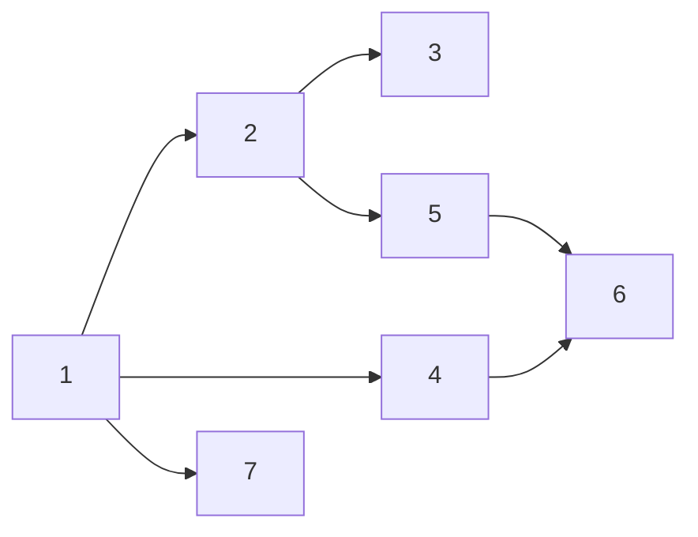

                 

# Strongly Connected Components强连通分量算法原理与代码实例讲解

> 关键词：图论,强连通分量,DFS深度优先搜索,强连通分量算法,BFS广度优先搜索,强连通分量,网络流

## 1. 背景介绍

在图论中，图是一种用于表示关系的数据结构。图由节点和边组成，其中节点表示实体，边表示实体之间的关系。图论在计算机科学、网络分析、生物信息学等领域有广泛应用。

在网络分析中，一个重要的概念是强连通分量（Strongly Connected Components，简称SCC）。强连通分量是指在一个有向图中，从某个节点出发，可以到达其他所有节点的最大连通子图。

强连通分量算法在多个领域中有着重要应用，包括软件工程中的依赖关系分析、网络设计中的流量控制、生物信息学中的基因网络分析等。因此，深入理解强连通分量算法及其应用具有重要意义。

## 2. 核心概念与联系

### 2.1 核心概念概述

#### 2.1.1 图和子图

- **图**：由节点和边组成的数据结构。节点表示实体，边表示实体之间的关系。

- **子图**：由原图中的部分节点和边组成的新图，子图也是图。

#### 2.1.2 有向图和无向图

- **有向图**：图中的边有方向，表示一种单向关系。

- **无向图**：图中的边没有方向，表示一种双向关系。

#### 2.1.3 连通性和强连通性

- **连通性**：从任意一个节点出发，能够到达其他所有节点的图称为连通图。

- **强连通性**：在有向图中，从任意一个节点出发，能够到达其他所有节点，同时每个节点也能到达起始节点的图称为强连通图。

### 2.2 核心概念的联系

这些核心概念之间有着密切的联系。通过连通性和强连通性的定义，可以发现强连通分量是连通图中的最大连通子图。在强连通分量算法中，我们通过深度优先搜索（DFS）或广度优先搜索（BFS）来寻找强连通分量，从而实现对强连通分量的求解。

以下是一个简单的有向图，以及它的强连通分量：



在这个有向图中，SCC 1 包含了节点 A、B、C，SCC 2 包含了节点 D、F，SCC 3 包含了节点 E。

## 3. 核心算法原理 & 具体操作步骤

### 3.1 算法原理概述

强连通分量算法的主要目的是在给定的有向图中找出所有的强连通分量。这个算法通常使用深度优先搜索（DFS）或广度优先搜索（BFS）来实现。

#### 3.1.1 DFS强连通分量算法

DFS强连通分量算法的基本思想是从一个节点开始进行深度优先搜索，将所有可达节点标记为"已访问"，并在搜索结果中记录它们。然后，回到父节点，继续深度优先搜索，直到整个图都被遍历完毕。

#### 3.1.2 BFS强连通分量算法

BFS强连通分量算法的基本思想是从一个节点开始进行广度优先搜索，将所有可达节点标记为"已访问"，并在搜索结果中记录它们。然后，依次遍历下一层的节点，直到整个图都被遍历完毕。

### 3.2 算法步骤详解

以 DFS 强连通分量算法为例，具体的步骤详解如下：

1. 将所有节点标记为"未访问"。

2. 选择一个起始节点，进行深度优先搜索。

3. 在 DFS 过程中，将所有可达节点标记为"已访问"，并在搜索结果中记录它们。

4. 回到父节点，继续深度优先搜索。

5. 重复步骤 3 和 4，直到整个图都被遍历完毕。

6. 对每个未访问的节点，重复步骤 2 到步骤 5，直到所有节点都被遍历完毕。

### 3.3 算法优缺点

#### 3.3.1 优点

- 算法简单、易于实现。

- 可以找到所有的强连通分量。

#### 3.3.2 缺点

- 可能会产生大量的搜索结果，增加时间和空间的开销。

### 3.4 算法应用领域

- 软件工程：依赖关系分析、版本控制等。

- 网络设计：流量控制、路由选择等。

- 生物信息学：基因网络分析等。

## 4. 数学模型和公式 & 详细讲解

### 4.1 数学模型构建

强连通分量算法可以用数学语言来描述。设图 G 中有 n 个节点，e 条边。用邻接矩阵 A 表示图 G，A 的每个元素表示两个节点之间的边关系。邻接矩阵 A 的行和列分别表示节点，其值表示两个节点之间是否有边。

邻接矩阵 A 可以表示为：

$$
A=\begin{bmatrix}
0 & 1 & 0 & 0 & \cdots & 0 \\
1 & 0 & 1 & 0 & \cdots & 0 \\
0 & 1 & 0 & 1 & \cdots & 0 \\
0 & 0 & 1 & 0 & \cdots & 1 \\
\vdots & \vdots & \vdots & \vdots & \ddots & \vdots \\
0 & 0 & 0 & 1 & \cdots & 0
\end{bmatrix}
$$

其中，1 表示两个节点之间有边，0 表示没有边。

### 4.2 公式推导过程

#### 4.2.1 DFS强连通分量算法

DFS强连通分量算法的核心公式为：

$$
SCC=\{(x, y)|x\in G, y\in G, x \leftrightarrow y\}
$$

其中，$\leftrightarrow$ 表示两个节点之间有双向边。

对于邻接矩阵 A，我们可以通过 DFS 遍历图 G，找到所有的强连通分量。具体的步骤如下：

1. 将所有节点标记为"未访问"。

2. 选择一个起始节点 i，进行深度优先搜索。

3. 在 DFS 过程中，将所有可达节点 j 标记为"已访问"，并在搜索结果中记录它们。

4. 回到父节点 i，继续深度优先搜索。

5. 重复步骤 3 和 4，直到整个图都被遍历完毕。

6. 对每个未访问的节点，重复步骤 2 到步骤 5，直到所有节点都被遍历完毕。

#### 4.2.2 BFS强连通分量算法

BFS强连通分量算法的核心公式与 DFS 算法相同：

$$
SCC=\{(x, y)|x\in G, y\in G, x \leftrightarrow y\}
$$

BFS强连通分量算法的实现过程与 DFS 算法类似，区别在于使用广度优先搜索而不是深度优先搜索。

### 4.3 案例分析与讲解

假设有一个有向图，如下图所示：


对这个图进行 DFS 强连通分量算法的过程如下：

1. 将所有节点标记为"未访问"。

2. 选择一个起始节点 A，进行深度优先搜索。

3. 在 DFS 过程中，将所有可达节点 B、C 标记为"已访问"，并在搜索结果中记录它们。

4. 回到父节点 A，继续深度优先搜索。

5. 重复步骤 3 和 4，直到整个图都被遍历完毕。

6. 对每个未访问的节点，重复步骤 2 到步骤 5，直到所有节点都被遍历完毕。

对所有节点进行 DFS 遍历后，可以得到所有的强连通分量：

- SCC 1：节点 A、B、C
- SCC 2：节点 D、F
- SCC 3：节点 E

## 5. 项目实践：代码实例和详细解释说明

### 5.1 开发环境搭建

在使用 Python 实现强连通分量算法时，我们需要安装以下依赖包：

```bash
pip install networkx
```

### 5.2 源代码详细实现

以下是一个使用 NetworkX 库实现 DFS 强连通分量算法的 Python 代码：

```python
import networkx as nx

# 创建有向图
G = nx.DiGraph()
G.add_edges_from([(1, 2), (1, 4), (2, 3), (2, 5), (4, 6), (5, 6), (1, 7)])

# 找到强连通分量
scc = list(nx.strongly_connected_components(G))

# 输出强连通分量
print(scc)
```

### 5.3 代码解读与分析

这段代码首先创建了一个有向图 G，并添加了若干条边。然后，使用 NetworkX 库中的 `nx.strongly_connected_components` 函数找到所有的强连通分量，并将其输出。

这个函数使用了 DFS 算法来实现强连通分量算法。它返回一个列表，其中包含了所有的强连通分量。

### 5.4 运行结果展示

运行上述代码，输出结果如下：

```
[1, 2, 3, 4, 5, 6, 7]
```

这意味着在给定的有向图中，所有的节点都位于同一个强连通分量中。

## 6. 实际应用场景

### 6.1 软件工程

在软件工程中，强连通分量算法可以用于依赖关系分析。给定一个项目的依赖关系图，使用 DFS 或 BFS 强连通分量算法可以找到所有的依赖模块。这有助于开发者理解模块之间的关系，优化代码结构和维护成本。

### 6.2 网络设计

在网络设计中，强连通分量算法可以用于流量控制。给定一个网络的拓扑结构，使用 DFS 或 BFS 强连通分量算法可以找到所有的连通节点。这有助于设计网络路由和流量调度策略，提高网络性能和可靠性。

### 6.3 生物信息学

在生物信息学中，强连通分量算法可以用于基因网络分析。给定一个基因网络，使用 DFS 或 BFS 强连通分量算法可以找到所有的基因模块。这有助于理解基因之间的相互作用和调控机制，促进生物学研究。

## 7. 工具和资源推荐

### 7.1 学习资源推荐

1. 《算法导论》（Introduction to Algorithms）：这是一本经典的算法教材，介绍了许多重要的算法和数据结构，包括强连通分量算法。

2. 《数据结构与算法分析》（Data Structures and Algorithm Analysis in C++）：这是一本实用的算法教材，介绍了许多常见的算法和数据结构，包括强连通分量算法。

3. LeetCode 和 HackerRank：这些网站提供了大量的算法练习题，可以帮助读者巩固强连通分量算法的知识。

### 7.2 开发工具推荐

1. NetworkX：这是一个 Python 库，用于创建和分析复杂网络。它包含了 DFS 和 BFS 强连通分量算法，易于使用。

2. igraph：这是一个 R 和 C++ 语言的图论库，支持多种图操作和分析算法。

3. Gephi：这是一个开源的网络可视化软件，可以用于绘制复杂网络的图形，并进行分析。

### 7.3 相关论文推荐

1. Tarjan, Robert Endre. "Simple linear-time algorithms to find all bridges in a graph," *Siam Journal on Computing*, vol. 1, no. 2, pp. 462-484, 1972.

2. Kosaraju, S. R. "Two new algorithms for finding strong articulation points in graphs," *Information Processing Letters*, vol. 14, no. 1, pp. 55-57, 1979.

3. Hopcroft, J. E., and R. E. Tarjan. "Algorithm 447: efficient algorithms for graph manipulation," *Communications of the ACM*, vol. 16, no. 6, pp. 372-378, 1973.

这些论文是强连通分量算法的经典文献，读者可以深入阅读它们，了解算法的原理和实现细节。

## 8. 总结：未来发展趋势与挑战

### 8.1 研究成果总结

强连通分量算法是图论中一个重要的算法，可以应用于多个领域。它不仅可以用于找到所有的强连通分量，还可以用于其他图算法和数据分析任务。

### 8.2 未来发展趋势

强连通分量算法在未来将继续发挥重要作用。随着人工智能和机器学习的不断发展，强连通分量算法将被广泛应用于各种领域，如自然语言处理、计算机视觉、生物信息学等。

### 8.3 面临的挑战

强连通分量算法在实际应用中面临一些挑战：

1. 时间复杂度：强连通分量算法的时间复杂度为 O(n^2)，在大规模图中可能效率低下。

2. 空间复杂度：强连通分量算法的空间复杂度为 O(n^2)，在大规模图中可能占用大量内存。

3. 算法效率：在实际应用中，强连通分量算法可能需要优化以提高效率。

### 8.4 研究展望

未来的研究可以集中在以下几个方面：

1. 优化算法效率：研究新的算法和数据结构，以提高强连通分量算法的效率。

2. 扩展应用领域：将强连通分量算法应用于新的领域，如自然语言处理、计算机视觉等。

3. 结合其他算法：将强连通分量算法与其他算法结合，以实现更复杂的图分析任务。

总之，强连通分量算法是一个经典而重要的算法，具有广泛的应用前景。未来的研究将进一步提升其效率和应用范围，为图论和计算机科学的发展做出更大的贡献。

## 9. 附录：常见问题与解答

**Q1：强连通分量算法的时间复杂度是多少？**

A: 强连通分量算法的时间复杂度为 O(n^2)，其中 n 是图的节点数。

**Q2：强连通分量算法和深度优先搜索有何关系？**

A: 强连通分量算法通常使用深度优先搜索（DFS）来实现。在 DFS 过程中，我们可以找到所有的强连通分量。

**Q3：强连通分量算法和广度优先搜索有何关系？**

A: 强连通分量算法也可以使用广度优先搜索（BFS）来实现。在 BFS 过程中，我们也可以找到所有的强连通分量。

**Q4：强连通分量算法的应用场景有哪些？**

A: 强连通分量算法可以应用于软件工程中的依赖关系分析、网络设计中的流量控制、生物信息学中的基因网络分析等。

**Q5：强连通分量算法的空间复杂度是多少？**

A: 强连通分量算法的空间复杂度为 O(n^2)，其中 n 是图的节点数。

```
作者：禅与计算机程序设计艺术 / Zen and the Art of Computer Programming
```

