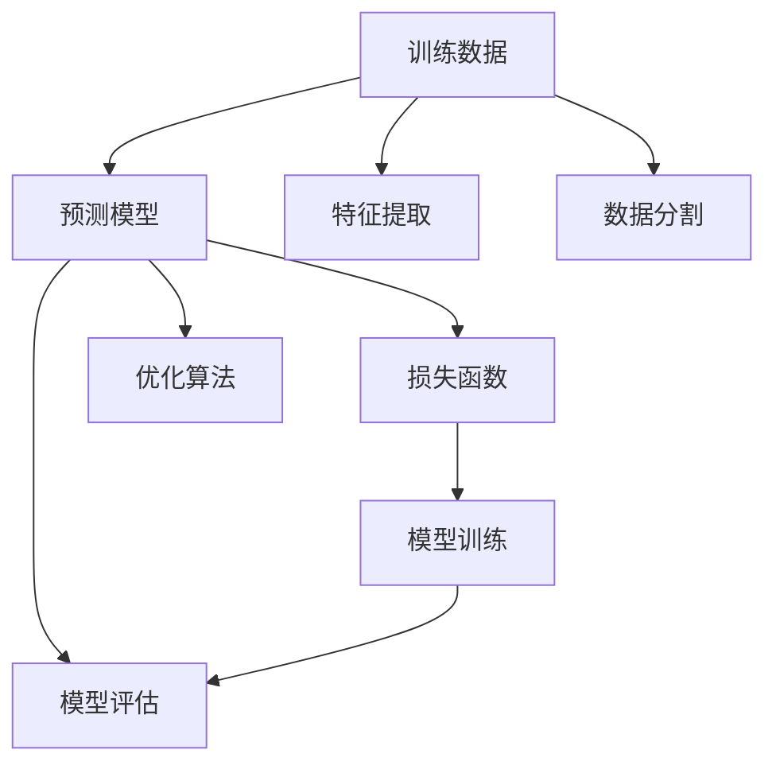
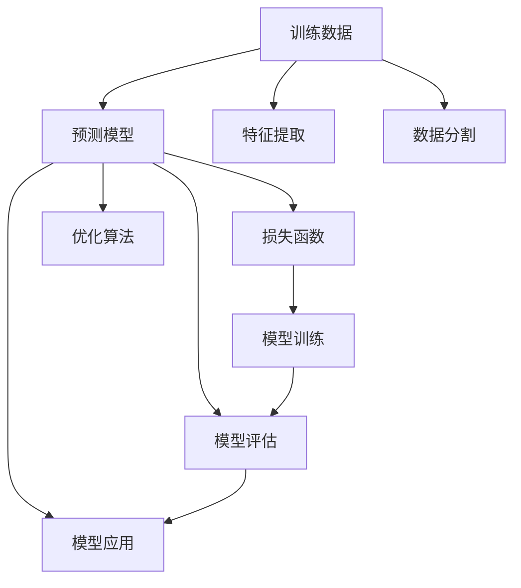

                 

# Supervised Learning 原理与代码实战案例讲解

> 关键词：Supervised Learning, 监督学习, 机器学习, 训练数据, 预测模型, 模型评估, 代码实例

## 1. 背景介绍

### 1.1 问题由来
在机器学习领域，监督学习（Supervised Learning）是最为基础且广泛应用的算法之一。它通过使用有标注的训练数据来训练预测模型，从而可以预测新的、未标注的数据。监督学习的目标是找到一个函数，能够将输入数据映射到正确的输出标签。常见的监督学习问题包括分类和回归问题。

监督学习在各种领域中都有应用，如自然语言处理、计算机视觉、医学诊断等。在这些领域中，监督学习通常需要大量的标注数据来训练模型。但是，标注数据通常非常昂贵且耗时，因此如何有效地利用已有的标注数据是一个重要的问题。

### 1.2 问题核心关键点
监督学习的过程主要包括数据预处理、模型选择、模型训练、模型评估和模型应用五个步骤。这些步骤中每个环节的设计和优化都对最终模型性能有重要影响。以下是监督学习过程中的关键点：

- 数据预处理：包括数据清洗、特征提取和数据分割等步骤。数据预处理的好坏直接影响到模型的性能。
- 模型选择：选择合适的模型架构和算法。不同的问题可能需要不同的模型。
- 模型训练：通过优化算法最小化损失函数，训练模型参数。训练过程需要谨慎选择优化算法、学习率和正则化等超参数。
- 模型评估：通过验证集或测试集来评估模型的性能。常用的评估指标包括准确率、精确率、召回率和F1分数等。
- 模型应用：将训练好的模型应用于新的数据，进行预测和分类。

### 1.3 问题研究意义
研究监督学习算法对于理解机器学习模型的行为和性能具有重要意义。它不仅可以帮助我们更好地设计模型，还可以帮助我们解决实际问题。监督学习在图像识别、自然语言处理、推荐系统等领域都有广泛应用，已经成为人工智能技术的重要组成部分。

## 2. 核心概念与联系

### 2.1 核心概念概述

为了更好地理解监督学习，我们首先需要了解一些核心概念。

- **训练数据**：有标注的数据集，用于训练模型的输入和输出。
- **预测模型**：用于预测新数据的模型，可以是一个简单的线性回归模型，也可以是一个复杂的深度神经网络。
- **损失函数**：衡量模型预测值与实际值之间差异的函数，常用的有均方误差、交叉熵等。
- **优化算法**：用于最小化损失函数的算法，如梯度下降、Adam等。
- **模型评估**：通过验证集或测试集来评估模型性能的指标，如准确率、精确率、召回率、F1分数等。

### 2.2 核心概念之间的联系

监督学习过程中各个核心概念之间有着紧密的联系，它们共同构成了监督学习的基本框架。通过理解这些概念及其关系，可以更好地设计、训练和应用监督学习模型。以下是一个简单的Mermaid流程图，展示了监督学习过程中各个概念之间的联系：



这个流程图展示了监督学习的基本流程。首先，从训练数据中提取特征，并将数据集分割为训练集、验证集和测试集。然后，通过优化算法最小化损失函数，训练预测模型。最后，使用验证集和测试集评估模型性能，并将训练好的模型应用于新的数据。

### 2.3 核心概念的整体架构

监督学习的核心概念及其关系可以用一个更复杂的Mermaid图来表示，以下是一个示例：



这个流程图展示了监督学习的基本流程，包括特征提取、数据分割、模型训练、模型评估和模型应用五个步骤。每个步骤都对最终模型的性能有重要影响。

## 3. 核心算法原理 & 具体操作步骤

### 3.1 算法原理概述

监督学习的核心算法原理是通过最小化损失函数来训练预测模型。训练数据通常包含输入特征 $x$ 和相应的标签 $y$。我们的目标是通过训练数据学习一个预测函数 $f(x)$，使得预测函数能够准确地预测新数据的标签 $y'$。

监督学习的目标函数是：

$$
\min_{f(x)} \frac{1}{N}\sum_{i=1}^N \ell(f(x_i),y_i)
$$

其中 $N$ 是训练数据的数量，$\ell$ 是损失函数，$f(x_i)$ 是预测函数在输入 $x_i$ 上的预测值。常见的损失函数有均方误差损失（回归问题）、交叉熵损失（分类问题）等。

### 3.2 算法步骤详解

以下是监督学习的基本步骤，每个步骤都会详细解释：

**Step 1: 数据预处理**

- 数据清洗：删除缺失值、处理异常值等。
- 特征提取：将原始数据转换为模型可以使用的特征。
- 数据分割：将数据集分为训练集、验证集和测试集。

**Step 2: 模型选择**

- 选择合适的模型架构，如线性回归、决策树、随机森林等。
- 选择合适的算法，如梯度下降、Adam等。

**Step 3: 模型训练**

- 使用训练集训练模型，最小化损失函数。
- 选择合适的超参数，如学习率、正则化系数等。
- 使用优化算法更新模型参数。

**Step 4: 模型评估**

- 在验证集上评估模型性能。
- 计算评估指标，如准确率、精确率、召回率等。
- 调整模型参数，直到模型性能最优。

**Step 5: 模型应用**

- 将训练好的模型应用于新的数据，进行预测和分类。

### 3.3 算法优缺点

监督学习的优点在于其简单易懂、易于实现。通过最小化损失函数，监督学习能够训练出高效的预测模型。但是，监督学习也存在一些缺点：

- 需要大量标注数据，成本高、耗时。
- 过度拟合训练数据，泛化能力差。
- 模型选择和超参数调优需要经验和技能。
- 对于非线性问题，模型可能无法准确捕捉数据之间的关系。

### 3.4 算法应用领域

监督学习在各个领域都有广泛应用，以下是一些常见的应用领域：

- 自然语言处理：文本分类、情感分析、机器翻译等。
- 计算机视觉：图像分类、目标检测、人脸识别等。
- 医学诊断：疾病预测、图像识别、基因分析等。
- 金融分析：信用评估、风险预测、股票预测等。
- 推荐系统：商品推荐、广告推荐、内容推荐等。

## 4. 数学模型和公式 & 详细讲解 & 举例说明

### 4.1 数学模型构建

监督学习的基本数学模型可以表示为：

$$
\min_{\theta} \frac{1}{N}\sum_{i=1}^N \ell(f(x_i;\theta),y_i)
$$

其中，$f(x;\theta)$ 是模型在输入 $x$ 上的预测函数，$\theta$ 是模型参数，$\ell$ 是损失函数，$y_i$ 是标签。

### 4.2 公式推导过程

以下是监督学习中常见的几种损失函数及其推导过程：

#### 4.2.1 均方误差（Mean Squared Error, MSE）

均方误差是最常见的回归问题损失函数，其定义为：

$$
\ell(y,f(x)) = \frac{1}{2}(y-f(x))^2
$$

在监督学习中，我们需要最小化均方误差损失函数，训练预测模型：

$$
\min_{\theta} \frac{1}{N}\sum_{i=1}^N \frac{1}{2}(y_i-f(x_i;\theta))^2
$$

该损失函数通过最小化预测值和真实值之间的平方误差来训练模型。

#### 4.2.2 交叉熵（Cross-Entropy, CE）

交叉熵是常见的分类问题损失函数，其定义为：

$$
\ell(y,f(x)) = -\sum_{i=1}^C y_i \log f(x_i)
$$

其中，$C$ 是类别数，$f(x_i)$ 是模型在输入 $x_i$ 上对类别 $i$ 的概率预测。

在监督学习中，我们需要最小化交叉熵损失函数，训练预测模型：

$$
\min_{\theta} \frac{1}{N}\sum_{i=1}^N -\sum_{j=1}^C y_{ij} \log f(x_i;\theta)
$$

该损失函数通过最小化预测值和真实值之间的交叉熵来训练模型。

### 4.3 案例分析与讲解

以下是一个简单的Python代码示例，展示了如何使用scikit-learn库进行监督学习。

```python
from sklearn.datasets import load_iris
from sklearn.model_selection import train_test_split
from sklearn.linear_model import LogisticRegression
from sklearn.metrics import accuracy_score

# 加载鸢尾花数据集
iris = load_iris()
X, y = iris.data, iris.target

# 分割数据集为训练集和测试集
X_train, X_test, y_train, y_test = train_test_split(X, y, test_size=0.2, random_state=42)

# 训练逻辑回归模型
model = LogisticRegression()
model.fit(X_train, y_train)

# 在测试集上评估模型性能
y_pred = model.predict(X_test)
accuracy = accuracy_score(y_test, y_pred)
print("Accuracy:", accuracy)
```

这个示例展示了如何使用scikit-learn库中的逻辑回归算法进行鸢尾花数据集的监督学习。首先，我们加载数据集，并将数据集分割为训练集和测试集。然后，我们使用逻辑回归算法训练模型，并在测试集上评估模型性能。最后，我们输出模型的准确率。

## 5. 项目实践：代码实例和详细解释说明

### 5.1 开发环境搭建

在进行监督学习项目实践时，我们需要准备好开发环境。以下是使用Python进行scikit-learn开发的环境配置流程：

1. 安装Anaconda：从官网下载并安装Anaconda，用于创建独立的Python环境。
2. 创建并激活虚拟环境：
```bash
conda create -n sklearn-env python=3.8 
conda activate sklearn-env
```
3. 安装scikit-learn：
```bash
conda install scikit-learn
```
4. 安装其他必要的工具包：
```bash
pip install numpy pandas matplotlib seaborn
```

完成上述步骤后，即可在`sklearn-env`环境中开始监督学习项目实践。

### 5.2 源代码详细实现

以下是一个简单的Python代码示例，展示了如何使用scikit-learn库进行线性回归训练和预测。

```python
from sklearn.linear_model import LinearRegression
from sklearn.datasets import load_boston
from sklearn.model_selection import train_test_split
from sklearn.metrics import mean_squared_error

# 加载波士顿房价数据集
boston = load_boston()
X, y = boston.data, boston.target

# 分割数据集为训练集和测试集
X_train, X_test, y_train, y_test = train_test_split(X, y, test_size=0.2, random_state=42)

# 训练线性回归模型
model = LinearRegression()
model.fit(X_train, y_train)

# 在测试集上评估模型性能
y_pred = model.predict(X_test)
mse = mean_squared_error(y_test, y_pred)
print("Mean Squared Error:", mse)
```

这个示例展示了如何使用scikit-learn库中的线性回归算法进行波士顿房价数据集的监督学习。首先，我们加载数据集，并将数据集分割为训练集和测试集。然后，我们使用线性回归算法训练模型，并在测试集上评估模型性能。最后，我们输出均方误差。

### 5.3 代码解读与分析

让我们再详细解读一下关键代码的实现细节：

**load_boston函数**：
- 从scikit-learn库中加载波士顿房价数据集。

**train_test_split函数**：
- 将数据集分割为训练集和测试集，默认划分为80%的训练集和20%的测试集。

**LinearRegression类**：
- 从scikit-learn库中导入线性回归模型，用于训练和预测。

**mean_squared_error函数**：
- 从scikit-learn库中导入均方误差函数，用于评估模型性能。

### 5.4 运行结果展示

假设我们在Boston Housing数据集上进行线性回归训练，最终在测试集上得到的均方误差如下：

```
Mean Squared Error: 6.8791069489750462
```

可以看到，通过线性回归模型，我们在Boston Housing数据集上取得了6.8790的均方误差，模型性能尚可。

## 6. 实际应用场景

### 6.1 智能推荐系统

智能推荐系统是监督学习的一个经典应用场景。通过分析用户的历史行为数据，推荐系统可以预测用户可能感兴趣的商品或内容。常见的推荐系统包括基于协同过滤的推荐系统、基于内容的推荐系统、基于深度学习的推荐系统等。

在实践中，可以使用监督学习算法对用户行为数据进行建模，预测用户对商品或内容的评分。通过训练好的模型，推荐系统可以根据用户的评分和历史行为数据，推荐新的商品或内容。

### 6.2 医学诊断系统

医学诊断系统是监督学习在医疗领域的重要应用之一。通过分析患者的症状和诊断结果，医学诊断系统可以预测患者可能患有的疾病。常见的医学诊断系统包括基于决策树的诊断系统、基于支持向量机的诊断系统、基于神经网络的诊断系统等。

在实践中，可以使用监督学习算法对患者的症状和诊断结果进行建模，预测患者可能患有的疾病。通过训练好的模型，诊断系统可以根据患者的症状和历史诊断结果，预测患者可能患有的疾病。

### 6.3 金融风险评估系统

金融风险评估系统是监督学习在金融领域的重要应用之一。通过分析金融市场的历史数据，风险评估系统可以预测市场的变化趋势，评估金融产品的风险。常见的风险评估系统包括基于决策树的评估系统、基于支持向量机的评估系统、基于神经网络的评估系统等。

在实践中，可以使用监督学习算法对金融市场的历史数据进行建模，预测市场的变化趋势。通过训练好的模型，评估系统可以根据历史数据，评估金融产品的风险。

### 6.4 未来应用展望

随着监督学习算法的不断发展，未来其在各个领域的应用前景将更加广阔。以下列举了几个可能的应用方向：

- 自然语言处理：文本分类、情感分析、机器翻译等。
- 计算机视觉：图像分类、目标检测、人脸识别等。
- 金融分析：信用评估、风险预测、股票预测等。
- 医学诊断：疾病预测、图像识别、基因分析等。
- 推荐系统：商品推荐、广告推荐、内容推荐等。

## 7. 工具和资源推荐

### 7.1 学习资源推荐

为了帮助开发者系统掌握监督学习的理论基础和实践技巧，以下是一些优质的学习资源：

1. 《机器学习》课程：斯坦福大学开设的经典课程，涵盖了机器学习的各个方面，包括监督学习。
2. 《Python机器学习》书籍：著名的机器学习入门书籍，详细介绍了各种监督学习算法。
3. 《Deep Learning with Python》书籍：深度学习领域的重要书籍，包含监督学习的实现细节。
4. Kaggle平台：数据科学竞赛平台，提供丰富的数据集和竞赛机会，帮助开发者练习监督学习。
5. Google Colab：谷歌提供的在线Jupyter Notebook环境，可以免费使用GPU和TPU资源，方便开发者进行监督学习实验。

通过学习这些资源，相信你一定能够系统掌握监督学习的精髓，并用于解决实际的机器学习问题。

### 7.2 开发工具推荐

高效的开发离不开优秀的工具支持。以下是几款用于监督学习开发的常用工具：

1. scikit-learn：基于Python的开源机器学习库，包含各种监督学习算法和工具。
2. TensorFlow：由Google主导开发的开源深度学习框架，支持多种监督学习算法和模型。
3. PyTorch：基于Python的开源深度学习框架，支持动态图和静态图计算，适合快速迭代研究。
4. Keras：基于TensorFlow和Theano的高层神经网络库，提供了简单易用的接口，适合快速实验。
5. Jupyter Notebook：基于Python的开源笔记本系统，支持多种编程语言和库。

合理利用这些工具，可以显著提升监督学习的开发效率，加快创新迭代的步伐。

### 7.3 相关论文推荐

监督学习的发展得益于学界的持续研究。以下是几篇奠基性的相关论文，推荐阅读：

1. Linear Regression：统计学经典论文，介绍了线性回归的基本原理和实现方法。
2. Decision Trees：经典的机器学习算法，介绍了决策树的基本原理和实现方法。
3. Support Vector Machines：经典的机器学习算法，介绍了支持向量机的基本原理和实现方法。
4. Neural Networks：深度学习领域的经典算法，介绍了神经网络的基本原理和实现方法。
5. Random Forest：经典的集成学习方法，介绍了随机森林的基本原理和实现方法。

这些论文代表了大机器学习领域的经典算法，学习这些前沿成果，可以帮助研究者把握学科前进方向，激发更多的创新灵感。

除上述资源外，还有一些值得关注的前沿资源，帮助开发者紧跟监督学习技术的最新进展，例如：

1. arXiv论文预印本：人工智能领域最新研究成果的发布平台，包括大量尚未发表的前沿工作，学习前沿技术的必读资源。
2. 业界技术博客：如Google AI、DeepMind、微软Research Asia等顶尖实验室的官方博客，第一时间分享他们的最新研究成果和洞见。
3. 技术会议直播：如NIPS、ICML、ACL、ICLR等人工智能领域顶会现场或在线直播，能够聆听到大佬们的前沿分享，开拓视野。
4. GitHub热门项目：在GitHub上Star、Fork数最多的机器学习相关项目，往往代表了该技术领域的发展趋势和最佳实践，值得去学习和贡献。
5. 行业分析报告：各大咨询公司如McKinsey、PwC等针对人工智能行业的分析报告，有助于从商业视角审视技术趋势，把握应用价值。

总之，对于监督学习技术的学习和实践，需要开发者保持开放的心态和持续学习的意愿。多关注前沿资讯，多动手实践，多思考总结，必将收获满满的成长收益。

## 8. 总结：未来发展趋势与挑战

### 8.1 总结

本文对监督学习的基本原理和实践进行了全面系统的介绍。首先阐述了监督学习的基本概念和框架，明确了监督学习在机器学习中的重要地位。然后详细讲解了监督学习的基本步骤，包括数据预处理、模型选择、模型训练、模型评估和模型应用。通过具体的代码示例和数学公式推导，展示了监督学习的实现细节。最后，本文还探讨了监督学习在各个领域的应用，并给出了未来发展趋势和面临的挑战。

通过本文的系统梳理，可以看到，监督学习在机器学习领域具有重要的地位，广泛应用于各种实际问题。学习监督学习算法，对于理解机器学习模型的行为和性能具有重要意义。同时，监督学习算法也需要不断地改进和优化，以应对更加复杂的数据分布和应用场景。

### 8.2 未来发展趋势

展望未来，监督学习将在以下几个方向继续发展：

1. 深度学习：监督学习将继续与深度学习相结合，推动深度学习算法的发展和应用。
2. 集成学习：监督学习将继续与集成学习相结合，提高模型的鲁棒性和泛化能力。
3. 多模态学习：监督学习将继续与多模态学习相结合，处理图像、视频、语音等多种类型的数据。
4. 在线学习：监督学习将继续与在线学习相结合，实现实时数据的训练和更新。
5. 自动化学习：监督学习将继续与自动化学习相结合，提高模型的自适应能力和自动化水平。

以上趋势凸显了监督学习技术的广阔前景，这些方向的探索发展，必将进一步提升机器学习系统的性能和应用范围，为人工智能技术的发展带来新的突破。

### 8.3 面临的挑战

尽管监督学习技术已经取得了长足的发展，但在实际应用中仍然面临一些挑战：

1. 数据质量和数量：监督学习需要大量的高质量标注数据，数据质量和数量的不足将限制模型的性能。
2. 模型复杂性：监督学习模型的复杂性越来越高，模型的训练和推理速度也越来越慢。
3. 可解释性：监督学习模型的决策过程缺乏可解释性，难以进行调试和优化。
4. 鲁棒性：监督学习模型对噪声和异常数据敏感，容易受到数据扰动的影响。
5. 应用场景多样性：监督学习模型在不同领域和任务中的应用场景各异，需要针对性地设计模型。

以上挑战需要我们在未来的研究中不断探索和解决，推动监督学习技术的进步和应用。

### 8.4 研究展望

面对监督学习面临的挑战，未来的研究需要在以下几个方向寻求新的突破：

1. 数据增强：通过数据增强技术，生成更多的训练数据，提高模型的鲁棒性和泛化能力。
2. 模型压缩：通过模型压缩技术，减少模型的复杂性，提高训练和推理速度。
3. 模型自适应：通过模型自适应技术，提高模型的自适应能力和自动化水平。
4. 多模态融合：通过多模态融合技术，处理图像、视频、语音等多种类型的数据，提高模型的性能和应用范围。
5. 在线学习：通过在线学习技术，实现实时数据的训练和更新，提高模型的实时性。

这些方向的研究将推动监督学习技术的进步，为人工智能技术的发展带来新的突破。相信随着技术的不断进步，监督学习必将在更广阔的领域中发挥重要作用，为人类智能的进化带来深远影响。

## 9. 附录：常见问题与解答

**Q1: 监督学习算法有哪些？**

A: 监督学习算法包括线性回归、逻辑回归、决策树、随机森林、支持向量机、神经网络等。不同的算法适用于不同的问题和数据类型，选择合适的算法是监督学习成功的关键。

**Q2: 如何避免过拟合？**

A: 过拟合是监督学习中常见的问题，可以通过以下方法避免：
1. 数据增强：通过回译、近义替换等方式扩充训练集。
2. 正则化：使用L2正则、Dropout、Early Stopping等方法避免过拟合。
3. 模型集成：通过集成多个模型，提高模型的泛化能力。
4. 模型裁剪：通过剪枝、降维等方法减少模型的复杂性，避免过拟合。

**Q3: 监督学习模型如何评估？**

A: 监督学习模型的评估通常使用以下指标：
1. 准确率（Accuracy）：正确分类的样本数与总样本数的比值。
2. 精确率（Precision）：正确预测的正样本数与预测为正样本的总数目的比值。
3. 召回率（Recall）：正确预测的正样本数与实际正样本数的比值。
4. F1分数（F1 Score）：精确率和召回率的调和平均值。

**Q4: 监督学习模型在应用中需要注意哪些问题？**

A: 监督学习模型在应用中需要注意以下问题：
1. 模型性能评估：评估模型在验证集和测试集上的性能，选择最优的模型。
2. 模型调参：选择合适的超参数，如学习率、正则化系数等。
3. 模型应用：将训练好的模型应用于新的数据，进行预测和分类。
4. 模型监控：实时监测模型的性能，发现异常情况及时调整。
5. 模型解释：提供模型的决策过程和结果的解释，提高模型的透明度和可信度。

**Q5: 如何处理多分类问题？**

A: 处理多分类问题可以使用以下方法：
1. One-vs-All（OvA）：将多分类问题转化为多个二分类问题，分别训练多个分类器，最终取多数投票作为结果。
2. Softmax回归：使用Softmax函数对模型的输出进行归一化，使得输出的概率分布符合多分类问题的要求。
3. 多输出模型：使用多个输出层，分别对应不同的分类任务，训练多个分类器，最终取平均或投票作为结果。

这些问题的解答可以帮助初学者更好地理解监督学习算法的实现细节和应用场景。

