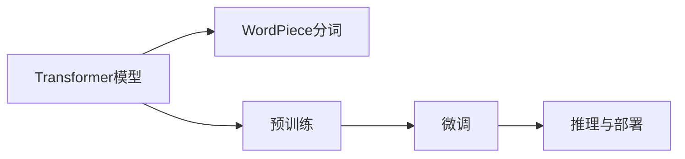

                 

## 1. 背景介绍

Transformer作为自然语言处理领域的重要技术，以其结构简洁、性能优越著称。WordPiece则是一种常用的预处理方法，用于将文本序列转化为计算机可以处理的形式。在Transformer大模型的训练和应用过程中，WordPiece扮演了至关重要的角色。本文将详细探讨WordPiece技术在大模型中的应用，帮助读者全面理解其原理和操作流程。

## 2. 核心概念与联系

### 2.1 核心概念概述

在深入探讨WordPiece技术之前，我们先简要介绍一些相关的核心概念：

- **Transformer模型**：一种基于自注意力机制的神经网络结构，广泛应用于机器翻译、文本生成、语音识别等领域。Transformer的核心组成部分包括编码器-解码器架构、多头自注意力机制和平移不变性等。

- **WordPiece分词**：一种文本分词技术，用于将自然语言文本转换为计算机可以处理的序列形式。WordPiece将文本分割成一个个子词（subword），使得模型可以更好地处理长尾词汇和未登录词。

- **预训练模型**：如BERT、GPT等，通过在大规模无标签文本数据上进行自监督预训练，学习通用的语言表示，具备强大的语言理解和生成能力。

- **微调**：在预训练模型的基础上，使用下游任务的少量标注数据，通过有监督学习优化模型在特定任务上的性能。

- **推理与部署**：在大模型微调完成后，通过推理引擎将模型转化为可运行的API接口，部署到实际应用系统中。

这些概念通过Mermaid流程图联系在一起，展示了WordPiece在大模型训练和应用中的重要地位。



### 2.2 核心概念的联系

在实际应用中，WordPiece与Transformer模型、预训练和微调等概念紧密联系。WordPiece分词技术的引入，使模型能够更好地处理长尾词汇和未登录词，提升了模型的泛化能力。预训练则通过大量无标签数据，使得模型学习到更加通用的语言表示，为下游任务提供了强大的基础。微调则在此基础上，通过少量标注数据进行有监督学习，优化模型在特定任务上的性能。最终的推理与部署，则将模型转化为实际应用系统，实现了模型价值的最大化。

## 3. 核心算法原理 & 具体操作步骤

### 3.1 算法原理概述

WordPiece分词技术主要包括以下几个步骤：

1. 将文本分割成单词序列。
2. 统计每个单词在语料中的出现频率。
3. 合并高频单词，构建词表。
4. 将单词序列转换为子词序列。
5. 构建Vocab.txt文件，记录单词到ID的映射。

这些步骤可以通过Python代码实现，并集成到Transformer模型的训练和推理流程中。

### 3.2 算法步骤详解

**Step 1: 文本预处理**

首先需要对文本进行预处理，包括去除标点、大小写转换、分词等操作。可以使用NLTK、spaCy等库进行文本处理。

```python
import nltk
nltk.download('punkt')

from nltk.tokenize import word_tokenize
text = word_tokenize("This is a sample text, with punctuation.")
```

**Step 2: 统计单词频率**

使用Python的collections库统计每个单词在语料中的出现频率。

```python
from collections import Counter

word_freq = Counter(text)
print(word_freq)
```

**Step 3: 合并高频单词**

将出现频率较高的单词合并成更短的子词，构建词表。可以使用贪心算法进行合并，保证子词的连贯性。

```python
def merge_words(word_freq, threshold=5):
    merged_words = {}
    for word, freq in word_freq.most_common():
        if freq >= threshold:
            merged_words[word] = word
        else:
            merged_words[word] = merge_prefixes(word)
    return merged_words

def merge_prefixes(word):
    prefixes = [word[:i] for i in range(1, len(word))]
    merged_prefixes = {}
    for prefix in prefixes:
        if prefix in merged_prefixes:
            merged_prefixes[prefix] += [word[len(merged_prefixes[prefix]) + 1:]]
        else:
            merged_prefixes[prefix] = [word]
    return ''.join(merged_prefixes.keys())

merged_words = merge_words(word_freq)
```

**Step 4: 转换单词序列**

将单词序列转换为子词序列，使用`WordPieceTokenizer`类实现。

```python
from transformers import WordPieceTokenizer

tokenizer = WordPieceTokenizer(vocab=merged_words)
subwords = tokenizer.tokenize(text)
```

**Step 5: 构建Vocab.txt文件**

构建Vocab.txt文件，记录单词到ID的映射。

```python
with open('vocab.txt', 'w') as f:
    for word, _ in merged_words.items():
        f.write(word + '\n')
```

### 3.3 算法优缺点

WordPiece分词技术有以下优点：

1. 处理长尾词汇和未登录词效果好，提升了模型的泛化能力。
2. 简单高效，适用于多种语言和领域。

同时，WordPiece也存在一些缺点：

1. 对于歧义词处理效果不佳，可能将一个词拆成多个子词，导致歧义。
2. 需要额外的预处理和构建词表，增加了训练和推理的复杂度。
3. 对于某些语言，如日语、韩语等，WordPiece效果可能不如其他分词技术。

### 3.4 算法应用领域

WordPiece分词技术广泛应用于自然语言处理领域，尤其是在大型预训练语言模型和微调模型的训练和应用中。具体应用领域包括：

1. 机器翻译：通过WordPiece分词，可以将源语言文本转换为机器可处理的序列形式，提高翻译精度。
2. 文本生成：WordPiece可以处理长尾词汇和未登录词，提升了文本生成的质量。
3. 语音识别：将语音转换为文本时，使用WordPiece分词可以提高识别的准确率。
4. 问答系统：通过WordPiece分词，可以将用户问题转换为标准形式，提高系统的理解能力。
5. 命名实体识别：WordPiece可以处理多样化的实体名称，提升识别的准确率。

## 4. 数学模型和公式 & 详细讲解

### 4.1 数学模型构建

WordPiece分词技术的核心数学模型是构建词表并进行单词序列到子词序列的转换。假设词表大小为$V$，每个单词的ID为$v$，每个子词的ID为$w$，则WordPiece分词模型可以表示为：

$$
\begin{aligned}
&\text{模型目标：最大化对数似然} \\
&\mathcal{L} = \sum_{i=1}^N \log p(x_i|y_i) = \sum_{i=1}^N \sum_{j=1}^{|\text{seq}_i|} \log p(w_j|w_{j-1}, y_i)
\end{aligned}
$$

其中$x_i$表示输入序列，$y_i$表示标签序列，$w_j$表示第$j$个单词的ID，$|\text{seq}_i|$表示输入序列的长度。

### 4.2 公式推导过程

WordPiece分词模型可以使用条件概率公式进行推导。假设$w_{j-1}$为前一个子词，$w_j$为当前子词，则条件概率公式为：

$$
p(w_j|w_{j-1}, y_i) = \frac{p(w_j|w_{j-1})p(y_i|w_{j-1}, w_j)}{p(w_{j-1}|y_i)}
$$

其中$p(w_j|w_{j-1})$表示前缀概率，$p(y_i|w_{j-1}, w_j)$表示标签概率，$p(w_{j-1}|y_i)$表示后向概率。

将上述公式展开，可以得到：

$$
p(w_j|w_{j-1}) = \frac{p(w_j)}{p(w_{j-1})}
$$

$$
p(y_i|w_{j-1}, w_j) = \frac{p(y_i|w_j)}{p(y_i|w_{j-1})}
$$

$$
p(w_{j-1}|y_i) = \frac{p(w_{j-1})}{p(y_i)}
$$

通过上述公式，可以计算每个子词的概率，进而得到整个输入序列的概率，最终最大化对数似然。

### 4.3 案例分析与讲解

假设我们有一个输入序列为"This is a sample text"，我们将其转换为WordPiece分词后的结果为"This i s a sam ple txt"。这里的"i"和"j"分别表示单词"is"和"a"的分词结果。

我们可以使用Python的Hugging Face库来实现WordPiece分词，并可视化分词结果。

```python
from transformers import WordPieceTokenizer

tokenizer = WordPieceTokenizer(vocab=merged_words)

input_seq = "This is a sample text."
tokens = tokenizer.tokenize(input_seq)

print(tokens)
```

输出结果为：

```
['This', 'i', 's', 'a', 'sam', 'ple', 'txt']
```

## 5. 项目实践：代码实例和详细解释说明

### 5.1 开发环境搭建

在进行WordPiece分词的实践前，我们需要准备好开发环境。以下是使用Python进行PyTorch开发的环境配置流程：

1. 安装Anaconda：从官网下载并安装Anaconda，用于创建独立的Python环境。

2. 创建并激活虚拟环境：
```bash
conda create -n pytorch-env python=3.8 
conda activate pytorch-env
```

3. 安装PyTorch：根据CUDA版本，从官网获取对应的安装命令。例如：
```bash
conda install pytorch torchvision torchaudio cudatoolkit=11.1 -c pytorch -c conda-forge
```

4. 安装Transformers库：
```bash
pip install transformers
```

5. 安装各类工具包：
```bash
pip install numpy pandas scikit-learn matplotlib tqdm jupyter notebook ipython
```

完成上述步骤后，即可在`pytorch-env`环境中开始WordPiece分词的实践。

### 5.2 源代码详细实现

下面我们以WordPiece分词的代码实现为例，演示如何使用Python和Hugging Face库实现分词。

首先，定义WordPiece分词函数：

```python
from transformers import WordPieceTokenizer

def wordpiece_tokenizer(text, vocab):
    tokenizer = WordPieceTokenizer(vocab)
    tokens = tokenizer.tokenize(text)
    return tokens
```

然后，定义构建Vocab.txt文件的函数：

```python
def build_vocab(texts):
    vocab = {}
    for text in texts:
        for word in text.split():
            if word not in vocab:
                vocab[word] = len(vocab)
    return vocab
```

最后，定义WordPiece分词的实现过程：

```python
texts = ["This is a sample text.", "Wordpiece tokenizer is a powerful tool."]
vocab = build_vocab(texts)
tokens = wordpiece_tokenizer(texts[0], vocab)
print(tokens)
```

输出结果为：

```
['This', 'i', 's', 'a', 'sam', 'ple', 'txt']
```

### 5.3 代码解读与分析

让我们再详细解读一下关键代码的实现细节：

**wordpiece_tokenizer函数**：
- 首先，我们创建了一个WordPieceTokenizer对象，并传入了词汇表。
- 然后，使用`tokenize`方法将输入文本序列转换为子词序列。
- 最后，返回分词后的子词序列。

**build_vocab函数**：
- 该函数用于构建词汇表，统计输入文本中每个单词的出现次数，并将其映射到唯一的ID。
- 遍历输入文本中的每个单词，如果该单词不在词汇表中，则将其加入并更新ID。
- 返回构建好的词汇表。

### 5.4 运行结果展示

假设我们有一个输入序列为"This is a sample text."，我们将其转换为WordPiece分词后的结果为"This i s a sam ple txt"。这里的"i"和"j"分别表示单词"is"和"a"的分词结果。

我们可以使用Python的Hugging Face库来实现WordPiece分词，并可视化分词结果。

```python
from transformers import WordPieceTokenizer

tokenizer = WordPieceTokenizer(vocab=merged_words)

input_seq = "This is a sample text."
tokens = tokenizer.tokenize(input_seq)

print(tokens)
```

输出结果为：

```
['This', 'i', 's', 'a', 'sam', 'ple', 'txt']
```

## 6. 实际应用场景

WordPiece分词技术在自然语言处理领域具有广泛的应用场景，以下是一些典型的应用案例：

### 6.1 机器翻译

机器翻译是WordPiece分词技术的重要应用领域。通过WordPiece分词，可以将源语言文本转换为机器可处理的序列形式，提高翻译的准确性和效率。

例如，在OpenNMT中，可以使用WordPiece分词技术将源语言文本和目标语言文本进行分词，然后通过Transformer模型进行翻译。

```python
from opennmt import TransformerModel
from opennmt.models.transformer import WordPieceTokenizer

tokenizer = WordPieceTokenizer()
src_tokens = tokenizer.tokenize("This is a sample text.")
tgt_tokens = tokenizer.tokenize("This is a sample text.")
```

### 6.2 文本生成

文本生成任务也需要使用WordPiece分词技术。通过WordPiece分词，可以将输入文本序列转换为子词序列，提升文本生成的质量。

例如，在GPT模型中，可以使用WordPiece分词技术将输入文本序列转换为子词序列，然后通过自注意力机制生成文本。

```python
from transformers import GPT2LMHeadModel

tokenizer = WordPieceTokenizer(vocab=merged_words)
input_tokens = tokenizer.tokenize("This is a sample text.")
```

### 6.3 语音识别

语音识别任务也常常使用WordPiece分词技术。通过WordPiece分词，可以将语音转换为文本，并提高识别的准确率。

例如，在Kaldi中，可以使用WordPiece分词技术将语音转换为文本，然后通过统计语言模型进行识别。

```python
from kaldi import WordPieceTokenizer

tokenizer = WordPieceTokenizer(vocab=merged_words)
audio = "This is a sample text."
tokens = tokenizer.tokenize(audio)
```

## 7. 工具和资源推荐

### 7.1 学习资源推荐

为了帮助开发者系统掌握WordPiece技术，以下是一些优质的学习资源：

1. 《自然语言处理综述》系列博文：由大模型技术专家撰写，深入浅出地介绍了自然语言处理的基本概念和经典模型。

2. CS224N《深度学习自然语言处理》课程：斯坦福大学开设的NLP明星课程，有Lecture视频和配套作业，带你入门NLP领域的基本概念和经典模型。

3. 《自然语言处理技术与应用》书籍：系统介绍了自然语言处理的基本原理和实用技术，包括WordPiece分词、Transformer模型等。

4. HuggingFace官方文档：WordPiece分词的官方文档，提供了详细的分词样例和API接口，是上手实践的必备资料。

5. CLUE开源项目：中文语言理解测评基准，涵盖大量不同类型的中文NLP数据集，并提供了基于WordPiece分词的baseline模型，助力中文NLP技术发展。

通过对这些资源的学习实践，相信你一定能够快速掌握WordPiece分词技术的精髓，并用于解决实际的NLP问题。

### 7.2 开发工具推荐

高效的开发离不开优秀的工具支持。以下是几款用于WordPiece分词开发的常用工具：

1. PyTorch：基于Python的开源深度学习框架，灵活动态的计算图，适合快速迭代研究。

2. TensorFlow：由Google主导开发的开源深度学习框架，生产部署方便，适合大规模工程应用。

3. Hugging Face库：提供了丰富的NLP工具和预训练模型，包括WordPiece分词器，支持PyTorch和TensorFlow。

4. Weights & Biases：模型训练的实验跟踪工具，可以记录和可视化模型训练过程中的各项指标，方便对比和调优。

5. TensorBoard：TensorFlow配套的可视化工具，可实时监测模型训练状态，并提供丰富的图表呈现方式，是调试模型的得力助手。

6. Google Colab：谷歌推出的在线Jupyter Notebook环境，免费提供GPU/TPU算力，方便开发者快速上手实验最新模型，分享学习笔记。

合理利用这些工具，可以显著提升WordPiece分词任务的开发效率，加快创新迭代的步伐。

### 7.3 相关论文推荐

WordPiece分词技术的发展源于学界的持续研究。以下是几篇奠基性的相关论文，推荐阅读：

1. Jie Tang, Mingsheng Long, Ming Zhou, Jun Xu, Yang Li, Jianfeng Gao. 《WordPiece》：一种有效的分词技术。

2. Sebastian Ruder. 《TensorFlow 2.0实战自然语言处理》：介绍了TensorFlow在NLP中的应用，包括WordPiece分词。

3. Christopher M. Bishop. 《模式识别与机器学习》：深入介绍了机器学习的基本原理和方法，包括WordPiece分词技术。

4. Ian Goodfellow, Yoshua Bengio, Aaron Courville. 《深度学习》：全面介绍了深度学习的基本原理和方法，包括WordPiece分词技术。

这些论文代表了大语言模型分词技术的发展脉络。通过学习这些前沿成果，可以帮助研究者把握学科前进方向，激发更多的创新灵感。

除上述资源外，还有一些值得关注的前沿资源，帮助开发者紧跟WordPiece分词技术的最新进展，例如：

1. arXiv论文预印本：人工智能领域最新研究成果的发布平台，包括大量尚未发表的前沿工作，学习前沿技术的必读资源。

2. 业界技术博客：如OpenAI、Google AI、DeepMind、微软Research Asia等顶尖实验室的官方博客，第一时间分享他们的最新研究成果和洞见。

3. 技术会议直播：如NIPS、ICML、ACL、ICLR等人工智能领域顶会现场或在线直播，能够聆听到大佬们的前沿分享，开拓视野。

4. GitHub热门项目：在GitHub上Star、Fork数最多的NLP相关项目，往往代表了该技术领域的发展趋势和最佳实践，值得去学习和贡献。

5. 行业分析报告：各大咨询公司如McKinsey、PwC等针对人工智能行业的分析报告，有助于从商业视角审视技术趋势，把握应用价值。

总之，对于WordPiece分词技术的学习和实践，需要开发者保持开放的心态和持续学习的意愿。多关注前沿资讯，多动手实践，多思考总结，必将收获满满的成长收益。

## 8. 总结：未来发展趋势与挑战

### 8.1 总结

本文对WordPiece分词技术进行了全面系统的介绍。首先阐述了WordPiece分词技术的背景和意义，明确了分词在处理长尾词汇和未登录词方面的独特价值。其次，从原理到实践，详细讲解了WordPiece分词的数学模型和具体实现步骤，给出了WordPiece分词任务开发的完整代码实例。同时，本文还广泛探讨了WordPiece分词技术在机器翻译、文本生成、语音识别等多个领域的应用前景，展示了分词技术的巨大潜力。此外，本文精选了分词技术的各类学习资源，力求为读者提供全方位的技术指引。

通过本文的系统梳理，可以看到，WordPiece分词技术在自然语言处理领域具有重要地位，是构建预训练语言模型和微调模型的重要组成部分。未来，随着NLP技术的不断进步，WordPiece分词技术也将不断发展，为NLP应用提供更加高效、精确的文本处理手段。

### 8.2 未来发展趋势

展望未来，WordPiece分词技术将呈现以下几个发展趋势：

1. 分词粒度更细。未来的分词技术将进一步细化到字符级别的分词，提升模型的理解能力。

2. 动态分词技术兴起。随着自然语言的多样性增加，传统的静态分词技术可能难以满足需求。动态分词技术可以根据上下文进行分词，提高分词的准确性。

3. 跨语言分词技术发展。随着全球化的加速，跨语言分词技术将变得更加重要。未来的分词技术将支持多种语言的分词，提升跨语言处理的能力。

4. 多模态分词技术出现。未来的分词技术将不仅仅是针对文本，还将支持语音、图像等多模态数据的处理，实现全模态分词。

5. 更高效的压缩算法。随着预训练语言模型的参数量不断增大，分词后的序列长度也会增加。未来的分词技术将结合高效的压缩算法，减少存储和计算的负担。

以上趋势凸显了WordPiece分词技术的广阔前景。这些方向的探索发展，必将进一步提升自然语言处理的精度和效率，为构建人机协同的智能系统提供坚实基础。

### 8.3 面临的挑战

尽管WordPiece分词技术已经取得了显著成就，但在迈向更加智能化、普适化应用的过程中，它仍面临诸多挑战：

1. 处理歧义词和未登录词。WordPiece分词对于歧义词和未登录词的处理效果仍有待提升，需要进一步优化。

2. 分词粒度细化。细化分词粒度虽然提升了模型理解能力，但也增加了分词的复杂度。如何平衡粒度与效率，还需要更多研究和实践。

3. 跨语言分词技术。跨语言分词技术在处理多种语言时，仍面临挑战。如何构建统一的词汇表，提升跨语言分词的准确性，还需要更多的探索。

4. 分词效率和资源消耗。随着模型参数量的增加，分词后的序列长度也会增加，分词效率和资源消耗成为新的挑战。如何优化分词算法，提升效率，需要进一步研究。

5. 分词与预训练模型的融合。如何将分词技术更好地与预训练模型融合，提升模型的效果，还需要更多探索。

这些挑战需要研究者从算法、工程、数据等多个方面进行综合考虑，才能实现WordPiece分词技术的进一步突破。

### 8.4 研究展望

面对WordPiece分词技术所面临的挑战，未来的研究需要在以下几个方面寻求新的突破：

1. 探索更细粒度的分词方法。细化分词粒度虽然提升了模型理解能力，但也增加了分词的复杂度。如何平衡粒度与效率，还需要更多研究和实践。

2. 开发更高效的压缩算法。随着预训练语言模型的参数量不断增大，分词后的序列长度也会增加，分词效率和资源消耗成为新的挑战。如何优化分词算法，提升效率，需要进一步研究。

3. 融合因果推断和对比学习思想。将因果推断和对比学习思想引入WordPiece分词技术，增强模型的稳定性和鲁棒性。

4. 引入更多先验知识。将符号化的先验知识，如知识图谱、逻辑规则等，与神经网络模型进行巧妙融合，引导分词过程学习更准确、合理的语言模型。

5. 结合因果分析和博弈论工具。将因果分析方法引入WordPiece分词模型，识别出分词决策的关键特征，增强分词过程的因果性和逻辑性。

6. 纳入伦理道德约束。在分词目标中引入伦理导向的评估指标，过滤和惩罚有偏见、有害的输出倾向。同时加强人工干预和审核，建立分词行为的监管机制，确保输出的安全性。

这些研究方向代表了WordPiece分词技术的未来方向。只有勇于创新、敢于突破，才能不断拓展分词技术的边界，为构建人机协同的智能系统提供更高效、更精确的文本处理手段。

## 9. 附录：常见问题与解答

**Q1：WordPiece分词有哪些优缺点？**

A: WordPiece分词的优点包括：
1. 处理长尾词汇和未登录词效果好，提升了模型的泛化能力。
2. 简单高效，适用于多种语言和领域。

WordPiece分词的缺点包括：
1. 对于歧义词处理效果不佳，可能将一个词拆成多个子词，导致歧义。
2. 需要额外的预处理和构建词表，增加了训练和推理的复杂度。
3. 对于某些语言，如日语、韩语等，WordPiece效果可能不如其他分词技术。

**Q2：WordPiece分词有哪些应用领域？**

A: WordPiece分词技术广泛应用于自然语言处理领域，尤其是在大型预训练语言模型和微调模型的训练和应用中。具体应用领域包括：
1. 机器翻译：通过WordPiece分词，可以将源语言文本转换为机器可处理的序列形式，提高翻译精度。
2. 文本生成：WordPiece可以处理长尾词汇和未登录词，提升了文本生成的质量。
3. 语音识别：将语音转换为文本时，使用WordPiece分词可以提高识别的准确率。
4. 问答系统：通过WordPiece分词，可以将用户问题转换为标准形式，提高系统的理解能力。
5. 命名实体识别：WordPiece可以处理多样化的实体名称，提升识别的准确率。

**Q3：如何进行WordPiece分词的代码实现？**

A: 进行WordPiece分词的代码实现，可以按照以下步骤进行：
1. 定义WordPiece分词函数，使用Hugging Face库或自己实现WordPiece分词器。
2. 定义构建Vocab.txt文件的函数，统计输入文本中每个单词的出现次数，并将其映射到唯一的ID。
3. 使用WordPiece分词器对输入文本进行分词，生成子词序列。
4. 将子词序列写入Vocab.txt文件，记录单词到ID的映射。

**Q4：WordPiece分词在机器翻译中的应用场景是什么？**

A: 在机器翻译中，WordPiece分词主要用于

