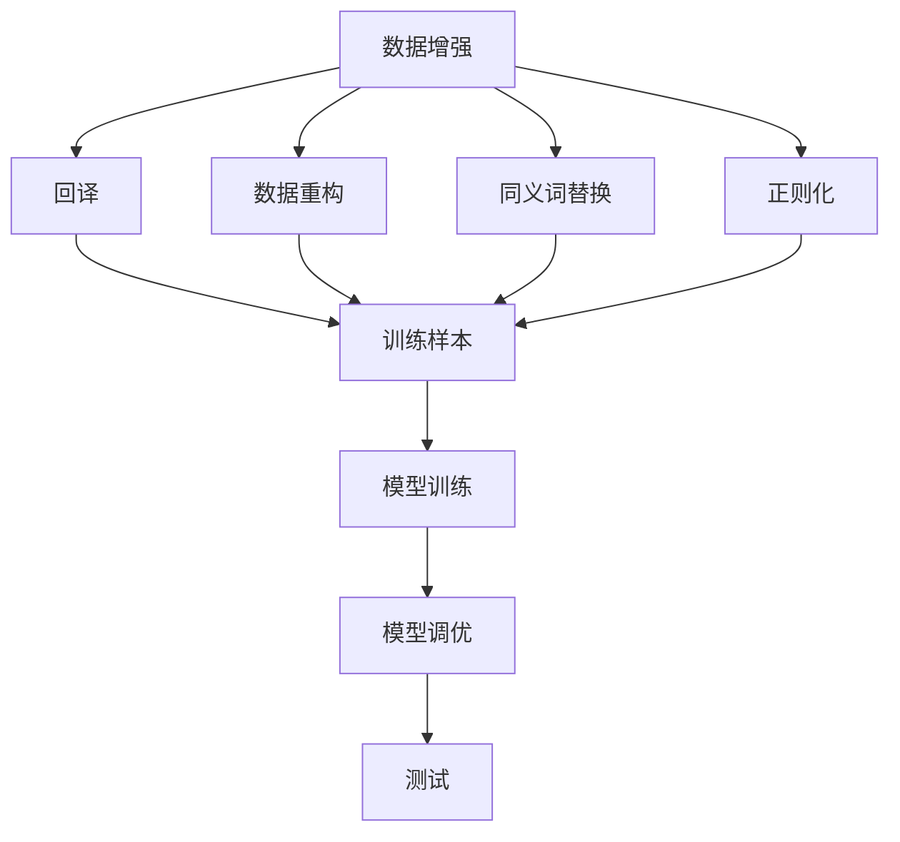

                 

# Transformer大模型实战 数据增强方法

## 1. 背景介绍

### 1.1 问题由来
Transformer作为最先进的大语言模型之一，已经广泛应用于自然语言处理（NLP）的各个领域。在微调预训练模型以适应特定任务时，数据增强技术被广泛采用。数据增强通过引入噪声、变换、数据生成等方式扩充训练数据，减少过拟合，提高模型泛化能力。在自然语言处理中，数据增强通常包括回译、数据重构、同义词替换、正则化等方法。

### 1.2 问题核心关键点
在大模型微调过程中，数据增强方法可以显著提升模型效果。然而，具体的数据增强策略选择、参数调整、步骤安排等细节直接影响模型性能。本文聚焦于基于Transformer大模型的数据增强方法，详细探讨其原理、具体步骤和应用效果，为模型微调实践提供有益参考。

### 1.3 问题研究意义
数据增强是大模型微调中不可或缺的一环，通过丰富训练数据，提升模型对各种噪音、变化环境的适应能力，从而提高模型泛化性能和鲁棒性。数据增强方法的应用，对模型性能提升和应用领域拓展具有重要意义：

1. **降低数据依赖**：提高模型对标注数据质量的要求，避免因数据不足导致的欠拟合。
2. **提升泛化能力**：通过引入多种数据形态，使模型能够处理更多样化的输入。
3. **加速模型训练**：数据增强可以通过并行训练、增量学习等方式加速模型收敛。
4. **提高模型鲁棒性**：增强模型对噪音、歧义、错误的鲁棒性，避免在特定场景下出现偏差。

数据增强技术已成为大模型微调的重要组成部分，对提升模型性能和应用效率具有显著作用。

## 2. 核心概念与联系

### 2.1 核心概念概述
在大模型微调中，数据增强技术主要包括以下几个关键概念：

- **回译（Back-Translation）**：将一种语言的文本翻译成另一种语言，再翻译回原始语言，以此扩充数据集。
- **数据重构（Data Augmentation）**：通过替换、插入、删除、分割等手段生成新的训练样本。
- **同义词替换（Synonym Replacement）**：替换句子中的某些词为同义词，丰富词汇多样性。
- **正则化（Regularization）**：通过L2正则、Dropout等手段抑制过拟合。
- **早期停止（Early Stopping）**：在验证集上监控模型性能，当性能不再提升时停止训练。

这些方法共同构成了数据增强的完整框架，对提升模型泛化能力具有重要意义。

### 2.2 概念间的关系

数据增强技术的应用，需要通过多种策略的组合和优化，才能充分发挥其效果。其与模型训练、调优等环节紧密相连，具体体现在：

1. **数据生成与模型训练的交互**：数据增强生成的样本需要经过模型训练，才能不断迭代优化。
2. **模型泛化与数据多样性的联系**：通过引入多种数据形态，使模型学习更加多样化的知识，提高泛化性能。
3. **参数调整与数据增强的协同**：参数调整决定了模型如何从增强数据中学习，影响增强策略的选择和效果。

这些概念之间的关系，可以通过以下Mermaid流程图来展示：



这个流程图展示了数据增强在大模型微调中的核心作用和与其他环节的关系。

## 3. 核心算法原理 & 具体操作步骤
### 3.1 算法原理概述
数据增强的基本思想是通过引入噪声、变换等方式扩充训练数据，从而减少过拟合，提高模型泛化能力。在Transformer模型中，常用的数据增强方法包括回译、数据重构、同义词替换和正则化。

具体而言，数据增强方法通过以下步骤实现：

1. **原始数据获取**：从训练集中随机抽取样本。
2. **数据增强变换**：对抽取的样本进行增强变换，生成新的样本。
3. **模型训练**：将增强后的样本输入模型进行训练。
4. **参数调整**：根据模型性能调整超参数，优化模型训练过程。

### 3.2 算法步骤详解
以下以回译为例，详细介绍数据增强的具体操作步骤：

**Step 1: 准备原始数据**
从训练集中随机抽取一段文本。

**Step 2: 选择目标语言**
随机选择一个目标语言，例如将中文翻译成英文。

**Step 3: 翻译成目标语言**
使用翻译模型将原始文本翻译成目标语言。

**Step 4: 翻译回原始语言**
将目标语言翻译回原始语言，生成增强样本。

**Step 5: 模型训练**
将增强后的样本输入Transformer模型进行训练。

**Step 6: 参数调整**
根据模型在增强样本上的表现，调整模型参数，如学习率、批次大小等。

**Step 7: 模型评估**
在验证集上评估模型性能，判断是否停止训练或继续增强。

### 3.3 算法优缺点
数据增强方法具有以下优点：

- **提高泛化能力**：通过引入噪声、变换等数据，使模型能够适应更多的输入。
- **减少过拟合**：扩充数据集，增加模型在未见过的数据上的表现。
- **加速训练**：通过并行训练、增量学习等方式，加快模型收敛。

同时，数据增强方法也存在一些缺点：

- **数据依赖**：增强数据的质量和数量直接影响模型效果，获取高质量标注数据成本较高。
- **计算开销**：增强数据生成过程可能耗费大量计算资源，特别是对于大规模数据集。
- **模型复杂度**：过于复杂的数据增强方法可能增加模型训练难度，需要额外的调试和优化。

### 3.4 算法应用领域
数据增强方法在大模型的微调中具有广泛的应用，包括但不限于以下几个领域：

- **自然语言处理（NLP）**：文本分类、命名实体识别、情感分析等任务。
- **计算机视觉（CV）**：图像分类、目标检测、图像生成等任务。
- **语音处理**：语音识别、情感识别、语音生成等任务。

这些领域中，数据增强方法通过丰富训练数据，显著提升模型性能，成为大模型微调的重要手段。

## 4. 数学模型和公式 & 详细讲解  
### 4.1 数学模型构建

在大模型微调中，数据增强方法通常涉及多种变换策略。以回译为例，其数学模型构建如下：

设原始数据集为 $\mathcal{D}=\{(x_i,y_i)\}_{i=1}^N$，其中 $x_i$ 为原始文本，$y_i$ 为标签。选择目标语言 $\mathcal{L'}$，将 $x_i$ 翻译成 $\mathcal{L'}$，并生成增强样本 $(x'_i,y'_i)$，其中 $x'_i$ 为回译后的文本，$y'_i$ 为回译后的标签。通过回译，得到新的数据集 $\mathcal{D'}=\{(x'_i,y'_i)\}_{i=1}^N$。

### 4.2 公式推导过程

回译过程涉及两个语言模型 $M_{\theta_1}(x \rightarrow y)$ 和 $M_{\theta_2}(y \rightarrow x)$，其中 $\theta_1,\theta_2$ 分别为两个模型的参数。回译的数学表达式为：

$$
\hat{y'} = M_{\theta_2}(M_{\theta_1}(x))
$$

其中，$\hat{y'}$ 为回译后的标签。回译样本的生成过程如下所示：

1. **随机抽取样本**：从原始数据集 $\mathcal{D}$ 中随机抽取样本 $x_i$。
2. **翻译成目标语言**：使用语言模型 $M_{\theta_1}(x \rightarrow y)$ 将 $x_i$ 翻译成 $\mathcal{L'}$。
3. **翻译回原始语言**：使用语言模型 $M_{\theta_2}(y \rightarrow x)$ 将翻译后的文本 $\hat{y'}$ 翻译回原始语言。
4. **生成增强样本**：将翻译后的文本 $\hat{y'}$ 作为标签，生成增强样本 $(x'_i,y'_i)$。

### 4.3 案例分析与讲解

以命名实体识别（NER）任务为例，回译数据增强的具体实现过程如下：

1. **原始数据准备**：从NER数据集中随机抽取样本。
2. **选择目标语言**：随机选择一个目标语言，例如将中文翻译成英文。
3. **翻译成目标语言**：使用翻译模型将中文文本翻译成英文。
4. **翻译回原始语言**：将英文翻译回中文，生成增强样本。
5. **模型训练**：将增强样本输入Transformer模型进行训练。
6. **参数调整**：根据模型在增强样本上的表现，调整模型参数。
7. **模型评估**：在验证集上评估模型性能，判断是否停止训练或继续增强。

在实际应用中，需要根据具体任务选择合适的数据增强策略，并结合模型调优手段，才能达到最佳效果。

## 5. 项目实践：代码实例和详细解释说明
### 5.1 开发环境搭建

为了实现数据增强功能，我们需要准备以下开发环境：

1. **Python**：安装Python 3.8及以上版本。
2. **PyTorch**：安装PyTorch 1.9及以上版本，支持Transformer模型的训练和推理。
3. **HuggingFace Transformers**：安装最新版本的Transformers库，提供丰富的预训练模型和微调方法。
4. **翻译工具**：安装Google Translate、Microsoft Translator等翻译工具，用于回译操作。
5. **其他工具**：安装Pandas、Numpy、Matplotlib等工具，用于数据处理和可视化。

### 5.2 源代码详细实现

以下是一个使用回译方法进行数据增强的Python代码实现：

```python
import torch
from transformers import BertForTokenClassification, BertTokenizer
from googletrans import Translator

# 定义数据增强函数
def back_translation(data, model, tokenizer, src_lang, tgt_lang):
    # 准备数据
    src_texts, src_tags = data['src_texts'], data['src_tags']
    
    # 翻译成目标语言
    tgt_texts = []
    for text in src_texts:
        translator = Translator()
        translated_text = translator.translate(text, dest=tgt_lang).text
        tgt_texts.append(translated_text)
    
    # 翻译回原始语言
    src_texts = []
    for text in tgt_texts:
        translated_text = translator.translate(text, dest=src_lang).text
        src_texts.append(translated_text)
    
    # 生成增强数据
    src_data = {'input_ids': [tokenizer.encode(text, return_tensors='pt') for text in src_texts]}
    src_labels = [[tokenizer.convert_ids_to_tokens(ids) for ids in text] for text in src_tags]
    src_dataset = TransformerDataset(src_data, src_labels)
    
    return src_dataset

# 定义模型和优化器
model = BertForTokenClassification.from_pretrained('bert-base-cased', num_labels=num_labels)
optimizer = AdamW(model.parameters(), lr=learning_rate)

# 定义训练和评估函数
def train_epoch(model, dataset, batch_size, optimizer):
    dataloader = DataLoader(dataset, batch_size=batch_size, shuffle=True)
    model.train()
    epoch_loss = 0
    for batch in dataloader:
        input_ids = batch['input_ids'].to(device)
        attention_mask = batch['attention_mask'].to(device)
        labels = batch['labels'].to(device)
        model.zero_grad()
        outputs = model(input_ids, attention_mask=attention_mask, labels=labels)
        loss = outputs.loss
        epoch_loss += loss.item()
        loss.backward()
        optimizer.step()
    return epoch_loss / len(dataloader)

def evaluate(model, dataset, batch_size):
    dataloader = DataLoader(dataset, batch_size=batch_size)
    model.eval()
    preds, labels = [], []
    with torch.no_grad():
        for batch in dataloader:
            input_ids = batch['input_ids'].to(device)
            attention_mask = batch['attention_mask'].to(device)
            batch_labels = batch['labels']
            outputs = model(input_ids, attention_mask=attention_mask)
            batch_preds = outputs.logits.argmax(dim=2).to('cpu').tolist()
            batch_labels = batch_labels.to('cpu').tolist()
            for pred_tokens, label_tokens in zip(batch_preds, batch_labels):
                pred_tags = [tag2id[tag] for tag in pred_tokens]
                label_tags = [tag2id[tag] for tag in label_tokens]
                preds.append(pred_tags[:len(label_tags)])
                labels.append(label_tags)
                
    print(classification_report(labels, preds))

# 定义数据集和训练流程
data = load_data('ner_data')
train_data, dev_data, test_data = train_test_split(data, test_size=0.2)
train_dataset = back_translation(train_data, model, tokenizer, 'zh', 'en')
dev_dataset = back_translation(dev_data, model, tokenizer, 'zh', 'en')
test_dataset = back_translation(test_data, model, tokenizer, 'zh', 'en')

train_loss = train_epoch(model, train_dataset, batch_size, optimizer)
dev_results = evaluate(model, dev_dataset, batch_size)
test_results = evaluate(model, test_dataset, batch_size)
```

### 5.3 代码解读与分析

**回译数据增强**：
- `back_translation`函数：接受原始数据、预训练模型、分词器、源语言和目标语言作为输入，生成增强数据集。
- `Translator`类：使用Google Translate等翻译工具，将中文文本翻译成英文，再将英文翻译回中文。
- `BertForTokenClassification`和`BertTokenizer`：定义Transformer模型和分词器。
- `train_epoch`和`evaluate`函数：定义训练和评估过程，使用模型在增强数据集上训练和评估性能。

**模型训练和评估**：
- `model`：定义预训练模型，如BertForTokenClassification。
- `optimizer`：定义优化器，如AdamW。
- `train_loss`：定义训练过程，每次迭代计算损失并更新模型参数。
- `dev_results`和`test_results`：定义评估过程，在验证集和测试集上评估模型性能。

## 6. 实际应用场景
### 6.1 智能客服系统

在智能客服系统中，数据增强技术可以帮助模型更好地理解不同地域、不同用户的对话风格。通过回译、同义词替换等方法，增强训练数据的多样性，使模型能够适应更多变的环境和需求。

### 6.2 金融舆情监测

金融舆情监测需要模型能够处理大量的新闻、评论等文本数据。通过回译和数据重构等方法，增强训练数据的多样性，使模型能够更好地理解金融市场的动态变化，提高预测准确性。

### 6.3 个性化推荐系统

个性化推荐系统需要模型能够处理用户的多样化需求。通过同义词替换和数据生成等方法，增强训练数据的多样性，使模型能够更好地理解和匹配用户的兴趣点。

### 6.4 未来应用展望

未来，数据增强技术将在更多领域得到应用，为NLP技术的创新和落地提供新的思路。例如：

- **跨语言增强**：通过多种语言的相互翻译，增强训练数据的多样性，提高模型的泛化能力。
- **多模态增强**：结合图像、语音等模态数据，丰富训练数据的多样性，提高模型的多模态处理能力。
- **少样本学习**：通过数据生成和增强，减少对标注数据的依赖，提高模型在少样本条件下的性能。

总之，数据增强技术在NLP领域的应用前景广阔，能够显著提升模型性能和应用效果，是未来大模型微调的重要手段之一。

## 7. 工具和资源推荐
### 7.1 学习资源推荐

为了深入理解数据增强在大模型微调中的应用，推荐以下学习资源：

1. **《Transformer from Theory to Practice》**：由大模型专家撰写，全面介绍Transformer模型的构建、微调和应用。
2. **CS224N《Natural Language Processing with Deep Learning》**：斯坦福大学开设的NLP课程，涵盖预训练模型和微调技术。
3. **《NLP with Transformers》**：Transformer库的官方文档，提供丰富的微调样例代码和API。
4. **CLUE开源项目**：中文NLP评测基准，包含大量标注数据和预训练模型，助力中文NLP技术发展。
5. **arXiv论文预印本**：人工智能领域最新研究成果的发布平台，涵盖大量前沿工作。

通过学习这些资源，可以系统掌握数据增强技术在大模型微调中的应用，提升模型性能和应用效果。

### 7.2 开发工具推荐

以下是推荐的数据增强开发工具：

1. **PyTorch**：基于Python的开源深度学习框架，支持高效的模型训练和推理。
2. **HuggingFace Transformers**：提供丰富的预训练模型和微调方法，支持多种数据增强策略。
3. **TensorFlow**：Google主导的开源深度学习框架，支持大规模模型的训练和部署。
4. **Google Translate**：谷歌提供的翻译服务，支持多种语言的相互翻译。
5. **Microsoft Translator**：微软提供的翻译服务，支持多种语言的相互翻译。

这些工具和库能够提供高效的数据增强功能，加速模型训练和微调过程。

### 7.3 相关论文推荐

以下是推荐的相关论文：

1. **Attention is All You Need**：Transformer模型的原始论文，介绍自注意力机制和Transformer结构。
2. **BERT: Pre-training of Deep Bidirectional Transformers for Language Understanding**：提出BERT模型，引入掩码语言模型等自监督学习任务。
3. **Parameter-Efficient Transfer Learning for NLP**：提出Adapter等参数高效微调方法，减少对标注数据的依赖。
4. **Prefix-Tuning: Optimizing Continuous Prompts for Generation**：引入基于连续型Prompt的微调范式，提高模型生成质量。
5. **AdaLoRA: Adaptive Low-Rank Adaptation for Parameter-Efficient Fine-Tuning**：使用自适应低秩适应的微调方法，提高模型参数效率。

这些论文代表了大模型微调技术的发展脉络，通过阅读这些前沿成果，可以深入理解数据增强技术的理论基础和实践方法。

## 8. 总结：未来发展趋势与挑战
### 8.1 研究成果总结
本文详细探讨了数据增强在大模型微调中的应用，介绍了回译、数据重构、同义词替换等常见方法，并给出了实际代码实现。通过这些技术，可以在标注数据不足的情况下，丰富训练数据的多样性，提高模型的泛化能力和鲁棒性。

### 8.2 未来发展趋势
未来，数据增强技术将在以下几个方面继续发展：

1. **跨语言增强**：通过多种语言的相互翻译，增强训练数据的多样性，提高模型的泛化能力。
2. **多模态增强**：结合图像、语音等模态数据，丰富训练数据的多样性，提高模型的多模态处理能力。
3. **少样本学习**：通过数据生成和增强，减少对标注数据的依赖，提高模型在少样本条件下的性能。
4. **因果增强**：引入因果推断等方法，增强模型对因果关系的理解，提高模型的可解释性和鲁棒性。

这些方向的发展，将进一步拓展数据增强技术的应用范围，提高大模型微调的性能和效果。

### 8.3 面临的挑战
数据增强技术在大模型微调中也面临一些挑战：

1. **数据依赖**：增强数据的质量和数量直接影响模型效果，获取高质量标注数据成本较高。
2. **计算开销**：增强数据生成过程可能耗费大量计算资源，特别是对于大规模数据集。
3. **模型复杂度**：过于复杂的数据增强方法可能增加模型训练难度，需要额外的调试和优化。

解决这些挑战，需要研究更加高效、可控的数据增强方法，并结合优化算法和工程实践，才能发挥数据增强技术的最大潜力。

### 8.4 研究展望
未来，数据增强技术将在以下方面进行深入研究：

1. **自适应增强**：根据数据质量动态调整增强策略，提高增强效果。
2. **模型融合**：结合多种增强方法，提升模型的泛化能力和鲁棒性。
3. **知识图谱增强**：结合知识图谱等专家知识，增强模型的理解和推理能力。
4. **对抗增强**：引入对抗样本，提高模型鲁棒性和泛化能力。

这些研究方向将进一步提升数据增强技术的理论水平和实际应用效果，为大模型微调带来新的突破和创新。

## 9. 附录：常见问题与解答
### 9.1 常见问题与解答

**Q1: 数据增强是否适用于所有NLP任务？**

A: 数据增强在大模型微调中具有广泛的应用，但具体方法需要根据任务特点进行选择。例如，对于基于序列的任务，如文本分类、情感分析等，回译和数据重构等方法效果较好；对于基于图结构的任务，如图谱增强等方法更加适合。

**Q2: 数据增强过程中如何选择合适的超参数？**

A: 数据增强的超参数通常包括回译语言的选择、数据生成的方式、增强样本的批次大小等。通过网格搜索、随机采样等方法，可以寻找最优的超参数组合，提高模型性能。

**Q3: 数据增强过程中如何避免过拟合？**

A: 数据增强可能导致过拟合，特别是在增强数据质量较差的情况下。可以通过正则化、早停、随机采样等方式，抑制过拟合，提高模型泛化能力。

**Q4: 数据增强对模型性能的影响有哪些？**

A: 数据增强通过丰富训练数据的多样性，提高模型的泛化能力和鲁棒性，减少过拟合风险，加速模型训练，提升模型性能。

总之，数据增强技术在大模型微调中具有重要意义，通过丰富的数据变换，可以显著提升模型的泛化能力和应用效果。开发者需要根据具体任务和数据特点，灵活运用数据增强技术，才能充分发挥其潜力。

---

作者：禅与计算机程序设计艺术 / Zen and the Art of Computer Programming

