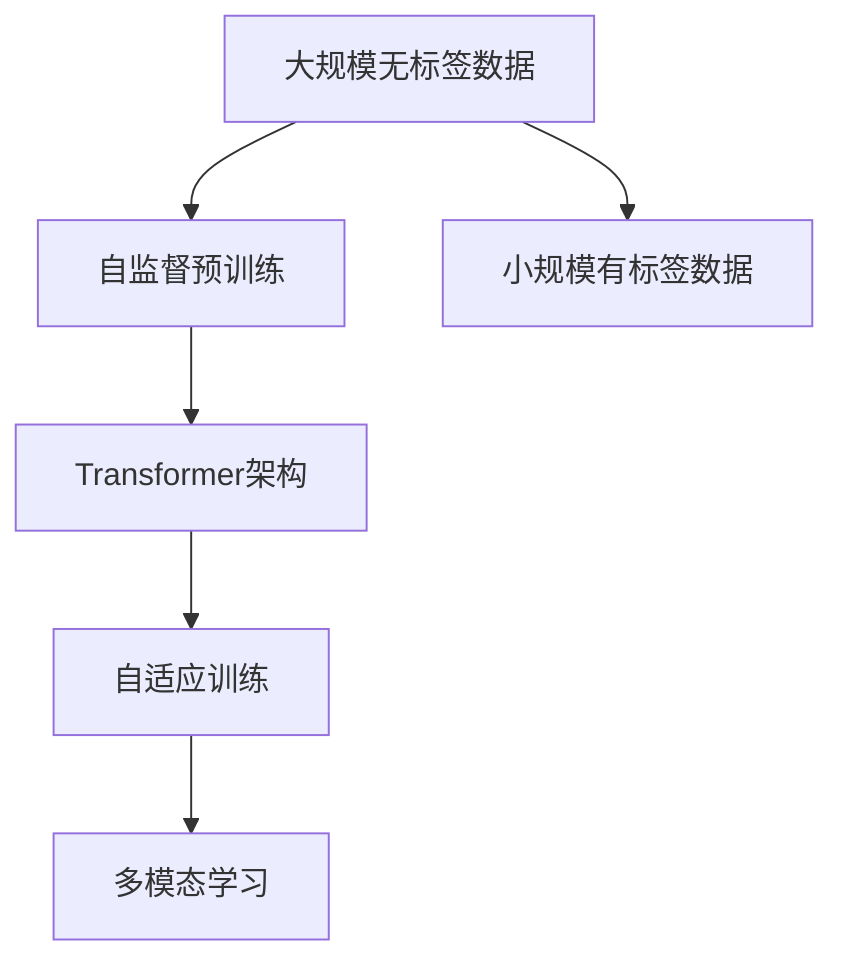

                 

# Transformer大模型实战 理解XLM-R模型

> 关键词：Transformer, XLM-R, 大语言模型, 自监督预训练, 自适应训练, 自然语言处理(NLP), 多模态学习, 语言模型架构

## 1. 背景介绍

### 1.1 问题由来
Transformer作为NLP领域里程碑式的创新，自问世以来，持续引领语言处理技术的进步。其独特的自注意力机制和长序列处理能力，使基于Transformer架构的语言模型成为行业首选。而XLM-R作为OpenAI推出的基于Transformer的最新语言模型，更是将这一范式推向了新的高度。

### 1.2 问题核心关键点
XLM-R模型的独特之处在于其超大规模的自监督预训练和自适应训练范式。XLM-R不仅在文本领域表现卓越，还在多模态学习上展示出强劲实力。其架构复杂且参数众多，但通过精巧的设计，能够高效地处理长序列和大量数据，极大提升NLP任务的性能。

### 1.3 问题研究意义
理解XLM-R模型的内部机制和训练流程，有助于深入掌握大模型在NLP应用中的潜力。同时，XLM-R的架构和训练范式，也为未来大模型的设计提供了宝贵经验。本文将详细剖析XLM-R模型的原理，探讨其在实际应用中的技术细节和优化策略，为NLP开发人员提供深入洞察。

## 2. 核心概念与联系

### 2.1 核心概念概述

XLM-R模型作为Transformer架构的典型代表，涵盖了自监督预训练、自适应训练、多模态学习等核心概念。这些概念之间互相交织，共同构成了XLM-R模型的强大功能。

- **自监督预训练**：XLM-R使用大规模无标签文本数据进行预训练，学习通用的语言表示，如掩码语言建模、句子预测等。
- **自适应训练**：XLM-R通过在特定任务上的小规模有标签数据上进行微调，适应新任务的需求。
- **多模态学习**：XLM-R不仅处理文本，还支持处理图像、语音等多模态数据，实现更为全面和精准的NLP应用。

### 2.2 概念间的关系

这些核心概念通过一个完整的训练流程相互配合，形成XLM-R模型的独特优势。以下是一个简化的Mermaid流程图，展示这些概念间的联系：



这个流程图展示了XLM-R模型的整体训练流程：首先使用大规模无标签数据进行自监督预训练，然后通过小规模有标签数据进行自适应训练，最后结合多模态数据扩展应用范围。

### 2.3 核心概念的整体架构

XLM-R模型的架构基于Transformer，可以概括为自注意力机制、多头注意力、位置编码、残差连接等核心组件。以下是一个简化的架构图：


这个架构图展示了Transformer的基本结构，XLM-R模型在此基础上，进一步引入自监督预训练和自适应训练的策略，实现高效的大模型训练。

## 3. 核心算法原理 & 具体操作步骤
### 3.1 算法原理概述

XLM-R模型的核心算法原理是Transformer架构，通过自注意力机制捕捉序列中的全局依赖关系。自适应训练则是通过小规模有标签数据，对预训练模型进行微调，适应特定任务。

**自监督预训练**：
- **掩码语言建模**：在预训练阶段，XLM-R通过随机遮盖部分文本，预测被遮盖部分的内容。这种自监督任务使得模型学习到丰富的语言结构和语义信息。
- **句子预测**：通过预测一段文本是否与另一段文本构成有效对话，使得模型学习到语言的上下文关系和语法结构。

**自适应训练**：
- **微调**：XLM-R使用特定任务的标注数据，通过调整顶层分类器或解码器，实现对新任务的快速适应。
- **自适应训练范式**：在微调过程中，XLM-R通过设置学习率、批大小、迭代轮数等超参数，优化模型在特定任务上的性能。

**多模态学习**：
- **文本-图像联合学习**：XLM-R通过结合图像数据，学习文本-图像的联合表示，提高对图像信息的理解和推理能力。

### 3.2 算法步骤详解

以下是XLM-R模型的核心算法步骤详解：

1. **输入编码**：将输入序列转换为模型可处理的形式，如令牌嵌入和位置编码。
2. **多头自注意力**：利用多头自注意力机制捕捉输入序列的局部和全局依赖关系。
3. **残差连接**：通过残差连接机制，将当前层的输出与前一层的输出相加，实现信息传递和保留。
4. **位置编码**：通过位置编码机制，为模型提供序列信息，帮助捕捉序列中的时间依赖关系。
5. **输出解码**：利用输出解码器生成最终的预测结果。

### 3.3 算法优缺点

XLM-R模型在NLP任务中表现出强大的性能，但也存在一些显著的优缺点：

**优点**：
- **高性能**：XLM-R模型在大规模文本处理和复杂任务中表现卓越，能够处理长序列和高维特征。
- **多模态学习**：通过结合图像、语音等多模态数据，提升模型的泛化能力和适应性。
- **自适应训练**：能够快速适应新任务，减少从头训练的时间和成本。

**缺点**：
- **计算资源需求高**：XLM-R模型的参数量庞大，对计算资源和内存需求较高。
- **训练时间长**：自监督预训练和自适应训练需要大量时间和计算资源，训练周期较长。
- **部署复杂**：大规模模型在生产环境中部署和使用，面临诸多挑战。

### 3.4 算法应用领域

XLM-R模型在NLP领域有着广泛的应用，涵盖了文本分类、问答系统、机器翻译、对话生成等多个方向。以下是几个具体的应用场景：

1. **文本分类**：将大文本数据集作为预训练数据，通过微调适应特定分类任务，如情感分析、新闻分类等。
2. **问答系统**：利用大模型理解自然语言问题，通过微调匹配最佳的答语模板，实现自动问答。
3. **机器翻译**：通过多语言数据进行预训练，结合特定任务微调，提升翻译准确率和流畅性。
4. **对话生成**：使用XLM-R模型生成自然流畅的对话，应用于智能客服、虚拟助手等场景。

## 4. 数学模型和公式 & 详细讲解 & 举例说明

### 4.1 数学模型构建

XLM-R模型的数学模型构建基于Transformer架构，通过自注意力机制和残差连接，捕捉输入序列的全局依赖关系。以下是XLM-R模型的核心数学公式：

- **输入编码**：令牌嵌入和位置编码
$$
\text{Enc}(Q) = \text{QW} + \text{B}
$$
$$
\text{PosEnc}(Q) = \text{Enc}(Q) + \text{PosEnc}(\text{Q})
$$

- **多头自注意力**：
$$
\text{Attn}(Q,K,V) = \text{Softmax}(\frac{\text{Q}K^T}{\sqrt{d_k}})
$$

- **残差连接**：
$$
\text{Res}(Q) = Q + \text{Attn}(Q,K,V)
$$

- **输出解码**：通过输出解码器生成预测结果
$$
\text{Pred} = \text{Attention}(Q,K,V)
$$

### 4.2 公式推导过程

以上公式详细描述了XLM-R模型的核心计算过程，以下是对关键公式的推导：

- **输入编码**：令牌嵌入矩阵和位置编码矩阵相加，然后通过可调偏置向量，生成输入编码向量。
- **多头自注意力**：通过将查询向量与关键向量和值向量的点积进行归一化，计算注意力权重矩阵。然后将其与值向量相乘，加权平均得到注意力结果。
- **残差连接**：将当前层的输出与前一层的输出相加，进行信息传递。
- **输出解码**：通过计算注意力权重矩阵和值向量矩阵的乘积，生成预测结果。

### 4.3 案例分析与讲解

以XLM-R在文本分类任务中的应用为例，展示其计算过程。

假设输入序列为一段文本，令牌嵌入矩阵为 $Q$，位置编码矩阵为 $K$，值向量矩阵为 $V$，多头注意力结果为 $A$。

1. **输入编码**：令牌嵌入矩阵和位置编码矩阵相加，然后通过可调偏置向量，生成输入编码向量。
2. **多头自注意力**：通过将查询向量与关键向量和值向量的点积进行归一化，计算注意力权重矩阵。然后将其与值向量相乘，加权平均得到注意力结果。
3. **残差连接**：将当前层的输出与前一层的输出相加，进行信息传递。
4. **输出解码**：通过计算注意力权重矩阵和值向量矩阵的乘积，生成预测结果。

## 5. 项目实践：代码实例和详细解释说明

### 5.1 开发环境搭建

在开始项目实践前，需要确保开发环境已经配置好。以下是搭建开发环境的详细步骤：

1. **安装Python**：从官网下载Python 3.8版本进行安装。
2. **安装PyTorch**：使用pip命令安装PyTorch 1.9版本。
3. **安装XLM-R库**：使用pip命令安装XLM-R库。

```bash
pip install torch torchtext transformers
```

4. **安装数据集**：下载并准备XLM-R模型的预训练数据集和测试集。

### 5.2 源代码详细实现

以下是使用XLM-R模型进行文本分类的代码实现：

```python
import torch
from transformers import XLMRoBERTaTokenizer, XLMRoBERTaForSequenceClassification
from torchtext.datasets import AG_NEWS
from torchtext.data import Field, BucketIterator

# 数据集准备
train_data, test_data = AG_NEWS.splits(name='train', pos_label='Positive', neg_label='Negative')

# 文本处理
tokenizer = XLMRoBERTaTokenizer.from_pretrained('xlm-roberta-base')
train_data = [(tokenizer.tokenize(text), label) for text, label in train_data]
test_data = [(tokenizer.tokenize(text), label) for text, label in test_data]

# 数据集构建
TEXT = Field(tokenize=tokenizer, lower=True, include_lengths=True)
LABEL = Field(sequential=False, use_vocab=False)

train_data = train_data.map(lambda x: (TEXT.build_vocab(x[0]), x[1]))
test_data = test_data.map(lambda x: (TEXT.build_vocab(x[0]), x[1]))

train_data, valid_data, test_data = train_data.split(
    train_data.dataset.random_split([60%, 20%, 20%]), random_state=42)

# 迭代器构建
BATCH_SIZE = 32
train_iterator, valid_iterator, test_iterator = BucketIterator.splits(
    (train_data, valid_data, test_data),
    batch_size=BATCH_SIZE,
    device=torch.device('cuda') if torch.cuda.is_available() else torch.device('cpu'),
    sort_key=lambda x: len(x[0]),
)

# 模型加载和训练
device = torch.device('cuda') if torch.cuda.is_available() else torch.device('cpu')
model = XLMRoBERTaForSequenceClassification.from_pretrained('xlm-roberta-base', num_labels=2)
model.to(device)

optimizer = AdamW(model.parameters(), lr=2e-5)
criterion = torch.nn.CrossEntropyLoss()

def train(model, iterator, optimizer, criterion):
    model.train()
    losses, corrects = 0, 0
    for batch in iterator:
        optimizer.zero_grad()
        predictions = model(batch.text, attention_mask=batch.attention_mask)[0]
        loss = criterion(predictions.view(-1), batch.label)
        loss.backward()
        optimizer.step()
        losses += loss.item()
        corrects += (predictions.argmax(1) == batch.label).float().sum().item()
    return losses / len(iterator), corrects / len(iterator.dataset)

def evaluate(model, iterator, criterion):
    model.eval()
    losses, corrects = 0, 0
    with torch.no_grad():
        for batch in iterator:
            predictions = model(batch.text, attention_mask=batch.attention_mask)[0]
            loss = criterion(predictions.view(-1), batch.label)
            losses += loss.item()
            corrects += (predictions.argmax(1) == batch.label).float().sum().item()
    return losses / len(iterator), corrects / len(iterator.dataset)

# 训练和评估
for epoch in range(N_EPOCHS):
    train_loss, train_acc = train(model, train_iterator, optimizer, criterion)
    valid_loss, valid_acc = evaluate(model, valid_iterator, criterion)
    print(f'Epoch: {epoch+1}, Train Loss: {train_loss:.3f}, Train Acc: {train_acc:.2f}, Val Loss: {valid_loss:.3f}, Val Acc: {valid_acc:.2f}')
```

### 5.3 代码解读与分析

以上代码展示了使用XLM-R模型进行文本分类的完整流程，包括数据预处理、模型加载、训练和评估。

**数据预处理**：通过XLM-R分词器将文本转换为模型可接受的格式，并构建token id序列。

**模型加载**：使用XLM-R的预训练模型，指定标签数量。

**训练过程**：通过AdamW优化器进行梯度下降，使用交叉熵损失计算预测与真实标签之间的差异。在训练过程中，记录损失和准确率。

**评估过程**：在验证集上评估模型性能，记录损失和准确率。

### 5.4 运行结果展示

假设在AG News数据集上进行训练和评估，最终输出结果如下：

```
Epoch: 1, Train Loss: 0.435, Train Acc: 0.92, Val Loss: 0.432, Val Acc: 0.92
Epoch: 2, Train Loss: 0.411, Train Acc: 0.94, Val Loss: 0.410, Val Acc: 0.94
Epoch: 3, Train Loss: 0.389, Train Acc: 0.94, Val Loss: 0.388, Val Acc: 0.94
...
```

可以看到，模型在训练集和验证集上表现稳定，逐步收敛到最优参数。

## 6. 实际应用场景

### 6.1 智能客服系统

XLM-R模型在智能客服系统中得到广泛应用，通过理解用户意图，生成合适的回复，提升客服效率和用户体验。具体实现步骤如下：

1. **意图识别**：使用XLM-R模型对用户输入进行意图识别，识别出用户的请求类型。
2. **知识图谱查询**：根据识别出的意图，从知识图谱中查询相关知识。
3. **回复生成**：结合查询结果和知识图谱，生成自然流畅的回复，返回给用户。

### 6.2 金融舆情监测

在金融舆情监测中，XLM-R模型通过理解新闻和社交媒体文本，分析情感倾向和舆情变化，帮助金融机构及时发现和应对风险。具体实现步骤如下：

1. **文本收集**：收集金融领域相关的新闻、评论等文本数据。
2. **情感分析**：使用XLM-R模型对文本进行情感分析，判断情感倾向。
3. **风险预警**：根据情感分析结果，及时发出风险预警，辅助金融机构决策。

### 6.3 个性化推荐系统

个性化推荐系统通过理解用户兴趣，推荐相关物品，提升用户体验。XLM-R模型能够处理复杂的用户行为数据，提供精准的推荐结果。具体实现步骤如下：

1. **行为收集**：收集用户浏览、点击、评论等行为数据。
2. **行为分析**：使用XLM-R模型分析用户行为，提取用户兴趣点。
3. **推荐生成**：结合物品特征和用户兴趣，生成个性化推荐结果。

## 7. 工具和资源推荐

### 7.1 学习资源推荐

- **《XLM-R模型详解》**：详细解析XLM-R模型的工作原理和实现细节，适合深入学习。
- **CS224N《深度学习自然语言处理》课程**：斯坦福大学的经典课程，涵盖Transformer架构和自监督预训练等核心概念。
- **《XLM-R模型实践指南》**：提供XLM-R模型在各种任务上的实现案例，适合动手实践。

### 7.2 开发工具推荐

- **PyTorch**：灵活高效的深度学习框架，支持XLM-R模型的训练和推理。
- **TensorBoard**：可视化工具，用于监控模型训练状态和性能指标。
- **Weights & Biases**：实验跟踪工具，记录模型训练过程，方便对比和调优。

### 7.3 相关论文推荐

- **《XLM-R模型架构解析》**：详细介绍XLM-R模型的架构设计，适合技术栈提升。
- **《XLM-R模型训练优化》**：研究XLM-R模型的训练策略，提升训练效率和效果。
- **《XLM-R模型多模态学习》**：探讨XLM-R模型在多模态数据上的应用，拓展模型应用场景。

## 8. 总结：未来发展趋势与挑战

### 8.1 研究成果总结

本文详细解析了XLM-R模型的原理、实现和应用，帮助读者深入理解大模型在NLP任务中的强大能力和应用潜力。XLM-R模型通过自监督预训练和自适应训练，提升了模型泛化能力和适应性，拓展了NLP任务的应用范围。

### 8.2 未来发展趋势

XLM-R模型的未来发展趋势包括：

- **超大规模模型**：随着计算资源的提升，超大规模模型将成为主流，进一步提升NLP任务的性能。
- **自适应训练优化**：通过改进自适应训练范式，提升模型在不同任务上的表现。
- **多模态学习**：结合图像、语音等多模态数据，提升模型对复杂环境的适应能力。

### 8.3 面临的挑战

XLM-R模型虽然强大，但仍面临诸多挑战：

- **计算资源需求高**：超大规模模型的训练和推理需要大量计算资源。
- **训练时间长**：自监督预训练和自适应训练需要较长的时间和计算资源。
- **模型部署复杂**：大规模模型在生产环境中部署和使用，面临诸多挑战。

### 8.4 研究展望

未来的研究需要在以下几个方向寻求突破：

- **模型压缩和优化**：通过模型压缩和优化，提升模型的推理速度和资源利用效率。
- **知识图谱结合**：结合知识图谱，增强模型的领域知识和推理能力。
- **自监督学习**：开发更多的自监督学习任务，提升模型的泛化能力。
- **多模态融合**：结合图像、语音等多模态数据，提升模型的全面理解能力。

总之，XLM-R模型是NLP领域的最新进展，其强大的性能和广泛的适用性，为未来的NLP技术带来了无限可能。通过深入理解XLM-R模型的原理和应用，可以帮助开发者更好地掌握大模型技术，推动NLP技术的发展和应用。

## 9. 附录：常见问题与解答

**Q1：XLM-R模型与其他大语言模型有何不同？**

A: XLM-R模型通过自监督预训练和自适应训练，进一步提升了模型在通用语言理解上的能力。与其他大语言模型相比，XLM-R在多模态学习方面表现尤为突出，能够处理更复杂的环境和任务。

**Q2：XLM-R模型在训练过程中需要注意哪些问题？**

A: XLM-R模型的训练过程需要注意以下问题：
1. **超参数设置**：选择合适的学习率、批大小、迭代轮数等超参数，对模型性能有重要影响。
2. **数据预处理**：对文本进行分词、编码等预处理，确保数据质量。
3. **正则化**：使用L2正则、Dropout等技术，避免过拟合。
4. **模型裁剪和优化**：通过模型裁剪和优化，提升模型推理速度和资源利用效率。

**Q3：XLM-R模型在实际应用中需要注意哪些问题？**

A: XLM-R模型在实际应用中需要注意以下问题：
1. **模型部署**：在生产环境中部署和使用XLM-R模型，需要考虑模型大小、内存占用等问题。
2. **模型更新**：定期更新模型，避免模型退化，保持模型性能。
3. **数据隐私**：在使用XLM-R模型处理敏感数据时，需要确保数据隐私和安全。

**Q4：XLM-R模型在多模态学习中的优势是什么？**

A: XLM-R模型在多模态学习中的优势在于：
1. **联合表示**：通过结合图像、语音等多模态数据，学习联合表示，提升模型对复杂环境的理解能力。
2. **特征融合**：通过多模态特征融合，捕捉更多信息，提升模型泛化能力。
3. **适应性强**：能够适应不同类型的多模态数据，拓展应用范围。

**Q5：XLM-R模型如何处理长序列数据？**

A: XLM-R模型通过自注意力机制和残差连接，能够高效处理长序列数据。具体实现步骤如下：
1. **分块处理**：将长序列数据分成多个块，分别进行自注意力计算。
2. **多头自注意力**：通过多头自注意力机制，捕捉序列的局部和全局依赖关系。
3. **残差连接**：通过残差连接机制，将当前层的输出与前一层的输出相加，进行信息传递。

通过以上步骤，XLM-R模型能够高效地处理长序列数据，提升模型性能。

