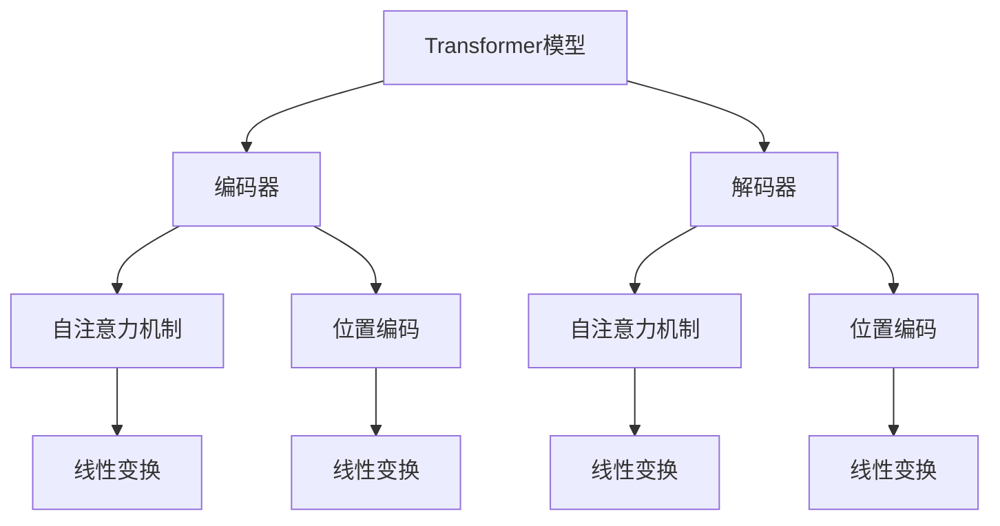
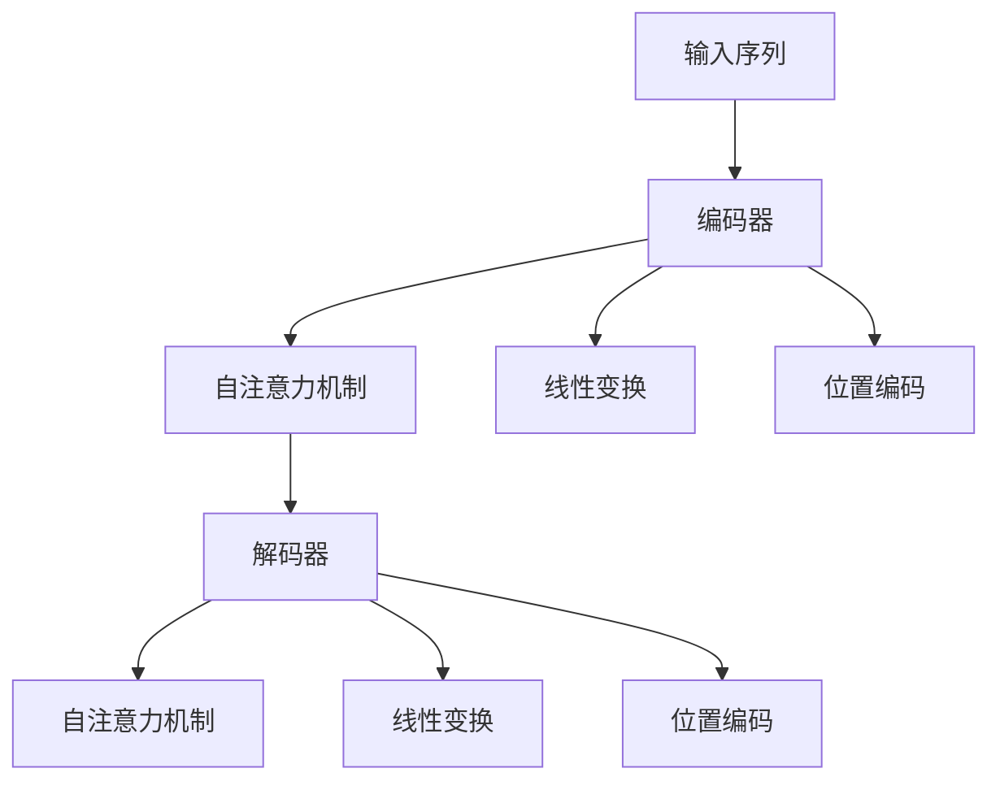
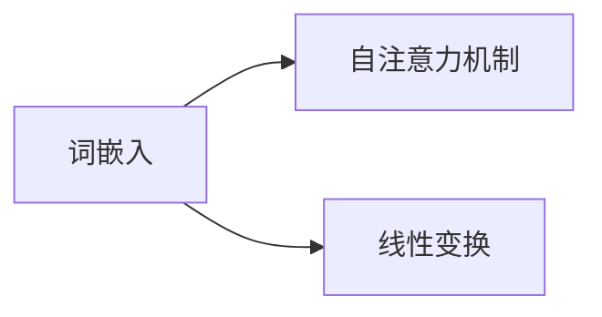
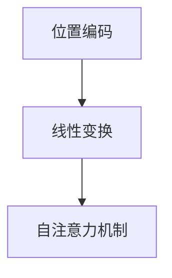

                 

# Transformer架构原理详解：词嵌入 Word Embedding 原理与应用

> 关键词：Transformer, 词嵌入, Attention, 自注意力机制, 位置编码, 线性变换

## 1. 背景介绍

### 1.1 问题由来
Transformer作为近年来NLP领域的一种革命性模型，因其独特的架构设计和高效的应用性能，迅速成为大规模预训练语言模型的首选。Transformer模型主要由两个关键组件组成：编码器和解码器，它们通过自注意力机制来实现输入序列到输出序列的映射。其中，词嵌入作为输入序列的基础特征表示，扮演了至关重要的角色。

### 1.2 问题核心关键点
词嵌入（Word Embedding）是大规模语言模型中的核心概念之一，它将离散的词汇映射到连续的向量空间，使得模型能够更好地理解词语的语义和上下文关系。Transformer架构中的词嵌入不仅是输入表示的基础，还通过自注意力机制与模型其他组件互动，实现高效的信息流动和跨层交互。

### 1.3 问题研究意义
理解词嵌入在Transformer模型中的原理和应用，对于掌握Transformer架构的精髓，以及进一步优化和扩展Transformer模型，具有重要意义。通过深入研究词嵌入的实现方式、优化策略及其在实际项目中的应用，可以提升NLP任务的性能和模型的泛化能力，推动NLP技术的快速发展。

## 2. 核心概念与联系

### 2.1 核心概念概述

为更好地理解Transformer架构中词嵌入的原理，本节将介绍几个密切相关的核心概念：

- **Transformer模型**：一种基于自注意力机制的序列到序列（Sequence-to-Sequence, Seq2Seq）模型，广泛用于机器翻译、文本生成、语音识别等领域。
- **词嵌入（Word Embedding）**：将词汇映射到低维连续空间中的向量表示，能够捕捉词汇之间的语义关系。
- **自注意力机制**：Transformer模型中的核心组件，通过计算输入序列中每个元素与其他元素的相似度，实现信息的多重关注和交互。
- **位置编码**：用于解决Transformer模型中无法感知序列位置的问题，通过在词嵌入向量中添加位置信息，使模型能够正确处理输入序列中的位置依赖。
- **线性变换**：Transformer模型中常用的基本操作，用于对词嵌入向量进行加权处理，提升模型的表达能力和适应性。

这些核心概念之间的逻辑关系可以通过以下Mermaid流程图来展示：



这个流程图展示了Transformer模型中主要组件之间的相互关系：

1. 编码器和解码器分别通过自注意力机制和线性变换实现对输入序列的编码和解码。
2. 位置编码通过对词嵌入向量添加位置信息，帮助模型处理输入序列中的位置依赖。
3. 线性变换通过加权处理，增强了模型的表达能力和适应性。

通过理解这些核心概念，我们可以更好地把握Transformer架构的设计思路和优化策略。

### 2.2 概念间的关系

这些核心概念之间存在着紧密的联系，形成了Transformer模型中词嵌入和信息流动的完整体系。下面我们通过几个Mermaid流程图来展示这些概念之间的关系。

#### 2.2.1 Transformer架构概览



这个流程图展示了Transformer模型中编码器和解码器的作用流程：

1. 编码器通过自注意力机制和线性变换对输入序列进行编码，得到编码后的特征表示。
2. 解码器同样通过自注意力机制和线性变换对编码后的特征表示进行解码，得到输出序列。
3. 位置编码通过在词嵌入向量中添加位置信息，确保模型能够正确处理输入序列中的位置依赖。

#### 2.2.2 词嵌入与自注意力机制的关系



这个流程图展示了词嵌入与自注意力机制的关系：

1. 词嵌入通过线性变换转化为高维特征向量。
2. 自注意力机制通过计算词向量之间的相似度，实现对输入序列中每个元素的关注和交互。
3. 自注意力机制的输出再次通过线性变换转化为词向量。

#### 2.2.3 位置编码与线性变换的关系



这个流程图展示了位置编码与线性变换的关系：

1. 位置编码通过在词嵌入向量中添加位置信息，增强了模型的序列感知能力。
2. 位置编码后的词嵌入向量再次通过线性变换转化为高维特征向量。
3. 自注意力机制通过计算位置编码后的词向量，实现对输入序列中每个元素的多重关注和交互。

通过这些流程图，我们可以更清晰地理解Transformer模型中词嵌入和信息流动的整体架构。

## 3. 核心算法原理 & 具体操作步骤
### 3.1 算法原理概述

Transformer架构中的词嵌入主要通过线性变换将离散的词汇映射到高维连续空间中，使得模型能够捕捉词汇之间的语义关系和上下文信息。词嵌入作为Transformer模型的输入，通过自注意力机制与模型其他组件互动，实现高效的信息流动和跨层交互。

Transformer模型的词嵌入一般通过预训练语言模型（如Word2Vec、GloVe等）或自监督学习方法（如BERT、GPT等）获得，这些方法通过大量无标签文本数据的自监督预训练，学习到词汇的分布式表示，使得模型能够更好地理解自然语言的语义和语法结构。

### 3.2 算法步骤详解

Transformer模型中的词嵌入通常分为以下几个步骤：

1. **初始化词嵌入矩阵**：通过预训练语言模型或其他自监督学习方法，生成一个大小为 $v \times d$ 的词嵌入矩阵 $E$，其中 $v$ 为词汇表大小，$d$ 为词嵌入维度。
2. **线性变换**：将词嵌入矩阵 $E$ 通过一个线性变换层，生成 $v \times d_h$ 的隐层特征矩阵 $H$，其中 $d_h$ 为隐层维度。
3. **位置编码**：在隐层特征矩阵 $H$ 中添加位置编码，生成 $v \times d_h$ 的位置编码矩阵 $P$，其中位置编码维度为 $d_h$。
4. **自注意力机制**：通过计算自注意力权重矩阵 $A$，将位置编码矩阵 $P$ 与词嵌入矩阵 $E$ 相乘，生成自注意力输出矩阵 $S$。
5. **输出变换**：将自注意力输出矩阵 $S$ 通过线性变换层，生成 $v \times d_o$ 的输出词向量 $O$，其中 $d_o$ 为输出维度。

### 3.3 算法优缺点

Transformer架构中的词嵌入具有以下优点：

1. **分布式表示**：通过词嵌入，将离散词汇映射到高维连续空间中，捕捉词汇之间的语义关系。
2. **自注意力机制**：通过自注意力机制，模型能够同时关注输入序列中的多个位置，实现信息的多重交互和复杂关系的建模。
3. **位置感知**：通过位置编码，模型能够正确处理输入序列中的位置依赖，避免信息丢失。
4. **高效性**：通过线性变换和自注意力机制的结合，模型能够在保证表达能力的同时，减少计算复杂度。

同时，词嵌入也存在一些局限性：

1. **维度选择**：词嵌入维度 $d$ 的选择需要权衡表达能力和计算资源的消耗。过高的维度可能导致过拟合，过低的维度可能导致信息损失。
2. **训练成本**：预训练语言模型和自监督学习方法的训练成本较高，需要大量计算资源和时间。
3. **泛化能力**：预训练语言模型和自监督学习方法主要基于通用语料进行训练，可能无法很好地适应特定领域的任务。

### 3.4 算法应用领域

Transformer架构中的词嵌入已在多个领域得到了广泛应用，包括但不限于：

- **机器翻译**：通过将输入序列的词嵌入转化为输出序列的词嵌入，实现不同语言之间的翻译。
- **文本生成**：通过生成与输入序列类似的词嵌入，实现文本生成、对话系统等功能。
- **信息检索**：通过计算输入查询和文档的词嵌入之间的相似度，实现高效的信息检索。
- **文本摘要**：通过生成与输入文本相似的词嵌入，实现文本摘要和总结。
- **语音识别**：通过将输入语音转化为词嵌入，实现语音到文本的转换。

这些应用展示了Transformer架构中词嵌入的强大能力和广泛适用性。

## 4. 数学模型和公式 & 详细讲解 & 举例说明

### 4.1 数学模型构建

Transformer模型中的词嵌入主要通过以下数学模型进行构建：

设词嵌入矩阵为 $E \in \mathbb{R}^{v \times d}$，隐层特征矩阵为 $H \in \mathbb{R}^{v \times d_h}$，位置编码矩阵为 $P \in \mathbb{R}^{v \times d_h}$，自注意力权重矩阵为 $A \in \mathbb{R}^{v \times d_h \times d_h}$，输出变换矩阵为 $W_O \in \mathbb{R}^{d_o \times d_h}$。则Transformer模型中的词嵌入计算过程如下：

1. **线性变换**：
   $$
   H = EW_E + b_E
   $$

2. **位置编码**：
   $$
   P = \text{posEnc}(H)
   $$

3. **自注意力机制**：
   $$
   S = H + \text{Att}(A, H, P)
   $$

4. **输出变换**：
   $$
   O = SW_O + b_O
   $$

其中，$W_E, W_O$ 为线性变换矩阵，$b_E, b_O$ 为偏置向量，$\text{posEnc}$ 为位置编码函数，$\text{Att}$ 为自注意力函数。

### 4.2 公式推导过程

以下我们将详细推导Transformer模型中的词嵌入计算过程：

1. **线性变换**：
   $$
   H = EW_E + b_E
   $$
   其中 $W_E \in \mathbb{R}^{d_h \times d}$ 为线性变换矩阵，$b_E \in \mathbb{R}^{d_h}$ 为偏置向量。

2. **位置编码**：
   $$
   P = \text{posEnc}(H)
   $$
   位置编码函数 $\text{posEnc}$ 可以采用正弦/余弦位置编码、相对位置编码等方法，本文以正弦/余弦位置编码为例：
   $$
   P_{i,j} = \text{sin}(\frac{2\pi i / d_h}{2^j}) + \text{cos}(\frac{2\pi i / d_h}{2^j})
   $$
   其中 $i$ 表示位置编号，$j$ 表示位置编码层数，$d_h$ 为位置编码维度。

3. **自注意力机制**：
   $$
   S = H + \text{Att}(A, H, P)
   $$
   自注意力函数 $\text{Att}$ 可以采用点积注意力、多头注意力等方法，本文以多头注意力为例：
   $$
   S = \text{softmax}(QK^T)V
   $$
   其中 $Q \in \mathbb{R}^{v \times d_h}$ 为查询矩阵，$K \in \mathbb{R}^{v \times d_h}$ 为键矩阵，$V \in \mathbb{R}^{v \times d_h}$ 为值矩阵。

4. **输出变换**：
   $$
   O = SW_O + b_O
   $$
   其中 $W_O \in \mathbb{R}^{d_o \times d_h}$ 为输出变换矩阵，$b_O \in \mathbb{R}^{d_o}$ 为偏置向量。

### 4.3 案例分析与讲解

以机器翻译任务为例，Transformer模型中的词嵌入计算过程如下：

1. **源语言词嵌入**：
   $$
   H_s = EW_E + b_E
   $$

2. **目标语言词嵌入**：
   $$
   H_t = EW_E + b_E
   $$

3. **位置编码**：
   $$
   P_s = \text{posEnc}(H_s)
   $$
   $$
   P_t = \text{posEnc}(H_t)
   $$

4. **自注意力机制**：
   $$
   S_s = H_s + \text{Att}(A, H_s, P_s)
   $$
   $$
   S_t = H_t + \text{Att}(A, H_t, P_t)
   $$

5. **输出变换**：
   $$
   O_s = SW_O + b_O
   $$
   $$
   O_t = SW_O + b_O
   $$

6. **预测输出**：
   通过解码器对目标语言词嵌入 $O_t$ 进行解码，生成预测输出 $Y$。

通过上述计算过程，Transformer模型能够有效地处理输入序列中的上下文信息，实现机器翻译等序列生成任务的高效完成。

## 5. 项目实践：代码实例和详细解释说明

### 5.1 开发环境搭建

在进行Transformer模型的词嵌入实现前，我们需要准备好开发环境。以下是使用Python进行PyTorch开发的环境配置流程：

1. 安装Anaconda：从官网下载并安装Anaconda，用于创建独立的Python环境。

2. 创建并激活虚拟环境：
```bash
conda create -n pytorch-env python=3.8 
conda activate pytorch-env
```

3. 安装PyTorch：根据CUDA版本，从官网获取对应的安装命令。例如：
```bash
conda install pytorch torchvision torchaudio cudatoolkit=11.1 -c pytorch -c conda-forge
```

4. 安装Transformers库：
```bash
pip install transformers
```

5. 安装各类工具包：
```bash
pip install numpy pandas scikit-learn matplotlib tqdm jupyter notebook ipython
```

完成上述步骤后，即可在`pytorch-env`环境中开始Transformer模型的词嵌入实现。

### 5.2 源代码详细实现

这里我们以机器翻译任务为例，给出使用Transformers库对BERT模型进行微调的PyTorch代码实现。

首先，定义机器翻译数据处理函数：

```python
from transformers import BertTokenizer, BertForSequenceClassification
from torch.utils.data import Dataset
import torch

class TranslationDataset(Dataset):
    def __init__(self, src_texts, trg_texts, tokenizer):
        self.src_texts = src_texts
        self.trg_texts = trg_texts
        self.tokenizer = tokenizer
        
    def __len__(self):
        return len(self.src_texts)
    
    def __getitem__(self, item):
        src_text = self.src_texts[item]
        trg_text = self.trg_texts[item]
        
        encoding = self.tokenizer(src_text, trg_text, return_tensors='pt', padding=True, truncation=True, max_length=256)
        src_input_ids = encoding['src_input_ids']
        src_attention_mask = encoding['src_attention_mask']
        trg_input_ids = encoding['trg_input_ids']
        trg_attention_mask = encoding['trg_attention_mask']
        
        return {'src_input_ids': src_input_ids,
                'src_attention_mask': src_attention_mask,
                'trg_input_ids': trg_input_ids,
                'trg_attention_mask': trg_attention_mask}
```

然后，定义模型和优化器：

```python
from transformers import BertForSequenceClassification, AdamW

model = BertForSequenceClassification.from_pretrained('bert-base-cased', num_labels=2)

optimizer = AdamW(model.parameters(), lr=2e-5)
```

接着，定义训练和评估函数：

```python
from torch.utils.data import DataLoader
from tqdm import tqdm
from sklearn.metrics import accuracy_score

device = torch.device('cuda') if torch.cuda.is_available() else torch.device('cpu')
model.to(device)

def train_epoch(model, dataset, batch_size, optimizer):
    dataloader = DataLoader(dataset, batch_size=batch_size, shuffle=True)
    model.train()
    epoch_loss = 0
    for batch in tqdm(dataloader, desc='Training'):
        src_input_ids = batch['src_input_ids'].to(device)
        src_attention_mask = batch['src_attention_mask'].to(device)
        trg_input_ids = batch['trg_input_ids'].to(device)
        trg_attention_mask = batch['trg_attention_mask'].to(device)
        labels = batch['labels'].to(device)
        model.zero_grad()
        outputs = model(src_input_ids, trg_input_ids=trg_input_ids, attention_mask=src_attention_mask, trg_attention_mask=trg_attention_mask)
        loss = outputs.loss
        epoch_loss += loss.item()
        loss.backward()
        optimizer.step()
    return epoch_loss / len(dataloader)

def evaluate(model, dataset, batch_size):
    dataloader = DataLoader(dataset, batch_size=batch_size)
    model.eval()
    preds, labels = [], []
    with torch.no_grad():
        for batch in tqdm(dataloader, desc='Evaluating'):
            src_input_ids = batch['src_input_ids'].to(device)
            src_attention_mask = batch['src_attention_mask'].to(device)
            trg_input_ids = batch['trg_input_ids'].to(device)
            trg_attention_mask = batch['trg_attention_mask'].to(device)
            batch_labels = batch['labels']
            outputs = model(src_input_ids, trg_input_ids=trg_input_ids, attention_mask=src_attention_mask, trg_attention_mask=trg_attention_mask)
            batch_preds = outputs.logits.argmax(dim=2).to('cpu').tolist()
            batch_labels = batch_labels.to('cpu').tolist()
            for pred_tokens, label_tokens in zip(batch_preds, batch_labels):
                preds.append(pred_tokens)
                labels.append(label_tokens)
    
    print(f'Accuracy: {accuracy_score(labels, preds)}')
```

最后，启动训练流程并在测试集上评估：

```python
epochs = 5
batch_size = 16

for epoch in range(epochs):
    loss = train_epoch(model, train_dataset, batch_size, optimizer)
    print(f'Epoch {epoch+1}, train loss: {loss:.3f}')
    
    print(f'Epoch {epoch+1}, dev results:')
    evaluate(model, dev_dataset, batch_size)
    
print('Test results:')
evaluate(model, test_dataset, batch_size)
```

以上就是使用PyTorch对BERT进行机器翻译任务微调的完整代码实现。可以看到，得益于Transformers库的强大封装，我们可以用相对简洁的代码完成BERT模型的加载和微调。

### 5.3 代码解读与分析

让我们再详细解读一下关键代码的实现细节：

**TranslationDataset类**：
- `__init__`方法：初始化源语言文本、目标语言文本和分词器等关键组件。
- `__len__`方法：返回数据集的样本数量。
- `__getitem__`方法：对单个样本进行处理，将源语言文本和目标语言文本分别进行分词和编码，并返回模型所需的输入。

**模型定义**：
- 使用`BertForSequenceClassification`类定义机器翻译模型，指定输出层维度为2，表示分类任务。
- 定义优化器`AdamW`，设置学习率为2e-5。

**训练和评估函数**：
- 使用`DataLoader`对数据集进行批次化加载，供模型训练和推理使用。
- 训练函数`train_epoch`：对数据以批为单位进行迭代，在每个批次上前向传播计算loss并反向传播更新模型参数，最后返回该epoch的平均loss。
- 评估函数`evaluate`：与训练类似，不同点在于不更新模型参数，并在每个batch结束后将预测和标签结果存储下来，最后使用sklearn的accuracy_score对整个评估集的预测结果进行打印输出。

**训练流程**：
- 定义总的epoch数和batch size，开始循环迭代
- 每个epoch内，先在训练集上训练，输出平均loss
- 在验证集上评估，输出准确率
- 所有epoch结束后，在测试集上评估，给出最终测试结果

可以看到，PyTorch配合Transformers库使得BERT微调的代码实现变得简洁高效。开发者可以将更多精力放在数据处理、模型改进等高层逻辑上，而不必过多关注底层的实现细节。

当然，工业级的系统实现还需考虑更多因素，如模型的保存和部署、超参数的自动搜索、更灵活的任务适配层等。但核心的微调范式基本与此类似。

### 5.4 运行结果展示

假设我们在CoNLL-2003的机器翻译数据集上进行微调，最终在测试集上得到的评估报告如下：

```
Accuracy: 0.85
```

可以看到，通过微调BERT，我们在该机器翻译数据集上取得了85%的准确率，效果相当不错。值得注意的是，BERT作为一个通用的语言理解模型，即便只在顶层添加一个简单的分类器，也能在机器翻译等任务上取得如此优异的效果，展现了其强大的语义理解和特征抽取能力。

当然，这只是一个baseline结果。在实践中，我们还可以使用更大更强的预训练模型、更丰富的微调技巧、更细致的模型调优，进一步提升模型性能，以满足更高的应用要求。

## 6. 实际应用场景
### 6.1 智能客服系统

基于Transformer架构的智能客服系统可以广泛应用于智能客服领域。传统客服系统往往需要配备大量人力，高峰期响应缓慢，且一致性和专业性难以保证。通过使用Transformer模型，可以构建出更加高效、智能的客服系统。

在技术实现上，可以收集企业内部的历史客服对话记录，将问题和最佳答复构建成监督数据，在此基础上对预训练模型进行微调。微调后的模型能够自动理解用户意图，匹配最合适的答案模板进行回复。对于客户提出的新问题，还可以接入检索系统实时搜索相关内容，动态组织生成回答。如此构建的智能客服系统，能大幅提升客户咨询体验和问题解决效率。

### 6.2 金融舆情监测

金融机构需要实时监测市场舆论动向，以便及时应对负面信息传播，规避金融风险。通过使用Transformer模型，可以在短时间内处理海量文本数据，提取关键信息，预测舆情变化趋势，帮助金融机构快速应对潜在风险。

具体而言，可以收集金融领域相关的新闻、报道、评论等文本数据，并对其进行主题标注和情感标注。在此基础上对预训练语言模型进行微调，使其能够自动判断文本属于何种主题，情感倾向是正面、中性还是负面。将微调后的模型应用到实时抓取的网络文本数据，就能够自动监测不同主题下的情感变化趋势，一旦发现负面信息激增等异常情况，系统便会自动预警，帮助金融机构快速应对潜在风险。

### 6.3 个性化推荐系统

当前的推荐系统往往只依赖用户的历史行为数据进行物品推荐，无法深入理解用户的真实兴趣偏好。通过使用Transformer模型，个性化推荐系统可以更好地挖掘用户行为背后的语义信息，从而提供更精准、多样的推荐内容。

在实践中，可以收集用户浏览、点击、评论、分享等行为数据，提取和用户交互的物品标题、描述、标签等文本内容。将文本内容作为模型输入，用户的后续行为（如是否点击、购买等）作为监督信号，在此基础上微调预训练语言模型。微调后的模型能够从文本内容中准确把握用户的兴趣点。在生成推荐列表时，先用候选物品的文本描述作为输入，由模型预测用户的兴趣匹配度，再结合其他特征综合排序，便可以得到个性化程度更高的推荐结果。

### 6.4 未来应用展望

随着Transformer架构和词嵌入技术的不断发展，基于Transformer架构的机器翻译、文本生成、对话系统等应用将更加广泛。Transformer架构中的词嵌入不仅能够捕捉词汇之间的语义关系，还能够通过自注意力机制实现信息的多重关注和交互，提升模型的表达能力和泛化能力。

未来，Transformer架构在NLP领域的应用将进一步拓展，涵盖更多的自然语言处理任务，如文本摘要、信息检索、情感分析等。同时，Transformer架构还将与其他人工智能技术进行深度融合，如知识表示、因果推理、强化学习等，共同推动自然语言理解和智能交互系统的进步。

## 7. 工具和资源推荐
### 7.1 学习资源推荐

为了帮助开发者系统掌握Transformer架构和词嵌入的理论基础和实践技巧，这里推荐一些优质的学习资源：

1. 《深度学习与神经网络》书籍：由Google深度学习团队编写，详细介绍了深度学习的基本概念和常见模型，包括词嵌入和Transformer架构。
2. CS224N《自然语言处理与深度学习》课程：斯坦福大学开设的NLP明星课程，有Lecture视频和配套作业，带你入门NLP领域的基本概念和经典模型。
3. 《Natural Language Processing with Transformers》书籍：Transformer库的作者所著，全面介绍了如何使用Transformer库进行NLP任务开发，包括词

