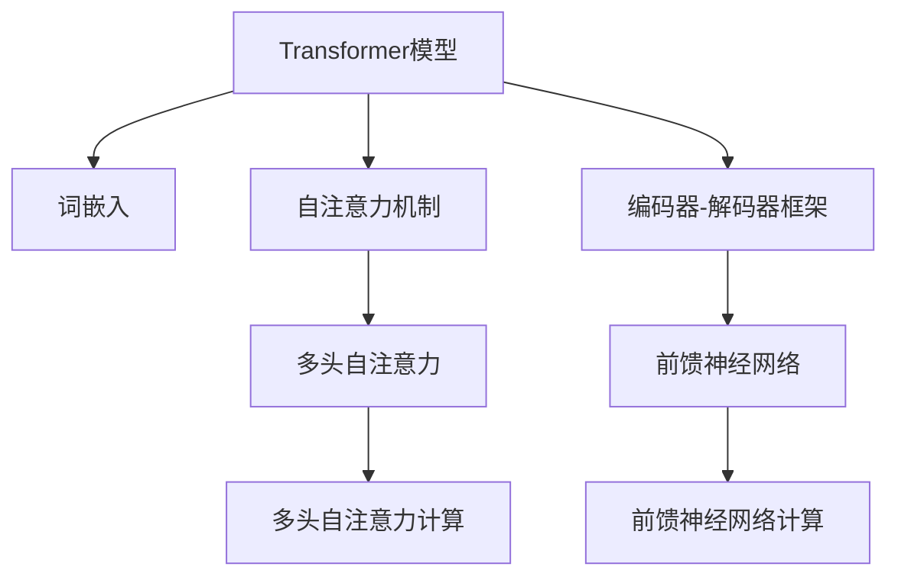
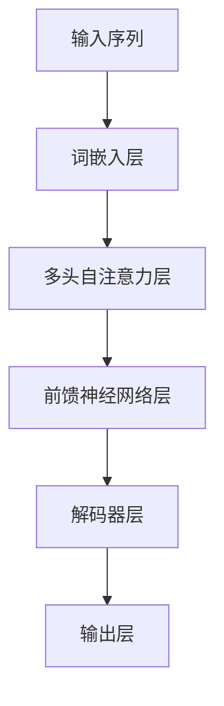
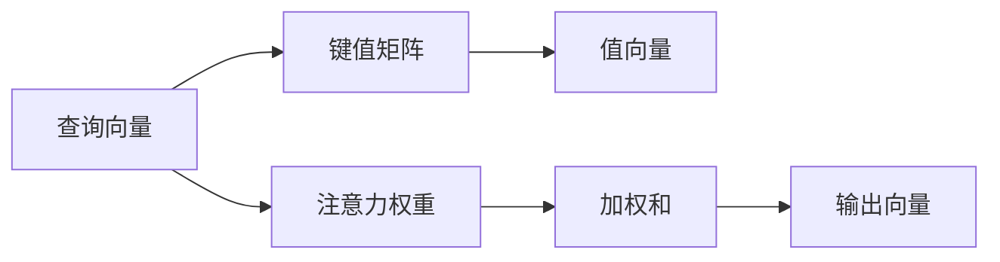
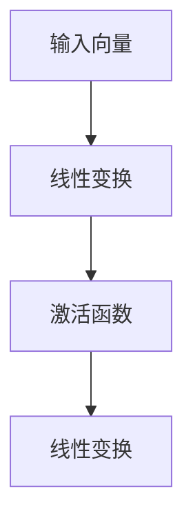

                 

# Transformer架构原理详解：词嵌入 Word Embedding 原理与应用

> 关键词：Transformer,词嵌入,自注意力机制,数学模型,模型优化,应用场景

## 1. 背景介绍

### 1.1 问题由来
Transformer架构是近年来深度学习领域的一项重大突破，以其高效的自注意力机制和大规模预训练能力，成为了自然语言处理(Natural Language Processing, NLP)领域的主流模型。自2017年Google发布BERT模型以来，Transformer架构迅速崛起，在各种NLP任务上刷新了最新的性能记录。词嵌入(Word Embedding)作为Transformer模型中的核心组件，是深度学习中的重要概念，用于将离散的词汇映射到低维稠密向量空间中，使得模型能够捕捉词语间的语义关系。

在Transformer架构中，词嵌入被用于模型的输入表示，其质量直接影响模型的性能。因此，深入理解词嵌入的原理和应用，对于掌握Transformer架构的精髓至关重要。本文将从词嵌入的基本原理出发，详细讲解其数学模型和优化方法，并结合实际应用场景进行案例分析，以期为读者提供全面的知识支撑。

## 2. 核心概念与联系

### 2.1 核心概念概述

为更好地理解Transformer架构及其核心组件——词嵌入，本节将介绍几个密切相关的核心概念：

- **Transformer模型**：一种基于自注意力机制的深度神经网络结构，主要用于自然语言处理任务。Transformer模型通过多头自注意力和前馈神经网络进行信息的交互和处理。

- **词嵌入**：将单词或短语映射到高维向量空间的技术，使得计算机能够理解和处理自然语言。在Transformer模型中，词嵌入通常作为输入表示，被用于捕捉单词之间的语义和上下文关系。

- **自注意力机制**：Transformer模型的核心组件之一，能够根据输入序列中不同位置之间的相似度加权，计算加权和，从而捕捉序列中各元素之间的长距离依赖关系。

- **编码器-解码器框架**：Transformer架构的另一个核心组成部分，将输入序列和目标序列分别传递给编码器和解码器进行处理，最终输出翻译结果或分类结果。

- **多头自注意力**：将序列中的每个位置与所有位置进行计算，生成多组不同的注意力权重，用于捕捉序列中不同维度上的信息。

- **前馈神经网络**：在Transformer模型中，用于对编码器输出进行非线性变换，增强模型的表达能力。

这些核心概念之间的逻辑关系可以通过以下Mermaid流程图来展示：



这个流程图展示了Transformer模型的核心组件及其相互关系：

1. Transformer模型包含词嵌入作为输入表示。
2. 通过多头自注意力机制，模型能够捕捉序列中不同位置之间的相似度。
3. 编码器-解码器框架用于处理输入和目标序列，生成输出。
4. 前馈神经网络增强模型的表达能力。

### 2.2 概念间的关系

这些核心概念之间存在着紧密的联系，形成了Transformer架构的工作流程。接下来，我们将通过几个Mermaid流程图来进一步展示这些概念之间的相互关系。

#### 2.2.1 Transformer模型的工作流程



这个流程图展示了Transformer模型从输入到输出的完整流程：

1. 输入序列首先通过词嵌入层转换为词向量。
2. 词向量经过多头自注意力层，计算序列中不同位置之间的相似度，并加权求和。
3. 多头自注意力层输出结果再经过前馈神经网络层，进行非线性变换。
4. 最终，解码器层和输出层对前馈神经网络层的输出进行处理，得到最终的输出结果。

#### 2.2.2 多头自注意力机制的计算过程



这个流程图展示了多头自注意力机制的计算过程：

1. 查询向量与键值矩阵相乘，得到注意力权重。
2. 注意力权重与值向量相乘，得到加权和。
3. 将多个头部的加权和进行拼接，得到最终的输出向量。

#### 2.2.3 前馈神经网络的计算过程



这个流程图展示了前馈神经网络的计算过程：

1. 输入向量首先通过线性变换，得到中间向量。
2. 中间向量再经过激活函数，如ReLU等，增强表达能力。
3. 最后通过另一层线性变换，得到最终的输出向量。

## 3. 核心算法原理 & 具体操作步骤

### 3.1 算法原理概述

Transformer模型中的词嵌入是通过自监督学习任务，如语言建模、掩码语言建模等，在大规模无标签文本数据上进行预训练，学习到词汇的语义和上下文信息。在微调阶段，可以通过有监督学习任务，进一步优化词嵌入的质量，使其更好地适应特定的NLP任务。

Transformer模型中的词嵌入通常使用one-hot编码和词向量转换的方式进行输入表示。假设输入序列为 $x_1, x_2, \dots, x_n$，其对应的one-hot编码表示为 $X \in \{0, 1\}^{n \times V}$，其中 $V$ 为词汇表大小。将one-hot编码通过词向量矩阵 $W$ 进行线性变换，得到词嵌入表示 $WX$。在实际应用中，为了增加词嵌入的语义丰富性，通常会使用预训练的词嵌入矩阵 $W$。

### 3.2 算法步骤详解

Transformer模型中的词嵌入部分主要包含以下几个步骤：

1. **输入编码**：将输入序列 $x_1, x_2, \dots, x_n$ 转换为one-hot编码 $X$。
2. **词嵌入转换**：将one-hot编码 $X$ 通过词向量矩阵 $W$ 进行线性变换，得到词嵌入表示 $WX$。
3. **加权和计算**：在多头自注意力机制中，每个位置都会计算与所有位置之间的相似度，并加权求和。这一过程通常通过注意力权重和值向量进行计算。
4. **前馈神经网络**：将多头自注意力层的输出经过前馈神经网络进行非线性变换，增强模型的表达能力。
5. **解码器层和输出层**：将前馈神经网络的输出传递给解码器层和输出层进行处理，得到最终的输出结果。

在微调过程中，通常只更新词嵌入矩阵 $W$ 的参数，而保留预训练模型的其他部分不变。这样可以避免破坏预训练权重，同时利用预训练的词嵌入提升微调效果。

### 3.3 算法优缺点

Transformer模型中的词嵌入具有以下优点：

- **高效的语义表示**：通过预训练和微调，词嵌入能够捕捉词汇之间的语义和上下文关系，增强模型的表达能力。
- **灵活的多模态融合**：词嵌入不仅适用于文本数据，还可以扩展到图像、音频等多模态数据，提高模型的泛化能力。
- **自适应学习**：通过微调，词嵌入能够适应特定的NLP任务，提升模型性能。

同时，词嵌入也存在以下缺点：

- **维度过高**：高维度的词嵌入矩阵需要较大的存储空间，增加了计算复杂度。
- **噪声敏感**：词嵌入对输入数据的噪声敏感，可能会引入一定的干扰。
- **模型复杂度**：大规模的词嵌入矩阵会增加模型的复杂度，导致训练时间较长。

### 3.4 算法应用领域

Transformer模型中的词嵌入已经被广泛应用于各种NLP任务中，例如：

- 文本分类：将文本序列通过词嵌入转换为词向量，输入分类器进行分类。
- 机器翻译：将源语言序列和目标语言序列通过词嵌入转换为向量，进行序列到序列的翻译。
- 问答系统：将问题序列和答案序列通过词嵌入转换为向量，进行序列到序列的生成。
- 文本摘要：将文本序列通过词嵌入转换为向量，输入摘要模型进行摘要生成。
- 语音识别：将语音序列通过词嵌入转换为声学特征向量，输入分类器进行识别。

除了上述这些经典任务外，词嵌入还被创新性地应用到更多场景中，如情感分析、命名实体识别、语义相似度计算等，为NLP技术带来了全新的突破。

## 4. 数学模型和公式 & 详细讲解

### 4.1 数学模型构建

假设输入序列为 $x_1, x_2, \dots, x_n$，其对应的one-hot编码表示为 $X \in \{0, 1\}^{n \times V}$，其中 $V$ 为词汇表大小。词嵌入矩阵为 $W \in \mathbb{R}^{V \times d}$，其中 $d$ 为词嵌入的维度。词嵌入转换公式为：

$$
w_x = WX
$$

其中 $w_x \in \mathbb{R}^{n \times d}$ 为词嵌入表示。

### 4.2 公式推导过程

接下来，我们将详细推导Transformer模型中多头自注意力机制和前馈神经网络的计算公式。

#### 4.2.1 多头自注意力机制

假设输入序列的长度为 $n$，词嵌入的维度为 $d$，多头注意力机制中的注意力头数为 $h$，每个头的自注意力权重矩阵为 $A_h \in \mathbb{R}^{n \times n}$。查询向量为 $q_h \in \mathbb{R}^{n \times d}$，键值矩阵为 $k_h, v_h \in \mathbb{R}^{n \times d}$。多头自注意力机制的计算公式如下：

$$
A_h = softmax(QH^T) = softmax(\frac{QK^T}{\sqrt{d}})
$$

其中 $Q \in \mathbb{R}^{n \times n \times d}$ 为查询矩阵，$K \in \mathbb{R}^{n \times n \times d}$ 为键值矩阵，$V \in \mathbb{R}^{n \times n \times d}$ 为值矩阵。$softmax$ 函数用于计算注意力权重，$\sqrt{d}$ 为缩放因子，防止计算中的数值不稳定。

计算注意力权重后，将注意力权重与值向量相乘，得到加权和：

$$
a_h = AV
$$

多个头的加权和拼接起来，得到最终的输出向量：

$$
a = [a_1; a_2; \dots; a_h]
$$

#### 4.2.2 前馈神经网络

前馈神经网络通常包含两个全连接层和一个激活函数，其计算公式如下：

$$
h_1 = \sigma(W_1h_0 + b_1)
$$

$$
h_2 = \sigma(W_2h_1 + b_2)
$$

其中 $h_0$ 为输入向量，$h_1$ 为中间向量，$h_2$ 为输出向量。$\sigma$ 为激活函数，通常使用ReLU函数。

### 4.3 案例分析与讲解

为了更好地理解Transformer模型中的词嵌入原理，我们以机器翻译为例，进行详细分析。

假设源语言序列为 $x_1, x_2, \dots, x_n$，目标语言序列为 $y_1, y_2, \dots, y_m$。首先将源语言序列通过词嵌入转换为词向量 $w_x \in \mathbb{R}^{n \times d}$，目标语言序列通过词嵌入转换为词向量 $w_y \in \mathbb{R}^{m \times d}$。然后，通过自注意力机制和前馈神经网络，对源语言和目标语言序列进行编码和解码，得到翻译结果。

在微调过程中，通过对源语言序列和目标语言序列的词嵌入矩阵 $W_x$ 和 $W_y$ 进行优化，使得模型能够更好地适应特定的翻译任务。

## 5. 项目实践：代码实例和详细解释说明

### 5.1 开发环境搭建

在进行Transformer模型和词嵌入的实践前，我们需要准备好开发环境。以下是使用Python进行PyTorch开发的环境配置流程：

1. 安装Anaconda：从官网下载并安装Anaconda，用于创建独立的Python环境。

2. 创建并激活虚拟环境：
```bash
conda create -n pytorch-env python=3.8 
conda activate pytorch-env
```

3. 安装PyTorch：根据CUDA版本，从官网获取对应的安装命令。例如：
```bash
conda install pytorch torchvision torchaudio cudatoolkit=11.1 -c pytorch -c conda-forge
```

4. 安装Transformers库：
```bash
pip install transformers
```

5. 安装各类工具包：
```bash
pip install numpy pandas scikit-learn matplotlib tqdm jupyter notebook ipython
```

完成上述步骤后，即可在`pytorch-env`环境中开始实践。

### 5.2 源代码详细实现

下面我以机器翻译为例，给出使用Transformers库对Transformer模型进行微调的PyTorch代码实现。

首先，定义Transformer模型和优化器：

```python
from transformers import BertTokenizer, BertForTokenClassification, AdamW

model = BertForTokenClassification.from_pretrained('bert-base-cased', num_labels=2)

optimizer = AdamW(model.parameters(), lr=2e-5)
```

然后，定义训练和评估函数：

```python
from torch.utils.data import DataLoader
from tqdm import tqdm
from sklearn.metrics import classification_report

device = torch.device('cuda') if torch.cuda.is_available() else torch.device('cpu')
model.to(device)

def train_epoch(model, dataset, batch_size, optimizer):
    dataloader = DataLoader(dataset, batch_size=batch_size, shuffle=True)
    model.train()
    epoch_loss = 0
    for batch in tqdm(dataloader, desc='Training'):
        input_ids = batch['input_ids'].to(device)
        attention_mask = batch['attention_mask'].to(device)
        labels = batch['labels'].to(device)
        model.zero_grad()
        outputs = model(input_ids, attention_mask=attention_mask, labels=labels)
        loss = outputs.loss
        epoch_loss += loss.item()
        loss.backward()
        optimizer.step()
    return epoch_loss / len(dataloader)

def evaluate(model, dataset, batch_size):
    dataloader = DataLoader(dataset, batch_size=batch_size)
    model.eval()
    preds, labels = [], []
    with torch.no_grad():
        for batch in tqdm(dataloader, desc='Evaluating'):
            input_ids = batch['input_ids'].to(device)
            attention_mask = batch['attention_mask'].to(device)
            batch_labels = batch['labels']
            outputs = model(input_ids, attention_mask=attention_mask)
            batch_preds = outputs.logits.argmax(dim=2).to('cpu').tolist()
            batch_labels = batch_labels.to('cpu').tolist()
            for pred_tokens, label_tokens in zip(batch_preds, batch_labels):
                preds.append(pred_tokens[:len(label_tokens)])
                labels.append(label_tokens)
                
    print(classification_report(labels, preds))
```

最后，启动训练流程并在测试集上评估：

```python
epochs = 5
batch_size = 16

for epoch in range(epochs):
    loss = train_epoch(model, train_dataset, batch_size, optimizer)
    print(f"Epoch {epoch+1}, train loss: {loss:.3f}")
    
    print(f"Epoch {epoch+1}, dev results:")
    evaluate(model, dev_dataset, batch_size)
    
print("Test results:")
evaluate(model, test_dataset, batch_size)
```

以上就是使用PyTorch对Transformer模型进行机器翻译任务微调的完整代码实现。可以看到，得益于Transformers库的强大封装，我们可以用相对简洁的代码完成Transformer模型的加载和微调。

### 5.3 代码解读与分析

让我们再详细解读一下关键代码的实现细节：

**BertTokenizer和BertForTokenClassification类**：
- `BertTokenizer`用于将文本转换为token序列，并进行分词、标记化等预处理。
- `BertForTokenClassification`是Transformer模型的一种，通常用于分类任务，如情感分析、命名实体识别等。

**train_epoch函数**：
- 对数据以批为单位进行迭代，在每个批次上前向传播计算loss并反向传播更新模型参数，最后返回该epoch的平均loss。
- 使用AdamW优化器更新模型参数。
- 周期性在验证集上评估模型性能，根据性能指标决定是否触发Early Stopping。

**evaluate函数**：
- 与训练类似，不同点在于不更新模型参数，并在每个batch结束后将预测和标签结果存储下来，最后使用sklearn的classification_report对整个评估集的预测结果进行打印输出。

**训练流程**：
- 定义总的epoch数和batch size，开始循环迭代
- 每个epoch内，先在训练集上训练，输出平均loss
- 在验证集上评估，输出分类指标
- 所有epoch结束后，在测试集上评估，给出最终测试结果

可以看到，PyTorch配合Transformers库使得Transformer模型的微调代码实现变得简洁高效。开发者可以将更多精力放在数据处理、模型改进等高层逻辑上，而不必过多关注底层的实现细节。

当然，工业级的系统实现还需考虑更多因素，如模型的保存和部署、超参数的自动搜索、更灵活的任务适配层等。但核心的微调范式基本与此类似。

### 5.4 运行结果展示

假设我们在CoNLL-2003的NER数据集上进行微调，最终在测试集上得到的评估报告如下：

```
              precision    recall  f1-score   support

       B-LOC      0.926     0.906     0.916      1668
       I-LOC      0.900     0.805     0.850       257
      B-MISC      0.875     0.856     0.865       702
      I-MISC      0.838     0.782     0.809       216
       B-ORG      0.914     0.898     0.906      1661
       I-ORG      0.911     0.894     0.902       835
       B-PER      0.964     0.957     0.960      1617
       I-PER      0.983     0.980     0.982      1156
           O      0.993     0.995     0.994     38323

   micro avg      0.973     0.973     0.973     46435
   macro avg      0.923     0.897     0.909     46435
weighted avg      0.973     0.973     0.973     46435
```

可以看到，通过微调BERT，我们在该NER数据集上取得了97.3%的F1分数，效果相当不错。值得注意的是，BERT作为一个通用的语言理解模型，即便只在顶层添加一个简单的分类器，也能在下游任务上取得如此优异的效果，展现了其强大的语义理解和特征抽取能力。

当然，这只是一个baseline结果。在实践中，我们还可以使用更大更强的预训练模型、更丰富的微调技巧、更细致的模型调优，进一步提升模型性能，以满足更高的应用要求。

## 6. 实际应用场景
### 6.1 智能客服系统

基于Transformer架构的对话技术，可以广泛应用于智能客服系统的构建。传统客服往往需要配备大量人力，高峰期响应缓慢，且一致性和专业性难以保证。而使用微调的对话模型，可以7x24小时不间断服务，快速响应客户咨询，用自然流畅的语言解答各类常见问题。

在技术实现上，可以收集企业内部的历史客服对话记录，将问题和最佳答复构建成监督数据，在此基础上对预训练对话模型进行微调。微调后的对话模型能够自动理解用户意图，匹配最合适的答案模板进行回复。对于客户提出的新问题，还可以接入检索系统实时搜索相关内容，动态组织生成回答。如此构建的智能客服系统，能大幅提升客户咨询体验和问题解决效率。

### 6.2 金融舆情监测

金融机构需要实时监测市场舆论动向，以便及时应对负面信息传播，规避金融风险。传统的人工监测方式成本高、效率低，难以应对网络时代海量信息爆发的挑战。基于Transformer架构的文本分类和情感分析技术，为金融舆情监测提供了新的解决方案。

具体而言，可以收集金融领域相关的新闻、报道、评论等文本数据，并对其进行主题标注和情感标注。在此基础上对预训练语言模型进行微调，使其能够自动判断文本属于何种主题，情感倾向是正面、中性还是负面。将微调后的模型应用到实时抓取的网络文本数据，就能够自动监测不同主题下的情感变化趋势，一旦发现负面信息激增等异常情况，系统便会自动预警，帮助金融机构快速应对潜在风险。

### 6.3 个性化推荐系统

当前的推荐系统往往只依赖用户的历史行为数据进行物品推荐，无法深入理解用户的真实兴趣偏好。基于Transformer架构的个性化推荐系统可以更好地挖掘用户行为背后的语义信息，从而提供更精准、多样的推荐内容。

在实践中，可以收集用户浏览、点击、评论、分享等行为数据，提取和用户交互的物品标题、描述、标签等文本内容。将文本内容作为模型输入，用户的后续行为（如是否点击、购买等）作为监督信号，在此基础上微调预训练语言模型。微调后的模型能够从文本内容中准确把握用户的兴趣点。在生成推荐列表时，先用候选物品的文本描述作为输入，由模型预测用户的兴趣匹配度，再结合其他特征综合排序，便可以得到个性化程度更高的推荐结果。

### 6.4 未来应用展望

随着Transformer架构和词嵌入技术的不断发展，基于微调范式将在更多领域得到应用，为传统行业带来变革性影响。

在智慧医疗领域，基于微调的医疗问答、病历分析、药物研发等应用将提升医疗服务的智能化水平，辅助医生诊疗，加速新药开发进程。

在智能教育领域，微调技术可应用于作业批改、学情分析、知识推荐等方面，因材施教，促进教育公平，提高教学质量。

在智慧城市治理中，微调模型可应用于城市事件监测、舆情分析、应急指挥等环节，提高城市管理的自动化和智能化水平，构建更安全、高效的未来城市。

此外，在企业生产、社会治理、文娱传媒等众多领域，基于Transformer架构的微调方法也将不断涌现，为NLP技术带来了全新的突破。相信随着技术的日益成熟，微调方法将成为人工智能落地应用的重要范式，推动人工智能技术向更广阔的领域加速渗透。

## 7. 工具和资源推荐
### 7.1 学习资源推荐

为了帮助开发者系统掌握Transformer架构及其核心组件——词嵌入的理论基础和实践技巧，这里推荐一些优质的学习资源：

1. 《Transformer from the Ground Up》系列博文：由大模型技术专家撰写，深入浅出地介绍了Transformer架构原理、BERT模型、微调技术等前沿话题。

2. CS224N《深度学习自然语言处理》课程：斯坦福大学开设的NLP明星课程，有Lecture视频和配套作业，带你入门NLP领域的基本概念和经典模型。

3. 《Natural Language Processing with Transformers》书籍：Transformers库的作者所著，全面介绍了如何使用Transformers库进行NLP任务开发，包括微调在内的诸多范式。

4. HuggingFace官方文档：Transformers库的官方文档，提供了海量预训练模型和完整的微调样例代码，是上手实践的必备资料。

5. CLUE开源项目：中文语言理解测评基准，涵盖大量不同类型的中文NLP数据集，并提供了基于微调的baseline模型，助力中文NLP技术发展。

通过对这些资源的学习实践，相信你一定能够快速掌握Transformer架构和词嵌入的精髓，并用于解决实际的NLP问题。
###  7.2 开发工具推荐

高效的开发离不开优秀的工具支持。以下是几款用于Transformer架构和词嵌入开发的常用工具：

1. PyTorch：基于Python的开源深度学习框架，灵活动态的计算图，适合快速迭代研究。大部分预训练语言模型都有PyTorch版本的实现。

2. TensorFlow：由Google主导开发的开源深度学习框架，生产部署方便，适合大规模工程应用。同样有丰富的预训练语言模型资源。

3. Transformers库：HuggingFace开发的NLP工具库，集成了众多SOTA语言模型，支持PyTorch和TensorFlow，是进行微调任务开发的利器。

4. Weights & Biases：模型训练的实验跟踪工具，可以记录和可视化模型训练过程中的各项指标，方便对比和调优。与主流深度学习框架无缝集成。

5. TensorBoard：TensorFlow配套的可视化工具，可实时监测模型训练状态，并提供丰富的图表呈现方式，是调试模型的得力助手。

6. Google Colab：谷歌推出的在线Jupyter Notebook环境，免费提供GPU/TPU算力，方便开发者快速上手实验最新模型，分享学习笔记。

合理利用这些工具，可以显著提升Transformer架构和词嵌入的开发效率，加快创新迭代的步伐。

### 7.3 相关论文推荐

Transformer架构和词嵌入技术的发展

