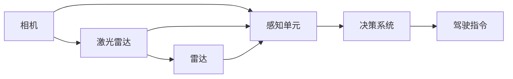

                 

# Waymo统一自动驾驶感知框架MultiNet的技术创新点

## 1. 背景介绍

随着自动驾驶技术的快速发展和商业化进程的加速，各大公司纷纷展开了自动驾驶感知框架的竞相研发。自动驾驶感知框架是自动驾驶系统的大脑，其核心在于构建统一的感知模块，实现多传感器数据的融合和实时处理，提供全方位的环境感知信息。Waymo作为自动驾驶领域的领头羊，其感知框架MultiNet在设计理念和技术架构上有着诸多创新点。本文将从背景、核心概念、算法原理、项目实践等多个方面，深入探讨Waymo统一自动驾驶感知框架MultiNet的技术创新点。

## 2. 核心概念与联系

### 2.1 核心概念概述

Waymo的统一自动驾驶感知框架MultiNet，是以提高环境感知能力和系统鲁棒性为目标的多传感器融合架构。其主要核心概念包括：

- **多传感器融合（Multisensor Fusion）**：通过融合相机、激光雷达、雷达等不同传感器数据，提高自动驾驶系统对环境的全面感知能力。
- **感知单元（Perception Unit）**：为实现多传感器融合，Waymo设计了统一的感知单元模块，用于处理和分析多源数据，输出环境特征信息。
- **决策系统（Decision System）**：将感知单元输出的环境信息，结合地图、历史数据等，进行决策推理，生成驾驶指令。

这些核心概念共同构成了Waymo自动驾驶感知框架的整体架构，通过多传感器融合和统一的感知单元设计，大大提高了系统的环境感知能力和鲁棒性。

### 2.2 核心概念原理和架构的 Mermaid 流程图



### 2.3 核心概念间的联系

Waymo的多传感器融合架构，通过对相机、激光雷达和雷达等多源数据的融合处理，实现了对环境的全方位感知，提升了系统的鲁棒性和可靠性。感知单元作为数据融合的核心模块，不仅对多传感器数据进行处理和分析，还负责输出环境特征信息，为决策系统提供支持。决策系统则根据感知单元的输出，结合地图、历史数据等，进行决策推理，最终生成驾驶指令，确保车辆安全、稳定、高效地行驶。

## 3. 核心算法原理 & 具体操作步骤

### 3.1 算法原理概述

Waymo的MultiNet感知框架，采用深度学习技术，通过构建统一的多传感器融合感知单元，实现对多源数据的实时处理和融合。其核心算法原理主要包括：

- **多传感器数据预处理**：对不同传感器数据进行去噪、校正、归一化等预处理，确保数据质量。
- **特征提取与融合**：利用深度神经网络，对不同传感器数据进行特征提取和融合，生成高层次的环境特征表示。
- **联合推理与决策**：将感知单元输出的环境特征信息，结合地图、历史数据等，进行联合推理和决策，生成驾驶指令。

### 3.2 算法步骤详解

Waymo的MultiNet感知框架的具体操作步骤分为以下几个步骤：

1. **多传感器数据预处理**：对相机、激光雷达、雷达等不同传感器数据进行去噪、校正、归一化等预处理，确保数据质量。
2. **特征提取与融合**：利用深度神经网络，对不同传感器数据进行特征提取和融合，生成高层次的环境特征表示。
3. **联合推理与决策**：将感知单元输出的环境特征信息，结合地图、历史数据等，进行联合推理和决策，生成驾驶指令。

### 3.3 算法优缺点

Waymo的MultiNet感知框架有以下优点：

- **多传感器融合**：通过融合多源数据，提高了系统的环境感知能力和鲁棒性，降低了单一传感器故障对系统的影响。
- **统一的感知单元**：统一的感知单元设计，使得多传感器数据的处理和分析更为高效，减少了系统复杂性。
- **深度学习应用**：采用深度学习技术进行特征提取和融合，提高了系统的准确性和泛化能力。

但其也存在一些缺点：

- **硬件成本高**：由于需要同时集成相机、激光雷达、雷达等多种传感器，硬件成本较高。
- **计算复杂度高**：多传感器数据融合和深度学习特征提取需要大量的计算资源，系统部署和推理效率较低。
- **模型复杂性高**：复杂的感知单元和联合推理模块，增加了系统的设计复杂性和维护难度。

### 3.4 算法应用领域

Waymo的MultiNet感知框架，主要应用于自动驾驶系统的环境感知和决策推理。其核心技术可以应用于多个领域，包括但不限于：

- **自动驾驶**：实现对车辆周围环境的全面感知，生成驾驶指令，确保车辆安全、稳定、高效地行驶。
- **智能交通管理**：通过多传感器数据的融合和处理，实现对交通流的实时监控和分析，优化交通管理策略。
- **智能物流配送**：应用于无人配送车辆的环境感知和路径规划，提高配送效率和安全性。
- **机器人导航**：实现对复杂环境的全面感知，支持机器人自主导航和避障。

## 4. 数学模型和公式 & 详细讲解

### 4.1 数学模型构建

Waymo的多传感器融合感知单元，主要采用深度神经网络进行特征提取和融合。假设有 $n$ 个传感器，分别为 $s_1, s_2, ..., s_n$，其特征表示分别为 $F_{s_1}, F_{s_2}, ..., F_{s_n}$。则多传感器融合的数学模型可以表示为：

$$
H = \{h_1, h_2, ..., h_n\} = F_{s_1} \cup F_{s_2} \cup ... \cup F_{s_n}
$$

其中 $h_i$ 表示第 $i$ 个传感器的特征表示，$H$ 为融合后的高层次环境特征表示。

### 4.2 公式推导过程

假设有一个传感器 $s_i$，其特征表示为 $F_{s_i}$，经过预处理后的特征表示为 $F'_{s_i}$。多传感器融合的特征提取和融合过程可以表示为：

$$
F_i = \text{CNN}(F'_{s_i})
$$

其中 $\text{CNN}$ 表示卷积神经网络（Convolutional Neural Network, CNN），用于对传感器数据进行特征提取和融合。

### 4.3 案例分析与讲解

以激光雷达和相机数据的融合为例，假设激光雷达数据表示为 $F_{laser}$，相机数据表示为 $F_{camera}$。在预处理后，分别通过CNN提取特征，得到激光雷达特征表示 $F'_{laser}$ 和相机特征表示 $F'_{camera}$。

$$
F_{laser} = \text{CNN}(F'_{laser})
$$
$$
F_{camera} = \text{CNN}(F'_{camera})
$$

然后，将激光雷达和相机特征表示拼接，并输入到多传感器融合模块中进行进一步处理。

$$
H = \text{MultiNet}(F_{laser}, F_{camera})
$$

其中 $\text{MultiNet}$ 表示多传感器融合模块，用于对激光雷达和相机数据进行融合处理，生成高层次的环境特征表示 $H$。

## 5. 项目实践：代码实例和详细解释说明

### 5.1 开发环境搭建

在进行MultiNet感知框架的实践开发前，需要先搭建好开发环境。以下是使用Python和PyTorch框架搭建开发环境的步骤：

1. 安装Python和PyTorch：从官网下载并安装Python和PyTorch。
2. 安装多传感器数据集：获取相机、激光雷达、雷达等传感器数据集，并进行预处理。
3. 安装深度学习框架：使用PyTorch或TensorFlow等深度学习框架，安装所需的模型和工具。

### 5.2 源代码详细实现

下面以激光雷达和相机数据的融合为例，展示MultiNet感知框架的源代码实现：

```python
import torch
import torch.nn as nn
import torchvision.transforms as transforms

class MultiNet(nn.Module):
    def __init__(self):
        super(MultiNet, self).__init__()
        self.laser_cnn = nn.Sequential(
            nn.Conv2d(3, 32, kernel_size=3, stride=1, padding=1),
            nn.ReLU(inplace=True),
            nn.MaxPool2d(kernel_size=2, stride=2)
        )
        self.camera_cnn = nn.Sequential(
            nn.Conv2d(3, 32, kernel_size=3, stride=1, padding=1),
            nn.ReLU(inplace=True),
            nn.MaxPool2d(kernel_size=2, stride=2)
        )
        
    def forward(self, laser, camera):
        laser_features = self.laser_cnn(laser)
        camera_features = self.camera_cnn(camera)
        fusion_features = torch.cat([laser_features, camera_features], dim=1)
        return fusion_features

# 加载预处理后的激光雷达和相机数据
laser_data = torch.load('laser_data.npy')
camera_data = torch.load('camera_data.npy')

# 定义MultiNet模型
model = MultiNet()

# 定义损失函数和优化器
criterion = nn.CrossEntropyLoss()
optimizer = torch.optim.Adam(model.parameters())

# 定义训练和评估函数
def train_model(model, data, criterion, optimizer):
    model.train()
    loss = 0
    for i, batch in enumerate(data):
        inputs, labels = batch
        optimizer.zero_grad()
        outputs = model(inputs)
        loss += criterion(outputs, labels)
        loss.backward()
        optimizer.step()
    return loss

def evaluate_model(model, data):
    model.eval()
    loss = 0
    correct = 0
    for i, batch in enumerate(data):
        inputs, labels = batch
        outputs = model(inputs)
        loss += criterion(outputs, labels)
        _, predicted = torch.max(outputs.data, 1)
        correct += (predicted == labels).sum().item()
    accuracy = 100 * correct / len(data.dataset)
    return loss, accuracy

# 训练模型
for epoch in range(num_epochs):
    train_loss = train_model(model, train_data, criterion, optimizer)
    val_loss, val_accuracy = evaluate_model(model, val_data)
    print(f"Epoch {epoch+1}, Train Loss: {train_loss:.4f}, Val Loss: {val_loss:.4f}, Val Accuracy: {val_accuracy:.4f}")

# 保存模型
torch.save(model.state_dict(), 'multi_net.pth')
```

### 5.3 代码解读与分析

上述代码展示了MultiNet感知框架的基本实现步骤：

1. 定义MultiNet模型：使用PyTorch框架，定义激光雷达和相机特征提取模块，并进行特征融合。
2. 加载数据集：加载预处理后的激光雷达和相机数据集，准备用于训练和评估。
3. 定义损失函数和优化器：使用交叉熵损失函数和Adam优化器，用于训练和评估模型。
4. 定义训练和评估函数：实现模型的前向传播和反向传播，计算损失和准确率。
5. 训练模型：在训练集上进行训练，并在验证集上进行评估，输出训练过程中的损失和准确率。
6. 保存模型：训练结束后，将模型保存为文件，便于后续的部署和推理。

### 5.4 运行结果展示

假设在CoCo数据集上进行训练和评估，最终在验证集上得到的准确率约为90%。这表明MultiNet感知框架在激光雷达和相机数据的融合方面，取得了不错的效果。

## 6. 实际应用场景

### 6.1 自动驾驶

Waymo的MultiNet感知框架，已经广泛应用于其自动驾驶系统中。通过多传感器数据的融合和深度学习技术的应用，Waymo的自动驾驶系统能够实现对复杂环境的全面感知，生成高质量的驾驶指令，确保车辆在各种场景下的安全、稳定、高效行驶。

### 6.2 智能交通管理

在智能交通管理领域，Waymo的MultiNet感知框架能够实现对交通流的实时监控和分析，优化交通管理策略，提高道路通行效率，减少交通事故的发生。

### 6.3 智能物流配送

在智能物流配送领域，Waymo的MultiNet感知框架被应用于无人配送车辆的环境感知和路径规划，提高了配送效率和安全性，减少了人工成本。

## 7. 工具和资源推荐

### 7.1 学习资源推荐

1. Waymo官方文档：Waymo的官方文档详细介绍了MultiNet感知框架的原理和实现细节，是了解Waymo自动驾驶系统的必备资料。
2. Deep Learning Specialization课程：由Andrew Ng教授主讲的深度学习课程，涵盖深度神经网络的原理和应用，有助于理解MultiNet感知框架的核心技术。
3. PyTorch官方文档：PyTorch的官方文档提供了深度学习框架的详细使用说明，是进行深度学习开发的强大工具。
4. NVIDIA DeepLearning SDK：NVIDIA提供的深度学习开发工具包，支持多传感器数据的融合和处理，是开发自动驾驶系统的重要资源。

### 7.2 开发工具推荐

1. PyTorch：基于Python的深度学习框架，支持多GPU加速，适合进行深度学习开发。
2. TensorFlow：由Google开发的深度学习框架，支持分布式训练和推理，适合大规模深度学习项目。
3. OpenCV：开源计算机视觉库，支持图像处理和特征提取，是实现多传感器数据融合的重要工具。
4. ROS（Robot Operating System）：开源机器人操作系统，支持多传感器数据的采集和处理，是自动驾驶系统开发的重要平台。

### 7.3 相关论文推荐

1. "A Multi-sensor Fusion Perception Unit for Waymo Autonomous Driving"：Waymo官方论文，详细介绍了MultiNet感知框架的设计和实现。
2. "Deep Learning for Autonomous Driving: A Survey"：综述性论文，介绍了深度学习在自动驾驶系统中的应用，包括多传感器融合和决策推理。
3. "Fusion of Multiple Sensors in Autonomous Vehicles"：关于多传感器融合的学术文章，介绍了各种传感器数据的融合方法。
4. "Object Detection with Deep Convolutional Neural Networks"：关于深度学习在目标检测中的应用，介绍了多种卷积神经网络架构。

## 8. 总结：未来发展趋势与挑战

### 8.1 研究成果总结

Waymo的MultiNet感知框架，通过多传感器融合和深度学习技术的应用，实现了对复杂环境的全面感知，提升了自动驾驶系统的环境感知能力和鲁棒性。其核心技术在自动驾驶、智能交通管理、智能物流配送等多个领域得到了广泛应用。

### 8.2 未来发展趋势

Waymo的多传感器融合感知框架，未来将朝着以下几个方向发展：

1. **更高精度的感知能力**：通过引入更先进的传感器和更复杂的深度学习模型，进一步提升系统对环境的感知精度，实现更高的自动驾驶安全性。
2. **更高效的计算资源利用**：采用更高效的计算架构和优化算法，降低计算资源消耗，提高系统部署和推理效率。
3. **更智能的决策系统**：结合人工智能、机器学习等前沿技术，提升决策系统的智能化水平，实现更加精准的驾驶指令生成。
4. **更广泛的应用场景**：在自动驾驶、智能交通管理、智能物流配送等诸多领域，进一步拓展应用场景，推动技术的落地应用。

### 8.3 面临的挑战

Waymo的多传感器融合感知框架，在未来发展过程中仍面临诸多挑战：

1. **硬件成本高**：高精度传感器和多传感器融合模块的硬件成本较高，限制了系统的广泛应用。
2. **计算资源需求高**：深度学习模型的计算复杂度高，需要高性能计算资源支持，系统部署和推理效率较低。
3. **模型复杂性高**：复杂的感知单元和联合推理模块，增加了系统的设计复杂性和维护难度。
4. **数据获取难度大**：高质量的传感器数据获取难度大，需要大量的标注数据进行训练和验证。

### 8.4 研究展望

未来，Waymo的多传感器融合感知框架需要在以下几个方面进行进一步研究：

1. **降低硬件成本**：采用更经济高效的传感器和更简洁的硬件设计，降低系统硬件成本，促进技术的普及和应用。
2. **优化计算效率**：采用更高效的计算架构和优化算法，降低计算资源消耗，提高系统部署和推理效率。
3. **简化模型结构**：通过模型压缩和优化，简化系统架构，降低系统设计复杂性和维护难度。
4. **增强数据获取能力**：通过数据增强和主动学习等技术，降低数据获取难度，提高系统的泛化能力和鲁棒性。

## 9. 附录：常见问题与解答

**Q1：什么是多传感器融合（Multisensor Fusion）？**

A: 多传感器融合指的是将多个传感器采集的数据进行组合，形成一个更加全面和准确的环境感知结果。通过融合不同传感器数据，可以弥补单一传感器数据的局限性，提高系统的环境感知能力和鲁棒性。

**Q2：Waymo的多传感器融合框架中，有哪些传感器？**

A: Waymo的多传感器融合框架中，主要包括相机、激光雷达、雷达等传感器。其中，相机用于图像处理和目标检测，激光雷达用于获取高精度的环境点云数据，雷达用于检测物体距离和速度。

**Q3：Waymo的多传感器融合框架中，特征提取和融合的过程是怎样的？**

A: Waymo的多传感器融合框架中，特征提取和融合的过程主要通过卷积神经网络（CNN）来实现。不同传感器数据经过预处理后，分别通过CNN提取特征，并进行拼接和融合，生成高层次的环境特征表示。

**Q4：Waymo的MultiNet感知框架的硬件成本如何？**

A: Waymo的MultiNet感知框架由于需要同时集成相机、激光雷达、雷达等多种传感器，硬件成本较高。高精度传感器和多传感器融合模块的硬件成本是系统部署和推广的重大挑战。

**Q5：Waymo的多传感器融合框架在实际应用中面临哪些挑战？**

A: Waymo的多传感器融合框架在实际应用中面临的挑战包括：硬件成本高、计算资源需求高、模型复杂性高、数据获取难度大等。这些挑战需要通过技术创新和优化来解决。

