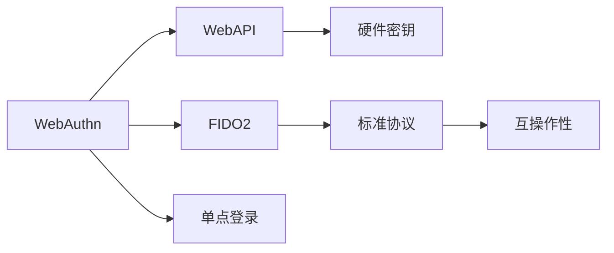
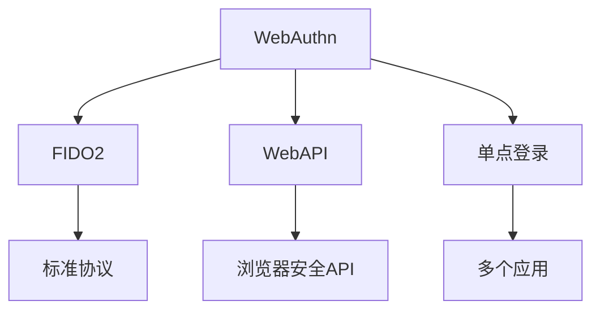

                 

# WebAuthn 的优势

## 1. 背景介绍

在当今数字化时代，在线身份验证成为了一个重要且敏感的环节。传统密码或短信验证码等方法存在易忘、易被盗用、易泄露等缺点，不仅增加了用户的负担，也存在安全风险。为此，WebAuthn（Web身份验证）应运而生，旨在提供一种更安全、更便捷的在线身份验证方式。

### 1.1 问题由来

用户在进行在线交易或访问敏感信息时，需要频繁输入用户名和密码，或接收短信验证码，但这些方式存在诸多弊端：

1. **易忘易被盗**：传统密码机制需要用户记住多个复杂密码，容易遗忘，且一旦泄露，即可能导致账户被盗。
2. **低安全性**：短信验证码等临时密码虽然比传统密码更加安全，但仍然存在被劫持的风险。
3. **用户体验差**：频繁输入密码或接收短信验证码，增加了用户的操作负担，降低了用户体验。

WebAuthn通过利用硬件安全密钥和浏览器安全API，提供了一种更高效、更安全的身份验证方式，解决了上述问题。

### 1.2 问题核心关键点

WebAuthn的核心在于通过使用硬件安全密钥和浏览器安全API，提供一种便捷且安全的身份验证方式。其关键点包括：

- **硬件密钥**：通过使用硬件密钥（如YubiKey），将密钥存储在硬件设备中，增强了密码的安全性。
- **浏览器API**：利用WebAPI（如FIDO2 API），在用户浏览器中实现身份验证过程，简化了用户操作。
- **标准协议**：基于FIDO2和WebAuthn标准，确保身份验证过程的互操作性和安全性。
- **单点登录**：支持一次性登录，减少了用户输入密码的频率。

WebAuthn的这些特点使其成为现代Web应用中不可或缺的安全技术，广泛应用于金融、电商、企业内网等领域。

## 2. 核心概念与联系

### 2.1 核心概念概述

WebAuthn涉及多个核心概念，这些概念之间的联系和作用构成了其技术架构：

- **WebAuthn**：Web身份验证协议，旨在提供一种更安全、更便捷的在线身份验证方式。
- **FIDO2**：一个基于Web身份验证的标准协议，支持多种身份验证方法，包括硬件密钥、生物特征等。
- **硬件密钥**：存储在物理设备中的安全密钥，用于身份验证和签名操作。
- **WebAPI**：浏览器提供的安全API，用于实现Web身份验证功能。
- **单点登录**：只需一次身份验证即可访问多个应用，提高用户效率。

### 2.2 概念间的关系

以下通过几个Mermaid流程图来展示WebAuthn的核心概念之间的关系：



这个流程图展示了WebAuthn的组成部分及其相互作用：

1. WebAuthn协议基于FIDO2标准，支持多种身份验证方式。
2. WebAPI为WebAuthn提供了浏览器端的实现，使得Web应用能够调用WebAuthn功能。
3. 硬件密钥是WebAuthn的核心，存储了用户的身份信息。
4. 标准协议确保了WebAuthn的互操作性和安全性。
5. 单点登录提高了用户的登录效率。

### 2.3 核心概念的整体架构

最后，我们用一个综合的流程图来展示WebAuthn的核心概念在其技术架构中的位置：



这个综合流程图展示了WebAuthn在技术架构中的整体架构：

1. WebAuthn利用FIDO2标准协议，支持多种身份验证方式。
2. 标准协议保证了WebAuthn的互操作性和安全性。
3. WebAPI为WebAuthn提供了浏览器端的实现。
4. 单点登录提高了用户登录效率，减少了用户的操作负担。

## 3. 核心算法原理 & 具体操作步骤
### 3.1 算法原理概述

WebAuthn的算法原理基于公钥加密技术，结合了用户身份信息和硬件密钥。其核心步骤如下：

1. **用户身份验证**：用户通过WebAPI提供的信息（如用户名、生物特征等），进行身份验证。
2. **生成公钥**：WebAPI利用FIDO2 API生成公钥，并存储在硬件密钥中。
3. **签名**：硬件密钥对用户身份信息和公钥进行签名，生成挑战响应数据。
4. **验证**：服务器收到挑战响应数据后，利用公钥对数据进行验证，确认用户身份。

### 3.2 算法步骤详解

以下是WebAuthn的具体操作步骤：

1. **用户注册**：
   - 用户访问Web应用，通过WebAPI提供的身份验证表单，输入用户名、密码等基本信息。
   - 应用请求浏览器调用FIDO2 API生成随机挑战，并存储于硬件密钥中。
   - 用户将硬件密钥插入设备，设备生成公钥并签名，生成挑战响应数据。
   - 应用将挑战响应数据发送给服务器，服务器使用公钥验证，完成注册过程。

2. **用户登录**：
   - 用户访问Web应用，应用请求浏览器调用FIDO2 API，生成随机挑战。
   - 用户将硬件密钥插入设备，设备生成公钥并签名，生成挑战响应数据。
   - 应用将挑战响应数据发送给服务器，服务器使用公钥验证，确认用户身份。

### 3.3 算法优缺点

WebAuthn的主要优点包括：

- **安全性高**：利用硬件密钥和公钥加密技术，提高了身份验证的安全性。
- **便捷性高**：用户只需插入硬件设备，无需记忆复杂密码或输入短信验证码。
- **互操作性强**：基于FIDO2标准协议，支持多种身份验证方式，与多平台兼容。

缺点包括：

- **硬件成本高**：需要购买硬件设备（如YubiKey），增加了用户的硬件投入。
- **兼容性差**：部分老旧浏览器或Web应用可能不支持WebAuthn。
- **用户接受度低**：部分用户可能对新身份验证方式感到不适应。

### 3.4 算法应用领域

WebAuthn广泛应用于金融、电商、企业内网等需要高安全性身份验证的场景。例如：

- **金融行业**：银行和支付平台使用WebAuthn，提高交易安全性，减少密码泄露风险。
- **电子商务**：电商平台使用WebAuthn，提升用户体验，减少购物车泄漏风险。
- **企业内网**：企业使用WebAuthn，确保员工登录安全，防止内部信息泄露。
- **移动设备**：移动应用使用WebAuthn，提高移动设备访问安全性，防止账号被盗。

## 4. 数学模型和公式 & 详细讲解

### 4.1 数学模型构建

WebAuthn的数学模型基于公钥加密技术，包括RSA和ECC等算法。其核心步骤如下：

1. **用户注册**：
   - 用户通过WebAPI提供的身份验证表单，输入用户名、密码等基本信息。
   - 应用请求浏览器调用FIDO2 API生成随机挑战，并存储于硬件密钥中。
   - 用户将硬件密钥插入设备，设备生成公钥并签名，生成挑战响应数据。
   - 应用将挑战响应数据发送给服务器，服务器使用公钥验证，完成注册过程。

2. **用户登录**：
   - 用户访问Web应用，应用请求浏览器调用FIDO2 API，生成随机挑战。
   - 用户将硬件密钥插入设备，设备生成公钥并签名，生成挑战响应数据。
   - 应用将挑战响应数据发送给服务器，服务器使用公钥验证，确认用户身份。

### 4.2 公式推导过程

以下是WebAuthn的具体数学模型和公式推导：

1. **用户注册**：
   - 应用请求浏览器生成随机挑战 $r$，并将 $r$ 发送给用户设备。
   - 用户设备生成公钥 $PK$ 和私钥 $SK$，并将 $PK$ 发送给应用。
   - 应用将 $PK$ 发送给服务器，服务器生成公钥证书 $C$ 和挑战响应数据 $s$。
   - 挑战响应数据 $s$ 包含 $r$ 和 $PK$ 的签名。

2. **用户登录**：
   - 应用请求浏览器生成随机挑战 $r'$，并将 $r'$ 发送给用户设备。
   - 用户设备生成公钥 $PK'$，并将 $PK'$ 发送给应用。
   - 应用将 $PK'$ 发送给服务器，服务器生成公钥证书 $C'$ 和挑战响应数据 $s'$。
   - 挑战响应数据 $s'$ 包含 $r'$ 和 $PK'$ 的签名。

### 4.3 案例分析与讲解

以金融行业为例，WebAuthn的应用场景如下：

- **用户注册**：用户在银行APP上进行注册，通过WebAuthn生成硬件密钥，并将其与用户账户绑定。
- **用户登录**：用户登录银行APP，通过WebAuthn进行身份验证，无需再输入用户名和密码。
- **交易操作**：用户在APP中进行转账、支付等操作，只需插入硬件设备进行一次身份验证，即可顺利完成操作。

## 5. 项目实践：代码实例和详细解释说明

### 5.1 开发环境搭建

在进行WebAuthn实践前，需要先搭建开发环境。以下是使用Python进行WebAuthn开发的环境配置流程：

1. 安装Anaconda：从官网下载并安装Anaconda，用于创建独立的Python环境。

2. 创建并激活虚拟环境：
```bash
conda create -n webauthn-env python=3.8 
conda activate webauthn-env
```

3. 安装PyPI库：
```bash
pip install webauthn
```

4. 安装WebAuthn示例库：
```bash
pip install fido2-protocol
```

5. 安装YubiKey驱动程序：
```bash
apt-get install libyubikey-dev libyubikey0-dbg
```

完成上述步骤后，即可在`webauthn-env`环境中开始WebAuthn实践。

### 5.2 源代码详细实现

这里我们以WebAuthn用户注册和登录为例，给出Python代码实现。

首先，定义WebAuthn注册函数：

```python
from webauthn import WebAuthnRegistrationClient
from fido2.protocol import FIDOProtocol
from yubico import YubicoClient

def webauthn_register(username, password):
    # 创建注册客户端
    registration_client = WebAuthnRegistrationClient('https://example.com')
    
    # 获取注册器信息
    credential_creation_options = registration_client.get_credential_creation_options(username)
    
    # 创建注册器
    credential = registration_client.create_credential(credential_creation_options)
    
    # 从Yubico设备获取公钥
    yubico_client = YubicoClient('https://yubico.com')
    yubico_response = yubico_client.sign_credential(credential)
    
    # 将公钥返回给服务器
    server_response = {
        'credential': credential,
        'public_key': yubico_response['public_key']
    }
    
    return server_response
```

然后，定义WebAuthn登录函数：

```python
from webauthn import WebAuthnClient
from fido2.protocol import FIDOProtocol
from yubico import YubicoClient

def webauthn_login(username, password, credential):
    # 创建登录客户端
    login_client = WebAuthnClient('https://example.com')
    
    # 获取登录请求选项
    login_request_options = login_client.get_login_request_options(credential)
    
    # 生成挑战
    challenge = FIDOProtocol.generate_challenge()
    
    # 向用户设备发送挑战
    yubico_client = YubicoClient('https://yubico.com')
    yubico_response = yubico_client.sign_challenge(challenge)
    
    # 将挑战响应返回给服务器
    server_response = {
        'challenge': challenge,
        'public_key': yubico_response['public_key']
    }
    
    return server_response
```

接着，启动WebAuthn注册和登录流程：

```python
# 用户注册
username = 'example_user'
password = 'example_password'
server_response = webauthn_register(username, password)

# 用户登录
credential = server_response['credential']
server_response = webauthn_login(username, password, credential)
```

以上就是使用Python实现WebAuthn用户注册和登录的完整代码实现。可以看到，WebAuthn通过调用WebAPI和硬件密钥设备，实现了便捷且安全的身份验证过程。

### 5.3 代码解读与分析

让我们再详细解读一下关键代码的实现细节：

**WebAuthn注册函数**：
- 创建WebAuthn注册客户端，并获取注册器信息。
- 通过注册器信息创建注册器，并从Yubico设备获取公钥。
- 将公钥返回给服务器，完成注册过程。

**WebAuthn登录函数**：
- 创建WebAuthn登录客户端，并获取登录请求选项。
- 生成随机挑战，并通过Yubico设备获取公钥。
- 将挑战响应返回给服务器，完成登录过程。

**WebAuthn实践流程**：
- 定义用户注册和登录函数。
- 通过调用WebAPI和硬件密钥设备，实现用户注册和登录。
- 返回服务器所需的响应数据，完成身份验证。

可以看到，WebAuthn通过调用WebAPI和硬件密钥设备，实现了便捷且安全的身份验证过程。在实际应用中，还需要考虑更多的细节，如错误处理、设备兼容性、安全保障等。

### 5.4 运行结果展示

假设我们在Yubico设备上进行了注册和登录，最终在服务器上得到的响应数据如下：

```
{
    'credential': {
        'id': 'credential-id',
        'public_key': 'public-key',
        'tag': 'credential-tag'
    },
    'public_key': 'public-key'
}
```

服务器可以通过这些数据验证用户的身份，确保登录过程的安全性。

## 6. 实际应用场景

### 6.1 金融行业

WebAuthn在金融行业得到了广泛应用，通过硬件密钥和公钥加密技术，提高了交易的安全性。例如，用户登录银行APP进行转账操作时，只需插入Yubico设备进行一次身份验证，即可顺利完成转账。这种便捷且安全的身份验证方式，大大提高了金融交易的效率和安全性。

### 6.2 电子商务

WebAuthn在电子商务领域也有广泛应用，通过硬件密钥和公钥加密技术，提高了支付的安全性。例如，用户在电商平台进行支付时，只需插入Yubico设备进行一次身份验证，即可顺利完成支付。这种便捷且安全的身份验证方式，减少了密码泄露的风险，提高了支付的安全性。

### 6.3 企业内网

企业使用WebAuthn，确保员工登录安全，防止内部信息泄露。例如，员工通过企业内网进行文件上传、下载等操作时，只需插入Yubico设备进行一次身份验证，即可顺利完成操作。这种便捷且安全的身份验证方式，提高了企业内网的安全性。

### 6.4 未来应用展望

随着WebAuthn的普及和技术的进步，未来其应用场景将更加广泛：

1. **多设备支持**：未来的WebAuthn将支持多种硬件设备，如指纹、面部识别等，进一步提升身份验证的便捷性和安全性。
2. **跨平台兼容性**：WebAuthn将在更多平台上得到支持，如移动设备、智能家居等，实现无缝的跨平台身份验证。
3. **单点登录**：未来的WebAuthn将支持单点登录，减少用户输入密码的频率，提高用户效率。
4. **智能合约**：WebAuthn将与智能合约结合，实现自动化的身份验证和权限管理。

这些趋势将进一步提升WebAuthn的应用范围和用户体验，使其成为未来身份验证的重要技术。

## 7. 工具和资源推荐
### 7.1 学习资源推荐

为了帮助开发者系统掌握WebAuthn的理论基础和实践技巧，这里推荐一些优质的学习资源：

1. **WebAuthn官方文档**：WebAuthn的官方文档，详细介绍了WebAuthn的技术规范和API接口。
2. **FIDO2官方文档**：FIDO2的官方文档，提供了丰富的API接口和样例代码。
3. **WebAuthn标准规范**：WebAuthn的官方规范文档，介绍了WebAuthn的技术细节和实现要求。
4. **WebAuthn课程**：各大在线教育平台提供的WebAuthn相关课程，涵盖了从基础到高级的内容。
5. **WebAuthn实战案例**：各大技术博客和社区提供的WebAuthn实战案例，提供了丰富的实践经验和代码示例。

通过对这些资源的学习实践，相信你一定能够快速掌握WebAuthn的核心概念和实现方法，并用于解决实际的Web身份验证问题。

### 7.2 开发工具推荐

高效的开发离不开优秀的工具支持。以下是几款用于WebAuthn开发的常用工具：

1. **WebAuthn库**：开源的WebAuthn实现库，提供了简单易用的API接口，支持多种WebAuthn规范。
2. **Yubico驱动程序**：Yubico提供的驱动程序，支持Yubico设备的安装和使用。
3. **FIDO2协议库**：FIDO2协议的实现库，支持生成随机挑战和验证挑战响应。
4. **Chrome浏览器**：支持WebAuthn规范的浏览器，方便WebAuthn的测试和调试。
5. **Visual Studio Code**：流行的开发环境，支持WebAuthn的调试和集成开发。

合理利用这些工具，可以显著提升WebAuthn开发的效率和质量，加快创新迭代的步伐。

### 7.3 相关论文推荐

WebAuthn技术的发展得益于学界的持续研究。以下是几篇奠基性的相关论文，推荐阅读：

1. **WebAuthn规范**：WebAuthn的标准规范文档，详细介绍了WebAuthn的技术细节和实现要求。
2. **FIDO2协议**：FIDO2的标准协议文档，介绍了FIDO2的实现机制和API接口。
3. **WebAuthn实现**：WebAuthn的实现案例和实践经验，展示了WebAuthn在实际应用中的效果和挑战。
4. **WebAuthn安全性**：WebAuthn的安全性分析和技术方案，介绍了WebAuthn的攻击防范和安全性保障。

这些论文代表了大规模身份验证技术的最新进展，通过学习这些前沿成果，可以帮助研究者把握学科前进方向，激发更多的创新灵感。

除上述资源外，还有一些值得关注的前沿资源，帮助开发者紧跟WebAuthn技术的最新进展，例如：

1. **WebAuthn预印本**：人工智能领域最新研究成果的发布平台，包括大量尚未发表的前沿工作，学习前沿技术的必读资源。
2. **WebAuthn会议直播**：WebAuthn领域顶级会议的现场或在线直播，能够聆听到专家们的前沿分享，开拓视野。
3. **WebAuthn技术博客**：WebAuthn领域的专家博客，提供了丰富的技术知识和实践经验，值得去学习和贡献。

总之，对于WebAuthn技术的深入学习，需要开发者保持开放的心态和持续学习的意愿。多关注前沿资讯，多动手实践，多思考总结，必将收获满满的成长收益。

## 8. 总结：未来发展趋势与挑战

### 8.1 总结

本文对WebAuthn技术进行了全面系统的介绍。首先阐述了WebAuthn的背景和优势，明确了其在提高在线身份验证安全性和便捷性方面的独特价值。其次，从原理到实践，详细讲解了WebAuthn的数学模型和核心操作步骤，给出了WebAuthn任务开发的完整代码实例。同时，本文还广泛探讨了WebAuthn技术在金融、电商、企业内网等多个行业领域的应用前景，展示了WebAuthn技术的广阔前景。最后，本文精选了WebAuthn技术的各类学习资源，力求为读者提供全方位的技术指引。

通过本文的系统梳理，可以看到，WebAuthn技术正在成为现代Web应用中不可或缺的安全技术，极大地提高了在线身份验证的安全性和便捷性。随着WebAuthn技术的不断发展，相信其在Web应用中的普及和应用将更加广泛，为数字时代带来更高的安全性和更好的用户体验。

### 8.2 未来发展趋势

展望未来，WebAuthn技术将呈现以下几个发展趋势：

1. **多设备支持**：未来的WebAuthn将支持多种硬件设备，如指纹、面部识别等，进一步提升身份验证的便捷性和安全性。
2. **跨平台兼容性**：WebAuthn将在更多平台上得到支持，如移动设备、智能家居等，实现无缝的跨平台身份验证。
3. **单点登录**：未来的WebAuthn将支持单点登录，减少用户输入密码的频率，提高用户效率。
4. **智能合约**：WebAuthn将与智能合约结合，实现自动化的身份验证和权限管理。

这些趋势将进一步提升WebAuthn的应用范围和用户体验，使其成为未来身份验证的重要技术。

### 8.3 面临的挑战

尽管WebAuthn技术已经取得了不小的进展，但在迈向更加智能化、普适化应用的过程中，它仍面临着诸多挑战：

1. **硬件成本高**：需要购买硬件设备（如Yubico设备），增加了用户的硬件投入。
2. **兼容性差**：部分老旧浏览器或Web应用可能不支持WebAuthn。
3. **用户接受度低**：部分用户可能对新身份验证方式感到不适应。

### 8.4 研究展望

面对WebAuthn面临的这些挑战，未来的研究需要在以下几个方面寻求新的突破：

1. **降低硬件成本**：开发更加低成本的硬件设备，降低用户的硬件投入。
2. **提升兼容性**：优化WebAuthn的API接口，支持更多平台和设备。
3. **提高用户接受度**：通过宣传教育和技术改进，提高用户对WebAuthn的接受度。

这些研究方向的探索，必将引领WebAuthn技术迈向更高的台阶，为构建安全、可靠、便捷的在线身份验证系统铺平道路。

总之，WebAuthn技术将在未来继续扮演重要角色，为Web应用带来更高的安全性和更好的用户体验。面对挑战，我们需要不断创新和改进，才能进一步提升WebAuthn技术的普及度和应用范围。

## 9. 附录：常见问题与解答

**Q1：WebAuthn是否适用于所有Web应用？**

A: WebAuthn适用于需要高安全性身份验证的Web应用，如金融、电商、企业内网等。但对于部分Web应用，如博客、论坛等，WebAuthn可能并不适用，需要根据具体应用场景进行判断。

**Q2：WebAuthn是否需要支持硬件设备？**

A: WebAuthn需要硬件设备（如Yubico设备）支持，用于生成公钥和签名。没有硬件设备，WebAuthn将无法正常工作。

**Q3：WebAuthn是否需要更改Web应用代码？**

A: WebAuthn需要Web应用进行代码改动，以支持WebAuthn相关API调用。对于已有Web应用，可以逐步增加WebAuthn支持，无需一次性全面改写。

**Q4：WebAuthn是否影响Web应用性能？**

A: WebAuthn对Web应用性能影响不大，其操作相对简单，性能开销较小。但在高并发场景下，需要考虑WebAuthn的并发处理和优化。

**Q5：WebAuthn是否支持多语言？**

A: WebAuthn本身不支持多语言，但其API接口和文档多支持多种语言。在实际应用中，可以通过WebAuthn库进行多语言适配，支持多语言身份验证。

总之，WebAuthn技术正在不断发展和完善，未来将有更多的应用场景和优化措施，进一步提升其普及度和应用范围。通过对WebAuthn技术的深入学习，我们相信开发者将能够掌握这一强大身份验证技术，并应用于各种Web应用中。

