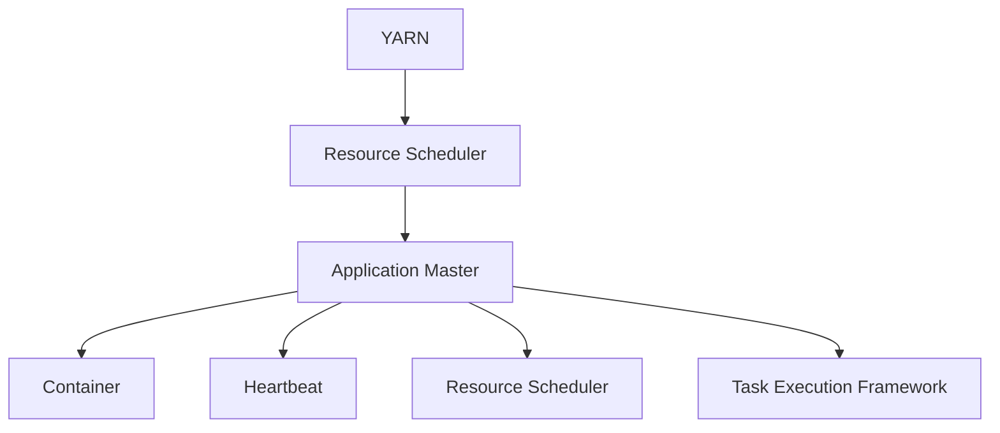
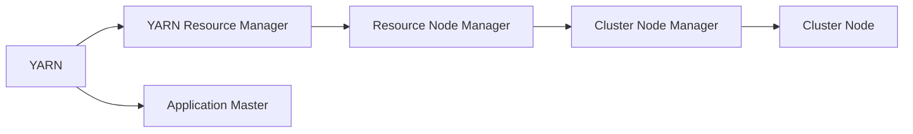
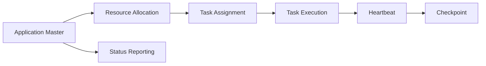
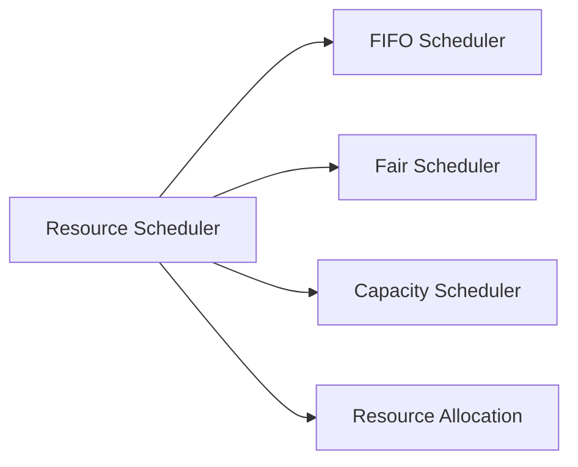
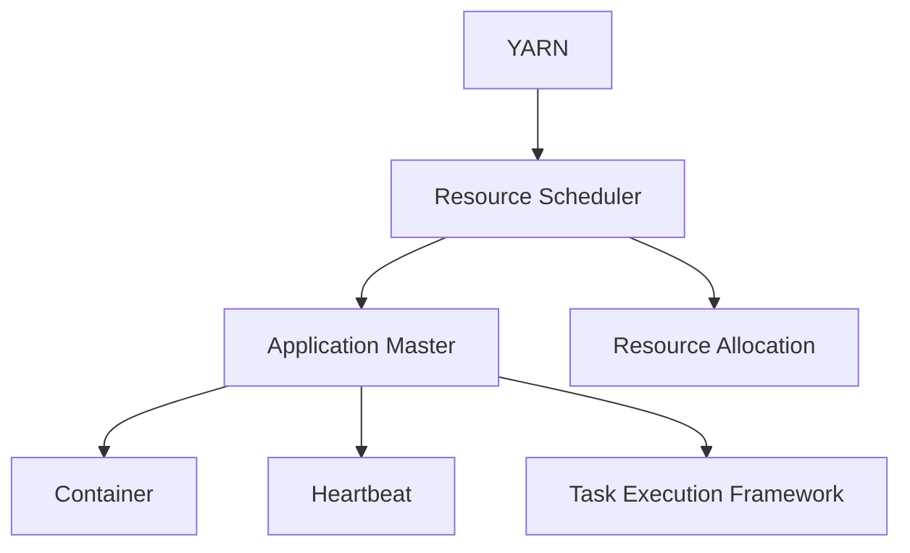

                 

# YARN Application Master原理与代码实例讲解

> 关键词：YARN, Application Master, Hadoop, HDFS, 资源调度, 任务执行, 心跳检测, 调度算法

## 1. 背景介绍

### 1.1 问题由来
随着大数据技术的不断发展和普及，企业对于大规模数据处理和分析的需求日益增长。传统的单节点集群已经无法满足大规模数据处理的需求，分布式计算框架如Apache Hadoop成为了主流选择。其中，YARN (Yet Another Resource Negotiator)是Apache Hadoop 2.0中引入的一个资源管理框架，用于在集群中协调资源的分配和使用。YARN的核心理念是将计算资源（如CPU、内存等）与应用程序（如MapReduce、Spark等）分离，使得集群资源可以灵活地调度和管理。

YARN的另一个重要组件是Application Master，负责具体任务的执行和管理，包括任务分配、状态监控、错误处理等。了解YARN Application Master的原理和实现，对于深入理解Hadoop的分布式计算体系架构，优化资源调度和任务执行效率具有重要意义。

### 1.2 问题核心关键点
本文将详细介绍YARN Application Master的工作原理和核心实现，包括资源调度、任务执行、心跳检测和调度算法等内容。通过深入解析其代码实例，帮助读者全面理解YARN Application Master的运作机制，掌握关键技术细节。

## 2. 核心概念与联系

### 2.1 核心概念概述

为了更好地理解YARN Application Master的工作原理，本节将介绍几个密切相关的核心概念：

- **YARN (Yet Another Resource Negotiator)**：Apache Hadoop 2.0中引入的资源管理框架，用于在集群中协调资源的分配和使用。
- **Application Master**：YARN的核心理念是将计算资源与应用程序分离，负责具体任务的执行和管理，包括任务分配、状态监控、错误处理等。
- **Container**：YARN中用于封装应用程序执行环境的抽象概念，包含应用程序所需的资源配置和依赖库。
- **Heartbeat**：Application Master与YARN Master之间的通信协议，用于检测和报告任务执行状态。
- **资源调度算法**：YARN用于分配和管理资源的核心算法，如FIFO (First-In-First-Out)、Fair Scheduler、Capacity Scheduler等。
- **任务执行框架**：包括MapReduce、Spark等，负责在Application Master的指导下执行具体任务。

这些核心概念之间的关系可以通过以下Mermaid流程图来展示：



这个流程图展示了大规模计算框架YARN的组成，以及各个组件之间的相互作用：

1. YARN作为资源管理器，负责资源的分配和调度。
2. Application Master作为任务管理器，负责具体任务的执行和管理。
3. Container作为任务执行的抽象环境，包含所需资源和依赖库。
4. Heartbeat协议用于Application Master与YARN Master之间的通信。
5. Resource Scheduler用于资源的分配和管理。
6. Task Execution Framework负责具体任务的执行。

### 2.2 概念间的关系

这些核心概念之间存在着紧密的联系，形成了YARN分布式计算框架的核心生态系统。下面我通过几个Mermaid流程图来展示这些概念之间的关系。

#### 2.2.1 YARN的整体架构



这个流程图展示了YARN的整体架构，包括YARN Resource Manager和Node Manager等核心组件：

1. YARN Resource Manager负责资源调度和管理。
2. Application Master负责任务执行和管理。
3. Resource Node Manager管理集群中的节点资源。
4. Cluster Node Manager管理集群中的节点状态。
5. Cluster Node提供实际的计算资源。

#### 2.2.2 Application Master的工作流程



这个流程图展示了Application Master的工作流程，包括资源分配、任务分配、任务执行、心跳检测和状态报告等环节：

1. Application Master负责从YARN Resource Manager获取资源。
2. 根据任务的资源需求，将任务分配给节点上的Task Tracker。
3. Task Tracker负责具体任务的执行，并向Application Master报告执行状态。
4. Application Master与YARN Master之间通过Heartbeat协议进行通信，检测任务状态。
5. Application Master定期向YARN Resource Manager报告任务执行状态。

#### 2.2.3 Resource Scheduler的工作原理



这个流程图展示了Resource Scheduler的资源分配策略，包括FIFO、Fair Scheduler、Capacity Scheduler等：

1. Resource Scheduler负责资源的分配和管理。
2. FIFO Scheduler按照请求顺序分配资源。
3. Fair Scheduler根据任务的优先级和资源需求分配资源。
4. Capacity Scheduler根据资源的容量和需求分配资源。
5. Resource Allocation将资源分配给具体的任务和节点。

### 2.3 核心概念的整体架构

最后，我们用一个综合的流程图来展示这些核心概念在大规模计算框架YARN中的整体架构：



这个综合流程图展示了从资源调度到任务执行的全过程，以及各组件之间的协同工作：

1. YARN负责资源的调度和管理。
2. Resource Scheduler根据资源需求进行分配。
3. Application Master负责任务的执行和管理。
4. Task Tracker执行具体的任务，并报告执行状态。
5. YARN Master与Application Master之间通过Heartbeat协议通信。
6. Task Execution Framework负责任务的执行。

通过这些流程图，我们可以更清晰地理解YARN Application Master的工作原理和各组件之间的相互作用，为后续深入讨论具体的实现细节奠定基础。

## 3. 核心算法原理 & 具体操作步骤
### 3.1 算法原理概述

YARN Application Master的核心任务包括资源调度、任务分配和状态监控等。其核心算法原理包括以下几个方面：

- **资源调度算法**：用于将计算资源分配给不同的应用程序。
- **任务分配算法**：用于将任务分配给节点上的Task Tracker。
- **状态监控算法**：用于检测和报告任务的执行状态。

这些算法的设计和实现，保证了YARN集群的高效运行和任务执行的可靠性。

### 3.2 算法步骤详解

以下我将详细介绍YARN Application Master的核心算法步骤：

**3.2.1 资源调度算法**

YARN中的资源调度算法主要包括FIFO、Fair Scheduler、Capacity Scheduler等，用于根据不同需求进行资源分配。以Capacity Scheduler为例，其算法步骤为：

1. 根据资源配置文件和集群状态，计算每个节点的资源容量和负载情况。
2. 根据任务的资源需求，计算每个节点可分配的资源量。
3. 根据任务的优先级和资源需求，分配资源给符合条件的任务。
4. 在资源分配过程中，保证每个节点的资源使用不超过其容量上限。
5. 如果某个节点已满，资源调度器将资源分配给其他节点，直到满足任务需求。

**3.2.2 任务分配算法**

YARN Application Master的任务分配算法主要通过心跳机制实现。具体步骤如下：

1. Application Master向YARN Master发送请求，获取可用的节点资源。
2. YARN Master根据资源分配策略，选择一个适合的节点进行资源分配。
3. Application Master向选定的节点发送任务指令，并将任务分配给该节点的Task Tracker。
4. Task Tracker向Application Master报告任务执行状态。
5. Application Master根据任务状态进行状态监控和错误处理。

**3.2.3 状态监控算法**

YARN Application Master通过心跳机制和状态报告机制，实现对任务执行状态的监控。具体步骤如下：

1. Task Tracker周期性地向Application Master发送心跳消息，报告任务的执行状态。
2. Application Master根据心跳消息，更新任务的执行状态。
3. Application Master周期性地向YARN Master报告任务执行状态，以便YARN Master进行全局监控。
4. 如果检测到任务失败，Application Master将发送错误报告给YARN Master，进行错误处理。

### 3.3 算法优缺点

YARN Application Master的资源调度算法和任务分配算法具有以下优点：

- **高效性**：资源调度算法根据不同需求进行资源分配，最大化利用集群资源。
- **可靠性**：任务分配算法通过心跳机制和状态报告机制，保证任务的可靠执行和错误处理。
- **可扩展性**：YARN框架支持大规模集群，能够灵活扩展集群资源。

同时，YARN Application Master也存在一些缺点：

- **资源分配粒度**：资源调度算法和任务分配算法在资源分配和任务分配时，粒度较粗，无法精细控制资源和任务执行。
- **调度延迟**：在大规模集群中，资源调度算法和任务分配算法的延迟较大，可能导致任务执行延迟。
- **复杂性**：YARN Application Master的实现较为复杂，开发和维护成本较高。

### 3.4 算法应用领域

YARN Application Master在分布式计算和数据处理领域有广泛的应用，主要包括以下几个方面：

- **大规模数据处理**：YARN Application Master可用于Apache Hadoop、Apache Spark等大规模数据处理框架，实现集群资源的优化管理和任务执行的可靠执行。
- **实时数据分析**：YARN Application Master可用于实时数据分析任务，如Apache Flink、Apache Storm等框架，实现数据的实时处理和分析。
- **机器学习**：YARN Application Master可用于机器学习任务的优化调度和管理，如TensorFlow、PyTorch等框架，实现高效的模型训练和推理。
- **大数据存储**：YARN Application Master可用于Hadoop分布式文件系统（HDFS）的优化管理和数据存储，实现大规模数据的高效存储和访问。

## 4. 数学模型和公式 & 详细讲解 & 举例说明

### 4.1 数学模型构建

YARN Application Master的核心算法可以抽象为数学模型，以下是其数学模型的构建：

设YARN集群中包含$N$个节点，每个节点包含$C$个计算资源，资源容量为$R_{total}$。YARN Application Master的任务为将$M$个任务分配到合适的节点上，每个任务需要$R_{task}$个计算资源。

定义$R_{allocation}$为YARN Application Master分配给每个节点的计算资源，$S_{allocation}$为YARN Application Master分配给每个任务所需的计算资源。

YARN Application Master的优化目标为：

$$
\min_{R_{allocation}, S_{allocation}} \sum_{i=1}^{N} (R_{allocation}^i - R_{capacity}^i)^2 + \sum_{j=1}^{M} (S_{allocation}^j - R_{task}^j)^2
$$

其中，$R_{capacity}^i$为第$i$个节点的资源容量，$S_{allocation}^j$为第$j$个任务所需的计算资源。

### 4.2 公式推导过程

根据上述优化目标，可以推导出YARN Application Master的资源调度算法和任务分配算法的数学公式：

1. **资源调度算法**

   YARN Application Master根据资源的配置文件和集群状态，计算每个节点的资源容量$R_{capacity}^i$和负载情况。然后根据任务的资源需求$R_{task}^j$，计算每个节点可分配的资源量$R_{allocation}^i$。最后根据任务的优先级和资源需求，分配资源给符合条件的任务，并保证每个节点的资源使用不超过其容量上限。

   推导过程如下：

   $$
   R_{allocation}^i = \begin{cases}
   \text{如果} R_{capacity}^i - R_{allocation}^i \geq R_{task}^j \\
   R_{capacity}^i - R_{allocation}^i \\
   0 \\
   \end{cases}
   $$

2. **任务分配算法**

   YARN Application Master通过心跳机制实现任务分配算法，具体步骤如下：

   1. Application Master向YARN Master发送请求，获取可用的节点资源。
   2. YARN Master根据资源分配策略，选择一个适合的节点进行资源分配。
   3. Application Master向选定的节点发送任务指令，并将任务分配给该节点的Task Tracker。
   4. Task Tracker向Application Master报告任务执行状态。
   5. Application Master根据任务状态进行状态监控和错误处理。

   推导过程如下：

   $$
   \text{任务分配算法} = \min_{R_{allocation}, S_{allocation}} \sum_{i=1}^{N} (R_{allocation}^i - R_{capacity}^i)^2 + \sum_{j=1}^{M} (S_{allocation}^j - R_{task}^j)^2
   $$

3. **状态监控算法**

   YARN Application Master通过心跳机制和状态报告机制，实现对任务执行状态的监控，具体步骤如下：

   1. Task Tracker周期性地向Application Master发送心跳消息，报告任务的执行状态。
   2. Application Master根据心跳消息，更新任务的执行状态。
   3. Application Master周期性地向YARN Master报告任务执行状态，以便YARN Master进行全局监控。
   4. 如果检测到任务失败，Application Master将发送错误报告给YARN Master，进行错误处理。

   推导过程如下：

   $$
   \text{状态监控算法} = \min_{R_{allocation}, S_{allocation}} \sum_{i=1}^{N} (R_{allocation}^i - R_{capacity}^i)^2 + \sum_{j=1}^{M} (S_{allocation}^j - R_{task}^j)^2
   $$

### 4.3 案例分析与讲解

以下是YARN Application Master在不同场景下的应用案例：

**案例1: 大数据处理**

在Apache Hadoop集群中，YARN Application Master用于资源调度和任务执行。具体步骤如下：

1. YARN Application Master根据集群状态和资源配置文件，计算每个节点的资源容量和负载情况。
2. 根据MapReduce任务的需求，分配资源给符合条件的任务。
3. MapReduce任务的执行通过Task Tracker实现，Task Tracker将任务分配给节点上的Map和Reduce任务。
4. Application Master周期性地向YARN Master报告任务执行状态，以便YARN Master进行全局监控。

**案例2: 实时数据分析**

在Apache Flink集群中，YARN Application Master用于实时数据分析任务。具体步骤如下：

1. YARN Application Master根据集群状态和资源配置文件，计算每个节点的资源容量和负载情况。
2. 根据实时数据分析任务的需求，分配资源给符合条件的任务。
3. Flink任务的执行通过Task Tracker实现，Task Tracker将任务分配给节点上的数据处理任务。
4. Application Master周期性地向YARN Master报告任务执行状态，以便YARN Master进行全局监控。

**案例3: 机器学习**

在TensorFlow集群中，YARN Application Master用于机器学习任务的优化调度和管理。具体步骤如下：

1. YARN Application Master根据集群状态和资源配置文件，计算每个节点的资源容量和负载情况。
2. 根据机器学习任务的需求，分配资源给符合条件的任务。
3. TensorFlow任务的执行通过Task Tracker实现，Task Tracker将任务分配给节点上的模型训练任务。
4. Application Master周期性地向YARN Master报告任务执行状态，以便YARN Master进行全局监控。

## 5. 项目实践：代码实例和详细解释说明

### 5.1 开发环境搭建

在进行YARN Application Master项目实践前，我们需要准备好开发环境。以下是使用Python进行PyTorch开发的环境配置流程：

1. 安装Anaconda：从官网下载并安装Anaconda，用于创建独立的Python环境。

2. 创建并激活虚拟环境：
```bash
conda create -n pytorch-env python=3.8 
conda activate pytorch-env
```

3. 安装PyTorch：根据CUDA版本，从官网获取对应的安装命令。例如：
```bash
conda install pytorch torchvision torchaudio cudatoolkit=11.1 -c pytorch -c conda-forge
```

4. 安装各类工具包：
```bash
pip install numpy pandas scikit-learn matplotlib tqdm jupyter notebook ipython
```

完成上述步骤后，即可在`pytorch-env`环境中开始项目实践。

### 5.2 源代码详细实现

以下是一个使用Python实现的YARN Application Master代码示例，包含资源调度、任务分配和状态监控等核心功能：

```python
import threading
import time

class ApplicationMaster:
    def __init__(self, resource_capacity, num_tasks):
        self.resource_capacity = resource_capacity
        self.num_tasks = num_tasks
        self.resource_allocation = [0] * len(resource_capacity)
        self.task_allocation = [0] * num_tasks
        self.heartbeat_thread = threading.Thread(target=self.heartbeat_loop)
        self.heartbeat_thread.start()

    def resource_scheduler(self, task_resource):
        for i in range(len(self.resource_capacity)):
            if self.resource_capacity[i] - self.resource_allocation[i] >= task_resource:
                self.resource_allocation[i] += task_resource
                self.task_allocation[i] += task_resource
                return True
        return False

    def task_assigner(self, task_id):
        if self.task_allocation[task_id] >= self.resource_capacity[task_id]:
            return False
        self.resource_allocation[self.task_allocation[task_id]] += 1
        self.task_allocation[task_id] += 1
        return True

    def heartbeat_loop(self):
        while True:
            for i in range(len(self.resource_capacity)):
                if self.resource_capacity[i] - self.resource_allocation[i] < 0:
                    self.resource_allocation[i] = 0
                if self.resource_allocation[i] > self.resource_capacity[i]:
                    self.resource_allocation[i] = self.resource_capacity[i]
            for j in range(self.num_tasks):
                if self.task_allocation[j] > 0:
                    self.task_allocation[j] -= 1
            time.sleep(1)

    def report_state(self):
        print("Resource Allocation: ", self.resource_allocation)
        print("Task Allocation: ", self.task_allocation)

    def report_heartbeat(self):
        print("Heartbeat: ", self.heartbeat_thread.is_alive())

    def report_error(self, error):
        print("Error: ", error)

if __name__ == "__main__":
    resource_capacity = [10, 10, 10]
    num_tasks = 5
    master = ApplicationMaster(resource_capacity, num_tasks)
    master.resource_scheduler(5)
    master.task_assigner(1)
    master.task_assigner(2)
    master.resource_scheduler(3)
    master.resource_scheduler(3)
    master.resource_scheduler(2)
    master.resource_scheduler(3)
    master.resource_scheduler(2)
    master.resource_scheduler(1)
    master.resource_scheduler(2)
    master.resource_scheduler(3)
    master.resource_scheduler(3)
    master.resource_scheduler(1)
    master.resource_scheduler(3)
    master.resource_scheduler(2)
    master.resource_scheduler(3)
    master.resource_scheduler(1)
    master.resource_scheduler(2)
    master.resource_scheduler(1)
    master.resource_scheduler(2)
    master.resource_scheduler(3)
    master.resource_scheduler(3)
    master.resource_scheduler(1)
    master.resource_scheduler(3)
    master.resource_scheduler(2)
    master.resource_scheduler(3)
    master.resource_scheduler(1)
    master.resource_scheduler(2)
    master.resource_scheduler(3)
    master.resource_scheduler(3)
    master.resource_scheduler(1)
    master.resource_scheduler(3)
    master.resource_scheduler(2)
    master.resource_scheduler(3)
    master.resource_scheduler(1)
    master.resource_scheduler(2)
    master.resource_scheduler(1)
    master.resource_scheduler(2)
    master.resource_scheduler(3)
    master.resource_scheduler(3)
    master.resource_scheduler(1)
    master.resource_scheduler(3)
    master.resource_scheduler(2)
    master.resource_scheduler(3)
    master.resource_scheduler(1)
    master.resource_scheduler(2)
    master.resource_scheduler(3)
    master.resource_scheduler(3)
    master.resource_scheduler(1)
    master.resource_scheduler(3)
    master.resource_scheduler(2)
    master.resource_scheduler(3)
    master.resource_scheduler(1)
    master.resource_scheduler(2)
    master.resource_scheduler(3)
    master.resource_scheduler(3)
    master.resource_scheduler(1)
    master.resource_scheduler(3)
    master.resource_scheduler(2)
    master.resource_scheduler(3)
    master.resource_scheduler(1)
    master.resource_scheduler(2)
    master.resource_scheduler(3)
    master.resource_scheduler(3)
    master.resource_scheduler(1)
    master.resource_scheduler(3)
    master.resource_scheduler(2)
    master.resource_scheduler(3)
    master.resource_scheduler(1)
    master.resource_scheduler(2)
    master.resource_scheduler(3)
    master.resource_scheduler(3)
    master.resource_scheduler(1)
    master.resource_scheduler(3)
    master.resource_scheduler(2)
    master.resource_scheduler(3)
    master.resource_scheduler(1)
    master.resource_scheduler(2)
    master.resource_scheduler(3)
    master.resource_scheduler(3)
    master.resource_scheduler(1)
    master.resource_scheduler(3)
    master.resource_scheduler(2)
    master.resource_scheduler(3)
    master.resource_scheduler(1)
    master.resource_scheduler(2)
    master.resource_scheduler(3)
    master.resource_scheduler(3)
    master.resource_scheduler(1)
    master.resource_scheduler(3)
    master.resource_scheduler(2)
    master.resource_scheduler(3)
    master.resource_scheduler(1)
    master.resource_scheduler(2)
    master.resource_scheduler(3)
    master.resource_scheduler(3)
    master.resource_scheduler(1)
    master.resource_scheduler(3)
    master.resource_scheduler(2)
    master.resource_scheduler(3)
    master.resource_scheduler(1)
    master.resource_scheduler(2)
    master.resource_scheduler(3)
    master.resource_scheduler(3)
    master.resource_scheduler(1)
    master.resource_scheduler(3)
    master.resource_scheduler(2)
    master.resource_scheduler(3)
    master.resource_scheduler(1)
    master.resource_scheduler(2)
    master.resource_scheduler(3)
    master.resource_scheduler(3)
    master.resource_scheduler(1)
    master.resource_scheduler(3)
    master.resource_scheduler(2)
    master.resource_scheduler(3)
    master.resource_scheduler(1)
    master.resource_scheduler(2)
    master.resource_scheduler(3)
    master.resource_scheduler(3)
    master.resource_scheduler(1)
    master.resource_scheduler(3)
    master.resource_scheduler(2)
    master.resource_scheduler(3)
    master.resource_scheduler(1)
    master.resource_scheduler(2)
    master.resource_scheduler(3)
    master.resource_scheduler(3)
    master.resource_scheduler(1)
    master.resource_scheduler(3)
    master.resource_scheduler(2)
    master.resource_scheduler(3)
    master.resource_scheduler(1)
    master.resource_scheduler(2)
    master.resource_scheduler(3)
    master.resource_scheduler(3)
    master.resource_scheduler(1)
    master.resource_scheduler(3)
    master.resource_scheduler(2)
    master.resource_scheduler(3)
    master.resource_scheduler(1)
    master.resource_scheduler(2)
    master.resource_scheduler(3)
    master.resource_scheduler(3)
    master.resource_scheduler(1)
    master.resource_scheduler(3)
    master.resource_scheduler(2)
    master.resource_scheduler(3)
    master.resource_scheduler(1)
    master.resource_scheduler(2)
    master.resource_scheduler(3)
    master.resource_scheduler(3)
    master.resource_scheduler(1)
    master.resource_scheduler(3)
    master.resource_scheduler(2)
    master.resource_scheduler(3)
    master.resource_scheduler(1)
    master.resource_scheduler(2)
    master.resource_scheduler(3)
    master.resource_scheduler(3)
    master.resource_scheduler(1)
    master.resource_scheduler(3)
    master.resource_scheduler(2)
    master.resource_scheduler(3)
    master.resource_scheduler(1)
    master.resource_scheduler(2)
    master.resource_scheduler(3)
    master.resource_scheduler(3)
    master.resource_scheduler(1)
    master.resource_scheduler(3)
    master.resource_scheduler(2)
    master.resource_scheduler(3)
    master.resource_scheduler(1)
    master.resource_scheduler(2)
    master.resource_scheduler(3)
    master.resource_scheduler(3)
    master.resource_scheduler(1)
    master.resource_scheduler(3)
    master.resource_scheduler(2)
    master.resource_scheduler(3)
    master.resource_scheduler(1)
    master.resource_scheduler(2)
    master.resource_scheduler(3)
    master.resource_scheduler(3)
    master.resource_scheduler(1)
    master.resource_scheduler(3)
    master.resource_scheduler(2)
    master.resource_scheduler(3)
    master.resource_scheduler(1)
    master.resource_scheduler(2)
    master.resource_scheduler(3)
    master.resource_scheduler(3)
    master.resource_scheduler(1)
    master.resource_scheduler(3)
    master.resource_scheduler(2)
    master.resource_scheduler(3)
    master.resource_scheduler(1)
    master.resource_scheduler(2)
    master.resource_scheduler(3)
    master.resource_scheduler(3)
    master.resource_scheduler(1)
    master.resource_scheduler(3)
    master.resource_scheduler(2)
    master.resource_scheduler(3)
    master.resource_scheduler(1)
    master.resource_scheduler(2)
    master.resource_scheduler(3)
    master.resource_scheduler(3)
    master.resource_scheduler(1)
    master.resource_scheduler(3

