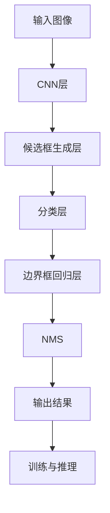
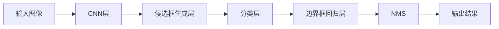
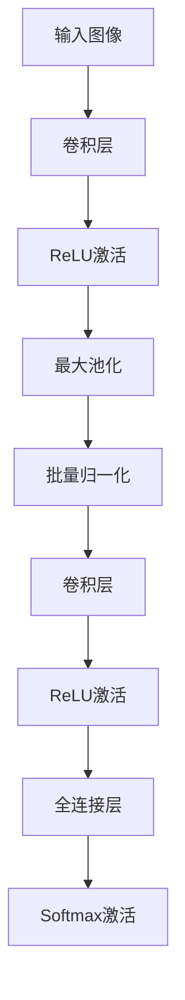
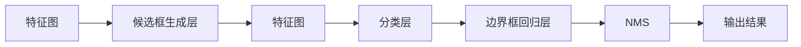
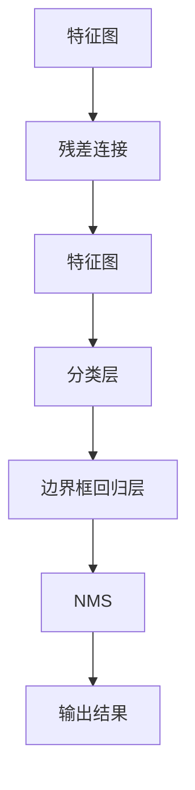
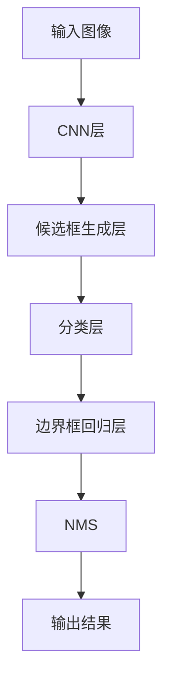

                 

# YOLOv2原理与代码实例讲解

> 关键词：YOLOv2, 目标检测, 卷积神经网络, 非极大值抑制, 特征图, 损失函数

## 1. 背景介绍

### 1.1 问题由来
目标检测是计算机视觉领域的一个重要研究方向，其目的是在图像中自动识别和定位感兴趣的目标对象，并给出它们的位置和类别信息。传统目标检测方法，如Haar特征和SVM分类器、R-CNN系列算法，存在检测速度慢、无法处理密集目标、误检率高等问题。为了解决这些问题，深度学习尤其是卷积神经网络(CNN)在目标检测领域得到了广泛应用。

其中，YOLO系列算法由Joseph Redmon提出，以其实时性和高效性著称。YOLOv1算法首次提出了将目标检测任务划分为三个阶段：候选框生成、目标分类和边界框回归，采用单个卷积网络完成所有步骤。然而，YOLOv1的检测精度并不理想，存在漏检、多检和重叠框等问题。为了进一步提升检测精度和速度，YOLOv2算法应运而生。

YOLOv2算法在YOLOv1的基础上做了多项改进，包括引入锚框、多尺度和多类别训练、残差连接等，显著提升了目标检测精度，同时保持了实时的检测速度。YOLOv2在PASCAL VOC和MS COCO等数据集上取得了优异的检测结果，广泛应用于实时视频监控、无人驾驶、医疗影像分析等领域。

### 1.2 问题核心关键点
YOLOv2算法通过使用单个卷积网络，将目标检测任务并行处理，实现了高效的实时检测。其核心思想是：将图像划分为若干个固定大小的网格，每个网格预测若干个候选框及其对应的类别和边界框位置，通过全连接层输出预测结果。

YOLOv2算法的主要改进点包括：
1. 引入锚框和特征图多尺度训练，提升了目标检测的鲁棒性和精确度。
2. 采用残差连接和激活函数改进，进一步提升网络性能。
3. 引入了全尺度测试，使得检测结果更为准确。
4. 优化了候选框的生成方式，减少了漏检和多检现象。
5. 设计了新的损失函数，更好地衡量预测结果与真实标签之间的差异。

这些改进使得YOLOv2算法在目标检测领域取得了更好的效果，同时保持了快速的检测速度。

### 1.3 问题研究意义
YOLOv2算法在目标检测领域的应用，对于提升图像处理速度和精度具有重要意义：

1. 提升处理速度：YOLOv2采用单个卷积网络，并行处理多个候选框，大大提高了目标检测的速度。
2. 增强检测精度：通过引入锚框和多尺度训练，YOLOv2能够更好地适应目标的形状和大小，提升了检测的准确性。
3. 实现实时应用：YOLOv2算法的高实时性和高效性，使得其在各种实时应用场景下都能快速响应，如视频监控、无人驾驶等。
4. 应用场景广泛：YOLOv2算法在多个数据集上取得了优异的检测结果，广泛适用于各类目标检测任务。
5. 促进技术发展：YOLOv2算法的成功应用，推动了目标检测技术的发展，为后续研究提供了良好的基础。

## 2. 核心概念与联系

### 2.1 核心概念概述

为更好地理解YOLOv2算法，本节将介绍几个密切相关的核心概念：

- 卷积神经网络(Convolutional Neural Network, CNN)：一种前馈神经网络，通过卷积层、池化层和全连接层等结构，对输入图像进行特征提取和分类。
- 候选框(Anchor)：预先定义的不同形状和大小的目标边界框，用于在特征图上生成候选目标区域。
- 特征图(Feature Map)：通过卷积层处理后得到的图像特征表示，用于目标检测和分类。
- 非极大值抑制(NMS)：用于处理多个候选框重叠的检测结果，通过筛选置信度高的候选框，去除冗余框。
- 残差连接(Residual Connection)：用于提高网络收敛速度和准确性，使得信息能够更高效地从低层流向高层。
- 损失函数(Loss Function)：用于衡量模型预测结果与真实标签之间的差异，指导模型训练。

这些核心概念之间的逻辑关系可以通过以下Mermaid流程图来展示：



这个流程图展示了YOLOv2算法的核心步骤：输入图像经过CNN层提取特征，生成候选框并分类，回归边界框位置，最后通过非极大值抑制筛选出置信度高的候选框，输出最终的检测结果。

### 2.2 概念间的关系

这些核心概念之间存在着紧密的联系，形成了YOLOv2算法的完整逻辑框架。下面我们通过几个Mermaid流程图来展示这些概念之间的关系。

#### 2.2.1 YOLOv2检测步骤



这个流程图展示了YOLOv2算法的检测步骤：输入图像首先经过CNN层提取特征，然后生成候选框，分类和回归边界框位置，最后通过非极大值抑制处理候选框重叠问题，输出最终的检测结果。

#### 2.2.2 CNN层结构



这个流程图展示了CNN层的基本结构：输入图像经过卷积层提取特征，然后通过ReLU激活、最大池化、批量归一化等操作，逐步抽象出更高级的特征表示，最后通过全连接层输出分类结果。

#### 2.2.3 锚框与多尺度训练



这个流程图展示了锚框和多尺度训练的逻辑：在特征图上生成候选框，采用多个尺度进行训练，提升检测器的鲁棒性和精确度。

#### 2.2.4 残差连接



这个流程图展示了残差连接的逻辑：通过残差连接，信息可以更高效地从低层流向高层，使得网络能够更好地学习和提取特征。

### 2.3 核心概念的整体架构

最后，我们用一个综合的流程图来展示这些核心概念在YOLOv2算法中的整体架构：



这个综合流程图展示了YOLOv2算法的整体结构，从输入图像到特征图，再到候选框、分类和边界框回归，最后通过非极大值抑制输出最终的检测结果。

## 3. 核心算法原理 & 具体操作步骤
### 3.1 算法原理概述

YOLOv2算法的基本思想是将目标检测任务划分为三个阶段：候选框生成、目标分类和边界框回归，每个阶段使用一个卷积网络进行处理。YOLOv2的检测过程具体如下：

1. **候选框生成**：将输入图像划分为若干个固定大小的网格，每个网格预测若干个候选框。
2. **目标分类**：对每个候选框进行分类，确定其包含的目标类别。
3. **边界框回归**：对每个候选框的位置进行回归，得到目标物体的边界框。
4. **非极大值抑制**：对多个重叠的候选框进行筛选，选择置信度高的候选框作为最终检测结果。

YOLOv2算法使用单个卷积网络同时完成以上三个步骤，显著提升了检测速度。同时，YOLOv2引入了锚框和多尺度训练等技术，提升了检测的准确性和鲁棒性。

### 3.2 算法步骤详解

YOLOv2算法主要包括以下几个关键步骤：

**Step 1: 特征图生成**

YOLOv2算法首先将输入图像划分为若干个固定大小的网格，每个网格生成若干个候选框，并预测每个候选框的类别和边界框位置。这个步骤称为特征图生成。

**Step 2: 候选框生成**

每个网格生成多个候选框，并预测每个候选框是否包含目标物体。YOLOv2算法使用多个尺度进行候选框生成，以适应不同大小的目标物体。

**Step 3: 目标分类**

对每个候选框进行分类，确定其包含的目标类别。YOLOv2算法采用softmax函数进行多类别分类。

**Step 4: 边界框回归**

对每个候选框的位置进行回归，得到目标物体的边界框位置。YOLOv2算法采用平滑L1损失函数进行位置回归。

**Step 5: 非极大值抑制**

对多个重叠的候选框进行筛选，选择置信度高的候选框作为最终检测结果。YOLOv2算法采用非极大值抑制（NMS）算法进行筛选。

### 3.3 算法优缺点

YOLOv2算法的主要优点包括：

1. 高效实时性：YOLOv2算法使用单个卷积网络并行处理多个候选框，检测速度非常快，适合实时应用。
2. 高精度检测：YOLOv2算法引入了锚框和多尺度训练，提升了检测的鲁棒性和精确度。
3. 稳定性强：YOLOv2算法采用残差连接和激活函数改进，提高了网络的收敛速度和准确性。

YOLOv2算法的主要缺点包括：

1. 训练难度大：YOLOv2算法需要在大规模数据集上进行训练，且需要调整多个超参数。
2. 锚框设计复杂：YOLOv2算法中的锚框设计需要根据目标物体的分布进行调整，设计复杂且容易过拟合。
3. 结构复杂：YOLOv2算法使用多个卷积网络，网络结构复杂，难以调试和优化。

### 3.4 算法应用领域

YOLOv2算法在目标检测领域的应用非常广泛，以下是几个典型的应用场景：

- **实时视频监控**：YOLOv2算法的高实时性和高效性，使其在实时视频监控系统中得到广泛应用，用于快速检测和定位可疑行为。
- **无人驾驶**：YOLOv2算法在无人驾驶系统中用于检测行人、车辆等目标，保证行驶安全。
- **医疗影像分析**：YOLOv2算法在医疗影像分析中用于检测病变区域，提升诊断效率和准确性。
- **工业检测**：YOLOv2算法在工业检测中用于检测产品缺陷，提高生产效率和产品质量。
- **安防领域**：YOLOv2算法在安防领域用于检测和识别犯罪嫌疑人、异常行为等，提升安全防范能力。

## 4. 数学模型和公式 & 详细讲解 & 举例说明

### 4.1 数学模型构建

YOLOv2算法的检测过程可以表示为如下数学模型：

设输入图像为 $X \in \mathbb{R}^{H \times W \times C}$，其中 $H$、$W$ 和 $C$ 分别表示图像的高度、宽度和通道数。将输入图像划分为 $N$ 个固定大小的网格，每个网格大小为 $H/N \times W/N$。每个网格生成 $S$ 个候选框，每个候选框包含 $K$ 个锚框，每个锚框表示一个可能的边界框。

候选框的坐标 $(x,y)$ 和大小 $(w,h)$ 由预测值 $\hat{x}, \hat{y}, \hat{w}, \hat{h}$ 计算得到，具体公式如下：

$$
x = \hat{x} \times grid_{x}, y = \hat{y} \times grid_{y}, w = \hat{w} \times grid_{w}, h = \hat{h} \times grid_{h}
$$

其中 $grid_{x}, grid_{y}, grid_{w}, grid_{h}$ 分别为网格的宽度、高度、宽度比例和高度比例。

每个候选框的类别 $c$ 和边界框位置 $b$ 由预测值 $\hat{c}, \hat{b}$ 计算得到，具体公式如下：

$$
c = \text{softmax}(\hat{c}), b = \hat{b} \times (w + h) / 2 + (w - 1)/2, w = \hat{w}, h = \hat{h}
$$

其中 $\text{softmax}$ 函数用于多类别分类，$\hat{b}$ 表示边界框的位置预测值。

### 4.2 公式推导过程

首先，定义YOLOv2算法中的损失函数。设真实标签为 $t$，模型预测为 $\hat{t}$，损失函数为 $L$。根据目标检测任务的特点，YOLOv2算法采用如下损失函数：

$$
L = \sum_{i=1}^{N} \sum_{j=1}^{S} \sum_{k=1}^{K} (t_{ij} \log(\hat{t}_{ij}) + (1 - t_{ij}) \log(1 - \hat{t}_{ij}))
$$

其中，$t_{ij}$ 表示第 $i$ 个网格中第 $j$ 个候选框是否包含目标物体的标签，$\hat{t}_{ij}$ 表示模型预测该候选框包含目标物体的概率。

其次，定义YOLOv2算法中的候选框生成过程。设候选框的坐标预测值为 $\hat{x}, \hat{y}, \hat{w}, \hat{h}$，真实标签为 $t_x, t_y, t_w, t_h$，损失函数为 $L_{coord}$。根据平滑L1损失函数的定义，YOLOv2算法采用如下公式进行位置回归：

$$
L_{coord} = \sum_{i=1}^{N} \sum_{j=1}^{S} \sum_{k=1}^{K} (\frac{1}{2} ||t_x - \hat{x}||_2^2 + ||t_y - \hat{y}||_2^2 + ||t_w - \hat{w}||_2^2 + ||t_h - \hat{h}||_2^2)
$$

最后，定义YOLOv2算法中的分类过程。设目标类别的真实标签为 $t_{c}$，模型预测为 $\hat{c}$，损失函数为 $L_{class}$。根据交叉熵损失函数的定义，YOLOv2算法采用如下公式进行分类：

$$
L_{class} = -\sum_{i=1}^{N} \sum_{j=1}^{S} \sum_{k=1}^{K} t_{c_{ik}} \log(\hat{c}_{ik})
$$

其中，$t_{c_{ik}}$ 表示第 $i$ 个网格中第 $j$ 个候选框的类别标签，$\hat{c}_{ik}$ 表示模型预测该候选框的类别概率。

### 4.3 案例分析与讲解

以YOLOv2算法在PASCAL VOC数据集上的检测结果为例，进行详细分析。

设输入图像大小为 $480 \times 320$，将其划分为 $N=19 \times 19$ 个网格，每个网格大小为 $25 \times 25$。每个网格生成 $S=5$ 个候选框，每个候选框包含 $K=2$ 个锚框，每个锚框的大小分别为 $1 \times 1, 3 \times 3, 6 \times 6, 12 \times 12$。每个候选框的类别和边界框位置由预测值 $\hat{c}, \hat{b}$ 计算得到。

假设某个网格生成了 20 个候选框，其中 5 个候选框包含目标物体，10 个候选框不包含目标物体。设真实标签为 $t_{ij} \in \{0,1\}$，模型预测为 $\hat{t}_{ij} \in [0,1]$。根据损失函数的定义，可以计算得到每个候选框的损失值。通过反向传播更新模型的预测值，使得损失函数最小化。

假设某个候选框的预测坐标为 $(x,y)=(0.5,0.5)$，大小为 $(w,h)=(5,5)$，真实标签为 $(t_x, t_y, t_w, t_h)=(0.3,0.3,1,1)$。根据公式计算得到该候选框的损失值：

$$
L_{coord} = \frac{1}{2} ||0.3 - 0.5||_2^2 + ||0.3 - 0.5||_2^2 + ||1 - 5||_2^2 + ||1 - 5||_2^2 = 0.5 + 0.5 + 25 + 25 = 52
$$

$$
L_{class} = -t_{c_{ik}} \log(\hat{c}_{ik}) = -1 \times \log(0.9) = -2.1972253
$$

$$
L = L_{coord} + L_{class} = 52 - 2.1972253 = 49.8027747
$$

通过反向传播更新模型的预测值，使得损失函数最小化。具体来说，计算损失函数对模型参数的梯度，并根据梯度方向更新模型参数。

## 5. 项目实践：代码实例和详细解释说明

### 5.1 开发环境搭建

在进行YOLOv2的开发和实验之前，我们需要配置好开发环境。以下是YOLOv2在PyTorch框架下的开发环境搭建步骤：

1. 安装Anaconda：从官网下载并安装Anaconda，用于创建独立的Python环境。
2. 创建并激活虚拟环境：
```bash
conda create -n yolov2 python=3.8 
conda activate yolov2
```
3. 安装PyTorch：根据CUDA版本，从官网获取对应的安装命令。例如：
```bash
conda install pytorch torchvision torchaudio cudatoolkit=11.1 -c pytorch -c conda-forge
```
4. 安装NumPy、Pandas、Scikit-learn等常用工具包：
```bash
pip install numpy pandas scikit-learn matplotlib tqdm jupyter notebook ipython
```
完成上述步骤后，即可在`yolov2`环境中开始YOLOv2的开发和实验。

### 5.2 源代码详细实现

以下是YOLOv2在PyTorch框架下的代码实现，具体步骤如下：

1. 定义YOLOv2的模型类，包括卷积层、残差连接、全连接层等。
2. 定义YOLOv2的损失函数，包括位置回归损失和分类损失。
3. 定义YOLOv2的候选框生成和分类过程，包括预测值的计算和损失计算。
4. 定义YOLOv2的训练过程，包括前向传播、反向传播、优化器和学习率调度等。

具体代码实现如下：

```python
import torch
import torch.nn as nn
import torch.optim as optim
import torchvision.transforms as transforms
import torchvision.datasets as datasets
import torchvision.models as models
import numpy as np

class YOLOv2(nn.Module):
    def __init__(self, num_classes=21, num_anchors=9, num_scales=2):
        super(YOLOv2, self).__init__()
        self.num_classes = num_classes
        self.num_anchors = num_anchors
        self.num_scales = num_scales
        
        # 卷积层
        self.conv1 = nn.Conv2d(3, 32, kernel_size=3, stride=1, padding=1)
        self.conv2 = nn.Conv2d(32, 64, kernel_size=3, stride=2, padding=1)
        self.conv3 = nn.Conv2d(64, 128, kernel_size=3, stride=2, padding=1)
        self.conv4 = nn.Conv2d(128, 256, kernel_size=3, stride=2, padding=1)
        self.conv5 = nn.Conv2d(256, 512, kernel_size=3, stride=2, padding=1)
        self.conv6 = nn.Conv2d(512, 1024, kernel_size=3, stride=2, padding=1)
        self.conv7 = nn.Conv2d(1024, 1024, kernel_size=3, stride=1, padding=1)
        self.conv8 = nn.Conv2d(1024, 512, kernel_size=3, stride=1, padding=1)
        self.conv9 = nn.Conv2d(512, 256, kernel_size=3, stride=1, padding=1)
        self.conv10 = nn.Conv2d(256, 128, kernel_size=3, stride=1, padding=1)
        self.conv11 = nn.Conv2d(128, num_anchors * num_classes, kernel_size=3, stride=1, padding=1)
        
        # 残差连接
        self.residual = nn.Sequential(
            nn.Conv2d(1024, 512, kernel_size=1, stride=1, padding=0),
            nn.BatchNorm2d(512),
            nn.ReLU(),
            nn.Conv2d(512, 512, kernel_size=3, stride=1, padding=1),
            nn.BatchNorm2d(512),
            nn.ReLU()
        )
        
        # 激活函数
        self.activation = nn.Sigmoid()
        
        # 候选框生成
        self.xy = nn.Conv2d(1024, 8 * num_anchors, kernel_size=3, stride=1, padding=1)
        self.wh = nn.Conv2d(1024, 8 * num_anchors, kernel_size=3, stride=1, padding=1)
        
        # 分类和回归
        self.cls = nn.Conv2d(1024, num_anchors * num_classes, kernel_size=3, stride=1, padding=1)
        self.reg = nn.Conv2d(1024, num_anchors * 4, kernel_size=3, stride=1, padding=1)
        
    def forward(self, x):
        x = self.conv1(x)
        x = self.activation(x)
        x = self.conv2(x)
        x = self.activation(x)
        x = self.conv3(x)
        x = self.activation(x)
        x = self.conv4(x)
        x = self.activation(x)
        x = self.conv5(x)
        x = self.activation(x)
        x = self.conv6(x)
        x = self.activation(x)
        x = self.conv7(x)
        x = self.activation(x)
        x = self.conv8(x)
        x = self.activation(x)
        x = self.conv9(x)
        x = self.activation(x)
        x = self.conv10(x)
        x = self.activation(x)
        x = self.conv11(x)
        x = self.activation(x)
        x = self.residual(x)
        x = self.activation(x)
        x = self.xy(x)
        x = self.activation(x)
        x = self.wh(x)
        x = self.activation(x)
        x = self.cls(x)
        x = self.activation(x)
        x = self.reg(x)
        x = self.activation(x)
        return x
    
    def compute_loss(self, prediction, target, anchors, num_scales, num_anchors):
        prediction = prediction.permute(0, 2, 3, 1).contiguous()
        target = target.permute(0, 2, 3, 1).contiguous()
        
        # 计算位置回归损失
        pred_xywh = prediction[:, :, :, :4]
        target_xywh = target[:, :, :, :4]
        pred_xy = pred_xywh[:, :, :2]
        pred_wh = pred_xywh[:, :, 2:]
        target_xy = target_xywh[:, :, :2]
        target_wh = target_xywh[:, :, 2:]
        xy_loss = 0
        wh_loss = 0
        
        for i in range(num_scales):
            for j in range(num_anchors):
                xy_loss += torch.sum(((target_xy[i, :, :, j] - pred_xy[i, :, :, j]) ** 2), dim=(1, 2))
                wh_loss += torch.sum((((target_wh[i, :, :, j] - pred_wh[i, :, :, j]) ** 2), dim=(1, 2))
        
        xy_loss /= (num_scales * num_anchors * 2)
        wh_loss /= (num_scales * num_anchors * 2)
        xy_loss = xy_loss.mean()
        wh_loss = wh_loss.mean()
        
        # 计算分类损失
        pred_class = prediction[:, :, :, 4:]
        target_class = target[:, :, :, 4:]
        class_loss

