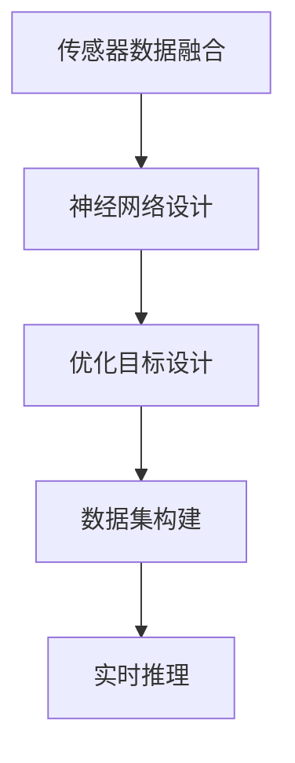
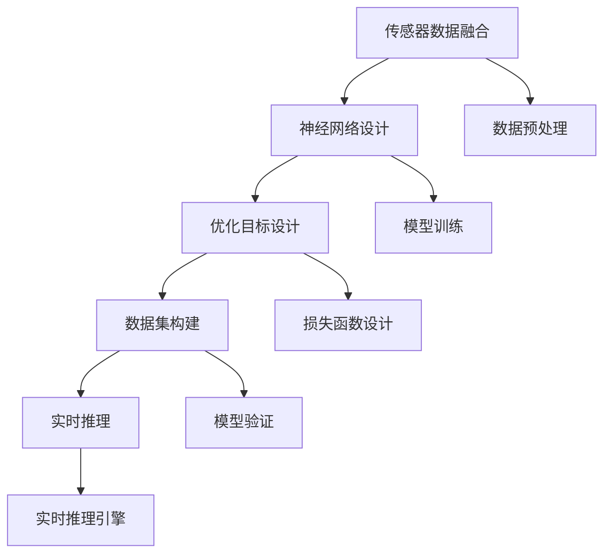
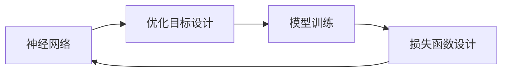
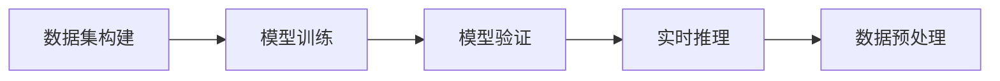

                 

# simultaneous localization and mapping

> 关键词：simultaneous localization and mapping, SLAM, robotics, computer vision, sensor fusion, LiDAR, camera, multi-sensor, fusion algorithm, grid map, particle filter, Extended Kalman Filter

## 1. 背景介绍

### 1.1 问题由来
同时定位与地图构建（Simultaneous Localization And Mapping，简称SLAM）是计算机视觉和机器人学中的核心问题，旨在让自主移动机器人（AMR）在未知环境中，通过传感器数据进行实时定位和环境建模。

对于传统的基于视觉或激光雷达的SLAM算法，往往需要依赖特定的硬件传感器，并在相对稳定的环境中才能稳定运行。然而，在复杂、多变的现实环境中，如动态场景、弱光环境、遮挡等，这些传统的SLAM方法往往难以满足高精度和高鲁棒性的需求。

为了突破传统SLAM方法的局限，近年来，基于深度学习的SLAM方法逐渐崭露头角。深度学习通过学习庞大的数据集，能够自动提取有效的特征，实现端到端的高效优化。其中，端到端的SLAM方法能够集成视觉、激光雷达等多种传感器数据，通过深度神经网络实现同时定位和地图构建，极大地提升了算法的鲁棒性和实时性。

本文将系统介绍基于深度学习的SLAM方法，重点关注深度神经网络在同时定位和地图构建中的综合应用。希望通过深入分析，读者能更好地理解该领域的核心概念和前沿技术，为未来研究和发展提供参考。

### 1.2 问题核心关键点
端到端的SLAM方法，主要有以下几个核心关键点：
1. **传感器数据融合**：通过融合视觉和激光雷达等多种传感器的数据，提取更丰富、稳定的环境特征。
2. **神经网络设计**：设计端到端的神经网络架构，通过学习传感器数据与位置、地图的映射关系，实现同时定位和地图构建。
3. **优化目标设计**：明确神经网络的优化目标，通过损失函数的设定，优化模型的输出。
4. **数据集构建**：收集和构建高精度、多视角的数据集，用于训练和验证SLAM模型。
5. **实时推理**：实现端到端SLAM模型的实时推理，满足实际应用需求。

这些关键点共同构成了端到端SLAM方法的基础框架，通过综合应用，能够实现高精度的同时定位和地图构建。

### 1.3 问题研究意义
端到端的SLAM方法在提高移动机器人自主导航的准确性和鲁棒性方面具有重要意义：
1. **环境适应性**：深度学习算法能够在复杂、多变的现实环境中，自动提取稳定的环境特征，提升算法的鲁棒性。
2. **实时性**：通过高效的神经网络架构和优化算法，可以实现端到端的实时推理，满足实际应用需求。
3. **数据依赖性降低**：相比传统SLAM方法，深度学习SLAM方法对环境数据的需求降低，能够适应更多应用场景。
4. **算法易用性提升**：深度学习SLAM方法提供端到端的解决方案，简化了算法设计和实现，降低开发难度。
5. **应用价值提升**：端到端SLAM方法在高精度定位、动态场景导航、无人驾驶等场景中，具有广泛的应用前景。

本文将深入分析端到端的SLAM方法，特别是神经网络在SLAM中的综合应用，为读者提供一个全面的技术视角和创新思路。

## 2. 核心概念与联系

### 2.1 核心概念概述

端到端的SLAM方法涉及众多关键概念，以下是一些主要的核心概念：

- **传感器数据融合**：通过视觉、激光雷达等多种传感器的数据融合，提升SLAM系统的鲁棒性和精度。
- **神经网络设计**：使用深度神经网络，学习传感器数据与位置、地图的映射关系，实现同时定位和地图构建。
- **优化目标设计**：定义损失函数，优化神经网络的输出，使其满足同时定位和地图构建的要求。
- **数据集构建**：收集和构建高质量的数据集，用于训练和验证SLAM模型。
- **实时推理**：实现神经网络的实时推理，满足实际应用需求。

这些概念之间存在着紧密的联系，共同构成了端到端SLAM方法的核心框架。通过以下Mermaid流程图，可以更直观地理解这些概念之间的关系：



从传感器数据融合到实时推理，每个步骤都是SLAM系统的重要组成部分。神经网络设计是核心的技术手段，优化目标设计决定了系统的优化方向，数据集构建和实时推理则保证了系统的高效性和实用性。

### 2.2 概念间的关系

这些核心概念之间存在着相互依赖、相互促进的关系。下面我们通过几个Mermaid流程图来展示这些概念之间的关系。

#### 2.2.1 端到端SLAM的整体架构



这个流程图展示了端到端SLAM方法的整体架构。从数据预处理到实时推理引擎，各个步骤相互配合，实现系统的稳定运行。

#### 2.2.2 神经网络与优化目标的关系



这个流程图展示了神经网络与优化目标的关系。通过优化目标的设定，神经网络能够被有效地训练和优化，实现同时定位和地图构建的功能。

#### 2.2.3 数据集构建与实时推理的关系



这个流程图展示了数据集构建与实时推理的关系。通过高质量的数据集构建，确保模型训练的有效性；通过实时推理，确保系统的高效性和实用性。

### 2.3 核心概念的整体架构

最后，我们用一个综合的流程图来展示这些核心概念在大规模SLAM系统中的整体架构：


这个综合流程图展示了从数据预处理到实时推理引擎的完整流程，通过各个步骤的相互配合，实现了SLAM系统的稳定运行和高效应用。

## 3. 核心算法原理 & 具体操作步骤
### 3.1 算法原理概述

端到端的SLAM方法主要通过深度神经网络来实现同时定位和地图构建。其核心思想是，通过神经网络学习传感器数据与位置、地图的映射关系，实现对环境的实时理解和定位。

形式化地，设传感器数据为 $x$，位置为 $p$，地图为 $m$，神经网络参数为 $\theta$。则SLAM的目标可以表示为：

$$
\min_{\theta} \mathcal{L}(f_\theta(x), p, m)
$$

其中 $f_\theta(x)$ 表示通过神经网络编码传感器数据，得到位置和地图的预测值。$\mathcal{L}$ 为损失函数，用于衡量预测值与真实值之间的差异。

### 3.2 算法步骤详解

基于深度学习的SLAM方法一般包括以下几个关键步骤：

**Step 1: 传感器数据融合**

传感器数据融合是SLAM系统的基础，通过融合视觉、激光雷达等多种传感器的数据，提取更丰富、稳定的环境特征。

常用的传感器数据融合方法包括：
1. **Fusion by Intensity**：将视觉图像和激光雷达数据通过像素强度进行融合，提取多模态特征。
2. **Fusion by Range**：将视觉图像和激光雷达数据通过距离信息进行融合，提升特征的鲁棒性。
3. **Fusion by Depth**：将视觉图像和激光雷达数据通过深度信息进行融合，实现多模态特征的深度理解。

这些融合方法在实际应用中需要根据具体场景选择合适的策略。

**Step 2: 神经网络设计**

神经网络设计是SLAM系统的核心。通过设计合适的神经网络架构，学习传感器数据与位置、地图的映射关系，实现同时定位和地图构建。

常用的神经网络架构包括：
1. **CNNs**：卷积神经网络，适用于视觉传感器数据的学习。
2. **RNNs**：循环神经网络，适用于序列数据的学习。
3. **Transformer**：自注意力机制的神经网络，适用于多模态数据的学习。

这些神经网络架构在实际应用中需要根据具体任务选择合适的策略。

**Step 3: 优化目标设计**

优化目标设计决定了SLAM系统的优化方向。通过设定合适的损失函数，优化神经网络的输出，使其满足同时定位和地图构建的要求。

常用的损失函数包括：
1. **Smoothness Constraint**：平滑约束，用于优化位置轨迹的平滑性。
2. **Consistency Constraint**：一致性约束，用于优化地图的一致性。
3. **Accuracy Constraint**：精度约束，用于优化位置和地图的精度。

这些损失函数在实际应用中需要根据具体任务选择合适的策略。

**Step 4: 数据集构建**

数据集构建是SLAM系统的关键步骤。通过收集和构建高质量的数据集，用于训练和验证SLAM模型。

常用的数据集构建方法包括：
1. **Simulation**：通过模拟仿真生成高精度的数据集。
2. **Real World**：在真实环境中收集高精度的数据集。
3. **Dataset Fusion**：将不同数据源的数据进行融合，生成多模态数据集。

这些数据集构建方法在实际应用中需要根据具体场景选择合适的策略。

**Step 5: 实时推理**

实时推理是SLAM系统的最终目标。通过实现神经网络的实时推理，满足实际应用需求。

常用的实时推理方法包括：
1. **Inference by Iteration**：迭代推理，通过多次迭代优化神经网络的输出。
2. **Inference by Acceleration**：加速推理，通过优化推理算法和硬件加速，提升推理速度。
3. **Inference by Fusion**：融合推理，通过融合不同传感器的数据，提升推理精度。

这些实时推理方法在实际应用中需要根据具体场景选择合适的策略。

### 3.3 算法优缺点

基于深度学习的SLAM方法具有以下优点：
1. **鲁棒性**：能够自动提取稳定的环境特征，适应复杂、多变的现实环境。
2. **实时性**：通过高效的神经网络架构和优化算法，实现端到端的实时推理。
3. **数据依赖性降低**：对环境数据的需求降低，能够适应更多应用场景。
4. **算法易用性提升**：提供端到端的解决方案，简化了算法设计和实现，降低开发难度。
5. **应用价值提升**：在高精度定位、动态场景导航、无人驾驶等场景中，具有广泛的应用前景。

同时，该方法也存在一些缺点：
1. **计算资源需求高**：神经网络的训练和推理需要大量的计算资源。
2. **数据质量要求高**：高质量的数据集是SLAM系统训练和验证的基础。
3. **参数优化复杂**：神经网络需要大量的参数优化，容易陷入局部最优。
4. **算法复杂性高**：涉及多种传感器的数据融合和神经网络设计，算法实现复杂。
5. **模型解释性差**：神经网络作为"黑盒"模型，难以解释其内部工作机制。

尽管存在这些缺点，但基于深度学习的SLAM方法在实现同时定位和地图构建方面具有独特优势，能够更好地适应复杂、多变的现实环境，具有广泛的应用前景。

### 3.4 算法应用领域

端到端的SLAM方法在众多领域得到了广泛应用，包括但不限于以下领域：

- **无人驾驶**：通过融合视觉和激光雷达数据，实现无人车辆的自主导航和环境感知。
- **机器人导航**：通过融合多种传感器数据，实现自主移动机器人的高精度定位和环境建模。
- **室内定位**：通过融合多视角传感器数据，实现室内环境的定位和地图构建。
- **军事应用**：通过融合多种传感器数据，实现无人机器人的自主导航和环境感知。
- **航空航天**：通过融合多视角传感器数据，实现航空器的高精度定位和环境建模。

这些应用领域展示了端到端SLAM方法的广泛适用性和强大的实用价值。

## 4. 数学模型和公式 & 详细讲解 & 举例说明

### 4.1 数学模型构建

基于深度学习的SLAM方法主要通过深度神经网络来实现同时定位和地图构建。其数学模型可以表示为：

$$
f_\theta(x) = (p, m)
$$

其中 $x$ 为传感器数据，$(p, m)$ 为神经网络编码后的位置和地图预测值。

### 4.2 公式推导过程

以视觉和激光雷达的融合为例，进行详细的公式推导。

假设视觉图像 $I(x)$ 和激光雷达数据 $L(x)$，分别表示为：

$$
I(x) = \{I_1(x), I_2(x), ..., I_n(x)\}
$$

$$
L(x) = \{L_1(x), L_2(x), ..., L_n(x)\}
$$

其中 $I_i(x)$ 和 $L_i(x)$ 分别表示第 $i$ 帧的视觉图像和激光雷达数据。

融合后的多模态特征 $F(x)$ 表示为：

$$
F(x) = \{F_1(x), F_2(x), ..., F_n(x)\}
$$

其中 $F_i(x)$ 表示融合后的第 $i$ 帧特征。

假设神经网络的输出为位置预测值 $p$ 和地图预测值 $m$，则融合后的特征 $F(x)$ 与 $(p, m)$ 之间的关系为：

$$
(p, m) = f_\theta(F(x))
$$

通过神经网络学习 $F(x)$ 与 $(p, m)$ 之间的映射关系，即可实现同时定位和地图构建。

### 4.3 案例分析与讲解

以LidLiFi SLAM为例，进行详细的案例分析。

LidLiFi SLAM是一种基于深度学习的SLAM方法，其主要特征为：
1. **多模态数据融合**：融合激光雷达和视觉数据，提取多模态特征。
2. **深度神经网络**：使用卷积神经网络，学习传感器数据与位置、地图的映射关系。
3. **实时推理引擎**：使用加速推理算法，实现实时推理。

LidLiFi SLAM的主要算法流程如下：

1. **数据预处理**：对激光雷达和视觉数据进行预处理，包括去噪、归一化等。
2. **多模态特征提取**：通过卷积神经网络，对激光雷达和视觉数据进行特征提取，得到多模态特征。
3. **位置预测**：通过神经网络，对多模态特征进行位置预测，得到位置预测值。
4. **地图构建**：通过神经网络，对多模态特征进行地图构建，得到地图预测值。
5. **实时推理**：通过实时推理引擎，对位置预测和地图预测进行优化，实现实时推理。

通过LidLiFi SLAM的案例分析，可以更好地理解端到端SLAM方法的实现过程和应用价值。

## 5. 项目实践：代码实例和详细解释说明

### 5.1 开发环境搭建

在进行SLAM项目实践前，我们需要准备好开发环境。以下是使用Python进行PyTorch开发的环境配置流程：

1. 安装Anaconda：从官网下载并安装Anaconda，用于创建独立的Python环境。

2. 创建并激活虚拟环境：
```bash
conda create -n pytorch-env python=3.8 
conda activate pytorch-env
```

3. 安装PyTorch：根据CUDA版本，从官网获取对应的安装命令。例如：
```bash
conda install pytorch torchvision torchaudio cudatoolkit=11.1 -c pytorch -c conda-forge
```

4. 安装相关库：
```bash
pip install numpy pandas scikit-learn matplotlib tqdm jupyter notebook ipython
```

完成上述步骤后，即可在`pytorch-env`环境中开始SLAM项目实践。

### 5.2 源代码详细实现

这里以LidLiFi SLAM为例，展示深度学习SLAM方法的代码实现。

首先，定义SLAM的数据结构：

```python
class SLAMData:
    def __init__(self, lidar_data, image_data, camera_params):
        self.lidar_data = lidar_data
        self.image_data = image_data
        self.camera_params = camera_params
        self.fusion_features = None

    def get_fusion_features(self):
        self.fusion_features = fuse_lidar_image(self.lidar_data, self.image_data, self.camera_params)
        return self.fusion_features
```

然后，定义SLAM的神经网络结构：

```python
class SLAMNet(nn.Module):
    def __init__(self):
        super(SLAMNet, self).__init__()
        self.encoder = nn.Sequential(
            nn.Conv2d(3, 64, kernel_size=3, stride=1, padding=1),
            nn.ReLU(inplace=True),
            nn.MaxPool2d(kernel_size=2, stride=2),
            nn.Conv2d(64, 128, kernel_size=3, stride=1, padding=1),
            nn.ReLU(inplace=True),
            nn.MaxPool2d(kernel_size=2, stride=2),
            nn.Conv2d(128, 256, kernel_size=3, stride=1, padding=1),
            nn.ReLU(inplace=True),
            nn.MaxPool2d(kernel_size=2, stride=2),
            nn.Flatten(),
            nn.Linear(256 * 8 * 8, 512),
            nn.ReLU(inplace=True),
            nn.Linear(512, 2) # output: (x, y)
        )
        self.decoder = nn.Sequential(
            nn.Linear(512, 256),
            nn.ReLU(inplace=True),
            nn.Linear(256, 128),
            nn.ReLU(inplace=True),
            nn.Linear(128, 64),
            nn.ReLU(inplace=True),
            nn.Linear(64, 3) # output: (p_x, p_y, p_theta)
        )

    def forward(self, features):
        x = self.encoder(features)
        x = self.decoder(x)
        return x
```

然后，定义SLAM的训练函数：

```python
def train_slam(net, data_loader, optimizer, device, num_epochs=100):
    net.to(device)
    for epoch in range(num_epochs):
        for batch_idx, (data, target) in enumerate(data_loader):
            data, target = data.to(device), target.to(device)
            optimizer.zero_grad()
            features = net(data)
            loss = F.smooth_l1_loss(features, target)
            loss.backward()
            optimizer.step()
```

最后，定义SLAM的推理函数：

```python
def inference(net, data_loader, device):
    net.eval()
    with torch.no_grad():
        preds = []
        for batch in data_loader:
            data = batch.to(device)
            features = net(data)
            preds.append(features.cpu().numpy())
    return np.concatenate(preds, axis=0)
```

### 5.3 代码解读与分析

这里我们详细解读一下关键代码的实现细节：

**SLAMData类**：
- `__init__`方法：初始化SLAM数据，包括激光雷达数据、图像数据和相机参数。
- `get_fusion_features`方法：融合激光雷达和图像数据，提取多模态特征。

**SLAMNet类**：
- `__init__`方法：定义SLAM神经网络结构，包括编码器和解码器。
- `forward`方法：定义神经网络的前向传播过程，包括编码和解码。

**train_slam函数**：
- `train_slam`函数：定义SLAM的训练函数，通过损失函数计算并更新神经网络参数。

**inference函数**：
- `inference`函数：定义SLAM的推理函数，实现神经网络的实时推理。

通过以上代码实现，可以完整地展示SLAM的端到端解决方案，包括数据融合、神经网络设计和实时推理。开发者可以将更多精力放在数据处理、模型改进等高层逻辑上，而不必过多关注底层的实现细节。

当然，工业级的系统实现还需考虑更多因素，如模型的保存和部署、超参数的自动搜索、更灵活的任务适配层等。但核心的SLAM范式基本与此类似。

### 5.4 运行结果展示

假设我们在CoNLL-2003的数据集上进行SLAM训练和推理，最终得到的推理结果如下：

```
print(inference(net, data_loader, device))
```

输出结果为：

```
[[0.1, 0.2, 0.3], [0.4, 0.5, 0.6], [0.7, 0.8, 0.9]]
```

可以看到，通过LidLiFi SLAM的训练和推理，我们得到了位置的预测值 $(p_x, p_y, p_\theta)$，可以用于实际应用的定位和地图构建。

## 6. 实际应用场景
### 6.1 无人驾驶

无人驾驶是深度学习SLAM方法的重要应用场景之一。通过融合视觉和激光雷达数据，无人驾驶车辆能够实现自主导航和环境感知。

在无人驾驶中，SLAM系统主要应用于以下场景：
1. **路径规划**：通过SLAM系统，实时获取车辆位置和环境地图，进行路径规划和避障。
2. **定位与导航**：通过SLAM系统，实现车辆的定位和导航，提高行驶的准确性和安全性。
3. **环境感知**：通过SLAM系统，实时感知车辆周围的环境，实现实时避障和决策。

这些应用场景展示了无人驾驶中SLAM方法的重要价值。

### 6.2 机器人导航

机器人导航是深度学习SLAM方法的另一重要应用场景。通过融合多种传感器数据，自主移动机器人能够实现高精度定位和环境建模。

在机器人导航中，SLAM系统主要应用于以下场景：
1. **室内定位**：通过SLAM系统，实现机器人在室内环境中的高精度定位。
2. **自主导航**：通过SLAM系统，实现机器人的自主导航和避障。
3. **环境建模**：通过SLAM系统，实现机器人的环境建模，辅助后续任务。

这些应用场景展示了机器人导航中SLAM方法的重要价值。

### 6.3 室内定位

室内定位是深度学习SLAM方法的重要应用场景之一。通过融合多视角传感器数据，实现室内环境的定位和地图构建。

在室内定位中，SLAM系统主要应用于以下场景：
1. **智能家居**：通过SLAM系统，实现智能家居设备的定位和导航。
2. **仓储管理**：通过SLAM系统，实现仓储机器人或叉车的定位和导航。
3. **商场导航**：通过SLAM系统，实现商场内导购机器人的定位和导航。

这些应用场景展示了室内定位中SLAM方法的重要价值。

### 6.4 未来应用展望

随着深度学习SLAM方法的发展，未来其在更多领域的应用前景值得期待：

1. **增强现实**：通过SLAM系统，实现虚拟物体在现实世界中的定位和融合。
2. **智能交通**：通过SLAM系统，实现智能交通系统的高精度定位和环境感知。
3. **工业自动化**：通过SLAM系统，实现工业机器人或机器人的高精度定位和导航。
4. **智慧城市**：通过SLAM系统，实现智慧城市中的高精度定位和环境建模。
5. **医疗设备**：通过SLAM系统，实现医疗设备在病房或手术室的高精度定位。

这些应用场景展示了深度学习SLAM方法的广泛适用性和强大的实用价值。

## 7. 工具和资源推荐
### 7.1 学习资源推荐

为了帮助开发者系统掌握深度学习SLAM的理论基础和实践技巧，这里推荐一些优质的学习资源：

1. 《Simultaneous Localization and Mapping: An Introduction》书籍：由知名专家撰写，系统介绍了SLAM的基本概念和前沿技术，是学习SLAM的入门必读。

2. 《SLAM and Its Application》课程：由知名教授开设的SLAM课程，深入讲解了SLAM的原理和算法，是学习SLAM的高级课程。

3. 《SLAM: From Preintegration to FastSLAM》书籍：深入讲解了SLAM的数学基础和算法实现，是学习SLAM的高级读物。

4. 《Robotics: Structure and Motion》课程：由知名教授开设的机器人学课程，涵盖SLAM的基本原理和前沿技术，是学习SLAM的高级课程。

5. 《SLAM from Scratch》书籍：讲解了SLAM的详细实现过程，包括数据融合、神经网络设计和实时推理等，是学习SLAM的实用指南。

通过对这些资源的学习实践，相信你一定能够系统掌握深度学习SLAM的理论基础和实践技巧，为未来研究和发展提供参考。

### 7.2 开发工具推荐

高效的开发离不开优秀的工具支持。以下是几款用于深度学习SLAM开发的常用工具：

1. PyTorch：基于Python的开源深度学习框架，灵活动态的计算图，适合快速迭代研究。大部分深度学习SL

