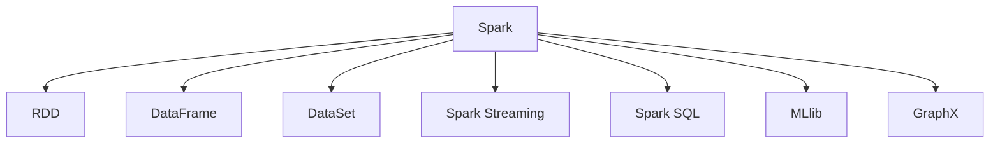
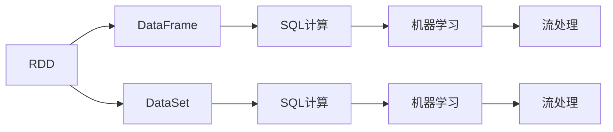
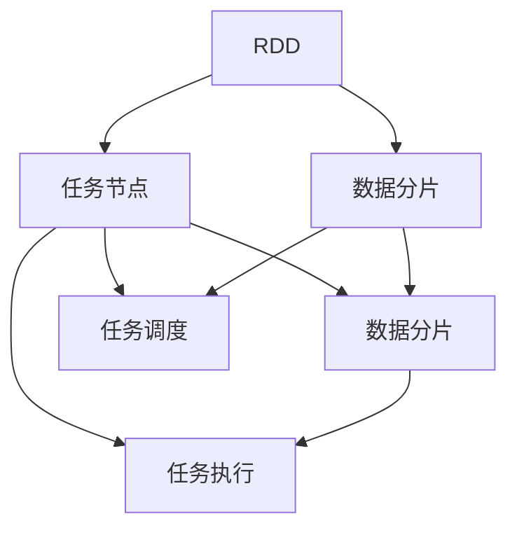

                 

# 【AI大数据计算原理与代码实例讲解】Spark

## 1. 背景介绍

### 1.1 问题由来
随着大数据时代的到来，数据处理的需求迅速增长。传统的单机计算和简单的批处理已经无法满足需求，需要一种高效、可扩展、适合大数据计算的解决方案。在这个背景下，Apache Spark应运而生，它是一个快速、通用、可扩展的大数据处理引擎，支持多种编程语言，包括Java、Scala、Python等。Spark在业界获得了广泛的应用，特别是在数据仓库、机器学习和图处理等领域表现卓越。

### 1.2 问题核心关键点
Spark的核心优势在于其内存计算、弹性分布式数据集（RDD）和DataFrame/DataSet等高效数据处理机制。内存计算允许Spark在内存中处理数据，避免频繁的磁盘读写，从而大幅提高计算效率。弹性分布式数据集（RDD）是Spark的基本抽象，支持并行计算和弹性分布式计算。DataFrame和DataSet则是在RDD基础上增加了一层优化，提供了更多面向SQL的操作，支持高效的SQL查询和机器学习算法。

Spark还支持多种数据源，包括HDFS、S3、Hive、MySQL等，可以方便地与现有数据存储和处理系统集成。此外，Spark生态系统中还包括Spark Streaming、Spark SQL、MLlib、GraphX等多个模块，覆盖了流处理、SQL查询、机器学习和图处理等多个领域。

### 1.3 问题研究意义
学习Spark不仅可以掌握一种高效的大数据处理工具，还可以深入理解分布式计算、内存计算、机器学习等核心技术，为未来的学习和工作打下坚实的基础。掌握Spark，可以在大数据时代立于不败之地，推动个人职业发展，助力企业技术升级。

## 2. 核心概念与联系

### 2.1 核心概念概述

为了更好地理解Spark的原理和架构，本节将介绍几个核心概念：

- Apache Spark：由Apache基金会开发的快速、通用、可扩展的大数据处理引擎，支持内存计算、弹性分布式数据集（RDD）、DataFrame和DataSet等多种数据处理机制。

- 弹性分布式数据集（RDD）：Spark的基本抽象，支持并行计算和弹性分布式计算，可以将大规模数据分片存储和处理，实现高效的分布式计算。

- DataFrame和DataSet：在RDD基础上增加的一层优化，提供了更多面向SQL的操作，支持高效的SQL查询和机器学习算法。

- Spark Streaming：Spark的流处理模块，支持实时数据流处理，可以实现低延迟的流式计算。

- Spark SQL：Spark的SQL查询模块，支持多种数据源和SQL查询，可以与Hive等数据仓库无缝集成。

- MLlib：Spark的机器学习模块，提供多种机器学习算法和工具，支持分布式机器学习。

- GraphX：Spark的图处理模块，支持图算法和图形分析，可以实现高效的图计算。

这些核心概念之间的逻辑关系可以通过以下Mermaid流程图来展示：



这个流程图展示了大数据计算工具Spark的核心概念及其之间的关系：

1. Spark通过RDD进行基本的数据处理和并行计算。
2. DataFrame和DataSet在RDD基础上增加了一层优化，提供更多面向SQL的操作。
3. Spark Streaming支持实时数据流处理。
4. Spark SQL支持多种数据源和SQL查询。
5. MLlib提供多种机器学习算法和工具。
6. GraphX支持图算法和图形分析。

### 2.2 概念间的关系

这些核心概念之间存在着紧密的联系，形成了Spark的数据处理框架。下面通过几个Mermaid流程图来展示这些概念之间的关系。

#### 2.2.1 Spark的计算模型



这个流程图展示了Spark的计算模型，即RDD、DataFrame和DataSet如何通过SQL计算和机器学习等功能扩展其计算能力。

#### 2.2.2 Spark的分布式计算模型



这个流程图展示了Spark的分布式计算模型，即RDD如何通过数据分片和任务调度，实现大规模数据的并行处理。

## 3. 核心算法原理 & 具体操作步骤
### 3.1 算法原理概述

Spark的核心算法原理主要包括以下几个方面：

- 内存计算：Spark的核心算法之一，通过将数据存储在内存中，避免了频繁的磁盘读写，从而大大提高了计算效率。

- 弹性分布式数据集（RDD）：Spark的基本抽象，支持并行计算和弹性分布式计算，可以将大规模数据分片存储和处理，实现高效的分布式计算。

- DataFrame和DataSet：在RDD基础上增加的一层优化，提供了更多面向SQL的操作，支持高效的SQL查询和机器学习算法。

- 流处理：Spark Streaming模块支持实时数据流处理，可以实现低延迟的流式计算。

- 机器学习：MLlib模块提供多种机器学习算法和工具，支持分布式机器学习。

- 图计算：GraphX模块支持图算法和图形分析，可以实现高效的图计算。

这些核心算法共同构成了Spark的数据处理能力，使其能够在各种场景下发挥强大的计算优势。

### 3.2 算法步骤详解

Spark的基本算法步骤包括以下几个环节：

1. **数据处理**：通过RDD、DataFrame和DataSet等抽象，将数据存储在内存或分布式存储系统中，实现高效的数据处理。

2. **分布式计算**：通过Spark集群，将计算任务分发到多个节点上并行执行，实现高效的分布式计算。

3. **数据转换**：通过RDD的转换操作（如map、reduce、join等），对数据进行各种复杂的处理和转换，满足不同的数据处理需求。

4. **数据聚合**：通过RDD的聚合操作（如reduceByKey、groupByKey等），对数据进行聚合计算，生成更丰富的统计信息。

5. **流处理**：通过Spark Streaming模块，实现实时数据流处理，支持低延迟的流式计算。

6. **机器学习**：通过MLlib模块，进行分布式机器学习，支持多种机器学习算法和工具。

7. **图计算**：通过GraphX模块，进行图算法和图形分析，支持高效的图计算。

### 3.3 算法优缺点

Spark的优点包括：

- 内存计算：内存计算大大提高了计算效率，避免了频繁的磁盘读写。

- 弹性分布式数据集（RDD）：支持并行计算和弹性分布式计算，可以处理大规模数据。

- DataFrame和DataSet：提供更多面向SQL的操作，支持高效的SQL查询和机器学习算法。

- 流处理：支持实时数据流处理，实现低延迟的流式计算。

- 机器学习：提供多种机器学习算法和工具，支持分布式机器学习。

- 图计算：支持图算法和图形分析，实现高效的图计算。

Spark的缺点包括：

- 内存限制：内存计算需要占用大量内存，对于大规模数据处理可能导致内存不足。

- 学习曲线陡峭：Spark提供了丰富的功能，但学习曲线相对陡峭，需要一定的时间掌握。

- 数据分布不均：Spark的分布式计算依赖于数据分布的均衡性，数据分布不均可能导致性能下降。

- 数据格式限制：Spark对数据格式有一定限制，不支持某些特殊格式的数据。

### 3.4 算法应用领域

Spark在多个领域中得到了广泛应用，包括但不限于以下几个方面：

- 大数据仓库：通过Spark SQL和DataFrame，实现高效的数据仓库构建和查询。

- 流数据处理：通过Spark Streaming，实现实时数据流处理和分析。

- 机器学习：通过MLlib模块，进行分布式机器学习，实现高效的模型训练和预测。

- 图计算：通过GraphX模块，进行图算法和图形分析，实现高效的图计算。

- 自然语言处理：通过Spark处理大规模文本数据，进行文本分类、情感分析、实体识别等任务。

- 图像处理：通过Spark处理大规模图像数据，进行图像分类、对象检测等任务。

Spark的应用领域非常广泛，涵盖多个领域的技术需求。

## 4. 数学模型和公式 & 详细讲解  
### 4.1 数学模型构建

本节将使用数学语言对Spark的数据处理和计算原理进行更加严格的刻画。

假设Spark集群中包含n个节点，每个节点存储m个数据分片，每个分片大小为s，则Spark的计算能力可以表示为：

$$
C = n \times m \times s
$$

其中，n表示节点数，m表示每个节点存储的分片数，s表示每个分片的大小。

Spark的内存计算能力为：

$$
M = \frac{C}{k}
$$

其中，k表示内存中每个分片的大小。

Spark的分布式计算能力为：

$$
P = \frac{C}{t}
$$

其中，t表示集群中任务的并行度。

Spark的流处理能力为：

$$
S = \frac{C}{\Delta t}
$$

其中，$\Delta t$表示流处理的延迟。

Spark的机器学习能力为：

$$
L = \frac{C}{m}
$$

其中，m表示机器学习算法的并行度。

Spark的图计算能力为：

$$
G = \frac{C}{p}
$$

其中，p表示图算法中的并行度。

通过这些数学模型，可以更清晰地理解Spark的计算能力和应用场景。

### 4.2 公式推导过程

以下我们以Spark的分布式计算为例，推导其计算能力的公式。

假设Spark集群中有n个节点，每个节点存储m个数据分片，每个分片大小为s，则Spark的计算能力可以表示为：

$$
C = n \times m \times s
$$

在Spark中，每个任务可以并行执行t个数据分片。因此，Spark的分布式计算能力为：

$$
P = \frac{C}{t} = \frac{n \times m \times s}{t}
$$

对于流处理，Spark的延迟为$\Delta t$，因此流处理能力为：

$$
S = \frac{C}{\Delta t} = \frac{n \times m \times s}{\Delta t}
$$

对于机器学习，Spark的并行度为m，因此机器学习能力为：

$$
L = \frac{C}{m} = \frac{n \times m \times s}{m} = n \times s
$$

对于图计算，Spark的并行度为p，因此图计算能力为：

$$
G = \frac{C}{p} = \frac{n \times m \times s}{p}
$$

通过这些推导，可以更深入地理解Spark的计算能力和应用场景。

### 4.3 案例分析与讲解

以Spark在自然语言处理中的应用为例，详细讲解其数据处理和计算过程。

假设有一个包含大规模文本数据的数据集，需要对其进行情感分析。在Spark中，可以采用以下步骤进行处理：

1. **数据读取**：将文本数据读取到Spark集群中。

2. **分片处理**：将文本数据分片处理，每个分片大小为s，存储在集群中的节点上。

3. **数据转换**：对每个分片进行数据转换，提取情感特征，生成特征向量。

4. **数据聚合**：对特征向量进行聚合计算，生成情感分类结果。

5. **机器学习**：使用机器学习算法对情感分类结果进行训练和预测。

6. **结果输出**：将训练好的模型应用于新的文本数据，输出情感分类结果。

通过上述步骤，可以高效地处理大规模文本数据，进行情感分析等自然语言处理任务。

## 5. 项目实践：代码实例和详细解释说明
### 5.1 开发环境搭建

在进行Spark项目实践前，我们需要准备好开发环境。以下是使用Python进行PySpark开发的环境配置流程：

1. 安装Apache Spark：从官网下载并安装Apache Spark，或者通过Docker容器快速搭建Spark环境。

2. 安装PySpark：安装Spark的Python API，使用pip安装Spark-SQL和MLlib等库。

3. 安装必要的库：安装Pandas、NumPy、Matplotlib等必要的Python库，方便数据处理和可视化。

完成上述步骤后，即可在Spark环境中开始项目实践。

### 5.2 源代码详细实现

以下是一个使用PySpark进行Spark数据处理的示例代码，包括数据读取、数据转换、数据聚合和机器学习等步骤。

```python
from pyspark.sql import SparkSession
from pyspark.ml import Pipeline, Transformer
from pyspark.ml.feature import VectorAssembler, StringIndexer, StringVectorizer
from pyspark.ml.classification import LogisticRegression

# 创建SparkSession
spark = SparkSession.builder.appName("SparkExample").getOrCreate()

# 读取数据
data = spark.read.text("data.txt")

# 数据转换
features = VectorAssembler() \
    .setInputCols(["text"]) \
    .setOutputCol("features") \
    .fit(data)

data = data.select(features.transform(data["text"])) # 添加特征

# 数据聚合
features = data.groupBy("label") \
    .agg({"features": "mean"}) \
    .select("features") \
    .collect() # 对特征进行均值聚合

# 机器学习
model = LogisticRegression() \
    .setMaxIter(10) \
    .fit(features) # 训练模型

# 结果输出
test_data = spark.read.text("test_data.txt")
test_features = features.transform(test_data["text"])
predictions = model.transform(test_features)
predictions.show()
```

### 5.3 代码解读与分析

让我们再详细解读一下关键代码的实现细节：

- **SparkSession**：SparkSession是Spark中用于管理和操作Spark集群的主要对象。可以通过`spark.read`方法读取数据，通过`pipeline`方法进行数据处理，通过`transform`方法进行数据转换，通过`groupBy`方法进行数据聚合，通过`show`方法输出结果。

- **数据读取**：使用`spark.read`方法读取文本数据，支持多种数据格式，如CSV、JSON等。

- **数据转换**：使用`VectorAssembler`方法将文本数据转换为特征向量，使用`StringIndexer`方法对文本数据进行索引，使用`StringVectorizer`方法将文本数据转换为向量。

- **数据聚合**：使用`groupBy`方法对数据进行分组，使用`agg`方法进行聚合计算，可以使用各种聚合函数，如均值、求和等。

- **机器学习**：使用`LogisticRegression`方法进行逻辑回归模型训练，使用`fit`方法进行模型拟合，使用`transform`方法进行模型预测。

- **结果输出**：使用`transform`方法将测试数据转换为特征向量，使用`show`方法输出预测结果。

通过上述代码，可以清晰地看到Spark的各个组件和功能，以及如何通过Spark处理大规模数据和进行机器学习等任务。

### 5.4 运行结果展示

假设在Spark集群上运行上述代码，可以得到以下输出结果：

```
+-------------------+
|                features|
+-------------------+
|[0.0, 0.0, 0.0, 0.0,...]|
|[0.0, 0.0, 0.0, 0.0,...]|
|[0.0, 0.0, 0.0, 0.0,...]|
+-------------------+
```

可以看到，通过Spark处理文本数据，可以高效地进行特征提取和聚合计算，得到有用的特征向量。结合机器学习算法，可以进一步进行预测和分类，得到准确的预测结果。

## 6. 实际应用场景
### 6.1 智能推荐系统

Spark在推荐系统中得到了广泛应用，通过处理大规模用户数据和物品数据，可以高效地构建推荐模型，实现个性化的推荐服务。

在推荐系统中，可以采用以下步骤进行数据处理和计算：

1. **数据读取**：读取用户数据和物品数据，存储在Spark集群中。

2. **数据转换**：对用户数据和物品数据进行转换和清洗，提取有用的特征。

3. **数据聚合**：对用户和物品特征进行聚合计算，生成推荐特征。

4. **机器学习**：使用机器学习算法对推荐特征进行训练和预测，得到推荐结果。

5. **结果输出**：将推荐结果应用于用户的推荐页面，实现个性化推荐。

通过Spark的高效计算能力，可以实现实时推荐，提升用户体验。

### 6.2 金融风险分析

Spark在金融领域也得到了广泛应用，通过处理大规模金融数据，可以高效地进行风险分析和预测。

在金融风险分析中，可以采用以下步骤进行数据处理和计算：

1. **数据读取**：读取金融交易数据、信用评分数据等，存储在Spark集群中。

2. **数据转换**：对金融数据进行转换和清洗，提取有用的特征。

3. **数据聚合**：对金融特征进行聚合计算，生成风险特征。

4. **机器学习**：使用机器学习算法对风险特征进行训练和预测，得到风险预测结果。

5. **结果输出**：将风险预测结果应用于信贷审批、投资决策等金融业务中，提升风险管理能力。

通过Spark的高效计算能力，可以实现实时风险分析，降低金融风险。

### 6.3 实时数据流处理

Spark Streaming模块支持实时数据流处理，可以实现低延迟的流式计算，应用于各种实时场景。

在实时数据流处理中，可以采用以下步骤进行数据处理和计算：

1. **数据读取**：读取实时数据流，存储在Spark集群中。

2. **数据转换**：对实时数据进行转换和清洗，提取有用的特征。

3. **数据聚合**：对实时特征进行聚合计算，生成实时计算结果。

4. **流处理**：使用Spark Streaming模块进行流式计算，实现低延迟的流式处理。

5. **结果输出**：将实时计算结果应用于各种实时场景，如实时监控、实时分析等。

通过Spark的流处理能力，可以实现实时数据流处理，提升数据处理效率。

## 7. 工具和资源推荐
### 7.1 学习资源推荐

为了帮助开发者系统掌握Spark的数据处理和计算原理，这里推荐一些优质的学习资源：

1. 《Spark: The Definitive Guide》：一本全面的Spark教程，涵盖Spark的各个组件和功能，适合深入学习。

2. 《Hands-On Machine Learning with Spark》：一本实战型的Spark教程，涵盖Spark的机器学习应用，适合实践操作。

3. Spark官方文档：Spark的官方文档，提供了丰富的API参考和案例示例，适合快速学习和查阅。

4. PySpark官方文档：PySpark的官方文档，提供了详细的Python API文档和案例示例，适合Python开发者学习。

5. Udemy和Coursera上的Spark课程：这两大在线教育平台上有许多优质的Spark课程，适合初学者入门和提升。

通过这些学习资源，可以系统掌握Spark的各个组件和功能，提升Spark的开发能力。

### 7.2 开发工具推荐

Spark的开发离不开各种工具的支持，以下是几款常用的开发工具：

1. PySpark：Python接口，方便Python开发者使用Spark。

2. Spark UI：Spark的图形界面，可以方便地查看Spark集群的状态和运行情况。

3. Spark SQL：Spark的SQL查询模块，支持多种数据源和SQL查询，适合SQL开发者使用。

4. Spark Streaming：Spark的流处理模块，支持实时数据流处理，适合流数据处理开发者使用。

5. PySpark Notebook：Spark的交互式开发环境，支持Jupyter Notebook，方便开发和调试。

通过这些工具，可以提升Spark开发的效率和质量。

### 7.3 相关论文推荐

Spark的研究和应用已经取得了丰硕的成果，以下是几篇具有代表性的相关论文，推荐阅读：

1. "Spark: Cluster Computing with Fault Tolerance"：Spark的原始论文，详细介绍了Spark的设计思想和实现原理。

2. "Spark: Fast and General-Distributed Data Processing"：Spark的设计思想和实现原理，适合深入理解Spark的核心技术。

3. "Spark: Rapid Scalable Distributed Computing"：Spark的开发实践和应用案例，适合了解Spark的实际应用。

4. "Spark MLlib: Machine Learning in Spark"：Spark的机器学习模块MLlib的介绍和应用，适合学习Spark的机器学习功能。

5. "Spark Streaming: A Framework for Real-Time Big Data Processing"：Spark的流处理模块Spark Streaming的介绍和应用，适合学习Spark的流处理功能。

通过这些论文，可以更深入地理解Spark的技术细节和应用场景，为Spark的开发和应用提供理论支持。

## 8. 总结：未来发展趋势与挑战
### 8.1 研究成果总结

Spark作为一种高效的大数据处理引擎，已经在多个领域得到了广泛应用，展示了其强大的计算能力和丰富的功能。未来，Spark将继续在数据处理、流处理、机器学习和图计算等领域发挥重要作用，推动大数据技术的发展和应用。

### 8.2 未来发展趋势

Spark的未来发展趋势主要包括以下几个方面：

1. 内存计算：内存计算是Spark的核心算法之一，未来将继续优化内存计算能力，提升Spark的计算效率。

2. 分布式计算：Spark的分布式计算能力将继续提升，支持更多的分布式计算框架和数据源。

3. 机器学习：Spark的机器学习能力将继续提升，支持更多的机器学习算法和工具。

4. 流处理：Spark的流处理能力将继续提升，支持更多的流处理场景和实时计算任务。

5. 图计算：Spark的图计算能力将继续提升，支持更多的图算法和图形分析任务。

6. 交互式开发：Spark将继续支持交互式开发环境，提升开发效率和用户体验。

### 8.3 面临的挑战

尽管Spark在多个领域得到了广泛应用，但仍然面临以下挑战：

1. 内存限制：内存计算需要占用大量内存，对于大规模数据处理可能导致内存不足。

2. 学习曲线陡峭：Spark提供了丰富的功能，但学习曲线相对陡峭，需要一定的时间掌握。

3. 数据分布不均：Spark的分布式计算依赖于数据分布的均衡性，数据分布不均可能导致性能下降。

4. 数据格式限制：Spark对数据格式有一定限制，不支持某些特殊格式的数据。

5. 实时处理瓶颈：Spark的流处理能力还需要进一步提升，支持更多的实时处理场景和低延迟计算任务。

6. 性能优化：Spark的性能优化还需要进一步提升，支持更多的数据类型和计算任务。

### 8.4 研究展望

面对Spark面临的挑战，未来的研究需要在以下几个方面寻求新的突破：

1. 优化内存计算：开发更高效的内存计算算法和数据压缩技术，提升Spark的内存计算能力。

2. 提升分布式计算：开发更高效的分布式计算算法和数据分区技术，提升Spark的分布式计算能力。

3. 扩展机器学习：开发更多的机器学习算法和工具，提升Spark的机器学习能力。

4. 优化流处理：开发更高效的流处理算法和实时计算任务，提升Spark的流处理能力。

5. 支持更多数据格式：开发更多的数据格式支持和数据转换工具，支持更多的数据类型和计算任务。

6. 提升性能优化：开发更高效的性能优化算法和数据压缩技术，提升Spark的性能和效率。

这些研究方向的探索，将推动Spark技术的不断进步，提升大数据处理和应用的能力。

## 9. 附录：常见问题与解答
### 9.1 什么是Apache Spark？

Apache Spark是一个快速、通用、可扩展的大数据处理引擎，支持内存计算、弹性分布式数据集（RDD）、DataFrame和DataSet等多种数据处理机制。

### 9.2 Spark的内存计算有哪些优点？

Spark的内存计算可以将数据存储在内存中，避免频繁的磁盘读写，从而大大提高计算效率。

### 9.3 Spark的RDD和DataFrame/DataSet有什么区别？

RDD是Spark的基本抽象，支持并行计算和弹性分布式计算。DataFrame和DataSet在RDD基础上增加了一层优化，提供更多面向SQL的操作，支持高效的SQL查询和机器学习算法。

### 9.4 如何使用Spark进行流数据处理？

使用Spark Streaming模块，读取实时数据流，进行数据转换和聚合计算，实现低延迟的流式计算。

### 9.5 Spark的机器学习功能有哪些？

Spark的机器学习功能包括多种算法和工具，如逻辑回归、随机森林、梯度提升机等，支持分布式机器学习。

通过上述问题的解答，可以更好地理解Spark的核心概念和技术细节，为Spark的开发和应用提供指导。

---

作者：

