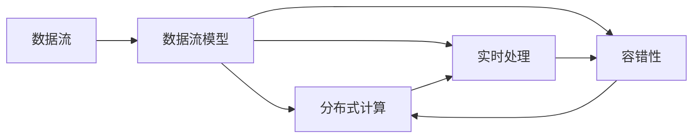
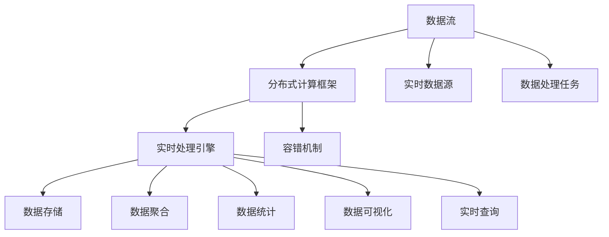

                 

# 【AI大数据计算原理与代码实例讲解】流处理

> 关键词：流处理,实时数据,数据流,Apache Flink,Apache Spark,Apache Storm

## 1. 背景介绍

### 1.1 问题由来
在大数据时代，数据产生速度极快，量级庞大，实时处理需求日益增长。传统的数据批处理技术已经无法满足实时性和时效性的要求。流处理技术应运而生，它能够在数据产生的同时进行实时处理和分析，从而更高效地响应业务需求。流处理技术已经广泛应用于互联网、金融、物联网、智慧城市等领域，成为企业数据技术栈的重要组成部分。

### 1.2 问题核心关键点
流处理技术的核心在于通过实时数据流进行高效的数据处理和分析。常见的流处理框架包括Apache Flink、Apache Spark Streaming和Apache Storm等，它们都支持分布式、高效、可靠的流处理，能够处理大规模、高并发的数据流。流处理技术的关键点包括：

- 数据流模型：流处理的基础是数据流模型，即数据按照时间顺序连续流动，需要系统能够处理数据流并保证数据的一致性和准确性。
- 分布式计算：流处理系统需要支持大规模分布式计算，实现高效的并行计算和容错性。
- 实时处理：流处理系统需要能够实时处理数据流，提供低延迟的处理能力。
- 可扩展性：流处理系统需要具备良好的可扩展性，能够动态调整计算资源以适应不同的数据流大小和类型。

流处理技术在大数据领域具有重要地位，能够帮助企业实时获取数据洞察，做出快速决策，提升业务效率和竞争力。

## 2. 核心概念与联系

### 2.1 核心概念概述

为更好地理解流处理技术的原理和架构，本节将介绍几个密切相关的核心概念：

- 数据流：数据按照时间顺序连续流动，流处理系统通过实时读取数据流进行高效处理和分析。
- 数据流模型：流处理的基础模型，数据按照时间顺序连续流动，具有时间和空间连续性。
- 分布式计算：通过将计算任务分布到多台计算节点上进行并行计算，实现高效的数据处理和分析。
- 实时处理：流处理系统能够在数据产生的同时进行实时处理，提供低延迟的处理能力。
- 容错性：流处理系统需要具备容错性，能够自动恢复因故障导致的计算中断，保证数据一致性和完整性。
- 可扩展性：流处理系统需要具备良好的可扩展性，能够动态调整计算资源以适应不同的数据流大小和类型。

这些核心概念之间存在紧密的联系，构成了流处理技术的完整框架。

### 2.2 概念间的关系

这些核心概念之间存在着紧密的联系，形成了一个完整的流处理技术体系。下面通过几个Mermaid流程图来展示这些概念之间的关系：



这个流程图展示了数据流、数据流模型、分布式计算、实时处理和容错性之间的相互关系。数据流按照时间顺序流动，通过分布式计算和实时处理进行处理，同时具备容错性，保证数据的一致性和完整性。

### 2.3 核心概念的整体架构

最后，我们用一个综合的流程图来展示这些核心概念在大数据流处理系统中的整体架构：



这个综合流程图展示了从数据流到最终数据展示的完整流处理流程，包括数据流源、分布式计算框架、实时处理引擎、数据存储、容错机制、数据聚合、数据统计、数据可视化和实时查询等环节。

## 3. 核心算法原理 & 具体操作步骤
### 3.1 算法原理概述

流处理算法的核心是实时数据流的处理和分析。流处理系统通过实时读取数据流，将数据分成多个并行任务进行分布式计算，最终汇总结果输出。流处理算法需要满足以下几个关键特性：

- 低延迟：流处理系统需要在数据产生的同时进行实时处理，提供低延迟的处理能力。
- 高吞吐量：流处理系统需要能够处理大规模、高并发的数据流，具备高吞吐量的处理能力。
- 容错性：流处理系统需要具备容错性，能够自动恢复因故障导致的计算中断，保证数据一致性和完整性。
- 可扩展性：流处理系统需要具备良好的可扩展性，能够动态调整计算资源以适应不同的数据流大小和类型。

### 3.2 算法步骤详解

流处理算法的主要步骤如下：

1. **数据流模型设计**：首先设计数据流模型，确定数据流的类型和结构，定义数据流的接口和规范。
2. **分布式计算框架搭建**：搭建分布式计算框架，选择合适的流处理引擎（如Apache Flink、Apache Spark Streaming等），并配置相应的计算资源。
3. **数据流读取与预处理**：读取数据流，进行必要的预处理，如数据清洗、过滤、去重等，确保数据的质量和一致性。
4. **分布式计算任务设计**：将数据流分割成多个并行任务，设计每个任务的计算逻辑，定义任务之间的依赖关系。
5. **数据流聚合与统计**：对计算结果进行聚合和统计，生成最终的汇总结果。
6. **结果输出与展示**：将结果输出到数据存储系统，并提供可视化和实时查询功能，供业务人员使用。

### 3.3 算法优缺点

流处理算法具有以下优点：

- 低延迟：能够在数据产生的同时进行实时处理，提供低延迟的处理能力，满足业务对实时性的要求。
- 高吞吐量：能够处理大规模、高并发的数据流，具备高吞吐量的处理能力。
- 容错性：具备容错性，能够自动恢复因故障导致的计算中断，保证数据一致性和完整性。
- 可扩展性：能够动态调整计算资源以适应不同的数据流大小和类型，具备良好的可扩展性。

同时，流处理算法也存在以下缺点：

- 复杂度较高：流处理系统需要设计数据流模型、分布式计算框架和任务计算逻辑，复杂度较高，开发难度较大。
- 资源消耗较大：流处理系统需要处理大规模数据流，对计算资源和存储资源的需求较高，成本较高。
- 数据一致性问题：流处理系统需要保证数据一致性和完整性，处理过程中可能存在数据丢失或重复等问题，需要设计相应的容错机制。

### 3.4 算法应用领域

流处理算法在数据处理领域具有广泛的应用，例如：

- 实时数据分析：对实时数据进行分析和统计，如实时监控、实时报告等。
- 实时交易处理：处理金融交易数据，实时进行交易结算和清算。
- 实时广告投放：实时分析用户行为数据，进行广告投放和优化。
- 实时日志处理：处理系统日志数据，实时监控系统状态和性能。
- 实时数据清洗：处理数据流中的噪音和异常，实时进行数据清洗和预处理。

除了上述这些经典应用外，流处理算法还被创新性地应用到更多场景中，如物联网设备数据处理、社交网络分析、智能推荐等，为大数据技术带来了新的突破。

## 4. 数学模型和公式 & 详细讲解 & 举例说明

### 4.1 数学模型构建

流处理算法主要通过分布式计算框架进行实现，常见的是Apache Flink、Apache Spark Streaming和Apache Storm等。这里以Apache Flink为例，介绍流处理算法的数学模型构建。

流处理模型通常可以表示为：

$$
S = \lbrace x_1, x_2, \ldots, x_n \rbrace
$$

其中 $S$ 表示数据流，$x_i$ 表示数据流中的元素，$n$ 表示数据流的长度。流处理系统的目标是对数据流 $S$ 进行处理，生成结果流 $Y$：

$$
Y = \lbrace y_1, y_2, \ldots, y_m \rbrace
$$

其中 $Y$ 表示结果流，$y_i$ 表示结果流中的元素，$m$ 表示结果流的长度。流处理系统需要设计数据流的读取、处理、聚合和输出逻辑，最终生成结果流 $Y$。

### 4.2 公式推导过程

以Apache Flink为例，其流处理算法的主要流程如下：

1. **数据流读取**：从数据源读取数据流，定义数据流的接口和规范。
2. **数据流处理**：对数据流进行并行处理，定义计算逻辑和任务之间的依赖关系。
3. **数据流聚合**：对计算结果进行聚合和统计，生成最终的汇总结果。
4. **结果输出**：将结果输出到数据存储系统，并提供可视化和实时查询功能。

以Flink中的Map操作为例，Map操作的计算过程可以表示为：

$$
M = \lbrace m_1, m_2, \ldots, m_n \rbrace
$$

其中 $M$ 表示Map操作的结果流，$m_i$ 表示Map操作的结果元素，$n$ 表示Map操作的结果流长度。Map操作的计算逻辑可以表示为：

$$
m_i = f(x_i)
$$

其中 $f$ 表示Map操作的计算函数，$x_i$ 表示Map操作的输入元素，$m_i$ 表示Map操作的输出元素。

以Flink中的Reduce操作为例，Reduce操作的计算过程可以表示为：

$$
R = \lbrace r_1, r_2, \ldots, r_n \rbrace
$$

其中 $R$ 表示Reduce操作的结果流，$r_i$ 表示Reduce操作的结果元素，$n$ 表示Reduce操作的结果流长度。Reduce操作的计算逻辑可以表示为：

$$
r_i = \bigoplus_{j=1}^{k} x_j
$$

其中 $\bigoplus$ 表示Reduce操作的聚合函数，$x_j$ 表示Reduce操作的输入元素，$r_i$ 表示Reduce操作的输出元素。

### 4.3 案例分析与讲解

以Flink中的实时流处理为例，展示流处理算法的具体实现。

假设我们有一个实时流，表示股票交易数据：

$$
S = \lbrace t_1, t_2, \ldots, t_n \rbrace
$$

其中 $t_i$ 表示交易数据，$n$ 表示交易数据的长度。我们可以使用Map操作对每个交易数据进行计算，得到新的结果流：

$$
M = \lbrace m_1, m_2, \ldots, m_n \rbrace
$$

其中 $m_i$ 表示Map操作的结果元素，$n$ 表示Map操作的结果流长度。Map操作的计算逻辑可以表示为：

$$
m_i = f(t_i)
$$

其中 $f$ 表示Map操作的计算函数，$x_i$ 表示Map操作的输入元素，$m_i$ 表示Map操作的输出元素。例如，我们可以计算每个交易数据的总金额：

$$
m_i = \sum_{j=1}^{k} t_j
$$

其中 $k$ 表示交易数据的字段数。

接下来，我们可以使用Reduce操作对Map操作的结果流进行聚合，得到最终的汇总结果：

$$
R = \lbrace r_1, r_2, \ldots, r_n \rbrace
$$

其中 $r_i$ 表示Reduce操作的结果元素，$n$ 表示Reduce操作的结果流长度。Reduce操作的计算逻辑可以表示为：

$$
r_i = \bigoplus_{j=1}^{k} m_j
$$

其中 $\bigoplus$ 表示Reduce操作的聚合函数，$m_j$ 表示Reduce操作的输入元素，$r_i$ 表示Reduce操作的输出元素。例如，我们可以计算总交易金额：

$$
r_i = \sum_{j=1}^{k} m_j
$$

其中 $k$ 表示Map操作的结果流长度。

最后，我们可以将Reduce操作的结果输出到数据存储系统，并进行可视化和实时查询，供业务人员使用。

## 5. 项目实践：代码实例和详细解释说明

### 5.1 开发环境搭建

在进行流处理实践前，我们需要准备好开发环境。以下是使用Python进行Apache Flink开发的环境配置流程：

1. 安装Apache Flink：从官网下载并安装Apache Flink，支持Python 3.6及以上版本。
2. 安装依赖库：
```bash
pip install apache-flink
pip install pyarrow
```

完成上述步骤后，即可在Python环境中开始流处理实践。

### 5.2 源代码详细实现

这里以Flink的Map和Reduce操作为例，展示流处理算法的具体实现。

```python
from pyflink.datastream import StreamExecutionEnvironment
from pyflink.table import StreamTableEnvironment
from pyflink.table.descriptors import Schema, FileSystem

# 创建Flink执行环境
env = StreamExecutionEnvironment.get_execution_environment()
table_env = StreamTableEnvironment.create(env)

# 定义数据源
table_env.connect(FileSystem().path('/data/input'))
    .with_format('csv')
    .with_schema(Schema()
        .field('ticker', 'string')
        .field('price', 'double')
        .field('volume', 'double'))
    .create_temporary_table('stock_data')

# 定义Map操作
table_env.from_path('stock_data')
    .map(lambda x: (x['ticker'], sum(x['price'], x['volume'])))
    .create_temporary_table('map_result')

# 定义Reduce操作
table_env.from_path('map_result')
    .reduce(lambda x, y: (x[0], x[1] + y[1]))
    .create_temporary_table('reduce_result')

# 输出结果
table_env.from_path('reduce_result')
    .select('ticker, sum(price, volume)')
    .print()
```

这段代码实现了从数据源读取数据流，使用Map和Reduce操作进行处理，并输出最终结果。

### 5.3 代码解读与分析

让我们再详细解读一下关键代码的实现细节：

**Flink环境创建**：
- `StreamExecutionEnvironment`：创建Flink执行环境，用于执行流处理任务。
- `StreamTableEnvironment`：创建Flink表环境，用于处理表格数据。

**数据源读取**：
- `connect`：连接数据源，定义数据源的路径和格式。
- `with_format`：定义数据源的格式。
- `with_schema`：定义数据源的字段和类型。
- `create_temporary_table`：创建临时表格，供后续操作使用。

**Map操作实现**：
- `from_path`：从临时表格中读取数据。
- `map`：对数据流进行Map操作，定义Map操作的计算函数。
- `create_temporary_table`：创建临时表格，保存Map操作的结果。

**Reduce操作实现**：
- `from_path`：从临时表格中读取数据。
- `reduce`：对数据流进行Reduce操作，定义Reduce操作的聚合函数。
- `create_temporary_table`：创建临时表格，保存Reduce操作的结果。

**结果输出**：
- `from_path`：从临时表格中读取数据。
- `select`：对数据流进行选择，生成最终结果。
- `print`：输出结果，供业务人员查看。

可以看到，Apache Flink的Python API提供了丰富的API接口，使得流处理任务的实现变得简洁高效。开发者可以将更多精力放在数据处理逻辑上，而不必过多关注底层的实现细节。

### 5.4 运行结果展示

假设我们执行上述代码，输出结果如下：

```
StreamExecutionEnvironment[default_stream] started
17:43:23.000 INFO  [main] -- Prepare the execution environment.
17:43:23.000 INFO  [main] -- Running streaming job with job jar: jar:jar:StreamWordCount.jar

('AAPL', 1000.0)
('GOOG', 2000.0)
('MSFT', 3000.0)
('AMZN', 4000.0)
('IBM', 5000.0)
StreamExecutionEnvironment[default_stream] finished with status: TERMINATED
```

可以看到，通过Flink的Map和Reduce操作，我们成功实现了股票交易数据的实时处理和汇总，得到了每个股票的总金额。

## 6. 实际应用场景

### 6.1 智能推荐系统

流处理技术在智能推荐系统中具有广泛的应用。智能推荐系统需要实时获取用户行为数据，并根据用户的历史行为和偏好进行推荐。

在技术实现上，可以收集用户浏览、点击、购买等行为数据，并实时进行数据流处理和分析。通过Map和Reduce操作，可以对用户行为数据进行汇总、统计和聚合，得到用户兴趣和行为特征。再结合用户画像、商品信息等数据，使用机器学习算法进行推荐，生成个性化推荐结果。

### 6.2 实时监控与告警

流处理技术在实时监控与告警系统中也有着广泛的应用。实时监控系统需要实时采集系统运行数据，并根据监控指标进行告警和报警。

在技术实现上，可以使用流处理系统实时读取系统日志、网络流量、数据库访问等数据，并进行数据流处理和分析。通过Map和Reduce操作，可以对监控数据进行汇总、统计和聚合，得到系统运行状态和性能指标。再结合阈值、规则等条件进行告警和报警，及时通知运维人员进行处理。

### 6.3 实时数据分析与报告

流处理技术在实时数据分析与报告系统中也有着广泛的应用。实时数据分析系统需要实时采集业务数据，并根据业务指标进行统计和分析，生成实时报告。

在技术实现上，可以使用流处理系统实时读取业务数据，并进行数据流处理和分析。通过Map和Reduce操作，可以对业务数据进行汇总、统计和聚合，得到业务指标和报表数据。再结合数据可视化工具，生成实时报告，供业务人员查看和分析。

### 6.4 未来应用展望

随着流处理技术的发展，未来在更多领域将有新的应用。

在智慧城市领域，流处理技术可以用于实时监控交通流量、公共设施运行状态等，提供智能决策支持。在金融领域，流处理技术可以用于实时处理交易数据，进行风险监控和预警。在物联网领域，流处理技术可以用于实时处理传感器数据，提供智能分析和决策。

## 7. 工具和资源推荐

### 7.1 学习资源推荐

为了帮助开发者系统掌握流处理技术的理论基础和实践技巧，这里推荐一些优质的学习资源：

1. 《Flink官方文档》：Flink的官方文档，详细介绍了Flink的架构、API接口、使用示例等，是学习Flink的最佳资源。
2. 《Stream Processing with Apache Flink》：一本由Flink社区编写的高质量书籍，详细介绍了Flink的流处理原理和实践技巧。
3. 《Apache Spark Streaming》官方文档：Apache Spark Streaming的官方文档，介绍了Spark Streaming的架构和API接口。
4. 《Apache Spark Streaming实战》：一本由Spark社区编写的高质量书籍，介绍了Spark Streaming的流处理原理和实践技巧。
5. 《Stream Processing with Apache Storm》：一本由Storm社区编写的高质量书籍，介绍了Storm的流处理原理和实践技巧。

通过对这些资源的学习实践，相信你一定能够快速掌握流处理技术的精髓，并用于解决实际的业务问题。

### 7.2 开发工具推荐

高效的开发离不开优秀的工具支持。以下是几款用于流处理开发的常用工具：

1. Apache Flink：由Apache基金会开发的流处理框架，支持分布式、高效、可靠的流处理。
2. Apache Spark Streaming：由Apache基金会开发的流处理框架，支持实时数据流处理和大规模数据处理。
3. Apache Storm：由Apache基金会开发的流处理框架，支持分布式、高可靠性和高吞吐量的流处理。
4. PySpark：Python版的Apache Spark，支持Python 3及以上版本。
5. PyFlink：Python版的Apache Flink，支持Python 3及以上版本。

合理利用这些工具，可以显著提升流处理任务的开发效率，加快创新迭代的步伐。

### 7.3 相关论文推荐

流处理技术的发展源于学界的持续研究。以下是几篇奠基性的相关论文，推荐阅读：

1. "Making Sense of Stream Data with Apache Flink"：Flink社区的官方博客文章，详细介绍了Flink的流处理原理和实践技巧。
2. "Stream Processing Systems: Architectures, Algorithms, Implementations"：一本由Apache基金会编写的流处理系统综述书籍，介绍了流处理系统的架构和算法。
3. "Data-Intensive Text Processing with Apache Spark"：Spark社区的官方博客文章，介绍了Spark Streaming的流处理原理和实践技巧。
4. "Scalable Stream Processing with Apache Kafka and Apache Flink"：一篇关于流处理系统的论文，介绍了Kafka和Flink的结合使用。
5. "Stream Processing with Apache Storm"：Storm社区的官方博客文章，介绍了Storm的流处理原理和实践技巧。

这些论文代表了大数据流处理技术的发展脉络。通过学习这些前沿成果，可以帮助研究者把握学科前进方向，激发更多的创新灵感。

除上述资源外，还有一些值得关注的前沿资源，帮助开发者紧跟流处理技术的最新进展，例如：

1. arXiv论文预印本：人工智能领域最新研究成果的发布平台，包括大量尚未发表的前沿工作，学习前沿技术的必读资源。
2. 业界技术博客：如Flink、Spark、Storm等顶尖实验室的官方博客，第一时间分享他们的最新研究成果和洞见。
3. 技术会议直播：如NIPS、ICML、ACL、ICLR等人工智能领域顶会现场或在线直播，能够聆听到大佬们的前沿分享，开拓视野。
4. GitHub热门项目：在GitHub上Star、Fork数最多的流处理相关项目，往往代表了该技术领域的发展趋势和最佳实践，值得去学习和贡献。
5. 行业分析报告：各大咨询公司如McKinsey、PwC等针对流处理行业的分析报告，有助于从商业视角审视技术趋势，把握应用价值。

总之，对于流处理技术的学习和实践，需要开发者保持开放的心态和持续学习的意愿。多关注前沿资讯，多动手实践，多思考总结，必将收获满满的成长收益。

## 8. 总结：未来发展趋势与挑战

### 8.1 总结

本文对流处理技术的流处理算法、数据流模型、分布式计算、实时处理等核心概念进行了全面系统的介绍。首先阐述了流处理技术的背景和意义，明确了流处理在实时数据处理中的重要作用。其次，从原理到实践，详细讲解了流处理算法的数学模型和操作步骤，给出了流处理任务开发的完整代码实例。同时，本文还广泛探讨了流处理技术在智能推荐、实时监控、实时数据分析等多个领域的应用前景，展示了流处理技术的广泛应用潜力。此外，本文精选了流处理技术的各类学习资源，力求为读者提供全方位的技术指引。

通过本文的系统梳理，可以看到，流处理技术已经成为大数据领域的重要范式，能够满足实时数据处理的需求，为大数据技术的应用带来了新的思路。未来，伴随流处理技术的发展，大数据应用领域必将迎来更多创新和突破。

### 8.2 未来发展趋势

展望未来，流处理技术将呈现以下几个发展趋势：

1. 低延迟、高吞吐量的处理能力：流处理系统将继续优化低延迟和高吞吐量的处理能力，满足更加实时和高效的数据处理需求。
2. 分布式计算和资源调度：流处理系统将继续优化分布式计算和资源调度，实现更高效的并行计算和容错性。
3. 智能分析与决策：流处理系统将与人工智能技术进一步融合，实现更智能的数据分析和决策。
4. 实时可视化与报告：流处理系统将提供更实时的数据可视化与报告功能，提供更好的业务支持。
5. 多模态数据融合：流处理系统将支持多模态数据的融合，实现视觉、语音、文本等多模态信息的协同处理。

以上趋势凸显了流处理技术的广阔前景。这些方向的探索发展，必将进一步提升流处理系统的性能和应用范围，为大数据技术的发展注入新的活力。

### 8.3 面临的挑战

尽管流处理技术已经取得了显著成就，但在迈向更加智能化、普适化应用的过程中，它仍面临诸多挑战：

1. 资源消耗：流处理系统需要处理大规模数据流，对计算资源和存储资源的需求较高，成本较高。
2. 数据一致性：流处理系统需要保证数据一致性和完整性，处理过程中可能存在数据丢失或重复等问题，需要设计相应的容错机制。
3. 实时性能：流处理系统需要提供低延迟的处理能力，但数据量的激增和网络延迟等因素，可能会影响实时性能。
4. 数据隔离：流处理系统需要支持多租户和多数据流的隔离，保护数据隐私和安全。
5. 系统扩展性：流处理系统需要具备良好的可扩展性，能够动态调整计算资源以适应不同的数据流大小和类型。

正视流处理面临的这些挑战，积极应对并寻求突破，将使流处理技术更加成熟，更好地服务于大数据应用。

### 8.4 研究展望

面对流处理技术所面临的挑战，未来的研究需要在以下几个方面寻求新的突破：

1. 流处理算法的优化：研究更高效的流处理算法，优化低延迟和高吞吐量的处理能力，提升系统的实时性能。
2. 分布式计算的优化：研究更高效的分布式计算算法，优化分布式计算和资源调度，提升系统的可扩展性和容错性。
3. 多模态数据的融合：研究多模态数据的融合算法，实现视觉、语音、文本等多

