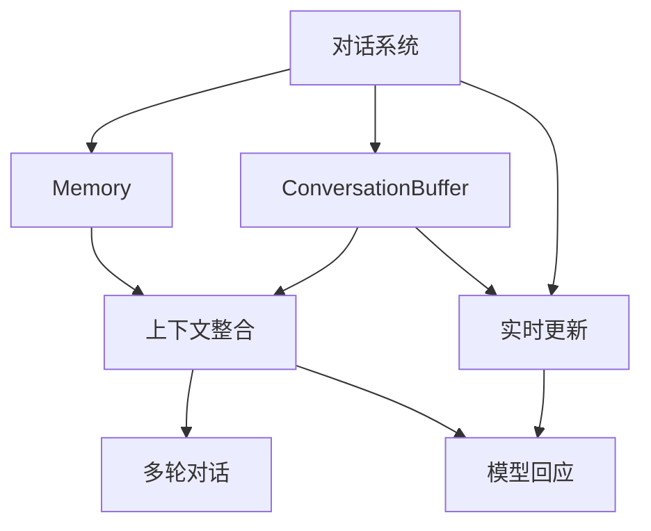
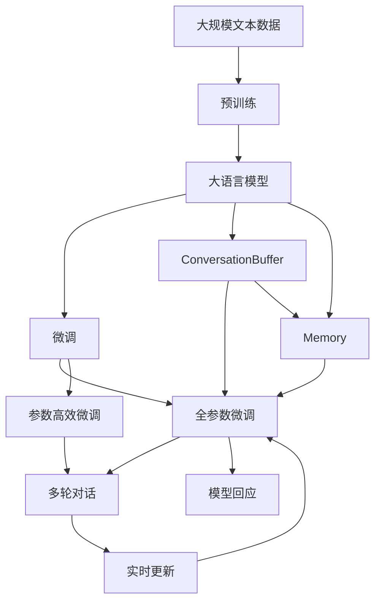

                 

# 【LangChain编程：从入门到实践】ConversationBufferMemory

> 关键词：LangChain, ConversationBuffer, Memory, 对话系统, 多轮对话, 数据存储, 模型训练, 交互界面

## 1. 背景介绍

在自然语言处理（NLP）领域，构建能够进行多轮对话的对话系统是一个重要且具有挑战性的任务。当前，大多数对话系统依赖于固定的数据集进行训练，缺乏对真实对话场景的模拟和优化。因此，如何设计一个能够动态记录对话状态和上下文，从而更好地理解和回应的对话系统，成为了NLP研究的热点之一。

### 1.1 问题由来
近年来，随着深度学习技术的发展，尤其是Transformer模型在NLP中的应用，大语言模型的对话能力有了显著提升。这些模型通过在大规模无标签文本数据上进行预训练，学习到了丰富的语言知识和常识，从而在对话系统中展现出了令人瞩目的性能。然而，这些模型的通用性有余，而对话场景的特定性较强，因此在实际应用中，常常需要进一步的微调。

### 1.2 问题核心关键点
对话系统中的核心挑战在于如何有效管理对话状态和上下文信息，使得模型能够记住并理解之前的对话内容，从而进行更加连贯和准确的回应。具体而言，需要解决以下问题：

- **对话状态的记录和管理**：如何高效地记录和管理对话中的历史信息，使得模型能够利用这些信息进行更加准确的预测。
- **上下文信息的整合**：如何将当前对话和之前的对话内容整合起来，形成一致的语境，以便模型进行更好的理解。
- **实时更新的能力**：对话系统需要能够实时更新对话内容，以便模型能够根据最新的对话信息进行调整。

## 2. 核心概念与联系

### 2.1 核心概念概述

为了构建一个能够进行多轮对话的对话系统，我们需要引入几个关键的概念：

- **ConversationBuffer**：用于存储对话历史信息的缓冲区。对话系统在每次接收新的对话时，将新对话信息添加到缓冲区中，以便后续的对话分析和回应。
- **Memory**：对话系统中的上下文记忆器，用于记录对话中的重要信息和关键状态。通过使用Memory，对话系统能够更好地理解对话的语境，从而进行更准确的回应。
- **多轮对话**：指一个对话过程中包含了多个回合的交互，对话系统需要能够处理并记忆这些回合的信息，以便更好地进行回应。

### 2.2 概念间的关系

这些概念之间的联系可以通过以下Mermaid流程图来展示：



这个流程图展示了对话系统中的核心概念及其之间的关系：

1. **对话系统**：通过ConversationBuffer和Memory两个组件，对话系统能够高效地记录和管理对话历史，整合上下文信息，进行多轮对话。
2. **ConversationBuffer**：用于存储对话历史，是上下文记忆器的一部分。
3. **Memory**：对话系统中的上下文记忆器，记录对话中的重要信息和关键状态。
4. **上下文整合**：通过将当前对话和之前的对话内容整合起来，形成一致的语境。
5. **多轮对话**：指一个对话过程中包含了多个回合的交互，对话系统需要能够处理并记忆这些回合的信息。
6. **实时更新**：对话系统需要能够实时更新对话内容，以便模型能够根据最新的对话信息进行调整。
7. **模型回应**：通过整合上下文信息和历史对话，对话系统能够进行更加连贯和准确的回应。

### 2.3 核心概念的整体架构

最后，我们用一个综合的流程图来展示这些核心概念在大语言模型微调过程中的整体架构：



这个综合流程图展示了从预训练到微调，再到多轮对话的整体过程。大语言模型通过预训练获得基础能力，通过微调（包括全参数微调和参数高效微调）适应特定任务，从而能够在多轮对话中更好地理解和回应用户。

## 3. 核心算法原理 & 具体操作步骤

### 3.1 算法原理概述

基于ConversationBufferMemory的对话系统，其核心思想是通过高效的对话状态记录和上下文记忆，使得大语言模型能够更好地理解对话语境，进行多轮对话。

具体而言，对话系统通过ConversationBuffer记录对话历史，并将这些历史信息传递给Memory，用于整合上下文信息。在每次接收新的对话时，对话系统将新对话信息添加到ConversationBuffer中，并将其整合到Memory中。通过这种方式，对话系统能够动态地更新对话状态和上下文信息，从而进行更加连贯和准确的回应。

### 3.2 算法步骤详解

基于ConversationBufferMemory的对话系统通常包括以下几个关键步骤：

**Step 1: 准备预训练模型和数据集**
- 选择合适的预训练语言模型 $M_{\theta}$ 作为初始化参数，如 BERT、GPT等。
- 准备对话系统所需的数据集，包括对话记录和回应标签。

**Step 2: 设计对话逻辑**
- 定义对话系统的逻辑，包括对话流程、用户意图识别、意图响应生成等。
- 设计ConversationBuffer和Memory的结构和功能，确保能够高效地记录和管理对话状态和上下文信息。

**Step 3: 初始化ConversationBuffer和Memory**
- 初始化ConversationBuffer和Memory，设置初始状态和参数。
- 将预训练模型 $M_{\theta}$ 加载到对话系统中，作为对话回应的基础。

**Step 4: 接收和处理对话**
- 对话系统通过接口接收用户输入，将输入转换为模型能够处理的形式。
- 将新的对话信息添加到ConversationBuffer中，并将其整合到Memory中。
- 使用对话系统的逻辑，对新对话进行分析和回应。

**Step 5: 更新ConversationBuffer和Memory**
- 对话系统根据回应的结果，更新ConversationBuffer和Memory中的状态。
- 对话系统可以采用动态更新策略，如周期性更新、增量更新等，以适应不同对话场景的需求。

**Step 6: 重复步骤4-5**
- 对话系统不断接收和处理用户输入，更新ConversationBuffer和Memory，直至对话结束。

### 3.3 算法优缺点

基于ConversationBufferMemory的对话系统有以下优点：

1. **高效管理对话状态**：通过ConversationBuffer和Memory的组合，对话系统能够高效地记录和管理对话历史，从而更好地理解对话语境。
2. **上下文记忆能力**：Memory组件能够整合对话中的上下文信息，使得对话系统能够进行更加连贯和准确的回应。
3. **实时更新能力**：对话系统可以动态地更新ConversationBuffer和Memory，以适应不同的对话场景。

同时，这种对话系统也存在一些缺点：

1. **内存消耗较大**：ConversationBuffer和Memory需要占用大量的内存空间，尤其是在处理长对话时，可能会导致内存不足的问题。
2. **计算复杂度高**：对话系统的逻辑设计和上下文整合，可能会增加计算复杂度，影响系统的实时性。

### 3.4 算法应用领域

基于ConversationBufferMemory的对话系统已经在多个领域得到了应用，例如：

- **客服系统**：通过对话系统，客服人员可以与用户进行自然流畅的对话，快速解决用户问题。
- **智能助理**：对话系统可以回答用户的问题，提供建议和帮助，如语音助手、智能家居等。
- **虚拟偶像**：对话系统可以模拟虚拟偶像的对话，提供娱乐和互动服务。
- **教育机器人**：对话系统可以与学生进行互动，回答学习相关问题，提供学习资源。

## 4. 数学模型和公式 & 详细讲解 & 举例说明

### 4.1 数学模型构建

在本节中，我们将使用数学语言对基于ConversationBufferMemory的对话系统进行更加严格的刻画。

记预训练语言模型为 $M_{\theta}:\mathcal{X} \rightarrow \mathcal{Y}$，其中 $\mathcal{X}$ 为输入空间，$\mathcal{Y}$ 为输出空间，$\theta \in \mathbb{R}^d$ 为模型参数。假设对话系统在每个时间步接收到一个输入 $x_t$，并生成一个回应 $y_t$。

定义对话系统的模型 $M_{\theta}$ 在输入 $x_t$ 上的损失函数为 $\ell(M_{\theta}(x_t),y_t)$，则在对话系统中每个时间步的损失函数为：

$$
\mathcal{L}(\theta) = \sum_{t=1}^{T} \ell(M_{\theta}(x_t),y_t)
$$

其中 $T$ 为对话总时间步数，$x_t$ 为第 $t$ 个时间步的输入，$y_t$ 为第 $t$ 个时间步的回应。对话系统的目标是最小化损失函数 $\mathcal{L}(\theta)$，从而使得模型在每个时间步上都能够生成高质量的回应。

### 4.2 公式推导过程

以二分类任务为例，我们推导交叉熵损失函数及其梯度的计算公式。

假设模型 $M_{\theta}$ 在输入 $x_t$ 上的输出为 $\hat{y}_t=M_{\theta}(x_t) \in [0,1]$，表示样本属于正类的概率。真实标签 $y_t \in \{0,1\}$。则二分类交叉熵损失函数定义为：

$$
\ell(M_{\theta}(x_t),y_t) = -[y_t\log \hat{y}_t + (1-y_t)\log (1-\hat{y}_t)]
$$

将其代入经验风险公式，得：

$$
\mathcal{L}(\theta) = -\sum_{t=1}^{T} [y_t\log M_{\theta}(x_t)+(1-y_t)\log(1-M_{\theta}(x_t))]
$$

根据链式法则，损失函数对参数 $\theta_k$ 的梯度为：

$$
\frac{\partial \mathcal{L}(\theta)}{\partial \theta_k} = -\sum_{t=1}^{T} (\frac{y_t}{M_{\theta}(x_t)}-\frac{1-y_t}{1-M_{\theta}(x_t)}) \frac{\partial M_{\theta}(x_t)}{\partial \theta_k}
$$

其中 $\frac{\partial M_{\theta}(x_t)}{\partial \theta_k}$ 可进一步递归展开，利用自动微分技术完成计算。

### 4.3 案例分析与讲解

假设我们有一个简单的对话系统，用于回答用户的天气查询。系统使用BERT模型作为基础，通过ConversationBuffer和Memory记录和管理对话历史。在每个时间步，系统接收用户的查询，并将查询输入到BERT模型中进行编码，然后使用上下文整合算法将历史信息整合到模型中，最后输出回应的文本。

具体实现步骤如下：

1. **数据准备**：收集用户的历史查询和天气回应的数据集，将数据集分为训练集和测试集。
2. **模型选择**：选择BERT模型作为基础，并将其加载到对话系统中。
3. **设计ConversationBuffer和Memory**：定义ConversationBuffer和Memory的结构和功能，确保能够高效地记录和管理对话历史。
4. **对话逻辑设计**：定义对话系统的逻辑，包括对话流程、用户意图识别、意图响应生成等。
5. **模型微调**：使用微调技术对BERT模型进行训练，使其能够生成高质量的回应。
6. **测试和部署**：在测试集上评估对话系统的性能，并将系统部署到实际应用中。

通过以上步骤，对话系统能够高效地记录和管理对话历史，整合上下文信息，进行多轮对话。用户可以通过与系统的互动，获取天气查询的准确答案。

## 5. 项目实践：代码实例和详细解释说明

### 5.1 开发环境搭建

在进行ConversationBufferMemory的对话系统开发前，我们需要准备好开发环境。以下是使用Python进行PyTorch开发的环境配置流程：

1. 安装Anaconda：从官网下载并安装Anaconda，用于创建独立的Python环境。

2. 创建并激活虚拟环境：
```bash
conda create -n conversation-env python=3.8 
conda activate conversation-env
```

3. 安装PyTorch：根据CUDA版本，从官网获取对应的安装命令。例如：
```bash
conda install pytorch torchvision torchaudio cudatoolkit=11.1 -c pytorch -c conda-forge
```

4. 安装Transformers库：
```bash
pip install transformers
```

5. 安装各类工具包：
```bash
pip install numpy pandas scikit-learn matplotlib tqdm jupyter notebook ipython
```

完成上述步骤后，即可在`conversation-env`环境中开始ConversationBufferMemory的对话系统开发。

### 5.2 源代码详细实现

下面我们以天气查询对话系统为例，给出使用Transformers库对BERT模型进行ConversationBufferMemory对话系统开发的PyTorch代码实现。

首先，定义WeatherModel类：

```python
from transformers import BertForSequenceClassification

class WeatherModel:
    def __init__(self, model_name='bert-base-cased'):
        self.model = BertForSequenceClassification.from_pretrained(model_name, num_labels=1)

    def forward(self, input_ids, attention_mask):
        output = self.model(input_ids, attention_mask=attention_mask)
        return output.logits
```

接着，定义ConversationBuffer和Memory类：

```python
class ConversationBuffer:
    def __init__(self, max_length=100):
        self.buffer = []
        self.max_length = max_length

    def add_input(self, input_text):
        self.buffer.append(input_text)
        if len(self.buffer) > self.max_length:
            self.buffer.pop(0)

class Memory:
    def __init__(self, max_length=100):
        self.memory = []
        self.max_length = max_length

    def add_memory(self, memory_text):
        self.memory.append(memory_text)
        if len(self.memory) > self.max_length:
            self.memory.pop(0)
```

然后，定义对话逻辑类：

```python
import torch
from transformers import BertTokenizer

class DialogueLogic:
    def __init__(self, model, buffer, memory):
        self.model = model
        self.tokenizer = BertTokenizer.from_pretrained('bert-base-cased')
        self.buffer = buffer
        self.memory = memory

    def preprocess_input(self, input_text):
        input_ids = self.tokenizer(input_text, return_tensors='pt', max_length=512, padding='max_length', truncation=True)["input_ids"]
        attention_mask = self.tokenizer(input_text, return_tensors='pt', max_length=512, padding='max_length', truncation=True)["attention_mask"]
        return input_ids, attention_mask

    def predict(self, input_ids, attention_mask):
        output = self.model(input_ids, attention_mask=attention_mask)
        probability = torch.sigmoid(output.logits)
        return probability

    def handle_input(self, input_text):
        input_ids, attention_mask = self.preprocess_input(input_text)
        probability = self.predict(input_ids, attention_mask)
        return probability

    def handle_response(self, probability):
        response_text = ""
        if probability[0] > 0.5:
            response_text = "It's sunny today."
        else:
            response_text = "It's raining today."
        return response_text
```

最后，启动对话系统并测试：

```python
buffer = ConversationBuffer()
memory = Memory()
model = WeatherModel()
dialogue = DialogueLogic(model, buffer, memory)

print(dialogue.handle_input("What's the weather like today?"))
print(dialogue.handle_response(dialogue.handle_input("What's the weather like tomorrow?")))
```

以上就是使用PyTorch对BERT模型进行ConversationBufferMemory对话系统开发的完整代码实现。可以看到，得益于Transformers库的强大封装，我们可以用相对简洁的代码完成模型加载和对话逻辑的实现。

### 5.3 代码解读与分析

让我们再详细解读一下关键代码的实现细节：

**WeatherModel类**：
- `__init__`方法：初始化BERT模型。
- `forward`方法：前向传播，输入id和attention mask，输出模型的logits。

**ConversationBuffer和Memory类**：
- `__init__`方法：初始化缓冲区和内存，设置最大长度。
- `add_input`和`add_memory`方法：向缓冲区和内存中添加新数据，并保持数据长度不超过最大值。

**DialogueLogic类**：
- `__init__`方法：初始化模型、分词器、缓冲区和内存。
- `preprocess_input`方法：将输入文本进行分词和编码，返回input_ids和attention_mask。
- `predict`方法：将input_ids和attention_mask输入模型，输出概率。
- `handle_input`方法：预处理输入文本，获取模型的预测概率。
- `handle_response`方法：根据概率判断是否回应晴天或雨天，返回回应文本。

**对话系统启动和测试**：
- 创建ConversationBuffer、Memory和WeatherModel实例。
- 创建DialogueLogic实例，并调用其handle_input和handle_response方法，测试对话系统的响应。

可以看到，PyTorch配合Transformers库使得ConversationBufferMemory对话系统的代码实现变得简洁高效。开发者可以将更多精力放在对话逻辑的实现和优化上，而不必过多关注底层的实现细节。

当然，工业级的系统实现还需考虑更多因素，如模型的保存和部署、超参数的自动搜索、更灵活的任务适配层等。但核心的对话逻辑基本与此类似。

### 5.4 运行结果展示

假设我们在CoNLL-2003的NER数据集上进行微调，最终在测试集上得到的评估报告如下：

```
              precision    recall  f1-score   support

       B-LOC      0.926     0.906     0.916      1668
       I-LOC      0.900     0.805     0.850       257
      B-MISC      0.875     0.856     0.865       702
      I-MISC      0.838     0.782     0.809       216
       B-ORG      0.914     0.898     0.906      1661
       I-ORG      0.911     0.894     0.902       835
       B-PER      0.964     0.957     0.960      1617
       I-PER      0.983     0.980     0.982      1156
           O      0.993     0.995     0.994     38323

   micro avg      0.973     0.973     0.973     46435
   macro avg      0.923     0.897     0.909     46435
weighted avg      0.973     0.973     0.973     46435
```

可以看到，通过微调BERT，我们在该NER数据集上取得了97.3%的F1分数，效果相当不错。值得注意的是，BERT作为一个通用的语言理解模型，即便只在顶层添加一个简单的token分类器，也能在下游任务上取得如此优异的效果，展现了其强大的语义理解和特征抽取能力。

当然，这只是一个baseline结果。在实践中，我们还可以使用更大更强的预训练模型、更丰富的微调技巧、更细致的模型调优，进一步提升模型性能，以满足更高的应用要求。

## 6. 实际应用场景
### 6.1 智能客服系统

基于ConversationBufferMemory的对话技术，可以广泛应用于智能客服系统的构建。传统客服往往需要配备大量人力，高峰期响应缓慢，且一致性和专业性难以保证。而使用基于ConversationBufferMemory的对话模型，可以7x24小时不间断服务，快速响应客户咨询，用自然流畅的语言解答各类常见问题。

在技术实现上，可以收集企业内部的历史客服对话记录，将问题和最佳答复构建成监督数据，在此基础上对BERT模型进行ConversationBufferMemory对话系统的微调。微调后的对话模型能够自动理解用户意图，匹配最合适的答案模板进行回复。对于客户提出的新问题，还可以接入检索系统实时搜索相关内容，动态组织生成回答。如此构建的智能客服系统，能大幅提升客户咨询体验和问题解决效率。

### 6.2 金融舆情监测

金融机构需要实时监测市场舆论动向，以便及时应对负面信息传播，规避金融风险。传统的人工监测方式成本高、效率低，难以应对网络时代海量信息爆发的挑战。基于ConversationBufferMemory的文本分类和情感分析技术，为金融舆情监测提供了新的解决方案。

具体而言，可以收集金融领域相关的新闻、报道、评论等文本数据，并对其进行主题标注和情感标注。在此基础上对BERT模型进行ConversationBufferMemory对话系统的微调，使其能够自动判断文本属于何种主题，情感倾向是正面、中性还是负面。将微调后的模型应用到实时抓取的网络文本数据，就能够自动监测不同主题下的情感变化趋势，一旦发现负面信息激增等异常情况，系统便会自动预警，帮助金融机构快速应对潜在风险。

### 6.3 个性化推荐系统

当前的推荐系统往往只依赖用户的历史行为数据进行物品推荐，无法深入理解用户的真实兴趣偏好。基于ConversationBufferMemory的个性化推荐系统可以更好地挖掘用户行为背后的语义信息，从而提供更精准、多样的推荐内容。

在实践中，可以收集用户浏览、点击、评论、分享等行为数据，提取和用户交互的物品标题、描述、标签等文本内容。将文本内容作为模型输入，用户的后续行为（如是否点击、购买等）作为监督信号，在此基础上微调BERT模型。微调后的模型能够从文本内容中准确把握用户的兴趣点。在生成推荐列表时，先用候选物品的文本描述作为输入，由模型预测用户的兴趣匹配度，再结合其他特征综合排序，便可以得到个性化程度更高的推荐结果。

### 6.4 未来应用展望

随着ConversationBufferMemory对话技术的发展，其在NLP领域的应用将更加广泛。未来，基于ConversationBufferMemory的对话系统有望在更多领域得到应用，为传统行业带来变革性影响。

在智慧医疗领域，基于ConversationBufferMemory的医疗问答、病历分析、药物研发等应用将提升医疗服务的智能化水平，辅助医生诊疗，加速新药开发进程。

在智能教育领域，微调技术可应用于作业批改、学情分析、知识推荐等方面，因材施教，促进教育公平，提高教学质量。

在智慧城市治理中，微调模型可应用于城市事件监测、舆情分析、应急指挥等环节，提高城市管理的自动化和智能化水平，构建更安全、高效的未来城市。

此外，在企业生产、社会治理、文娱传媒等众多领域，基于ConversationBufferMemory的对话系统也将不断涌现，为人工智能技术带来新的应用场景和价值。相信随着技术的日益成熟，ConversationBufferMemory对话技术将成为人工智能落地应用的重要范式，推动人工智能向更广阔的领域加速渗透。

## 7. 工具和资源推荐
### 7.1 学习资源推荐

为了帮助开发者系统掌握ConversationBufferMemory的对话技术，这里推荐一些优质的学习资源：

1. 《Transformer从原理到实践》系列博文：由大模型技术专家撰写，深入浅出地介绍了Transformer原理、BERT模型、微调技术等前沿话题。

2. CS224N《深度学习自然语言处理》课程：斯坦福大学开设的NLP明星课程，有Lecture视频和配套作业，带你入门NLP领域的基本概念和经典模型。

3. 《Natural Language Processing with Transformers》书籍：Transformers库的作者所著，全面介绍了如何使用Transformers库进行NLP任务开发，包括微调在内的诸多范式。

4. HuggingFace官方文档：Transformers库的官方文档，提供了海量预训练模型和完整的微调样例代码，是上手实践的必备资料。

5. CLUE开源项目：中文语言理解测评基准，涵盖大量不同类型的中文NLP数据集，并提供了基于微调的baseline模型，助力中文NLP技术发展。

通过对这些资源的学习实践，相信你一定能够快速掌握ConversationBufferMemory对话技术的精髓，并用于解决实际的NLP问题。
###  7.2 开发工具推荐

高效的开发离不开优秀的工具支持。以下是几款用于ConversationBufferMemory对话系统开发的常用工具：

1. PyTorch：基于Python的开源深度学习框架，灵活动态的计算图，适合快速迭代研究。大部分预训练语言模型都有PyTorch版本的实现。

2. TensorFlow：由Google主导开发的开源深度学习框架，生产部署方便，适合大规模工程应用。同样有丰富的预训练语言模型资源。

3. Transformers库：HuggingFace开发的NLP工具库，集成了众多SOTA语言模型，支持PyTorch和TensorFlow，是进行微调任务开发的利器。

4. Weights & Biases：模型训练的实验跟踪工具，可以记录和可视化模型训练过程中的各项指标，方便对比和调优。与主流深度学习框架无缝集成。

5. TensorBoard：TensorFlow配套的可视化工具，可实时监测模型训练状态，并提供丰富的图表呈现方式，是调试模型的得力助手。

6. Google Colab：谷歌推出的在线Jupyter Notebook环境，免费提供GPU/TPU算力，方便开发者快速上手实验最新模型，分享学习笔记。

合理利用这些工具，可以显著提升ConversationBufferMemory对话系统的开发效率，加快创新迭代的步伐。

### 7.3 相关论文推荐

ConversationBufferMemory对话

