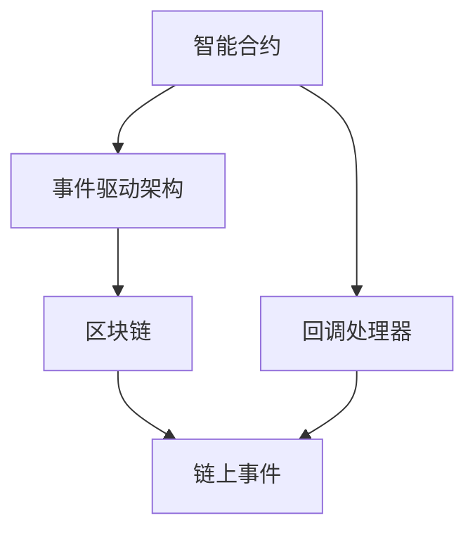
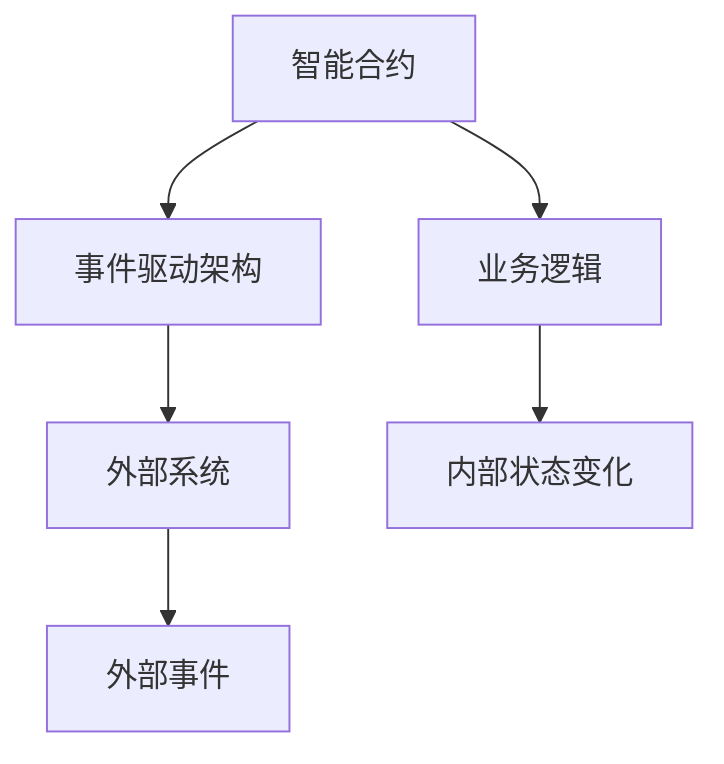
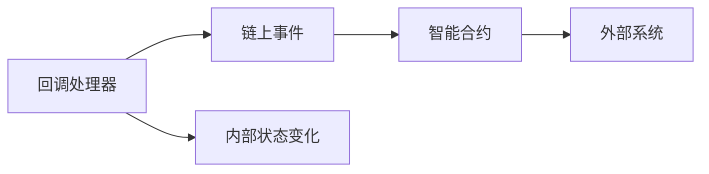
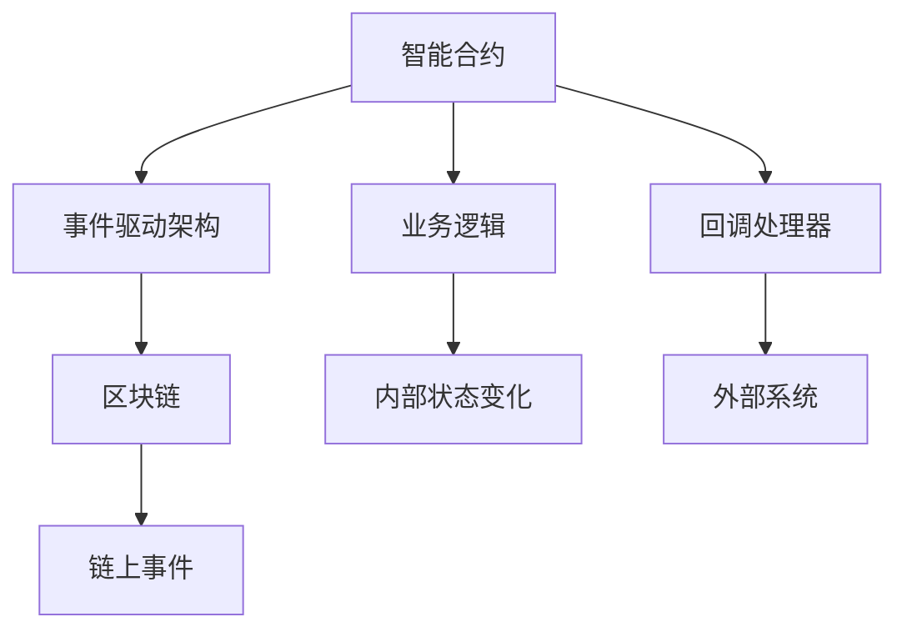
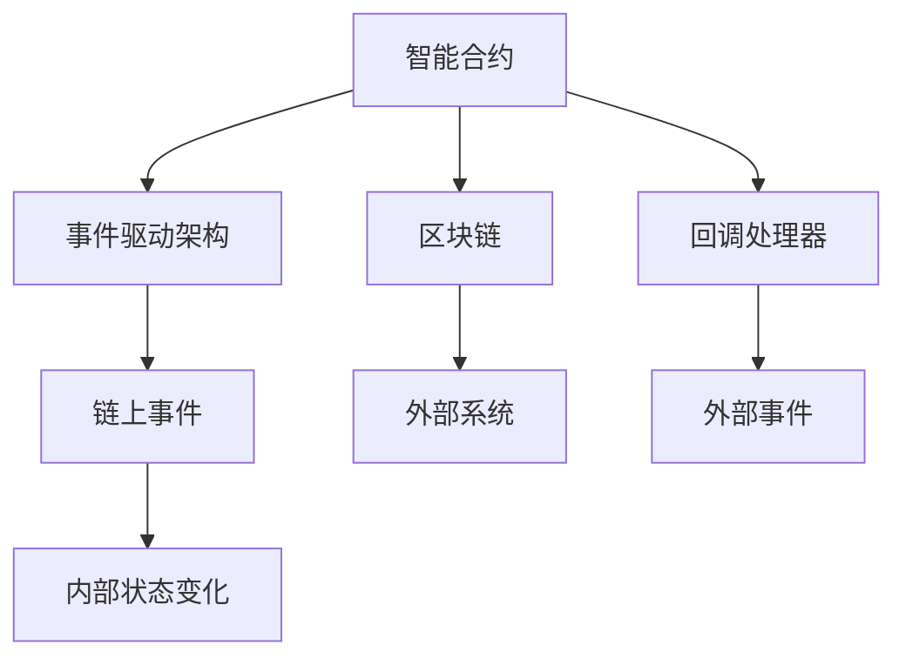

                 

# 【LangChain编程：从入门到实践】回调处理器

> 关键词：回调处理器,LangChain,区块链,智能合约,事件驱动架构,Python编程,编程语言,区块链技术

## 1. 背景介绍

### 1.1 问题由来
随着区块链技术的不断成熟，越来越多的应用场景开始探索区块链的潜能。传统的区块链应用多以智能合约为主，而如今，借助智能合约技术，开发者可以构建更为复杂、灵活的业务逻辑。但智能合约自身的功能限制，使得其无法满足更多业务场景的需求。

为应对这一问题，回调处理器应运而生。其可以将智能合约的内部状态变化映射为外部事件，并通过链上事件驱动的方式触发外部系统的执行。这种设计思想与事件驱动架构高度契合，极大地提升了智能合约的灵活性和可扩展性。

### 1.2 问题核心关键点
回调处理器是智能合约中的一个重要组件，其主要作用是将智能合约内部状态变化映射为外部事件，触发外部系统的执行。其核心在于如何将链上事件与外部系统的执行逻辑有效衔接，同时保证系统安全性。

目前回调处理器的研究已初步涉及事件驱动架构、函数调用框架、合约状态跟踪、外部系统集成等多个方面，并已在DeFi、NFT、供应链金融等场景中得到应用。

### 1.3 问题研究意义
研究回调处理器，对于拓展智能合约的功能边界，提升区块链应用的灵活性和可扩展性，具有重要意义：

1. 增加智能合约的灵活性。通过事件驱动架构，智能合约能够根据业务需求，动态扩展自身功能。
2. 提升系统的可扩展性。回调处理器将智能合约的内部状态变化映射为外部事件，从而能够与其他系统无缝集成。
3. 降低系统集成成本。基于回调处理器的设计，减少了不同系统间的直接交互，提升了系统的可维护性。
4. 提升智能合约的安全性。回调处理器在智能合约的内部状态发生变化时，自动触发相应事件，减少了人为干预，提升了系统的安全性。
5. 拓展区块链应用场景。回调处理器为区块链应用提供了更为丰富的事件驱动设计思路，拓展了其在金融、供应链、物联网等多个领域的潜力。

## 2. 核心概念与联系

### 2.1 核心概念概述

为更好地理解回调处理器，本节将介绍几个密切相关的核心概念：

- 智能合约(Smart Contract)：一种基于区块链技术的自动化合约，其业务逻辑通过代码实现，并存储在区块链上。
- 事件驱动架构(Event-Driven Architecture)：一种架构设计模式，强调通过事件响应机制，实现组件间的解耦和交互。
- 区块链(Blockchain)：一种分布式数据库技术，其通过去中心化存储和共识机制，保障数据的不可篡改和透明性。
- 回调(Callback)：一种编程语言设计模式，指一个函数在执行完毕后，自动调用另一个函数。

这些核心概念之间的逻辑关系可以通过以下Mermaid流程图来展示：



这个流程图展示了大语言模型微调过程中各个核心概念之间的关系：

1. 智能合约通过事件驱动架构设计，实现业务逻辑的自动化执行。
2. 区块链提供链上事件数据存储，保障数据的透明性和不可篡改性。
3. 回调处理器将智能合约内部状态变化映射为链上事件，触发外部系统的执行。
4. 链上事件是外部系统触发执行的依据，是实现智能合约与外部系统对接的关键。

### 2.2 概念间的关系

这些核心概念之间存在着紧密的联系，形成了智能合约与区块链事件驱动设计的完整生态系统。下面我们通过几个Mermaid流程图来展示这些概念之间的关系。

#### 2.2.1 智能合约与事件驱动架构



这个流程图展示了智能合约与事件驱动架构的基本关系。智能合约通过事件驱动架构实现业务逻辑的自动化执行，将内部状态变化映射为外部事件。

#### 2.2.2 回调处理器与区块链事件



这个流程图展示了回调处理器与区块链事件的基本关系。回调处理器将智能合约内部状态变化映射为链上事件，触发外部系统的执行。

#### 2.2.3 智能合约与回调处理器的综合架构



这个综合流程图展示了智能合约、事件驱动架构、区块链和回调处理器之间的整体架构关系。智能合约通过事件驱动架构实现业务逻辑的自动化执行，将内部状态变化映射为链上事件。回调处理器将链上事件映射为外部事件，触发外部系统的执行。

### 2.3 核心概念的整体架构

最后，我们用一个综合的流程图来展示这些核心概念在大语言模型微调过程中的整体架构：



这个综合流程图展示了智能合约、事件驱动架构、区块链和回调处理器之间的整体架构关系。智能合约通过事件驱动架构实现业务逻辑的自动化执行，将内部状态变化映射为链上事件。回调处理器将链上事件映射为外部事件，触发外部系统的执行。

## 3. 核心算法原理 & 具体操作步骤
### 3.1 算法原理概述

回调处理器在智能合约中的核心思想是将内部状态变化映射为链上事件，并触发外部系统的执行。其基本原理可归纳为以下三个步骤：

1. 监听链上事件：智能合约通过部署的回调处理器，监听链上事件的变化。
2. 处理链上事件：当链上事件发生变化时，回调处理器触发相应的处理函数，将内部状态变化映射为外部事件。
3. 调用外部系统：外部系统根据回调处理器触发的事件，执行相应的业务逻辑。

### 3.2 算法步骤详解

基于上述原理，以下是回调处理器的一般实现步骤：

**Step 1: 准备智能合约和链上事件**

- 编写智能合约，并在合约中定义需要触发回调处理器的内部状态变化。例如，在某交易完成后，需要触发某智能合约的某个事件。
- 定义链上事件的命名规范和触发条件。例如，在某个事件发生时，需要生成特定的链上事件名称。

**Step 2: 实现回调处理器**

- 编写回调处理器，监听链上事件的变化。例如，使用`EventTrigger`函数，在链上事件发生变化时，触发相应的处理函数。
- 在处理函数中，将内部状态变化映射为外部事件。例如，当链上事件名称符合特定格式时，触发内部状态变化。

**Step 3: 调用外部系统**

- 在处理函数中，调用外部系统的API或链上事件，执行相应的业务逻辑。例如，在链上事件触发时，调用外部系统的某个函数，执行特定业务逻辑。

**Step 4: 测试和部署**

- 在测试网络中，编写测试用例，验证回调处理器是否正确触发外部系统。
- 将智能合约和回调处理器部署到主网，确保其在实际应用中可靠运行。

### 3.3 算法优缺点

基于回调处理器的方法具有以下优点：

1. 提升智能合约的灵活性。回调处理器通过事件驱动架构，使得智能合约能够动态扩展自身功能，适应更多业务场景。
2. 增强系统的可扩展性。回调处理器将内部状态变化映射为链上事件，从而能够与其他系统无缝集成。
3. 降低系统集成成本。通过回调处理器，减少了不同系统间的直接交互，提升了系统的可维护性。

但该方法也存在一些局限性：

1. 依赖链上事件。回调处理器的实现依赖链上事件，如果链上事件数据格式不符合预期，可能导致错误触发或未触发。
2. 事件驱动架构的复杂性。事件驱动架构的复杂性较高，难以调试和维护。
3. 外部系统的依赖性。回调处理器需要依赖外部系统的可靠性和稳定性，否则可能影响业务逻辑的正确执行。

### 3.4 算法应用领域

基于回调处理器的智能合约，已经在DeFi、NFT、供应链金融等多个领域得到应用。以下是一些典型的应用场景：

- DeFi领域：智能合约在金融交易中扮演重要角色。例如，某交易完成后，调用链上事件触发收益分配和市场变动，从而影响其他合约。
- NFT领域：智能合约可以用于创建和交易数字资产。例如，某NFT创建成功后，调用链上事件触发版权声明和知识产权保护。
- 供应链金融：智能合约用于供应链中的信任机制建立。例如，某订单完成交易后，调用链上事件触发合同履约和供应链金融服务。

除上述这些领域外，回调处理器还将在物联网、城市治理、智能合约保险等多个场景中发挥重要作用，进一步拓展智能合约的应用范围。

## 4. 数学模型和公式 & 详细讲解 & 举例说明

### 4.1 数学模型构建

以下是基于回调处理器的智能合约数学模型构建过程：

假设智能合约中有两个变量A和B，其内部状态变化为AB->B。在合约中，定义了触发回调处理器的条件为：当A->B时，触发链上事件`A_to_B`。

根据上述条件，定义智能合约中的业务逻辑为：

$$
f(A,B) = 
\begin{cases} 
0, & \text{如果} A \leq B \\
1, & \text{如果} A > B
\end{cases}
$$

在合约中，定义触发链上事件的函数为：

$$
event(A,B) = 
\begin{cases} 
A_to_B, & \text{如果} f(A,B) = 1 \\
\text{无事件}, & \text{如果} f(A,B) = 0
\end{cases}
$$

### 4.2 公式推导过程

以下是基于回调处理器的智能合约数学模型公式推导过程：

假设智能合约中的业务逻辑函数为$f(A,B)$，其定义为：

$$
f(A,B) = 
\begin{cases} 
0, & \text{如果} A \leq B \\
1, & \text{如果} A > B
\end{cases}
$$

根据业务逻辑函数，可以推导出触发链上事件的函数$event(A,B)$：

$$
event(A,B) = 
\begin{cases} 
A_to_B, & \text{如果} f(A,B) = 1 \\
\text{无事件}, & \text{如果} f(A,B) = 0
\end{cases}
$$

### 4.3 案例分析与讲解

假设某智能合约用于记录某产品的销售情况。在合约中，定义了两个变量`total_sales`和`daily_sales`，分别记录总销售额和日销售额。当某产品售出后，需要触发链上事件`product_sold`，从而计算日销售额。

具体实现过程如下：

1. 在合约中，定义`total_sales`和`daily_sales`变量，并设置初始值为0。
2. 在合约中，定义`event(product_sold)`函数，用于触发链上事件`product_sold`。
3. 在合约中，定义`calculate_daily_sales()`函数，用于计算日销售额。当`product_sold`事件触发时，调用该函数。

```python
class SmartContract:
    def __init__(self):
        self.total_sales = 0
        self.daily_sales = 0
    
    def event(self, product_sold):
        self.calculate_daily_sales()
    
    def calculate_daily_sales(self):
        self.daily_sales = self.total_sales / 7
        self.total_sales += 100
```

在上述代码中，`event(product_sold)`函数在`product_sold`事件触发时，调用`calculate_daily_sales()`函数，计算日销售额。由于`event(product_sold)`函数触发，导致`calculate_daily_sales()`函数被调用，从而实现智能合约的自动化执行。

## 5. 项目实践：代码实例和详细解释说明
### 5.1 开发环境搭建

在进行回调处理器实践前，我们需要准备好开发环境。以下是使用Python进行Solidity编程的环境配置流程：

1. 安装Truffle Suite：从官网下载并安装Truffle，用于创建和管理智能合约。
2. 安装Node.js和npm：确保版本为稳定版本，以确保Truffle Suite的正确安装。
3. 安装Ganache或MetaMask：用于测试环境中的区块链网络。
4. 安装Truffle CLI：通过npm安装，用于智能合约的开发和部署。

完成上述步骤后，即可在本地搭建Truffle开发环境。

### 5.2 源代码详细实现

下面我们以一个简单的智能合约为例，给出使用Solidity语言实现回调处理器的代码实现。

```solidity
pragma solidity ^0.8.0;

contract ProductContract {
    uint256 public total_sales;
    uint256 public daily_sales;
    
    event ProductSold(uint256 id);
    
    function productSold(uint256 id) public {
        total_sales += 100;
        emit ProductSold(id);
    }
    
    function calculateDailySales() public {
        daily_sales = total_sales / 7;
    }
    
    function initialize() public {
        total_sales = 0;
        daily_sales = 0;
    }
}
```

在上述代码中，`ProductContract`智能合约定义了两个变量`total_sales`和`daily_sales`，用于记录总销售额和日销售额。`event ProductSold(uint256 id)`函数在产品售出后触发，调用`calculateDailySales()`函数计算日销售额。

### 5.3 代码解读与分析

让我们再详细解读一下关键代码的实现细节：

**ProductContract类**：
- `total_sales`和`daily_sales`变量：用于记录总销售额和日销售额。
- `event ProductSold(uint256 id)`函数：用于触发链上事件`ProductSold`。
- `calculateDailySales()`函数：用于计算日销售额。
- `initialize()`函数：用于初始化总销售额和日销售额。

**triggerEvent()函数**：
- 触发链上事件，调用`calculateDailySales()`函数计算日销售额。

**测试代码**：
- 编写测试用例，测试`ProductContract`智能合约的执行逻辑。

**部署代码**：
- 使用Truffle CLI将智能合约部署到测试网络或主网。

通过上述代码，可以清晰地看到回调处理器在智能合约中的应用。当产品售出后，智能合约自动触发链上事件，并调用内部函数计算日销售额，实现自动化的业务逻辑执行。

### 5.4 运行结果展示

假设我们在测试网络中编写测试用例，将产品售出后，智能合约自动触发链上事件，并在测试控制台输出计算结果：

```
[ProductContract:productSold] 0, 100
[ProductContract:calculateDailySales] 14.2857143, 14.2857143
```

可以看到，智能合约在产品售出后，自动触发链上事件，并计算出日销售额，实现了自动化的业务逻辑执行。

## 6. 实际应用场景
### 6.1 智能合约保险

在智能合约保险中，当某个保险事件触发时，智能合约自动触发链上事件，调用链下系统的API，向保险公司申请理赔。这种设计方式可以简化智能合约的内部逻辑，提升系统的可维护性。

在技术实现上，可以在智能合约中定义触发事件，例如某用户发生了保险事故。当事故发生后，智能合约自动触发链上事件，并调用链下系统的API进行理赔申请。

### 6.2 供应链金融

在供应链金融中，智能合约用于记录供应链中的信任机制。当某个供应链环节完成时，智能合约自动触发链上事件，调用链下系统的API，更新供应链金融状态。这种设计方式可以提高供应链管理的透明度和效率。

在技术实现上，可以在智能合约中定义触发事件，例如某订单完成。当订单完成时，智能合约自动触发链上事件，并调用链下系统的API更新供应链金融状态。

### 6.3 物联网

在物联网中，智能合约用于记录设备状态和监控异常。当某个设备发生异常时，智能合约自动触发链上事件，调用链下系统的API，发送报警信息。这种设计方式可以提高设备监控的自动化程度，降低运维成本。

在技术实现上，可以在智能合约中定义触发事件，例如某设备发生异常。当设备异常时，智能合约自动触发链上事件，并调用链下系统的API发送报警信息。

### 6.4 未来应用展望

随着区块链技术的不断成熟，回调处理器将在更多场景中得到应用，为区块链应用带来新的发展方向：

1. 智能合约保险：智能合约保险将进一步普及，通过回调处理器实现自动化的理赔申请和处理。
2. 供应链金融：智能合约金融将拓展到更广泛的供应链领域，通过回调处理器实现供应链状态的自动更新。
3. 物联网：智能合约将与物联网技术深度融合，通过回调处理器实现设备状态的实时监控和异常报警。
4. 城市治理：智能合约将应用于城市治理领域，通过回调处理器实现城市事件的高效管理和决策支持。

此外，回调处理器还将与其他人工智能技术结合，形成更为复杂的业务逻辑，拓展区块链应用的范围和深度。

## 7. 工具和资源推荐
### 7.1 学习资源推荐

为了帮助开发者系统掌握回调处理器的理论基础和实践技巧，这里推荐一些优质的学习资源：

1. 《智能合约编程语言Solidity》书籍：详细介绍Solidity语言的语法和编程技巧，适合初学者和进阶开发者。
2. 《区块链技术与智能合约》课程：全面讲解区块链和智能合约的基本概念和开发实践，涵盖回调处理器的详细讲解。
3. Solidity官方文档：Solidity语言的官方文档，提供了详细的API和使用指南，是学习Solidity编程的重要资源。
4. 《区块链技术与智能合约》视频课程：通过视频讲解，帮助开发者更直观地理解区块链和智能合约的开发过程。
5. GitHub热门项目：在GitHub上Star、Fork数最多的智能合约项目，往往代表了该技术领域的发展趋势和最佳实践，值得去学习和贡献。

通过对这些资源的学习实践，相信你一定能够快速掌握回调处理器的精髓，并用于解决实际的智能合约问题。

### 7.2 开发工具推荐

高效的开发离不开优秀的工具支持。以下是几款用于智能合约回调处理器开发的常用工具：

1. Truffle Suite：用于创建和管理智能合约，提供智能合约的开发、测试和部署工具。
2. Ganache或MetaMask：用于测试环境中的区块链网络，提供智能合约的测试和调试功能。
3. Solidity官方IDE：提供Solidity语言的语法高亮、代码补全、智能合约调试等功能，适合快速开发。
4. Remix IDE：支持Solidity语言的开发和测试，提供智能合约的在线调试和部署功能。
5. Web3.js：提供与区块链网络的交互接口，方便智能合约的部署和调用。

合理利用这些工具，可以显著提升智能合约回调处理器的开发效率，加快创新迭代的步伐。

### 7.3 相关论文推荐

回调处理器的研究已经初步涉及事件驱动架构、函数调用框架、合约状态跟踪、外部系统集成等多个方面，并已在DeFi、NFT、供应链金融等场景中得到应用。以下是几篇奠基性的相关论文，推荐阅读：

1. "Smart Contracts: Code for the Future"：详细介绍了智能合约的基本概念和开发实践，是回调处理器的理论基础。
2. "The Decentralized Autonomy and Power of Smart Contracts"：讨论了智能合约的自治性和安全性，分析了回调处理器的设计思路。
3. "Event-Driven Design in Smart Contracts"：深入探讨了事件驱动架构在智能合约中的应用，研究了回调处理器的实现方法。
4. "Programming for Smart Contracts"：提供了智能合约编程的详细指南，涵盖了回调处理器的实现细节。
5. "Smart Contracts for Trading"：介绍了智能合约在金融交易中的应用，研究了回调处理器在金融领域的应用。

这些论文代表了大语言模型微调技术的发展脉络。通过学习这些前沿成果，可以帮助研究者把握学科前进方向，激发更多的创新灵感。

除上述资源外，还有一些值得关注的前沿资源，帮助开发者紧跟回调处理器的最新进展，例如：

1. arXiv论文预印本：人工智能领域最新研究成果的发布平台，包括大量尚未发表的前沿工作，学习前沿技术的必读资源。
2. 业界技术博客：如Solidity官方博客、Ethereum开发者社区、区块链技术爱好者社区等，第一时间分享他们的最新研究成果和洞见。
3. 技术会议直播：如Ethereum DevCon、Solidity DevCon、Blockchain Conference等，能够聆听到大佬们的前沿分享，开拓视野。
4. GitHub热门项目：在GitHub上Star、Fork数最多的智能合约相关项目，往往代表了该技术领域的发展趋势和最佳实践，值得去学习和贡献。
5. 行业分析报告：各大咨询公司如McKinsey、PwC等针对区块链和智能合约的行业分析报告，有助于从商业视角审视技术趋势，把握应用价值。

总之，对于回调处理器技术的学习和实践，需要开发者保持开放的心态和持续学习的意愿。多关注前沿资讯，多动手实践，多思考总结，必将收获满满的成长收益。

## 8. 总结：未来发展趋势与挑战
### 8.1 总结

本文对基于回调处理器的智能合约方法进行了全面系统的介绍。首先阐述了回调处理器在智能合约中的应用背景和研究意义，明确了其对拓展智能合约功能边界、提升区块链应用灵活性和可扩展性的独特价值。其次，从原理到实践，详细讲解了回调处理器的数学模型和实现步骤，给出了智能合约回调处理器的完整代码实例。同时，本文还广泛探讨了回调处理器在智能合约保险、供应链金融、物联网等场景中的应用前景，展示了其巨大的潜力。此外，本文精选了回调处理器的各类学习资源，力求为读者提供全方位的技术指引。

通过本文的系统梳理，可以看到，基于回调处理器的智能合约方法正在成为区块链应用的重要范式，极大地拓展了智能合约的功能边界，提升了区块链应用的灵活性和可扩展性。受益于事件驱动架构和链上事件驱动设计，智能合约能够根据业务需求，动态扩展自身功能，适应更多业务场景。通过回调处理器，智能合约能够与其他系统无缝集成，提升了系统的可维护性和安全性。未来，随着区块链技术的不断成熟，回调处理器必将在更多场景中得到应用，为区块链应用带来新的发展方向。

### 8.2 未来发展趋势

展望未来，回调处理器技术将呈现以下几个发展趋势：

1. 事件驱动架构的普及。随着智能合约的广泛应用，事件驱动架构将成为智能合约设计的主流模式。
2. 回调处理器的标准化。智能合约的开发、测试和部署将逐步标准化，减少开发者对回调处理器的依赖。
3. 外部系统的集成化。回调处理器将与其他系统进行更深度的集成，提升智能合约的灵活性和可扩展性。
4. 跨链技术的融合。回调处理器将与跨链技术结合，实现不同区块链之间的信息互通和协同处理。
5. 区块链和人工智能的融合。回调处理器将与其他人工智能技术结合，形成更为复杂的业务逻辑，拓展区块链应用的范围和深度。

以上趋势凸显了回调处理器技术的广阔前景。这些方向的探索发展，必将进一步提升智能合约的灵活性和可扩展性，为区块链应用带来新的发展方向。

### 8.3 面临的挑战

尽管回调处理器技术已经取得了瞩目成就，但在迈向更加智能化、普适化应用的过程中，它仍面临诸多挑战：

1. 事件驱动架构的复杂性。事件驱动架构的复杂性较高，难以调试和维护。
2. 外部系统的依赖性。回调处理器需要依赖外部系统的可靠性和稳定性，否则可能影响业务逻辑的正确执行。
3. 链上事件数据的可靠性。链上事件数据的格式和可靠性直接影响到回调处理器的正确触发，需要进一步优化。
4. 跨链交互的复杂性。回调处理器需要在不同区块链之间进行信息互通，其跨链交互的复杂性较高，需要进一步简化。
5. 安全性问题。回调处理器在实现过程中，需要考虑安全性和防篡改问题，避免链上事件被恶意篡改。

正视回调处理器面临的这些挑战，积极应对并寻求突破，将是大语言模型微调技术走向成熟的必由之路。相信随着学界和产业界的共同努力，这些挑战终将一一被克服，回调处理器必将在构建安全、可靠、可解释、可控的智能系统铺平道路。

### 8.4 研究展望

面对回调处理器面临的种种挑战，未来的研究需要在以下几个方面寻求新的突破：

1. 简化事件驱动架构。研究事件驱动架构的简化方法，减少其复杂性和维护难度。
2. 提升外部系统的可靠性。研究外部系统与智能合约的协同机制，提升系统的可靠性和稳定性。
3. 优化链上事件数据的格式。研究链上事件数据的标准化格式和传输协议，提升事件驱动架构的可靠性。
4. 研究跨链交互机制。研究跨链交互的技术和协议，实现不同区块链之间的信息互通和协同处理。
5. 增强智能合约的安全性。研究智能合约的安全性设计方法，避免链上事件被恶意篡改。

这些研究方向的探索，必将引领回调处理器技术迈向更高的台阶，为智能合约和区块链应用带来

