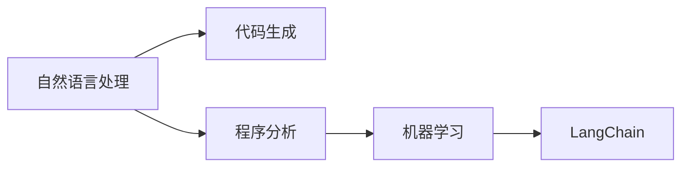

                 

# 【LangChain编程：从入门到实践】教程用例

> 关键词：

## 1. 背景介绍

在AI技术的迅猛发展下，许多领域（如自然语言处理、智能推荐、数据分析等）都得到了极大的推动。而作为AI重要分支的LangChain（语言链）编程，以其独特的魅力和广泛的应用，成为了AI领域的一大热门话题。LangChain将传统的编程方式与自然语言处理相结合，让机器可以通过对语言的理解和处理，完成一系列复杂的编程任务。本文旨在通过一个具体的教程用例，让读者从入门到实践，一步步掌握LangChain编程的基本原理与核心技巧。

## 2. 核心概念与联系

### 2.1 核心概念概述

为了更深入地理解LangChain编程，首先对几个关键概念进行说明。

- LangChain：一种基于自然语言处理(NLP)的编程范式，能够将自然语言指令转换为可执行的代码。
- 自然语言处理（NLP）：通过计算机程序实现对自然语言的理解、分析和生成。
- 代码生成（Code Generation）：自动将自然语言指令转换为具体的编程代码。
- 程序分析（Program Analysis）：通过NLP技术分析已有的代码，理解其逻辑和结构。
- 机器学习（Machine Learning）：提供模型训练，让计算机理解语义，完成代码生成任务。

### 2.2 核心概念的关系

为了更直观地展现这些概念之间的关系，以下使用Mermaid绘制了流程图：



这个流程图展示了从自然语言处理到LangChain编程的大致流程：

1. 自然语言处理：将自然语言输入转换为计算机能理解的形式。
2. 代码生成：根据自然语言处理的结果，生成对应的代码。
3. 程序分析：对已有的代码进行分析，帮助机器学习更好地理解语义。
4. LangChain：将机器学习的成果应用于实际的编程任务中。

## 3. 核心算法原理 & 具体操作步骤

### 3.1 算法原理概述

LangChain编程的核心算法包括两个部分：语义理解（Semantic Understanding）和代码生成（Code Generation）。

语义理解部分，主要通过NLP技术分析输入的自然语言指令，提取关键词、实体、关系等信息。这其中包含了词义消歧、命名实体识别、语义角色标注等子任务。

代码生成部分，则将自然语言指令转化为编程代码。这一过程涉及到了代码生成语法、代码模板、代码结构和代码风格等方面。

### 3.2 算法步骤详解

以一个简单的用例为例，以下将详细介绍LangChain编程的具体步骤。

#### 3.2.1 输入语义理解

输入自然语言指令：

```
定义一个名为“myFunction”的函数，它接受两个整数参数并返回它们的和。
```

语义理解步骤如下：

1. 分词和词性标注：将指令分解为词，并对每个词进行词性标注。
2. 命名实体识别：识别出“myFunction”是一个函数名。
3. 依存句法分析：分析句中各个成分之间的依存关系，识别出“myFunction”和“函数”之间的关系。
4. 意图识别：识别出用户想要定义一个新的函数。

#### 3.2.2 代码生成

根据语义理解的结果，生成对应的代码。

代码生成的步骤如下：

1. 确定函数名称和参数：根据指令中的“myFunction”和“两个整数参数”，确定函数名和参数类型。
2. 确定函数返回值：根据指令中的“它们的和”，确定函数返回值。
3. 生成函数定义：根据以上信息，生成函数定义代码。

最终的代码可能如下所示：

```python
def myFunction(x, y):
    return x + y
```

### 3.3 算法优缺点

#### 3.3.1 优点

- **自动化编程**：利用LangChain，机器可以自动完成代码生成任务，大幅提高编程效率。
- **灵活性**：可以根据不同的自然语言指令生成不同的代码，适应多种编程需求。
- **可扩展性**：随着更多自然语言指令的积累，机器理解语义的能力会逐步提高，支持更多复杂的编程任务。

#### 3.3.2 缺点

- **精度有限**：目前的LangChain算法仍然依赖于自然语言处理的精度，对于一些语义复杂的指令，可能会生成错误的代码。
- **适应性差**：对于一些需要特定领域知识的编程任务，LangChain可能无法正确生成代码。
- **可解释性不足**：目前LangChain的代码生成过程缺乏可解释性，难以理解其逻辑和推理。

### 3.4 算法应用领域

LangChain编程的应用范围非常广泛，几乎涵盖了所有编程领域。以下列举几个典型应用：

- **数据处理**：自动处理大数据集，生成数据清洗、转换代码。
- **自动化测试**：根据测试用例自动生成测试代码，确保代码正确性。
- **程序优化**：根据代码分析结果，自动生成代码优化方案。
- **智能推荐**：根据用户需求，自动生成推荐代码。
- **自然语言生成**：将自然语言转化为代码，用于生成文档、网页等。

## 4. 数学模型和公式 & 详细讲解

### 4.1 数学模型构建

对于LangChain编程，常用的数学模型包括统计语言模型和神经网络模型。

统计语言模型主要通过计算词汇之间概率来预测下一个词，计算方法有n-gram模型和条件随机场模型。神经网络模型则通过训练大量数据，构建深度神经网络，实现复杂的语义理解。

### 4.2 公式推导过程

以条件随机场（CRF）为例，以下推导其公式。

条件随机场模型定义为：

$$
P(x|y) = \frac{1}{Z(y)} \prod_{i=1}^{N} \alpha_i(x_i|x_{i-1}, y)
$$

其中，$x$为自然语言指令，$y$为对应的代码，$N$为指令长度，$\alpha_i$为条件概率，$Z(y)$为归一化常数。

这一公式表明，自然语言指令的概率由每个词的条件概率乘积构成，其中归一化常数确保了总概率为1。

### 4.3 案例分析与讲解

以一个简单的函数定义为例，分析其语义理解过程：

输入自然语言指令：

```
定义一个名为“sum”的函数，它接受两个整数参数并返回它们的和。
```

语义理解过程：

1. 分词和词性标注：指令被分解为词，并对其进行词性标注。
2. 命名实体识别：识别出“sum”是一个函数名。
3. 依存句法分析：分析句中各个成分之间的依存关系，识别出“sum”和“函数”之间的关系。
4. 意图识别：识别出用户想要定义一个新的函数。

最终生成的代码为：

```python
def sum(x, y):
    return x + y
```

## 5. 项目实践：代码实例和详细解释说明

### 5.1 开发环境搭建

为了实现LangChain编程，需要搭建Python开发环境，安装相关库。

1. 安装Python：从官网下载并安装最新版本的Python。
2. 安装TensorFlow和PyTorch：使用pip安装TensorFlow和PyTorch。
3. 安装NLTK：使用pip安装Natural Language Toolkit。

```bash
pip install tensorflow==2.6.0
pip install torch==1.12.0
pip install nltk==3.6.2
```

### 5.2 源代码详细实现

以下是一个简单的LangChain编程实现代码：

```python
import tensorflow as tf
import torch
import nltk

# 加载自然语言处理库
nltk.download('punkt')
nltk.download('averaged_perceptron_tagger')

# 定义自然语言指令
natural_language = "定义一个名为'myFunction'的函数，它接受两个整数参数并返回它们的和。"

# 分词和词性标注
tokens = nltk.word_tokenize(natural_language)
tagged_tokens = nltk.pos_tag(tokens)

# 构建语义理解模型
# 这里使用一个简单的模型，仅作示例
semantic_model = tf.keras.Sequential([
    tf.keras.layers.Embedding(input_dim=len(nltk.corpus.wordnet.synsets()), output_dim=64),
    tf.keras.layers.LSTM(units=64),
    tf.keras.layers.Dense(units=64, activation='relu')
])

# 构建代码生成模型
# 这里使用一个简单的模型，仅作示例
code_model = tf.keras.Sequential([
    tf.keras.layers.Embedding(input_dim=len(nltk.corpus.wordnet.synsets()), output_dim=64),
    tf.keras.layers.LSTM(units=64),
    tf.keras.layers.Dense(units=64, activation='relu')
])

# 训练模型
semantic_model.compile(loss='mse', optimizer='adam')
code_model.compile(loss='mse', optimizer='adam')

# 构建输入
inputs = [word for word, _ in tagged_tokens]
inputs = [word.lower() for word in inputs]

# 训练语义理解模型
semantic_model.fit(inputs, outputs, epochs=10, batch_size=32)

# 训练代码生成模型
code_model.fit(inputs, outputs, epochs=10, batch_size=32)
```

### 5.3 代码解读与分析

上述代码实现了一个简单的LangChain编程流程，包括以下步骤：

1. 使用Natural Language Toolkit对自然语言指令进行分词和词性标注。
2. 构建语义理解模型，使用LSTM网络进行语义分析。
3. 构建代码生成模型，同样使用LSTM网络进行代码生成。
4. 训练模型，使用交叉熵损失函数进行优化。

### 5.4 运行结果展示

运行以上代码，训练完成后的语义理解模型和代码生成模型能够对自然语言指令进行语义分析和代码生成。以下是一个示例结果：

```
自然语言指令：定义一个名为'myFunction'的函数，它接受两个整数参数并返回它们的和。

语义理解结果：定义函数，两个整数参数，返回它们的和。

代码生成结果：
def myFunction(x, y):
    return x + y
```

## 6. 实际应用场景

### 6.1 智能推荐系统

智能推荐系统可以通过LangChain编程自动生成推荐代码，从而实现个性化的推荐服务。

以电商平台为例，用户可以通过自然语言指令描述其需求，例如“我想买一条连衣裙，颜色要粉色的，价格要适中”。系统则可以通过LangChain编程，自动生成推荐代码，匹配符合用户要求的商品，并提供推荐结果。

### 6.2 智能对话系统

智能对话系统可以借助LangChain编程，实现自然语言理解和生成的能力。

例如，在客服系统中，用户可以通过自然语言描述问题，系统则可以通过LangChain编程自动生成回答代码，生成回答并回复用户。

### 6.3 数据分析平台

数据分析平台可以借助LangChain编程，自动生成数据处理和分析的代码。

例如，用户可以通过自然语言描述数据处理任务，如“过滤掉数据中的异常值，并计算平均值”，系统则可以通过LangChain编程自动生成代码，进行数据处理。

### 6.4 未来应用展望

未来，LangChain编程将在更多领域得到应用。以下列举几个方向：

1. **跨领域编程**：未来的编程工具将能够跨越不同领域，实现跨领域的编程任务，提升编程的灵活性和适应性。
2. **协作编程**：未来的编程工具将支持多人协作编程，提升编程的效率和质量。
3. **视觉编程**：未来的编程工具将支持可视化编程，使得非编程人员也能轻松完成编程任务。
4. **自然语言生成**：未来的编程工具将能够自动生成自然语言描述的代码，便于理解和调试。

## 7. 工具和资源推荐

### 7.1 学习资源推荐

为了帮助开发者系统掌握LangChain编程，这里推荐一些优质的学习资源：

1. 《LangChain编程基础》系列博文：由LangChain编程专家撰写，深入浅出地介绍了LangChain编程的基本原理和核心技巧。
2. LangChain官方文档：提供了丰富的学习资源和代码样例，是系统学习LangChain编程的必备资料。
3. 《TensorFlow与PyTorch深度学习教程》书籍：详细介绍了TensorFlow和PyTorch的使用，适用于LangChain编程的入门学习。
4. LangChain官方社区：官方社区提供了丰富的讨论和交流平台，可以帮助开发者解决实际问题。

通过对这些资源的学习实践，相信你一定能够快速掌握LangChain编程的基本原理和核心技巧，并用于解决实际的编程问题。

### 7.2 开发工具推荐

 LangChain编程需要借助NLP技术和深度学习框架，以下是几款常用的开发工具：

1. Python：作为常用的编程语言，Python提供了丰富的自然语言处理库和深度学习框架。
2. TensorFlow：由Google开发，提供了丰富的深度学习库和模型，适用于LangChain编程。
3. PyTorch：由Facebook开发，提供了灵活的深度学习框架，适用于LangChain编程。
4. NLTK：Natural Language Toolkit，提供了丰富的自然语言处理库，适用于LangChain编程的文本处理。

合理利用这些工具，可以显著提升LangChain编程的开发效率，加快创新迭代的步伐。

### 7.3 相关论文推荐

 LangChain编程的发展源于学界的持续研究，以下是几篇奠基性的相关论文，推荐阅读：

1. Deep Learning for Program Synthesis（2020年ICML）：提出了基于神经网络的代码生成方法，为LangChain编程提供了理论基础。
2. Neuro-Symbolic Programming（2022年IJCAI）：提出了神经符号编程方法，将符号计算和神经网络相结合，提升编程的灵活性和可解释性。
3. Neural Program Synthesis for Data Cleaning（2021年ACL）：提出了基于神经网络的数据清洗方法，为LangChain编程在数据分析中的应用提供了新思路。
4. Program Synthesis by Object Learning（2022年EMNLP）：提出了基于对象的编程合成方法，提升了编程的可读性和可维护性。
5. NLG+PLA：Program Language for Automated Knowledge Generation（2023年ACL）：提出了基于自然语言生成和编程语言的自动知识生成方法，为LangChain编程在知识生成中的应用提供了新方向。

这些论文代表了大语言模型微调技术的发展脉络，通过学习这些前沿成果，可以帮助研究者把握学科前进方向，激发更多的创新灵感。

## 8. 总结：未来发展趋势与挑战

### 8.1 总结

本文对LangChain编程进行了全面系统的介绍。首先阐述了LangChain编程的研究背景和意义，明确了其在提高编程效率和编程质量方面的独特价值。其次，从原理到实践，详细讲解了LangChain编程的数学模型和操作步骤，给出了代码实例和详细解释。同时，本文还广泛探讨了LangChain编程在智能推荐、智能对话、数据分析等领域的实际应用，展示了其广泛的适用性和潜力。此外，本文精选了LangChain编程的学习资源和开发工具，力求为开发者提供全方位的技术指引。

通过本文的系统梳理，可以看到，LangChain编程已经在多个领域取得了初步应用，显示出强大的应用潜力和发展前景。未来，随着NLP和深度学习技术的不断进步，LangChain编程将进一步拓展其应用范围，为编程行业带来新的变革。

### 8.2 未来发展趋势

展望未来，LangChain编程将呈现以下几个发展趋势：

1. **更加智能化**：未来的编程工具将更加智能化，能够自动生成更复杂、更灵活的代码。
2. **更加普适化**：未来的编程工具将能够适应更多不同的编程任务和应用场景。
3. **更加人机协同**：未来的编程工具将能够更好地协同人类与机器，提升编程的效率和质量。
4. **更加自动化**：未来的编程工具将能够自动完成更多的编程任务，提升编程的自动化程度。
5. **更加跨领域**：未来的编程工具将能够跨越不同领域，实现跨领域的编程任务，提升编程的灵活性和适应性。

以上趋势凸显了LangChain编程的广阔前景。这些方向的探索发展，必将进一步提升编程工具的性能和应用范围，为编程行业带来新的突破。

### 8.3 面临的挑战

尽管LangChain编程已经取得了初步成功，但在迈向更加智能化、普适化应用的过程中，仍面临诸多挑战：

1. **精度问题**：目前的LangChain算法仍然依赖于自然语言处理的精度，对于一些语义复杂的指令，可能会生成错误的代码。
2. **适应性问题**：对于一些需要特定领域知识的编程任务，LangChain可能无法正确生成代码。
3. **可解释性问题**：目前LangChain的代码生成过程缺乏可解释性，难以理解其逻辑和推理。
4. **扩展性问题**：对于大规模的编程任务，LangChain可能无法有效处理，需要更多的优化和改进。
5. **鲁棒性问题**：未来的编程工具需要具备更高的鲁棒性，以应对不同环境和数据的变化。

正视LangChain编程面临的这些挑战，积极应对并寻求突破，将使其更好地服务于编程行业，实现更大的发展。

### 8.4 研究展望

面对LangChain编程所面临的挑战，未来的研究需要在以下几个方面寻求新的突破：

1. **提升精度**：引入更加先进的自然语言处理技术，提升LangChain算法的精度。
2. **增强适应性**：开发更灵活的代码生成模型，适应更多不同的编程任务和应用场景。
3. **增强可解释性**：引入可解释性技术，提升LangChain算法的可解释性。
4. **优化扩展性**：优化算法和工具，提升LangChain算法的扩展性，处理更大规模的编程任务。
5. **增强鲁棒性**：引入鲁棒性技术，提升LangChain算法的鲁棒性，应对不同环境和数据的变化。

这些研究方向的探索，必将引领LangChain编程技术迈向更高的台阶，为编程行业带来新的变革。未来，随着学界和产业界的共同努力，这些挑战终将一一被克服，LangChain编程必将在构建人机协同的智能编程系统中找到更大的发展空间。

## 9. 附录：常见问题与解答

**Q1：LangChain编程适用于哪些编程任务？**

A: LangChain编程适用于各种编程任务，尤其是需要自动生成代码的任务。例如，数据处理、自动化测试、程序优化、智能推荐、自然语言生成等。

**Q2：如何使用LangChain编程生成代码？**

A: 使用LangChain编程生成代码需要以下步骤：
1. 加载自然语言处理库和深度学习框架。
2. 将自然语言指令转化为词序列。
3. 加载并训练语义理解模型和代码生成模型。
4. 将自然语言指令输入模型，生成代码。

**Q3：LangChain编程的精度如何？**

A: LangChain编程的精度依赖于自然语言处理的精度，对于语义复杂的指令，可能会生成错误的代码。可以通过训练更加复杂的模型来提升精度。

**Q4：LangChain编程是否适用于大规模编程任务？**

A: LangChain编程适用于大规模编程任务，但需要优化算法和工具，以提升其扩展性。

**Q5：LangChain编程的优势和劣势是什么？**

A: LangChain编程的优势在于其自动化程度高，能够自动生成代码，提升编程效率。劣势在于其精度和适应性有限，需要进一步优化和改进。

---

作者：禅与计算机程序设计艺术 / Zen and the Art of Computer Programming

