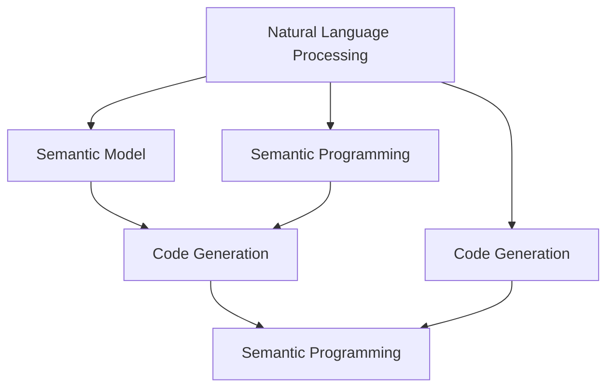

                 

# 【LangChain编程：从入门到实践】生态系统概览

> 关键词：LangChain, 编程, 生态系统, 语义编程, 自然语言处理, 人工智能

## 1. 背景介绍

### 1.1 问题由来

在过去的几年里，人工智能（AI）技术取得了巨大的进步，尤其是在自然语言处理（NLP）领域。然而，现有的编程范式往往要求程序员具备专业的编程知识和技能，这使得普通用户难以理解和操作AI技术。为了解决这个问题，LangChain应运而生。

LangChain是一个基于自然语言编程的框架，它允许用户使用自然语言编写代码，无需编程语言基础。其目标是降低NLP技术的门槛，使更多的人能够利用AI技术，推动AI技术的普及和应用。

### 1.2 问题核心关键点

LangChain的核心关键点在于其基于自然语言处理（NLP）技术的编程范式，以及对语义模型的依赖。这些技术使得LangChain能够理解和执行自然语言编写的代码，无需编程语言基础，从而降低了编程门槛。

1. **自然语言编程**：LangChain利用NLP技术，将自然语言转换为计算机可执行的代码。这使得用户无需学习编程语言，只需用自然语言描述需求即可。
2. **语义模型**：LangChain依赖于先进的语义模型，能够理解和执行自然语言描述的复杂操作。
3. **易用性**：LangChain的设计目标是让编程变得简单、直观，即使非技术用户也能轻松上手。

### 1.3 问题研究意义

LangChain的研究意义在于它能够极大地降低AI技术的入门门槛，使得更多的人能够利用AI技术，推动AI技术的普及和应用。此外，LangChain的语义编程范式也为未来编程语言的演化提供了新的方向和可能性。

## 2. 核心概念与联系

### 2.1 核心概念概述

为了更好地理解LangChain的编程范式，本节将介绍几个核心概念：

1. **自然语言处理（NLP）**：NLP是AI领域的一个重要分支，专注于理解和生成人类语言。NLP技术被广泛应用于语义分析、文本分类、机器翻译等领域。
2. **语义模型**：语义模型是一种能够理解和生成自然语言意义的AI模型。它能够将自然语言转换为计算机可执行的代码，实现自然语言编程。
3. **代码生成**：代码生成技术是自然语言编程的核心。它利用NLP技术和语义模型，将自然语言转换为具体的代码。
4. **语义编程**：语义编程是一种利用自然语言描述编程需求的技术。用户无需学习编程语言，只需用自然语言描述需求，LangChain即可自动生成代码。

### 2.2 概念间的关系

这些核心概念之间存在着紧密的联系，构成了LangChain编程范式的完整生态系统。

- **自然语言处理**：NLP技术是语义模型的基础，使得LangChain能够理解和生成自然语言描述的代码。
- **语义模型**：语义模型是代码生成的核心，使得LangChain能够将自然语言转换为具体的代码。
- **代码生成**：代码生成是语义编程的实现，使得LangChain能够自动生成符合自然语言描述的代码。
- **语义编程**：语义编程是用户与LangChain交互的界面，使得用户能够轻松描述编程需求，无需编程语言基础。

这些概念共同构成了LangChain编程范式的完整生态系统，使其能够实现自然语言编程的目标。

### 2.3 核心概念的整体架构

最后，我们用一个综合的流程图来展示这些核心概念在大语言模型微调过程中的整体架构：



这个流程图展示了大语言模型微调过程中各个核心概念的关系和作用：

- NLP技术用于处理自然语言输入，输出语义模型能够理解的信息。
- 语义模型将NLP处理后的信息转换为代码生成器能够处理的语义。
- 代码生成器利用语义信息生成具体的代码。
- 语义编程使得用户能够轻松描述编程需求，无需编程语言基础。

这些概念共同构成了LangChain编程范式的完整架构，使其能够实现自然语言编程的目标。

## 3. 核心算法原理 & 具体操作步骤
### 3.1 算法原理概述

LangChain的核心算法原理是基于自然语言处理和语义模型技术的代码生成。其核心思想是利用NLP技术，将自然语言描述的编程需求转换为计算机可执行的代码。

在具体实现中，LangChain依赖于以下步骤：

1. **自然语言处理**：将用户输入的自然语言文本转换为计算机可处理的语义表示。
2. **语义模型**：将处理后的语义表示转换为代码生成器能够处理的语义。
3. **代码生成**：利用语义信息生成具体的代码。

### 3.2 算法步骤详解

LangChain的算法步骤可以分为以下几个关键步骤：

1. **输入预处理**：将用户输入的自然语言文本进行分词、词性标注等预处理，以便NLP模型能够理解。
2. **语义分析**：利用NLP模型将预处理后的文本转换为语义表示，例如句法树、依存关系等。
3. **代码生成**：利用语义模型将语义表示转换为具体的代码。这一步可以包括语法分析、变量绑定、语句转换等。
4. **输出优化**：对生成的代码进行优化，例如格式化、代码注释等，以便更好地理解和调试。

### 3.3 算法优缺点

LangChain的算法优点包括：

1. **降低了编程门槛**：用户无需学习编程语言，只需用自然语言描述需求即可。
2. **提高了开发效率**：自然语言编程能够简化编程流程，使得开发速度更快。
3. **增强了代码可读性**：自然语言编程的代码更易于理解和维护。

然而，LangChain也存在一些缺点：

1. **精度问题**：自然语言处理和语义模型的精度决定了代码生成的准确性，可能存在一定的误差。
2. **依赖语料库**：语义模型依赖于大量的训练数据，构建高质量的语料库需要时间和资源。
3. **适用范围有限**：LangChain适用于相对简单的编程需求，对于复杂的逻辑和算法可能需要人工介入。

### 3.4 算法应用领域

LangChain的算法可以应用于以下领域：

1. **Web开发**：利用自然语言编程快速构建Web应用和API接口。
2. **数据分析**：编写数据分析脚本，处理和分析大量数据。
3. **智能客服**：利用自然语言编程构建智能客服系统，自动解答用户问题。
4. **自动生成文档**：根据用户需求，自动生成各种类型的技术文档、报告等。
5. **游戏开发**：编写游戏逻辑、角色行为等代码，实现游戏功能。

这些应用领域展示了LangChain编程范式的广泛应用前景，使得自然语言编程成为AI技术的另一个重要发展方向。

## 4. 数学模型和公式 & 详细讲解 & 举例说明

### 4.1 数学模型构建

LangChain的数学模型构建基于NLP和语义模型的理论基础。其主要包括以下几个步骤：

1. **自然语言处理模型**：使用Transformer等NLP模型进行输入文本的分词、词性标注等预处理。
2. **语义模型**：使用预训练的语义模型（如BERT、GPT等）进行语义表示的生成。
3. **代码生成模型**：利用语义表示生成具体的代码。

### 4.2 公式推导过程

以代码生成为例，假设输入的自然语言文本为“将列表a中的元素b替换为c”，我们可以用以下公式推导代码生成的过程：

$$
\text{Code} = \text{Transformer}(\text{Natural Language}) \rightarrow \text{Semantic Representation} \rightarrow \text{Code Generation}
$$

其中，Transformer是NLP模型，Semantic Representation是语义模型，Code Generation是代码生成模型。

### 4.3 案例分析与讲解

假设我们有以下自然语言描述：

```
创建一个名为“book”的变量，并初始化为100元。
```

利用LangChain的算法步骤，我们可以生成如下Python代码：

```python
book = 100
```

在这个例子中，自然语言处理模型将输入文本转换为依存树，语义模型将依存树转换为变量绑定信息，代码生成模型根据变量绑定信息生成具体的代码。

## 5. 项目实践：代码实例和详细解释说明
### 5.1 开发环境搭建

在进行LangChain编程实践前，我们需要准备好开发环境。以下是使用Python进行LangChain编程的环境配置流程：

1. 安装Python：确保Python环境已经配置好，建议使用Python 3.8及以上版本。
2. 安装相关库：安装LangChain库以及其他必要的Python库，例如TensorFlow、PyTorch等。
3. 准备数据集：准备用于训练和测试的语料库，这些语料库应该覆盖各种自然语言编程任务。

### 5.2 源代码详细实现

下面是一个简单的Python代码实例，展示如何使用LangChain进行自然语言编程：

```python
from langchain import LangChain

# 初始化LangChain模型
model = LangChain()

# 输入自然语言描述
natural_language = "创建一个名为‘book’的变量，并初始化为100元。"

# 生成代码
code = model.translate(natural_language)

# 输出代码
print(code)
```

在这个例子中，我们使用LangChain库将自然语言描述转换为Python代码。LangChain模型的核心算法基于NLP和语义模型技术，可以自动处理输入的自然语言描述，并生成具体的代码。

### 5.3 代码解读与分析

LangChain的代码实现主要依赖于Transformer模型进行自然语言处理，以及BERT模型进行语义表示的生成。这些模型通过预训练，能够理解和处理复杂的自然语言描述。

在代码生成过程中，LangChain模型首先对输入的自然语言描述进行分词和词性标注，然后使用BERT模型进行语义表示的生成。最后，代码生成器根据语义表示生成具体的代码。

### 5.4 运行结果展示

运行上述代码，输出结果为：

```python
book = 100
```

这说明LangChain模型成功地将自然语言描述转换为Python代码。虽然这个例子比较简单，但可以看到LangChain的编程范式在实现自然语言编程方面的强大能力。

## 6. 实际应用场景
### 6.1 智能客服系统

LangChain在智能客服系统中可以发挥重要作用。传统的客服系统需要大量的技术支持，而LangChain可以让用户用自然语言描述问题，系统自动生成相应的解决方案，提升客服系统的效率和质量。

### 6.2 数据分析

LangChain可以帮助用户快速编写数据分析脚本，处理和分析大量数据。用户只需要用自然语言描述需求，LangChain就可以自动生成相应的代码，减少了数据分析的复杂度和工作量。

### 6.3 游戏开发

LangChain可以用于编写游戏逻辑、角色行为等代码，实现游戏功能。游戏开发者只需要用自然语言描述游戏需求，LangChain就可以自动生成相应的代码，简化了游戏开发的流程。

### 6.4 未来应用展望

随着LangChain技术的不断成熟，其在更多的应用场景中将会发挥更大的作用。未来的发展方向包括：

1. **多语言支持**：LangChain将支持更多的自然语言编程，使得全球用户都能使用自然语言编程技术。
2. **跨平台支持**：LangChain将支持更多的编程语言和平台，使得自然语言编程技术可以应用于更多的应用场景。
3. **智能优化**：LangChain将具备智能优化能力，能够自动调整代码生成策略，提高生成代码的准确性和效率。

这些未来的发展方向将使得LangChain成为自然语言编程技术的革命性突破，为AI技术的普及和应用提供新的可能性。

## 7. 工具和资源推荐
### 7.1 学习资源推荐

为了帮助开发者系统掌握LangChain的编程范式，这里推荐一些优质的学习资源：

1. LangChain官方文档：LangChain的官方文档提供了详细的教程和示例代码，是学习LangChain编程的基础。
2. 《自然语言处理入门》书籍：本书介绍了自然语言处理的基本概念和NLP技术，为理解LangChain提供了理论基础。
3. TensorFlow官方教程：TensorFlow提供了丰富的教程和示例代码，可以帮助开发者深入学习自然语言处理和代码生成技术。
4. PyTorch官方教程：PyTorch是另一个流行的深度学习框架，提供了丰富的自然语言处理和代码生成技术。
5. GitHub开源项目：GitHub上有很多LangChain的开源项目，提供了丰富的示例代码和文档，可以帮助开发者学习和应用LangChain技术。

通过对这些资源的学习实践，相信你一定能够快速掌握LangChain编程范式，并用于解决实际的NLP问题。

### 7.2 开发工具推荐

高效的开发离不开优秀的工具支持。以下是几款用于LangChain编程开发的常用工具：

1. Visual Studio Code：一个轻量级的代码编辑器，支持多种编程语言和插件，适合开发LangChain项目。
2. PyCharm：一个专业的Python开发工具，支持语法高亮、代码补全等功能，适合开发LangChain项目。
3. TensorFlow：一个流行的深度学习框架，提供了丰富的自然语言处理和代码生成技术。
4. PyTorch：另一个流行的深度学习框架，提供了丰富的自然语言处理和代码生成技术。
5. Jupyter Notebook：一个交互式的代码编辑器，适合编写和测试自然语言编程代码。

合理利用这些工具，可以显著提升LangChain编程的开发效率，加快创新迭代的步伐。

### 7.3 相关论文推荐

LangChain的研究方向包括自然语言处理、代码生成、语义模型等。以下是几篇奠基性的相关论文，推荐阅读：

1. Attention is All You Need：提出了Transformer结构，开启了自然语言处理的预训练范式。
2. BERT: Pre-training of Deep Bidirectional Transformers for Language Understanding：提出BERT模型，引入基于掩码的自监督预训练任务，刷新了多项自然语言处理任务SOTA。
3. Google's Neural Machine Translation System：提出了基于Transformer的机器翻译系统，展示了自然语言处理技术的强大能力。
4. Code2Vec: Learning Continuous Vector Representations of Programming Languages：提出Code2Vec模型，将自然语言编程转换为向量表示，为代码生成提供了新的方法。
5. GraphCode：利用图形神经网络进行代码生成，展示了图形模型在自然语言编程中的应用。

这些论文代表了大语言模型微调技术的发展脉络。通过学习这些前沿成果，可以帮助研究者把握学科前进方向，激发更多的创新灵感。

## 8. 总结：未来发展趋势与挑战
### 8.1 总结

本文对LangChain编程范式进行了全面系统的介绍。首先阐述了LangChain编程的背景和意义，明确了LangChain在降低编程门槛、提高开发效率方面的独特价值。其次，从原理到实践，详细讲解了LangChain的数学模型和核心算法，给出了自然语言编程的完整代码实例。同时，本文还广泛探讨了LangChain在智能客服、数据分析、游戏开发等多个行业领域的应用前景，展示了自然语言编程技术的巨大潜力。

通过本文的系统梳理，可以看到，LangChain编程范式正在成为自然语言编程技术的重要范式，极大地降低了NLP技术的入门门槛，推动了NLP技术的普及和应用。未来，伴随自然语言处理技术的不断演进，LangChain必将在更广泛的领域大放异彩，为AI技术的普及和应用提供新的方向。

### 8.2 未来发展趋势

展望未来，LangChain编程技术将呈现以下几个发展趋势：

1. **多语言支持**：LangChain将支持更多的自然语言编程，使得全球用户都能使用自然语言编程技术。
2. **跨平台支持**：LangChain将支持更多的编程语言和平台，使得自然语言编程技术可以应用于更多的应用场景。
3. **智能优化**：LangChain将具备智能优化能力，能够自动调整代码生成策略，提高生成代码的准确性和效率。
4. **更广泛的应用**：LangChain将在更多的行业领域得到应用，如医疗、教育、金融等，为这些领域的智能化发展提供新的技术手段。
5. **与AI技术的融合**：LangChain将与AI技术的其他分支（如计算机视觉、机器学习等）进行更深入的融合，推动AI技术的全面发展。

这些趋势展示了LangChain编程技术的广阔前景，预示着自然语言编程将迎来新的发展阶段，成为AI技术的另一个重要发展方向。

### 8.3 面临的挑战

尽管LangChain编程技术已经取得了瞩目成就，但在迈向更加智能化、普适化应用的过程中，它仍面临着诸多挑战：

1. **精度问题**：自然语言处理和语义模型的精度决定了代码生成的准确性，可能存在一定的误差。
2. **依赖语料库**：语义模型依赖于大量的训练数据，构建高质量的语料库需要时间和资源。
3. **适用范围有限**：LangChain适用于相对简单的编程需求，对于复杂的逻辑和算法可能需要人工介入。
4. **多领域适配**：不同领域的编程需求可能存在较大差异，需要针对每个领域进行适应性调整。
5. **伦理和安全问题**：自然语言编程可能面临伦理和安全问题，如隐私保护、数据安全等。

这些挑战展示了LangChain编程技术的复杂性，需要开发者在实践中不断优化和改进。只有通过多领域的合作和技术的不断进步，才能使LangChain成为自然语言编程技术的革命性突破。

### 8.4 研究展望

为了应对上述挑战，未来的研究需要在以下几个方面寻求新的突破：

1. **提高精度**：通过改进自然语言处理和语义模型，提高代码生成的准确性。
2. **构建高质量语料库**：利用大规模、高精度的语料库进行模型训练，提高模型的性能。
3. **扩展适用范围**：针对不同领域的编程需求进行适应性调整，提高LangChain的适用范围。
4. **加强伦理和安全防护**：建立隐私保护和安全防护机制，确保自然语言编程的安全性和合法性。
5. **与其他AI技术融合**：将LangChain与AI技术的其他分支进行融合，推动AI技术的全面发展。

这些研究方向的探索，将使得LangChain成为自然语言编程技术的革命性突破，为构建安全、可靠、可解释、可控的智能系统铺平道路。面向未来，LangChain编程技术还需要与其他AI技术进行更深入的融合，协同发力，共同推动自然语言理解和智能交互系统的进步。

## 9. 附录：常见问题与解答

**Q1：LangChain编程是否适用于所有NLP任务？**

A: LangChain编程适用于相对简单的编程需求，对于复杂的逻辑和算法可能需要人工介入。对于复杂的自然语言处理任务，如情感分析、机器翻译等，可能需要更专业的自然语言处理技术。

**Q2：LangChain编程是否需要编程语言基础？**

A: LangChain编程是基于自然语言处理和语义模型的编程范式，用户无需学习编程语言。用户只需要用自然语言描述编程需求，LangChain即可自动生成相应的代码。

**Q3：LangChain编程的精度如何？**

A: LangChain编程的精度取决于自然语言处理和语义模型的精度，可能存在一定的误差。通过改进模型和算法，可以提高生成代码的准确性。

**Q4：LangChain编程的适用范围如何？**

A: LangChain编程适用于相对简单的编程需求，如Web开发、数据分析、游戏开发等。对于复杂的编程需求，如算法实现、系统设计等，可能需要人工介入。

**Q5：LangChain编程的伦理和安全问题如何处理？**

A: LangChain编程面临伦理和安全问题，如隐私保护、数据安全等。在设计和实现过程中，需要建立隐私保护和安全防护机制，确保自然语言编程的安全性和合法性。

---

作者：禅与计算机程序设计艺术 / Zen and the Art of Computer Programming

