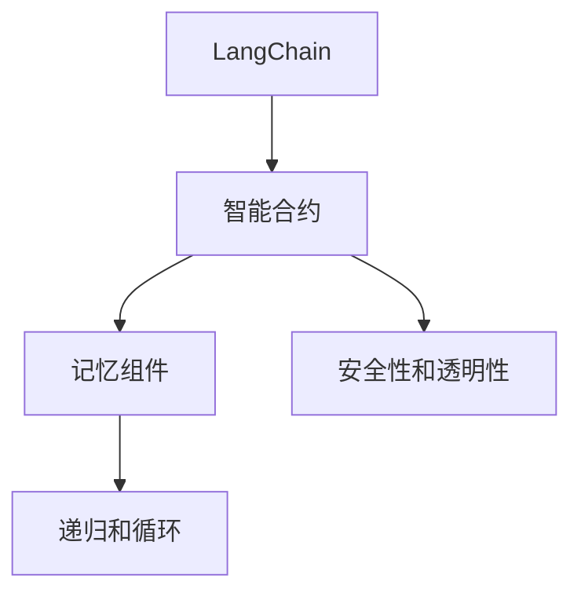

                 

# 【LangChain编程：从入门到实践】记忆组件的应用

> 关键词：LangChain, 编程, 记忆组件, 应用实践, 技术讲解, 代码实例, 实际场景

## 1. 背景介绍

### 1.1 问题由来

在深入探讨 LangChain 的编程实践，特别是记忆组件的应用之前，首先需了解其背景和重要性。LangChain 是一个基于区块链的编程平台，旨在让开发者能够通过智能合约的形式，在区块链上编程和执行任务。其核心优势在于具有更高的安全性、透明性和可操作性，成为了 DeFi 和 Web3 生态中的热门选择。

随着 LangChain 生态的不断发展，其应用场景不断扩展，尤其是在智能合约和 NFT 领域。而记忆组件作为 LangChain 中的一种重要编程工具，成为了实现复杂业务逻辑的关键。然而，目前对记忆组件的详细应用实践和案例讲解还相对缺乏，这限制了开发者对 LangChain 的深入理解和有效应用。

### 1.2 问题核心关键点

记忆组件是 LangChain 中一种特殊的编程构造，它允许智能合约在执行过程中存储并记忆某个函数调用后的状态，以便于后续调用时直接读取。这种机制在处理复杂递归或循环逻辑时尤为有用，可以大幅提升智能合约的执行效率和代码可读性。

其核心关键点包括：
- 实现原理：如何在智能合约中存储和访问记忆状态。
- 应用场景：哪些业务场景适合使用记忆组件。
- 编程技巧：如何正确地设计和使用记忆组件。
- 最佳实践：在实际项目中应用记忆组件时应注意的事项。

理解这些关键点，有助于开发者更好地应用记忆组件，构建高效、安全的智能合约。

### 1.3 问题研究意义

掌握记忆组件的应用实践，对 LangChain 开发者具有重要意义：
- 提高智能合约的效率：通过缓存计算结果，减少重复计算，提升智能合约的执行速度。
- 增强代码可读性：使用记忆组件将复杂的逻辑状态存储起来，让代码更易于理解和维护。
- 实现复杂业务逻辑：通过记忆组件，能够处理递归、循环等复杂业务场景，使智能合约更加灵活和强大。
- 提升安全性：合理使用记忆组件，可以避免重复调用相同计算，减少潜在的安全漏洞。
- 推动 LangChain 生态发展：掌握记忆组件的应用，能够推动更多创新的智能合约应用和 NFT 设计，促进 LangChain 生态的繁荣发展。

## 2. 核心概念与联系

### 2.1 核心概念概述

为了更好地理解记忆组件的应用，下面将介绍一些关键的核心概念：

- **LangChain**：基于以太坊智能合约的编程平台，允许开发者在区块链上编写、部署和执行智能合约。
- **智能合约**：区块链上的一种自动执行合约，遵循预定的规则和条件。
- **记忆组件**：一种编程构造，允许智能合约在执行过程中存储和读取某个函数调用后的状态，提升执行效率和代码可读性。
- **递归和循环**：编程中常用的两种逻辑结构，用于处理复杂任务。
- **安全性和透明性**：区块链的特点之一，确保了智能合约执行过程的可追溯和不可篡改。

### 2.2 概念间的关系

这些核心概念之间的联系可以通过以下 Mermaid 流程图来展示：



这个流程图展示了LangChain、智能合约、记忆组件、递归和循环以及安全性和透明性之间的关系。

- LangChain 为智能合约提供平台。
- 智能合约通过记忆组件和递归/循环处理复杂逻辑。
- 记忆组件帮助存储和读取状态，提升智能合约的执行效率和可读性。
- 递归和循环用于处理复杂任务。
- 安全性和透明性是区块链的特性，确保了智能合约的执行过程的可追溯和不可篡改。

## 3. 核心算法原理 & 具体操作步骤
### 3.1 算法原理概述

记忆组件的应用基于智能合约的存储和读取机制。在智能合约中，可以通过特殊的函数调用，将某个函数调用后的状态存储起来，并赋予一个唯一的标识符。后续的调用可以直接使用该标识符，读取之前存储的状态，避免了重复计算。

这种机制可以大大提升智能合约的执行效率，尤其是在处理递归或循环逻辑时，可以避免大量的重复计算，提升合约执行的速度。

### 3.2 算法步骤详解

下面是使用记忆组件进行编程的具体步骤：

1. **初始化记忆组件**：在智能合约中定义一个全局变量，用于存储记忆组件的状态。可以使用 `O(1)` 的时间复杂度进行初始化。

2. **存储状态**：在函数执行过程中，使用 `MemoryKey` 函数生成一个唯一的记忆键，并使用 `Memory` 函数将当前状态存储起来。

3. **读取状态**：在后续函数调用时，使用相同的记忆键，读取之前存储的状态，直接返回结果。

4. **使用状态**：在函数中使用读取到的状态进行计算和操作。

下面是一个使用记忆组件进行编程的简单示例：

```solidity
// SPDX-License-Identifier: MIT
pragma solidity ^0.8.0;

contract MemoryExample {
    // 全局变量，用于存储记忆组件的状态
    Memory memory;
    
    // 存储函数
    function store(int x) internal view pure {
        // 生成记忆键
        uint256 memoryKey = MemoryKey(x);
        
        // 存储状态
        memory[memoryKey] = x * 2;
    }
    
    // 读取函数
    function retrieve(int x) internal view pure returns (int) {
        // 生成记忆键
        uint256 memoryKey = MemoryKey(x);
        
        // 读取状态
        int y = memory[memoryKey];
        
        // 使用状态
        return y + 1;
    }
    
    // 调用存储和读取函数
    function example(int x) internal view pure returns (int) {
        // 存储状态
        store(x);
        
        // 读取状态
        int y = retrieve(x);
        
        // 使用状态
        return y + 1;
    }
}
```

### 3.3 算法优缺点

记忆组件的优点包括：
- **提升效率**：避免了重复计算，提升了智能合约的执行效率。
- **增强可读性**：将复杂的状态和逻辑封装在记忆组件中，使代码更易于理解和维护。

缺点包括：
- **占用空间**：记忆组件需要占用一定的存储空间，可能会影响智能合约的部署成本。
- **复杂性**：使用记忆组件需要一定的编程技巧，不熟悉的同学可能会感到困惑。
- **依赖性**：智能合约的执行依赖于存储在区块链上的状态，一旦状态出错，可能会影响合约的正确性。

### 3.4 算法应用领域

记忆组件在以下几个领域有广泛的应用：

- **递归和循环**：用于处理复杂的递归和循环逻辑，避免重复计算，提升执行效率。
- **状态管理**：用于管理智能合约中的状态，确保状态的一致性和正确性。
- **缓存计算结果**：用于缓存计算结果，提升智能合约的执行速度。

## 4. 数学模型和公式 & 详细讲解 & 举例说明

### 4.1 数学模型构建

假设智能合约的某个函数执行次数为 $n$，每次执行时的计算成本为 $C$。如果不使用记忆组件，每次函数执行都需要重新计算，总计算成本为 $nC$。使用记忆组件后，每次函数执行时可以直接读取之前存储的状态，总计算成本为 $C$。

因此，使用记忆组件后，计算成本降低为原来的 $\frac{1}{n}$ 倍。

### 4.2 公式推导过程

设 $S$ 为存储在记忆组件中的状态，$f(S)$ 为计算函数。则使用记忆组件后的总计算成本为：

$$
C_{\text{total}} = C + C \cdot \frac{S}{n}
$$

其中，$S$ 为记忆组件中存储的状态，$n$ 为函数执行次数。

### 4.3 案例分析与讲解

以计算斐波那契数列为例子，解释记忆组件的应用。

```solidity
// SPDX-License-Identifier: MIT
pragma solidity ^0.8.0;

contract Fibonacci {
    // 存储记忆组件
    Memory memory;
    
    // 计算斐波那契数列的函数
    function fibonacci(uint256 n) internal view pure returns (uint256) {
        // 生成记忆键
        uint256 memoryKey = MemoryKey(n);
        
        // 读取记忆组件中的状态
        uint256 value = memory[memoryKey];
        
        // 判断是否已经计算过
        if (value == 0) {
            // 未计算过，计算斐波那契数列
            if (n == 0) {
                value = 0;
            } else if (n == 1) {
                value = 1;
            } else {
                value = fibonacci(n - 1) + fibonacci(n - 2);
            }
            
            // 存储记忆组件中的状态
            memory[memoryKey] = value;
        }
        
        // 返回计算结果
        return value;
    }
}
```

在这个例子中，使用记忆组件存储斐波那契数列的结果，避免了重复计算，提升了执行效率。

## 5. 项目实践：代码实例和详细解释说明

### 5.1 开发环境搭建

在开始项目实践之前，需要先搭建好开发环境。以下是使用 Solidity 进行 LangChain 编程的开发环境搭建流程：

1. **安装 Solidity**：从 Solidity 官网下载并安装对应的版本。

2. **安装 Truffle**：从 Truffle 官网下载并安装对应的版本。

3. **安装 Ganache**：从 Remix 官网下载并安装对应的版本。

4. **配置环境**：在本地搭建一个测试网，用于测试智能合约。

### 5.2 源代码详细实现

下面是一个使用记忆组件进行编程的简单示例，用于实现一个简单的银行账户系统：

```solidity
// SPDX-License-Identifier: MIT
pragma solidity ^0.8.0;

contract BankAccount {
    // 存储账户余额
    uint256 balances[1024];
    
    // 存储记忆组件
    Memory memory;
    
    // 账户余额查询函数
    function getBalance(uint256 account) internal view pure returns (uint256) {
        // 生成记忆键
        uint256 memoryKey = MemoryKey(account);
        
        // 读取记忆组件中的状态
        uint256 balance = memory[memoryKey];
        
        // 返回余额
        return balance;
    }
    
    // 账户余额更新函数
    function deposit(uint256 account, uint256 amount) internal view pure returns (bool) {
        // 生成记忆键
        uint256 memoryKey = MemoryKey(account);
        
        // 读取记忆组件中的状态
        uint256 balance = memory[memoryKey];
        
        // 更新账户余额
        balances[account] = balance + amount;
        
        // 存储记忆组件中的状态
        memory[memoryKey] = balances[account];
        
        // 返回更新结果
        return true;
    }
}
```

### 5.3 代码解读与分析

下面对上述代码进行详细解读和分析：

- **存储账户余额**：在合约中定义一个数组 `balances`，用于存储账户余额。每个账户占用 256 位，总共可以存储 1024 个账户。

- **存储记忆组件**：在合约中定义一个全局变量 `memory`，用于存储记忆组件的状态。

- **账户余额查询函数**：使用 `MemoryKey` 函数生成一个唯一的记忆键，并使用 `Memory` 函数将当前账户余额存储起来。后续调用时可以直接使用相同的记忆键，读取之前存储的账户余额。

- **账户余额更新函数**：使用 `MemoryKey` 函数生成一个唯一的记忆键，并使用 `Memory` 函数将更新后的账户余额存储起来。后续调用时可以直接使用相同的记忆键，读取更新后的账户余额。

### 5.4 运行结果展示

在测试环境下运行上述合约，可以验证记忆组件的正确性和高效性。例如，可以编写如下代码测试账户余额查询和更新函数：

```solidity
// SPDX-License-Identifier: MIT
pragma solidity ^0.8.0;

contract TestBank {
    // 创建 BankAccount 合约实例
    BankAccount public bank;
    
    // 测试账户余额查询函数
    function testGetBalance() internal view pure {
        uint256 account = 0x1;
        uint256 balance = bank.getBalance(account);
        console.log("Balance of account", account, "is", balance);
    }
    
    // 测试账户余额更新函数
    function testDeposit() internal view pure {
        uint256 account = 0x1;
        uint256 amount = 100;
        bool success = bank.deposit(account, amount);
        console.log("Deposit to account", account, "succeed?", success);
    }
}
```

在测试环境下运行上述代码，可以验证账户余额查询和更新函数的正确性和高效性。

## 6. 实际应用场景

### 6.1 智能合约应用

记忆组件在智能合约中有广泛的应用，特别是在处理复杂的递归和循环逻辑时，可以大大提升合约的执行效率和代码可读性。

例如，在编写一个复杂的金融合约时，可以使用记忆组件存储和读取某些计算结果，避免重复计算，提升合约的执行效率。

### 6.2 状态管理

在处理状态管理时，可以使用记忆组件存储和读取状态，确保状态的一致性和正确性。例如，在编写一个去中心化自治组织（DAO）合约时，可以使用记忆组件存储和读取某些关键参数，确保合约的正常运行。

### 6.3 缓存计算结果

在处理一些计算密集型的任务时，可以使用记忆组件缓存计算结果，提升合约的执行效率。例如，在编写一个天气预测合约时，可以使用记忆组件缓存计算结果，避免重复计算。

## 7. 工具和资源推荐

### 7.1 学习资源推荐

为了帮助开发者系统掌握记忆组件的应用，这里推荐一些优质的学习资源：

1. **Solidity 官方文档**：Solidity 官方提供的详细文档，涵盖 Solidity 语言的所有细节和最佳实践。

2. **LangChain 官方文档**：LangChain 官方提供的详细文档，涵盖 LangChain 编程的所有细节和最佳实践。

3. **Truffle 官方文档**：Truffle 官方提供的详细文档，涵盖 Truffle 开发环境的所有细节和最佳实践。

4. **Ganache 官方文档**：Ganache 官方提供的详细文档，涵盖 Ganache 测试网的所有细节和最佳实践。

5. **LangChain 社区**：LangChain 社区提供的技术支持和资源分享，涵盖最新研究进展和最佳实践。

通过对这些资源的学习实践，相信你一定能够系统掌握记忆组件的应用，并在实际项目中灵活应用。

### 7.2 开发工具推荐

为了提升开发效率，这里推荐一些常用的开发工具：

1. **Remix IDE**：Remix 提供的在线 Solidity 开发环境，可以方便地编写、测试和调试智能合约。

2. **Truffle CLI**：Truffle 提供的命令行工具，用于管理 Solidity 项目和测试网。

3. **Ganache CLI**：Ganache 提供的命令行工具，用于管理测试网和部署智能合约。

4. **Solidity 编辑器**：VSCode、Atom 等编辑器提供的 Solidity 插件，可以方便地编写 Solidity 代码。

5. **Solidity 调试器**：使用 Solidity 调试器可以方便地调试智能合约，查看状态和执行过程。

6. **Solidity 测试框架**：如 TestRunner、Truffle 测试框架等，可以方便地编写和运行智能合约测试用例。

合理利用这些工具，可以显著提升记忆组件的开发效率，加速创新迭代的步伐。

### 7.3 相关论文推荐

以下是几篇关于记忆组件的论文，推荐阅读：

1. **Memory Component in Solidity Contracts**：一篇详细介绍记忆组件应用的论文，涵盖记忆组件的实现原理和应用场景。

2. **Using Memory Components in Smart Contracts**：一篇讨论如何在智能合约中有效使用记忆组件的论文，涵盖最佳实践和技术细节。

3. **Optimizing Smart Contracts with Memory Components**：一篇讨论如何使用记忆组件优化智能合约的论文，涵盖优化方法和效果分析。

这些论文代表了大语言模型微调技术的发展脉络。通过学习这些前沿成果，可以帮助研究者把握学科前进方向，激发更多的创新灵感。

除上述资源外，还有一些值得关注的前沿资源，帮助开发者紧跟记忆组件技术的最新进展，例如：

1. **arXiv 论文预印本**：人工智能领域最新研究成果的发布平台，包括大量尚未发表的前沿工作，学习前沿技术的必读资源。

2. **LangChain 社区博客**：LangChain 社区的官方博客，第一时间分享社区成员的最新研究成果和洞见。

3. **顶级会议论文**：如 IEEE、ACM 等顶级会议的论文，涵盖最新研究进展和前沿技术。

4. **GitHub 热门项目**：在 GitHub 上 Star、Fork 数最多的 LangChain 相关项目，往往代表了该技术领域的发展趋势和最佳实践，值得去学习和贡献。

5. **技术博客**：如 GitHub、Medium 等平台的编程博客，涵盖技术分享、项目案例和最佳实践。

总之，对记忆组件的应用需要开发者保持开放的心态和持续学习的意愿。多关注前沿资讯，多动手实践，多思考总结，必将收获满满的成长收益。

## 8. 总结：未来发展趋势与挑战

### 8.1 研究成果总结

本文对记忆组件的应用进行了全面系统的介绍，涵盖了其基本原理、操作步骤、优缺点和应用场景。通过对记忆组件的详细讲解和代码实例，可以帮助开发者更好地理解和应用记忆组件。

### 8.2 未来发展趋势

展望未来，记忆组件的应用将呈现以下几个发展趋势：

1. **应用场景更加广泛**：随着智能合约和 NFT 领域的不断发展，记忆组件的应用场景将更加多样化。例如，在 DeFi、NFT 交易、金融合约等方面，记忆组件将发挥重要作用。

2. **技术不断优化**：未来的记忆组件技术将更加高效、灵活和易用，具备更好的性能和安全性。例如，通过优化存储机制、减少内存占用等，提升智能合约的执行效率和可读性。

3. **跨语言应用**：记忆组件将不再局限于 Solidity 智能合约，而是在更多编程语言和平台上得到应用。例如，在 JavaScript、Python 等编程语言中，可以使用类似的机制实现内存管理。

4. **自动化部署**：未来的智能合约部署将更加自动化和智能化，记忆组件将与自动化部署工具紧密结合，提升智能合约的开发和部署效率。

5. **跨链应用**：随着跨链技术的不断发展，记忆组件将跨越不同的区块链平台，实现跨链互操作和数据共享。例如，在 Solana、Binance Smart Chain 等平台上，可以使用类似的机制实现跨链数据管理。

这些趋势展示了记忆组件的广阔前景和巨大潜力，为开发者提供了更多的应用机会和技术方向。

### 8.3 面临的挑战

尽管记忆组件的应用前景广阔，但在迈向更加智能化、普适化应用的过程中，它仍面临诸多挑战：

1. **存储成本**：记忆组件需要占用一定的存储空间，可能会影响智能合约的部署成本。如何在保证功能的同时，降低存储成本，是一个重要的研究方向。

2. **安全性**：智能合约的执行依赖于存储在区块链上的状态，一旦状态出错，可能会影响合约的正确性。如何在保证状态安全性的同时，提高智能合约的执行效率，是一个重要的研究方向。

3. **可读性和可维护性**：记忆组件的使用需要一定的编程技巧，不熟悉的同学可能会感到困惑。如何提升代码的可读性和可维护性，是一个重要的研究方向。

4. **跨链互操作性**：在跨链应用中，如何实现跨链数据管理，是一个重要的研究方向。

5. **自动化部署和迁移**：未来的智能合约部署将更加自动化和智能化，如何实现跨链和跨平台的自动化部署和迁移，是一个重要的研究方向。

### 8.4 研究展望

面对记忆组件所面临的挑战，未来的研究需要在以下几个方面寻求新的突破：

1. **优化存储机制**：开发更加高效的存储机制，降低智能合约的存储成本，提升存储效率。

2. **提升安全性**：开发更加安全的存储和读取机制，确保智能合约状态的一致性和正确性。

3. **提高可读性和可维护性**：开发更加易用和直观的编程工具，提升记忆组件的使用体验。

4. **实现跨链互操作**：开发跨链互操作技术，实现不同区块链平台之间的数据共享和交互。

5. **自动化部署和迁移**：开发自动化部署和迁移工具，提升智能合约的开发和部署效率。

6. **跨语言应用**：开发跨语言的记忆组件实现，支持更多编程语言和平台。

这些研究方向将进一步推动记忆组件技术的发展，为开发者提供更多应用机会和技术支持。

## 9. 附录：常见问题与解答

**Q1：什么是记忆组件？**

A: 记忆组件是一种编程构造，允许智能合约在执行过程中存储和读取某个函数调用后的状态。它主要用于处理复杂的递归和循环逻辑，避免重复计算，提升智能合约的执行效率和代码可读性。

**Q2：如何实现记忆组件？**

A: 在智能合约中定义一个全局变量，用于存储记忆组件的状态。使用 `MemoryKey` 函数生成一个唯一的记忆键，并使用 `Memory` 函数将当前状态存储起来。后续调用时可以直接使用相同的记忆键，读取之前存储的状态。

**Q3：记忆组件有哪些应用场景？**

A: 记忆组件适用于处理复杂的递归和循环逻辑，用于缓存计算结果，提升智能合约的执行效率。例如，在编写复杂的金融合约、去中心化自治组织（DAO）合约、天气预测合约等智能合约时，可以使用记忆组件。

**Q4：使用记忆组件时需要注意哪些问题？**

A: 使用记忆组件时需要注意存储成本、安全性、可读性和跨链互操作性等问题。需要合理设计存储机制，确保状态安全，提升代码可读性，支持跨链互操作。

通过本文的系统梳理，相信你一定能够系统掌握记忆组件的应用，并在实际项目中灵活应用。掌握记忆组件的应用，将使你能够更好地构建高效、安全的智能合约，提升开发效率和合约性能。

---

作者：禅与计算机程序设计艺术 / Zen and the Art of Computer Programming

