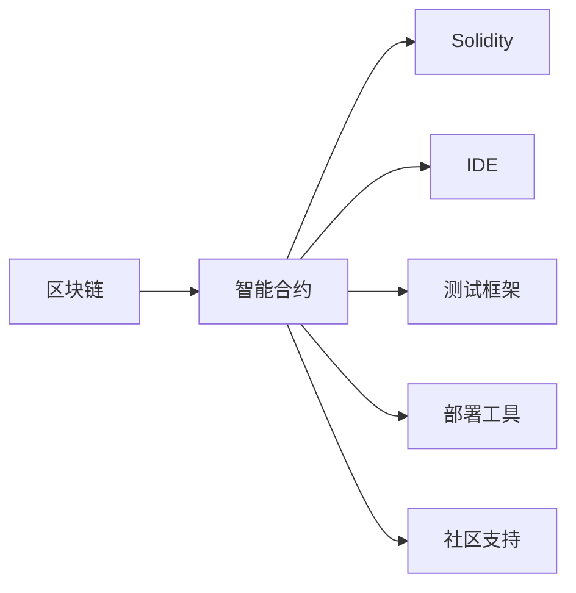
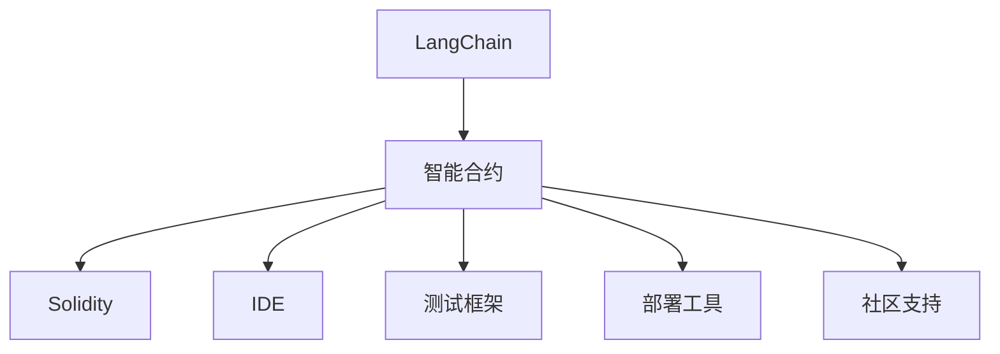
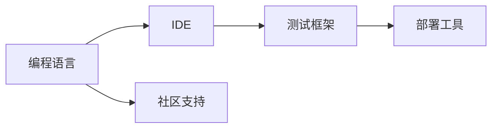
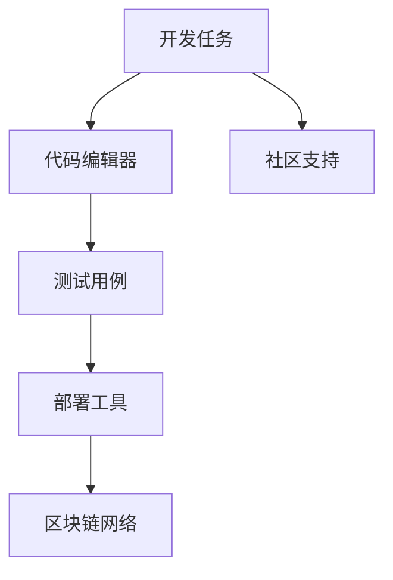
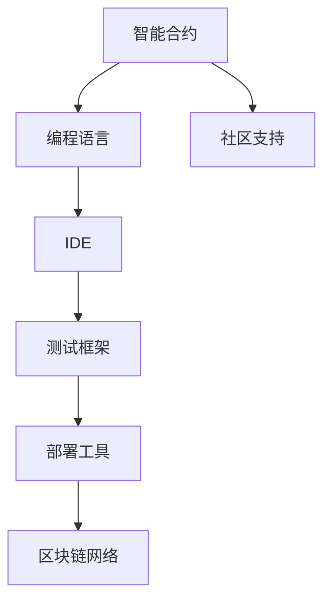

                 

# 【LangChain编程：从入门到实践】链的构建

> 关键词：LangChain,区块链,编程,智能合约,DeFi,以太坊,Solidity,智能合约开发,编程实践

## 1. 背景介绍

### 1.1 问题由来

随着区块链技术的快速发展和应用场景的不断扩展，智能合约成为区块链中不可或缺的重要组件。智能合约能够自动执行合约条款，确保交易的透明性和安全性。传统的智能合约通常由Solidity等编程语言实现，但是其开发和调试过程存在诸多挑战。例如，Solidity语言本身存在许多安全性问题，开发者需要进行大量的测试和安全审计才能确保合约的安全性。此外，由于智能合约部署在区块链上，一旦部署成功，便无法进行修改，因此需要谨慎设计合同的结构和功能。

为了解决这些问题，LangChain应运而生。LangChain是一个基于区块链的编程平台，它提供了一套完整的工具链，帮助开发者在区块链上快速构建、测试和部署智能合约。LangChain的核心思想是让智能合约的开发和部署变得简单易用，使更多的开发者能够参与到区块链的开发和应用中来。

### 1.2 问题核心关键点

LangChain的核心目标是提供一个易于使用的编程平台，使开发者能够快速构建和部署智能合约。LangChain包含以下几个关键点：

- **编程语言**：LangChain支持Solidity等常见的区块链编程语言。
- **IDE集成**：提供集成的IDE环境，帮助开发者编写、测试和调试智能合约。
- **测试框架**：提供一套测试框架，帮助开发者进行自动化测试。
- **部署工具**：提供简单易用的部署工具，帮助开发者将智能合约部署到区块链上。
- **社区支持**：提供活跃的社区支持，帮助开发者解决在开发和部署过程中遇到的问题。

这些关键点共同构成了LangChain的核心功能，使智能合约的开发和部署变得更加容易和高效。

### 1.3 问题研究意义

LangChain的出现，为区块链智能合约的开发和部署提供了一套完整的解决方案，使更多的开发者能够参与到区块链技术的开发和应用中来。这将极大地推动区块链技术的发展和普及，为区块链行业带来新的创新和应用场景。

## 2. 核心概念与联系

### 2.1 核心概念概述

为了更好地理解LangChain的功能和特点，本节将介绍几个密切相关的核心概念：

- **区块链**：一种分布式数据库技术，通过去中心化的方式记录和验证交易数据。
- **智能合约**：一种在区块链上自动执行的合约，能够根据预设条件自动执行合约条款。
- **Solidity**：一种用于编写智能合约的编程语言，广泛应用于区块链开发中。
- **IDE**：集成开发环境，提供代码编辑器、调试器、测试框架等工具，帮助开发者编写和调试代码。
- **测试框架**：用于编写和执行测试用例，确保智能合约的正确性和安全性。
- **部署工具**：帮助开发者将智能合约部署到区块链上，简化部署流程。
- **社区支持**：提供活跃的社区支持，帮助开发者解决在开发和部署过程中遇到的问题。

这些核心概念之间的逻辑关系可以通过以下Mermaid流程图来展示：



这个流程图展示了大语言模型微调过程中各个核心概念的关系和作用。

### 2.2 概念间的关系

这些核心概念之间存在着紧密的联系，形成了LangChain的完整生态系统。下面我们通过几个Mermaid流程图来展示这些概念之间的关系。

#### 2.2.1 LangChain的架构



这个流程图展示了LangChain的架构，从区块链到智能合约，再到Solidity、IDE、测试框架、部署工具和社区支持，共同构成了LangChain的核心功能。

#### 2.2.2 LangChain的功能



这个流程图展示了LangChain提供的功能，包括编程语言、IDE、测试框架、部署工具和社区支持。

#### 2.2.3 LangChain的开发流程



这个流程图展示了LangChain的开发流程，从开发任务到代码编辑器、测试用例、部署工具和区块链网络，再到社区支持，共同构成了LangChain的开发流程。

### 2.3 核心概念的整体架构

最后，我们用一个综合的流程图来展示这些核心概念在大语言模型微调过程中的整体架构：



这个综合流程图展示了从智能合约到编程语言、IDE、测试框架、部署工具和区块链网络，再到社区支持，共同构成了LangChain的完整架构。

## 3. 核心算法原理 & 具体操作步骤
### 3.1 算法原理概述

LangChain的核心算法原理是基于区块链的编程和智能合约开发。其核心思想是通过一套完整的工具链，帮助开发者在区块链上快速构建、测试和部署智能合约。LangChain的算法原理包括以下几个关键步骤：

1. **编程语言支持**：LangChain支持Solidity等常见的区块链编程语言，使得开发者可以选择自己熟悉的编程语言进行智能合约的开发。
2. **IDE集成**：LangChain提供集成的IDE环境，帮助开发者编写、测试和调试智能合约。
3. **测试框架**：LangChain提供一套测试框架，帮助开发者进行自动化测试，确保智能合约的正确性和安全性。
4. **部署工具**：LangChain提供简单易用的部署工具，帮助开发者将智能合约部署到区块链上。
5. **社区支持**：LangChain提供活跃的社区支持，帮助开发者解决在开发和部署过程中遇到的问题。

### 3.2 算法步骤详解

以下是LangChain的完整开发流程，包括编程、测试和部署三个主要步骤：

#### 3.2.1 编程

1. **环境配置**：安装LangChain IDE和其他开发工具，如Git、Docker等。
2. **编写代码**：在IDE中编写Solidity代码，定义智能合约的结构和功能。
3. **代码测试**：在IDE中编写测试用例，使用测试框架进行自动化测试。

#### 3.2.2 测试

1. **单元测试**：编写单元测试用例，测试智能合约的各个部分是否正常工作。
2. **集成测试**：编写集成测试用例，测试智能合约的各个部分是否协同工作。
3. **安全审计**：使用安全审计工具，对智能合约进行安全审计，确保其不存在漏洞。

#### 3.2.3 部署

1. **合约部署**：使用部署工具将智能合约部署到区块链上。
2. **合约验证**：验证合约是否正常工作，确保其符合预期。

### 3.3 算法优缺点

LangChain的算法具有以下几个优点：

1. **易于使用**：LangChain提供集成的IDE环境、测试框架和部署工具，使得智能合约的开发和部署变得简单易用。
2. **安全性高**：LangChain提供自动化测试和安全审计工具，帮助开发者发现和修复漏洞，确保智能合约的安全性。
3. **效率高**：LangChain提供自动化的测试和部署工具，使开发过程更加高效。
4. **社区支持**：LangChain提供活跃的社区支持，帮助开发者解决在开发和部署过程中遇到的问题。

LangChain的算法也存在一些缺点：

1. **依赖区块链**：LangChain的开发和部署依赖于区块链技术，使得开发和部署过程变得复杂。
2. **安全性问题**：Solidity等编程语言本身存在许多安全性问题，开发者需要进行大量的测试和安全审计才能确保合约的安全性。
3. **部署成本高**：区块链上的部署成本较高，需要消耗大量的Gas费用。

### 3.4 算法应用领域

LangChain的算法原理可以应用于多个领域，包括：

1. **DeFi应用**：使用智能合约实现去中心化的金融应用，如借贷、交易等。
2. **供应链管理**：使用智能合约实现供应链的自动化管理，如货物追踪、合同管理等。
3. **版权保护**：使用智能合约实现版权的保护和管理，如数字版权、版税分配等。
4. **投票系统**：使用智能合约实现去中心化的投票系统，如选举、决策等。

## 4. 数学模型和公式 & 详细讲解 & 举例说明

### 4.1 数学模型构建

LangChain的数学模型主要涉及区块链和智能合约的构建。以下是LangChain的数学模型构建：

1. **区块链模型**：
   - 区块链是一种去中心化的分布式数据库技术，通过加密哈希算法保证数据的安全性和不可篡改性。
   - 区块链由多个区块组成，每个区块包含一组交易数据和前一个区块的哈希值。

2. **智能合约模型**：
   - 智能合约是一种自动执行的合约，能够根据预设条件自动执行合约条款。
   - 智能合约通常由Solidity等编程语言实现，定义了合约的结构和功能。

3. **编程语言模型**：
   - 编程语言是智能合约的编写工具，Solidity是目前应用最广泛的区块链编程语言。
   - Solidity语言支持变量、函数、结构体等基本数据类型，能够实现复杂的智能合约功能。

### 4.2 公式推导过程

以下是LangChain的数学模型构建和公式推导过程：

1. **区块链模型**：
   - 设第 $i$ 个区块的哈希值为 $H_i$，第 $i+1$ 个区块的哈希值为 $H_{i+1}$，则区块链的哈希链满足：
     - $H_{i+1} = H_i + \text{Transaction}_i$
     - $H_{i+1} = \text{Hash}(H_i + \text{Transaction}_i)$

2. **智能合约模型**：
   - 设智能合约的结构为 $\mathcal{C} = \{C_1, C_2, \ldots, C_n\}$，其中 $C_i$ 为第 $i$ 个智能合约的功能模块。
   - 设智能合约的功能为 $F = \{F_1, F_2, \ldots, F_m\}$，其中 $F_i$ 为第 $i$ 个智能合约的功能。

3. **编程语言模型**：
   - 设编程语言为 $\mathcal{L}$，则智能合约的编程模型为 $\mathcal{M} = \{M_1, M_2, \ldots, M_n\}$，其中 $M_i$ 为第 $i$ 个智能合约的编程代码。

### 4.3 案例分析与讲解

以下是一个简单的智能合约案例，使用Solidity语言编写：

```solidity
pragma solidity ^0.8.0;

contract Ownership {
    address private owner;

    constructor() {
        owner = msg.sender;
    }

    function transfer(address newOwner) public {
        require(owner == msg.sender);
        owner = newOwner;
    }

    function isOwner(address account) public view returns (bool) {
        return owner == account;
    }
}
```

这个智能合约定义了所有者（Owner）的功能，包括设置所有者、转让所有权和检查所有者。在实际应用中，这个智能合约可以用于管理资产所有权，确保只有资产的所有者才能转让资产。

## 5. 项目实践：代码实例和详细解释说明

### 5.1 开发环境搭建

以下是LangChain的开发环境搭建流程：

1. **安装LangChain IDE**：从官网下载并安装LangChain IDE。
2. **配置环境变量**：配置环境变量，如Solidity编译器和区块链网络地址。
3. **编写智能合约**：在IDE中编写Solidity代码，定义智能合约的结构和功能。

### 5.2 源代码详细实现

以下是使用LangChain IDE编写的智能合约代码实现：

```solidity
pragma solidity ^0.8.0;

contract Ownership {
    address private owner;

    constructor() {
        owner = msg.sender;
    }

    function transfer(address newOwner) public {
        require(owner == msg.sender);
        owner = newOwner;
    }

    function isOwner(address account) public view returns (bool) {
        return owner == account;
    }
}
```

这个智能合约定义了所有者（Owner）的功能，包括设置所有者、转让所有权和检查所有者。在实际应用中，这个智能合约可以用于管理资产所有权，确保只有资产的所有者才能转让资产。

### 5.3 代码解读与分析

以下是代码的解读与分析：

1. **函数声明**：函数声明包括函数名、参数列表和返回类型。例如，`function transfer(address newOwner) public` 表示定义了一个名为 `transfer` 的公共函数，参数为 `newOwner`，返回值为布尔类型。

2. **变量声明**：变量声明包括变量名和初始值。例如，`address private owner;` 表示定义了一个名为 `owner` 的私有变量，类型为 `address`，初始值为 `msg.sender`。

3. **函数实现**：函数实现包括函数体和执行逻辑。例如，`function transfer(address newOwner) public { require(owner == msg.sender); owner = newOwner; }` 表示实现了一个名为 `transfer` 的公共函数，要求调用者必须为所有者，然后将所有权转让给新所有者。

4. **公共函数**：公共函数可以由任何人调用，例如 `isOwner` 函数可以用于检查资产的所有者是否为调用者。

5. **变量声明**：变量声明包括变量名和初始值。例如，`address private owner;` 表示定义了一个名为 `owner` 的私有变量，类型为 `address`，初始值为 `msg.sender`。

### 5.4 运行结果展示

以下是智能合约的运行结果展示：

1. **部署智能合约**：使用部署工具将智能合约部署到区块链上。
2. **调用智能合约**：使用测试用例调用智能合约的函数，验证其功能是否正常工作。
3. **查看智能合约状态**：在区块链上查看智能合约的状态，确保其符合预期。

## 6. 实际应用场景

### 6.1 DeFi应用

DeFi（去中心化金融）是区块链上的一种金融应用，使用智能合约实现借贷、交易等功能。以下是DeFi应用的使用场景：

1. **借贷应用**：使用智能合约实现去中心化的借贷应用，借款人可以在区块链上申请贷款，贷款人可以通过智能合约自动放贷、收取利息和偿还贷款。
2. **交易应用**：使用智能合约实现去中心化的交易应用，交易双方可以在区块链上自动执行交易合约，确保交易的透明性和安全性。

### 6.2 供应链管理

供应链管理是区块链上的一种管理应用，使用智能合约实现货物追踪、合同管理等功能。以下是供应链管理的使用场景：

1. **货物追踪**：使用智能合约实现货物的追踪和监控，确保货物的安全和时效性。
2. **合同管理**：使用智能合约实现供应链合同的管理和执行，确保合同的透明性和安全性。

### 6.3 版权保护

版权保护是区块链上的一种保护应用，使用智能合约实现版权的保护和管理。以下是版权保护的使用场景：

1. **数字版权**：使用智能合约实现数字版权的保护和管理，确保数字内容的版权和收益。
2. **版税分配**：使用智能合约实现版税的分配和管理，确保作者和权利人得到应有的收益。

### 6.4 投票系统

投票系统是区块链上的一种应用，使用智能合约实现去中心化的投票。以下是投票系统的使用场景：

1. **选举应用**：使用智能合约实现去中心化的选举应用，确保选举的透明性和公正性。
2. **决策应用**：使用智能合约实现去中心化的决策应用，确保决策的透明性和公正性。

## 7. 工具和资源推荐

### 7.1 学习资源推荐

为了帮助开发者系统掌握LangChain的功能和特点，以下是一些优质的学习资源：

1. **LangChain官方文档**：LangChain的官方文档提供了完整的编程指南和示例，是学习LangChain的最佳资料。
2. **Solidity官方文档**：Solidity官方文档提供了Solidity语言的完整文档和示例，是学习Solidity编程的最佳资料。
3. **区块链开发教程**：区块链开发教程提供了区块链开发的完整教程和示例，是学习区块链开发的最佳资料。

### 7.2 开发工具推荐

以下是LangChain开发所需的工具：

1. **LangChain IDE**：LangChain IDE提供了集成的开发环境，包括代码编辑器、调试器、测试框架等工具。
2. **Git**：Git是版本控制系统，用于管理代码版本和协作开发。
3. **Docker**：Docker是一种容器化技术，用于打包和部署应用。
4. **Solidity编译器**：Solidity编译器用于编译Solidity代码并生成字节码。

### 7.3 相关论文推荐

以下是几篇有关LangChain和智能合约的论文，推荐阅读：

1. "Programming the Blockchain: The Promise of Smart Contracts"：这论文介绍了智能合约的发展历程和未来方向，是学习智能合约的最佳资料。
2. "Solidity Security Patterns"：这论文介绍了Solidity语言的安全性和最佳实践，是学习Solidity编程的最佳资料。
3. "Blockchain Programming in Solidity"：这论文介绍了区块链编程和智能合约开发的完整流程，是学习区块链开发的最佳资料。

## 8. 总结：未来发展趋势与挑战

### 8.1 研究成果总结

LangChain的出现，为区块链智能合约的开发和部署提供了一套完整的解决方案，使更多的开发者能够参与到区块链技术的开发和应用中来。LangChain的核心思想是让智能合约的开发和部署变得简单易用，使区块链技术更加普及和广泛应用。

### 8.2 未来发展趋势

展望未来，LangChain将呈现以下几个发展趋势：

1. **生态系统完善**：LangChain将进一步完善其生态系统，提供更多的开发工具和社区支持。
2. **智能合约标准化**：LangChain将推动智能合约的标准化，制定统一的智能合约开发规范。
3. **区块链普及**：LangChain将推动区块链技术的普及和应用，使更多的人能够参与到区块链的开发和应用中来。

### 8.3 面临的挑战

尽管LangChain在区块链智能合约的开发和部署方面做出了重要贡献，但仍面临以下挑战：

1. **安全性问题**：Solidity等编程语言本身存在许多安全性问题，需要开发者进行大量的测试和安全审计才能确保合约的安全性。
2. **部署成本高**：区块链上的部署成本较高，需要消耗大量的Gas费用。
3. **社区支持不足**：LangChain的社区支持仍需进一步加强，帮助开发者解决在开发和部署过程中遇到的问题。

### 8.4 研究展望

未来，LangChain需要在以下几个方面进行深入研究：

1. **智能合约安全性**：开发更多的智能合约安全性工具，帮助开发者发现和修复漏洞。
2. **区块链网络优化**：优化区块链网络，提高智能合约的执行效率和安全性。
3. **社区支持**：加强社区支持，建立完善的社区生态系统。

## 9. 附录：常见问题与解答

**Q1：LangChain是否支持其他编程语言？**

A: LangChain目前主要支持Solidity等区块链编程语言，未来可能会支持更多编程语言。

**Q2：使用LangChain开发智能合约需要哪些技能？**

A: 使用LangChain开发智能合约需要具备区块链和编程语言的基础知识，如Solidity语言、区块链网络等。

**Q3：LangChain的社区支持有哪些？**

A: LangChain提供活跃的社区支持，包括开发者社区、技术交流群、在线问答等。

**Q4：LangChain的部署成本高吗？**

A: LangChain的部署成本相对较高，需要消耗大量的Gas费用。

**Q5：LangChain是否支持多链部署？**

A: LangChain目前支持单链部署，未来可能会支持多链部署。

---

作者：禅与计算机程序设计艺术 / Zen and the Art of Computer Programming

