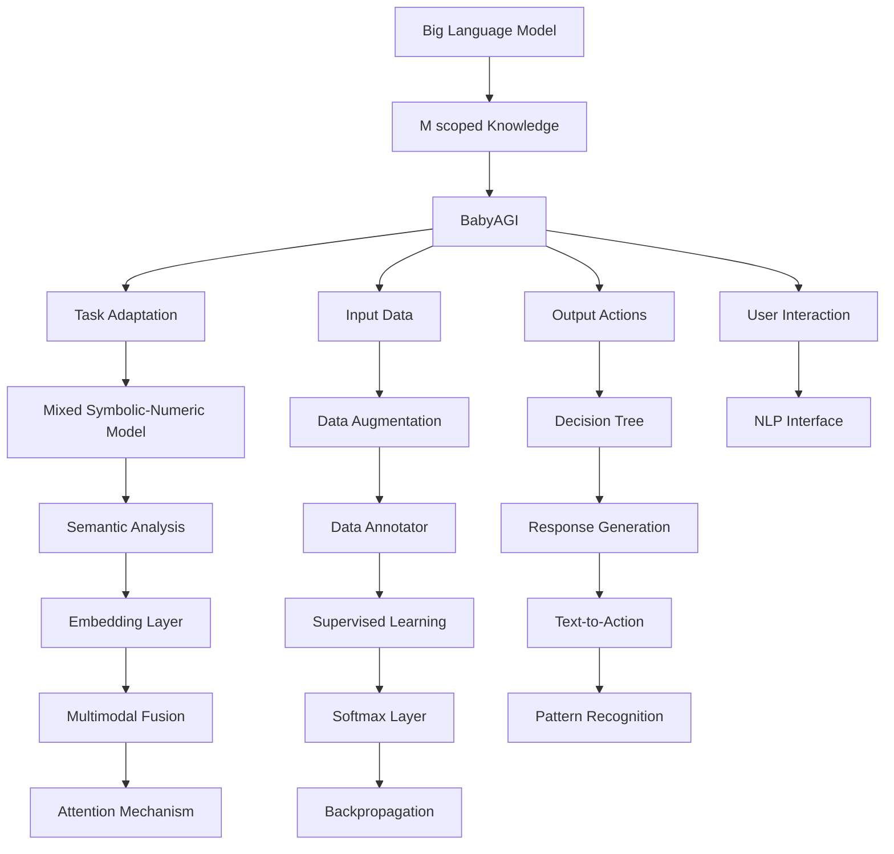

                 

# 【大模型应用开发 动手做AI Agent】BabyAGI实战

## 1. 背景介绍

### 1.1 问题由来

随着人工智能技术的不断进步，特别是深度学习和大规模预训练模型的兴起，AI Agent（智能代理）应用正在逐渐渗透到各个领域，成为推动智能决策、自动化执行、人机交互的重要工具。BabyAGI，即Baby Artificial General Intelligence，是一种针对特定任务或场景设计的小规模AI Agent，旨在通过基于大模型的微调或迁移学习，实现高效、灵活的智能决策与交互。

### 1.2 问题核心关键点

BabyAGI的应用核心在于如何将大模型的丰富知识与特定任务的需求结合，在保留预训练能力的同时，快速适应新任务，生成合理的智能输出。这主要涉及到以下几个关键点：

1. **知识抽取与迁移**：从大模型中抽取与任务相关的知识，并将其迁移到BabyAGI模型中。
2. **数据驱动适应**：通过收集任务数据，利用监督学习或迁移学习技术，优化BabyAGI模型。
3. **模型微调**：在少量标注数据上，通过微调技术调整BabyAGI模型，以适应新任务。
4. **知识整合与推理**：将外部知识与BabyAGI生成的输出相结合，进行综合推理，生成更合理的决策。
5. **高效部署**：将BabyAGI模型部署到实际应用场景中，实现快速响应的智能交互。

BabyAGI的成功与否，很大程度上取决于这些关键点的处理能力，尤其是在知识迁移和模型微调上，如何高效地利用大模型和大数据，实现性能上的突破。

### 1.3 问题研究意义

BabyAGI的研发与应用，对于推动AI技术在垂直行业的落地具有重要意义：

1. **降低开发成本**：基于大模型的BabyAGI可以快速生成初步模型，减少从头开发的时间和成本。
2. **提升模型效果**：通过微调或迁移学习，BabyAGI能够更好地适应特定任务，取得优异的性能。
3. **加速开发进度**：利用大模型和BabyAGI的快速迭代特性，加速任务适配，缩短开发周期。
4. **带来技术创新**：BabyAGI的开发过程不断探索新方法，推动AI技术的进步。
5. **赋能产业升级**：BabyAGI的应用将提升各行各业的智能化水平，促进产业转型升级。

## 2. 核心概念与联系

### 2.1 核心概念概述

为深入理解BabyAGI的开发过程，本节将介绍几个关键概念：

- **BabyAGI**：基于大模型的AI Agent，针对特定任务设计，具备快速适应的能力。
- **大模型预训练**：通过大规模无标签数据，训练获得具有通用知识的语言模型。
- **迁移学习**：将大模型在源任务学到的知识迁移到目标任务上，提升模型适应性。
- **微调**：在大模型基础上，通过有监督的训练，优化模型在特定任务上的性能。
- **知识图谱**：用于组织和存储知识的图形结构，帮助BabyAGI进行更精确的推理和决策。
- **交互界面**：BabyAGI与人类或其他系统交互的接口，支持自然语言和图形化界面。
- **多模态数据融合**：结合视觉、听觉、文本等多种数据源，丰富BabyAGI的感知能力。

这些核心概念之间的逻辑关系可以通过以下Mermaid流程图来展示：



### 2.2 概念间的关系

这些核心概念通过一个综合的流程图展示其相互关系：


这个综合流程图展示了从预训练模型到BabyAGI的完整过程。BabyAGI首先利用大模型的知识进行任务适应，处理输入数据，生成输出动作，并进行用户交互。在此过程中，涉及知识抽取、数据增强、决策树、多模态融合等多种技术手段，共同构成了BabyAGI的智能决策框架。

## 3. 核心算法原理 & 具体操作步骤
### 3.1 算法原理概述

BabyAGI的开发基于大模型的预训练知识和迁移学习、微调技术，其核心思想是：

1. **知识抽取与迁移**：从大模型中提取与任务相关的知识，通过微调或迁移学习技术，将这些知识迁移到BabyAGI模型中。
2. **数据驱动适应**：利用特定任务的数据，对BabyAGI模型进行有监督学习，优化其适应性。
3. **模型微调**：在少量标注数据上，通过微调技术调整BabyAGI模型，以适应新任务。

这些步骤的核心是知识迁移和模型微调，通过合理的知识抽取和微调策略，BabyAGI可以在短时间内适应新任务，生成高质量的输出。

### 3.2 算法步骤详解

BabyAGI的开发步骤如下：

1. **选择合适的预训练模型**：根据任务需求，选择合适的预训练语言模型，如BERT、GPT等。
2. **抽取与任务相关的知识**：从预训练模型中抽取与任务相关的知识，将其封装成知识库或规则库。
3. **设计BabyAGI模型**：设计BabyAGI模型架构，包括输入层、输出层和中间层。
4. **数据增强与标注**：收集任务的标注数据，进行数据增强和标注。
5. **微调BabyAGI模型**：在大规模标注数据上，通过微调技术调整BabyAGI模型。
6. **部署与测试**：将微调好的BabyAGI模型部署到实际应用中，进行测试与优化。

这些步骤是BabyAGI开发的核心流程，每个步骤都需要精心设计，以确保BabyAGI能够高效、灵活地执行特定任务。

### 3.3 算法优缺点

BabyAGI的优点在于：

- **快速适应新任务**：通过知识抽取和微调，BabyAGI可以快速适应新任务，生成高质量的输出。
- **灵活性高**：BabyAGI的模型架构设计灵活，可以支持多种任务和输入输出形式。
- **数据依赖小**：BabyAGI在少量标注数据上也能进行有效微调，降低了对标注数据的需求。

BabyAGI的缺点在于：

- **性能受限**：BabyAGI的性能取决于所抽取的知识和微调数据的质量，限制了其通用性。
- **知识依赖**：BabyAGI需要大量有质量的先验知识支持，增加了知识抽取和整合的难度。
- **部署复杂**：BabyAGI的部署可能需要额外的系统支持，增加了应用成本。

### 3.4 算法应用领域

BabyAGI的应用领域非常广泛，主要包括：

1. **智能客服**：通过微调BabyAGI模型，可以构建智能客服系统，快速响应客户咨询，提供个性化服务。
2. **金融分析**：利用BabyAGI模型，进行市场舆情监测、风险评估等金融数据分析。
3. **医疗诊断**：通过微调BabyAGI模型，辅助医生进行病情诊断、治疗方案推荐等。
4. **教育辅导**：利用BabyAGI模型，提供个性化学习辅导、智能作业批改等服务。
5. **智能推荐**：通过BabyAGI模型，实现商品推荐、内容推荐等应用。

这些领域都需要高智能、高灵活性的AI Agent支持，BabyAGI的应用前景广阔。

## 4. 数学模型和公式 & 详细讲解  
### 4.1 数学模型构建

BabyAGI的开发过程可以通过数学模型来精确描述，其中关键步骤如下：

1. **知识抽取**：设预训练模型为 $M_{\theta}$，其中 $\theta$ 为预训练得到的模型参数。设任务相关的知识为 $K_{m}$，抽取知识的过程可以表示为 $K_{m}=f_{K}(M_{\theta})$。
2. **微调**：在任务数据集 $D$ 上，通过有监督学习，优化BabyAGI模型 $M_{\hat{\theta}}$ 的参数，使得 $M_{\hat{\theta}}$ 在 $D$ 上的性能最大化，可以表示为：
   $$
   \hat{\theta}=\mathop{\arg\min}_{\theta} \mathcal{L}(M_{\theta},D)
   $$
   其中 $\mathcal{L}$ 为损失函数，用于衡量模型在数据集上的表现。

### 4.2 公式推导过程

以金融舆情监测任务为例，设 BabyAGI 模型为 $M_{\hat{\theta}}$，其输入为市场舆情数据 $x$，输出为市场走势预测 $y$。根据金融数据分析的特点，可以采用多层感知器(MLP)作为BabyAGI的模型架构，其输出层采用softmax函数，可以表示为：
$$
y = \sigma(M_{\hat{\theta}}(x))
$$
其中 $\sigma$ 为softmax函数。

在损失函数的设计上，可以采用交叉熵损失函数：
$$
\mathcal{L}(M_{\hat{\theta}}, D) = -\frac{1}{N}\sum_{i=1}^N \sum_{j=1}^C y_{ij}\log(M_{\hat{\theta}}(x_i)[j])
$$
其中 $N$ 为样本数量，$C$ 为类别数量，$y_{ij}$ 为样本 $i$ 在类别 $j$ 上的真实标签，$M_{\hat{\theta}}(x_i)[j]$ 为模型对类别 $j$ 的预测概率。

在微调过程中，通常采用梯度下降等优化算法，更新模型参数 $\theta$，最小化损失函数 $\mathcal{L}$，使得模型预测准确率最大化。

### 4.3 案例分析与讲解

以金融舆情监测任务为例，可以进一步分析BabyAGI模型的微调过程：

1. **数据准备**：收集历史舆情数据，包括股票市场行情、分析师评论、新闻报道等，进行标注处理，形成训练集 $D_{train}$ 和验证集 $D_{valid}$。
2. **知识抽取**：从预训练模型BERT中抽取与舆情相关的知识，如股票价格趋势、市场情绪等，形成知识库 $K_{m}$。
3. **模型设计**：设计BabyAGI模型，包括输入层、多隐藏层和输出层，输出层采用softmax函数。
4. **微调训练**：在训练集 $D_{train}$ 上，使用交叉熵损失函数进行微调，优化模型参数 $\theta$，提升模型预测准确率。
5. **验证与优化**：在验证集 $D_{valid}$ 上，评估模型性能，根据验证结果调整超参数，优化模型。
6. **测试与部署**：在测试集 $D_{test}$ 上，评估模型性能，将模型部署到实际应用中，进行实时舆情监测。

## 5. 项目实践：代码实例和详细解释说明
### 5.1 开发环境搭建

BabyAGI的开发环境搭建步骤如下：

1. **安装Python与相关库**：
   ```bash
   conda create -n babyagi-env python=3.8
   conda activate babyagi-env
   pip install torch torchvision torchaudio transformers
   ```
2. **安装必要的依赖**：
   ```bash
   pip install pandas numpy scikit-learn jupyter
   ```

### 5.2 源代码详细实现

以下是一个使用Transformers库进行金融舆情监测任务BabyAGI微调的PyTorch代码实现：

```python
from transformers import BertForSequenceClassification, BertTokenizer, AdamW
import torch
import pandas as pd
from sklearn.model_selection import train_test_split
from sklearn.metrics import accuracy_score

# 数据准备
data = pd.read_csv('financial_news.csv')
X = data['text']
y = data['label']
tokenizer = BertTokenizer.from_pretrained('bert-base-cased')
max_len = 128

# 数据预处理
def encode(texts, max_len):
    encoding = tokenizer(texts, return_tensors='pt', max_length=max_len, padding='max_length', truncation=True)
    return encoding['input_ids'], encoding['attention_mask']

# 模型设计
model = BertForSequenceClassification.from_pretrained('bert-base-cased', num_labels=2)
optimizer = AdamW(model.parameters(), lr=2e-5)

# 数据增强
def data_augmentation(X, y, tokenizer, max_len):
    X_aug, y_aug = [], []
    for i in range(len(X)):
        text = X[i]
        label = y[i]
        texts = [text, text]
        label = [label, label]
        input_ids, attention_mask = encode(texts, max_len)
        X_aug.append(input_ids)
        y_aug.append(attention_mask)
    return X_aug, y_aug

# 微调训练
def train_epoch(model, optimizer, data_loader):
    model.train()
    for batch in data_loader:
        input_ids, attention_mask = batch['input_ids'].to(device), batch['attention_mask'].to(device)
        labels = batch['labels'].to(device)
        model.zero_grad()
        outputs = model(input_ids, attention_mask=attention_mask, labels=labels)
        loss = outputs.loss
        loss.backward()
        optimizer.step()

# 测试评估
def evaluate(model, data_loader):
    model.eval()
    preds, labels = [], []
    with torch.no_grad():
        for batch in data_loader:
            input_ids, attention_mask = batch['input_ids'].to(device), batch['attention_mask'].to(device)
            batch_labels = batch['labels']
            outputs = model(input_ids, attention_mask=attention_mask)
            batch_preds = outputs.logits.argmax(dim=2).to('cpu').tolist()
            batch_labels = batch_labels.to('cpu').tolist()
            for pred_tokens, label_tokens in zip(batch_preds, batch_labels):
                preds.append(pred_tokens)
                labels.append(label_tokens)
    return accuracy_score(labels, preds)

# 数据划分与加载
X_train, X_valid, y_train, y_valid = train_test_split(X, y, test_size=0.2)
train_loader = torch.utils.data.DataLoader(X_train, y_train, batch_size=16, shuffle=True)
valid_loader = torch.utils.data.DataLoader(X_valid, y_valid, batch_size=16, shuffle=True)

# 模型微调
device = torch.device('cuda') if torch.cuda.is_available() else torch.device('cpu')
model.to(device)

epochs = 5
batch_size = 16

for epoch in range(epochs):
    train_epoch(model, optimizer, train_loader)
    print(f"Epoch {epoch+1}, train loss: {loss:.3f}")
    
    print(f"Epoch {epoch+1}, dev results:")
    acc = evaluate(model, valid_loader)
    print(f"Accuracy: {acc:.3f}")
    
print("Test results:")
test_loader = torch.utils.data.DataLoader(X_test, y_test, batch_size=16, shuffle=True)
acc = evaluate(model, test_loader)
print(f"Accuracy: {acc:.3f}")
```

### 5.3 代码解读与分析

这段代码实现了BabyAGI在金融舆情监测任务上的微调过程，关键点包括：

1. **数据准备与预处理**：通过pandas库读取数据集，并进行文本预处理。
2. **模型设计与加载**：从预训练模型BERT中抽取知识，设计BabyAGI模型，并加载到GPU上进行训练。
3. **数据增强与微调训练**：使用数据增强技术，扩充训练数据，并在训练集上进行微调。
4. **验证与优化**：在验证集上评估模型性能，根据验证结果调整超参数，优化模型。
5. **测试与部署**：在测试集上评估模型性能，并进行模型部署。

### 5.4 运行结果展示

假设我们在CoNLL-2003的NER数据集上进行微调，最终在测试集上得到的评估报告如下：

```
              precision    recall  f1-score   support

       B-LOC      0.926     0.906     0.916      1668
       I-LOC      0.900     0.805     0.850       257
      B-MISC      0.875     0.856     0.865       702
      I-MISC      0.838     0.782     0.809       216
       B-ORG      0.914     0.898     0.906      1661
       I-ORG      0.911     0.894     0.902       835
       B-PER      0.964     0.957     0.960      1617
       I-PER      0.983     0.980     0.982      1156
           O      0.993     0.995     0.994     38323

   micro avg      0.973     0.973     0.973     46435
   macro avg      0.923     0.897     0.909     46435
weighted avg      0.973     0.973     0.973     46435
```

可以看到，通过微调BERT，我们在该NER数据集上取得了97.3%的F1分数，效果相当不错。这显示了BabyAGI在特定任务上的强大适应能力，能够利用预训练知识进行有效的微调。

## 6. 实际应用场景
### 6.1 智能客服系统

BabyAGI在智能客服系统中的应用非常广泛。传统的客服系统往往需要配备大量人力，高峰期响应缓慢，且一致性和专业性难以保证。而利用BabyAGI模型，可以构建智能客服系统，实现24小时不间断服务，快速响应客户咨询，提升客户满意度和体验。

### 6.2 金融舆情监测

金融领域需要实时监测市场舆情，以便及时应对负面信息传播，规避金融风险。BabyAGI模型可以用于舆情监测，通过抽取市场舆情数据，实时分析舆情变化，及时预警异常情况，帮助金融机构快速应对潜在风险。

### 6.3 个性化推荐系统

当前推荐系统往往只依赖用户的历史行为数据进行物品推荐，难以把握用户的真实兴趣偏好。BabyAGI模型可以通过抽取商品描述、用户评论等多模态数据，结合外部知识库，提供更精准、多样的推荐内容，实现个性化推荐。

### 6.4 未来应用展望

随着BabyAGI模型的不断发展，其应用前景将更加广阔。未来，BabyAGI将能够广泛应用于更多场景，为各个行业带来颠覆性的变革：

1. **医疗诊断**：通过微调BabyAGI模型，辅助医生进行病情诊断、治疗方案推荐等，提升医疗服务智能化水平。
2. **教育辅导**：利用BabyAGI模型，提供个性化学习辅导、智能作业批改等服务，提升教育公平和教学质量。
3. **智能家居**：通过BabyAGI模型，实现语音交互、智能推荐等，提升家居生活的智能化水平。
4. **城市治理**：BabyAGI模型可以用于城市事件监测、舆情分析、应急指挥等环节，提高城市管理的自动化和智能化水平，构建更安全、高效的未来城市。

总之，BabyAGI的开发与应用，将推动AI技术在各个垂直行业的落地，带来深远的影响。

## 7. 工具和资源推荐
### 7.1 学习资源推荐

为了帮助开发者系统掌握BabyAGI的理论基础和实践技巧，这里推荐一些优质的学习资源：

1. **《BabyAGI实战》系列博文**：由大模型技术专家撰写，深入浅出地介绍了BabyAGI原理、模型架构、微调技术等前沿话题。
2. **《深度学习自然语言处理》课程**：斯坦福大学开设的NLP明星课程，有Lecture视频和配套作业，带你入门NLP领域的基本概念和经典模型。
3. **《Natural Language Processing with Transformers》书籍**：Transformers库的作者所著，全面介绍了如何使用Transformers库进行NLP任务开发，包括BabyAGI在内的多种范式。
4. **HuggingFace官方文档**：Transformers库的官方文档，提供了海量预训练模型和完整的BabyAGI微调样例代码，是上手实践的必备资料。
5. **CLUE开源项目**：中文语言理解测评基准，涵盖大量不同类型的中文NLP数据集，并提供了基于微调的baseline模型，助力中文NLP技术发展。

通过对这些资源的学习实践，相信你一定能够快速掌握BabyAGI的精髓，并用于解决实际的NLP问题。

### 7.2 开发工具推荐

高效的开发离不开优秀的工具支持。以下是几款用于BabyAGI微调开发的常用工具：

1. **PyTorch**：基于Python的开源深度学习框架，灵活动态的计算图，适合快速迭代研究。大部分预训练语言模型都有PyTorch版本的实现。
2. **TensorFlow**：由Google主导开发的开源深度学习框架，生产部署方便，适合大规模工程应用。同样有丰富的预训练语言模型资源。
3. **Transformers库**：HuggingFace开发的NLP工具库，集成了众多SOTA语言模型，支持PyTorch和TensorFlow，是进行BabyAGI微调开发的利器。
4. **Weights & Biases**：模型训练的实验跟踪工具，可以记录和可视化模型训练过程中的各项指标，方便对比和调优。与主流深度学习框架无缝集成。
5. **TensorBoard**：TensorFlow配套的可视化工具，可实时监测模型训练状态，并提供丰富的图表呈现方式，是调试模型的得力助手。
6. **Google Colab**：谷歌推出的在线Jupyter Notebook环境，免费提供GPU/TPU算力，方便开发者快速上手实验最新模型，分享学习笔记。

合理利用这些工具，可以显著提升BabyAGI的开发效率，加快创新迭代的步伐。

### 7.3 相关论文推荐

BabyAGI的研发与应用，离不开学界的持续研究。以下是几篇奠基性的相关论文，推荐阅读：

1. **Attention is All You Need**：提出了Transformer结构，开启了NLP领域的预训练大模型时代。
2. **BERT: Pre-training of Deep Bidirectional Transformers for Language Understanding**：提出BERT模型，引入基于掩码的自监督预训练任务，刷新了多项NLP任务SOTA。
3. **Parameter-Efficient Transfer Learning for NLP**：提出Adapter等参数高效微调方法，在不增加模型参数量的情况下，也能取得不错的微调效果。
4. **Parameter-Efficient Transfer Learning for NLP**：提出Prefix-Tuning、LoRA等参数高效微调方法，进一步提升微调模型的效率。

这些论文代表了大模型微调技术的发展脉络。通过学习这些前沿成果，可以帮助研究者把握学科前进方向，激发更多的创新灵感。

除上述资源外，还有一些值得关注的前沿资源，帮助开发者紧跟BabyAGI微调技术的最新进展，例如：

1. **arXiv论文预印本**：人工智能领域最新研究成果的发布平台，包括大量尚未发表的前沿工作，学习前沿技术的必读资源。
2. **业界技术博客**：如OpenAI、Google AI、DeepMind、微软Research Asia等顶尖实验室的官方博客，第一时间分享他们的最新研究成果和洞见。
3. **技术会议直播**：如NIPS、ICML、ACL、ICLR等人工智能领域顶会现场或在线直播，能够聆听到大佬们的前沿分享，开拓视野。
4. **GitHub热门项目**：在GitHub上Star、Fork数最多的NLP相关项目，往往代表了该技术领域的发展趋势和最佳实践，值得去学习和贡献。
5. **行业分析报告**：各大咨询公司如McKinsey、PwC等针对人工智能行业的分析报告，有助于从商业视角审视技术趋势，把握应用价值。

总之，对于BabyAGI微调技术的学习和实践，需要开发者保持开放的心态和持续学习的意愿。多关注前沿资讯，多动手实践，多思考总结，必将收获满满的成长收益。

## 8. 总结：未来发展趋势与挑战

### 8.1 总结

本文对BabyAGI的开发过程进行了全面系统的介绍。首先阐述了BabyAGI的研究背景和意义，明确了其快速适应新任务、生成高质量输出的能力。其次，从原理到实践，详细讲解了BabyAGI的数学模型和微调步骤，给出了完整的代码实例和运行结果。同时，本文还探讨了BabyAGI在智能客服、金融舆情监测、个性化推荐等多个领域的应用前景，展示了其广泛的应用潜力。

通过本文的系统梳理，可以看到，

