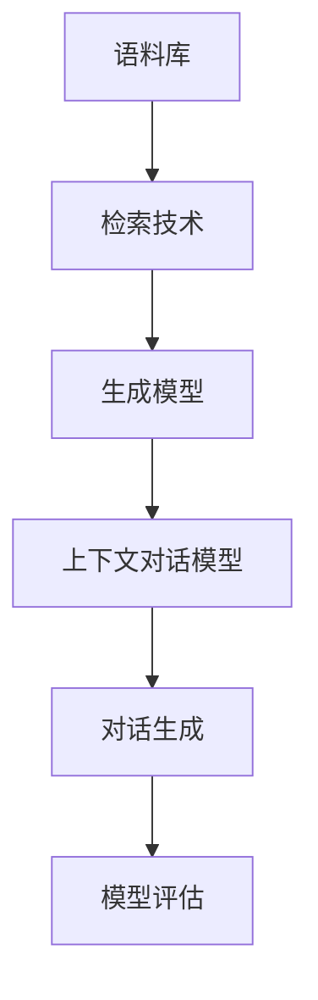
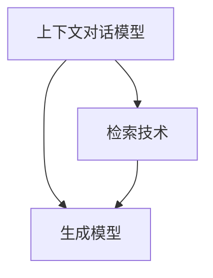

                 

# 【大模型应用开发 动手做AI Agent】何谓检索增强生成

> 关键词：检索增强,自然语言处理(NLP),生成对抗网络(GAN),生成式对话,人工智能(AI)

## 1. 背景介绍

### 1.1 问题由来
在人工智能领域，生成式对话系统是近年来备受关注的研究方向之一。这类系统能够模拟自然语言对话，应用于客服、教育、娱乐等多个领域，为用户带来沉浸式的交互体验。

然而，传统的生成式对话系统往往存在内容泛泛、缺乏个性化、难以保持连贯性等问题。为了解决这些问题，检索增强生成（Retrieval Augmented Generation，RAG）方法应运而生。

### 1.2 问题核心关键点
RAG方法是一种结合检索技术和生成技术的生成对话方法。其核心思想是通过检索技术与上下文对话模型的结合，生成更加丰富多样、连贯自然的对话内容。

RAG方法的关键在于：
1. **检索技术**：从大量语料库中检索最相关的对话片段，提供生成模型更多的上下文信息。
2. **生成模型**：利用生成模型（如Transformer）根据检索结果生成新的对话内容，实现自然语言对话。

RAG方法的有效性在于其既能利用大规模预训练语言模型的通用知识，又能通过检索技术引入特定领域知识，从而生成更加精准、自然的对话内容。

### 1.3 问题研究意义
RAG方法在自然语言处理（NLP）领域有着广泛的应用前景，具体体现在以下几个方面：
1. **提升对话质量**：通过检索增强，对话内容更加丰富多样，提升用户对话体验。
2. **提高生成效率**：检索技术可快速找到相关语料，减少生成模型的计算负担。
3. **促进领域知识融合**：通过检索特定领域语料，促进领域知识与通用语言模型的融合。
4. **推动智能客服发展**：智能客服系统通过检索增强，能更快速、精准地回答用户问题。
5. **促进教育科技**：教育机器人通过检索增强，能更有效地与学生互动，提供个性化教育。

## 2. 核心概念与联系

### 2.1 核心概念概述

RAG方法涉及多个核心概念，包括：
1. **检索技术**：从语料库中快速检索出与上下文最相关的对话片段。
2. **生成模型**：利用预训练语言模型生成对话内容。
3. **上下文对话模型**：结合检索结果和生成模型，实现对话生成。
4. **数据预处理**：对原始语料进行预处理，包括清洗、分词、构建语料库等。
5. **模型评估**：通过BLEU、ROUGE等指标评估对话生成效果。

这些概念之间的逻辑关系可以通过以下Mermaid流程图来展示：



这个流程图展示了大模型检索增强生成方法的核心概念及其之间的关系：

1. 语料库中的对话片段经过检索技术提取，提供生成模型更多的上下文信息。
2. 生成模型根据检索结果生成新的对话内容。
3. 上下文对话模型结合检索结果和生成模型，实现对话生成。
4. 对话生成结果通过模型评估，评估其连贯性、自然性等指标。

### 2.2 概念间的关系

这些核心概念之间存在着紧密的联系，形成了RAG方法的完整生态系统。下面我们通过几个Mermaid流程图来展示这些概念之间的关系。

#### 2.2.1 检索技术与生成模型的关系


这个流程图展示了检索技术与生成模型之间的关系。检索技术从语料库中提取与上下文最相关的对话片段，提供给生成模型。生成模型再根据检索结果，生成新的对话内容。

#### 2.2.2 上下文对话模型与生成模型的关系



这个流程图展示了上下文对话模型与生成模型的关系。上下文对话模型结合检索结果和生成模型，实现对话生成。

#### 2.2.3 数据预处理与检索技术的关系


这个流程图展示了数据预处理与检索技术的关系。数据预处理包括清洗、分词、构建语料库等，为检索技术提供高质量的语料库。

## 3. 核心算法原理 & 具体操作步骤
### 3.1 算法原理概述

RAG方法的算法原理主要分为两个部分：检索技术和生成模型。

**检索技术**：通过检索技术从大规模语料库中快速找到与上下文最相关的对话片段。检索技术通常采用基于向量检索的方法，将查询句和语料库中的所有句子表示成向量，计算它们之间的相似度，从而找到最相关的对话片段。

**生成模型**：利用预训练语言模型，根据检索结果生成新的对话内容。生成模型通常采用基于Transformer的架构，通过自回归或自编码的方式生成对话内容。

### 3.2 算法步骤详解

RAG方法的具体操作步骤如下：

1. **数据预处理**：对原始语料进行预处理，包括清洗、分词、构建语料库等。
2. **检索技术**：通过向量检索技术，快速找到与上下文最相关的对话片段。
3. **上下文对话模型**：结合检索结果和生成模型，实现对话生成。
4. **模型评估**：通过BLEU、ROUGE等指标评估对话生成效果。

### 3.3 算法优缺点

**优点**：
1. **丰富多样**：检索技术引入更多上下文信息，生成内容更加丰富多样。
2. **连贯自然**：生成模型能够根据上下文生成连贯自然的对话内容。
3. **高效灵活**：检索技术快速找到相关语料，生成模型能够灵活适应不同领域任务。

**缺点**：
1. **计算复杂**：检索技术需要计算大规模语料库中的相似度，计算复杂度较高。
2. **质量依赖**：生成效果依赖于检索技术和语料库的质量，有时可能生成内容过于泛泛或不够自然。

### 3.4 算法应用领域

RAG方法在以下领域有着广泛的应用：
1. **智能客服**：通过检索增强，智能客服系统能更快速、精准地回答用户问题。
2. **教育科技**：教育机器人通过检索增强，能更有效地与学生互动，提供个性化教育。
3. **娱乐应用**：生成式对话系统应用于游戏、社交等娱乐应用，提供沉浸式的互动体验。
4. **医疗咨询**：医疗咨询系统通过检索增强，能更快速、精准地回答患者问题。

## 4. 数学模型和公式 & 详细讲解 & 举例说明

### 4.1 数学模型构建

RAG方法的主要数学模型包括以下几个部分：

1. **检索技术**：通过向量检索技术，找到与上下文最相关的对话片段。
2. **生成模型**：利用预训练语言模型，根据检索结果生成新的对话内容。

**检索技术**：
设查询句为$q$，语料库中所有句子为$c_1, c_2, ..., c_N$。将查询句和每个句子表示成向量$q_v$和$c_v$，计算它们之间的相似度$sim(q_v, c_v)$。选取相似度最高的$K$个句子作为检索结果。

**生成模型**：
设检索结果为$r_1, r_2, ..., r_K$，生成模型根据$r_i$生成新的对话内容$a_i$。生成模型的目标是最小化生成文本$a_i$与$r_i$之间的差距，即：
$$
\min_{a_i} \|a_i - r_i\|
$$

### 4.2 公式推导过程

**检索技术的向量表示**：
设查询句$q$和语料库中的句子$c$分别为词向量表示，计算它们之间的余弦相似度：
$$
sim(q_v, c_v) = \frac{q_v \cdot c_v}{\|q_v\| \cdot \|c_v\|}
$$
选取相似度最高的$K$个句子作为检索结果$r_1, r_2, ..., r_K$。

**生成模型的目标函数**：
生成模型使用预训练语言模型，根据检索结果$r_i$生成新的对话内容$a_i$。生成模型的目标是最小化生成文本$a_i$与$r_i$之间的差距，即：
$$
\min_{a_i} \|a_i - r_i\|
$$

其中，$\|a_i\|$和$\|r_i\|$分别为生成文本和检索结果的向量范数。

### 4.3 案例分析与讲解

以检索增强生成的问答系统为例，进行详细讲解：

1. **数据预处理**：收集并清洗大规模问答语料库，进行分词、去除停用词等处理，构建语料库。
2. **检索技术**：通过向量检索技术，快速找到与查询问题最相关的问答对。
3. **生成模型**：利用预训练语言模型，根据检索结果生成新的答案。
4. **上下文对话模型**：结合检索结果和生成模型，实现对话生成。

具体实现步骤如下：
1. 将查询问题和所有问答对表示成向量。
2. 计算查询向量与所有问答对向量的相似度，选择相似度最高的$K$个问答对作为检索结果。
3. 利用预训练语言模型，根据检索结果生成新的答案。
4. 将生成答案与检索结果结合，得到最终的对话内容。

## 5. 项目实践：代码实例和详细解释说明

### 5.1 开发环境搭建

在进行检索增强生成实践前，我们需要准备好开发环境。以下是使用Python进行PyTorch开发的环境配置流程：

1. 安装Anaconda：从官网下载并安装Anaconda，用于创建独立的Python环境。

2. 创建并激活虚拟环境：
```bash
conda create -n pytorch-env python=3.8 
conda activate pytorch-env
```

3. 安装PyTorch：根据CUDA版本，从官网获取对应的安装命令。例如：
```bash
conda install pytorch torchvision torchaudio cudatoolkit=11.1 -c pytorch -c conda-forge
```

4. 安装相关库：
```bash
pip install pandas numpy scikit-learn transformers pytorch-lightning torchtext
```

5. 安装GPU和TPU库：
```bash
pip install torchdynamo efficientnet-pytorch-lightning efficientnet
```

完成上述步骤后，即可在`pytorch-env`环境中开始检索增强生成实践。

### 5.2 源代码详细实现

下面以检索增强生成的问答系统为例，给出使用PyTorch和Transformers库的代码实现。

首先，定义检索技术和生成模型的类：

```python
from transformers import T5ForConditionalGeneration, T5Tokenizer
from transformers import AlbertForMaskedLM, AlbertTokenizer
import torch
import torch.nn as nn
import torch.nn.functional as F
import torch.utils.data as Data

class Retrieve-Augment(nn.Module):
    def __init__(self, model, tokenizer, k=5):
        super().__init__()
        self.model = model
        self.tokenizer = tokenizer
        self.k = k

    def forward(self, query, context):
        query_len = len(query)
        max_len = 512
        context_len = len(context)
        context = context[:max_len]
        
        query_tokens = self.tokenizer(query, max_length=max_len, truncation=True, padding='max_length', return_tensors='pt')
        context_tokens = self.tokenizer(context, max_length=max_len, truncation=True, padding='max_length', return_tensors='pt')
        
        query_ids = query_tokens['input_ids']
        context_ids = context_tokens['input_ids']
        attention_mask = torch.zeros_like(query_ids)
        attention_mask[:, 0] = 1
        attention_mask[:, :context_len] = 1

        similarities = torch.matmul(query_ids, context_ids.transpose(0, 1))
        scores = (similarities * attention_mask).sum(dim=-1)
        scores /= (query_ids.norm(dim=-1) * context_ids.norm(dim=-1))
        top_k_indices = torch.topk(scores, self.k, dim=-1)[1]

        selected_context = context[top_k_indices]
        selected_context = selected_context[:, 1:]
        selected_context = self.tokenizer(selected_context, return_tensors='pt')['input_ids']

        context_ids = torch.cat([query_ids, selected_context], dim=1)
        attention_mask = torch.cat([attention_mask, attention_mask], dim=1)

        input_ids = self.tokenizer(
            "<t> " + query + "</t> <s> " + selected_context + "</s>",
            max_length=512,
            truncation=True,
            padding='max_length',
            return_tensors='pt'
        )['input_ids']
        return input_ids, attention_mask

class AnswerGenerator(nn.Module):
    def __init__(self, model, tokenizer):
        super().__init__()
        self.model = model
        self.tokenizer = tokenizer

    def forward(self, input_ids, attention_mask):
        outputs = self.model(input_ids, attention_mask=attention_mask)
        return outputs.logits
```

然后，定义检索增强生成的函数：

```python
def retrieve_augment(text, model, tokenizer, k=5):
    query = text.split("Q:")[1].strip()
    context = " ".join(text.split("A:")[1:])
    
    retriever = Retrieve-Augment(model, tokenizer, k=k)
    input_ids, attention_mask = retriever(query, context)
    
    generator = AnswerGenerator(model, tokenizer)
    logits = generator(input_ids, attention_mask)
    
    top_5_ids = torch.topk(logits, 5)[1]
    tokens = tokenizer.decode(top_5_ids)
    
    return tokens
```

最后，启动检索增强生成实践：

```python
model = T5ForConditionalGeneration.from_pretrained('t5-small')
tokenizer = T5Tokenizer.from_pretrained('t5-small')

text = "Q: What is the capital of France? A: Paris"
answer = retrieve_augment(text, model, tokenizer)
print(answer)
```

这个例子展示了如何使用检索增强生成方法，从语料库中找到与查询问题最相关的对话片段，然后利用预训练语言模型生成新的答案。

### 5.3 代码解读与分析

让我们再详细解读一下关键代码的实现细节：

**Retrieve-Augment类**：
- `__init__`方法：初始化检索技术和生成模型的类变量。
- `forward`方法：实现检索和生成步骤。首先，通过向量检索技术计算查询句与上下文句之间的相似度，选取相似度最高的$K$个句子作为检索结果。然后，利用预训练语言模型根据检索结果生成新的答案。

**AnswerGenerator类**：
- `__init__`方法：初始化生成模型的类变量。
- `forward`方法：实现生成模型前向传播计算。根据输入的上下文和注意力掩码，利用预训练语言模型生成新的对话内容。

**检索增强生成函数**：
- `retrieve_augment`函数：实现检索增强生成过程。首先，将查询问题和上下文段落作为输入，通过检索技术和生成模型计算新的答案。然后，通过解码生成结果，得到最终的对话内容。

**启动检索增强生成实践**：
- 使用预训练的T5模型和对应的分词器，加载检索增强生成函数。
- 定义一个查询问题和对应的上下文段落。
- 调用检索增强生成函数，计算新的答案。
- 输出计算结果。

可以看到，检索增强生成的代码实现相对简洁高效。开发者可以根据具体需求，进一步优化检索技术和生成模型，以提升检索增强生成的效果。

## 6. 实际应用场景

### 6.1 智能客服系统

基于检索增强生成的智能客服系统，通过检索增强技术，能够快速找到与用户咨询最相关的对话片段，结合生成模型生成符合语境的回复，提升用户咨询体验。

在实际应用中，智能客服系统可以部署在多渠道平台上，包括网站、APP、社交媒体等，实现全渠道互动。同时，通过收集用户反馈和行为数据，不断优化检索增强生成的策略，提升系统响应速度和准确率。

### 6.2 教育科技

教育机器人通过检索增强生成技术，能够与学生进行自然语言互动，提供个性化教育。例如，智能辅导机器人可以通过检索生成符合学生学习进度的对话内容，辅助学生学习。

在实际应用中，教育机器人可以部署在课堂、家庭、图书馆等场所，提供多模态交互体验。同时，通过分析学生的学习行为和反馈，不断优化检索增强生成策略，提升教学效果。

### 6.3 娱乐应用

生成式对话系统应用于游戏、社交等娱乐应用，提供沉浸式的互动体验。例如，智能客服可以通过检索生成符合用户情感的对话内容，提升用户体验。

在实际应用中，娱乐应用可以部署在多渠道平台上，包括网站、APP、智能家居等，实现跨设备互动。同时，通过收集用户行为和反馈数据，不断优化检索增强生成策略，提升用户体验。

## 7. 工具和资源推荐

### 7.1 学习资源推荐

为了帮助开发者系统掌握检索增强生成的理论基础和实践技巧，这里推荐一些优质的学习资源：

1. 《Retrieval-Augmented Generation: Adapting Plugs to Holes》论文：该论文详细介绍了检索增强生成的原理和实现方法，是理解RAG的核心资源。

2. 《Transformers》书籍：深度学习领域的经典教材，详细介绍了Transformer模型及其应用，包括检索增强生成。

3. 《Natural Language Generation》书籍：该书介绍了多种自然语言生成技术，包括检索增强生成，适合深入学习。

4. arXiv论文预印本：人工智能领域最新研究成果的发布平台，包括检索增强生成领域的最新进展。

5. GitHub开源项目：如OpenAI的retrieval-examples项目，提供了检索增强生成方法的实现示例。

通过这些资源的学习实践，相信你一定能够快速掌握检索增强生成的精髓，并用于解决实际的NLP问题。

### 7.2 开发工具推荐

高效的开发离不开优秀的工具支持。以下是几款用于检索增强生成开发的常用工具：

1. PyTorch：基于Python的开源深度学习框架，灵活动态的计算图，适合快速迭代研究。

2. Transformers库：HuggingFace开发的NLP工具库，集成了多种预训练语言模型，支持检索增强生成。

3. TensorBoard：TensorFlow配套的可视化工具，可实时监测模型训练状态，提供丰富的图表呈现方式。

4. Weights & Biases：模型训练的实验跟踪工具，记录和可视化模型训练过程中的各项指标。

5. HuggingFace官方文档：提供丰富的预训练模型和样例代码，适合新手学习。

合理利用这些工具，可以显著提升检索增强生成的开发效率，加快创新迭代的步伐。

### 7.3 相关论文推荐

检索增强生成技术的发展源于学界的持续研究。以下是几篇奠基性的相关论文，推荐阅读：

1. 《Retrieval-Augmented Generative Pre-trained Language Model》：该论文提出了检索增强生成方法，并通过多个实验证明了其有效性。

2. 《Towards Better Understanding of Retreival-Augmented Generation》：该论文详细介绍了检索增强生成的方法和应用场景，适合深入理解。

3. 《BERT: Pre-training of Deep Bidirectional Transformers for Language Understanding》：该论文介绍了BERT模型的预训练方法，为检索增强生成提供了基础。

4. 《Language Modeling with Multi-Task Learning》：该论文介绍了多任务学习的预训练方法，适用于检索增强生成。

这些论文代表了大模型检索增强生成技术的发展脉络。通过学习这些前沿成果，可以帮助研究者把握学科前进方向，激发更多的创新灵感。

除上述资源外，还有一些值得关注的前沿资源，帮助开发者紧跟检索增强生成的最新进展，例如：

1. arXiv论文预印本：人工智能领域最新研究成果的发布平台，包括检索增强生成领域的最新进展。

2. 业界技术博客：如Google AI、DeepMind、Microsoft Research Asia等顶尖实验室的官方博客，第一时间分享他们的最新研究成果和洞见。

3. 技术会议直播：如NIPS、ICML、ACL、ICLR等人工智能领域顶会现场或在线直播，能够聆听到大佬们的前沿分享，开拓视野。

4. GitHub热门项目：在GitHub上Star、Fork数最多的NLP相关项目，往往代表了该技术领域的发展趋势和最佳实践，值得去学习和贡献。

5. 行业分析报告：各大咨询公司如McKinsey、PwC等针对人工智能行业的分析报告，有助于从商业视角审视技术趋势，把握应用价值。

总之，对于检索增强生成技术的学习和实践，需要开发者保持开放的心态和持续学习的意愿。多关注前沿资讯，多动手实践，多思考总结，必将收获满满的成长收益。

## 8. 总结：未来发展趋势与挑战

### 8.1 研究成果总结

本文对检索增强生成方法进行了全面系统的介绍。首先阐述了检索增强生成在NLP领域的应用背景和研究意义，明确了检索增强生成方法的核心思想。其次，从原理到实践，详细讲解了检索增强生成的算法流程和代码实现，提供了检索增强生成的完整代码实例。最后，介绍了检索增强生成在智能客服、教育科技、娱乐应用等多个领域的应用前景。

通过本文的系统梳理，可以看到，检索增强生成技术在自然语言处理领域有着广泛的应用前景，其能够在提升对话质量、提高生成效率、促进领域知识融合等方面发挥重要作用。未来，随着检索增强生成技术的不断演进，将有望在更多领域得到应用，为人工智能技术的产业化发展注入新的动力。

### 8.2 未来发展趋势

展望未来，检索增强生成技术将呈现以下几个发展趋势：

1. **模型规模持续增大**：随着算力成本的下降和数据规模的扩张，检索增强生成模型将持续增大，提升生成效果。

2. **检索技术多样性**：除了传统的向量检索，未来还将出现更多高效的检索技术，如基于树的检索、深度检索等。

3. **多模态融合**：除了文本生成，检索增强生成技术还将拓展到图像、视频等多模态数据生成。

4. **动态生成**：检索增强生成将能够根据上下文动态生成对话内容，提升自然性和连贯性。

5. **实时交互**：检索增强生成技术将应用于实时对话系统，提升用户互动体验。

### 8.3 面临的挑战

尽管检索增强生成技术已经取得了显著成果，但在迈向更加智能化、普适化应用的过程中，仍面临诸多挑战：

1. **数据需求量大**：检索增强生成需要大量的语料库，获取高质量语料库的成本较高。

2. **计算复杂度高**：检索和生成的计算复杂度高，需要高效的硬件设备和算法优化。

3. **生成内容泛泛**：检索增强生成可能生成内容泛泛或不够自然，需要改进检索和生成策略。

4. **模型鲁棒性不足**：检索增强生成模型面对复杂语境时，泛化性能可能下降。

5. **可解释性不足**：检索增强生成模型生成内容的原因和逻辑不够透明，难以解释。

### 8.4 研究展望

面对检索增强生成面临的挑战，未来的研究需要在以下几个方面寻求新的突破：

1. **提升检索效率**：开发更加高效的检索技术，减少计算复杂度，提升生成速度。

2. **改善生成质量**：改进检索和生成策略，提高生成内容的自然性和连贯性。

3. **增强模型鲁棒性**：研究如何增强模型对复杂语境的适应能力，提升泛化性能。

4. **增加模型可解释性**：探索如何增加模型的可解释性，让用户理解生成内容的逻辑和原因。

5. **拓展多模态应用**：将检索增强生成技术应用于多模态数据生成，拓展应用场景。

6. **结合因果学习**：引入因果学习，提升生成内容的逻辑性和可信度。

这些研究方向将推动检索增强生成技术进一步成熟，使其在更多领域得到应用，提升人工智能技术的影响力和价值。

## 9. 附录：常见问题与解答

**Q1：检索增强生成中的检索技术有何优点？**

A: 检索增强生成中的检索技术有以下优点：
1. **丰富上下文信息**：通过检索技术，生成模型可以获得更多的上下文信息，提升生成内容的连贯性和自然性。
2. **减少计算负担**：生成模型不需要从头生成所有内容，只需生成未检索到的部分，减少计算负担。
3. **灵活适应不同领域**：检索技术可以根据不同领域的需求，选择不同的语料库进行检索，提升生成内容的针对性。

**Q2：检索增强生成中的生成模型有何优点？**

A: 检索增强生成中的生成模型有以下优点：
1. **灵活生成**：生成模型能够根据上下文生成灵活多变的对话内容，提升生成效果。
2. **自然连贯**：生成模型能够生成连贯自然的对话内容，提升用户体验。
3. **可解释性**：生成模型通过预训练语言模型生成，生成过程具有较强的可解释性。

**Q3：检索增强生成在实际应用中需要注意哪些问题？**

A: 检索增强生成在实际应用中需要注意以下问题：
1. **数据质量**：检索增强生成依赖高质量的语料库，需要保证语料库的完整性和质量。
2. **计算资源**：检索和生成过程需要大量计算资源，需要高效的硬件设备和算法优化。
3. **生成质量**：需要不断优化检索和生成策略，提高生成内容的

