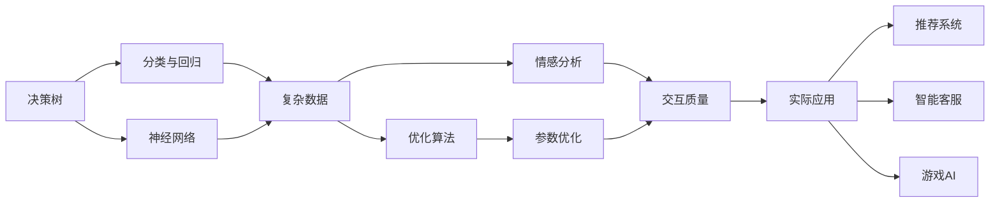
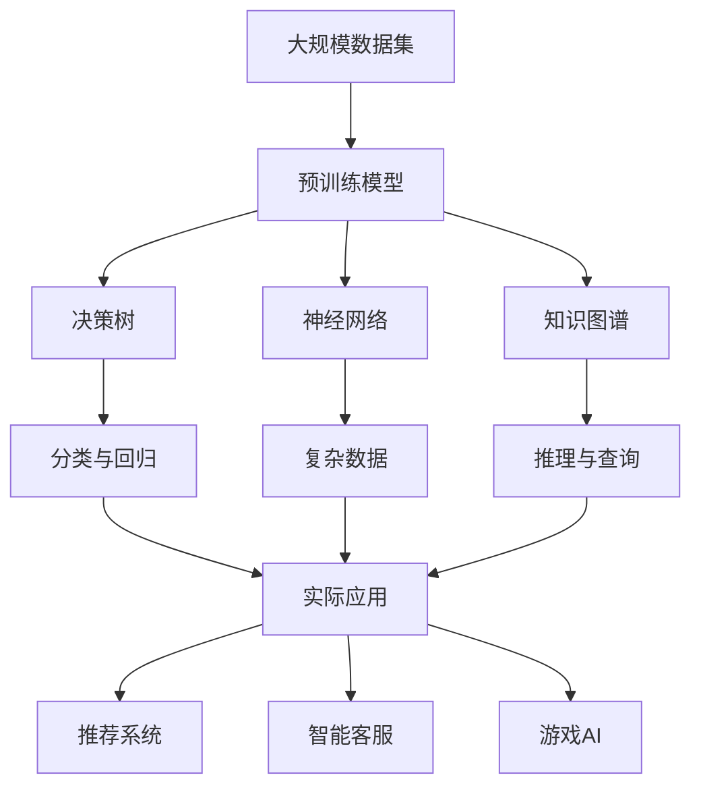

                 

# 【大模型应用开发 动手做AI Agent】其他Agent认知框架

> 关键词：大模型,Agent,认知框架,决策树,神经网络,优化算法,情感分析,知识图谱,实际应用

## 1. 背景介绍

### 1.1 问题由来
随着人工智能(AI)技术的迅猛发展，AI Agent（人工智能代理）正在成为连接人和机器的关键中间环节。AI Agent不仅能完成复杂的决策和推理任务，还能够处理自然语言、视觉、声音等多种数据源，以实现更智能的交互和控制。

在AI Agent的开发过程中，如何构建合理的认知框架，使AI Agent能够高效地进行任务处理，成为了一个重要的问题。本文将介绍几种常见的AI Agent认知框架，包括决策树、神经网络和知识图谱等，并分析它们在实际应用中的优缺点。

### 1.2 问题核心关键点
- 决策树：基于规则和条件判断的树形结构，适用于分类和回归任务。
- 神经网络：一种模拟人脑神经元连接的层次化模型，适用于复杂的数据和非线性问题。
- 知识图谱：通过图结构表示知识，以知识库的方式进行推理和查询。
- 优化算法：如梯度下降、遗传算法等，用于训练神经网络和优化决策树。
- 情感分析：通过分析文本中的情感信息，提高AI Agent的理解能力和交互质量。
- 实际应用：如推荐系统、智能客服、游戏AI等。

## 2. 核心概念与联系

### 2.1 核心概念概述

为更好地理解这些认知框架的联系与区别，本节将介绍几个核心概念：

- 决策树（Decision Tree）：一种基于规则的机器学习算法，通过一系列的决策节点来分类数据。
- 神经网络（Neural Network）：由多层神经元构成的复杂模型，用于解决复杂的非线性问题。
- 知识图谱（Knowledge Graph）：通过节点和边来表示实体与关系的图结构，用于推理和查询。
- 优化算法（Optimization Algorithm）：如梯度下降、遗传算法等，用于优化模型参数和结构。
- 情感分析（Sentiment Analysis）：通过文本分析识别情感倾向，用于提高交互质量。
- 实际应用（Real-world Application）：如推荐系统、智能客服、游戏AI等。

这些核心概念之间的逻辑关系可以通过以下Mermaid流程图来展示：



这个流程图展示了几大认知框架的关联关系：

1. 决策树和神经网络用于处理复杂数据和非线性问题。
2. 优化算法用于参数和结构优化。
3. 情感分析用于提高交互质量。
4. 实际应用涉及推荐系统、智能客服和游戏AI等。

### 2.2 概念间的关系

这些核心概念之间存在着紧密的联系，形成了AI Agent的认知框架体系。下面通过几个Mermaid流程图来展示这些概念之间的关系：

#### 2.2.1 决策树与神经网络的关系


这个流程图展示了决策树和神经网络在复杂问题处理中的应用场景：

1. 决策树适用于分类和回归任务。
2. 神经网络适用于更复杂的数据和非线性问题。

#### 2.2.2 知识图谱与决策树的关系


这个流程图展示了知识图谱与决策树在推理与查询中的应用：

1. 知识图谱通过图结构表示知识。
2. 决策树通过规则和条件进行推理和查询。

#### 2.2.3 优化算法与神经网络的关系


这个流程图展示了优化算法在神经网络中的应用：

1. 优化算法用于训练神经网络。
2. 训练后的神经网络参数通过优化算法不断优化。

#### 2.2.4 情感分析与交互质量的关系


这个流程图展示了情感分析在提高交互质量中的应用：

1. 情感分析用于分析文本中的情感信息。
2. 情感信息用于提升AI Agent的交互质量。

### 2.3 核心概念的整体架构

最后，我们用一个综合的流程图来展示这些核心概念在大模型应用开发中的整体架构：



这个综合流程图展示了从预训练模型到实际应用的全过程，涵盖了决策树、神经网络和知识图谱等多种认知框架，以及实际应用场景。通过这些流程图，我们可以更清晰地理解AI Agent的认知框架和应用流程。

## 3. 核心算法原理 & 具体操作步骤
### 3.1 算法原理概述

AI Agent的认知框架主要包括决策树、神经网络和知识图谱三种。它们各自有其独特的算法原理和操作步骤。

### 3.2 算法步骤详解

#### 3.2.1 决策树算法步骤

1. **数据准备**：收集数据集，并进行预处理，如归一化、特征选择等。
2. **构建决策树**：通过信息增益、基尼指数等指标，选择合适的属性和节点构建决策树。
3. **剪枝优化**：通过交叉验证等方法，对决策树进行剪枝，防止过拟合。
4. **模型训练**：使用训练集对决策树进行训练，生成决策树模型。
5. **模型测试**：使用测试集对决策树模型进行评估，验证其泛化能力。
6. **模型应用**：将训练好的决策树模型应用到实际任务中，进行分类或回归预测。

#### 3.2.2 神经网络算法步骤

1. **数据准备**：收集数据集，并进行预处理，如归一化、特征选择等。
2. **构建神经网络**：设计合适的神经网络结构，包括输入层、隐藏层和输出层。
3. **模型训练**：使用训练集对神经网络进行训练，调整权重和偏置。
4. **模型评估**：使用测试集对神经网络进行评估，验证其泛化能力。
5. **模型应用**：将训练好的神经网络模型应用到实际任务中，进行分类或回归预测。

#### 3.2.3 知识图谱算法步骤

1. **知识库构建**：收集知识库，包括实体、关系和属性等。
2. **图谱构建**：将知识库转换为图谱结构，包括节点和边。
3. **推理查询**：使用图谱进行推理和查询，生成结果。
4. **模型优化**：通过优化算法调整知识图谱的结构，提高推理效率。
5. **模型应用**：将优化后的知识图谱应用于实际任务中，进行推理和查询。

### 3.3 算法优缺点

#### 3.3.1 决策树的优缺点

**优点**：

1. **易于理解**：决策树结构简单，易于理解和解释。
2. **可解释性强**：决策树的规则和条件直观，易于理解和解释。
3. **鲁棒性较好**：决策树对于异常值和噪声具有较强的鲁棒性。

**缺点**：

1. **过拟合风险**：决策树容易过拟合，需要进行剪枝优化。
2. **复杂问题处理能力有限**：决策树适用于简单分类和回归问题，对于复杂问题处理能力有限。

#### 3.3.2 神经网络的优缺点

**优点**：

1. **处理能力强大**：神经网络适用于复杂的数据和非线性问题。
2. **自适应能力强**：神经网络可以通过反向传播算法进行自适应训练，适应不同任务和数据。
3. **精度高**：神经网络在分类和回归任务中精度较高。

**缺点**：

1. **参数量较大**：神经网络参数量较大，训练复杂度高。
2. **训练时间长**：神经网络训练时间长，需要大量的计算资源。
3. **可解释性差**：神经网络的黑盒特性使其难以解释决策过程。

#### 3.3.3 知识图谱的优缺点

**优点**：

1. **结构化推理**：知识图谱通过图结构进行推理，具有较强的结构化推理能力。
2. **可扩展性强**：知识图谱可以不断扩展，适应新的知识和关系。
3. **查询效率高**：知识图谱查询效率高，能够快速响应查询请求。

**缺点**：

1. **构建复杂**：知识图谱构建复杂，需要大量的人工干预和数据标注。
2. **模型复杂**：知识图谱模型复杂，训练和推理需要较高的计算资源。
3. **难以处理噪声数据**：知识图谱难以处理噪声数据，需要进行数据清洗和预处理。

### 3.4 算法应用领域

#### 3.4.1 决策树应用领域

1. **金融风险管理**：用于信用评估、欺诈检测、风险控制等。
2. **医疗诊断**：用于疾病诊断、治疗方案选择等。
3. **市场营销**：用于客户细分、市场预测、广告投放等。

#### 3.4.2 神经网络应用领域

1. **自然语言处理**：用于机器翻译、情感分析、文本分类等。
2. **计算机视觉**：用于图像识别、目标检测、视频分析等。
3. **语音识别**：用于语音识别、情感识别、对话系统等。

#### 3.4.3 知识图谱应用领域

1. **知识管理**：用于知识图谱构建、知识推理、知识发现等。
2. **信息检索**：用于问答系统、推荐系统、搜索引擎等。
3. **自然语言处理**：用于实体关系抽取、语义理解、知识图谱嵌入等。

## 4. 数学模型和公式 & 详细讲解 & 举例说明

### 4.1 数学模型构建

在AI Agent的认知框架中，不同的模型有着不同的数学模型。这里以决策树和神经网络为例，介绍它们的数学模型。

#### 4.1.1 决策树数学模型

决策树的数学模型可以通过信息增益（Information Gain）或基尼指数（Gini Index）等指标构建。以下以信息增益为例：

设数据集 $D$ 包含 $n$ 个样本，每个样本包含 $m$ 个特征，特征集合为 $\{1, 2, ..., m\}$。设特征 $j$ 的取值集合为 $\{a_1, a_2, ..., a_k\}$，其中 $k$ 为特征 $j$ 的取值数量。设特征 $j$ 在样本 $D$ 上取值 $a_i$ 的样本数为 $n_{a_i}$，则特征 $j$ 的信息增益（Information Gain）定义为：

$$
IG(D, j) = IG(D, \{a_1, a_2, ..., a_k\}) = -\sum_{i=1}^k \frac{n_{a_i}}{n} \log_2 \frac{n_{a_i}}{n}
$$

其中，$n_{a_i}$ 为特征 $j$ 在样本 $D$ 上取值 $a_i$ 的样本数，$n$ 为样本总数。

#### 4.1.2 神经网络数学模型

神经网络的数学模型可以通过多层感知器（Multi-layer Perceptron，MLP）构建。MLP 由输入层、隐藏层和输出层组成，其中隐藏层包含多个神经元，每个神经元接收前一层的输出，并输出到下一层。以下以三层神经网络为例：

设输入层有 $m$ 个神经元，隐藏层有 $h$ 个神经元，输出层有 $n$ 个神经元，则神经网络的数学模型为：

$$
\mathbf{h} = \sigma(\mathbf{W}_{h, m} \mathbf{x} + \mathbf{b}_h)
$$

$$
\mathbf{y} = \sigma(\mathbf{W}_{n, h} \mathbf{h} + \mathbf{b}_n)
$$

其中，$\sigma$ 为激活函数，$\mathbf{W}_{h, m}$ 和 $\mathbf{W}_{n, h}$ 为权重矩阵，$\mathbf{b}_h$ 和 $\mathbf{b}_n$ 为偏置向量。

### 4.2 公式推导过程

#### 4.2.1 决策树公式推导

决策树的构建过程涉及到信息增益的计算。以下推导信息增益的具体公式：

设数据集 $D$ 包含 $n$ 个样本，每个样本包含 $m$ 个特征，特征集合为 $\{1, 2, ..., m\}$。设特征 $j$ 的取值集合为 $\{a_1, a_2, ..., a_k\}$，其中 $k$ 为特征 $j$ 的取值数量。设特征 $j$ 在样本 $D$ 上取值 $a_i$ 的样本数为 $n_{a_i}$，则特征 $j$ 的信息增益（Information Gain）定义为：

$$
IG(D, j) = IG(D, \{a_1, a_2, ..., a_k\}) = -\sum_{i=1}^k \frac{n_{a_i}}{n} \log_2 \frac{n_{a_i}}{n}
$$

其中，$n_{a_i}$ 为特征 $j$ 在样本 $D$ 上取值 $a_i$ 的样本数，$n$ 为样本总数。

信息增益越大，说明使用该特征进行分类时，能够获得更多的信息。因此，可以通过计算信息增益，选择最优的特征构建决策树。

#### 4.2.2 神经网络公式推导

神经网络的公式推导涉及到前向传播和反向传播。以下推导三层神经网络的前向传播和反向传播公式：

设输入层有 $m$ 个神经元，隐藏层有 $h$ 个神经元，输出层有 $n$ 个神经元，则神经网络的前向传播公式为：

$$
\mathbf{h} = \sigma(\mathbf{W}_{h, m} \mathbf{x} + \mathbf{b}_h)
$$

$$
\mathbf{y} = \sigma(\mathbf{W}_{n, h} \mathbf{h} + \mathbf{b}_n)
$$

其中，$\sigma$ 为激活函数，$\mathbf{W}_{h, m}$ 和 $\mathbf{W}_{n, h}$ 为权重矩阵，$\mathbf{b}_h$ 和 $\mathbf{b}_n$ 为偏置向量。

神经网络的反向传播公式为：

$$
\frac{\partial E}{\partial \mathbf{W}_{h, m}} = \frac{\partial E}{\partial \mathbf{y}} \frac{\partial \mathbf{y}}{\partial \mathbf{h}} \frac{\partial \mathbf{h}}{\partial \mathbf{W}_{h, m}}
$$

$$
\frac{\partial E}{\partial \mathbf{b}_h} = \frac{\partial E}{\partial \mathbf{y}} \frac{\partial \mathbf{y}}{\partial \mathbf{h}}
$$

$$
\frac{\partial E}{\partial \mathbf{W}_{n, h}} = \frac{\partial E}{\partial \mathbf{y}} \frac{\partial \mathbf{y}}{\partial \mathbf{h}} \frac{\partial \mathbf{h}}{\partial \mathbf{W}_{n, h}}
$$

$$
\frac{\partial E}{\partial \mathbf{b}_n} = \frac{\partial E}{\partial \mathbf{y}}
$$

其中，$E$ 为损失函数，$\mathbf{W}_{h, m}$ 和 $\mathbf{W}_{n, h}$ 为权重矩阵，$\mathbf{b}_h$ 和 $\mathbf{b}_n$ 为偏置向量。

### 4.3 案例分析与讲解

#### 4.3.1 决策树案例分析

假设我们有一个信用评估数据集，包含客户的年龄、性别、婚姻状况、收入等信息。我们的任务是预测客户是否会违约。

1. **数据准备**：收集数据集，并进行预处理，如归一化、特征选择等。
2. **构建决策树**：通过信息增益选择最优特征构建决策树。
3. **剪枝优化**：通过交叉验证对决策树进行剪枝，防止过拟合。
4. **模型训练**：使用训练集对决策树进行训练，生成决策树模型。
5. **模型测试**：使用测试集对决策树模型进行评估，验证其泛化能力。
6. **模型应用**：将训练好的决策树模型应用到实际任务中，进行客户违约预测。

#### 4.3.2 神经网络案例分析

假设我们有一个文本分类任务，包含新闻文本和对应的标签。我们的任务是分类新闻文本为正面或负面情感。

1. **数据准备**：收集数据集，并进行预处理，如归一化、特征选择等。
2. **构建神经网络**：设计多层感知器模型，包括输入层、隐藏层和输出层。
3. **模型训练**：使用训练集对神经网络进行训练，调整权重和偏置。
4. **模型评估**：使用测试集对神经网络进行评估，验证其泛化能力。
5. **模型应用**：将训练好的神经网络模型应用到实际任务中，进行新闻情感分类。

## 5. 项目实践：代码实例和详细解释说明

### 5.1 开发环境搭建

在进行AI Agent的认知框架开发时，需要准备好开发环境。以下是使用Python进行TensorFlow和PyTorch开发的环境配置流程：

1. 安装Anaconda：从官网下载并安装Anaconda，用于创建独立的Python环境。

2. 创建并激活虚拟环境：
```bash
conda create -n tensorflow-env python=3.8 
conda activate tensorflow-env
```

3. 安装TensorFlow：根据CUDA版本，从官网获取对应的安装命令。例如：
```bash
conda install tensorflow -c tf
```

4. 安装PyTorch：根据CUDA版本，从官网获取对应的安装命令。例如：
```bash
conda install pytorch torchvision torchaudio -c pytorch
```

5. 安装TensorBoard：
```bash
pip install tensorboard
```

6. 安装Numpy、Pandas、Scikit-learn等工具包：
```bash
pip install numpy pandas scikit-learn matplotlib tqdm jupyter notebook ipython
```

完成上述步骤后，即可在`tensorflow-env`或`pytorch-env`环境中开始AI Agent的认知框架开发。

### 5.2 源代码详细实现

下面我们以决策树和神经网络为例，给出TensorFlow和PyTorch实现代码。

#### 5.2.1 TensorFlow决策树实现

```python
import tensorflow as tf
from sklearn.model_selection import train_test_split
from sklearn.datasets import load_iris
from sklearn.preprocessing import StandardScaler
from sklearn.tree import DecisionTreeClassifier

# 加载Iris数据集
iris = load_iris()
X = iris.data
y = iris.target

# 数据预处理
scaler = StandardScaler()
X = scaler.fit_transform(X)

# 划分数据集
X_train, X_test, y_train, y_test = train_test_split(X, y, test_size=0.2)

# 构建决策树模型
clf = DecisionTreeClassifier()
clf.fit(X_train, y_train)

# 模型预测
y_pred = clf.predict(X_test)

# 模型评估
print("决策树分类准确率：", clf.score(X_test, y_test))
```

#### 5.2.2 PyTorch神经网络实现

```python
import torch
import torch.nn as nn
import torch.optim as optim
import torchvision.datasets as datasets
import torchvision.transforms as transforms
from torch.utils.data import DataLoader

# 加载MNIST数据集
train_dataset = datasets.MNIST(root='./data', train=True, transform=transforms.ToTensor(), download=True)
test_dataset = datasets.MNIST(root='./data', train=False, transform=transforms.ToTensor(), download=True)

# 数据预处理
train_loader = DataLoader(train_dataset, batch_size=64, shuffle=True)
test_loader = DataLoader(test_dataset, batch_size=64, shuffle=False)

# 构建神经网络模型
class Net(nn.Module):
    def __init__(self):
        super(Net, self).__init__()
        self.fc1 = nn.Linear(784, 256)
        self.fc2 = nn.Linear(256, 128)
        self.fc3 = nn.Linear(128, 10)

    def forward(self, x):
        x = x.view(-1, 784)
        x = nn.functional.relu(self.fc1(x))
        x = nn.functional.relu(self.fc2(x))
        x = self.fc3(x)
        return x

# 定义损失函数和优化器
model = Net()
criterion = nn.CrossEntropyLoss()
optimizer = optim.Adam(model.parameters(), lr=0.001)

# 模型训练
for epoch in range(10):
    for i, (images, labels) in enumerate(train_loader):
        images = images.reshape(-1, 784)
        optimizer.zero_grad()
        outputs = model(images)
        loss = criterion(outputs, labels)
        loss.backward()
        optimizer.step()

    # 模型评估
    correct = 0
    total = 0
    with torch.no_grad():
        for images, labels in test_loader:
            images = images.reshape(-1, 784)
            outputs = model(images)
            _, predicted = torch.max(outputs.data, 1)
            total += labels.size(0)
            correct += (predicted == labels).sum().item()
    print('Epoch [%d/%d], Accuracy: %.4f %%' % (epoch + 1, 10, 100 * correct / total))
```

### 5.3 代码解读与分析

#### 5.3.1 TensorFlow决策树解读与分析

**数据准备**：使用`load_iris`函数加载Iris数据集，并进行标准化处理。

**模型构建**：使用`DecisionTreeClassifier`构建决策树模型。

**模型训练**：使用训练集对决策树进行训练，生成决策树模型。

**模型预测**：使用测试集对决策树模型进行预测。

**模型评估**：使用准确率评估模型性能。

#### 5.3.2 PyTorch神经网络解读与分析

**数据准备**：使用`datasets.MNIST`加载MNIST数据集，并进行预处理。

**模型构建**：定义神经网络模型，包括输入层、隐藏层和输出层。

**模型训练**：使用训练集对神经网络进行训练，调整权重和偏置。

**模型评估**：使用测试集对神经网络进行评估，输出准确率。

## 6. 实际应用场景

### 6.1 金融风险管理

金融风险管理中，决策树可以用于信用评估、欺诈检测、风险控制等任务。通过收集客户的信用记录、消费行为等数据，构建决策树模型，对客户的信用风险进行预测和评估，及时发现潜在的欺诈行为，降低金融风险。

### 6.2 医疗诊断

医疗诊断中，决策树可以用于疾病诊断、治疗方案选择等任务。通过收集患者的病历、实验室检测结果等数据，构建决策树模型，对患者的疾病进行预测和诊断，推荐合适的治疗方案，提高诊断准确率和治疗效果。

### 6.3 市场营销

市场营销中，神经网络可以用于客户细分、市场预测、广告投放等任务。通过收集客户的消费行为、社交网络等数据，构建神经网络模型，对客户进行细分和预测，制定精准的广告投放策略，提升营销效果和转化率。

### 6.4 游戏AI

游戏AI中，知识图谱可以用于实体关系抽取、语义理解、知识图谱嵌入等任务。通过构建知识图谱，表示游戏中的实体和关系，进行推理和查询，生成游戏的任务和目标，提高游戏的智能化水平和玩家体验。

## 7. 工具和资源推荐

### 

