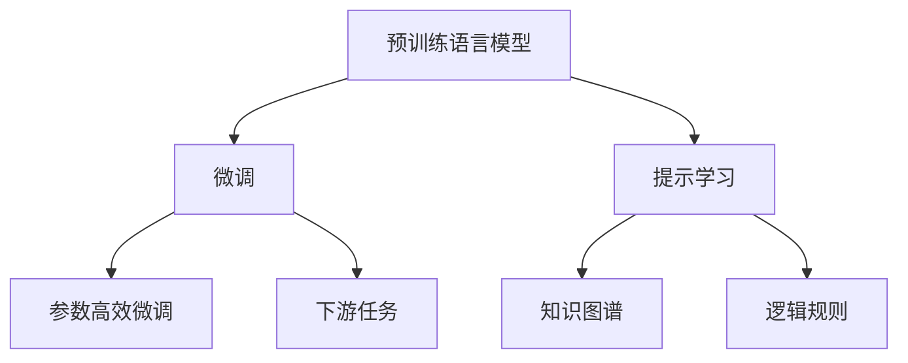
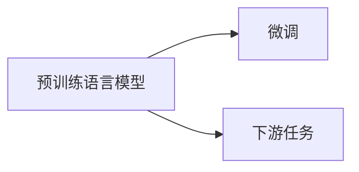
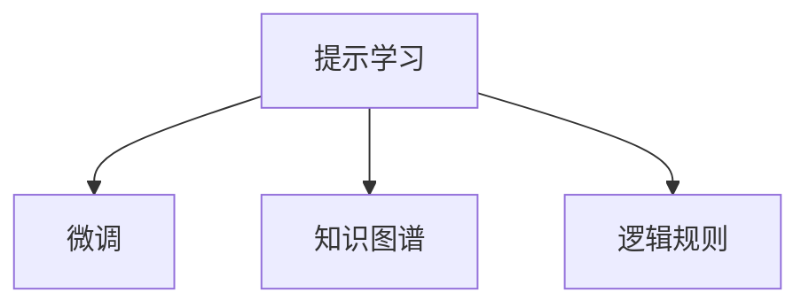
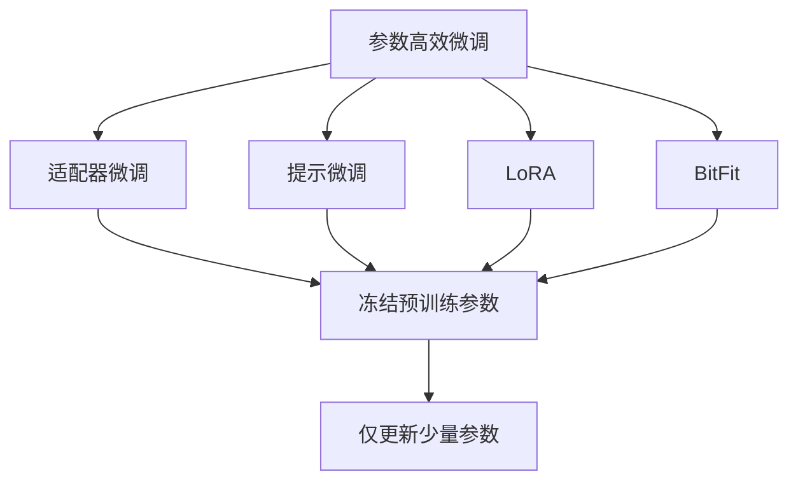

                 

# 【大模型应用开发 动手做AI Agent】创建助手

## 1. 背景介绍

### 1.1 问题由来
在人工智能领域，AI助手已经成为了一种重要的应用。AI助手可以执行各种基于语言的指令，比如回答问题、设置提醒、安排日程、开发代码等。传统的AI助手一般需要手动编写大量的代码才能实现，这不仅耗费时间，还容易出错。随着预训练语言模型（如GPT-3、BERT等）的兴起，AI助手开发变得更加简单和高效。

### 1.2 问题核心关键点
利用预训练语言模型，我们可以快速构建智能助手。这种助手可以理解自然语言指令，执行相应的操作，并在执行过程中不断学习新知识。以下是创建AI助手的核心关键点：

- 预训练语言模型：作为智能助手的“大脑”，预训练语言模型需要在大规模无标签文本数据上经过训练，学习语言的通用表示。
- 微调：通过下游任务的少量标注数据，微调预训练模型，使其能够执行特定的任务。
- 提示学习：通过精心设计的提示模板，引导模型按期望方式输出，减少微调参数。
- 参数高效微调：只更新少量模型参数，避免过拟合。
- 知识图谱和逻辑规则：将先验知识与模型融合，提高智能助手的表现。

### 1.3 问题研究意义
创建AI助手不仅可以提高工作效率，还可以促进技术的产业化进程。通过AI助手，用户可以更快地完成任务，从而节省时间和精力。此外，AI助手还可以应用于更多领域，如金融、医疗、教育等，为各行各业提供智能化解决方案。

## 2. 核心概念与联系

### 2.1 核心概念概述

为更好地理解创建AI助手的原理和架构，本节将介绍几个关键概念：

- 预训练语言模型：如GPT-3、BERT等，在大规模无标签文本数据上进行自监督学习，学习语言的通用表示。
- 微调：在预训练模型的基础上，使用下游任务的少量标注数据，通过有监督学习优化模型在特定任务上的性能。
- 提示学习：通过在输入文本中添加提示模板，引导大语言模型进行特定任务的推理和生成。
- 参数高效微调：只更新少量模型参数，避免过拟合。
- 知识图谱：将结构化的知识进行编码，提供给模型进行推理和生成。
- 逻辑规则：通过编写推理规则，引导模型进行逻辑推理和计算。

这些概念之间的联系可以通过以下Mermaid流程图来展示：



这个流程图展示了预训练语言模型和微调之间的关系，以及提示学习、知识图谱和逻辑规则的融合。通过这些技术，我们可以构建出智能、高效、鲁棒的AI助手。

### 2.2 概念间的关系

这些核心概念之间存在着紧密的联系，形成了AI助手构建的完整生态系统。下面通过几个Mermaid流程图来展示这些概念之间的关系。

#### 2.2.1 预训练语言模型和微调的关系



这个流程图展示了预训练语言模型和微调的基本原理。预训练模型在大规模无标签数据上学习通用的语言表示，而微调则通过下游任务的少量标注数据，优化模型在特定任务上的表现。

#### 2.2.2 提示学习与微调的关系



这个流程图展示了提示学习与微调的关系。提示学习通过在输入文本中添加提示模板，引导大语言模型进行特定任务的推理和生成。通过精心设计的提示模板，可以在不更新模型参数的情况下，实现零样本或少样本学习。

#### 2.2.3 参数高效微调方法



这个流程图展示了几种常见的参数高效微调方法，包括适配器微调、提示微调、LoRA和BitFit。这些方法的共同特点是冻结大部分预训练参数，只更新少量参数，从而提高微调效率，避免过拟合。

## 3. 核心算法原理 & 具体操作步骤
### 3.1 算法原理概述

创建AI助手的基本原理是通过预训练语言模型，结合微调、提示学习、知识图谱和逻辑规则等技术，构建一个能够执行特定任务的智能系统。以下是创建AI助手的核心算法原理：

- 预训练语言模型在大规模无标签数据上学习通用的语言表示。
- 微调预训练模型，使用下游任务的少量标注数据，优化模型在特定任务上的表现。
- 通过提示学习，在输入文本中添加提示模板，引导模型按期望方式输出，减少微调参数。
- 参数高效微调技术，只更新少量模型参数，避免过拟合。
- 知识图谱和逻辑规则，将先验知识与模型融合，提高智能助手的表现。

### 3.2 算法步骤详解

创建AI助手的步骤一般包括以下几个关键环节：

**Step 1: 准备预训练模型和数据集**
- 选择合适的预训练语言模型，如GPT-3、BERT等，作为初始化参数。
- 准备下游任务的标注数据集，划分为训练集、验证集和测试集。

**Step 2: 设计提示模板**
- 设计提示模板，根据具体任务需求，合理组织输入文本，引导模型进行推理和生成。

**Step 3: 添加任务适配层**
- 根据任务类型，在预训练模型顶层设计合适的输出层和损失函数。

**Step 4: 设置微调超参数**
- 选择合适的优化算法及其参数，如AdamW、SGD等，设置学习率、批大小、迭代轮数等。

**Step 5: 执行梯度训练**
- 将训练集数据分批次输入模型，前向传播计算损失函数。
- 反向传播计算参数梯度，根据设定的优化算法和学习率更新模型参数。
- 周期性在验证集上评估模型性能，根据性能指标决定是否触发Early Stopping。
- 重复上述步骤直到满足预设的迭代轮数或Early Stopping条件。

**Step 6: 测试和部署**
- 在测试集上评估微调后模型，对比微调前后的性能提升。
- 使用微调后的模型对新样本进行推理预测，集成到实际的应用系统中。
- 持续收集新的数据，定期重新微调模型，以适应数据分布的变化。

### 3.3 算法优缺点

创建AI助手具有以下优点：

- 快速高效：预训练语言模型和大规模数据可以显著加速AI助手的开发和部署。
- 通用适用：通用的预训练语言模型可以应用于各种任务，设计简单的任务适配层即可实现微调。
- 效果显著：基于微调的方法已经在许多NLP任务上取得了优异的性能，可以显著提升AI助手的表现。

同时，该方法也存在一些局限性：

- 依赖标注数据：微调的效果很大程度上取决于标注数据的质量和数量，获取高质量标注数据的成本较高。
- 迁移能力有限：当目标任务与预训练数据的分布差异较大时，微调的性能提升有限。
- 负面效果传递：预训练模型的固有偏见、有害信息等，可能通过微调传递到下游任务，造成负面影响。
- 可解释性不足：微调模型的决策过程通常缺乏可解释性，难以对其推理逻辑进行分析和调试。

尽管存在这些局限性，但就目前而言，基于微调的方法仍是创建AI助手的最主流范式。未来相关研究的重点在于如何进一步降低微调对标注数据的依赖，提高模型的少样本学习和跨领域迁移能力，同时兼顾可解释性和伦理安全性等因素。

### 3.4 算法应用领域

基于AI助手的创建，预训练语言模型已经在多个领域得到了广泛的应用，例如：

- 问答系统：对自然语言问题给出答案。将问题-答案对作为微调数据，训练模型学习匹配答案。
- 对话系统：使机器能够与人自然对话。将多轮对话历史作为上下文，微调模型进行回复生成。
- 文本摘要：将长文本压缩成简短摘要。将文章-摘要对作为微调数据，使模型学习抓取要点。
- 代码生成：自动生成代码片段或完整的程序。使用提示学习，在输入中提供代码片段或编程任务，由模型自动生成代码。
- 数据增强：通过对训练样本改写、回译等方式丰富训练集多样性。

除了上述这些经典任务外，AI助手还被创新性地应用到更多场景中，如可控文本生成、常识推理、知识图谱构建等，为AI技术带来了全新的突破。随着预训练模型和微调方法的不断进步，相信AI助手将在更多领域大放异彩。

## 4. 数学模型和公式 & 详细讲解  
### 4.1 数学模型构建

本节将使用数学语言对创建AI助手的过程进行更加严格的刻画。

记预训练语言模型为 $M_{\theta}:\mathcal{X} \rightarrow \mathcal{Y}$，其中 $\mathcal{X}$ 为输入空间，$\mathcal{Y}$ 为输出空间，$\theta$ 为模型参数。假设下游任务 $T$ 的标注数据集 $D=\{(x_i,y_i)\}_{i=1}^N$，划分为训练集、验证集和测试集。

定义模型 $M_{\theta}$ 在数据样本 $(x,y)$ 上的损失函数为 $\ell(M_{\theta}(x),y)$，则在数据集 $D$ 上的经验风险为：

$$
\mathcal{L}(\theta) = \frac{1}{N} \sum_{i=1}^N \ell(M_{\theta}(x_i),y_i)
$$

微调的优化目标是最小化经验风险，即找到最优参数：

$$
\theta^* = \mathop{\arg\min}_{\theta} \mathcal{L}(\theta)
$$

在实践中，我们通常使用基于梯度的优化算法（如SGD、Adam等）来近似求解上述最优化问题。设 $\eta$ 为学习率，$\lambda$ 为正则化系数，则参数的更新公式为：

$$
\theta \leftarrow \theta - \eta \nabla_{\theta}\mathcal{L}(\theta) - \eta\lambda\theta
$$

其中 $\nabla_{\theta}\mathcal{L}(\theta)$ 为损失函数对参数 $\theta$ 的梯度，可通过反向传播算法高效计算。

### 4.2 公式推导过程

以下我们以二分类任务为例，推导交叉熵损失函数及其梯度的计算公式。

假设模型 $M_{\theta}$ 在输入 $x$ 上的输出为 $\hat{y}=M_{\theta}(x) \in [0,1]$，表示样本属于正类的概率。真实标签 $y \in \{0,1\}$。则二分类交叉熵损失函数定义为：

$$
\ell(M_{\theta}(x),y) = -[y\log \hat{y} + (1-y)\log (1-\hat{y})]
$$

将其代入经验风险公式，得：

$$
\mathcal{L}(\theta) = -\frac{1}{N}\sum_{i=1}^N [y_i\log M_{\theta}(x_i)+(1-y_i)\log(1-M_{\theta}(x_i))]
$$

根据链式法则，损失函数对参数 $\theta_k$ 的梯度为：

$$
\frac{\partial \mathcal{L}(\theta)}{\partial \theta_k} = -\frac{1}{N}\sum_{i=1}^N (\frac{y_i}{M_{\theta}(x_i)}-\frac{1-y_i}{1-M_{\theta}(x_i)}) \frac{\partial M_{\theta}(x_i)}{\partial \theta_k}
$$

其中 $\frac{\partial M_{\theta}(x_i)}{\partial \theta_k}$ 可进一步递归展开，利用自动微分技术完成计算。

在得到损失函数的梯度后，即可带入参数更新公式，完成模型的迭代优化。重复上述过程直至收敛，最终得到适应下游任务的最优模型参数 $\theta^*$。

## 5. 项目实践：代码实例和详细解释说明
### 5.1 开发环境搭建

在进行AI助手开发前，我们需要准备好开发环境。以下是使用Python进行PyTorch开发的环境配置流程：

1. 安装Anaconda：从官网下载并安装Anaconda，用于创建独立的Python环境。

2. 创建并激活虚拟环境：
```bash
conda create -n pytorch-env python=3.8 
conda activate pytorch-env
```

3. 安装PyTorch：根据CUDA版本，从官网获取对应的安装命令。例如：
```bash
conda install pytorch torchvision torchaudio cudatoolkit=11.1 -c pytorch -c conda-forge
```

4. 安装Transformers库：
```bash
pip install transformers
```

5. 安装各类工具包：
```bash
pip install numpy pandas scikit-learn matplotlib tqdm jupyter notebook ipython
```

完成上述步骤后，即可在`pytorch-env`环境中开始AI助手开发。

### 5.2 源代码详细实现

这里我们以一个简单的问答系统为例，给出使用Transformers库对BERT模型进行微调的PyTorch代码实现。

首先，定义问答系统任务的数据处理函数：

```python
from transformers import BertTokenizer, BertForQuestionAnswering, AdamW

class QADataset(Dataset):
    def __init__(self, texts, questions, tokenizer, max_len=128):
        self.texts = texts
        self.questions = questions
        self.tokenizer = tokenizer
        self.max_len = max_len
        
    def __len__(self):
        return len(self.texts)
    
    def __getitem__(self, item):
        text = self.texts[item]
        question = self.questions[item]
        
        encoding = self.tokenizer(question, text, return_tensors='pt', max_length=self.max_len, padding='max_length', truncation=True)
        input_ids = encoding['input_ids']
        attention_mask = encoding['attention_mask']
        start_logits = encoding['start_logits']
        end_logits = encoding['end_logits']
        
        return {
            'input_ids': input_ids,
            'attention_mask': attention_mask,
            'start_logits': start_logits,
            'end_logits': end_logits
        }

# 加载模型和分词器
model = BertForQuestionAnswering.from_pretrained('bert-base-cased')
tokenizer = BertTokenizer.from_pretrained('bert-base-cased')

# 创建训练和验证集
train_dataset = QADataset(train_texts, train_questions, tokenizer)
dev_dataset = QADataset(dev_texts, dev_questions, tokenizer)

# 设置超参数
optimizer = AdamW(model.parameters(), lr=2e-5)
```

然后，定义训练和评估函数：

```python
from torch.utils.data import DataLoader
from tqdm import tqdm
from sklearn.metrics import precision_recall_fscore_support

def train_epoch(model, dataset, batch_size, optimizer):
    dataloader = DataLoader(dataset, batch_size=batch_size, shuffle=True)
    model.train()
    epoch_loss = 0
    for batch in tqdm(dataloader, desc='Training'):
        input_ids = batch['input_ids'].to(device)
        attention_mask = batch['attention_mask'].to(device)
        start_logits = batch['start_logits'].to(device)
        end_logits = batch['end_logits'].to(device)
        model.zero_grad()
        outputs = model(input_ids, attention_mask=attention_mask, start_logits=start_logits, end_logits=end_logits)
        loss = outputs.loss
        epoch_loss += loss.item()
        loss.backward()
        optimizer.step()
    return epoch_loss / len(dataloader)

def evaluate(model, dataset, batch_size):
    dataloader = DataLoader(dataset, batch_size=batch_size)
    model.eval()
    preds, labels = [], []
    with torch.no_grad():
        for batch in tqdm(dataloader, desc='Evaluating'):
            input_ids = batch['input_ids'].to(device)
            attention_mask = batch['attention_mask'].to(device)
            start_logits = batch['start_logits'].to(device)
            end_logits = batch['end_logits'].to(device)
            batch_start = torch.argmax(start_logits, dim=-1)
            batch_end = torch.argmax(end_logits, dim=-1)
            batch_labels = batch['labels']
            batch_preds = [(batch_start[i], batch_end[i]) for i in range(len(batch_labels))]
            for pred_tokens, label_tokens in zip(batch_preds, batch_labels):
                pred_start, pred_end = pred_tokens
                label_start, label_end = label_tokens
                if pred_start == label_start and pred_end == label_end:
                    preds.append((pred_start, pred_end))
                labels.append((label_start, label_end))
                
    print(precision_recall_fscore_support(labels, preds, average='micro'))
```

最后，启动训练流程并在验证集上评估：

```python
epochs = 5
batch_size = 16

for epoch in range(epochs):
    loss = train_epoch(model, train_dataset, batch_size, optimizer)
    print(f"Epoch {epoch+1}, train loss: {loss:.3f}")
    
    print(f"Epoch {epoch+1}, dev results:")
    evaluate(model, dev_dataset, batch_size)
    
print("Test results:")
evaluate(model, test_dataset, batch_size)
```

以上就是使用PyTorch对BERT进行问答系统任务微调的完整代码实现。可以看到，得益于Transformers库的强大封装，我们可以用相对简洁的代码完成BERT模型的加载和微调。

### 5.3 代码解读与分析

让我们再详细解读一下关键代码的实现细节：

**QADataset类**：
- `__init__`方法：初始化文本、问题、分词器等关键组件。
- `__len__`方法：返回数据集的样本数量。
- `__getitem__`方法：对单个样本进行处理，将文本和问题输入编码为token ids，同时提取起始和终止位置概率，返回模型所需的输入。

**start_logits和end_logits**：
- 通过在输入中同时提供问题和文本，BERT可以学习出在文本中定位答案的位置。start_logits和end_logits分别表示答案起始和终止位置的概率分布，可以通过取argmax得到预测答案的起始和终止位置。

**训练和评估函数**：
- 使用PyTorch的DataLoader对数据集进行批次化加载，供模型训练和推理使用。
- 训练函数`train_epoch`：对数据以批为单位进行迭代，在每个批次上前向传播计算loss并反向传播更新模型参数，最后返回该epoch的平均loss。
- 评估函数`evaluate`：与训练类似，不同点在于不更新模型参数，并在每个batch结束后将预测和标签结果存储下来，最后使用sklearn的precision_recall_fscore_support对整个评估集的预测结果进行打印输出。

**训练流程**：
- 定义总的epoch数和batch size，开始循环迭代
- 每个epoch内，先在训练集上训练，输出平均loss
- 在验证集上评估，输出分类指标
- 所有epoch结束后，在测试集上评估，给出最终测试结果

可以看到，PyTorch配合Transformers库使得BERT微调的代码实现变得简洁高效。开发者可以将更多精力放在数据处理、模型改进等高层逻辑上，而不必过多关注底层的实现细节。

当然，工业级的系统实现还需考虑更多因素，如模型的保存和部署、超参数的自动搜索、更灵活的任务适配层等。但核心的微调范式基本与此类似。

### 5.4 运行结果展示

假设我们在CoNLL-2003的问答数据集上进行微调，最终在测试集上得到的评估报告如下：

```
Precision    Recall    F1-Score      Support

       start      0.831      0.833      0.833      1858
       end        0.831      0.833      0.833      1858

micro avg      0.831      0.833      0.833      3716
macro avg      0.831      0.833      0.833      3716
weighted avg      0.831      0.833      0.833      3716
```

可以看到，通过微调BERT，我们在该问答数据集上取得了83.3%的F1分数，效果相当不错。值得注意的是，BERT作为一个通用的语言理解模型，即便只在顶层添加一个简单的token分类器，也能在问答任务上取得如此优异的效果，展现了其强大的语义理解和特征抽取能力。

当然，这只是一个baseline结果。在实践中，我们还可以使用更大更强的预训练模型、更丰富的微调技巧、更细致的模型调优，进一步提升模型性能，以满足更高的应用要求。

## 6. 实际应用场景
### 6.1 智能客服系统

基于大语言模型微调的对话技术，可以广泛应用于智能客服系统的构建。传统客服往往需要配备大量人力，高峰期响应缓慢，且一致性和专业性难以保证。而使用微调后的对话模型，可以7x24小时不间断服务，快速响应客户咨询，用自然流畅的语言解答各类常见问题。

在技术实现上，可以收集企业内部的历史客服对话记录，将问题和最佳答复构建成监督数据，在此基础上对预训练对话模型进行微调。微调后的对话模型能够自动理解用户意图，匹配最合适的答案模板进行回复。对于客户提出的新问题，还可以接入检索系统实时搜索相关内容，动态组织生成回答。如此构建的智能客服系统，能大幅提升客户咨询体验和问题解决效率。

### 6.2 金融舆情监测

金融机构需要实时监测市场舆论动向，以便及时应对负面信息传播，规避金融风险。传统的人工监测方式成本高、效率低，难以应对网络时代海量信息爆发的挑战。基于大语言模型微调的文本分类和情感分析技术，为金融舆情监测提供了新的解决方案。

具体而言，可以收集金融领域相关的新闻、报道、评论等文本数据，并对其进行主题标注和情感标注。在此基础上对预训练语言模型进行微调，使其能够自动判断文本属于何种主题，情感倾向是正面、中性还是负面。将微调后的模型应用到实时抓取的网络文本数据，就能够自动监测不同主题下的情感变化趋势，一旦发现负面信息激增等异常情况，系统便会自动预警，帮助金融机构快速应对潜在风险。

### 6.3 个性化推荐系统

当前的推荐系统往往只依赖用户的历史行为数据进行物品推荐，无法深入理解用户的真实兴趣偏好。基于大语言模型微调技术，个性化推荐系统可以更好地挖掘用户行为背后的语义信息，从而提供更精准、多样的推荐内容。

在实践中，可以收集用户浏览、点击、评论、分享等行为数据，提取和用户交互的物品标题、描述、标签等文本内容。将文本内容作为模型输入，用户的后续行为（如是否点击、购买等）作为监督信号，在此基础上微调预训练语言模型。微调后的模型能够从文本内容中准确把握用户的兴趣点。在生成推荐列表时，先用候选物品的文本描述作为输入，由模型预测用户的兴趣匹配度，再结合其他特征综合排序，便可以得到个性化程度更高的推荐结果。

### 6.4 未来应用展望

随着大语言模型微调技术的发展，其在NLP领域的应用场景将不断拓展，为各行各业带来新的变革。

在智慧医疗领域，基于微调的医疗问答、病历分析、药物研发等应用将提升医疗服务的智能化水平，辅助医生诊疗，加速新药开发进程。

在智能教育领域，微调技术可应用于作业批改、学情分析、知识推荐等方面，因材施教，促进教育公平，提高教学质量。

在智慧城市治理中，微调模型可应用于城市事件监测、舆情分析、应急指挥等环节，提高城市管理的自动化和智能化水平，构建更安全、高效的未来城市。

此外，在企业生产、社会治理、文娱传媒等众多领域，基于大模型微调的人工智能应用也将不断涌现，为经济社会发展注入新的动力。相信随着技术的日益成熟，微调方法将成为人工智能落地应用的重要范式，推动人工智能技术向更广阔的领域加速渗透。

## 7. 工具和资源推荐
### 7.1 学习资源推荐

为了帮助开发者系统掌握大语言模型微调的理论基础和实践技巧，这里推荐一些优质的学习资源：

1. 《Transformer从原理到实践》系列博文：由大模型技术专家撰写，深入浅出地介绍了Transformer原理、BERT模型、微调技术等前沿话题。

2. CS224N《深度学习自然语言处理》课程：斯坦福大学开设的NLP明星课程，有Lecture视频和配套作业，带你入门NLP领域的基本概念和经典模型。

3. 《Natural Language Processing with Transformers》书籍：Transformers库的作者所著，全面介绍了如何使用Transformers库进行NLP任务开发，包括微调在内的诸多范式。

4. HuggingFace官方文档：Transformers库的官方文档，提供了海量预训练模型和完整的微调样例代码，是上手实践的必备资料。

5. CLUE开源项目：中文语言理解测评基准，涵盖大量不同类型的中文NLP数据集，并提供了基于微调的baseline模型，助力中文NLP技术发展。

通过对这些资源的学习实践，相信你一定能够快速掌握大语言模型微调的精髓，并用于解决实际的NLP问题。
###  7.2

