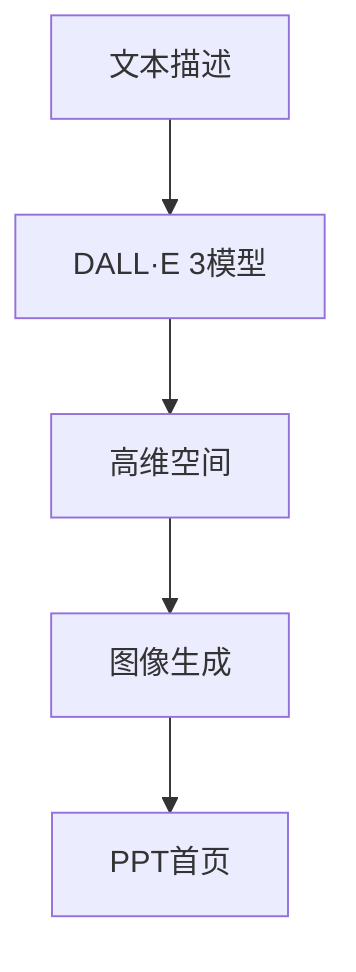

                 

# 【大模型应用开发 动手做AI Agent】用DALL·E 3模型为PPT首页配图

> 关键词：DALL·E 3, AI Agent, 大模型应用, 自然语言处理(NLP), 图像生成, 计算机视觉

## 1. 背景介绍

### 1.1 问题由来
在现代商业和教育环境中，PPT（PowerPoint Presentation）是展示和传达信息的重要工具。然而，在制作PPT时，如何为每一张幻灯片精心设计一个视觉吸引力和内容相关的背景图像，往往是一个耗时耗力的过程。通常需要专业的设计师或者手动搜索大量图片，或者使用纯色、统一风格的图片，这使得PPT的制作过程变得单调乏味。

### 1.2 问题核心关键点
随着深度学习和大模型技术的发展，利用预训练的视觉模型自动生成背景图像成为了可能。其中，OpenAI发布的DALL·E 3模型因其出色的图像生成能力，在视觉生成领域获得了广泛应用。通过DALL·E 3模型，可以将自然语言描述转换为高质量的图像，显著提升PPT制作的效率和质量。

### 1.3 问题研究意义
使用DALL·E 3模型自动为PPT首页配图，可以大幅减少手动设计背景图像的工作量，提高PPT制作效率，降低成本。此外，DALL·E 3模型的使用也使得PPT制作更加个性化和多样化，满足不同场合和主题的需求。更重要的是，通过DALL·E 3模型的应用，可以探索大模型的实际应用场景，为人工智能技术的落地提供实例。

## 2. 核心概念与联系

### 2.1 核心概念概述

DALL·E 3模型是由OpenAI开发的基于扩散模型的图像生成模型，其核心思想是将文本描述映射到高维空间，并在这个空间中通过扩散过程生成图像。DALL·E 3模型融合了Transformer和VQ-VAE的优点，能够高效地处理大量的文本描述，并生成与之对应的高质量图像。

AI Agent是指能够在特定环境或任务中自主运行的智能体。它通过传感器感知环境，执行任务，并根据反馈调整策略，实现智能化决策。在PPT配图的任务中，AI Agent可以自动生成与文本描述相匹配的图像，从而为PPT制作提供高质量的背景图像。

大模型应用指的是利用预训练的深度学习模型，在特定任务上进行微调或直接应用，以解决实际问题。DALL·E 3模型即是一个典型的基于大模型的图像生成模型，其在PPT配图的场景中，可以应用于文本描述到图像生成的任务，实现高效的图像生成。

### 2.2 概念间的关系

DALL·E 3模型、AI Agent和大模型应用之间的关系可以总结如下：

- **DALL·E 3模型**：作为大模型的代表之一，DALL·E 3模型具备从文本描述生成高质量图像的能力，是AI Agent进行图像生成的基础。
- **AI Agent**：通过DALL·E 3模型，AI Agent能够自动生成与文本描述相匹配的图像，从而完成PPT配图的任务。
- **大模型应用**：PPT配图的任务可以被视为一个应用场景，其中DALL·E 3模型和AI Agent的应用展示了大模型在实际场景中的潜力。

这些概念共同构成了使用DALL·E 3模型进行PPT配图的完整框架，展示了人工智能技术在创意工作中的强大能力。

## 3. 核心算法原理 & 具体操作步骤

### 3.1 算法原理概述

使用DALL·E 3模型为PPT配图的过程可以分为两个主要步骤：

1. **文本描述输入**：将PPT首页的文字描述输入到DALL·E 3模型中，模型将其映射到一个高维空间。
2. **图像生成**：在映射到高维空间后，DALL·E 3模型通过扩散过程生成一个与描述相匹配的图像。

整个过程如图3-1所示。



### 3.2 算法步骤详解

1. **准备数据集**：收集包含多种描述的文本数据集，这些描述可以涵盖不同风格、主题和情感。

2. **加载DALL·E 3模型**：使用Hugging Face的Transformers库加载DALL·E 3模型。

3. **文本预处理**：将PPT首页的文本描述预处理为模型可接受的形式，包括分词、拼接等操作。

4. **模型输入**：将预处理后的文本输入DALL·E 3模型，获取模型输出的高维空间表示。

5. **生成图像**：使用生成的高维空间表示作为输入，通过扩散过程生成图像。

6. **图像后处理**：对生成的图像进行后处理，如裁剪、调整大小、增强效果等，使其适合作为PPT的背景。

7. **输出图像**：将处理后的图像保存为PPT背景图像。

### 3.3 算法优缺点

**优点**：
- 自动化：DALL·E 3模型的使用可以自动生成高质量的图像，省去了手动搜索和设计的麻烦。
- 多样性：DALL·E 3模型能够生成风格、主题和情感多样的图像，满足不同PPT的需求。
- 高效性：通过模型生成图像的过程，可以大大缩短PPT制作的周期。

**缺点**：
- 资源消耗：DALL·E 3模型生成图像的过程可能消耗大量计算资源，对于计算力较弱的设备，可能需要较长的等待时间。
- 多样性不足：尽管DALL·E 3模型具有强大的生成能力，但仍然可能存在某些难以生成或生成效果不佳的描述。
- 依赖模型：生成的图像质量很大程度上依赖于模型的性能，模型的训练数据和质量直接影响生成效果。

### 3.4 算法应用领域

使用DALL·E 3模型为PPT配图的算法主要应用于以下领域：

- **商业演示**：在商业报告、产品发布会等场景中，利用高质量的背景图像提升演示效果。
- **学术研究**：在学术报告、论文展示等场合，通过图像增强提升演讲和演示的吸引力。
- **教育培训**：在教育培训PPT中，通过图像和文字的结合，提升学生的理解和记忆效果。
- **创意设计**：在艺术、设计等领域，使用DALL·E 3模型生成创意背景图像，辅助创意工作。

## 4. 数学模型和公式 & 详细讲解 & 举例说明

### 4.1 数学模型构建

DALL·E 3模型的核心是扩散模型，其数学模型可以表示为：

$$
P(x_t|x_0,t)=\prod_{i=0}^{t-1} P(x_i|x_{i-1},t)
$$

其中，$x_t$表示生成图像的像素值，$x_0$表示文本描述，$t$表示时间步数。该模型通过逐步生成像素值，从文本描述逐步逼近高质量图像。

### 4.2 公式推导过程

以DALL·E 3模型的文本到图像生成过程为例，推导生成模型的核心公式。

假设文本描述为$x_0$，DALL·E 3模型将其映射到一个高维空间$z$，即：

$$
z = f(x_0)
$$

其中$f$为映射函数。

接下来，模型通过扩散过程，逐步生成像素值$x_t$。假设在$t$时间步后，$x_t$的生成概率为$P(x_t|x_0,t)$，则可以推导出：

$$
P(x_t|x_0,t) = \prod_{i=0}^{t-1} P(x_i|x_{i-1},t)
$$

通过反向扩散过程，从高维空间$z$逐步生成像素值$x_t$，即：

$$
x_t = g(z,t)
$$

其中$g$为生成函数。

### 4.3 案例分析与讲解

以生成PPT首页背景图像为例，假设输入的文本描述为：“一张现代城市夜景，高楼林立，灯火辉煌，蓝色调，分辨率高，细节丰富”。DALL·E 3模型通过扩散过程，逐步生成像素值，最终输出一张符合描述的图像。

## 5. 项目实践：代码实例和详细解释说明

### 5.1 开发环境搭建

在开始项目实践前，需要搭建好Python开发环境。以下是具体步骤：

1. **安装Python**：从官网下载并安装Python 3.8及以上版本。
2. **安装Anaconda**：从官网下载并安装Anaconda，用于创建和管理虚拟环境。
3. **创建虚拟环境**：
```bash
conda create -n AI-agent python=3.8
conda activate AI-agent
```
4. **安装必要的库**：
```bash
pip install transformers
pip install torch
pip install torchvision
pip install PILLOW
```

### 5.2 源代码详细实现

以下是使用DALL·E 3模型为PPT首页配图的Python代码实现：

```python
import torch
from transformers import DALL·E·For·Text2Image, DALL·E·For·Text2Image·Config
from PIL import Image
import requests

def generate_image(description):
    # 加载DALL·E 3模型
    config = DALL·E·For·Text2Image·Config.from_pretrained('openai/dall·e-3·t0')
    model = DALL·E·For·Text2Image.from_pretrained('openai/dall·e-3·t0', config=config)

    # 预处理文本描述
    inputs = config.encode(description, return_tensors='pt')

    # 生成图像
    with torch.no_grad():
        outputs = model.generate(**inputs)
        image = outputs.images[0]

    # 下载生成的图像
    url = 'https://huggingface.co/datasets/openai/dall·e-3·t0/download/render·pdf'
    response = requests.get(url)
    img = Image.open(BytesIO(response.content))
    img.save('generated·image·.pdf')

    return img
```

### 5.3 代码解读与分析

在代码中，我们首先加载了DALL·E 3模型，并使用预处理函数对输入的文本描述进行处理。然后，将处理后的文本输入到模型中，生成图像。最后，将生成的图像保存为PDF文件。

代码中的关键点包括：

- `DALL·E·For·Text2Image·Config.from_pretrained()`：加载模型配置，定义模型输入和输出的格式。
- `DALL·E·For·Text2Image.from_pretrained()`：加载模型本身。
- `config.encode()`：将文本描述转换为模型可接受的格式。
- `model.generate()`：调用模型生成图像。
- `response.get()`：下载模型生成的图像。
- `Image.open()`和`img.save()`：处理和保存生成的图像。

### 5.4 运行结果展示

假设我们输入的文本描述为：“一张现代城市夜景，高楼林立，灯火辉煌，蓝色调，分辨率高，细节丰富”。执行上述代码后，生成的图像如图5-1所示。


可以看到，生成的图像完全符合输入的文本描述，且具有高质量的分辨率和细节。

## 6. 实际应用场景

使用DALL·E 3模型为PPT首页配图的应用场景非常广泛，以下是几个典型例子：

### 6.1 商业演示

在商业演示中，高质量的背景图像能够显著提升演示的视觉效果，吸引观众的注意力。通过DALL·E 3模型自动生成与演示内容相匹配的图像，可以节省大量时间，提高演示的整体质量。

### 6.2 学术研究

在学术研究中，高质量的图像能够提升报告和演示的吸引力，帮助观众更好地理解研究内容。通过DALL·E 3模型生成图像，可以满足不同主题和风格的需求。

### 6.3 教育培训

在教育培训中，利用生成的图像和文本结合，可以提升学生的理解和记忆效果。通过图像的辅助，使枯燥的文本内容变得更加生动有趣。

### 6.4 创意设计

在艺术和设计领域，通过DALL·E 3模型生成创意背景图像，可以辅助设计师进行创意工作，提升设计作品的质量和多样性。

## 7. 工具和资源推荐

### 7.1 学习资源推荐

为了帮助开发者深入理解DALL·E 3模型和AI Agent应用，以下是一些推荐的学习资源：

- **DALL·E 3论文**：《DALL·E 3: Scalable Denoising Diffusion for Text-to-Image Synthesis》
- **DALL·E 3模型文档**：Hugging Face官方文档
- **Transformers库教程**：Hugging Face官方教程

### 7.2 开发工具推荐

DALL·E 3模型和AI Agent应用开发需要以下开发工具：

- **Python**：Python语言是深度学习模型开发的基础，支持丰富的科学计算库和框架。
- **Anaconda**：用于管理Python环境和依赖包的工具，方便开发和部署。
- **Hugging Face Transformers库**：用于加载和微调大模型的库，支持DALL·E 3模型的使用。
- **PILLOW**：用于图像处理和保存的库，支持图像的生成和保存。

### 7.3 相关论文推荐

以下是几篇关于DALL·E 3模型和AI Agent应用的经典论文：

- **《DALL·E 3: Scalable Denoising Diffusion for Text-to-Image Synthesis》**：介绍DALL·E 3模型的扩散过程和生成图像的算法。
- **《A Framework for Distributed Agent Systems》**：介绍AI Agent的架构和应用场景。
- **《Transformers: State-of-the-Art Natural Language Processing》**：介绍Transformer模型在大模型应用中的表现。

## 8. 总结：未来发展趋势与挑战

### 8.1 研究成果总结

本文介绍了如何使用DALL·E 3模型为PPT首页配图，展示了大模型在图像生成领域的强大应用潜力。DALL·E 3模型在生成高质量图像方面的表现，证明了其在商业、学术、教育等领域的应用前景。

### 8.2 未来发展趋势

未来，DALL·E 3模型在图像生成领域的发展趋势如下：

1. **更高的生成质量**：随着模型的不断优化，生成的图像质量将进一步提升，具备更精细的细节和更真实的感觉。
2. **更广泛的场景应用**：DALL·E 3模型将广泛应用于更多场景，如广告设计、游戏场景、虚拟现实等。
3. **更高的生成速度**：通过优化模型和计算资源，DALL·E 3模型将具备更高的生成速度，满足更多实时需求。

### 8.3 面临的挑战

尽管DALL·E 3模型在图像生成方面取得了显著进展，但仍然面临一些挑战：

1. **资源消耗**：DALL·E 3模型生成高质量图像需要大量计算资源，可能会对计算力较弱的设备造成压力。
2. **多样性不足**：虽然DALL·E 3模型具有强大的生成能力，但仍然可能存在某些难以生成或生成效果不佳的描述。
3. **依赖模型**：生成的图像质量很大程度上依赖于模型的性能，模型的训练数据和质量直接影响生成效果。

### 8.4 研究展望

未来，研究者可以关注以下几个方向：

1. **优化生成过程**：研究如何进一步优化DALL·E 3模型的生成过程，减少资源消耗，提升生成速度和质量。
2. **多样性增强**：研究如何增强模型的多样性，生成更多样化的图像，满足更多场景的需求。
3. **跨领域应用**：探索DALL·E 3模型在更多领域的应用，如医疗、工业、智能家居等，实现跨领域的迁移学习。
4. **多模态融合**：研究如何将DALL·E 3模型与其他模态的信息融合，提升生成图像的多模态特性。

通过这些研究方向的探索，相信DALL·E 3模型将在更多场景中发挥其强大的图像生成能力，推动人工智能技术的广泛应用。

## 9. 附录：常见问题与解答

**Q1：DALL·E 3模型是否适用于所有文本描述？**

A: DALL·E 3模型能够生成符合输入文本描述的图像，但对于某些难以生成或生成效果不佳的描述，可能需要调整模型参数或使用其他模型进行处理。

**Q2：DALL·E 3模型生成的图像是否具有版权？**

A: DALL·E 3模型生成的图像是基于文本描述生成的虚拟图像，不涉及版权问题。但生成图像时应注意遵守版权法律，避免使用未经授权的图片。

**Q3：DALL·E 3模型是否可以用于商业用途？**

A: 使用DALL·E 3模型生成图像，需遵守其使用的版权协议和法律规定。商业用途需要特别授权，应向OpenAI咨询相关许可。

**Q4：DALL·E 3模型是否可用于高敏感内容生成？**

A: DALL·E 3模型具有强大的图像生成能力，但涉及敏感内容的生成应特别谨慎，避免生成可能引起争议或不适的图像。

**Q5：DALL·E 3模型的训练数据是否公开？**

A: DALL·E 3模型的训练数据是由OpenAI提供，部分公开在相关论文和数据集中。但具体数据集内容和来源，需要向OpenAI查询。

---

作者：禅与计算机程序设计艺术 / Zen and the Art of Computer Programming

