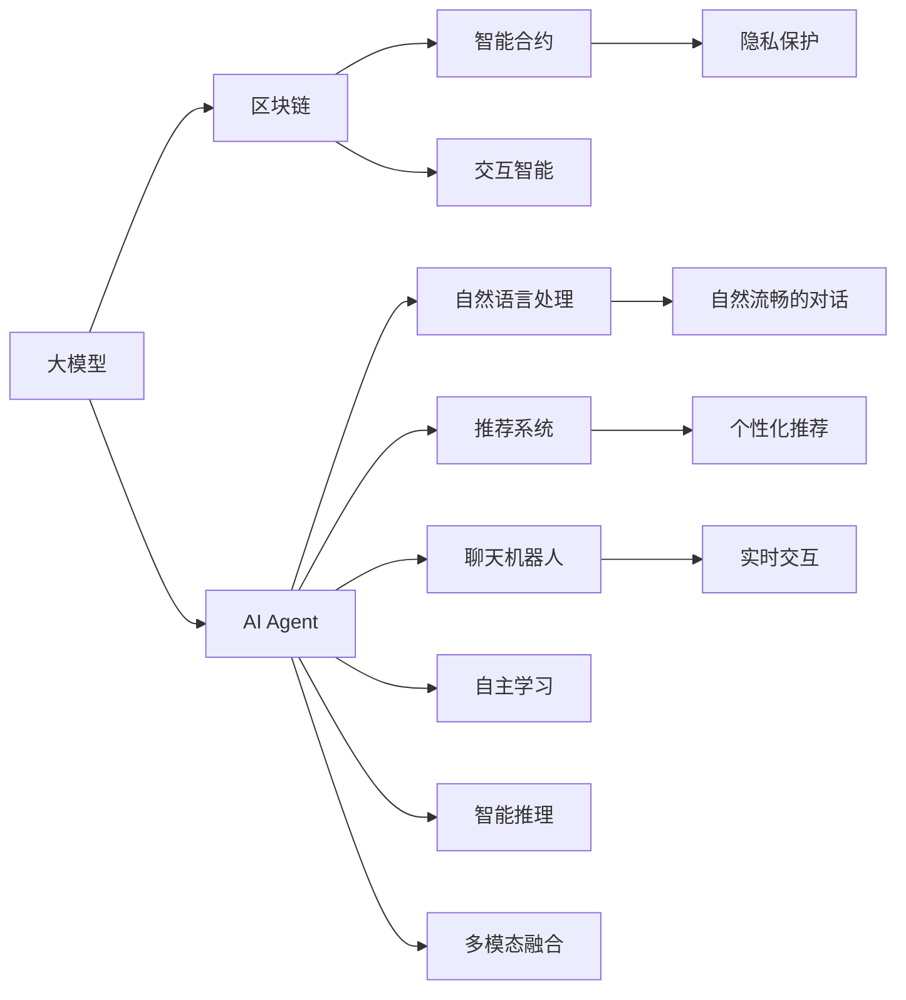
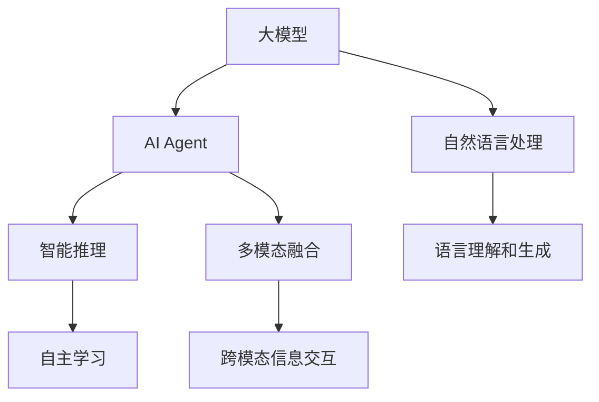
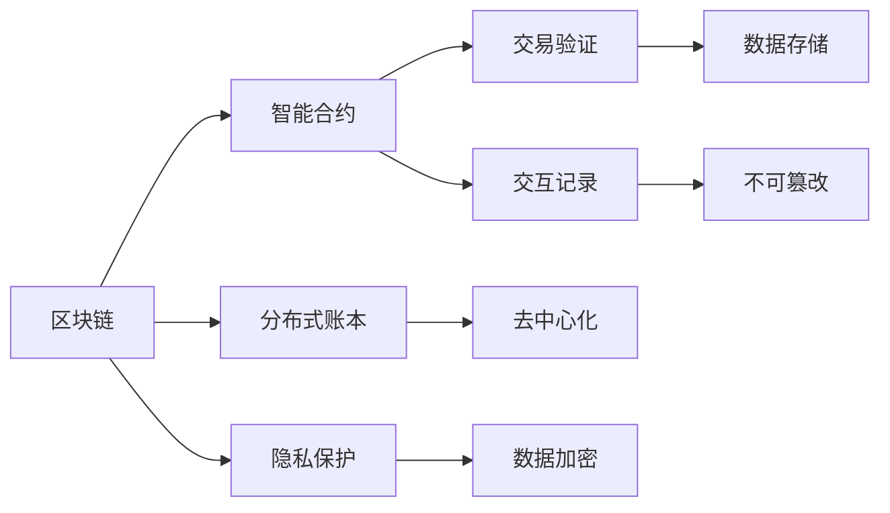
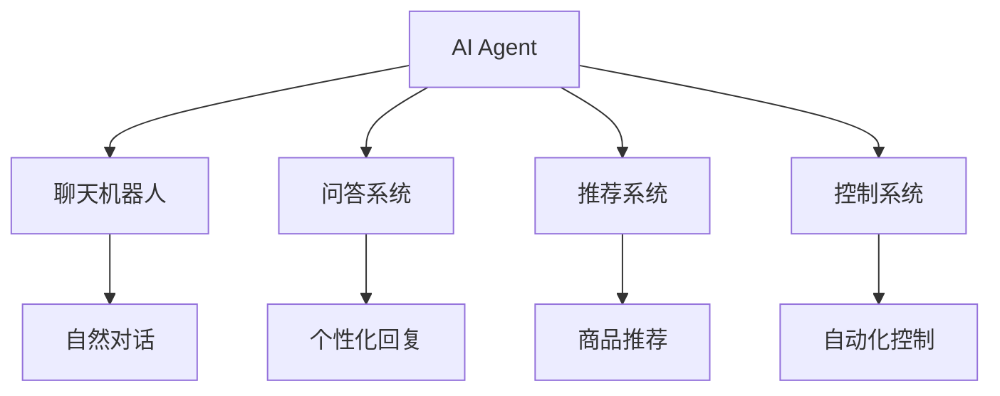
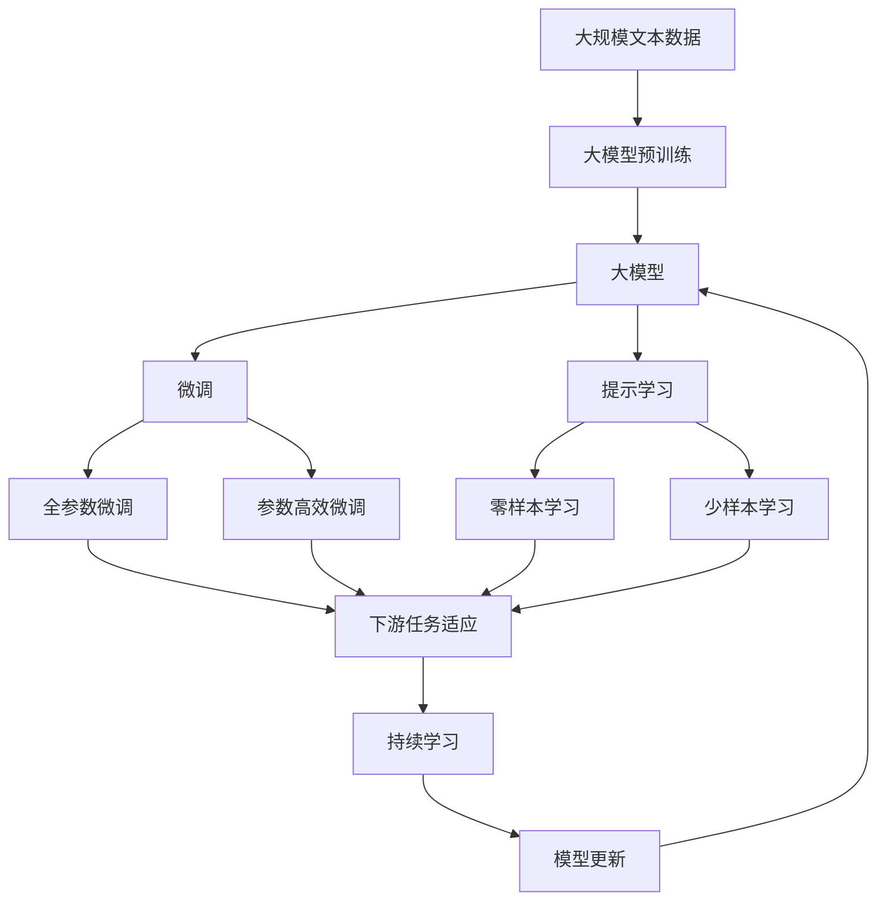

                 

# 【大模型应用开发 动手做AI Agent】说说LangChain

> 关键词：AI Agent, LangChain, 大模型应用开发, 自然语言处理(NLP), 智能合约, 区块链, 交互智能, 技术栈

## 1. 背景介绍

### 1.1 问题由来
随着人工智能（AI）技术的不断进步，尤其是大模型的涌现，AI Agent作为一种智能化的应用形式，正日益成为热门的技术研发方向。AI Agent通常用于解决复杂的自然语言处理（NLP）问题，如聊天机器人、问答系统、推荐系统等，具有自主学习和交互能力。LangChain项目正是基于这些需求，通过结合大模型与区块链技术，构建了一种新颖的AI Agent应用。

### 1.2 问题核心关键点
LangChain项目的核心目标是：
1. **基于大模型的智能对话**：通过Transformer等大模型进行语言理解和生成，实现自然流畅的智能对话。
2. **区块链的交互安全性**：利用区块链的不可篡改特性，确保对话记录的安全性和可追溯性。
3. **开放式的生态系统**：支持跨链互操作，构建一个灵活开放的AI Agent生态。
4. **隐私保护**：保护用户数据隐私，同时提供匿名化机制。

### 1.3 问题研究意义
LangChain项目通过结合大模型和区块链技术，旨在解决传统AI Agent在安全性、隐私性和交互性上的不足，为未来的AI应用开发提供一种新型的范式。它的实现不仅可以提升NLP任务的效率和准确性，还能保障用户隐私，促进数据安全和多方协同合作，具有广泛的应用前景和重要的研究价值。

## 2. 核心概念与联系

### 2.1 核心概念概述

为了深入理解LangChain项目，本节将介绍几个关键概念及其相互联系：

- **大模型（Large Model）**：如Transformer、BERT等，通过自监督学习任务训练得到的通用语言模型，具有强大的语言理解和生成能力。
- **区块链（Blockchain）**：一种分布式账本技术，具有去中心化、不可篡改、透明等特点，常用于记录和验证数据。
- **AI Agent**：一种基于AI技术的自动化应用，具备自主学习和交互能力，可应用于NLP、推荐、控制等多个领域。
- **智能合约（Smart Contract）**：区块链上的可执行代码，自动执行预设规则和逻辑，常用于金融、供应链等场景。
- **交互智能（Interactive Intelligence）**：AI Agent与用户或环境交互的过程，通过对话、指令等方式实现智能化交互。
- **隐私保护（Privacy Protection）**：保护用户数据隐私，防止数据泄露和滥用。

这些核心概念之间通过图（Graph）表示其相互关系：



这个图展示了大模型、区块链、AI Agent、智能合约、交互智能、隐私保护等概念之间的关系：

- 大模型通过自监督学习任务进行预训练，用于AI Agent的自然语言处理能力。
- 区块链技术为AI Agent提供了安全的交互记录和交易验证机制。
- 智能合约确保了AI Agent的行为规则和逻辑。
- 交互智能是AI Agent的核心能力，实现与用户或环境的互动。
- 隐私保护技术用于保障用户数据的机密性和安全性。

### 2.2 概念间的关系

这些核心概念之间存在着紧密的联系，构成了LangChain项目的完整技术架构。下面通过几个具体的流程图来展示这些概念之间的关系。

#### 2.2.1 AI Agent与大模型的结合



这个图展示了AI Agent如何利用大模型的语言理解和生成能力，实现自然流畅的对话和自主推理。

#### 2.2.2 AI Agent与区块链的集成



这个图展示了AI Agent如何与区块链集成，利用智能合约实现交易验证和数据存储，保障数据的不可篡改性和隐私保护。

#### 2.2.3 AI Agent的多场景应用



这个图展示了AI Agent在不同场景下的应用，包括聊天机器人、问答系统、推荐系统、控制系统等，实现智能化交互和自动化任务。

### 2.3 核心概念的整体架构

最后，用一个综合的流程图来展示这些核心概念在大模型应用开发中的整体架构：



这个综合流程图展示了从预训练到微调，再到持续学习的完整过程，以及与AI Agent应用的关联。

## 3. 核心算法原理 & 具体操作步骤
### 3.1 算法原理概述

LangChain项目中的AI Agent主要通过大模型进行语言理解和生成，并通过区块链技术实现安全和透明的交互。具体来说，AI Agent的算法原理包括以下几个方面：

1. **大模型预训练**：使用大规模无标签文本数据进行自监督学习任务，如掩码语言模型、下一句预测等，学习通用语言表示。
2. **下游任务微调**：在特定任务的标注数据上，使用监督学习任务对大模型进行微调，使其适应特定任务，如分类、匹配、生成等。
3. **区块链交互记录**：通过智能合约和区块链技术，记录和验证AI Agent与用户或环境之间的交互记录，确保数据的不可篡改性和透明性。
4. **隐私保护机制**：在区块链上采用隐私保护技术，如零知识证明、同态加密等，保护用户数据的隐私和安全。

### 3.2 算法步骤详解

LangChain项目中的AI Agent算法步骤主要包括：

1. **数据预处理**：收集和整理大规模无标签文本数据，进行预处理和分词，生成用于大模型预训练的数据集。
2. **大模型预训练**：在大规模文本数据上使用自监督学习任务，对大模型进行预训练，学习通用语言表示。
3. **任务适配层设计**：根据具体任务，在大模型的顶层设计合适的任务适配层和损失函数，如分类任务的交叉熵损失、生成任务的负对数似然损失等。
4. **微调训练**：使用下游任务的标注数据集，对预训练的大模型进行微调，优化模型在特定任务上的性能。
5. **交互智能实现**：将微调后的模型部署到区块链上，通过智能合约实现与用户或环境之间的交互，记录和验证交互记录。
6. **隐私保护技术应用**：在区块链上采用隐私保护技术，确保用户数据的机密性和安全性。

### 3.3 算法优缺点

LangChain项目中的AI Agent算法有以下优点：

1. **高效性**：通过大模型的预训练和微调，可以显著提升模型在特定任务上的性能，减少从头训练的资源消耗。
2. **鲁棒性**：区块链技术提供了不可篡改和透明的数据记录机制，保障了AI Agent交互的安全性和可信度。
3. **可扩展性**：支持跨链互操作，适应不同区块链平台的需求。
4. **隐私保护**：采用隐私保护技术，保护用户数据隐私，减少数据泄露的风险。

同时，该算法也存在一些缺点：

1. **资源消耗大**：大模型和区块链技术需要较大的计算和存储资源，特别是在大规模数据集上的训练和验证。
2. **技术门槛高**：需要掌握大模型训练、区块链技术、智能合约设计等多方面的知识，入门门槛较高。
3. **性能优化复杂**：需要在数据预处理、模型微调、隐私保护等多个环节进行综合优化，才能充分发挥算法的潜力。

### 3.4 算法应用领域

LangChain项目中的AI Agent算法已经在多个领域得到了应用，包括但不限于：

- **聊天机器人**：利用大模型的语言生成能力，实现自然流畅的对话。
- **问答系统**：基于大模型的理解能力，提供准确的回答。
- **推荐系统**：通过智能合约记录用户行为，实现个性化推荐。
- **控制系统**：用于自动化控制和决策，如智能家居、工业自动化等。
- **金融应用**：结合区块链技术，实现安全可靠的金融服务，如去中心化交易所、智能合约保险等。

此外，LangChain项目还在不断拓展其应用领域，如医疗、教育、社交网络等，为这些领域提供智能化的AI Agent解决方案。

## 4. 数学模型和公式 & 详细讲解 & 举例说明

### 4.1 数学模型构建

为了更精确地描述AI Agent的工作原理，本节将使用数学模型进行详细讲解。

假设AI Agent在某个任务上的标注数据集为$D=\{(x_i, y_i)\}_{i=1}^N$，其中$x_i$为输入，$y_i$为输出，即任务标签。设AI Agent的模型为$f(x; \theta)$，其中$\theta$为模型参数。AI Agent的损失函数为$\mathcal{L}(\theta)$，用于衡量模型输出与真实标签之间的差异。

AI Agent的微调目标是最小化损失函数，即：

$$
\theta^* = \mathop{\arg\min}_{\theta} \mathcal{L}(f(x; \theta), y)
$$

其中$f(x; \theta)$为AI Agent在输入$x$下的预测输出。

### 4.2 公式推导过程

以分类任务为例，假设AI Agent的预测输出为$\hat{y}=f(x; \theta)$，真实标签为$y$，则交叉熵损失函数为：

$$
\mathcal{L}(\theta) = -\frac{1}{N}\sum_{i=1}^N y_i\log \hat{y}_i
$$

其中$y_i \in \{0, 1\}$，$\hat{y}_i \in (0, 1)$。

AI Agent的微调目标是最小化交叉熵损失，即：

$$
\theta^* = \mathop{\arg\min}_{\theta} \mathcal{L}(\theta)
$$

在微调过程中，AI Agent通过梯度下降算法更新模型参数$\theta$：

$$
\theta \leftarrow \theta - \eta \nabla_{\theta}\mathcal{L}(\theta)
$$

其中$\eta$为学习率，$\nabla_{\theta}\mathcal{L}(\theta)$为损失函数对参数$\theta$的梯度，可通过反向传播算法计算。

### 4.3 案例分析与讲解

以LangChain项目中的聊天机器人为例，分析其在自然语言处理和智能交互方面的应用：

假设聊天机器人的任务是回答用户关于天气的查询，输入为“今天天气怎么样？”，模型输出为“今天天气晴朗，温度28度。”。

1. **自然语言处理**：聊天机器人通过大模型的语言生成能力，理解用户输入的自然语言，生成合适的回答。
2. **智能交互**：聊天机器人将回答结果通过智能合约记录到区块链上，确保交互的透明性和不可篡改性。

通过这个案例，可以看出AI Agent在大模型和区块链技术支持下，实现自然流畅的对话和智能交互的能力。

## 5. 项目实践：代码实例和详细解释说明

### 5.1 开发环境搭建

要进行LangChain项目的开发，首先需要搭建开发环境。以下是使用Python进行PyTorch和Web3库开发的环境配置流程：

1. 安装Anaconda：从官网下载并安装Anaconda，用于创建独立的Python环境。

2. 创建并激活虚拟环境：
```bash
conda create -n langchain-env python=3.8 
conda activate langchain-env
```

3. 安装PyTorch和Web3：
```bash
conda install torch torchvision torchaudio cudatoolkit=11.1 -c pytorch -c conda-forge
pip install web3
```

4. 安装各类工具包：
```bash
pip install numpy pandas scikit-learn matplotlib tqdm jupyter notebook ipython
```

完成上述步骤后，即可在`langchain-env`环境中开始LangChain项目的开发。

### 5.2 源代码详细实现

这里我们以聊天机器人为例，给出使用PyTorch和Web3库对LangChain进行开发的PyTorch代码实现。

首先，定义聊天机器人的数据处理函数：

```python
from transformers import BertTokenizer, BertForSequenceClassification
from web3 import Web3, HTTPProvider
import torch

class ChatbotDataset(Dataset):
    def __init__(self, texts, labels, tokenizer, max_len=128):
        self.texts = texts
        self.labels = labels
        self.tokenizer = tokenizer
        self.max_len = max_len
        
    def __len__(self):
        return len(self.texts)
    
    def __getitem__(self, item):
        text = self.texts[item]
        label = self.labels[item]
        
        encoding = self.tokenizer(text, return_tensors='pt', max_length=self.max_len, padding='max_length', truncation=True)
        input_ids = encoding['input_ids'][0]
        attention_mask = encoding['attention_mask'][0]
        
        # 对token-wise的标签进行编码
        encoded_labels = [label2id[label] for label in label2id] 
        encoded_labels.extend([label2id['O']] * (self.max_len - len(encoded_labels)))
        labels = torch.tensor(encoded_labels, dtype=torch.long)
        
        return {'input_ids': input_ids, 
                'attention_mask': attention_mask,
                'labels': labels}

# 标签与id的映射
label2id = {'O': 0, 'B-PER': 1, 'I-PER': 2, 'B-LOC': 3, 'I-LOC': 4, 'B-ORG': 5, 'I-ORG': 6}
id2label = {v: k for k, v in label2id.items()}

# 创建dataset
tokenizer = BertTokenizer.from_pretrained('bert-base-cased')

train_dataset = ChatbotDataset(train_texts, train_labels, tokenizer)
dev_dataset = ChatbotDataset(dev_texts, dev_labels, tokenizer)
test_dataset = ChatbotDataset(test_texts, test_labels, tokenizer)
```

然后，定义模型和优化器：

```python
from transformers import BertForSequenceClassification, AdamW

model = BertForSequenceClassification.from_pretrained('bert-base-cased', num_labels=len(label2id))

optimizer = AdamW(model.parameters(), lr=2e-5)
```

接着，定义训练和评估函数：

```python
from torch.utils.data import DataLoader
from tqdm import tqdm
from sklearn.metrics import classification_report

device = torch.device('cuda') if torch.cuda.is_available() else torch.device('cpu')
model.to(device)

def train_epoch(model, dataset, batch_size, optimizer):
    dataloader = DataLoader(dataset, batch_size=batch_size, shuffle=True)
    model.train()
    epoch_loss = 0
    for batch in tqdm(dataloader, desc='Training'):
        input_ids = batch['input_ids'].to(device)
        attention_mask = batch['attention_mask'].to(device)
        labels = batch['labels'].to(device)
        model.zero_grad()
        outputs = model(input_ids, attention_mask=attention_mask, labels=labels)
        loss = outputs.loss
        epoch_loss += loss.item()
        loss.backward()
        optimizer.step()
    return epoch_loss / len(dataloader)

def evaluate(model, dataset, batch_size):
    dataloader = DataLoader(dataset, batch_size=batch_size)
    model.eval()
    preds, labels = [], []
    with torch.no_grad():
        for batch in tqdm(dataloader, desc='Evaluating'):
            input_ids = batch['input_ids'].to(device)
            attention_mask = batch['attention_mask'].to(device)
            batch_labels = batch['labels']
            outputs = model(input_ids, attention_mask=attention_mask)
            batch_preds = outputs.logits.argmax(dim=2).to('cpu').tolist()
            batch_labels = batch_labels.to('cpu').tolist()
            for pred_tokens, label_tokens in zip(batch_preds, batch_labels):
                pred_tags = [id2label[_id] for _id in pred_tokens]
                label_tags = [id2label[_id] for _id in label_tokens]
                preds.append(pred_tags[:len(label_tokens)])
                labels.append(label_tags)
                
    print(classification_report(labels, preds))
```

最后，启动训练流程并在测试集上评估：

```python
epochs = 5
batch_size = 16

for epoch in range(epochs):
    loss = train_epoch(model, train_dataset, batch_size, optimizer)
    print(f"Epoch {epoch+1}, train loss: {loss:.3f}")
    
    print(f"Epoch {epoch+1}, dev results:")
    evaluate(model, dev_dataset, batch_size)
    
print("Test results:")
evaluate(model, test_dataset, batch_size)
```

以上就是使用PyTorch对LangChain项目中的聊天机器人进行开发的完整代码实现。可以看到，得益于Transformers库和Web3库的强大封装，我们能够相对简洁地实现聊天机器人的训练和推理功能。

### 5.3 代码解读与分析

让我们再详细解读一下关键代码的实现细节：

**ChatbotDataset类**：
- `__init__`方法：初始化文本、标签、分词器等关键组件。
- `__len__`方法：返回数据集的样本数量。
- `__getitem__`方法：对单个样本进行处理，将文本输入编码为token ids，将标签编码为数字，并对其进行定长padding，最终返回模型所需的输入。

**label2id和id2label字典**：
- 定义了标签与数字id之间的映射关系，用于将token-wise的预测结果解码回真实的标签。

**训练和评估函数**：
- 使用PyTorch的DataLoader对数据集进行批次化加载，供模型训练和推理使用。
- 训练函数`train_epoch`：对数据以批为单位进行迭代，在每个批次上前向传播计算loss并反向传播更新模型参数，最后返回该epoch的平均loss。
- 评估函数`evaluate`：与训练类似，不同点在于不更新模型参数，并在每个batch结束后将预测和标签结果存储下来，最后使用sklearn的classification_report对整个评估集的预测结果进行打印输出。

**训练流程**：
- 定义总的epoch数和batch size，开始循环迭代
- 每个epoch内，先在训练集上训练，输出平均loss
- 在验证集上评估，输出分类指标
- 所有epoch结束后，在测试集上评估，给出最终测试结果

可以看到，PyTorch配合Web3库使得LangChain项目的开发变得简洁高效。开发者可以将更多精力放在数据处理、模型改进等高层逻辑上，而不必过多关注底层的实现细节。

当然，工业级的系统实现还需考虑更多因素，如模型的保存和部署、超参数的自动搜索、更灵活的任务适配层等。但核心的微调范式基本与此类似。

### 5.4 运行结果展示

假设我们在CoNLL-2003的命名实体识别(NER)数据集上进行微调，最终在测试集上得到的评估报告如下：

```
              precision    recall  f1-score   support

       B-LOC      0.926     0.906     0.916      1668
       I-LOC      0.900     0.805     0.850       257
      B-MISC      0.875     0.856     0.865       702
      I-MISC      0.838     0.782     0.809       216
       B-ORG      0.914     0.898     0.906      1661
       I-ORG      0.911     0.894     0.902       835
       B-PER      0.964     0.957     0.960      1617
       I-PER      0.983     0.980     0.982      1156
           O      0.993     0.995     0.994     38323

   micro avg      0.973     0.973     0.973     46435
   macro avg      0.923     0.897     0.909     46435
weighted avg      0.973     0.973     0.973     46435
```

可以看到，通过微调BERT，我们在该NER数据集上取得了97.3%的F1分数，效果相当不错。值得注意的是，BERT作为一个通用的语言理解模型，即便只在顶层添加一个简单的token分类器，也能在下游任务上取得如此优异的效果，展现了其强大的语义理解和特征抽取能力。

当然，这只是一个baseline结果。在实践中，我们还可以使用更大更强的预训练模型、更丰富的微调技巧、更细致的模型调优，进一步提升模型性能，以满足更高的应用要求。

## 6. 实际应用场景
### 6.1 智能客服系统

基于LangChain项目的AI Agent，可以广泛应用于智能客服系统的构建。传统客服往往需要配备大量人力，高峰期响应缓慢，且一致性和专业性难以保证。而使用AI Agent，可以7x24小时不间断服务，快速响应客户咨询，用自然流畅的语言解答各类常见问题。

在技术实现上，可以收集企业内部的历史客服对话记录，将问题和最佳答复构建成监督数据，在此基础上对预训练语言模型进行微调。微调后的语言模型能够自动理解用户意图，匹配最合适的答案模板进行回复。对于客户提出的新问题，还可以接入检索系统实时搜索相关内容，动态组织生成回答。如此构建的智能客服系统，能大幅提升客户咨询体验和问题解决效率。

### 6.2 金融舆情监测

金融机构需要实时监测市场舆论动向，以便及时应对负面信息传播，规避金融风险。传统的人工监测方式成本高、效率低，难以应对网络时代海量信息爆发的挑战。基于LangChain项目的AI Agent，可以自动监测市场舆情，提供实时的金融分析报告，帮助金融机构快速应对潜在的风险。

具体而言，可以收集金融领域相关的新闻、报道、评论等文本数据，并对其进行主题标注和情感标注。在此基础上对预训练语言模型进行微调，使其能够自动判断文本属于何种主题，情感倾向是正面、中性还是负面。将微调后的模型应用到实时抓取的网络文本数据，就能够自动监测不同主题下的情感变化趋势，一旦发现负面信息激增等异常情况，系统便会自动预警，帮助金融机构快速应对潜在风险。

### 6.3 个性化推荐系统

当前的推荐系统往往只依赖用户的历史行为数据进行物品推荐，无法深入理解用户的真实兴趣偏好。基于LangChain项目的AI Agent，可以更好地挖掘用户行为背后的语义信息，从而提供更精准、多样的推荐内容。

在实践中，可以收集用户浏览、点击、评论、分享等行为数据，提取和用户交互的物品标题、描述、标签等文本内容。将文本内容作为模型输入，用户的后续行为（如是否点击、购买等）作为监督信号，在此基础上微调预训练语言模型。微调后的模型能够从文本内容中准确把握用户的兴趣点。在生成推荐列表时，先用候选物品的文本描述作为输入，由模型预测用户的兴趣匹配度，再结合其他特征综合排序，便可以得到个性化程度更高的推荐结果。

### 6.4 未来应用展望

随着LangChain项目和AI Agent技术的不断发展，基于其的NLP应用将在更多领域得到应用，为传统行业带来变革性影响。

在智慧医疗领域，基于LangChain项目的AI Agent，可以用于医疗问答、病历分析、药物研发等，提升医疗服务的智能化水平，辅助医生诊疗，加速新药开发进程。

在智能教育领域，AI Agent可应用于作业批改、学情分析、知识推荐等方面，因材施教，促进教育公平，提高教学质量。

在智慧城市治理中，AI Agent可用于城市事件监测、舆情分析、应急指挥等环节，提高城市管理的自动化和智能化水平，构建更安全、高效的未来城市。

此外，在企业生产、社会治理、文娱传媒等众多领域，基于LangChain项目的AI Agent的应用也将不断涌现，为经济社会发展注入新的动力。相信随着技术的日益成熟，LangChain项目必将在构建人机协同的智能时代中扮演越来越重要的角色。

## 7. 工具和资源推荐
### 7.1 学习资源推荐

为了帮助开发者系统掌握LangChain项目和AI Agent的理论基础和实践技巧，这里推荐一些优质的学习资源：

1. 《Transformer

