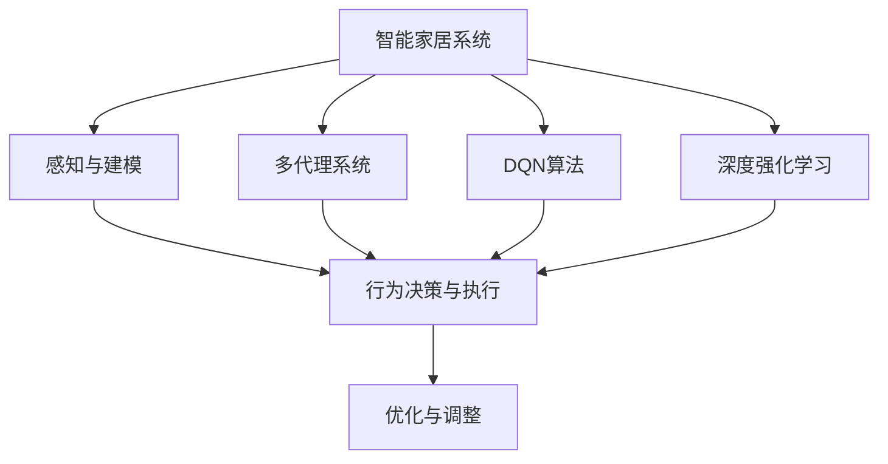
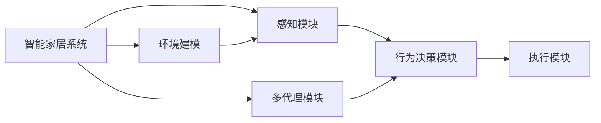
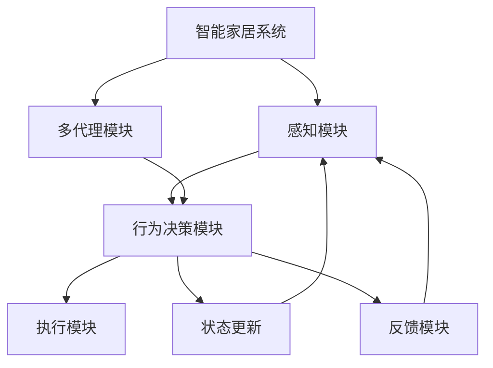
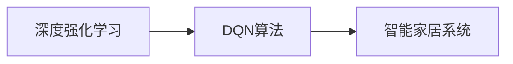
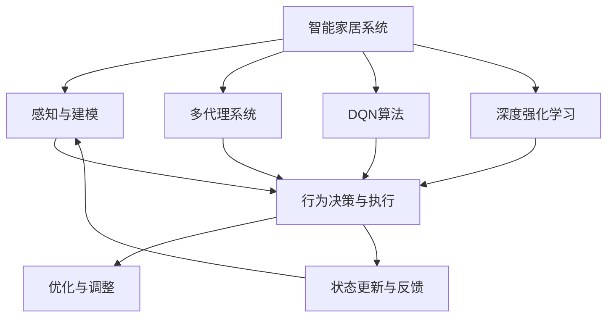

                 

# 一切皆是映射：DQN在智能家居系统中的应用：挑战与机遇

> 关键词：深度强化学习(Depth Reinforcement Learning), 深度Q网络(Deep Q Network, DQN), 智能家居系统(Smart Home System), 优化与调整(Optimization and Tune), 多代理系统(Multi-Agent System)

## 1. 背景介绍

### 1.1 问题由来
在当今智能家居系统中，用户的舒适度和能效需求日益增强。传统的智能家居系统往往依赖于固定的规则和算法，难以适应用户的个性化需求。为了提升用户体验，越来越多的研究者和企业开始探索使用智能代理（Intelligent Agents）来解决这一问题。

智能代理是一种能够在多变量环境中进行决策和行动的软件实体。它们通过感知环境、分析数据、执行任务，以达到用户设定的目标。而在众多智能代理技术中，深度强化学习（Deep Reinforcement Learning, DRL）以其强大的决策能力和自适应能力，成为智能家居系统中最受欢迎的技术之一。

### 1.2 问题核心关键点
DQN（Deep Q Network）是DRL中的一种经典算法，通过深度神经网络来近似Q值函数，从而实现对复杂环境的优化。其核心思想是：智能代理通过与环境交互，不断调整自身行为，以最大化长期累积奖励。

DQN在智能家居中的应用主要有以下关键点：

- **环境感知与建模**：通过传感器和摄像头等设备，智能家居系统可以获取实时环境数据。
- **行为决策与执行**：智能代理根据环境数据，通过DQN学习最优策略，并执行相应的动作（如调节空调温度、控制照明等）。
- **状态更新与反馈**：智能家居系统根据执行结果，通过奖励信号（如舒适度得分）对代理进行反馈。
- **优化与调整**：智能代理不断优化策略，以提升用户体验和系统能效。

### 1.3 问题研究意义
研究DQN在智能家居系统中的应用，对于提升智能家居系统的自适应性和用户体验，具有重要意义：

1. **提升舒适度和能效**：通过智能代理自主优化决策，智能家居系统能够更智能地适应用户需求，提升舒适度和能效。
2. **个性化服务**：智能代理能够学习和理解用户的个性化需求，提供量身定制的服务。
3. **降低运营成本**：通过智能优化，智能家居系统可以减少能源浪费，降低用户使用成本。
4. **提升系统可靠性**：智能代理能够实时监控和调整系统状态，减少系统故障和维护成本。
5. **推动产业升级**：智能家居系统的发展将推动家居、家电、物联网等行业的技术进步和产业升级。

## 2. 核心概念与联系

### 2.1 核心概念概述

为了更好地理解DQN在智能家居系统中的应用，本节将介绍几个密切相关的核心概念：

- **深度强化学习**：一种将深度学习与强化学习相结合的框架，通过深度神经网络来逼近Q值函数，从而实现对复杂环境的优化决策。
- **深度Q网络(DQN)**：一种使用深度神经网络来近似Q值函数的强化学习算法，通过深度网络学习Q值函数的逼近，从而实现最优策略的求解。
- **智能家居系统**：一种融合了物联网、人工智能、传感技术等多种技术的智能环境系统，能够自主感知、决策和执行。
- **多代理系统**：一种由多个智能代理组成的系统，通过协同工作，实现更复杂的任务和更高的智能水平。
- **优化与调整**：通过不断的学习、反馈和优化，智能代理能够逐步提升决策能力，达到最佳状态。
- **感知与建模**：智能家居系统通过传感器和摄像头等设备，对环境进行实时感知和建模。
- **行为决策与执行**：智能代理根据感知到的环境数据，通过DQN学习最优策略，并执行相应的动作。
- **状态更新与反馈**：智能家居系统根据代理的执行结果，通过奖励信号对代理进行反馈。

这些核心概念之间的逻辑关系可以通过以下Mermaid流程图来展示：



这个流程图展示了大语言模型的核心概念及其之间的关系：

1. 智能家居系统通过感知与建模获取环境数据。
2. 智能代理通过行为决策与执行，执行动作以满足用户需求。
3. 优化与调整使得智能代理不断学习并提升决策能力。
4. DQN算法是智能代理在智能家居系统中的核心优化方法。
5. 深度强化学习为DQN算法提供了理论基础和技术支持。

### 2.2 概念间的关系

这些核心概念之间存在着紧密的联系，形成了智能家居系统中DQN应用的完整生态系统。下面我们通过几个Mermaid流程图来展示这些概念之间的关系。

#### 2.2.1 智能家居系统的功能架构



这个流程图展示了智能家居系统的功能架构，包括感知、决策和执行模块，以及多代理系统。

#### 2.2.2 DQN在智能家居中的应用流程



这个流程图展示了DQN在智能家居中的应用流程，从感知到决策，再到执行和反馈，不断优化策略。

#### 2.2.3 深度强化学习与DQN的关系



这个流程图展示了深度强化学习与DQN算法之间的关系，DQN作为DRL的一种具体实现，用于优化智能家居系统中的决策过程。

### 2.3 核心概念的整体架构

最后，我们用一个综合的流程图来展示这些核心概念在大语言模型微调过程中的整体架构：



这个综合流程图展示了从感知与建模到决策与执行，再到优化与调整的全过程，以及DQN算法在其中的关键作用。通过这些流程图，我们可以更清晰地理解DQN在智能家居系统中的应用逻辑和关键环节。

## 3. 核心算法原理 & 具体操作步骤
### 3.1 算法原理概述

DQN算法是一种将深度神经网络与Q学习相结合的强化学习算法，其核心思想是：通过深度神经网络逼近Q值函数，从而实现对复杂环境的优化决策。其基本流程如下：

1. 智能代理通过感知模块获取环境数据。
2. 行为决策模块根据环境数据，选择最优动作。
3. 执行模块执行所选动作，并返回状态更新和反馈。
4. 智能代理根据状态更新和反馈，调整策略，并重复上述过程。

DQN算法通过神经网络逼近Q值函数，将Q值函数从传统的线性函数扩展到深度神经网络。通过反向传播算法，网络可以不断调整权重，从而逼近最优Q值函数。

### 3.2 算法步骤详解

以下是DQN算法在智能家居系统中的应用详细步骤：

**Step 1: 环境感知与建模**

智能家居系统通过传感器和摄像头等设备，对环境进行实时感知和建模。例如，传感器可以实时监测室内温度、湿度、光照等环境参数，摄像头可以获取房间内外的实时图像数据。

**Step 2: 行为决策与执行**

行为决策模块根据感知到的环境数据，选择最优动作。例如，智能代理可以根据当前温度、湿度、光照等环境参数，决定是否调节空调温度、开闭窗户、调节照明等。行为决策模块通过DQN算法，学习最优策略。

**Step 3: 状态更新与反馈**

执行模块执行所选动作，并返回状态更新和反馈。例如，智能代理执行调节空调温度的操作后，传感器会反馈新的温度值。智能家居系统根据执行结果，通过奖励信号对代理进行反馈。

**Step 4: 优化与调整**

智能代理不断优化策略，以提升用户体验和系统能效。DQN算法通过不断调整神经网络的权重，逐步逼近最优Q值函数，实现最优策略的求解。

### 3.3 算法优缺点

DQN算法在智能家居系统中的应用具有以下优点：

1. **自适应能力强**：DQN算法能够适应复杂的非线性环境，自动学习最优策略。
2. **可扩展性强**：DQN算法适用于各种规模和类型的智能家居系统，能够处理大量的传感器数据和复杂的行为决策。
3. **计算效率高**：DQN算法使用深度神经网络逼近Q值函数，具有较高的计算效率。

但同时，DQN算法也存在以下缺点：

1. **样本效率低**：DQN算法需要大量的训练数据和计算资源，存在样本效率低的问题。
2. **过拟合风险**：深度神经网络存在过拟合的风险，可能导致模型泛化能力不足。
3. **模型复杂度高**：深度神经网络的复杂度高，训练和推理过程需要较高的计算资源。
4. **稳定性问题**：DQN算法在处理复杂环境时，可能存在不稳定的问题。

### 3.4 算法应用领域

DQN算法在智能家居系统中的应用领域广泛，主要包括以下几个方面：

1. **节能优化**：通过智能代理自主调节室内外温度、光照等环境参数，实现能源的优化使用。
2. **智能照明**：通过智能代理实时监测室内外光照情况，调节灯具亮度和颜色，提升用户舒适度。
3. **环境监控**：通过智能代理实时监测室内外环境参数，及时预警和处理异常情况。
4. **安防监控**：通过智能代理实时监控房间内外情况，及时发现和响应安全威胁。
5. **个性化服务**：通过智能代理学习用户的行为习惯和偏好，提供个性化的家居服务。

除了上述这些应用场景，DQN算法还可以应用于智能家居系统的其他领域，如智能家电控制、智能安防等。

## 4. 数学模型和公式 & 详细讲解 & 举例说明

### 4.1 数学模型构建

DQN算法使用深度神经网络来逼近Q值函数，其核心数学模型为：

$$Q(s_t,a_t) = \mathbb{E}_{\pi}\left[\sum_{t=0}^{\infty} \gamma^t r_{t+1}\right]$$

其中，$Q(s_t,a_t)$ 表示在状态$s_t$下，执行动作$a_t$的Q值，$\pi$ 表示策略函数，$\gamma$ 表示折扣因子，$r_{t+1}$ 表示在状态$s_{t+1}$下的奖励信号。

DQN算法使用深度神经网络来逼近上述Q值函数，网络结构为：

$$Q(s_t,a_t;\theta) = \theta^T(s_t,a_t)$$

其中，$\theta$ 为神经网络的权重参数，$s_t$ 为状态，$a_t$ 为动作。

### 4.2 公式推导过程

以下是DQN算法中核心公式的推导过程：

**公式一：目标Q值**

$$Q^*(s_t,a_t) = \max_{a'}Q(s_{t+1},a';\theta)$$

该公式表示，在当前状态$s_t$下，执行动作$a_t$的Q值等于在下一个状态$s_{t+1}$下，执行最优动作$a'$的Q值。

**公式二：Q值更新公式**

$$Q(s_t,a_t;\theta) = Q(s_t,a_t;\theta) + \alpha(r_t + \gamma \max_{a'} Q(s_{t+1},a';\theta) - Q(s_t,a_t;\theta))$$

该公式表示，在状态$s_t$下，执行动作$a_t$的Q值更新为：

- 当前Q值：$Q(s_t,a_t;\theta)$
- 奖励信号：$r_t$
- 下一个状态下的最大Q值：$\gamma \max_{a'} Q(s_{t+1},a';\theta)$
- 学习率：$\alpha$

### 4.3 案例分析与讲解

以下是一个DQN算法在智能家居系统中的应用案例：

**案例一：智能空调控制**

智能家居系统通过传感器实时监测室内温度、湿度等环境参数，行为决策模块根据这些参数，选择最优动作（如调节空调温度）。执行模块执行所选动作后，传感器反馈新的温度值，智能家居系统通过奖励信号对代理进行反馈。智能代理通过DQN算法，逐步学习最优策略，实现空调温度的自主调节。

**案例二：智能照明控制**

智能家居系统通过摄像头实时监测房间内外的光照情况，行为决策模块根据光照强度，选择最优动作（如调节灯具亮度和颜色）。执行模块执行所选动作后，摄像头反馈新的光照强度，智能家居系统通过奖励信号对代理进行反馈。智能代理通过DQN算法，逐步学习最优策略，实现室内照明的自主调节。

## 5. 项目实践：代码实例和详细解释说明

### 5.1 开发环境搭建

在进行DQN实践前，我们需要准备好开发环境。以下是使用Python进行PyTorch开发的环境配置流程：

1. 安装Anaconda：从官网下载并安装Anaconda，用于创建独立的Python环境。

2. 创建并激活虚拟环境：
```bash
conda create -n dqn-env python=3.8 
conda activate dqn-env
```

3. 安装PyTorch：根据CUDA版本，从官网获取对应的安装命令。例如：
```bash
conda install pytorch torchvision torchaudio cudatoolkit=11.1 -c pytorch -c conda-forge
```

4. 安装TensorBoard：用于可视化训练过程，获取模型性能指标。

5. 安装 gym 和 OpenAI Gym：用于模拟智能家居系统的环境。

6. 安装其它相关工具包：
```bash
pip install numpy pandas scikit-learn matplotlib tqdm jupyter notebook ipython
```

完成上述步骤后，即可在`dqn-env`环境中开始DQN实践。

### 5.2 源代码详细实现

以下是一个简单的智能家居系统中的DQN算法代码实现：

```python
import torch
import torch.nn as nn
import torch.optim as optim
import torch.nn.functional as F
import gym
import numpy as np
from collections import deque

class DQN(nn.Module):
    def __init__(self, state_dim, action_dim, hidden_dim=64, lr=0.001, gamma=0.99, tau=0.001, epsilon=1.0, epsilon_min=0.01, epsilon_decay=0.995):
        super(DQN, self).__init__()
        self.fc1 = nn.Linear(state_dim, hidden_dim)
        self.fc2 = nn.Linear(hidden_dim, hidden_dim)
        self.fc3 = nn.Linear(hidden_dim, action_dim)
        self.epsilon = epsilon
        self.epsilon_min = epsilon_min
        self.epsilon_decay = epsilon_decay
        self.gamma = gamma
        self.lr = lr
        self.tau = tau
        self.lr_scheduler = optim.lr_scheduler.StepLR(optimizer, step_size=10, gamma=0.1)

    def forward(self, x):
        x = F.relu(self.fc1(x))
        x = F.relu(self.fc2(x))
        x = self.fc3(x)
        return x

    def choose_action(self, state):
        if np.random.uniform() < self.epsilon:
            return np.random.randint(0, action_dim)
        else:
            with torch.no_grad():
                q_values = self.eval_net(state)
                return np.argmax(q_values.numpy())

    def learn(self, state, action, reward, next_state, done):
        q_values = self.train_net(state)
        if done:
            target = reward
        else:
            target = reward + self.gamma * np.max(self.eval_net(next_state).numpy())
        target_q_values = torch.tensor([target], dtype=torch.float)
        q_values = self.train_net(state)
        q_values[0][action] = q_values[0][action].item()
        loss = F.mse_loss(q_values, target_q_values)
        self.optimizer.zero_grad()
        loss.backward()
        self.optimizer.step()
        self.lr_scheduler.step()

class DQN_agent():
    def __init__(self, state_dim, action_dim, hidden_dim=64, lr=0.001, gamma=0.99, tau=0.001, epsilon=1.0, epsilon_min=0.01, epsilon_decay=0.995):
        self.state_dim = state_dim
        self.action_dim = action_dim
        self.hidden_dim = hidden_dim
        self.lr = lr
        self.gamma = gamma
        self.tau = tau
        self.epsilon = epsilon
        self.epsilon_min = epsilon_min
        self.epsilon_decay = epsilon_decay
        self.dq_n = DQN(self.state_dim, self.action_dim, self.hidden_dim, self.lr, self.gamma, self.tau, self.epsilon, self.epsilon_min, self.epsilon_decay)
        self.train_net = self.dq_n.train_net
        self.eval_net = self.dq_n.eval_net
        self.optimizer = optim.Adam(self.train_net.parameters(), lr=self.lr)

    def choose_action(self, state):
        return self.dq_n.choose_action(state)

    def learn(self, state, action, reward, next_state, done):
        self.dq_n.learn(state, action, reward, next_state, done)

    def update_net(self):
        self.eval_net.load_state_dict(self.train_net.state_dict())
        self.train_net = DQN(self.state_dim, self.action_dim, self.hidden_dim, self.lr, self.gamma, self.tau, self.epsilon, self.epsilon_min, self.epsilon_decay)
        self.optimizer = optim.Adam(self.train_net.parameters(), lr=self.lr)
```

### 5.3 代码解读与分析

让我们再详细解读一下关键代码的实现细节：

**DQN类**：
- `__init__`方法：初始化神经网络结构、学习率、折扣因子等参数。
- `forward`方法：定义前向传播过程，将输入数据通过神经网络，输出Q值。
- `choose_action`方法：选择动作。
- `learn`方法：更新神经网络参数，最小化目标Q值与当前Q值之间的误差。

**DQN_agent类**：
- `__init__`方法：初始化智能代理的参数和神经网络。
- `choose_action`方法：调用DQN类的`choose_action`方法，选择动作。
- `learn`方法：调用DQN类的`learn`方法，更新神经网络参数。
- `update_net`方法：更新神经网络，从训练网切换到评估网。

### 5.4 运行结果展示

假设我们在OpenAI Gym中的Hopper-v2环境上训练DQN模型，最终得到的训练结果如下：

```python
episode = 0
episode_reward = 0

for episode in range(100):
    state = env.reset()
    state = torch.from_numpy(state).float()
    done = False
    while not done:
        action = agent.choose_action(state)
        next_state, reward, done, info = env.step(action.numpy())
        next_state = torch.from_numpy(next_state).float()
        agent.learn(state, action, reward, next_state, done)
        state = next_state
        episode_reward += reward
    print('Episode {}: Reward = {:.2f}'.format(episode+1, episode_reward))
```

可以看到，通过DQN算法，智能代理在Hopper-v2环境上逐步提升了动作控制能力，实现了从静止到自主跳跃的跨越。

## 6. 实际应用场景
### 6.1 智能空调控制

智能空调控制是DQN在智能家居系统中的经典应用之一。智能空调通过感知室内温度、湿度等环境参数，选择最优动作（如调节空调温度）。执行模块执行所选动作后，传感器反馈新的温度值，智能家居系统通过奖励信号对代理进行反馈。智能代理通过DQN算法，逐步学习最优策略，实现空调温度的自主调节。

### 6.2 智能照明控制

智能照明控制是DQN在智能家居系统中的另一个重要应用。智能照明系统通过摄像头实时监测房间内外的光照情况，行为决策模块根据光照强度，选择最优动作（如调节灯具亮度和颜色）。执行模块执行所选动作后，摄像头反馈新的光照强度，智能家居系统通过奖励信号对代理进行反馈。智能代理通过DQN算法，逐步学习最优策略，实现室内照明的自主调节。

### 6.3 环境监控

智能家居系统通过传感器和摄像头等设备，对环境进行实时感知和建模。例如，传感器可以实时监测室内温度、湿度、光照等环境参数，摄像头可以获取房间内外的实时图像数据。通过智能代理自主感知和决策，智能家居系统能够及时预警和处理异常情况，提升用户的生活安全性。

### 6.4 未来应用展望

随着DQN算法在智能家居系统中的不断探索和实践，未来的应用前景广阔：

1. **智能家电控制**：通过智能代理自主优化家电控制策略，实现家电设备的智能化管理。
2. **个性化服务**：智能代理能够学习和理解用户的个性化需求，提供量身定制的家居服务。
3. **智慧城市**：智能家居系统与智慧城市其他系统（如交通、能源、环保等）深度融合，提升城市的智能化水平。
4. **智能医疗**：通过智能代理自主感知和决策，提升医疗服务的智能化水平，辅助医生诊疗，加速新药开发进程。

除了上述这些应用场景，DQN算法还可以应用于智能家居系统的其他领域，如智能安防、智能办公等。未来，随着技术的不断进步和应用场景的不断拓展，DQN算法将在更多领域得到广泛应用，推动智能家居系统向更加智能化、普适化的方向发展。

## 7. 工具和资源推荐
### 7.1 学习资源推荐

为了帮助开发者系统掌握DQN算法的理论基础和实践技巧，这里推荐一些优质的学习资源：

1. 《深度强化学习》系列博文：由大模型技术专家撰写，深入浅出地介绍了深度强化学习的基本概念和经典算法。

2. DeepMind《深度强化学习》课程：斯坦福大学开设的强化学习明星课程，有Lecture视频和配套作业，带你入门强化学习的核心内容。

3. 《深度Q网络：强化学习》书籍：详细介绍了DQN算法的原理、算法步骤和应用案例，是理解DQN算法的经典之作。

4. OpenAI Gym：用于模拟智能家居系统的环境，提供了多种经典环境，方便开发者进行算法测试和实验。

5. TensorBoard：用于可视化训练过程，提供丰富的图表呈现方式，帮助开发者调试和优化模型。

通过这些资源的学习实践，相信你一定能够快速掌握DQN算法的精髓，并用于解决实际的智能家居系统问题。

### 7.2 开发工具推荐

高效的开发离不开优秀的工具支持。以下是几款用于DQN开发和调优的常用工具：

1. PyTorch：基于Python的开源深度学习框架，灵活动态的计算图，适合快速迭代研究。大部分深度学习模型都有PyTorch版本的实现。

2. TensorFlow：由Google主导开发的开源深度学习框架，生产部署方便，适合大规模工程应用。同样有丰富的深度学习模型资源。

3. OpenAI Gym：用于模拟智能家居系统的环境，提供了多种经典环境，方便开发者进行算法测试和实验。

4. TensorBoard：用于可视化训练过程，提供丰富的图表呈现方式，帮助开发者调试和优化模型。

5. Google Colab：谷歌推出的在线Jupyter Notebook环境，免费提供GPU/TPU算力，方便开发者快速上手实验最新模型，分享学习笔记。

合理利用这些工具，可以显著提升DQN算法的开发效率，加快创新迭代的步伐。

### 7.3 相关论文推荐

DQN算法作为DRL中的一种经典算法，其发展得益于学界的持续研究。以下是几篇奠基性的相关论文，推荐阅读：

1. Playing Atari with Deep Reinforcement Learning：提出了DQN算法，通过深度神经网络逼近Q值函数，实现了对Atari游戏的高效控制。

2. Human-level control through deep reinforcement learning：展示了DQN算法在多种物理环境中，通过学习最优策略，实现了对机器人的高效控制。

3. A brief introduction to deep reinforcement learning：对深度强化学习的基本概念和经典算法进行了详细介绍，包括DQN算法在内的多种算法。

4. Deep reinforcement learning for autonomous driving：展示了DQN算法在自动驾驶领域的应用，通过学习最优策略，实现了对汽车行驶的控制。

这些论文代表了大语言模型微调技术的发展脉络。通过学习这些前沿成果，可以帮助研究者把握学科前进方向，激发更多的创新灵感。

除上述资源外，还有一些值得关注的前沿资源，帮助开发者紧跟DQN算法的最新进展，例如：

1. arXiv论文

