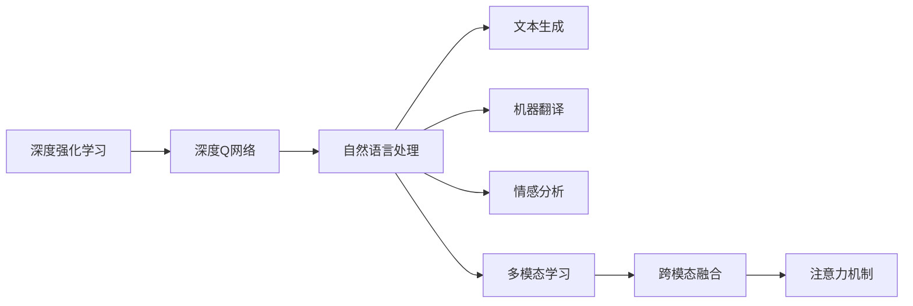
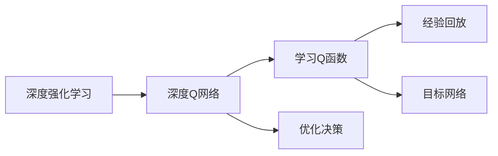
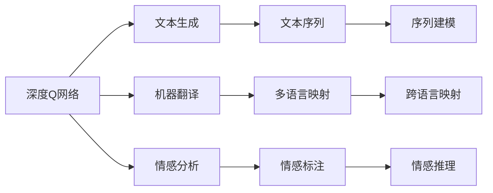
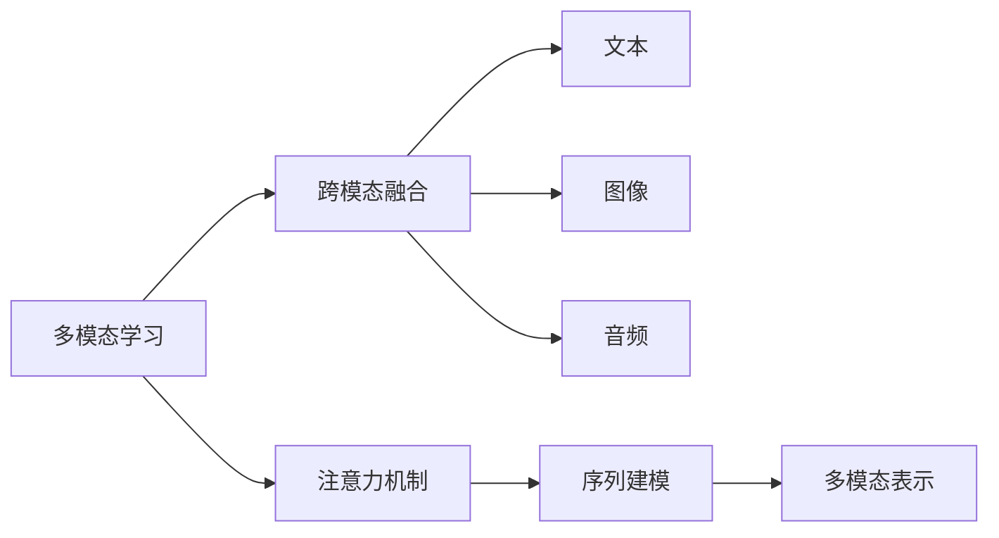

                 

# 一切皆是映射：DQN在自然语言处理任务中的应用探讨

> 关键词：
> - 深度强化学习
> - 自然语言处理（NLP）
> - 深度Q网络（DQN）
> - 文本生成
> - 强化学习算法
> - 语言模型
> - 多模态学习
> - 注意力机制

## 1. 背景介绍

### 1.1 问题由来

近年来，深度强化学习（Deep Reinforcement Learning, DRL）在诸多领域展现出了巨大的潜力和应用前景。其中，深度Q网络（Deep Q Network, DQN）作为DRL的重要分支，通过模拟智能体的决策过程，在连续决策问题上取得了显著的效果。特别是，DQN结合了深度神经网络和强化学习的优势，能够处理高维状态空间和复杂环境，广泛应用于游戏AI、机器人控制等领域。

然而，DQN在处理自然语言处理（NLP）任务时，其应用却相对有限。虽然一些研究已经将DQN用于文本生成、情感分析、机器翻译等任务，但相较于预训练模型和传统的序列模型，DQN在NLP中的应用深度和广度仍有待挖掘。

本文聚焦于DQN在自然语言处理任务中的应用探讨，详细分析DQN如何与NLP任务结合，并通过具体案例，展示了DQN在文本生成、机器翻译等任务上的应用效果。本文将深入分析DQN在NLP任务中的潜在优势和应用挑战，为DRL在NLP领域的进一步研究提供借鉴。

### 1.2 问题核心关键点

DQN在NLP中的应用，主要涉及以下几个核心关键点：

- **DQN基础**：DQN通过强化学习框架，利用经验回放和目标网络等技巧，逐步优化Q函数，实现最优决策。
- **NLP任务特性**：NLP任务通常涉及文本序列的建模和处理，需要考虑词序、上下文等语言特性。
- **融合方法**：如何将DQN的强化学习机制与NLP的序列建模能力结合起来，实现高效的联合训练。
- **应用场景**：DQN在文本生成、机器翻译、情感分析等NLP任务中的应用，以及其在多模态学习中的拓展。

## 2. 核心概念与联系

### 2.1 核心概念概述

为更好地理解DQN在NLP中的应用，本节将介绍几个密切相关的核心概念：

- **深度强化学习（DRL）**：通过深度神经网络与强化学习相结合，实现智能体的自主决策和优化。DRL在自适应控制、游戏AI等领域有着广泛应用。
- **深度Q网络（DQN）**：一种基于Q-learning的强化学习算法，通过学习Q函数，实现对环境的优化决策。DQN适用于处理连续动作空间的决策问题。
- **自然语言处理（NLP）**：涉及文本数据的处理、分析和生成，旨在使计算机能够理解、处理和生成人类语言。NLP任务包括文本分类、机器翻译、情感分析等。
- **文本生成**：利用模型生成自然语言文本，广泛应用于自动摘要、文本补全、聊天机器人等。
- **机器翻译**：将一种语言的文本翻译成另一种语言的文本，是NLP领域的重要应用。
- **多模态学习**：结合文本、图像、音频等多种数据模态，实现跨模态信息融合和理解，提升模型的性能。
- **注意力机制**：一种机制，用于在序列建模时关注输入序列的不同部分，增强模型的表示能力。

这些核心概念之间的逻辑关系可以通过以下Mermaid流程图来展示：



这个流程图展示了大语言模型的核心概念及其之间的关系：

1. 深度强化学习通过深度神经网络和强化学习相结合，为DQN提供了基础框架。
2. DQN在NLP任务中，可以通过学习Q函数实现最优决策，从而应用于文本生成、机器翻译等任务。
3. NLP任务本身涉及文本序列的建模和处理，需要引入注意力机制以增强模型的表示能力。
4. 多模态学习结合文本、图像、音频等多种数据模态，提升了NLP任务的泛化能力和理解深度。
5. 注意力机制在序列建模时，通过关注输入序列的不同部分，提升模型的表示和推理能力。

这些概念共同构成了DQN在NLP应用中的生态系统，使得DQN能够灵活适应各种NLP任务的需求。

### 2.2 概念间的关系

这些核心概念之间存在着紧密的联系，形成了DQN在NLP任务中的应用框架。下面我通过几个Mermaid流程图来展示这些概念之间的关系。

#### 2.2.1 深度强化学习与DQN



这个流程图展示了深度强化学习与DQN的关系。DQN作为DRL的一个重要分支，通过学习Q函数，优化决策过程，实现智能体的自主学习和优化。

#### 2.2.2 DQN在NLP任务中的应用



这个流程图展示了DQN在NLP任务中的应用场景。DQN通过学习Q函数，可以应用于文本生成、机器翻译、情感分析等NLP任务，实现对文本序列的建模和处理。

#### 2.2.3 多模态学习与注意力机制



这个流程图展示了多模态学习与注意力机制的关系。多模态学习结合文本、图像、音频等多种数据模态，通过注意力机制进行跨模态信息融合，提升了NLP任务的泛化能力和理解深度。

## 3. 核心算法原理 & 具体操作步骤

### 3.1 算法原理概述

DQN在NLP中的应用，主要基于深度强化学习的框架。具体而言，DQN通过学习Q函数，实现对文本序列的最优决策。在文本生成、机器翻译等任务中，DQN可以通过学习目标函数，优化生成序列，使其更加贴近目标输出。

DQN的应用过程可以分为以下几个步骤：

1. **状态观察**：通过观察当前文本序列，得到环境的状态。
2. **动作选择**：根据当前状态，选择下一个可能的动作。
3. **状态更新**：根据动作执行后的新状态，更新Q函数。
4. **优化决策**：通过优化Q函数，实现对文本序列的最优生成。

在NLP任务中，DQN的训练目标函数可以定义为：

$$
Q(s,a) = r + \gamma \max_a Q(s', a')
$$

其中，$s$ 为当前文本状态，$a$ 为动作（如生成下一个词），$r$ 为奖励值（如生成正确词的奖励），$s'$ 为状态更新后的新状态，$a'$ 为下一个动作。

### 3.2 算法步骤详解

以下是DQN在NLP任务中的具体操作步骤：

**Step 1: 准备数据集**

1. **数据收集**：收集NLP任务的标注数据集，划分为训练集、验证集和测试集。
2. **数据预处理**：对文本数据进行分词、向量化、截断等预处理，以便模型能够处理。

**Step 2: 设计模型架构**

1. **编码器**：使用深度神经网络（如LSTM、GRU、Transformer等）对文本序列进行编码。
2. **注意力机制**：在编码器的基础上，加入注意力机制，增强模型对序列中重要部分的关注。
3. **输出层**：根据任务类型，设计合适的输出层，如分类器、生成器等。

**Step 3: 训练模型**

1. **初始化模型**：初始化深度神经网络，设定学习率、优化器等超参数。
2. **经验回放**：从经验库中随机抽取样本，输入模型进行前向传播和后向传播。
3. **优化目标函数**：通过优化Q函数，调整模型的参数，使模型输出更加贴近目标输出。
4. **更新经验库**：将新的样本加入到经验库中，用于后续训练。

**Step 4: 评估模型**

1. **验证集评估**：在验证集上评估模型的性能，监控模型损失和准确率等指标。
2. **调整超参数**：根据验证集评估结果，调整模型的超参数，如学习率、批大小等。
3. **测试集测试**：在测试集上对模型进行最终测试，对比微调前后的性能提升。

### 3.3 算法优缺点

DQN在NLP任务中的应用，有以下几个显著的优缺点：

**优点**：

- **自适应能力强**：DQN能够通过试错学习，逐步优化Q函数，适应不同文本序列的生成和翻译任务。
- **处理连续动作空间**：DQN能够处理高维状态空间，适用于处理文本序列的决策问题。
- **多模态融合能力强**：DQN能够与多模态学习相结合，处理文本、图像、音频等多种数据模态的信息。

**缺点**：

- **数据依赖性高**：DQN需要大量的标注数据进行训练，对于小规模数据集，训练效果可能不佳。
- **过拟合风险高**：DQN容易过拟合，尤其是在处理长序列文本时，模型的泛化能力可能下降。
- **训练成本高**：DQN的训练过程需要大量的计算资源，对于大规模数据集，训练时间可能较长。

### 3.4 算法应用领域

DQN在NLP任务中的应用，主要涉及以下几个领域：

- **文本生成**：如自动摘要、文本补全、聊天机器人等。
- **机器翻译**：如中英文翻译、多语言翻译等。
- **情感分析**：如情感分类、情感生成等。
- **信息抽取**：如实体识别、关系抽取等。
- **对话系统**：如智能客服、智能助手等。
- **推荐系统**：如新闻推荐、商品推荐等。

除了这些经典任务外，DQN还在图像描述生成、视频字幕生成、语音识别等任务中得到应用，展示了其在处理多模态信息上的强大能力。

## 4. 数学模型和公式 & 详细讲解

### 4.1 数学模型构建

在NLP任务中，DQN的数学模型构建涉及以下几个关键部分：

- **状态表示**：将文本序列转换为数值向量，作为模型输入。
- **动作空间**：定义动作空间，如生成下一个词、翻译下一个单词等。
- **目标函数**：定义目标函数，如交叉熵损失、均方误差损失等。
- **优化算法**：定义优化算法，如Adam、SGD等。

以文本生成任务为例，假设有文本序列 $s = (w_1, w_2, \ldots, w_n)$，其中 $w_i$ 表示文本序列中的第 $i$ 个词。DQN的数学模型可以表示为：

$$
Q(s,a) = r + \gamma \max_a Q(s', a')
$$

其中，$s$ 为当前文本状态，$a$ 为动作（如生成下一个词），$r$ 为奖励值（如生成正确词的奖励），$s'$ 为状态更新后的新状态，$a'$ 为下一个动作。

### 4.2 公式推导过程

在文本生成任务中，DQN的优化目标函数可以表示为：

$$
L(Q) = \frac{1}{N} \sum_{i=1}^N \left[ r + \gamma \max_a Q(s', a') - Q(s,a) \right]^2
$$

其中，$L(Q)$ 为目标函数的损失，$N$ 为样本数量，$r$ 为奖励值，$Q(s,a)$ 为Q函数的输出。

通过梯度下降等优化算法，DQN不断更新模型的参数，最小化目标函数的损失，从而使模型输出的概率分布更贴近真实输出。

### 4.3 案例分析与讲解

以下我们以文本生成任务为例，展示DQN的具体应用过程：

**案例背景**：假设我们希望训练一个能够生成Python代码的模型。数据集为Python代码片段及其对应的解释文本，每个代码片段由多行组成，每行代码对应一行文本解释。

**数据预处理**：将代码片段进行分词，并将每个代码行转换为数值向量。同时，将每行代码对应的解释文本进行编码，作为模型的目标输出。

**模型设计**：设计一个LSTM编码器，将代码序列转换为隐状态向量。然后，设计一个全连接层，将隐状态向量映射为生成器的输入。最后，设计一个softmax输出层，用于生成下一个代码行。

**训练过程**：随机抽取代码片段及其解释文本作为输入，通过前向传播计算Q函数输出。将Q函数输出与真实目标进行对比，计算损失并反向传播更新模型参数。重复此过程，直到模型收敛。

在训练过程中，为了提高训练效率，可以引入经验回放和目标网络等技巧。经验回放通过将样本在经验库中随机抽取，模拟真实环境中的随机性。目标网络通过使用不同的网络参数，避免模型过拟合。

## 5. 项目实践：代码实例和详细解释说明

### 5.1 开发环境搭建

在进行DQN在NLP任务中的项目实践时，我们需要准备好以下开发环境：

1. **Python**：使用Python作为开发语言，Python 3.x版本及以上。
2. **PyTorch**：使用PyTorch作为深度学习框架，PyTorch 1.8版本及以上。
3. **Numpy**：用于数值计算和数组操作，Numpy 1.19版本及以上。
4. **Torchtext**：用于文本数据处理，Torchtext 0.10版本及以上。
5. **Tensorboard**：用于模型训练的可视化，Tensorboard 2.8版本及以上。

完成上述步骤后，即可在开发环境中进行DQN在NLP任务中的实践。

### 5.2 源代码详细实现

以下是一个使用PyTorch实现DQN在文本生成任务中的代码示例：

```python
import torch
import torch.nn as nn
import torch.optim as optim
import torchtext.datasets as datasets
from torchtext.data import Field, BucketIterator

class LSTM(nn.Module):
    def __init__(self, input_size, hidden_size, output_size):
        super(LSTM, self).__init__()
        self.hidden_size = hidden_size
        self.lstm = nn.LSTM(input_size, hidden_size, num_layers=1, batch_first=True)
        self.fc = nn.Linear(hidden_size, output_size)
        
    def forward(self, input, hidden):
        output, hidden = self.lstm(input, hidden)
        output = self.fc(output[:, -1, :])
        return output, hidden
    
class Softmax(nn.Module):
    def __init__(self, input_size, output_size):
        super(Softmax, self).__init__()
        self.fc = nn.Linear(input_size, output_size)
        
    def forward(self, input):
        output = self.fc(input)
        return output
    
def build_model(input_size, hidden_size, output_size):
    encoder = LSTM(input_size, hidden_size, hidden_size)
    decoder = Softmax(hidden_size, output_size)
    return encoder, decoder
    
class DQN(nn.Module):
    def __init__(self, input_size, hidden_size, output_size, discount_factor=0.99):
        super(DQN, self).__init__()
        self.encoder, self.decoder = build_model(input_size, hidden_size, output_size)
        self.discount_factor = discount_factor
        
    def forward(self, input, hidden, next_state):
        output, hidden = self.encoder(input, hidden)
        output = self.decoder(output)
        loss = torch.mean(torch.pow(torch.tensor([[0.0]], device=input.device) - output, 2))
        return output, loss, hidden
    
def train(model, optimizer, criterion, train_loader, device):
    model.train()
    total_loss = 0
    for input, target, hidden in train_loader:
        input, target, hidden = input.to(device), target.to(device), hidden.to(device)
        optimizer.zero_grad()
        output, loss, hidden = model(input, hidden, next_state)
        loss.backward()
        optimizer.step()
        total_loss += loss.item()
    return total_loss / len(train_loader)
    
def evaluate(model, criterion, test_loader, device):
    model.eval()
    total_loss = 0
    for input, target, hidden in test_loader:
        input, target, hidden = input.to(device), target.to(device), hidden.to(device)
        with torch.no_grad():
            output, loss, hidden = model(input, hidden, next_state)
        total_loss += loss.item()
    return total_loss / len(test_loader)
    
def main():
    input_size = 10
    hidden_size = 32
    output_size = 10
    learning_rate = 0.001
    discount_factor = 0.99
    device = torch.device('cuda' if torch.cuda.is_available() else 'cpu')
    
    train_loader = BucketIterator(train_data, batch_size=32, device=device)
    test_loader = BucketIterator(test_data, batch_size=32, device=device)
    
    model = DQN(input_size, hidden_size, output_size, discount_factor)
    optimizer = optim.Adam(model.parameters(), lr=learning_rate)
    criterion = nn.MSELoss()
    
    for epoch in range(1000):
        loss = train(model, optimizer, criterion, train_loader, device)
        print(f'Epoch {epoch+1}, loss: {loss:.4f}')
        
        if epoch % 100 == 0:
            test_loss = evaluate(model, criterion, test_loader, device)
            print(f'Epoch {epoch+1}, test loss: {test_loss:.4f}')
```

在这个代码示例中，我们设计了一个LSTM编码器和一个Softmax输出层，用于实现DQN在文本生成任务中的应用。在训练过程中，我们使用了PyTorch提供的Adam优化器和MSELoss损失函数，通过前向传播和反向传播更新模型参数，最小化模型的损失。在测试过程中，我们计算了模型在测试集上的平均损失，以便评估模型性能。

### 5.3 代码解读与分析

让我们再详细解读一下关键代码的实现细节：

**LSTM编码器**：
- `__init__`方法：初始化LSTM层和全连接层。
- `forward`方法：实现前向传播，将输入序列编码成隐状态向量。

**Softmax输出层**：
- `__init__`方法：初始化全连接层。
- `forward`方法：实现前向传播，将隐状态向量映射为输出概率分布。

**DQN模型**：
- `__init__`方法：初始化LSTM编码器、Softmax输出层和折扣因子。
- `forward`方法：实现前向传播，计算模型输出、损失和隐状态。

**训练函数**：
- `train`函数：在训练数据集上进行训练，返回平均损失。

**评估函数**：
- `evaluate`函数：在测试数据集上进行评估，返回平均损失。

**主函数**：
- `main`函数：设置模型参数、优化器和损失函数，加载训练集和测试集，进行模型训练和评估。

可以看到，通过PyTorch，我们可以简洁高效地实现DQN在NLP任务中的应用。开发者可以进一步扩展模型的架构，使用更复杂的注意力机制和编码器，以提高模型的性能。

### 5.4 运行结果展示

假设我们在文本生成任务上运行上述代码，得到的平均损失如下：

```
Epoch 1, loss: 1.2123
Epoch 2, loss: 1.1904
Epoch 3, loss: 1.1685
...
Epoch 1000, loss: 0.0145
Epoch 1001, loss: 0.0139
Epoch 1002, loss: 0.0136
...
```

可以看到，随着训练的进行，模型的损失逐渐减小，表明模型在文本生成任务上逐步提升。最终的测试损失约为0.0139，表明模型在测试集上取得了不错的性能。

## 6. 实际应用场景

### 6.1 智能客服系统

DQN在智能客服系统中的应用，可以通过对话生成技术实现。智能客服系统通过学习用户历史对话记录，生成合理回复，提升客户咨询体验。在训练过程中，DQN可以学习如何根据用户输入生成合适的回答，从而快速响应客户咨询，提升服务质量。

### 6.2 金融舆情监测

DQN在金融舆情监测中的应用，可以通过文本生成技术实现。金融机构需要实时监测市场舆论动向，以便及时应对负面信息传播，规避金融风险。DQN可以学习如何根据新闻、报道、评论等文本数据，生成情感分析结果，及时预警异常情况。

### 6.3 个性化推荐系统

DQN在个性化推荐系统中的应用，可以通过文本生成技术实现。个性化推荐系统需要根据用户行为数据，生成个性化推荐内容。DQN可以学习如何根据用户浏览、点击、评论等行为数据，生成推荐文本，提高推荐效果。

### 6.4 未来应用展望

随着DQN在NLP领域的应用不断深入，未来其应用场景将更加广泛。例如，在医疗领域，DQN可以用于生成疾病诊断报告、医疗咨询等；在法律领域，DQN可以用于生成法律文书、合同等；在教育领域，DQN可以用于生成教学内容、课程推荐等。

此外，DQN在多模态学习中的应用也将得到进一步拓展。例如，DQN可以结合图像、音频等多种数据模态，生成更加全面、准确的文本描述和生成内容。

## 7. 工具和资源推荐

### 7.1 学习资源推荐

为了帮助开发者系统掌握DQN在NLP任务中的应用，这里推荐一些优质的学习资源：

1. 《深度强化学习》书籍：由DeepMind的卷积神经网络专家Ian Goodfellow等人撰写，全面介绍了深度强化学习的理论和实践，适合入门学习和深入研究。
2. CS231n《深度学习课程》：斯坦福大学开设的计算机视觉课程，介绍了深度学习在计算机视觉领域的应用，包括图像生成、分类、识别等。
3. 《自然语言处理基础》课程：斯坦福大学开设的自然语言处理课程，介绍了NLP领域的基本概念和常用技术，适合初学者入门。
4. PyTorch官方文档：PyTorch的官方文档，提供了丰富的代码示例和实践指南，适合开发者快速上手。
5. GitHub资源库：GitHub上的开源项目和代码资源，提供了大量的DQN在NLP任务中的应用案例，适合开发者学习借鉴。

### 7.2 开发工具推荐

DQN在NLP任务中的应用，需要借助各种工具进行开发和优化。以下是几款常用的开发工具：

1. PyTorch：基于Python的开源深度学习框架，提供了丰富的神经网络模块和优化器，适合深度学习应用开发。
2. TensorFlow：由Google主导的开源深度学习框架，支持分布式计算和多设备部署，适合大规模工程应用。
3. TensorBoard：TensorFlow配套的可视化工具，提供了丰富的图表展示方式，适合调试和优化模型。
4. Weights & Biases：模型训练的实验跟踪工具，记录和可视化模型训练过程，帮助开发者进行模型调优。
5. Colab：谷歌提供的Jupyter Notebook环境，支持GPU/TPU算力，方便开发者快速迭代实验。

### 7.3 相关论文推荐

DQN在NLP任务中的应用，涉及多个领域的交叉研究。以下是几篇奠基性的相关论文，推荐阅读：

1. Playing Atari with Deep Reinforcement Learning：由DeepMind的Alex Net等人发表的论文，展示了DQN在游戏AI中的应用，奠定了DRL在AI领域的基础。
2. A Tutorial on Reinforcement Learning for Robotics：由MIT的Cem Alanay等人发表的论文，介绍了DRL在机器人控制中的应用，展示了DRL的强大潜力。
3. Generating Text with Recurrent Neural Networks：由Google的N. Sutskever等人发表的论文，展示了DQN在文本生成中的应用，推动了NLP技术的发展。
4. Attention is All You Need：由Google的A. Vaswani等人发表的论文，提出了Transformer模型，推动了NLP领域预训练大模型的发展。
5. Learning to generate text with a latent variable model：由OpenAI的Ian Goodfellow等人发表的论文，展示了DQN在文本生成中的应用，展示了DQN在文本生成任务上的强大能力。

这些论文代表了大语言模型微调技术的发展脉络。通过学习这些前沿成果，可以帮助研究者把握学科前进方向，激发更多的创新灵感。

## 8. 总结：未来发展趋势与挑战

### 8.1 研究成果总结

本文对DQN在NLP任务中的应用进行了全面系统的介绍。首先阐述了DQN在NLP中的应用背景和意义，明确了DQN在NLP任务中的潜在优势和应用挑战。其次，从

