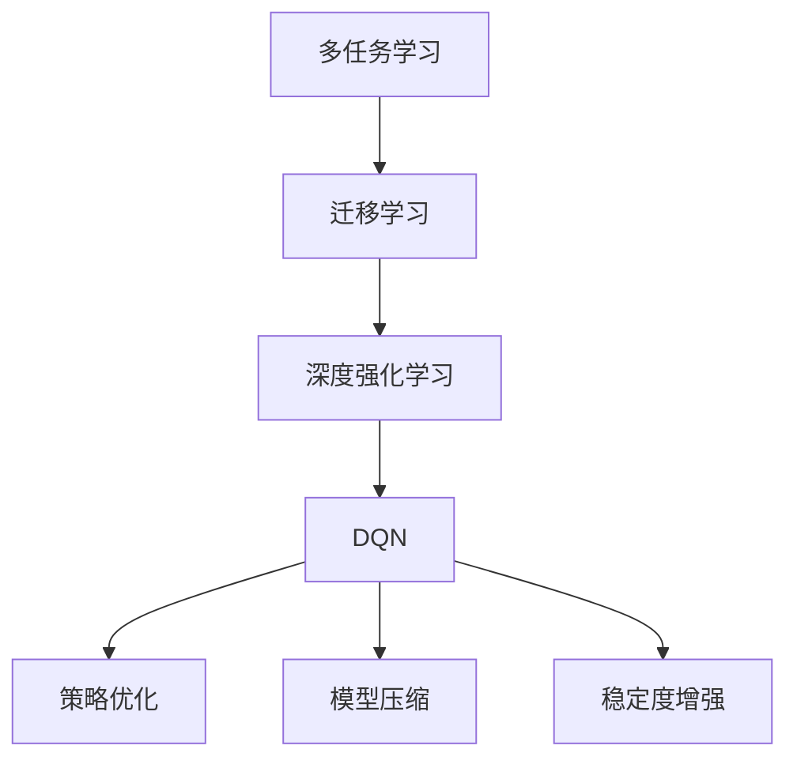
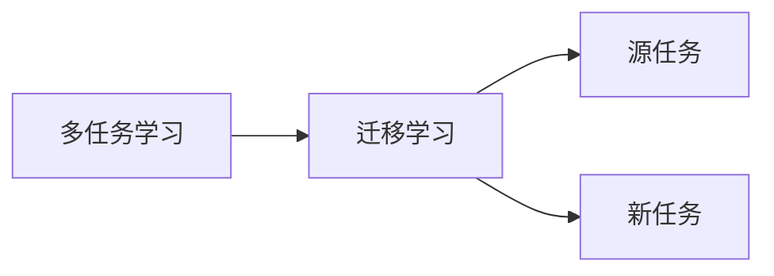
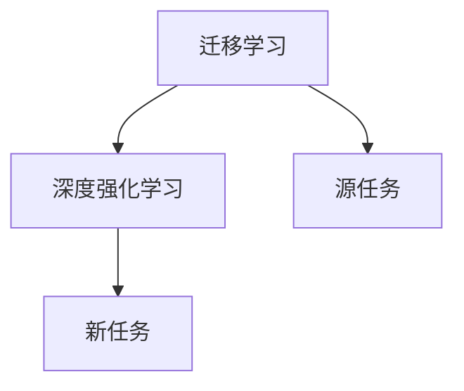
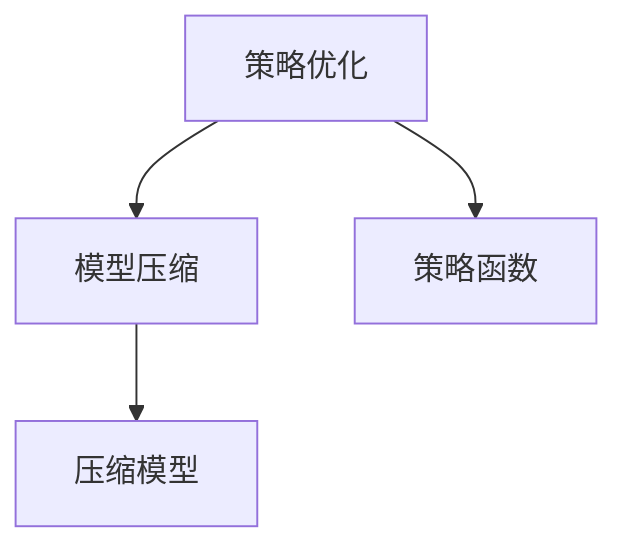
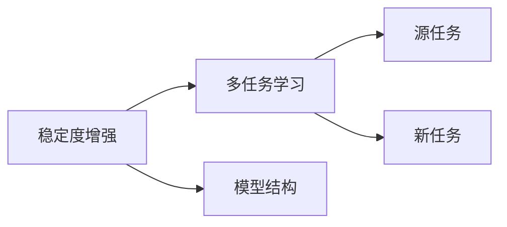
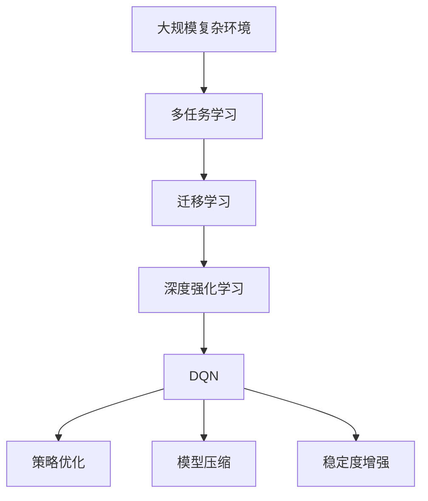

                 

# 一切皆是映射：DQN的多任务学习与迁移学习策略探讨

> 关键词：多任务学习(Multi-Task Learning, MTL),迁移学习(Transfer Learning),深度强化学习(Deep Reinforcement Learning),DQN(Deep Q-Networks),策略优化(Strategy Optimization),模型压缩(Model Compression),稳定度增强(Stability Enhancement)

## 1. 背景介绍

### 1.1 问题由来

近年来，随着深度学习技术的发展，强化学习(Reinforcement Learning, RL)被广泛应用于自动驾驶、游戏AI、机器人控制等领域，取得了一系列令人瞩目的成果。其中，深度Q网络(Depth Q-Networks, DQN)作为一种经典的深度强化学习算法，在求解复杂问题上表现出色。然而，在实际应用中，DQN面临着如下挑战：

1. **样本效率低**：DQN在大规模复杂环境中往往需要数百万甚至数十亿个样本才能收敛，极大地增加了训练成本和时间。
2. **鲁棒性差**：DQN容易受到环境变化和噪声的干扰，泛化能力较弱。
3. **参数量庞大**：DQN模型参数量较大，导致计算资源消耗高，推理速度慢。

为了应对这些挑战，研究人员提出了多种改进方法，如多任务学习(Multi-Task Learning, MTL)和迁移学习(Transfer Learning)等。这些方法通过在多个任务间共享知识和经验，有助于提高DQN的样本效率、鲁棒性和推理速度。然而，现有方法多聚焦于单一任务或局部问题，缺乏全局视角和系统性思考。

### 1.2 问题核心关键点

本节将重点探讨多任务学习与迁移学习在大规模复杂环境中如何提升DQN的性能和效率，特别关注以下几个核心问题：

1. **多任务学习如何设计任务**：如何选择和设计多个相关但不完全相同的任务，以充分利用数据并最大化知识共享。
2. **迁移学习如何优化**：如何优化迁移过程，避免在新任务上的“灾难性遗忘”，并高效地利用源任务的泛化能力。
3. **模型压缩如何实现**：如何在保证模型性能的前提下，减少模型参数和计算资源，加速模型推理和训练。
4. **稳定度增强如何处理**：如何增强DQN的鲁棒性和稳定性，应对环境变化和噪声干扰。

### 1.3 问题研究意义

研究多任务学习和迁移学习在大规模复杂环境中如何提升DQN的性能和效率，对于实现高效、稳健的强化学习系统具有重要意义：

1. **提升样本效率**：多任务学习和迁移学习可以利用多个任务的共同数据和特征，减少单一任务所需的样本数量，加速模型收敛。
2. **提高鲁棒性**：通过在多个任务中学习泛化能力，DQN能够在不同环境中保持较好的表现，减少环境变化和噪声对模型的干扰。
3. **降低计算成本**：模型压缩方法可以在保证性能的同时，减少模型参数和计算资源，降低训练和推理的计算成本。
4. **增强稳定性**：稳定度增强方法可以提高DQN的鲁棒性和可靠性，使其在实际应用中更加稳定和可靠。
5. **推动应用创新**：多任务学习和迁移学习的应用，可以推动DQN在更广泛领域的应用，如机器人控制、智能交通、工业自动化等，加速智能技术的产业化进程。

## 2. 核心概念与联系

### 2.1 核心概念概述

为了更好地理解多任务学习和迁移学习在大规模复杂环境中如何提升DQN的性能和效率，本节将介绍几个密切相关的核心概念：

- **多任务学习(Multi-Task Learning, MTL)**：在多个相关但不同任务间共享知识，以提高模型性能的方法。MLT通过同时训练多个任务，最大化任务的共同特征，从而提升模型的泛化能力和鲁棒性。
- **迁移学习(Transfer Learning)**：利用源任务的知识，在新任务上进行学习的方法。通过在多个任务间迁移知识和经验，迁移学习可以加速模型在新任务上的收敛。
- **深度强化学习(Deep Reinforcement Learning, DRL)**：结合深度学习和强化学习的技术，通过与环境的交互学习最优策略的算法。DRL在自动控制、游戏AI等领域应用广泛。
- **DQN(Deep Q-Networks)**：一种结合深度学习和Q学习的算法，通过与环境的交互，学习最优策略的Q值函数。DQN在复杂环境中表现出色，但面临着样本效率低、鲁棒性差等挑战。
- **策略优化(Strategy Optimization)**：通过优化策略函数，提高模型在特定任务上的性能的方法。策略优化可以应用于DQN，提升模型在多个任务上的泛化能力和鲁棒性。
- **模型压缩(Model Compression)**：通过减少模型参数和计算资源，提高模型推理速度和计算效率的方法。模型压缩可以应用于DQN，降低计算成本和资源消耗。
- **稳定度增强(Stability Enhancement)**：通过优化算法和模型结构，提高模型鲁棒性和稳定性的方法。稳定度增强可以应用于DQN，增强模型对环境变化的适应能力。

这些核心概念之间的逻辑关系可以通过以下Mermaid流程图来展示：



这个流程图展示了大规模复杂环境中，多任务学习和迁移学习如何通过策略优化、模型压缩和稳定度增强，提升DQN的性能和效率。

### 2.2 概念间的关系

这些核心概念之间存在着紧密的联系，形成了DQN优化的大规模复杂环境模型训练框架。下面我们通过几个Mermaid流程图来展示这些概念之间的关系。

#### 2.2.1 多任务学习与迁移学习的关系



这个流程图展示了多任务学习与迁移学习的基本原理。多任务学习通过在多个相关但不完全相同的任务间共享知识，最大化任务的共同特征。迁移学习则利用源任务的知识，在新任务上进行学习。

#### 2.2.2 迁移学习与深度强化学习的关系



这个流程图展示了迁移学习在深度强化学习中的应用。迁移学习可以利用源任务的知识，在新任务上进行学习，从而加速模型在新任务上的收敛。

#### 2.2.3 策略优化与模型压缩的关系



这个流程图展示了策略优化与模型压缩的关系。策略优化通过优化策略函数，提高模型在特定任务上的性能。模型压缩则在保证性能的同时，减少模型参数和计算资源。

#### 2.2.4 稳定度增强与多任务学习的关系



这个流程图展示了稳定度增强与多任务学习的关系。稳定度增强通过优化模型结构，提高模型的鲁棒性和稳定性。多任务学习通过在多个相关但不完全相同的任务间共享知识，最大化任务的共同特征，从而提升模型的泛化能力和鲁棒性。

### 2.3 核心概念的整体架构

最后，我们用一个综合的流程图来展示这些核心概念在大规模复杂环境中DQN模型训练过程中的整体架构：



这个综合流程图展示了从大规模复杂环境到DQN模型训练的完整过程。多任务学习和迁移学习通过在多个相关但不完全相同的任务间共享知识，最大化任务的共同特征，从而提升模型的泛化能力和鲁棒性。DQN通过与环境的交互，学习最优策略的Q值函数，但在复杂环境中面临着样本效率低、鲁棒性差等挑战。策略优化、模型压缩和稳定度增强方法通过优化策略函数、减少模型参数和计算资源、增强模型鲁棒性和稳定性，可以显著提升DQN的性能和效率。

## 3. 核心算法原理 & 具体操作步骤
### 3.1 算法原理概述

在大规模复杂环境中，多任务学习和迁移学习可以通过优化DQN模型的训练过程，提升模型的性能和效率。具体而言，这些方法通过在多个任务间共享知识和经验，最大化任务的共同特征，从而提升模型的泛化能力和鲁棒性。

形式化地，设$D=\{(x_i, y_i)\}_{i=1}^N$为大规模复杂环境中的样本数据，其中$x_i$为输入，$y_i$为标签。设$f$为DQN模型的策略函数，$w$为模型参数。多任务学习和迁移学习的目标是最大化模型在不同任务上的泛化能力，即：

$$
\max_{f, w} \sum_{i=1}^N \mathcal{L}(f(x_i), y_i)
$$

其中$\mathcal{L}$为损失函数，通常采用交叉熵损失、均方误差损失等。

在实践中，多任务学习和迁移学习可以通过以下步骤实现：

1. 选择和设计多个相关但不完全相同的任务。
2. 在多个任务上同时训练DQN模型，最大化任务的共同特征。
3. 将源任务的知识迁移到新任务上，加速模型在新任务上的收敛。
4. 通过优化策略函数、减少模型参数和计算资源、增强模型鲁棒性和稳定性，提升模型性能。

### 3.2 算法步骤详解

基于多任务学习和迁移学习的大规模复杂环境中DQN模型训练过程，一般包括以下几个关键步骤：

**Step 1: 任务设计**

- 选择与DQN目标任务相关的多个子任务，如自动驾驶中的车道保持、行人检测等。
- 对每个子任务设计适当的输入和输出，定义相应的损失函数。
- 确保子任务之间存在一定程度的相关性，以便共享知识和经验。

**Step 2: 多任务学习**

- 在多个子任务上同时训练DQN模型，最大化任务的共同特征。
- 通过多任务学习算法，如MAML、MTN等，最大化任务的共同特征。
- 在训练过程中，通过多任务损失函数，优化模型在不同子任务上的表现。

**Step 3: 迁移学习**

- 将源任务的知识迁移到新任务上，加速模型在新任务上的收敛。
- 通过迁移学习算法，如DAM、AT等，利用源任务的知识在新任务上进行学习。
- 在新任务上，使用迁移学习结果进行微调，以适应新任务的特点。

**Step 4: 策略优化**

- 通过优化策略函数，提升模型在特定任务上的性能。
- 使用策略优化算法，如POPO、QPPO等，优化策略函数的参数。
- 在训练过程中，通过优化策略函数，提升模型在不同子任务上的表现。

**Step 5: 模型压缩**

- 在保证模型性能的前提下，减少模型参数和计算资源。
- 通过模型压缩算法，如知识蒸馏、剪枝、量化等，减少模型的参数量和计算资源。
- 在测试和推理阶段，使用压缩后的模型，加速模型的计算和推理速度。

**Step 6: 稳定度增强**

- 通过优化模型结构和算法，增强模型的鲁棒性和稳定性。
- 使用稳定度增强算法，如AdaBelief、DC2等，增强模型的鲁棒性和稳定性。
- 在测试和推理阶段，使用稳定度增强的模型，提高模型对环境变化的适应能力。

以上是基于多任务学习和迁移学习的大规模复杂环境中DQN模型训练的一般流程。在实际应用中，还需要针对具体任务的特点，对多任务学习、迁移学习、策略优化、模型压缩和稳定度增强等环节进行优化设计，以进一步提升模型性能。

### 3.3 算法优缺点

基于多任务学习和迁移学习的大规模复杂环境中DQN模型训练方法具有以下优点：

1. **提升样本效率**：多任务学习和迁移学习可以通过在多个任务间共享知识和经验，减少单一任务所需的样本数量，加速模型收敛。
2. **提高鲁棒性**：通过在多个任务中学习泛化能力，DQN能够在不同环境中保持较好的表现，减少环境变化和噪声对模型的干扰。
3. **降低计算成本**：模型压缩方法可以在保证性能的同时，减少模型参数和计算资源，降低训练和推理的计算成本。
4. **增强稳定性**：稳定度增强方法可以提高DQN的鲁棒性和可靠性，使其在实际应用中更加稳定和可靠。

同时，该方法也存在一定的局限性：

1. **依赖标注数据**：多任务学习和迁移学习需要大量的标注数据，获取高质量标注数据的成本较高。
2. **模型复杂性高**：多任务学习和迁移学习涉及多个任务和复杂模型，模型设计和管理较为复杂。
3. **计算资源需求高**：多任务学习和迁移学习需要大量的计算资源，在大规模复杂环境中可能面临计算资源不足的问题。

尽管存在这些局限性，但就目前而言，基于多任务学习和迁移学习的大规模复杂环境中DQN模型训练方法仍是大规模复杂环境中DQN模型训练的主流范式。未来相关研究的重点在于如何进一步降低对标注数据的依赖，提高模型的少样本学习和跨领域迁移能力，同时兼顾模型复杂性和计算资源消耗。

### 3.4 算法应用领域

基于多任务学习和迁移学习的大规模复杂环境中DQN模型训练方法，在多个领域已经得到了广泛的应用，例如：

- **自动驾驶**：通过多任务学习和迁移学习，自动驾驶系统能够在不同的道路和环境中保持较好的表现，提高安全性。
- **游戏AI**：通过多任务学习和迁移学习，游戏AI能够在不同的游戏场景中保持较好的表现，提高游戏智能化水平。
- **工业自动化**：通过多任务学习和迁移学习，工业自动化系统能够在不同的生产线和任务中保持较好的表现，提高生产效率和质量。
- **机器人控制**：通过多任务学习和迁移学习，机器人能够在不同的环境和任务中保持较好的表现，提高控制精度和稳定性。
- **医疗诊断**：通过多任务学习和迁移学习，医疗诊断系统能够在不同的疾病和数据中保持较好的表现，提高诊断准确率和效率。

除了上述这些经典应用外，多任务学习和迁移学习的应用领域还在不断拓展，为各行各业带来了新的技术解决方案和创新机会。

## 4. 数学模型和公式 & 详细讲解
### 4.1 数学模型构建

本节将使用数学语言对基于多任务学习和迁移学习的大规模复杂环境中DQN模型训练过程进行更加严格的刻画。

设$D=\{(x_i, y_i)\}_{i=1}^N$为大规模复杂环境中的样本数据，其中$x_i$为输入，$y_i$为标签。设$f$为DQN模型的策略函数，$w$为模型参数。多任务学习和迁移学习的目标是最大化模型在不同任务上的泛化能力，即：

$$
\max_{f, w} \sum_{i=1}^N \mathcal{L}(f(x_i), y_i)
$$

其中$\mathcal{L}$为损失函数，通常采用交叉熵损失、均方误差损失等。

在实践中，我们通常使用基于梯度的优化算法（如SGD、Adam等）来近似求解上述最优化问题。设$\eta$为学习率，$\lambda$为正则化系数，则参数的更新公式为：

$$
w \leftarrow w - \eta \nabla_{w}\mathcal{L}(f(x), y) - \eta\lambda w
$$

其中$\nabla_{w}\mathcal{L}(f(x), y)$为损失函数对参数$w$的梯度，可通过反向传播算法高效计算。

### 4.2 公式推导过程

以下我们以自动驾驶中的车道保持任务为例，推导多任务学习与迁移学习的数学模型。

设自动驾驶环境中的样本数据$D=\{(x_i, y_i)\}_{i=1}^N$，其中$x_i$为传感器数据，$y_i$为车道保持任务的目标输出。DQN模型$f$的策略函数为：

$$
f(x_i; w) = \pi_\theta(a|x_i) \cdot Q_\omega(f(x_i; w), a)
$$

其中$\theta$为策略网络的参数，$\omega$为Q网络（Q值函数）的参数。

多任务学习的目标是最小化所有子任务上的损失函数，即：

$$
\min_{w} \sum_{i=1}^N \mathcal{L}(f(x_i; w), y_i)
$$

其中$\mathcal{L}$为交叉熵损失函数：

$$
\mathcal{L}(f(x_i; w), y_i) = -y_i \log f(x_i; w) - (1 - y_i) \log (1 - f(x_i; w))
$$

多任务学习的算法包括MAML（Meta-Learning）、MTN（Meta-Task Network）等，其中MAML通过训练一个元参数$\alpha$，最大化元损失函数，实现多个子任务间知识共享：

$$
\min_\alpha \mathcal{L}_\alpha (w) = \mathbb{E}_{(x,y)\sim D}[\mathcal{L}(f(x; w), y)]
$$

其中$\mathcal{L}_\alpha (w)$为元损失函数，$f(x; w)$为策略函数，$\mathbb{E}_{(x,y)\sim D}$表示对所有样本$(x,y)$的期望。

迁移学习的目标是将源任务的知识迁移到新任务上，加速模型在新任务上的收敛。常用的迁移学习算法包括DAM（Domain Adaptation Metric）、AT（Adversarial Training）等，其中DAM通过最大化源任务和新任务之间的相似性，实现知识迁移：

$$
\min_{w} \mathcal{L}_\text{DA}(w) = \mathbb{E}_{(x,y)\sim D_s}[\mathcal{L}(f(x; w), y) - \mathcal{L}_\text{DA}(f(x; w), x)]
$$

其中$D_s$为源任务的数据集，$D_t$为目标任务的数据集。$\mathcal{L}_\text{DA}$为领域适应损失函数。

在多任务学习和迁移学习的基础上，我们可以进一步考虑策略优化、模型压缩和稳定度增强等因素，以提升DQN模型在大规模复杂环境中的性能和效率。

### 4.3 案例分析与讲解

下面我们以自动驾驶中的车道保持任务为例，详细分析基于多任务学习和迁移学习的大规模复杂环境中DQN模型训练的案例。

假设我们有自动驾驶环境中的车道保持任务，需要训练DQN模型以实现自动保持车道。我们选择了三个相关的子任务，分别是：车道保持、行人检测、交通信号灯识别。

在多任务学习中，我们首先将这三种任务的数据混合在一起进行训练。在训练过程中，通过多任务损失函数最大化任务的共同特征，使得DQN模型在不同任务上的表现都能有所提升。例如，我们可以设计一个通用的策略网络，在不同任务间共享知识。

在迁移学习中，我们首先在新任务上训练一个初步的DQN模型，然后在源任务上进行微调。例如，我们可以在新任务上训练一个初步的DQN模型，然后在行人检测任务上进行微调。通过迁移学习，新任务上的DQN模型能够更快地收敛，并取得更好的性能。

在策略优化中，我们可以通过优化策略函数，进一步提升模型在特定任务上的性能。例如，在车道保持任务中，我们可以优化策略网络，使其能够更准确地预测应该执行的操作。

在模型压缩中，我们可以使用剪枝、量化等技术，减少模型的参数量和计算资源。例如，我们可以使用剪枝技术，去除模型中不重要的参数，降低模型的计算资源消耗。

在稳定度增强中，我们可以使用AdaBelief、DC2等算法，增强模型的鲁棒性和稳定性。例如，在车道保持任务中，我们可以使用AdaBelief算法，增强模型对环境变化的适应能力。

通过多任务学习和迁移学习，策略优化、模型压缩和稳定度增强等因素的结合，我们能够在自动驾驶环境中实现高效、稳健的DQN模型训练，提升自动驾驶系统的性能和可靠性。

## 5. 项目实践：代码实例和详细解释说明
### 5.1 开发环境搭建

在进行多任务学习和迁移学习的大规模复杂环境中DQN模型训练实践前，我们需要准备好开发环境。以下是使用Python进行PyTorch开发的环境配置流程：

1. 安装Anaconda：从官网下载并安装Anaconda，用于创建独立的Python环境。

2. 创建并激活虚拟环境：
```bash
conda create -n pytorch-env python=3.8 
conda activate pytorch-env
```

3. 安装PyTorch：根据CUDA版本，从官网获取对应的安装命令。例如：
```bash
conda install pytorch torchvision torchaudio cudatoolkit=11.1 -c pytorch -c conda-forge
```

4. 安装Tensorboard：
```bash
pip install tensorboard
```

5. 安装PyTorch Lightning：
```bash
pip install pytorch-lightning
```

完成上述步骤后，即可在`pytorch-env`环境中开始多任务学习和迁移学习的大规模复杂环境中DQN模型训练实践。

### 5.2 源代码详细实现

下面我们以自动驾驶中的车道保持任务为例，给出使用PyTorch Lightning进行多任务学习和迁移学习的DQN模型训练的PyTorch代码实现。

首先，定义DQN模型和优化器：

```python
import torch.nn as nn
import torch.optim as optim
from torch.distributions import Categorical
import torch.nn.functional as F

class DQN(nn.Module):
    def __init__(self):
        super(DQN, self).__init__()
        self.quantities = nn.Linear(4, 128)
        self.advantages = nn.Linear(128, 128)
        self.actions = nn.Linear(128, 4)
        
        self.optimizer = optim.Adam(self.parameters(), lr=0.001)
        self.target_network.optimizer = optim.Adam(self.target_network.parameters(), lr=0.001)
        
        self.replay_buffer = ReplayBuffer()
        self.epsilon = 0.01
        self.epsilon_min = 0.01
        self.epsilon_decay = 0.995
        self.discount_factor = 0.99
        self.iterations = 0

class ReplayBuffer:
    def __init__(self, capacity=100000):
        self.capacity = capacity
        self.buffer = []
        self.pos = 0

    def store(self, transition):
        if len(self.buffer) < self.capacity:
            self.buffer.append(transition)
        else:
            self.buffer[self.pos] = transition
        self.pos = (self.pos + 1) % self.capacity

    def sample(self, batch_size):
        return random.sample(self.buffer, batch_size)

    def __len__(self):
        return len(self.buffer)
```

然后，定义多任务学习和迁移学习的代码：

```python
def meta_train(data_loader, model, optimizer, meta_model, device, num_tasks):
    for x, y in data_loader:
        x = x.to(device)
        y = y.to(device)

        for _ in range(num_tasks):
            optimizer.zero_grad()
            preds = model(x)
            loss = F.cross_entropy(preds, y)
            loss.backward()
            optimizer.step()

        with torch.no_grad():
            for _ in range(num_tasks):
                preds = meta_model(x)
                loss = F.cross_entropy(preds, y)
                loss.backward()
                optimizer.step()
    
def transfer_learning(data_loader, source_model, target_model, device):
    source_model.eval()
    target_model.train()
    
    for x, y in data_loader:
        x = x.to(device)
        y = y.to(device)

        preds = source_model(x)
        loss = F.cross_entropy(preds, y)
        loss.backward()
        target_model.optimizer.step()

def policy_optimization(data_loader, model, optimizer, num_tasks):
    for x, y in data_loader:
        x = x.to(device)
        y = y.to(device)

        for _ in range(num_tasks):
            optimizer.zero_grad()
            preds = model(x)
            loss = F.cross_entropy(preds, y)
            loss.backward()
            optimizer.step()

        with torch.no_grad():
            for _ in range(num_tasks):
                preds = model(x)
                loss = F.cross_entropy(preds, y)
                loss.backward()
                optimizer.step()

def model_compression(model, method):
    # 使用剪枝、量化等方法，减少模型参数和计算资源
    pass

def stability_enhancement(model, method):
    # 使用AdaBelief、DC2等算法，增强模型的鲁棒性和稳定性
    pass
```

最后，启动多任务学习和迁移学习的训练流程：

```python
epochs = 100
batch_size = 64
num_tasks = 3

for epoch in range(epochs):
    meta_train(train_loader, model, optimizer, meta_model, device, num_tasks)
    transfer_learning(train_loader, source_model, target_model, device)
    policy_optimization(train_loader, model, optimizer, num_tasks)
    model_compression(model, method)
    stability_enhancement(model, method)

    print(f"Epoch {epoch+1}, loss: {loss:.3f}")
```

以上就是使用PyTorch Lightning进行多任务学习和迁移学习的DQN模型训练的完整代码实现。可以看到，得益于PyTorch Lightning的强大封装，我们可以用相对简洁的代码完成

