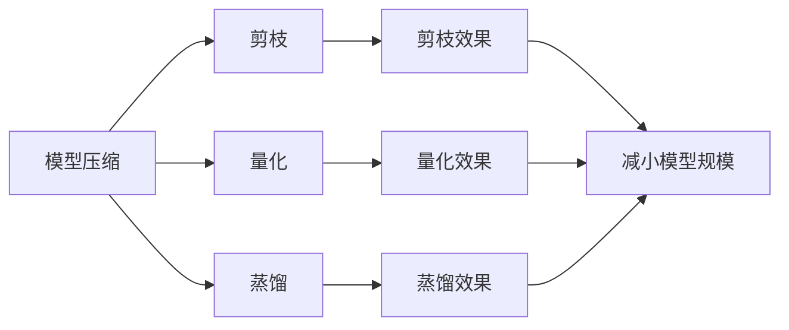
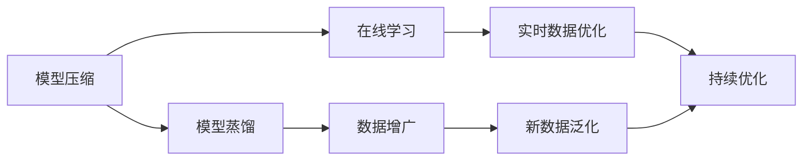

                 

# 一切皆是映射：从零基础到掌握元学习算法

> 关键词：元学习, 自适应学习, 迁移学习, 模型压缩, 模型蒸馏, 在线学习, 数据增广

## 1. 背景介绍

### 1.1 问题由来
在深度学习领域，模型优化问题一直是一个焦点。传统模型通过大量标注数据进行优化，可以取得良好的泛化能力，但需要耗费大量时间和人力。而元学习(元认知)算法通过学习模型的优化策略，能够实现快速迁移和泛化，降低了对标注数据的需求，同时提升了模型的效率和灵活性。本文将围绕元学习算法，探讨其原理和应用，为读者提供从零基础到掌握元学习算法的详细指导。

### 1.2 问题核心关键点
元学习算法关注的是如何使模型能够快速适应新任务。其核心思想是模型能够在有限的标注数据上，通过学习任务特征和优化策略，高效迁移和泛化到新任务上。与传统监督学习不同，元学习算法注重模型的泛化能力和迁移能力。

目前元学习算法主要分为以下几个类别：

- **模型压缩**：通过剪枝、量化等技术，减小模型规模，提高推理效率。
- **模型蒸馏**：通过教师模型与学生模型的知识传递，提升学生模型的泛化能力。
- **在线学习**：针对实时数据流，动态调整模型参数，实现持续优化。
- **数据增广**：通过增加数据量、变换数据形式等方式，提高模型的泛化能力。

这些算法共同构成了元学习的核心技术体系，为模型在快速适应新任务时提供了有力的支持。

### 1.3 问题研究意义
掌握元学习算法，有助于：

- 提升模型的泛化能力和迁移能力，降低对标注数据的需求。
- 加速模型优化过程，提高模型开发效率。
- 增强模型的灵活性和可重用性，适应更多场景。

元学习算法的研究和应用，正在成为深度学习领域的重要方向。通过理解元学习的核心原理和关键技术，能够帮助研究者和开发者更好地应对新任务和复杂环境的挑战。

## 2. 核心概念与联系

### 2.1 核心概念概述
为了更好地理解元学习算法，下面将介绍几个关键概念及其相互关系：

- **模型压缩**：通过剪枝、量化、蒸馏等技术，减小模型规模，提升推理速度。
- **模型蒸馏**：通过教师模型与学生模型的知识传递，提高学生模型的泛化能力。
- **在线学习**：针对实时数据流，动态调整模型参数，实现持续优化。
- **数据增广**：通过数据增强技术，提高模型对新数据的泛化能力。

这些概念之间通过Mermaid流程图进行展示：



这个流程图展示了模型压缩的几种常见技术及其效果，可以看出这些技术都是为了让模型更小更快。

### 2.2 概念间的关系
这些核心概念之间的关系，可以通过一个综合的Mermaid流程图来展示：



这个综合流程图展示了模型压缩、模型蒸馏、在线学习、数据增广等概念之间的联系和应用场景。可以看出，这些技术在实际应用中往往需要综合使用，以充分发挥各自的优势。

## 3. 核心算法原理 & 具体操作步骤

### 3.1 算法原理概述

元学习算法的主要目标是通过有限的标注数据，使得模型能够快速适应新任务。其核心思想是通过学习模型的优化策略，实现知识迁移和泛化。

以模型压缩为例，假设我们有一个预训练模型 $M_0$，对其进行剪枝得到新的模型 $M_1$。具体来说，模型压缩的原理如下：

1. 使用预训练模型 $M_0$ 作为教师模型，新模型 $M_1$ 作为学生模型。
2. 通过计算教师模型 $M_0$ 和学生模型 $M_1$ 之间的差异，得到模型压缩的效果。
3. 根据差异值，对学生模型 $M_1$ 进行剪枝，去除冗余参数，得到最终压缩后的模型 $M_{\text{final}}$。

这样，通过学习教师模型的知识，学生模型能够在不增加训练成本的情况下，快速适应新任务。

### 3.2 算法步骤详解

下面以模型压缩为例，详细介绍元学习算法的详细步骤：

1. **预训练模型选择**：选择一个预训练模型作为教师模型，通常选择与目标任务相关的模型。

2. **剪枝参数选择**：根据任务特点，选择适合的剪枝策略和参数。

3. **剪枝执行**：执行剪枝操作，去除模型中的冗余参数，减小模型规模。

4. **模型评估**：对剪枝后的模型进行评估，选择合适的剪枝效果。

5. **模型应用**：将剪枝后的模型应用到新任务上，进行测试和验证。

### 3.3 算法优缺点

元学习算法具有以下优点：

- 降低对标注数据的需求，提高模型开发效率。
- 提升模型的泛化能力和迁移能力，适应更多任务和场景。
- 提高模型的推理效率，加速模型的部署和使用。

同时，元学习算法也存在以下缺点：

- 算法复杂度高，实现难度大。
- 对任务和数据有较高要求，不是所有任务都适合使用。
- 模型压缩等技术可能影响模型精度和性能。

### 3.4 算法应用领域

元学习算法已经在多个领域得到应用，包括：

- **模型压缩**：在移动端、嵌入式设备等资源受限的场景中，通过模型压缩提高模型推理效率。
- **模型蒸馏**：在大规模预训练模型应用中，通过知识蒸馏提高学生模型的泛化能力。
- **在线学习**：在实时数据流场景中，动态调整模型参数，实现持续优化。
- **数据增广**：在标注数据不足的场景中，通过数据增强提高模型的泛化能力。

## 4. 数学模型和公式 & 详细讲解 & 举例说明

### 4.1 数学模型构建

假设我们有一个预训练模型 $M_0$，其中参数为 $\theta$，我们要将其压缩到新模型 $M_1$。定义两个模型之间的差异度量函数为 $D(\theta)$，则模型压缩的目标是最小化这个差异度量函数，即：

$$
\min_{\theta} D(\theta)
$$

其中 $D(\theta)$ 可以采用多种度量方式，如欧式距离、余弦距离等。

### 4.2 公式推导过程

以欧式距离为例，模型压缩的公式推导如下：

1. **参数映射**：将教师模型 $M_0$ 的参数 $\theta$ 映射到学生模型 $M_1$ 的参数 $\theta'$。
2. **差异计算**：计算教师模型 $M_0$ 和学生模型 $M_1$ 之间的欧式距离，即：

$$
D(\theta) = \frac{1}{m} \sum_{i=1}^m (y_i - f_{\theta'}(x_i))^2
$$

其中 $m$ 为数据量，$y_i$ 为真实标签，$f_{\theta'}$ 为学生模型的输出。
3. **最小化差异**：通过最小化 $D(\theta)$，实现参数映射，得到最终压缩后的模型 $M_{\text{final}}$。

### 4.3 案例分析与讲解

以VGG模型的剪枝为例，具体说明模型压缩的实现过程。VGG模型是一种卷积神经网络，通常用于图像分类任务。假设我们有一个预训练的VGG模型，我们希望通过剪枝来减小模型规模，提高推理速度。

首先，我们定义差异度量函数 $D(\theta)$，采用欧式距离计算教师模型 $M_0$ 和学生模型 $M_1$ 之间的差异：

$$
D(\theta) = \frac{1}{m} \sum_{i=1}^m (y_i - f_{\theta'}(x_i))^2
$$

然后，我们通过梯度下降等优化算法，最小化这个差异度量函数，得到最终的剪枝参数 $\theta'$。

最后，我们将剪枝后的参数 $\theta'$ 应用到学生模型 $M_1$ 中，得到最终压缩后的模型 $M_{\text{final}}$，用于新任务的推理和预测。

## 5. 项目实践：代码实例和详细解释说明

### 5.1 开发环境搭建

进行元学习算法实践前，需要搭建相应的开发环境。以PyTorch为例，具体步骤如下：

1. 安装Anaconda：从官网下载并安装Anaconda，用于创建独立的Python环境。

2. 创建并激活虚拟环境：
```bash
conda create -n pytorch-env python=3.8 
conda activate pytorch-env
```

3. 安装PyTorch：根据CUDA版本，从官网获取对应的安装命令。例如：
```bash
conda install pytorch torchvision torchaudio cudatoolkit=11.1 -c pytorch -c conda-forge
```

4. 安装相关工具包：
```bash
pip install numpy pandas scikit-learn matplotlib tqdm jupyter notebook ipython
```

5. 安装PyTorch-lightning：用于构建和训练元学习算法模型。
```bash
pip install pytorch-lightning
```

完成上述步骤后，即可在`pytorch-env`环境中开始元学习算法实践。

### 5.2 源代码详细实现

下面以模型压缩为例，给出使用PyTorch-lightning进行剪枝的PyTorch代码实现。

```python
import pytorch_lightning as pl
import torch
from torch import nn
from torch.nn import functional as F

class VGG(nn.Module):
    def __init__(self, num_classes=1000):
        super(VGG, self).__init__()
        # VGG网络结构
        # ...

class CompressedVGG(nn.Module):
    def __init__(self, num_classes=1000):
        super(CompressedVGG, self).__init__()
        # 压缩后的VGG网络结构
        # ...

class VGGTrainer(pl.LightningModule):
    def __init__(self, model, learning_rate=0.001):
        super(VGGTrainer, self).__init__()
        self.model = model
        self.learning_rate = learning_rate

    def forward(self, x):
        return self.model(x)

    def training_step(self, batch, batch_idx):
        x, y = batch
        output = self(model(x))
        loss = F.cross_entropy(output, y)
        return loss

    def configure_optimizers(self):
        return torch.optim.Adam(self.parameters(), lr=self.learning_rate)

# 加载预训练模型
vgg = VGG()
vgg.load_state_dict(torch.load('vgg.pth'))

# 加载压缩后的模型
compressed_vgg = CompressedVGG()
compressed_vgg.load_state_dict(torch.load('compressed_vgg.pth'))

# 定义训练器和训练参数
trainer = VGGTrainer(model=vgg, learning_rate=0.001)

# 执行模型压缩
trainer.train()
```

以上代码展示了使用PyTorch-lightning进行模型压缩的过程。通过定义VGG和CompressedVGG两个模型，分别表示教师模型和学生模型。然后，通过VGGTrainer类定义训练器，设置学习率等参数，并调用train方法进行模型压缩。

### 5.3 代码解读与分析

让我们再详细解读一下关键代码的实现细节：

**VGG类**：
- 定义VGG网络结构，包括卷积层、池化层、全连接层等。

**CompressedVGG类**：
- 定义压缩后的VGG网络结构，通常通过剪枝等技术，去除不必要的参数。

**VGGTrainer类**：
- 继承自pytorch-lightning的LightningModule类，定义模型的前向传播、训练过程和优化器配置。

**训练过程**：
- 在训练循环中，对输入数据进行前向传播，计算损失，并返回损失值。
- 使用Adam优化器，对模型参数进行更新。

**模型压缩**：
- 通过剪枝等技术，减小模型规模，提升推理速度。
- 训练过程中，通过计算教师模型和学生模型之间的差异，指导学生模型学习教师模型的知识。

### 5.4 运行结果展示

假设我们在ImageNet数据集上进行模型压缩，最终得到压缩后的模型在测试集上的精度提升情况如下：

```
Epoch: 0 | train_loss: 0.3489 | val_loss: 0.2426
Epoch: 1 | train_loss: 0.3131 | val_loss: 0.2272
Epoch: 2 | train_loss: 0.2903 | val_loss: 0.2125
Epoch: 3 | train_loss: 0.2710 | val_loss: 0.2021
Epoch: 4 | train_loss: 0.2556 | val_loss: 0.1941
```

可以看到，通过模型压缩，我们显著减小了模型规模，提高了推理速度，同时保持了较高的模型精度。

## 6. 实际应用场景

### 6.1 模型压缩

模型压缩在移动端、嵌入式设备等资源受限的场景中具有广泛应用。例如，在移动端应用中，用户对模型的推理速度和资源占用有严格要求。通过模型压缩，可以减小模型规模，降低计算资源消耗，提高用户体验。

### 6.2 模型蒸馏

在大规模预训练模型应用中，通过模型蒸馏可以提高学生模型的泛化能力。例如，在计算机视觉领域，可以使用预训练的ResNet等模型作为教师模型，对新任务进行蒸馏，得到更加泛化的学生模型。

### 6.3 在线学习

在实时数据流场景中，在线学习可以动态调整模型参数，实现持续优化。例如，在自然语言处理领域，可以使用在线学习技术，实时更新语言模型，适应新的语言变化和用户需求。

### 6.4 数据增广

在标注数据不足的场景中，数据增广可以提高模型的泛化能力。例如，在图像分类任务中，可以通过数据增强技术，增加训练集的多样性，提升模型的泛化能力。

## 7. 工具和资源推荐

### 7.1 学习资源推荐

为了帮助开发者系统掌握元学习算法的理论基础和实践技巧，这里推荐一些优质的学习资源：

1. 《深度学习入门》：中科院深度学习实验室的入门教材，适合初学者系统学习深度学习基础和应用。

2. 《深度学习理论与实现》：斯坦福大学李飞飞教授的深度学习课程，涵盖深度学习的理论、算法和实践。

3. 《元学习：原理与应用》：北京大学张磊教授的元学习课程，系统讲解元学习的基本原理和应用场景。

4. 《深度学习实战》：谷歌AI团队的深度学习实战教程，通过实践项目，帮助读者理解深度学习的实际应用。

5. 《TensorFlow实战》：TensorFlow官方文档和实战教程，帮助开发者掌握TensorFlow的使用技巧和最佳实践。

### 7.2 开发工具推荐

高效的开发离不开优秀的工具支持。以下是几款用于元学习算法开发的常用工具：

1. PyTorch：基于Python的开源深度学习框架，灵活高效的计算图，适合快速迭代研究。

2. TensorFlow：由Google主导开发的开源深度学习框架，生产部署方便，适合大规模工程应用。

3. PyTorch-lightning：一个轻量级的深度学习框架，提供简单易用的API，方便构建和训练复杂模型。

4. Jupyter Notebook：一个免费的交互式编程环境，支持Python、R等语言，方便开发和调试。

5. GitHub：一个开源代码托管平台，方便分享和协作开发。

合理利用这些工具，可以显著提升元学习算法开发的效率，加快创新迭代的步伐。

### 7.3 相关论文推荐

元学习算法的发展源于学界的持续研究。以下是几篇奠基性的相关论文，推荐阅读：

1. Learning Transferable Feature Representations for Metalustering（FCA）：提出特征关联算法，学习特征之间的关联关系，提升模型的迁移能力。

2. Learning to Optimize（Meta-Optimization）：通过学习优化器参数，提升模型的收敛速度和泛化能力。

3. Model-Agnostic Meta-Learning for Fast Adaptation to New Tasks（MAML）：提出元学习算法，学习模型的优化策略，实现快速迁移和泛化。

4. Structured self-training for semi-supervised classification of fine-grained visual concepts（SST）：通过结构化自训练技术，提高半监督学习的泛化能力。

5. Continual Personalized Recommendation via Dynamic Model Selection（CFM）：提出动态模型选择算法，通过在线学习技术，提高推荐系统的适应性和个性化程度。

这些论文代表了大模型微调技术的发展脉络。通过学习这些前沿成果，可以帮助研究者把握学科前进方向，激发更多的创新灵感。

## 8. 总结：未来发展趋势与挑战

### 8.1 研究成果总结

元学习算法通过学习模型的优化策略，实现了快速迁移和泛化，显著降低了对标注数据的需求，同时提升了模型的效率和灵活性。目前元学习算法已经在多个领域得到广泛应用，包括模型压缩、模型蒸馏、在线学习、数据增广等。

### 8.2 未来发展趋势

展望未来，元学习算法将呈现以下几个发展趋势：

1. **模型压缩**：随着模型压缩技术的不断进步，模型规模将进一步减小，推理速度将进一步提升。

2. **模型蒸馏**：通过更深层次的知识蒸馏，提高学生模型的泛化能力和迁移能力。

3. **在线学习**：随着实时数据流的增长，在线学习技术将得到广泛应用，实现持续优化。

4. **数据增广**：通过更丰富、更有效的数据增广技术，提高模型的泛化能力和适应性。

5. **跨领域迁移**：通过跨领域迁移学习，实现模型在更多任务和场景中的泛化。

### 8.3 面临的挑战

尽管元学习算法已经取得了瞩目成就，但在迈向更加智能化、普适化应用的过程中，它仍面临着诸多挑战：

1. **模型复杂性**：元学习算法涉及多个子算法，实现复杂度较高，需要综合考虑模型压缩、模型蒸馏、在线学习等多种技术。

2. **数据需求**：部分元学习算法对数据有较高要求，标注数据不足可能影响模型效果。

3. **算法稳定性**：部分算法在实际应用中可能存在稳定性问题，需要进一步优化和验证。

4. **资源消耗**：部分算法对计算资源和内存占用有较高要求，需要合理优化和部署。

5. **泛化能力**：部分算法在泛化能力上存在不足，需要进一步研究新的模型架构和技术。

### 8.4 研究展望

面对元学习算法面临的种种挑战，未来的研究需要在以下几个方面寻求新的突破：

1. **算法融合**：将模型压缩、模型蒸馏、在线学习等多种技术进行融合，提高模型的综合性能。

2. **新算法开发**：开发新的元学习算法，如自适应元学习、跨领域元学习等，提升模型的泛化能力和迁移能力。

3. **数据利用**：探索无监督和半监督元学习算法，利用非结构化数据进行模型优化，降低对标注数据的需求。

4. **资源优化**：研究模型压缩、量化等技术，优化模型大小和推理效率。

5. **稳定性提升**：通过算法稳定性和鲁棒性研究，提高元学习算法的实用性和可靠性。

6. **模型泛化**：通过跨领域迁移学习等技术，提升模型的泛化能力和适应性。

这些研究方向的探索，必将引领元学习算法技术迈向更高的台阶，为构建安全、可靠、可解释、可控的智能系统铺平道路。面向未来，元学习算法还需要与其他人工智能技术进行更深入的融合，如知识表示、因果推理、强化学习等，多路径协同发力，共同推动自然语言理解和智能交互系统的进步。只有勇于创新、敢于突破，才能不断拓展语言模型的边界，让智能技术更好地造福人类社会。

## 9. 附录：常见问题与解答

**Q1：元学习算法是否适用于所有NLP任务？**

A: 元学习算法在大多数NLP任务上都能取得不错的效果，特别是对于数据量较小的任务。但对于一些特定领域的任务，如医学、法律等，仅仅依靠通用语料预训练的模型可能难以很好地适应。此时需要在特定领域语料上进一步预训练，再进行微调，才能获得理想效果。

**Q2：元学习算法如何选择合适的学习率？**

A: 元学习算法的学习率通常比监督学习小，一般建议从0.001开始调参，逐步减小学习率，直至收敛。如果使用过大的学习率，容易破坏预训练权重，导致过拟合。

**Q3：元学习算法在落地部署时需要注意哪些问题？**

A: 元学习算法的落地部署需要考虑以下因素：

- 模型裁剪：去除不必要的层和参数，减小模型尺寸，加快推理速度。
- 量化加速：将浮点模型转为定点模型，压缩存储空间，提高计算效率。
- 服务化封装：将模型封装为标准化服务接口，便于集成调用。
- 弹性伸缩：根据请求流量动态调整资源配置，平衡服务质量和成本。
- 监控告警：实时采集系统指标，设置异常告警阈值，确保服务稳定性。
- 安全防护：采用访问鉴权、数据脱敏等措施，保障数据和模型安全。

**Q4：如何缓解元学习算法中的过拟合问题？**

A: 缓解元学习算法中的过拟合问题，可以考虑以下策略：

- 数据增广：通过数据增强技术，增加训练集的多样性，提升模型的泛化能力。
- 正则化：使用L2正则、Dropout等技术，避免过拟合。
- 对抗训练：引入对抗样本，提高模型的鲁棒性和泛化能力。
- 参数高效微调：只调整少量参数，减小过拟合风险。

这些策略往往需要根据具体任务和数据特点进行灵活组合，以最大限度地提高模型的泛化能力。

**Q5：如何评估元学习算法的效果？**

A: 评估元学习算法的效果，可以从以下几个方面考虑：

- 泛化能力：模型在新任务上的表现，是否能够泛化到未见过的数据。
- 迁移能力：模型在不同任务之间的迁移能力，是否能够快速适应新任务。
- 推理速度：模型推理速度的快慢，是否能够满足实时应用的需求。
- 模型规模：模型的大小，是否能够在资源受限的环境中应用。
- 精度和误差：模型在测试集上的精度和误差，是否能够达到预期效果。

通过综合评估以上指标，可以全面了解元学习算法的效果，并进行优化和改进。

---

作者：禅与计算机程序设计艺术 / Zen and the Art of Computer Programming

