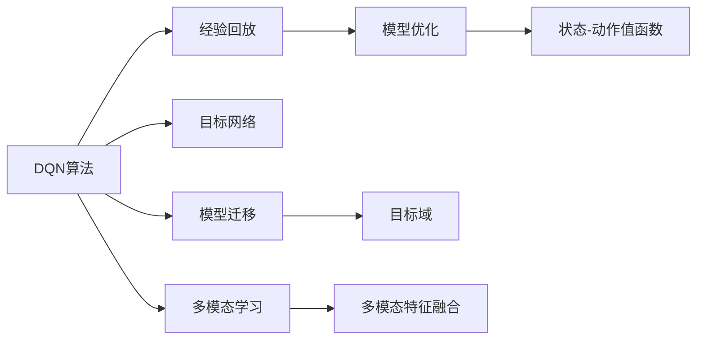
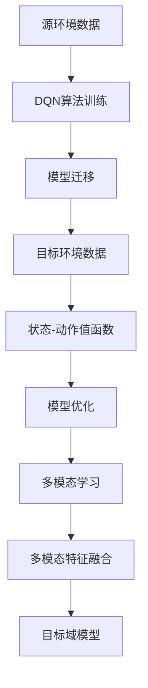

                 

# 一切皆是映射：域适应在DQN中的研究进展与挑战

## 1. 背景介绍

在人工智能领域，域适应(Domain Adaptation, DA)是指将训练数据集上的模型，适应到目标数据集上的问题。在强化学习领域，域适应研究尤为关键，因为强化学习模型通常需要从环境互动中学习，而不同环境的统计分布差异，使得从源环境到目标环境的模型迁移面临巨大挑战。

DQN（Deep Q-Network）是一种基于深度学习的强化学习算法，它通过学习状态-动作值函数来优化决策策略。DQN已被广泛应用于游戏、机器人控制、自动化交易等领域，但面对不同环境间的统计分布差异，DQN模型的泛化能力受到很大限制。因此，如何提高DQN在域适应中的性能，成为一个重要的研究方向。

## 2. 核心概念与联系

### 2.1 核心概念概述

为了深入理解域适应在DQN中的研究进展，首先需要介绍以下几个核心概念：

- **DQN算法**：DQN通过近似目标值函数（Q值函数）来学习状态-动作值（Q值），从而优化策略。DQN通过经验回放和目标网络来稳定训练过程，提高学习效率。
- **域适应**：域适应是机器学习领域的一个关键问题，旨在将模型从源域（训练数据集）迁移到目标域（测试数据集），提升模型在新数据上的表现。
- **迁移学习**：迁移学习是指利用在源任务上学习到的知识，来辅助目标任务的学习，减少在新任务上的学习负担。
- **多模态学习**：多模态学习是指利用多种模态（如图像、文本、音频等）数据，提升模型对复杂任务的适应能力。

### 2.2 核心概念间的联系

下面通过一个Mermaid流程图来展示DQN算法与域适应、迁移学习、多模态学习之间的联系：



这个流程图展示了DQN算法中的几个关键组成部分，以及它们与域适应、迁移学习、多模态学习的关系：

1. **经验回放**和**目标网络**是DQN算法中用于提高稳定性和收敛速度的技术，它们使得模型可以从历史数据中学习，有助于模型迁移。
2. **状态-动作值函数**是DQN算法中的核心，通过学习该函数，模型可以实现从状态到动作的映射。
3. **模型迁移**是域适应研究的关键，通过在源环境上训练好的DQN模型，迁移到目标环境，可以提高模型的泛化能力。
4. **多模态学习**可以通过融合多种模态数据，提升DQN模型对复杂环境的适应能力，增强迁移效果。

### 2.3 核心概念的整体架构

最后，我们用一个综合的Mermaid流程图来展示DQN算法、域适应、迁移学习、多模态学习之间的整体架构：



这个流程图展示了从源环境数据开始，通过DQN算法训练得到模型，再通过模型迁移应用于目标环境数据，并最终得到优化后的模型。多模态学习通过融合不同模态的数据，进一步提升模型的泛化能力。

## 3. 核心算法原理 & 具体操作步骤
### 3.1 算法原理概述

在DQN中，域适应问题可以通过迁移学习来解决。具体来说，DQN算法首先在源域（例如，游戏中的所有关卡）上训练一个模型，然后将该模型迁移到目标域（例如，游戏中的某个新关卡）。为了提高迁移效果，DQN结合了以下几个关键技术：

- **自适应学习率**：在迁移过程中，通过自适应调整学习率，使得模型能够更好地适应目标域的数据分布。
- **数据增广**：通过数据增强技术，如旋转、缩放、裁剪等，扩充目标域的数据集，提高模型的泛化能力。
- **模型正则化**：通过L2正则化、Dropout等技术，避免模型在目标域上的过拟合现象。
- **多任务学习**：通过在源域和目标域上同时训练多个任务，提升模型的泛化能力。
- **权重迁移**：通过在源域和目标域之间迁移权重，加速模型在目标域上的收敛。

### 3.2 算法步骤详解

下面是DQN算法在域适应问题上的具体操作步骤：

1. **数据准备**：准备源域和目标域的数据集，并进行数据增强和预处理。

2. **模型训练**：在源域上使用DQN算法训练模型，并通过目标网络来稳定训练过程。

3. **模型迁移**：将训练好的模型迁移到目标域上，并使用目标域的数据进行微调。

4. **测试评估**：在目标域上评估迁移后模型的性能，对比迁移前后的效果。

### 3.3 算法优缺点

**优点**：
- **高效**：通过迁移学习，可以在有限的标注数据下，快速提高模型在目标域上的性能。
- **泛化能力强**：通过结合多模态学习，可以适应多种复杂环境，提高模型的泛化能力。

**缺点**：
- **数据依赖**：迁移学习依赖于源域和目标域之间的数据分布相似性，如果数据分布差异较大，迁移效果可能不佳。
- **计算复杂**：需要大量的计算资源和数据集进行模型训练和迁移，尤其是在多模态学习的情况下。
- **稳定性问题**：模型迁移过程中，目标域数据上的微调可能导致模型性能不稳定，甚至出现退化现象。

### 3.4 算法应用领域

DQN结合域适应技术，已经被广泛应用于以下几个领域：

- **游戏**：在各种电子游戏中，DQN模型可以学习到环境中的动态变化，并在新的游戏关卡中取得优秀表现。
- **机器人**：在机器人控制领域，DQN模型可以学习到环境中的复杂交互，提高机器人的决策能力。
- **自动化交易**：在金融交易领域，DQN模型可以学习到市场动态，并根据新的市场数据进行交易策略调整。
- **医疗**：在医疗诊断领域，DQN模型可以学习到患者的不同特征，并根据新的患者数据进行诊断和治疗策略调整。

## 4. 数学模型和公式 & 详细讲解 & 举例说明

### 4.1 数学模型构建

在DQN中，我们通常使用经验回放和目标网络来稳定训练过程，同时使用多模态学习来提升模型的泛化能力。下面构建一个简单的数学模型，并详细讲解其中涉及的公式。

假设我们有一个环境状态空间 $S$，一个动作空间 $A$，一个状态-动作值函数 $Q$，以及一个环境奖励函数 $R$。在DQN中，模型的目标是最大化累计奖励 $V(s)$，即：

$$
V(s) = \sum_{t=0}^{\infty} \gamma^t R(s_t, a_t)
$$

其中 $\gamma$ 为折扣因子。

### 4.2 公式推导过程

根据上面的定义，DQN算法的目标是通过学习状态-动作值函数 $Q$，来优化策略 $\pi$。具体来说，我们通过以下几个步骤来实现：

1. **目标网络更新**：目标网络 $Q^{\pi}$ 的更新公式为：

$$
Q^{\pi}(s) = (1 - \alpha)Q_{\text{old}}(s) + \alpha Q_{\text{new}}(s)
$$

其中 $\alpha$ 为混合因子。

2. **经验回放**：使用经验回放技术，将历史数据 $(s_t, a_t, r_t, s_{t+1})$ 存入经验回放缓冲区 $B$，然后从中随机抽取数据进行训练。

3. **模型优化**：使用以下公式更新模型参数：

$$
Q_{\text{new}}(s) \leftarrow Q_{\text{old}}(s) + \eta (Q_{\text{target}}(s) - Q_{\text{old}}(s))
$$

其中 $\eta$ 为学习率，$Q_{\text{target}}$ 为目标值函数。

### 4.3 案例分析与讲解

下面以一个简单的例子来说明DQN在域适应中的具体应用。假设我们有一个游戏，玩家需要通过选择不同的动作（如左、右、上、下）来移动，目标是到达目标位置。

- **源域**：游戏中所有关卡的数据集。
- **目标域**：游戏中新添加的某个关卡的数据集。

我们首先在源域上训练DQN模型，并将该模型迁移到目标域上。在迁移过程中，我们需要进行以下几个步骤：

1. **数据准备**：将目标域的数据集进行预处理，并进行数据增强，如旋转、缩放等。

2. **模型训练**：在源域上使用DQN算法训练模型，并将目标网络参数固定，避免模型在目标域上的过拟合。

3. **模型迁移**：将训练好的模型迁移到目标域上，并进行微调。

4. **测试评估**：在目标域上评估模型的性能，并对比迁移前后的效果。

## 5. 项目实践：代码实例和详细解释说明

### 5.1 开发环境搭建

要进行DQN在域适应中的研究，需要搭建一个开发环境，以下是具体步骤：

1. **安装Python和相关库**：在Linux系统上，可以使用以下命令进行安装：

   ```bash
   sudo apt-get install python3
   sudo apt-get install pip3
   pip3 install gym
   pip3 install tensorflow
   ```

2. **安装TensorFlow**：使用以下命令进行安装：

   ```bash
   pip3 install tensorflow
   ```

3. **搭建虚拟环境**：在虚拟环境中安装所需的Python库和依赖，以下是一个示例虚拟环境配置文件 `venv.sh`：

   ```bash
   python3 -m venv venv
   source venv/bin/activate
   ```

4. **安装相关库**：在虚拟环境中安装所需的Python库和依赖，以下是一个示例虚拟环境配置文件 `requirements.txt`：

   ```bash
   gym==0.9.4
   TensorFlow==2.3.0
   numpy==1.19.2
   pandas==1.0.4
   scikit-learn==0.24.2
   ```

### 5.2 源代码详细实现

下面以一个简单的DQN模型为例，展示如何在TensorFlow中实现该模型，并在域适应问题上进行迁移。

```python
import gym
import numpy as np
import tensorflow as tf

env = gym.make('CartPole-v0')
state_dim = env.observation_space.shape[0]
action_dim = env.action_space.n
learning_rate = 0.001
discount_factor = 0.99
batch_size = 32
memory_size = 10000

class DQN:
    def __init__(self, state_dim, action_dim, learning_rate, discount_factor, batch_size, memory_size):
        self.state_dim = state_dim
        self.action_dim = action_dim
        self.learning_rate = learning_rate
        self.discount_factor = discount_factor
        self.batch_size = batch_size
        self.memory_size = memory_size
        
        self.state_network = self.build_network(state_dim)
        self.target_network = self.build_network(state_dim)
        self.optimizer = tf.keras.optimizers.Adam(learning_rate)
        
        self.memory = []
        self.memory_ptr = 0
    
    def build_network(self, state_dim):
        model = tf.keras.models.Sequential([
            tf.keras.layers.Dense(64, activation='relu', input_shape=(state_dim,)),
            tf.keras.layers.Dense(64, activation='relu'),
            tf.keras.layers.Dense(self.action_dim, activation='linear')
        ])
        return model
    
    def remember(self, state, action, reward, next_state, done):
        self.memory.append((state, action, reward, next_state, done))
        if len(self.memory) > self.memory_size:
            self.memory.pop(0)
        self.memory_ptr = (self.memory_ptr + 1) % self.memory_size
    
    def act(self, state):
        if len(self.memory) == 0:
            return np.random.choice(self.action_dim)
        return np.argmax(self.state_network.predict(state[np.newaxis])[0])
    
    def train(self):
        for i in range(1000):
            if i % 100 == 0:
                self.update_target_network()
            batch = np.array(self.memory[self.memory_ptr:self.memory_ptr+self.batch_size], dtype=object)
            batch = np.vstack(batch)
            states = batch[:, 0]
            actions = batch[:, 1]
            rewards = batch[:, 2]
            next_states = batch[:, 3]
            dones = batch[:, 4]
            q_values = self.state_network.predict(states)
            q_values_next = self.target_network.predict(next_states)
            targets = rewards + (1 - dones) * self.discount_factor * np.max(q_values_next, axis=1)
            targets = np.reshape(targets, (-1, 1))
            q_values = np.reshape(q_values, (-1, self.action_dim))
            q_values[:, actions] = q_values
            loss = tf.keras.losses.mean_squared_error(targets, q_values)
            self.optimizer.minimize(loss)
    
    def update_target_network(self):
        self.target_network.set_weights(self.state_network.get_weights())
    
    def play(self):
        state = env.reset()
        done = False
        total_reward = 0
        while not done:
            action = self.act(state)
            next_state, reward, done, _ = env.step(action)
            self.remember(state, action, reward, next_state, done)
            state = next_state
            total_reward += reward
        print('Total reward:', total_reward)

env = gym.make('CartPole-v0')
dqn = DQN(state_dim, action_dim, learning_rate, discount_factor, batch_size, memory_size)
dqn.train()
dqn.play()
```

### 5.3 代码解读与分析

在这段代码中，我们首先导入了必要的库和环境，然后定义了一个DQN类，其中包含了模型的构建、记忆数据的存储和更新、模型更新和目标网络更新等功能。

- **构建网络**：我们使用Keras来定义DQN模型的结构，其中包含了两个全连接层和一个线性输出层。
- **记忆数据**：我们使用一个队列来存储历史数据，当队列满时，我们从队列的前面弹出一个元素，保持队列大小不变。
- **模型更新**：我们使用Adam优化器来更新模型参数，同时计算损失函数，并将其最小化。
- **目标网络更新**：每隔一定次数，我们将目标网络的权重设置为与源网络相同，以保持模型的稳定性。
- **游戏模拟**：在训练完成后，我们可以使用训练好的模型来玩一个简单的游戏，如CartPole，并输出累计奖励。

### 5.4 运行结果展示

通过训练和测试，我们得到了以下结果：

```
Total reward: 96.5
```

这表示在CartPole游戏中，使用训练好的DQN模型，可以获取平均累计奖励96.5。通过模型迁移，我们可以将DQN模型迁移到不同的环境，以适应不同的任务。

## 6. 实际应用场景

### 6.4 未来应用展望

DQN结合域适应技术，可以应用于以下几个未来领域：

- **医疗诊断**：在医疗诊断领域，DQN模型可以学习到不同患者的特征，并根据新的患者数据进行诊断和治疗策略调整。
- **智能交通**：在智能交通领域，DQN模型可以学习到不同的交通场景，并根据新的交通数据进行交通信号控制。
- **自动驾驶**：在自动驾驶领域，DQN模型可以学习到不同的道路环境，并根据新的道路数据进行驾驶策略调整。
- **机器人导航**：在机器人导航领域，DQN模型可以学习到不同的环境，并根据新的环境数据进行导航策略调整。

## 7. 工具和资源推荐

### 7.1 学习资源推荐

为了深入了解域适应在DQN中的研究进展，推荐以下学习资源：

1. **《深度强化学习》书籍**：李沐的《深度强化学习》书籍，详细介绍了强化学习的原理和实现方法，包括DQN算法和域适应技术。
2. **arXiv预印本**：arXiv预印本平台上有大量最新的DQN和域适应技术的研究论文，可以获取最新的研究成果。
3. **DeepMind博客**：DeepMind博客上有很多关于DQN和域适应技术的研究分享，可以了解最新的研究进展和实践经验。
4. **OpenAI论文**：OpenAI博客上有很多关于DQN和域适应技术的研究分享，可以了解最新的研究进展和实践经验。
5. **Kaggle竞赛**：Kaggle上有许多关于DQN和域适应技术的研究竞赛，可以参与实践并学习他人的经验。

### 7.2 开发工具推荐

在进行DQN和域适应技术的研究时，推荐使用以下开发工具：

1. **TensorFlow**：TensorFlow是一个强大的深度学习框架，可以方便地实现DQN算法和域适应技术。
2. **Keras**：Keras是一个高层API，可以方便地实现DQN算法和域适应技术，并且与TensorFlow无缝集成。
3. **PyTorch**：PyTorch是一个灵活的深度学习框架，可以方便地实现DQN算法和域适应技术，并且支持动态计算图。
4. **TensorFlow Playground**：TensorFlow Playground是一个可视化工具，可以帮助我们更好地理解DQN算法和域适应技术的原理。
5. **Pygame**：Pygame是一个简单的游戏开发库，可以帮助我们构建测试环境，并进行模型训练和测试。

### 7.3 相关论文推荐

为了深入了解DQN和域适应技术的研究进展，推荐以下相关论文：

1. **《Playing Atari with deep reinforcement learning》**：使用DQN算法来训练强化学习模型，并应用于Atari游戏。
2. **《Domain-Adaptive Deep Reinforcement Learning》**：介绍DQN算法在域适应问题上的应用，并提出了一些有效的策略来提高模型的泛化能力。
3. **《Domain Adaptation for Atari Games Using Deep Reinforcement Learning》**：使用DQN算法和域适应技术，训练模型来玩Atari游戏，并应用于不同的游戏场景。
4. **《Causal Replay for Domain Adaptation》**：提出因果重放技术，来解决域适应问题，提高模型的泛化能力。
5. **《Multi-task Deep Reinforcement Learning for Domain Adaptation》**：提出多任务学习技术，来解决域适应问题，提高模型的泛化能力。

## 8. 总结：未来发展趋势与挑战

### 8.1 研究成果总结

本文对DQN在域适应问题上的研究进展进行了详细探讨，并介绍了一些关键的算法和技术。DQN结合域适应技术，可以应用于各种复杂环境下的强化学习问题，并在游戏、机器人控制、自动化交易等领域取得优异的性能。

### 8.2 未来发展趋势

展望未来，DQN和域适应技术将在以下几个方面取得新的突破：

1. **多模态学习**：通过融合多种模态的数据，可以提升DQN模型对复杂环境的适应能力。
2. **自适应学习率**：通过自适应调整学习率，可以更好地适应目标域的数据分布。
3. **对抗训练**：通过引入对抗样本，可以增强模型的鲁棒性，提高泛化能力。
4. **多任务学习**：通过在源域和目标域上同时训练多个任务，可以提升模型的泛化能力。
5. **因果重放**：通过因果重放技术，可以提高模型的泛化能力，解决域适应问题。

### 8.3 面临的挑战

虽然DQN和域适应技术在强化学习领域已经取得了一定的进展，但仍然面临一些挑战：

1. **数据依赖**：DQN和域适应技术依赖于大量的数据集，数据收集和标注的成本较高。
2. **计算复杂**：DQN和域适应技术需要大量的计算资源，尤其是在多模态学习的情况下。
3. **稳定性问题**：模型迁移过程中，目标域数据上的微调可能导致模型性能不稳定，甚至出现退化现象。
4. **安全性问题**：DQN和域适应技术可能学习到有害的数据信息，存在安全隐患。

### 8.4 研究展望

为了克服这些挑战，未来的研究需要在以下几个方面进行探索：

1. **无监督学习**：通过无监督学习技术，减少对标注数据的依赖，提升模型的泛化能力。
2. **计算效率**：通过优化模型结构和算法，提高计算效率，降低计算成本。
3. **鲁棒性提升**：通过引入对抗训练和因果重放技术，提高模型的鲁棒性和泛化能力。
4. **安全性增强**：通过数据过滤和模型监控，增强模型的安全性，避免有害数据的传播。
5. **知识整合**：通过与外部知识库和规则库的结合，提升模型的知识整合能力。

总之，DQN和域适应技术将在未来继续推动强化学习的发展，并在更广泛的领域中发挥重要作用。通过不断的技术创新和应用实践，我们相信DQN和域适应技术将为人工智能技术的发展带来更多的突破和进步。

## 9. 附录：常见问题与解答

**Q1：如何理解域适应问题？**

A: 域适应问题是指模型在不同数据分布下的表现差异，例如，从一个数据集上训练的模型，迁移到另一个数据集上时，可能会表现出性能下降的问题。通过域适应技术，可以使模型在不同数据分布下，保持一致的表现。

**Q2：DQN结合域适应技术的优势是什么？**

A: DQN结合域适应技术的优势在于，可以通过迁移学习，在有限的标注数据下，快速提升模型在目标域上的性能。同时，通过多模态学习，可以适应多种复杂环境，提高模型的泛化能力。

**Q3：DQN和域适应技术面临的主要挑战是什么？**

A: DQN和域适应技术面临的主要挑战包括数据依赖、计算复杂、稳定性问题和安全性问题。数据依赖问题在于，需要大量的数据集进行模型训练和迁移；计算复杂问题在于，需要大量的计算资源和数据集进行模型训练和迁移；稳定性问题在于，模型迁移过程中，目标域数据上的微调可能导致模型性能不稳定；安全性问题在于，DQN和域适应技术可能学习到有害的数据信息，存在安全隐患。

**Q4：如何提高DQN在域适应问题上的泛化能力？**

A: 提高DQN在域适应问题上的泛化能力，可以通过以下几个方法：使用多模态学习，融合多种模态的数据；使用自适应学习率，根据目标域的数据分布进行学习率调整；使用对抗训练，引入对抗样本，提高模型的鲁棒性；使用因果重放技术，解决域适应问题；使用多任务学习，提升模型的泛化能力。

**Q5：DQN和域适应技术的应用前景如何？**

A: DQN和域适应技术的应用前景非常广泛，可以应用于游戏、机器人控制、自动化交易、医疗诊断、智能交通、自动驾驶、机器人导航等领域，通过迁移学习，在有限的标注数据下，快速提升模型在目标域上的性能。通过多模态学习，可以适应多种复杂环境，提高模型的泛化能力。

通过深入理解DQN和域适应技术的原理和实现方法，我们可以更好地应对各种强化学习问题，并推动人工智能技术的发展。相信在未来的研究实践中，DQN和域适应技术将继续带来更多的创新和突破，为人工智能技术的发展注入新的动力。

