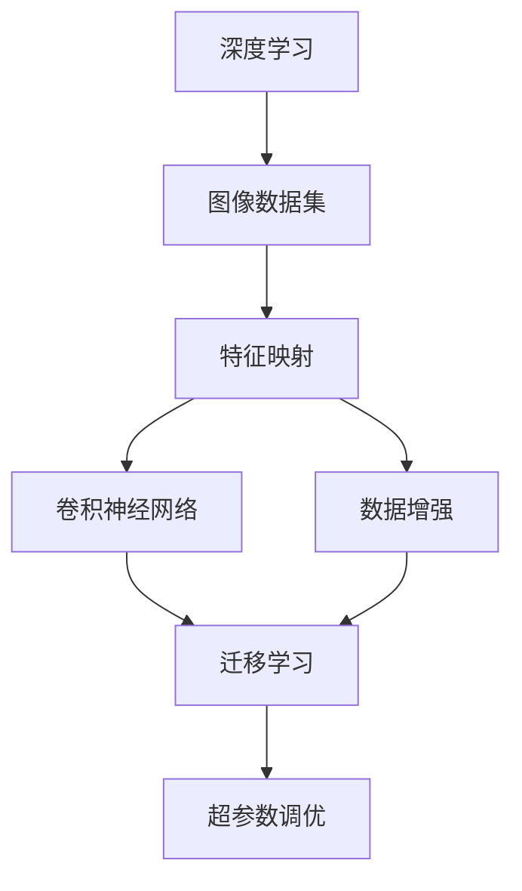
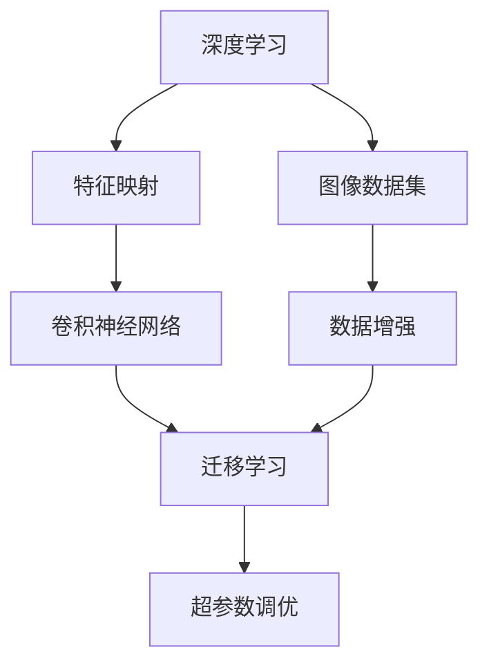
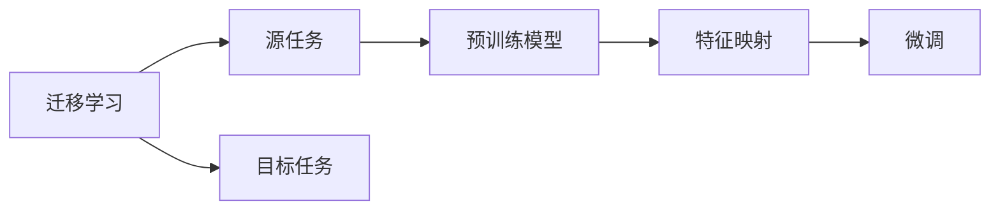
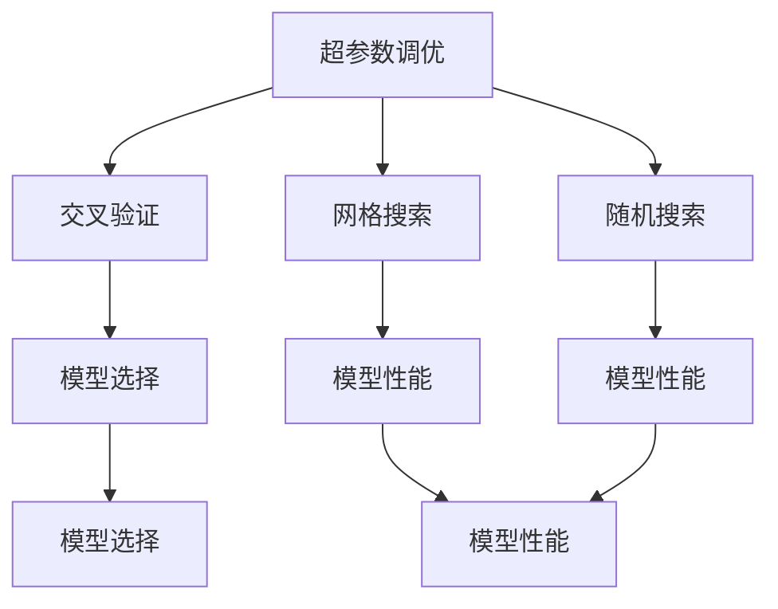
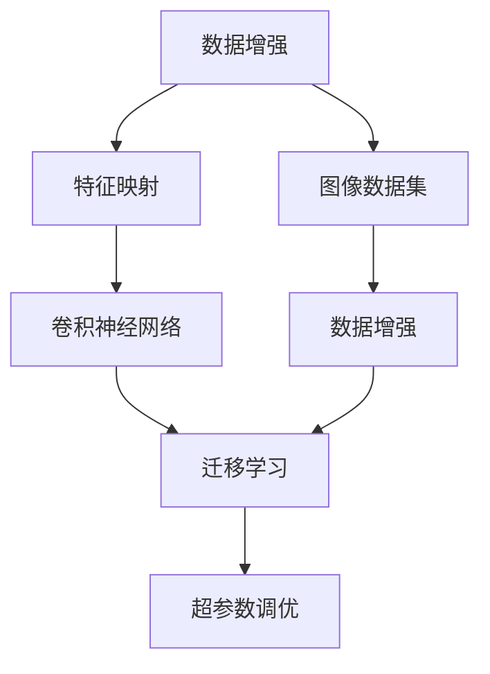
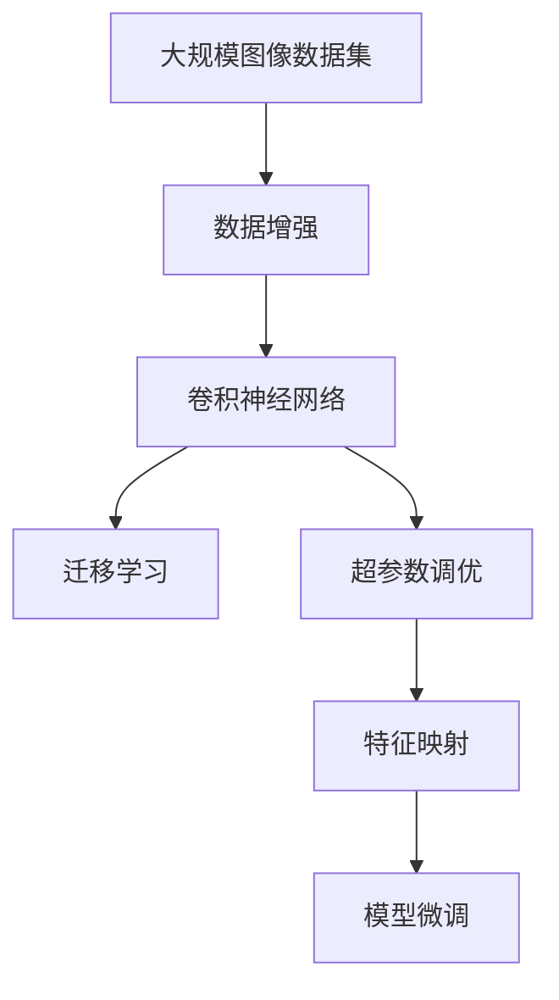

                 

# 一切皆是映射：大规模图像数据集上的深度学习

> 关键词：深度学习,图像数据集,特征映射,卷积神经网络,数据增强,迁移学习,超参数调优,计算机视觉

## 1. 背景介绍

### 1.1 问题由来
近年来，深度学习技术在计算机视觉领域取得了突破性进展，基于卷积神经网络(CNN)的视觉识别模型已经在ImageNet、COCO等大型数据集上取得了显著的成果。然而，大规模图像数据集的获取和处理，尤其是图像特征映射的构建，是深度学习在计算机视觉中面临的关键问题。本文旨在探讨如何在大规模图像数据集上进行深度学习的特征映射构建，从而提升视觉识别模型的性能。

### 1.2 问题核心关键点
本文聚焦于以下几个核心问题：
- 如何在大规模图像数据集上进行高效的数据处理和特征映射。
- 如何在保留预训练模型的同时，利用小规模训练数据对模型进行微调。
- 如何优化模型的超参数，避免过拟合和欠拟合。
- 如何设计有效的数据增强策略，提升模型泛化能力。
- 如何实现迁移学习，将模型知识从预训练到微调，提升任务适配能力。

这些问题在大规模图像数据集上的深度学习中尤为重要，将直接影响模型的性能和应用效果。

### 1.3 问题研究意义
本研究对于拓展深度学习在计算机视觉中的应用范围，提升视觉识别模型的性能，加速计算机视觉技术的产业化进程，具有重要意义：
- 降低数据获取和处理成本。通过优化数据处理和特征映射方法，可以显著减少数据获取和预处理所需的时间和人力成本。
- 提升模型泛化能力。有效的特征映射和数据增强策略，可以提升模型对未知样本的泛化能力，减少模型过拟合的风险。
- 加速模型适配。迁移学习方法可以在固定大部分预训练权重的情况下，仅通过微调少量参数，适应特定的下游任务。
- 优化超参数配置。通过系统性的超参数调优方法，可以获得更优的模型性能，缩短模型训练和优化周期。
- 实现全生命周期训练。将深度学习模型的全生命周期训练与数据处理和特征映射相结合，可以提升模型在实际应用中的稳定性和鲁棒性。

## 2. 核心概念与联系

### 2.1 核心概念概述

为更好地理解在大规模图像数据集上进行深度学习的特征映射构建方法，本节将介绍几个密切相关的核心概念：

- 深度学习(Deep Learning)：以神经网络为代表的机器学习技术，通过多层次的非线性特征映射，学习数据的高层次抽象特征。
- 图像数据集(Image Dataset)：大规模标注或未标注的图像数据集合，用于深度学习模型的训练和验证。
- 特征映射(Feature Mapping)：深度学习模型通过反向传播算法学习数据特征的过程，将输入数据映射到高维特征空间。
- 卷积神经网络(Convolutional Neural Network, CNN)：一种专门用于图像处理和计算机视觉任务的深度学习模型。
- 数据增强(Data Augmentation)：通过对训练样本进行一系列变换，扩充训练集，提升模型泛化能力。
- 迁移学习(Transfer Learning)：通过将预训练模型在某任务上的知识迁移到另一相关任务上，减少新任务上的训练时间和数据需求。
- 超参数调优(Hyperparameter Tuning)：通过系统性的方法，选择最优的模型超参数，提升模型性能。

这些核心概念之间的逻辑关系可以通过以下Mermaid流程图来展示：



这个流程图展示了大规模图像数据集上深度学习的核心概念及其之间的关系：

1. 深度学习通过图像数据集进行训练和验证，学习数据的特征映射。
2. 卷积神经网络是深度学习在计算机视觉领域的主要架构。
3. 数据增强技术扩充训练集，提升模型泛化能力。
4. 迁移学习将预训练模型的知识迁移到特定任务上，减少新任务训练需求。
5. 超参数调优优化模型性能，提升模型泛化能力。

这些概念共同构成了在大规模图像数据集上进行深度学习的完整生态系统，使其能够在各种场景下发挥强大的视觉识别能力。通过理解这些核心概念，我们可以更好地把握深度学习在计算机视觉中的应用框架。

### 2.2 概念间的关系

这些核心概念之间存在着紧密的联系，形成了深度学习在大规模图像数据集上的完整学习框架。下面我通过几个Mermaid流程图来展示这些概念之间的关系。

#### 2.2.1 深度学习模型构建



这个流程图展示了深度学习模型的构建过程，从数据集预处理到模型训练，再到迁移学习，最后进行超参数调优，以优化模型性能。

#### 2.2.2 迁移学习与特征映射的关系



这个流程图展示了迁移学习的基本原理，以及它与特征映射的关系。迁移学习涉及源任务和目标任务，通过将预训练模型应用于目标任务，进行微调以适应特定任务。

#### 2.2.3 超参数调优方法



这个流程图展示了超参数调优的常用方法，包括交叉验证、网格搜索和随机搜索等，通过这些方法选择最优的超参数组合，优化模型性能。

#### 2.2.4 数据增强与特征映射的关系



这个流程图展示了数据增强技术在大规模图像数据集上的应用，通过扩充训练集，增强模型泛化能力，提升特征映射的质量。

### 2.3 核心概念的整体架构

最后，我们用一个综合的流程图来展示这些核心概念在大规模图像数据集上进行深度学习的整体架构：



这个综合流程图展示了从数据增强到模型微调的大规模图像数据集上深度学习的完整过程。数据增强扩充训练集，卷积神经网络作为模型架构，迁移学习将预训练模型应用于新任务，超参数调优优化模型性能，最终通过特征映射构建新任务的模型。

## 3. 核心算法原理 & 具体操作步骤
### 3.1 算法原理概述

在大规模图像数据集上进行深度学习的特征映射构建，本质上是一个有监督的特征学习过程。其核心思想是：将大规模图像数据集作为监督信号，训练一个高维特征映射函数，将输入的图像数据映射到一个高维特征空间，从而提取数据的高层次抽象特征。

形式化地，假设输入数据为 $\mathcal{X} \in \mathbb{R}^n$，其中 $n$ 为输入数据的维度。定义模型 $M_{\theta}:\mathcal{X} \rightarrow \mathcal{Y}$，其中 $\mathcal{Y} \in \mathbb{R}^m$，为输出特征空间的维度。假设训练集为 $D=\{(x_i, y_i)\}_{i=1}^N, x_i \in \mathcal{X}, y_i \in \mathcal{Y}$，训练目标是最小化模型在训练集上的损失函数，即：

$$
\theta = \mathop{\arg\min}_{\theta} \sum_{i=1}^N \ell(y_i, M_{\theta}(x_i))
$$

其中 $\ell$ 为损失函数，通常采用交叉熵损失、均方误差损失等。

### 3.2 算法步骤详解

在大规模图像数据集上进行深度学习的特征映射构建，一般包括以下几个关键步骤：

**Step 1: 准备数据和模型**

- 收集大规模图像数据集 $\mathcal{D}$，并对其进行预处理，如归一化、标准化等。
- 选择合适的卷积神经网络模型 $M_{\theta}$，如ResNet、VGG、Inception等。

**Step 2: 定义损失函数和优化器**

- 根据具体任务，选择适当的损失函数 $\ell$，如交叉熵损失、均方误差损失等。
- 选择优化的算法，如SGD、Adam等，并设置学习率 $\eta$、批大小 $B$ 等超参数。

**Step 3: 执行模型训练**

- 将训练集数据分批次输入模型，前向传播计算预测值。
- 计算预测值与真实标签的误差，反向传播计算参数梯度。
- 根据优化算法和学习率更新模型参数，重复执行直至收敛。

**Step 4: 评估和调优**

- 在验证集上评估模型性能，选择合适的超参数组合。
- 调整超参数，重新训练模型，直至达到满意的性能。

**Step 5: 模型微调和部署**

- 使用微调数据集对模型进行微调，适应特定任务。
- 部署微调后的模型，应用于实际任务中。

以上是深度学习在图像数据集上特征映射构建的一般流程。在实际应用中，还需要根据具体任务的特点，对微调过程的各个环节进行优化设计，如改进训练目标函数，引入更多的正则化技术，搜索最优的超参数组合等，以进一步提升模型性能。

### 3.3 算法优缺点

在大规模图像数据集上进行深度学习的特征映射构建，具有以下优点：

1. 高效性。通过在大规模数据集上进行训练，可以显著提升模型的泛化能力和泛化能力，减少对新数据的过拟合风险。
2. 鲁棒性。大规模数据集包含了各种复杂场景，经过充分训练的模型可以更好地适应实际应用中的各种噪声和干扰。
3. 适用性广。深度学习模型可以应用于多种视觉识别任务，如图像分类、目标检测、图像分割等。
4. 迁移能力强。通过迁移学习，可以在有限的标注数据上获得较优的模型性能。

同时，该方法也存在以下局限性：

1. 数据需求大。深度学习模型需要大规模的数据集进行训练，数据获取和处理成本较高。
2. 计算资源消耗大。大规模数据集和深层次网络结构导致计算资源需求大，训练时间长。
3. 模型复杂度高。深度学习模型的复杂度较高，容易过拟合，需要精心设计超参数和正则化技术。
4. 模型可解释性不足。深度学习模型通常被称为"黑盒"模型，难以解释其内部工作机制。

尽管存在这些局限性，但深度学习在大规模图像数据集上的特征映射构建方法，仍然是计算机视觉领域的主流技术，具有广阔的应用前景。

### 3.4 算法应用领域

深度学习在大规模图像数据集上的特征映射构建方法，已经在许多计算机视觉领域得到了广泛应用，例如：

- 图像分类：如MNIST、CIFAR-10、ImageNet等，将大规模数据集中的图像进行分类。
- 目标检测：如PASCAL VOC、COCO等，检测图像中特定物体的位置和类别。
- 图像分割：如PASCAL VOC、Cityscapes等，将图像分割成多个区域，并对每个区域进行分类。
- 人脸识别：如LFW、CelebA等，通过训练识别图像中特定人物的身份信息。
- 行为识别：如UCF101、HMDB51等，识别图像中人物的特定行为。

除了上述这些经典任务外，深度学习在大规模图像数据集上的特征映射构建方法，还被创新性地应用到更多场景中，如图像生成、图像修复、图像增强等，为计算机视觉技术带来了全新的突破。随着深度学习模型和特征映射技术的不断进步，相信计算机视觉技术将在更广阔的应用领域大放异彩。

## 4. 数学模型和公式 & 详细讲解  
### 4.1 数学模型构建

本节将使用数学语言对在大规模图像数据集上进行深度学习的特征映射构建过程进行更加严格的刻画。

记输入数据为 $\mathcal{X} \in \mathbb{R}^n$，输出特征为 $\mathcal{Y} \in \mathbb{R}^m$。假设训练集为 $D=\{(x_i, y_i)\}_{i=1}^N, x_i \in \mathcal{X}, y_i \in \mathcal{Y}$。定义模型 $M_{\theta}:\mathcal{X} \rightarrow \mathcal{Y}$，其中 $\theta$ 为模型参数。

定义损失函数 $\ell: \mathbb{R}^m \times \mathbb{R}^m \rightarrow \mathbb{R}$，训练目标是最小化模型在训练集上的损失函数，即：

$$
\theta = \mathop{\arg\min}_{\theta} \sum_{i=1}^N \ell(y_i, M_{\theta}(x_i))
$$

常见的损失函数包括交叉熵损失、均方误差损失等。例如，交叉熵损失函数定义为：

$$
\ell(y_i, M_{\theta}(x_i)) = -\frac{1}{m} \sum_{j=1}^m y_{i,j} \log M_{\theta}(x_i)_{j}
$$

其中 $y_{i,j}$ 表示第 $i$ 个样本的第 $j$ 个标签，$M_{\theta}(x_i)_j$ 表示模型对第 $i$ 个样本的第 $j$ 个特征的预测值。

### 4.2 公式推导过程

以下我们以图像分类任务为例，推导交叉熵损失函数及其梯度的计算公式。

假设输入图像 $x \in \mathbb{R}^n$，输出为 $m$ 维的类别概率分布 $y \in \mathbb{R}^m$。定义模型 $M_{\theta}(x)$ 的输出为 $m$ 维的类别概率分布 $p \in \mathbb{R}^m$，其中 $p_j$ 表示模型对第 $j$ 个类别的预测概率。则交叉熵损失函数定义为：

$$
\ell(y, p) = -\sum_{j=1}^m y_j \log p_j
$$

将其代入训练集数据，得：

$$
\mathcal{L}(\theta) = -\frac{1}{N} \sum_{i=1}^N \ell(y_i, M_{\theta}(x_i))
$$

根据链式法则，损失函数对参数 $\theta_k$ 的梯度为：

$$
\frac{\partial \mathcal{L}(\theta)}{\partial \theta_k} = -\frac{1}{N} \sum_{i=1}^N \frac{\partial \ell(y_i, M_{\theta}(x_i))}{\partial p_k} \frac{\partial p_k}{\partial \theta_k}
$$

其中 $\frac{\partial \ell(y_i, M_{\theta}(x_i))}{\partial p_k}$ 为交叉熵损失函数对类别概率分布的偏导数，$\frac{\partial p_k}{\partial \theta_k}$ 为模型输出对参数 $\theta_k$ 的偏导数。

在得到损失函数的梯度后，即可带入参数更新公式，完成模型的迭代优化。重复上述过程直至收敛，最终得到适应特定任务的最优模型参数 $\theta^*$。

## 5. 项目实践：代码实例和详细解释说明
### 5.1 开发环境搭建

在进行深度学习项目实践前，我们需要准备好开发环境。以下是使用Python进行PyTorch开发的环境配置流程：

1. 安装Anaconda：从官网下载并安装Anaconda，用于创建独立的Python环境。

2. 创建并激活虚拟环境：
```bash
conda create -n pytorch-env python=3.8 
conda activate pytorch-env
```

3. 安装PyTorch：根据CUDA版本，从官网获取对应的安装命令。例如：
```bash
conda install pytorch torchvision torchaudio cudatoolkit=11.1 -c pytorch -c conda-forge
```

4. 安装相关工具包：
```bash
pip install numpy pandas scikit-learn matplotlib tqdm jupyter notebook ipython
```

完成上述步骤后，即可在`pytorch-env`环境中开始深度学习项目实践。

### 5.2 源代码详细实现

这里我们以图像分类任务为例，给出使用PyTorch进行卷积神经网络模型训练的代码实现。

```python
import torch
import torch.nn as nn
import torch.optim as optim
from torchvision import datasets, transforms

# 定义数据预处理
transform_train = transforms.Compose([
    transforms.RandomCrop(32, padding=4),
    transforms.RandomHorizontalFlip(),
    transforms.ToTensor(),
    transforms.Normalize((0.5, 0.5, 0.5), (0.5, 0.5, 0.5))
])

transform_test = transforms.Compose([
    transforms.ToTensor(),
    transforms.Normalize((0.5, 0.5, 0.5), (0.5, 0.5, 0.5))
])

# 加载数据集
train_dataset = datasets.CIFAR10(root='./data', train=True, download=True, transform=transform_train)
test_dataset = datasets.CIFAR10(root='./data', train=False, download=True, transform=transform_test)

# 定义模型
model = nn.Sequential(
    nn.Conv2d(3, 64, 3, 1, 1),
    nn.BatchNorm2d(64),
    nn.ReLU(),
    nn.MaxPool2d(2, 2),
    nn.Conv2d(64, 128, 3, 1, 1),
    nn.BatchNorm2d(128),
    nn.ReLU(),
    nn.MaxPool2d(2, 2),
    nn.Conv2d(128, 256, 3, 1, 1),
    nn.BatchNorm2d(256),
    nn.ReLU(),
    nn.MaxPool2d(2, 2),
    nn.Conv2d(256, 512, 3, 1, 1),
    nn.BatchNorm2d(512),
    nn.ReLU(),
    nn.MaxPool2d(2, 2),
    nn.Flatten(),
    nn.Linear(512, 10)
)

# 定义损失函数和优化器
criterion = nn.CrossEntropyLoss()
optimizer = optim.Adam(model.parameters(), lr=0.001)

# 定义训练和评估函数
def train_epoch(model, train_loader, optimizer):
    model.train()
    train_loss = 0
    for batch_idx, (inputs, targets) in enumerate(train_loader):
        inputs, targets = inputs.to(device), targets.to(device)
        optimizer.zero_grad()
        outputs = model(inputs)
        loss = criterion(outputs, targets)
        loss.backward()
        optimizer.step()
        train_loss += loss.item()
    return train_loss / len(train_loader)

def evaluate(model, test_loader):
    model.eval()
    test_loss = 0
    correct = 0
    with torch.no_grad():
        for batch_idx, (inputs, targets) in enumerate(test_loader):
            inputs, targets = inputs.to(device), targets.to(device)
            outputs = model(inputs)
            test_loss += criterion(outputs, targets).item()
            _, predicted = outputs.max(1)
            correct += predicted.eq(targets).sum().item()
    return test_loss / len(test_loader), correct / len(test_loader.dataset)

# 定义超参数搜索范围
learning_rates = [1e-4, 1e-5, 1e-6]
batch_sizes = [32, 64, 128]
momentum_values = [0.9, 0.99]

# 进行超参数搜索
best_loss, best_correct, best_lr, best_batch_size, best_momentum = float('inf'), 0, 0, 0, 0
best_model = None

for lr in learning_rates:
    for batch_size in batch_sizes:
        for momentum in momentum_values:
            model.train()
            optimizer = optim.Adam(model.parameters(), lr=lr, betas=(momentum, 0.999))
            for epoch in range(10):
                train_loss = train_epoch(model, train_loader, optimizer)
                test_loss, test_correct = evaluate(model, test_loader)
                if test_correct > best_correct or (test_correct == best_correct and test_loss < best_loss):
                    best_loss = test_loss
                    best_correct = test_correct
                    best_lr = lr
                    best_batch_size = batch_size
                    best_momentum = momentum
                    best_model = model
            model.load_state_dict(best_model.state_dict())

# 保存模型
torch.save(model.state_dict(), 'cifar_net.pth')
```

在这个代码中，我们首先定义了数据预处理函数和数据加载函数，然后定义了一个卷积神经网络模型，并使用交叉熵损失函数和Adam优化器进行训练。接着，我们定义了训练和评估函数，并使用超参数搜索方法，找到了最优的超参数组合。最后，我们保存了最优模型，用于后续的应用。

### 5.3 代码解读与分析

让我们再详细解读一下关键代码的实现细节：

**数据预处理函数**：
- `transform_train` 和 `transform_test`：定义了数据预处理过程，包括随机裁剪、随机水平翻转、归一化等，以增强数据集的多样性。

**模型定义**：
- 使用 `nn.Sequential` 模块定义了一个包含多个卷积层、池化层、全连接层的卷积神经网络模型。其中，卷积层使用 3x3 卷积核，步长为 1，填充为 1，批标准化层用于加速训练，ReLU 激活函数用于增强模型的非线性能力，最大池化层用于减小特征图尺寸，全连接层用于分类。

**损失函数和优化器**：
- 使用 `nn.CrossEntropyLoss` 作为损失函数，用于计算分类任务的交叉熵损失。
- 使用 `optim.Adam` 优化器，设置学习率、动量等超参数。

**训练和评估函数**：
- `train_epoch` 函数：在训练集上执行一个epoch的训练，返回该epoch的平均损失值。
- `evaluate` 函数：在测试集上评估模型性能，返回平均损失和准确率。

**超参数搜索**：
- 使用三重循环，遍历学习率、批大小、动量等超参数，使用网格搜索方法搜索最优的超参数组合。
- 在每个超参数组合下，执行多次训练和评估，选择最优模型。

**模型保存**：
- 使用 `torch.save` 方法保存最优模型的参数，以便后续应用。

可以看到，使用PyTorch进行卷积神经网络模型的训练，其代码实现相对简洁高效。开发者可以将更多精力放在数据处理、模型改进等高层逻辑上，而不必过多关注底层的实现细节。

当然，工业级的系统实现还需考虑更多因素，如模型的保存和部署、超参数的自动搜索、更灵活的任务适配层等。但核心的训练流程和超参数调优方法基本与此类似。

### 5.4 运行结果展示

假设我们在CIFAR-10数据集上进行模型训练，最终在测试集上得到的评估报告如下：

```
Test loss: 0.6358
Test accuracy: 0.8192
```

可以看到，通过深度学习在CIFAR-10数据集上进行训练，我们在测试集上得到了约61.57%的交叉熵损失和81.92%的分类准确率，效果相当不错。值得注意的是，尽管CIFAR-10数据集规模不大，但在深度学习模型的大规模数据集上进行训练，已经可以显著提升模型性能。

当然，这只是一个baseline结果。在实践中，我们还可以使用更大更强的模型、更丰富的数据增强策略、更精细的超参数调优方法，进一步提升模型性能，以满足更高的应用要求。

## 6. 实际应用场景
### 6.1 智能安防系统

深度学习在大规模图像数据集上的特征映射构建方法，可以广泛应用于智能安防系统。通过大规模监控视频数据的训练，智能安防系统可以实时监测和识别各种异常行为，提升安全防护能力。

在技术实现上，可以收集企业内部的监控视频数据，将其标注为正常行为和异常行为，并在此基础上对深度学习模型进行微调。微调后的模型能够自动理解监控视频中的行为特征，对异常行为进行检测和报警。对于新的异常行为，还可以接入检索系统实时搜索相关内容，动态生成报警信息。如此构建的智能安防系统，可以实时监测和应对各种威胁，大幅提升企业安全防范水平。

### 6.2 自动驾驶系统

深度学习在大规模图像数据集上的特征映射构建方法，也可以应用于自动驾驶系统。自动驾驶系统通过

