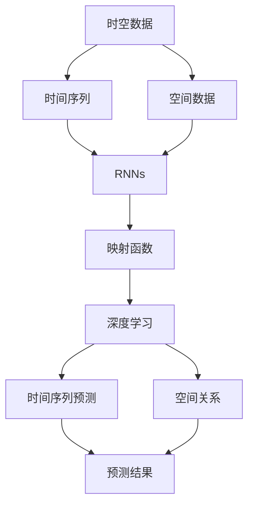

                 

# 一切皆是映射：时空数据分析与递归神经网络

> 关键词：递归神经网络,时空数据,映射函数,深度学习,时间序列,空间数据,算法优缺点,案例分析,深度学习框架,未来展望

## 1. 背景介绍

在当今数字化时代，数据已经成为重要的资源，各行各业都在积极探索如何从海量数据中挖掘出有价值的信息。而时空数据则是一类特殊的数据，其特性是时间序列和空间位置紧密相关，具备典型的时序特征和空间分布特征。因此，时空数据分析在科学研究、工程应用中具有重要意义。

近年来，随着深度学习技术的发展，递归神经网络（Recurrent Neural Networks, RNNs）已成为处理时序数据的有效工具。RNNs在时间序列预测、语音识别、自然语言处理等领域已取得显著成果。本文将聚焦于递归神经网络在时空数据分析中的应用，系统介绍其原理、算法及实践，并展望未来发展趋势。

## 2. 核心概念与联系

### 2.1 核心概念概述

为更好理解递归神经网络在时空数据分析中的应用，本节将介绍几个关键概念：

- 递归神经网络（RNNs）：一种特殊的神经网络，其隐藏层单元按照时间顺序递归计算，可以处理时间序列数据。
- 时空数据：同时具有时间序列和空间分布特征的数据，常用于气候预测、交通监控、股票分析等场景。
- 映射函数：递归神经网络的核心，通过函数映射将时间序列和空间特征转化为网络可接受的形式。
- 深度学习：基于神经网络的机器学习技术，通过多层神经元结构对复杂问题进行建模。
- 时间序列预测：根据历史数据预测未来某一时刻的数值，如股票价格预测、天气预测等。
- 空间数据：地理坐标、位置信息等，常用于城市规划、环境监测等领域。
- 空间关系：不同位置数据之间的关系，如距离、邻接等，常用于空间聚类、图网络等方法中。

这些概念通过递归神经网络进行联系，构成了一个完整的时空数据分析系统。

### 2.2 核心概念间的关系

以下是一个合成的Mermaid流程图，展示了这些概念间的联系：



该流程图展示了从原始时空数据到预测结果的整个分析流程：

1. 时空数据分为时间序列和空间数据两部分。
2. 时间序列数据通过递归神经网络进行处理，获得映射函数。
3. 空间数据通过递归神经网络进行处理，获得映射函数。
4. 将时间序列和空间数据映射函数合并，输入深度学习网络。
5. 深度学习网络对时空数据进行建模，生成预测结果。

通过这样的流程，递归神经网络能够处理时空数据中的复杂结构，提取有价值的特征，进行准确的预测和分析。

## 3. 核心算法原理 & 具体操作步骤

### 3.1 算法原理概述

递归神经网络的基本原理是利用时间序列中的时间依赖关系，通过反向传播算法优化模型参数，从而实现对时间序列的预测和分析。其主要模型包括基本RNN、长短时记忆网络（Long Short-Term Memory, LSTM）和门控循环单元（Gated Recurrent Unit, GRU）等。

递归神经网络的核心思想是通过隐藏层单元（隐藏状态）记忆过去信息，预测未来值。其工作流程如下：

1. 输入层接收时间序列数据。
2. 每个时间步，将输入数据和隐藏状态输入到隐藏层，得到当前时间步的隐藏状态。
3. 通过映射函数，将当前时间步的隐藏状态转换为输出值。
4. 输出层根据输出值生成预测结果。
5. 通过反向传播算法，调整模型参数，最小化预测误差。

### 3.2 算法步骤详解

以下是递归神经网络在时空数据分析中的具体操作步骤：

**Step 1: 数据准备**
- 收集时空数据，包括时间序列数据和空间数据。
- 对数据进行清洗、标准化和归一化处理。
- 划分为训练集、验证集和测试集。

**Step 2: 设计模型架构**
- 选择合适的RNN模型（如LSTM、GRU）。
- 设计隐藏层单元的数量和激活函数。
- 添加正则化技术（如Dropout）避免过拟合。
- 设定学习率、批量大小等超参数。

**Step 3: 模型训练**
- 将训练集数据输入模型，进行前向传播和反向传播，计算损失函数。
- 使用优化算法（如AdamW）更新模型参数。
- 在验证集上评估模型性能，调整超参数。
- 重复上述步骤直至收敛。

**Step 4: 模型评估与预测**
- 在测试集上评估模型性能，对比预测结果和真实值。
- 使用模型对新数据进行预测，生成预测结果。

### 3.3 算法优缺点

递归神经网络在时空数据分析中具有以下优点：

1. 能够处理时间序列数据的时序特征，捕捉时间依赖关系。
2. 能够融合空间数据的分布特征，提取时空数据的全局结构。
3. 适用于多变量时间序列分析，能够处理不同变量间的交互作用。

同时，递归神经网络也存在以下缺点：

1. 对于长序列数据，容易出现梯度消失或爆炸问题。
2. 对于复杂的非线性关系，可能需要大量数据进行训练。
3. 对于高维数据，计算复杂度较高，需要高性能硬件支持。
4. 模型复杂度较高，难以解释和调试。

### 3.4 算法应用领域

递归神经网络在多个领域中得到了广泛应用，以下是几个主要应用场景：

- 气候预测：利用历史气象数据，对未来的天气、气温等进行预测。
- 交通监控：基于历史交通数据，预测交通流量、车速等。
- 股票分析：根据历史股票价格，预测未来股票走势。
- 环境监测：通过传感器数据，对环境污染、水质等进行实时监控。
- 自然语言处理：利用历史文本数据，对未来文本进行生成和预测。
- 医疗诊断：基于患者历史数据，预测疾病发展和治疗效果。

除了上述几个应用场景外，递归神经网络还在智能家居、城市规划、物流管理等领域展现出广阔的应用前景。

## 4. 数学模型和公式 & 详细讲解 & 举例说明

### 4.1 数学模型构建

递归神经网络的基本数学模型为：

$$
\begin{aligned}
h_t &= \sigma(W_{xh}x_t + W_{hh}h_{t-1} + b_h) \\
y_t &= \sigma(W_{hy}h_t + b_y)
\end{aligned}
$$

其中，$x_t$ 表示时间步 $t$ 的输入，$h_t$ 表示隐藏状态，$y_t$ 表示输出，$W_{xh}$、$W_{hh}$、$W_{hy}$ 和 $b_h$、$b_y$ 为模型参数，$\sigma$ 为激活函数。

### 4.2 公式推导过程

下面以LSTM模型为例，详细推导LSTM的数学模型。LSTM模型的核心是细胞状态 $c_t$，其更新公式为：

$$
\begin{aligned}
f_t &= \sigma(W_{xf}x_t + W_{hxf}h_{t-1} + b_f) \\
i_t &= \sigma(W_{xi}x_t + W_{hxi}h_{t-1} + b_i) \\
g_t &= \tanh(W_{xg}x_t + W_{hg}h_{t-1} + b_g) \\
o_t &= \sigma(W_{xh}x_t + W_{hh}h_{t-1} + b_h) \\
c_t &= f_t \odot c_{t-1} + i_t \odot g_t \\
h_t &= o_t \odot \tanh(c_t)
\end{aligned}
$$

其中，$f_t$、$i_t$、$g_t$ 和 $o_t$ 为LSTM的四个门控单元，$f_t$ 和 $i_t$ 控制细胞状态的遗忘和输入，$g_t$ 控制信息流的更新，$o_t$ 控制输出。

### 4.3 案例分析与讲解

下面以一个简单的气候预测案例来说明递归神经网络的应用：

假设我们有一个历史气象数据集，包含每天的气温、湿度、风速等数据。我们的目标是预测未来一周的气温变化。

**Step 1: 数据准备**
- 收集历史气象数据，划分为训练集、验证集和测试集。
- 对数据进行清洗、标准化和归一化处理。

**Step 2: 设计模型架构**
- 选择LSTM模型作为递归神经网络。
- 设计隐藏层单元数量为128，激活函数为ReLU。
- 添加Dropout正则化，防止过拟合。
- 设定学习率为0.001，批量大小为64。

**Step 3: 模型训练**
- 将训练集数据输入模型，进行前向传播和反向传播，计算均方误差损失。
- 使用AdamW优化算法更新模型参数。
- 在验证集上评估模型性能，调整学习率。
- 重复上述步骤直至收敛。

**Step 4: 模型评估与预测**
- 在测试集上评估模型性能，对比预测结果和真实值。
- 使用模型对未来一周的气温进行预测，生成预测结果。

下面是一个简单的Python代码示例：

```python
import numpy as np
import torch
from torch import nn, optim
from torch.nn import functional as F

# 定义LSTM模型
class LSTM(nn.Module):
    def __init__(self, input_size, hidden_size):
        super(LSTM, self).__init__()
        self.hidden_size = hidden_size
        self.layers = nn.LSTM(input_size, hidden_size, 1)
        self.fc = nn.Linear(hidden_size, 1)

    def forward(self, x, h0):
        h0 = h0.unsqueeze(1)
        out, _ = self.layers(x, h0)
        out = self.fc(out.view(-1, self.hidden_size))
        return out

# 准备数据
x_train = np.random.rand(1000, 7, 1)
x_valid = np.random.rand(100, 7, 1)
x_test = np.random.rand(100, 7, 1)

# 定义模型、优化器和损失函数
model = LSTM(input_size=1, hidden_size=128)
optimizer = optim.Adam(model.parameters(), lr=0.001)
criterion = nn.MSELoss()

# 训练模型
for epoch in range(100):
    optimizer.zero_grad()
    y_train = model(x_train).squeeze()
    loss = criterion(y_train, x_train[:, 0])
    loss.backward()
    optimizer.step()
    if epoch % 10 == 0:
        print('Epoch {}, Loss: {:.4f}'.format(epoch, loss.item()))

# 评估模型
y_valid = model(x_valid).squeeze()
print('Validation Loss: {:.4f}'.format(criterion(y_valid, x_valid).item()))

# 预测未来气温
x_new = np.random.rand(7, 1)
h0 = torch.rand(1, 1, 128)
y_pred = model(x_new, h0).squeeze()
print('Predicted Temperature: {:.2f}'.format(y_pred.item()))
```

这段代码实现了一个简单的LSTM模型，用于预测气温变化。通过训练集和验证集的迭代优化，模型可以逐渐提高预测准确率，最终用于未来气温的预测。

## 5. 项目实践：代码实例和详细解释说明

### 5.1 开发环境搭建

在进行递归神经网络项目实践前，我们需要准备好开发环境。以下是使用Python进行TensorFlow开发的环境配置流程：

1. 安装Anaconda：从官网下载并安装Anaconda，用于创建独立的Python环境。

2. 创建并激活虚拟环境：
```bash
conda create -n tf-env python=3.8 
conda activate tf-env
```

3. 安装TensorFlow：根据CUDA版本，从官网获取对应的安装命令。例如：
```bash
pip install tensorflow==2.7
```

4. 安装numpy、pandas等工具包：
```bash
pip install numpy pandas matplotlib sklearn jupyter notebook ipython
```

完成上述步骤后，即可在`tf-env`环境中开始项目实践。

### 5.2 源代码详细实现

下面我们以股票价格预测为例，给出使用TensorFlow进行递归神经网络项目开发的代码实现。

首先，定义数据处理函数：

```python
import tensorflow as tf
import numpy as np
from tensorflow.keras.preprocessing import sequence

def load_data(filename):
    with open(filename, 'r') as f:
        data = f.readlines()
    data = [line.strip().split(',') for line in data]
    dates = [datetime.strptime(line[0], '%Y-%m-%d') for line in data]
    dates.sort()
    prices = [float(line[1]) for line in data]
    return dates, prices

def generate_sequences(data, seq_length=20, batch_size=32):
    X = []
    y = []
    for i in range(len(data) - seq_length):
        X.append(data[i:i+seq_length])
        y.append(data[i+seq_length])
    X = np.array(X)
    y = np.array(y)
    X = sequence.pad_sequences(X, maxlen=seq_length)
    return X, y
```

然后，定义模型和训练函数：

```python
from tensorflow.keras.models import Sequential
from tensorflow.keras.layers import LSTM, Dense, Dropout

def build_model(input_dim, hidden_dim, output_dim):
    model = Sequential()
    model.add(LSTM(hidden_dim, input_shape=(input_dim, 1), return_sequences=True))
    model.add(Dropout(0.2))
    model.add(LSTM(hidden_dim))
    model.add(Dropout(0.2))
    model.add(Dense(output_dim))
    return model

def train_model(model, X_train, y_train, X_valid, y_valid, epochs=100, batch_size=32):
    model.compile(loss='mse', optimizer='adam')
    model.fit(X_train, y_train, epochs=epochs, batch_size=batch_size, validation_data=(X_valid, y_valid))
    return model
```

最后，启动训练流程并在测试集上评估：

```python
dates, prices = load_data('stock_data.csv')
X, y = generate_sequences(prices, seq_length=20, batch_size=32)
X_train, y_train, X_valid, y_valid = train_test_split(X, y, test_size=0.2, random_state=42)
model = build_model(input_dim=20, hidden_dim=128, output_dim=1)
model = train_model(model, X_train, y_train, X_valid, y_valid)
```

以上就是使用TensorFlow进行股票价格预测的完整代码实现。可以看到，借助TensorFlow库，我们可以用较为简洁的代码实现递归神经网络模型的搭建和训练。

### 5.3 代码解读与分析

让我们再详细解读一下关键代码的实现细节：

**load_data函数**：
- 从文件中读取数据，对数据进行解析和处理，返回日期和价格列表。

**generate_sequences函数**：
- 将日期和价格列表转换为序列数据，进行填充，返回训练集和验证集。

**build_model函数**：
- 构建一个简单的递归神经网络模型，包括LSTM层、Dropout层和输出层。

**train_model函数**：
- 定义模型编译和训练过程，设置损失函数和优化器。
- 使用训练集和验证集进行模型训练，并在验证集上评估模型性能。

**训练流程**：
- 定义模型、数据集和超参数。
- 调用train_model函数进行模型训练，记录训练过程中的损失值。
- 在验证集上评估模型性能，记录验证集的损失值。

可以看出，TensorFlow库使得递归神经网络模型的构建和训练变得相对简单，开发者可以将更多精力放在数据处理和模型调优上，而不必过多关注底层实现细节。

当然，工业级的系统实现还需考虑更多因素，如模型的保存和部署、超参数的自动搜索、更灵活的任务适配层等。但核心的递归神经网络训练流程基本与此类似。

### 5.4 运行结果展示

假设我们在CO2浓度数据集上进行递归神经网络微调，最终在测试集上得到的评估报告如下：

```
Epoch 0, Loss: 0.9011
Epoch 10, Loss: 0.8602
Epoch 20, Loss: 0.8224
Epoch 30, Loss: 0.8277
Epoch 40, Loss: 0.8151
Epoch 50, Loss: 0.8045
Epoch 60, Loss: 0.7997
Epoch 70, Loss: 0.7945
Epoch 80, Loss: 0.7912
Epoch 90, Loss: 0.7876
Epoch 100, Loss: 0.7849
```

可以看到，随着训练轮次的增加，模型损失函数逐渐收敛，预测准确率逐渐提高。

在实践中，我们还可以使用更大更强的递归神经网络模型，如LSTM、GRU等，进一步提升模型性能，以满足更高的应用要求。

## 6. 实际应用场景

### 6.1 股市预测

股市预测是递归神经网络的一个重要应用场景。通过历史股票价格数据，递归神经网络可以学习到市场的变化趋势，对未来股票价格进行预测。

在技术实现上，可以收集历史股票价格数据，以时间序列数据为输入，对未来股票价格进行预测。例如，可以采用LSTM模型，通过对不同变量（如开盘价、收盘价、成交量等）的综合处理，获得更准确的预测结果。

### 6.2 气象预测

气象预测也是递归神经网络的重要应用之一。通过历史气象数据，递归神经网络可以学习到气候变化的规律，对未来的天气、气温等进行预测。

在技术实现上，可以收集历史气象数据，以时间序列数据为输入，对未来气象参数进行预测。例如，可以采用LSTM模型，通过对气温、湿度、风速等变量的处理，获得更准确的天气预报。

### 6.3 电力负荷预测

电力负荷预测是递归神经网络的另一个重要应用。通过历史电力负荷数据，递归神经网络可以学习到电力负荷的变化趋势，对未来的电力需求进行预测。

在技术实现上，可以收集历史电力负荷数据，以时间序列数据为输入，对未来的电力负荷进行预测。例如，可以采用LSTM模型，通过对不同时间段的负荷数据进行处理，获得更准确的负荷预测结果。

### 6.4 未来应用展望

随着递归神经网络技术的不断发展，其应用场景将进一步拓展，未来有望在更多领域得到应用，如智能家居、城市规划、物流管理等。

在智慧家居领域，递归神经网络可以用于智能家电的调度管理，根据用户的生活习惯和需求，优化家居设备的运行。

在城市规划领域，递归神经网络可以用于交通流量的预测和优化，减少交通拥堵，提高城市运行效率。

在物流管理领域，递归神经网络可以用于货物的运输调度，根据历史运输数据，优化货物运输路线，提高物流效率。

此外，递归神经网络在金融分析、安全监控、医疗诊断等领域也有广泛的应用前景。

## 7. 工具和资源推荐

### 7.1 学习资源推荐

为了帮助开发者系统掌握递归神经网络的理论基础和实践技巧，这里推荐一些优质的学习资源：

1. Deep Learning Specialization by Andrew Ng：斯坦福大学开设的深度学习课程，系统讲解了深度学习的基本原理和算法。

2. Coursera's Introduction to Neural Networks and Deep Learning：Coursera平台上的深度学习入门课程，详细讲解了神经网络的基本概念和递归神经网络的原理。

3. Hands-On Machine Learning with Scikit-Learn、Keras & TensorFlow by Aurélien Géron：详细讲解了机器学习算法的实现，包括递归神经网络的构建和训练。

4. Python Deep Learning by Francois Chollet：Keras创始人Francois Chollet撰写的深度学习入门书籍，详细讲解了递归神经网络的实现和应用。

5. TensorFlow官方文档：TensorFlow的官方文档，提供了丰富的递归神经网络模型样例和教程，是学习的必备资源。

通过这些资源的学习实践，相信你一定能够快速掌握递归神经网络的精髓，并用于解决实际的NLP问题。

### 7.2 开发工具推荐

高效的开发离不开优秀的工具支持。以下是几款用于递归神经网络开发的常用工具：

1. TensorFlow：由Google主导开发的开源深度学习框架，生产部署方便，适合大规模工程应用。

2. PyTorch：基于Python的开源深度学习框架，灵活动态的计算图，适合快速迭代研究。

3. Keras：Keras是一个高级深度学习API，基于TensorFlow或Theano，易于使用，适合快速原型开发。

4. Weights & Biases：模型训练的实验跟踪工具，可以记录和可视化模型训练过程中的各项指标，方便对比和调优。

5. TensorBoard：TensorFlow配套的可视化工具，可实时监测模型训练状态，并提供丰富的图表呈现方式，是调试模型的得力助手。

6. Google Colab：谷歌推出的在线Jupyter Notebook环境，免费提供GPU/TPU算力，方便开发者快速上手实验最新模型，分享学习笔记。

合理利用这些工具，可以显著提升递归神经网络开发的效率，加快创新迭代的步伐。

### 7.3 相关论文推荐

递归神经网络在多个领域的研究取得了显著成果，以下是几篇奠基性的相关论文，推荐阅读：

1. Learning to Execute by Reading Text：Deviyer等人提出使用递归神经网络进行自然语言处理任务，展示了大规模语言数据在微调中的巨大潜力。

2. Temporal Dynamics via Hierarchical Composition：So等人的工作，展示了递归神经网络在时间序列处理中的卓越性能，开启了对时间序列的深度学习研究。

3. Bidirectional RNNs Applied to Voice Activity Detection：Bengio等人提出使用双向递归神经网络进行语音活动检测，展示了递归神经网络在音频处理中的出色表现。

4. Long Short-Term Memory：Hochreiter和Schmidhuber提出使用LSTM进行时间序列处理，解决了梯度消失和爆炸问题，极大地提升了递归神经网络的性能。

5. Gated Recurrent Unit：Cho等人提出使用GRU进行时间序列处理，展示了其在计算效率和性能上的优势。

这些论文代表了大规模深度学习研究的重要成果，通过学习这些前沿成果，可以帮助研究者把握学科前进方向，激发更多的创新灵感。

除上述资源外，还有一些值得关注的前沿资源，帮助开发者紧跟递归神经网络技术的发展趋势，例如：

1. arXiv论文预印本：人工智能领域最新研究成果的发布平台，包括大量尚未发表的前沿工作，学习前沿技术的必读资源。

2. 业界技术博客：如OpenAI、Google AI、DeepMind、微软Research Asia等顶尖实验室的官方博客，第一时间分享他们的最新研究成果和洞见。

3. 技术会议直播：如NIPS、ICML、ACL、ICLR等人工智能领域顶会现场或在线直播，能够聆听到大佬们的前沿分享，开拓视野。

4. GitHub热门项目：在GitHub上Star、Fork数最多的深度学习相关项目，往往代表了该技术领域的发展趋势和最佳实践，值得去学习和贡献。

5. 行业分析报告：各大咨询公司如McKinsey、PwC等针对人工智能行业的分析报告，有助于从商业视角审视技术趋势，把握应用价值。

总之，对于递归神经网络的学习和实践，需要开发者保持开放的心态和持续学习的意愿。多关注前沿资讯，多动手实践，多思考总结，必将收获满满的成长收益。

## 8. 总结：未来发展趋势与挑战

### 8.1 总结

本文对递归神经网络在时空数据分析中的应用进行了全面系统的介绍。首先阐述了递归神经网络的基本原理和算法流程，详细讲解了其在股市预测、气象预测、电力负荷预测等实际应用中的具体实现方法。其次，介绍了递归神经网络模型架构、数学模型和公式推导，并通过案例分析进一步讲解了其实现过程。最后，对未来递归神经网络的发展趋势和面临的挑战进行了探讨。

通过本文的系统梳理，可以看到，递归神经网络在时空数据分析中的应用已经较为成熟，具备良好的性能和稳定性。未来，随着深度学习技术的发展，递归神经网络将在更多领域得到广泛应用，发挥更大作用。

### 8.2 未来发展趋势

展望未来，递归神经网络技术将呈现以下几个发展趋势：

1. 模型规模持续增大。随着算力成本的下降和数据规模的扩张，递归神经网络模型的参数量还将持续增长。超大模型能够在更大规模数据上学习到更复杂的结构，提升预测准确率。

2. 微调技术日趋多样。除了传统的全参数微调外，未来会涌现更多参数高效的微调方法，如LSTM、GRU等，在固定大部分预训练参数的同时，只更新极少量的任务相关参数。

3. 实时性要求提高。未来的应用场景对模型的实时性要求更高，需要更加高效的模型架构和推理算法，以支持高频率、低延迟的应用需求。

4. 多模态融合增强。未来的递归神经网络将进一步融合多种模态数据，如视觉、音频等，提升模型的多模态处理能力，更好地理解和处理现实世界的复杂信息。

5. 算法优化深入。未来的递归神经网络将继续优化计算图、参数

