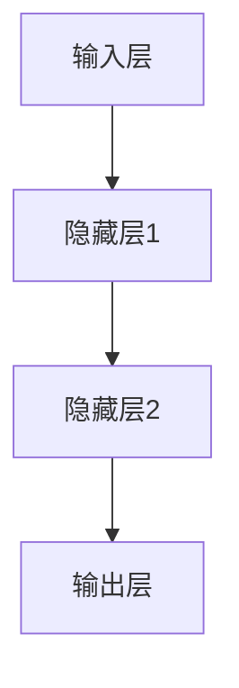
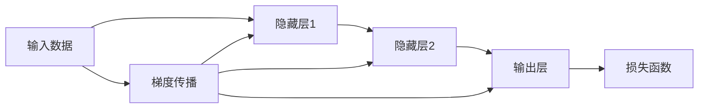
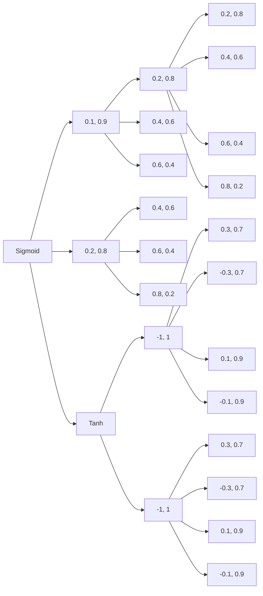
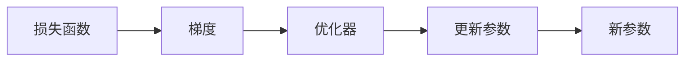
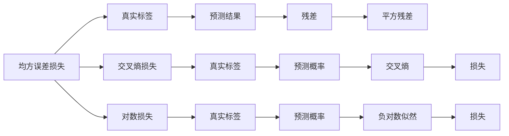
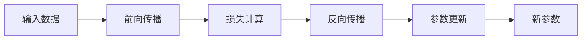
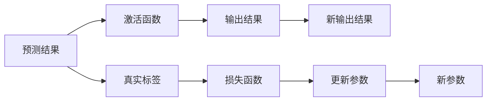
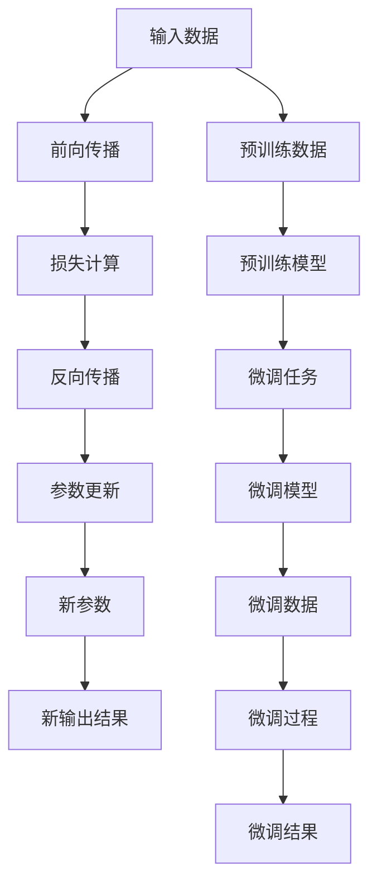

                 

# 一切皆是映射：深度学习的基石与概念入门

> 关键词：深度学习,神经网络,反向传播,梯度下降,前向传播,激活函数,正则化,优化器,损失函数

## 1. 背景介绍

### 1.1 问题由来

深度学习（Deep Learning）是当前人工智能领域最为热门的技术之一，其核心思想是通过模拟人类神经系统的结构和工作方式，构建多层神经网络，自动学习和提取数据中的特征，实现对复杂数据的有效建模和预测。深度学习的应用范围极为广泛，涵盖了计算机视觉、自然语言处理、语音识别、推荐系统等多个领域，推动了人工智能技术的快速发展。

然而，尽管深度学习在理论和实践上都取得了巨大成功，但很多从业人员和研究人员对于深度学习的核心概念和算法原理仍然存在一些困惑和误解。为了帮助读者更好地理解深度学习的本质和机制，本文将从深度学习的基石概念入手，系统介绍深度学习的核心思想、主要算法和实现步骤，并结合实际案例进行详细讲解。

### 1.2 问题核心关键点

深度学习的核心在于构建多层神经网络，并通过反向传播算法实现模型参数的优化，从而实现对数据的有效学习和预测。具体来说，深度学习包括以下几个关键步骤：

1. **模型构建**：选择合适的神经网络结构，如卷积神经网络（CNN）、循环神经网络（RNN）、生成对抗网络（GAN）等，并定义相应的网络参数。
2. **前向传播**：将输入数据输入神经网络，计算每一层的输出，直至输出最终结果。
3. **损失计算**：将模型输出与真实标签进行对比，计算损失函数，衡量模型的预测误差。
4. **反向传播**：通过反向传播算法，将损失函数的梯度反向传播到每个网络层，更新模型参数。
5. **优化调整**：使用优化器（如SGD、Adam）对模型参数进行优化，减小损失函数。

这些步骤通过循环迭代，不断调整模型参数，提高模型的预测准确性和泛化能力。

### 1.3 问题研究意义

掌握深度学习的核心概念和算法原理，对于理解当前人工智能技术的进展、推动新技术的创新、应用深度学习技术解决实际问题都具有重要意义：

1. **提升理论认识**：深度学习的核心思想和算法原理，是理解人工智能技术进展的重要基础。
2. **促进技术创新**：掌握深度学习的关键技术和实现方法，可以推动相关技术的进一步创新和突破。
3. **指导应用实践**：深度学习的应用范围非常广泛，了解其核心思想和算法，可以指导实际问题解决，推动人工智能技术的产业化进程。
4. **解决实际问题**：深度学习技术已经在计算机视觉、自然语言处理、推荐系统等多个领域取得了显著成效，掌握其核心概念和算法原理，有助于解决实际应用中的问题。

## 2. 核心概念与联系

### 2.1 核心概念概述

深度学习涉及多个核心概念，这些概念之间相互作用，共同构成了深度学习的完整框架。为了更好地理解这些概念，本节将从基础概念入手，逐步深入介绍其原理和架构。

#### 2.1.1 神经网络

神经网络是深度学习的核心结构，由多个神经元（神经节点）组成。神经元通过连接权重和偏置进行计算，并输出结果。神经网络通过多层堆叠，构建复杂的特征表示模型，如图1所示：



图1：三层神经网络结构示意图

#### 2.1.2 前向传播与反向传播

前向传播和反向传播是深度学习中最基本的算法，用于计算模型的输出和更新模型参数。前向传播将输入数据依次通过每一层神经元，计算输出结果；反向传播则用于计算损失函数对每一层参数的梯度，并更新参数。

图2展示了前向传播和反向传播的基本流程：



图2：前向传播和反向传播示意图

#### 2.1.3 激活函数

激活函数是神经网络中最重要的组件之一，用于对神经元的输出进行非线性变换，增加模型的表达能力。常用的激活函数包括Sigmoid、ReLU、Tanh等。

图3展示了不同激活函数的特性：



图3：不同激活函数特性

#### 2.1.4 正则化

正则化是深度学习中用于防止过拟合的常用技术，主要包括L1正则化、L2正则化、Dropout等。

L1正则化和L2正则化通过在损失函数中添加正则项，对模型参数进行约束，防止其过大。Dropout则通过随机丢弃一部分神经元，减少神经元之间的依赖，增加模型的鲁棒性。

图4展示了正则化的效果：


图4：正则化示意图

#### 2.1.5 优化器

优化器是深度学习中用于更新模型参数的算法，常用的优化器包括SGD、Adam、Adagrad等。

SGD（随机梯度下降）是最基本的优化器，通过计算损失函数对每个参数的梯度，更新模型参数。Adam（自适应矩估计梯度下降）则通过计算梯度的一阶矩估计和二阶矩估计，自适应调整学习率，提高训练效率和收敛速度。

图5展示了优化器的基本流程：



图5：优化器示意图

#### 2.1.6 损失函数

损失函数是用于衡量模型预测与真实标签之间差异的函数。常用的损失函数包括均方误差损失、交叉熵损失、对数损失等。

图6展示了不同损失函数的特性：



图6：不同损失函数特性

### 2.2 概念间的关系

这些核心概念之间存在着紧密的联系，形成了深度学习的完整生态系统。下面我们通过几个Mermaid流程图来展示这些概念之间的关系。

#### 2.2.1 深度学习的基本流程



图7：深度学习基本流程示意图

#### 2.2.2 正则化与优化器的关系


图8：正则化与优化器示意图

#### 2.2.3 损失函数与激活函数的关系



图9：损失函数与激活函数示意图

### 2.3 核心概念的整体架构

最后，我们用一个综合的流程图来展示这些核心概念在大模型微调过程中的整体架构：



图10：深度学习整体架构示意图

## 3. 核心算法原理 & 具体操作步骤

### 3.1 算法原理概述

深度学习的核心在于通过多层神经网络对数据进行复杂建模，并通过反向传播算法优化模型参数，实现对数据的有效学习和预测。深度学习的算法原理可以概括为以下几个步骤：

1. **模型构建**：选择合适的神经网络结构，并定义网络参数。
2. **前向传播**：将输入数据依次通过每一层神经元，计算输出结果。
3. **损失计算**：将模型输出与真实标签进行对比，计算损失函数，衡量模型的预测误差。
4. **反向传播**：通过反向传播算法，将损失函数的梯度反向传播到每个网络层，更新模型参数。
5. **优化调整**：使用优化器对模型参数进行优化，减小损失函数。

### 3.2 算法步骤详解

深度学习的实现步骤相对复杂，下面将详细介绍每一个步骤的具体操作。

#### 3.2.1 模型构建

模型的构建需要选择合适的神经网络结构和网络参数。通常，模型的层次结构如下：

1. **输入层**：用于接收输入数据，形状为$(1,d_0)$，其中$d_0$为输入特征维数。
2. **隐藏层**：用于特征提取和信息处理，通常有多个隐藏层，每一层都有对应的权重和偏置参数。
3. **输出层**：用于输出预测结果，形状为$(1,d_m)$，其中$d_m$为输出特征维数。

模型参数包括每一层权重和偏置，形状为$(d_i,d_{i-1})$，其中$i$表示层数。

#### 3.2.2 前向传播

前向传播将输入数据依次通过每一层神经元，计算输出结果。具体步骤如下：

1. **输入数据**：将输入数据$x$作为输入，形状为$(1,d_0)$。
2. **隐藏层**：计算每一层的输出，通过权重矩阵$W_i$和偏置向量$b_i$进行线性变换，并应用激活函数$\sigma$。公式如下：

   $$
   h_i = \sigma(W_ih_{i-1} + b_i)
   $$

3. **输出层**：计算最终输出结果$y$，通过权重矩阵$W_m$和偏置向量$b_m$进行线性变换，并应用激活函数$\sigma$。公式如下：

   $$
   y = \sigma(W_my_{i-1} + b_m)
   $$

#### 3.2.3 损失计算

损失计算将模型输出与真实标签进行对比，计算损失函数，衡量模型的预测误差。常用的损失函数包括均方误差损失、交叉熵损失等。

均方误差损失用于回归任务，公式如下：

$$
L(y, \hat{y}) = \frac{1}{n}\sum_{i=1}^{n}(y_i - \hat{y_i})^2
$$

交叉熵损失用于分类任务，公式如下：

$$
L(y, \hat{y}) = -\frac{1}{n}\sum_{i=1}^{n}y_i\log \hat{y_i} + (1-y_i)\log(1-\hat{y_i})
$$

#### 3.2.4 反向传播

反向传播将损失函数的梯度反向传播到每一层神经元，更新模型参数。具体步骤如下：

1. **输出层**：计算损失函数对每一层参数的梯度，公式如下：

   $$
   \frac{\partial L}{\partial W_m} = \frac{\partial L}{\partial y}\frac{\partial y}{\partial W_m}
   $$

   $$
   \frac{\partial L}{\partial b_m} = \frac{\partial L}{\partial y}
   $$

2. **隐藏层**：将梯度逐层反向传播，公式如下：

   $$
   \frac{\partial L}{\partial W_i} = \frac{\partial L}{\partial h_i}\frac{\partial h_i}{\partial W_i}
   $$

   $$
   \frac{\partial L}{\partial b_i} = \frac{\partial L}{\partial h_i}
   $$

3. **更新参数**：使用优化器（如SGD、Adam等）对模型参数进行优化，公式如下：

   $$
   W_i = W_i - \eta \frac{\partial L}{\partial W_i}
   $$

   $$
   b_i = b_i - \eta \frac{\partial L}{\partial b_i}
   $$

其中，$\eta$为学习率，通常设置为0.001。

#### 3.2.5 优化调整

优化调整是深度学习的最后一步，使用优化器对模型参数进行优化，减小损失函数。常用的优化器包括SGD、Adam、Adagrad等。

以Adam优化器为例，其基本步骤如下：

1. 初始化梯度一阶矩估计和二阶矩估计：

   $$
   \hat{m}_0 = 0
   $$

   $$
   \hat{v}_0 = 0
   $$

2. 计算梯度一阶矩估计和二阶矩估计：

   $$
   \hat{m}_t = \beta_1\hat{m}_{t-1} + (1-\beta_1)g_t
   $$

   $$
   \hat{v}_t = \beta_2\hat{v}_{t-1} + (1-\beta_2)g_t^2
   $$

3. 计算更新量：

   $$
   \Delta W = \frac{\hat{m}_t}{\sqrt{\hat{v}_t}+\epsilon}
   $$

   $$
   \Delta b = \frac{\hat{m}_t}{\sqrt{\hat{v}_t}+\epsilon}
   $$

4. 更新参数：

   $$
   W = W - \Delta W
   $$

   $$
   b = b - \Delta b
   $$

其中，$g_t$为第$t$次迭代的梯度，$\beta_1$和$\beta_2$为动量参数，$\epsilon$为精度参数。

### 3.3 算法优缺点

深度学习的核心算法具有以下优点和缺点：

#### 3.3.1 优点

1. **强大的表达能力**：深度神经网络可以通过多层堆叠，构建复杂的特征表示，处理非线性数据，捕捉复杂的模式。
2. **自适应学习**：深度学习模型可以通过反向传播算法自动优化参数，适应不同数据分布，减少手动调参的复杂度。
3. **广泛应用**：深度学习已经在计算机视觉、自然语言处理、语音识别等领域取得了巨大成功，推动了人工智能技术的发展。

#### 3.3.2 缺点

1. **计算成本高**：深度神经网络参数量庞大，计算复杂度高，训练时间长，需要大量计算资源。
2. **过拟合风险高**：深度神经网络容易过拟合，特别是当数据量不足时，需要采取正则化、Dropout等技术进行约束。
3. **解释性差**：深度神经网络通常被称为"黑盒"模型，难以解释其内部工作机制和决策逻辑。

### 3.4 算法应用领域

深度学习已经在多个领域得到了广泛应用，具体包括：

#### 3.4.1 计算机视觉

深度学习在计算机视觉领域的应用非常广泛，如目标检测、图像分类、图像分割、图像生成等。深度学习模型通过卷积神经网络（CNN）进行特征提取和信息处理，可以处理高维度、大规模的图像数据，取得了显著的成果。

#### 3.4.2 自然语言处理

深度学习在自然语言处理领域的应用也非常丰富，如文本分类、命名实体识别、情感分析、机器翻译等。深度学习模型通过循环神经网络（RNN）或变换器（Transformer）进行特征提取和信息处理，可以处理复杂的自然语言数据，取得了显著的成果。

#### 3.4.3 语音识别

深度学习在语音识别领域也有广泛应用，如语音识别、语音合成、说话人识别等。深度学习模型通过循环神经网络（RNN）或卷积神经网络（CNN）进行特征提取和信息处理，可以处理高维度、大规模的语音数据，取得了显著的成果。

#### 3.4.4 推荐系统

深度学习在推荐系统领域也有广泛应用，如协同过滤、内容推荐、广告推荐等。深度学习模型通过深度神经网络进行特征提取和信息处理，可以处理大规模、高维度的用户行为数据，取得了显著的成果。

## 4. 数学模型和公式 & 详细讲解 & 举例说明

### 4.1 数学模型构建

深度学习的数学模型主要包括以下几个部分：

1. **输入层**：用于接收输入数据，形状为$(1,d_0)$，其中$d_0$为输入特征维数。
2. **隐藏层**：用于特征提取和信息处理，通常有多个隐藏层，每一层都有对应的权重和偏置参数。
3. **输出层**：用于输出预测结果，形状为$(1,d_m)$，其中$d_m$为输出特征维数。

模型参数包括每一层权重和偏置，形状为$(d_i,d_{i-1})$，其中$i$表示层数。

### 4.2 公式推导过程

这里以二分类任务为例，推导深度学习模型的损失函数及其梯度计算公式。

假设模型$y=\sigma(W_1W_2x+b_1+b_2)$，其中$\sigma$为Sigmoid函数，$x$为输入数据，$y$为预测结果，$W_1$和$W_2$为权重矩阵，$b_1$和$b_2$为偏置向量。

假设真实标签为$y$，预测结果为$\hat{y}$，则二分类交叉熵损失函数为：

$$
L(y,\hat{y})=-\frac{1}{n}\sum_{i=1}^{n}(y_i\log \hat{y_i} + (1-y_i)\log (1-\hat{y_i}))
$$

其中，$n$为样本数量。

将模型$y=\sigma(W_1W_2x+b_1+b_2)$代入损失函数中，得：

$$
L(y,\hat{y})=-\frac{1}{n}\sum_{i=1}^{n}(y_i\log \sigma(W_1W_2x+b_1+b_2) + (1-y_i)\log (1-\sigma(W_1W_2x+b_1+b_2)))
$$

对于每一层参数$W_i$和$b_i$，计算梯度公式为：

$$
\frac{\partial L}{\partial W_i}=\frac{\partial L}{\partial y}\frac{\partial y}{\partial W_i}
$$

$$
\frac{\partial L}{\partial b_i}=\frac{\partial L}{\partial y}
$$

其中，$\frac{\partial L}{\partial y}$为损失函数对预测结果$y$的梯度，$\frac{\partial y}{\partial W_i}$为预测结果$y$对权重$W_i$的梯度。

根据链式法则，有：

$$
\frac{\partial L}{\partial W_i}=\frac{\partial L}{\partial y}\frac{\partial y}{\partial W_1W_2x+b_1+b_2}\frac{\partial (W_1W_2x+b_1+b_2)}{\partial W_i}
$$

$$
\frac{\partial L}{\partial b_i}=\frac{\partial L}{\partial y}\frac{\partial y}{\partial W_1W_2x+b_1+b_2}
$$

其中，$\frac{\partial y}{\partial W_1W_2x+b_1+b_2}=\sigma(W_1W_2x+b_1+b_2)(1-\sigma(W_1W_2x+b_1+b_2))$。

### 4.3 案例分析与讲解

以手写数字识别任务为例，说明深度学习模型的实现和应用。

手写数字识别任务通常采用MNIST数据集，包含60,000个训练样本和10,000个测试样本，每个样本为28x28的灰度图像。

假设模型采用三层卷积神经网络（CNN），每一层都有多个卷积核和池化层，通过多次卷积、池化和全连接层，最终输出预测结果。具体实现步骤如下：

1. **输入数据**：将手写数字图像转换为向量，形状为$(1,784)$，其中784为图像像素数。
2. **卷积层**：通过卷积核进行特征提取，形状为$(1,d_1)$，其中$d_1$为卷积核数量。
3. **池化层**：通过池化层进行特征降维，形状为$(1,d_2)$，其中$d_2$为池化核数量。
4. **全连接层**：通过全连接层进行分类，形状为$(1,d_3)$，其中$d_3$为输出维度。
5. **输出层**：将全连接层的输出通过Sigmoid函数进行归一化，形状为$(1,10)$，其中10为类别数。

模型参数包括每一层的权重和偏置，形状为$(d_i,d_{i-1})$，其中$i$表示层数。

## 5. 项目实践：代码实例和详细解释说明

### 5.1 开发环境搭建

在进行深度学习项目实践前，我们需要准备好开发环境。以下是使用Python进行PyTorch开发的环境配置流程：

1. 安装Anaconda：从官网下载并安装Anaconda，用于创建独立的Python环境。

2. 创建并激活虚拟环境：

   ```bash
   conda create -n pytorch-env python=3.8 
   conda activate pytorch-env
   ```

3. 安装PyTorch：根据CUDA版本，从官网获取对应的安装命令。例如：

   ```bash
   conda install pytorch torchvision torchaudio cudatoolkit=11.1 -c pytorch -c conda-forge
   ```

4. 安装相关库：

   ```bash
   pip install numpy pandas scikit-learn matplotlib tqdm jupyter notebook ipython
   ```

完成上述步骤后，即可在`pytorch-env`环境中开始深度学习项目实践。

### 5.2 源代码详细实现

这里以手写数字识别任务为例，给出使用PyTorch进行深度学习的PyTorch代码实现。

首先，定义模型：

```python
import torch
import torch.nn as nn
import torch.nn.functional as F

class Net(nn.Module):
    def __init__(self):
        super(Net, self).__init__()
        self.conv1 = nn.Conv2d(1, 32, 3, 1)
        self.conv2 = nn.Conv2d(32, 64, 3, 1)
        self.dropout1 = nn.Dropout2d(0.25)
        self.dropout2 = nn.Dropout2d(0.5)
        self.fc1 = nn.Linear(9216, 128)
        self.fc2 = nn.Linear(128, 10)

    def forward(self, x):
        x = self.conv1(x)
        x = F.relu(x)
        x = self.conv2(x)
        x = F.relu(x)
        x = F.max_pool2d(x, 2)
        x = self.dropout1(x)
        x = torch.flatten(x, 1)
        x = self.fc1(x)
        x = F.relu(x)
        x = self.dropout2(x)
        x = self.fc2(x)
        output =

