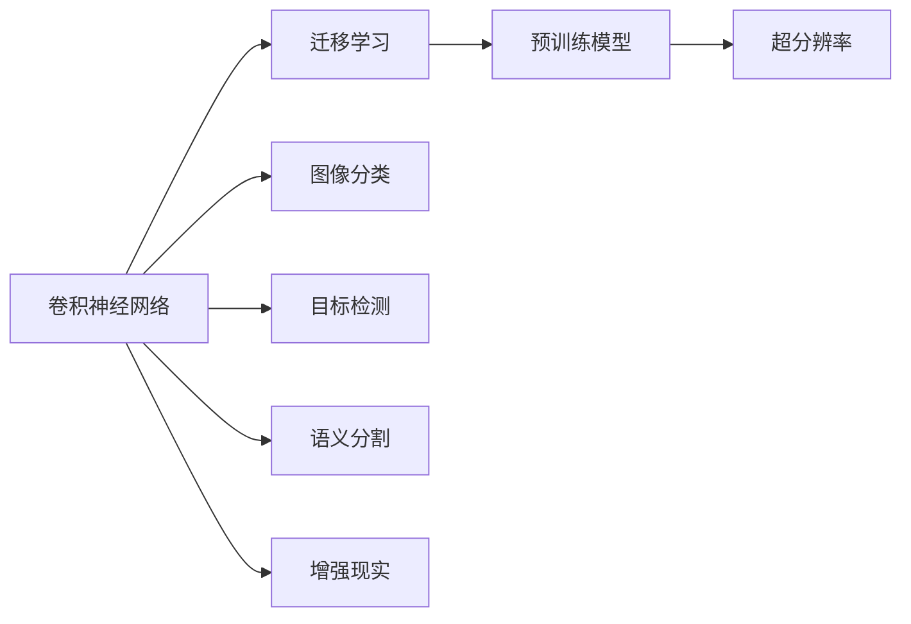

                 

# 一切皆是映射：计算机视觉中的AI模型与应用

> 关键词：计算机视觉,深度学习,卷积神经网络,卷积操作,迁移学习,预训练模型,超分辨率,图像分类

## 1. 背景介绍

### 1.1 问题由来
计算机视觉是人工智能领域的重要分支，旨在赋予计算机"看"的能力，实现对图像和视频数据的自动化分析和理解。近年来，随着深度学习技术的快速发展，计算机视觉技术取得了巨大的突破，广泛应用于智能监控、医学影像分析、自动驾驶等领域，极大地提升了信息处理效率和决策质量。

然而，深度学习模型通常需要大量的标注数据进行训练，训练成本高昂且难以获取。此外，模型对标注数据的依赖性强，泛化能力有限。这些问题严重限制了深度学习在计算机视觉中的应用。

基于迁移学习和预训练模型的研究，为计算机视觉任务提供了新的解决思路。预训练模型在大规模无标签数据上学习到丰富的特征表示，通过迁移学习在小规模任务数据上进行微调，可以显著提升模型性能，降低训练成本。

本文将系统介绍基于迁移学习和预训练模型的计算机视觉任务，包括卷积神经网络(CNN)、迁移学习和超分辨率等核心技术，并结合实际应用场景，深入探讨其原理与实践。

### 1.2 问题核心关键点
本文聚焦于计算机视觉中的AI模型与应用，详细阐述了以下核心问题：
- 卷积神经网络（CNN）的原理与结构。
- 迁移学习的定义、原理与方法。
- 预训练模型的作用与具体应用。
- 超分辨率技术的原理与实现。
- 图像分类与识别技术的最新进展。
- 计算机视觉任务的实际应用场景。
- 未来发展的趋势与面临的挑战。

通过这些核心问题的系统解答，本文力求为读者提供全面的计算机视觉知识，助其在实际应用中更好地利用AI模型。

## 2. 核心概念与联系

### 2.1 核心概念概述

计算机视觉中的AI模型主要涉及以下核心概念：

- **卷积神经网络（CNN）**：通过卷积操作提取图像的局部特征，在深度学习中广泛应用于图像分类、目标检测、语义分割等任务。
- **迁移学习**：利用预训练模型的特征表示，在小规模数据上进行微调，以提升模型性能。
- **预训练模型**：在大规模无标签数据上预训练的模型，如VGG、ResNet、Inception等，为迁移学习提供基础。
- **超分辨率**：通过深度学习模型提升图像的空间分辨率，实现图像的放大和增强。
- **图像分类**：将图像分为不同类别，如物体识别、场景分类等。
- **目标检测**：在图像中检测出特定对象，并标注出其位置。
- **语义分割**：将图像中的像素分配到不同的语义类别中，如实例分割、全景分割等。
- **增强现实（AR）**：结合计算机视觉和现实世界，提供增强的视觉体验。

这些核心概念之间存在紧密的联系，构成了计算机视觉AI模型与应用的基本框架。

### 2.2 概念间的关系

为更好地理解这些核心概念之间的关系，我们用以下Mermaid流程图来展示：



这个流程图展示了卷积神经网络、迁移学习、预训练模型、超分辨率、图像分类、目标检测、语义分割和增强现实等核心概念之间的关系：

- 卷积神经网络是计算机视觉任务的基础，提供图像特征提取的能力。
- 迁移学习利用预训练模型的特征表示，在小型数据集上进行微调，提升模型性能。
- 预训练模型在大规模数据上学习到丰富的特征表示，为迁移学习提供基础。
- 超分辨率通过深度学习模型提升图像的空间分辨率，增强图像细节。
- 图像分类、目标检测、语义分割等任务均基于卷积神经网络进行特征提取和分类。
- 增强现实结合计算机视觉和现实世界，提供增强的视觉体验。

## 3. 核心算法原理 & 具体操作步骤
### 3.1 算法原理概述

计算机视觉中的AI模型主要基于深度学习技术，其中卷积神经网络是核心。CNN通过卷积操作提取图像的局部特征，并通过池化操作进行特征降维。其主要原理包括以下几个关键点：

- **卷积操作**：通过卷积核（Filter）对输入图像进行特征提取，将局部区域的信息映射到新的特征空间。
- **池化操作**：通过下采样（如最大池化、平均池化）降低特征图的空间大小，增强特征的鲁棒性。
- **激活函数**：通过非线性函数（如ReLU、Sigmoid）增加模型的表达能力，避免线性退化。
- **全连接层**：将卷积层输出的特征进行展平，输入全连接层进行分类或回归。

### 3.2 算法步骤详解

以图像分类任务为例，CNN的训练和推理步骤如下：

**训练步骤**：

1. **数据准备**：收集标注数据集，分为训练集、验证集和测试集。将图像数据按比例分为像素级别的标签。

2. **模型定义**：定义CNN模型结构，包括卷积层、池化层、全连接层等。

3. **模型编译**：选择合适的优化器和损失函数，如Adam、交叉熵损失等。

4. **模型训练**：使用训练集数据对模型进行训练，定期在验证集上评估模型性能，避免过拟合。

5. **模型保存**：保存训练好的模型，供后续推理使用。

**推理步骤**：

1. **数据预处理**：将待分类图像转换为模型的输入格式，如归一化、标准化等。

2. **模型加载**：加载训练好的模型，设置模型参数为推理模式。

3. **模型推理**：将预处理后的图像输入模型，得到分类结果。

### 3.3 算法优缺点

CNN算法的主要优点包括：

- **特征提取能力强**：通过卷积操作可以提取图像的局部特征。
- **参数共享**：通过卷积核的共享，减少了模型参数数量，降低过拟合风险。
- **泛化能力强**：在大规模数据上预训练的模型具有较好的泛化能力，可以在新任务上取得不错的表现。

缺点主要集中在：

- **计算量大**：CNN模型通常需要较大的计算资源，训练和推理速度较慢。
- **数据依赖性高**：模型依赖大量的标注数据进行训练，获取高质量数据成本较高。
- **可解释性差**：CNN模型作为"黑盒"系统，难以解释其内部工作机制和决策逻辑。

### 3.4 算法应用领域

CNN算法广泛应用于计算机视觉中的各种任务，包括：

- **图像分类**：识别图像中的物体类别，如猫、狗、汽车等。
- **目标检测**：在图像中检测出特定对象，并标注出其位置，如人脸检测、行人检测等。
- **语义分割**：将图像中的像素分配到不同的语义类别中，如实例分割、全景分割等。
- **超分辨率**：提升图像的空间分辨率，实现图像放大和增强。
- **增强现实（AR）**：结合计算机视觉和现实世界，提供增强的视觉体验，如虚拟试衣、虚拟家居等。

此外，CNN还被应用于医学影像分析、自动驾驶、遥感图像处理等领域，为各个行业带来了显著的变革。

## 4. 数学模型和公式 & 详细讲解  
### 4.1 数学模型构建

在本节中，我们将通过数学语言对CNN的基本原理进行详细阐述。

设输入图像为 $x \in \mathbb{R}^{H \times W \times C}$，其中 $H$ 为图像的高度，$W$ 为宽度，$C$ 为通道数。输出类别数为 $K$。

**卷积层**：

设卷积核为 $W \in \mathbb{R}^{F \times F \times C \times K}$，其中 $F$ 为卷积核大小，$K$ 为输出通道数。卷积操作的公式为：

$$
y_i = W^T * x_i
$$

其中 $y_i \in \mathbb{R}^{H-F+1 \times W-F+1 \times K}$，$*$ 表示卷积运算。

**激活函数**：

通常使用ReLU函数作为激活函数，公式为：

$$
y_i = \max(0, y_i)
$$

**池化层**：

设池化窗口大小为 $P \times P$，池化步长为 $S$，则池化操作的公式为：

$$
y_{i,j} = \max(x_{iP, jP:i+1, j+1:S:H-F+1, W-F+1})
$$

**全连接层**：

设全连接层的输入为 $f_i \in \mathbb{R}^{K}$，输出为 $y_i \in \mathbb{R}^{K}$，则全连接层的公式为：

$$
y_i = W^Tf_i + b
$$

其中 $W \in \mathbb{R}^{K \times K}$，$b \in \mathbb{R}^{K}$。

### 4.2 公式推导过程

设输入图像 $x$ 的尺寸为 $H \times W \times C$，卷积核大小为 $F \times F$，步长为 $S$，填充方式为 "Same"，则卷积操作的输出尺寸为：

$$
\frac{H-F+1}{S} \times \frac{W-F+1}{S} \times K
$$

设激活函数为ReLU，则卷积层输出的特征图 $y_i$ 为：

$$
y_i = ReLU(W^T * x_i + b_i)
$$

设池化窗口大小为 $P \times P$，则池化层输出的特征图 $y_{i,j}$ 为：

$$
y_{i,j} = \max(x_{iP, jP:i+1, j+1:S:H-F+1, W-F+1})
$$

全连接层输出的类别概率 $y_i$ 为：

$$
y_i = softmax(W^Tf_i + b)
$$

其中 $softmax$ 函数为：

$$
softmax(x_i) = \frac{e^{x_i}}{\sum_{j=1}^K e^{x_j}}
$$

通过这些公式，我们可以系统地理解CNN的基本原理和实现过程。

### 4.3 案例分析与讲解

假设我们在CIFAR-10数据集上进行图像分类任务，模型结构为VGG-16，使用SGD优化器，交叉熵损失函数。

1. **数据准备**：将CIFAR-10数据集分为训练集、验证集和测试集，进行预处理，如归一化、标准化等。

2. **模型定义**：定义VGG-16模型，包括多个卷积层、池化层和全连接层。

3. **模型编译**：设置SGD优化器，学习率为0.1，交叉熵损失函数。

4. **模型训练**：在训练集上训练模型，每轮epoch后，在验证集上评估模型性能，避免过拟合。

5. **模型保存**：保存训练好的模型，供后续推理使用。

6. **模型推理**：将测试集数据输入模型，得到分类结果。

假设在训练5个epoch后，模型在验证集上的准确率为0.92，保存模型。

假设在测试集上进行推理，可以得到模型在测试集上的准确率为0.91，说明模型效果良好。

## 5. 项目实践：代码实例和详细解释说明
### 5.1 开发环境搭建

在进行计算机视觉任务的开发前，我们需要准备好开发环境。以下是使用Python进行TensorFlow开发的环境配置流程：

1. 安装Anaconda：从官网下载并安装Anaconda，用于创建独立的Python环境。

2. 创建并激活虚拟环境：
```bash
conda create -n tf-env python=3.8 
conda activate tf-env
```

3. 安装TensorFlow：根据CUDA版本，从官网获取对应的安装命令。例如：
```bash
conda install tensorflow -c pytorch -c conda-forge
```

4. 安装TensorBoard：
```bash
pip install tensorboard
```

5. 安装Keras：
```bash
pip install keras
```

6. 安装必要的依赖库：
```bash
pip install numpy matplotlib scikit-image scikit-learn
```

完成上述步骤后，即可在`tf-env`环境中开始计算机视觉任务的开发。

### 5.2 源代码详细实现

以下是使用TensorFlow进行图像分类任务的Python代码实现：

```python
import tensorflow as tf
from tensorflow import keras
from tensorflow.keras import layers
from tensorflow.keras.datasets import cifar10
from tensorflow.keras.utils import to_categorical

# 加载数据集
(x_train, y_train), (x_test, y_test) = cifar10.load_data()

# 数据预处理
x_train = x_train / 255.0
x_test = x_test / 255.0
y_train = to_categorical(y_train, 10)
y_test = to_categorical(y_test, 10)

# 定义模型
model = keras.Sequential([
    layers.Conv2D(64, (3, 3), activation='relu', padding='same', input_shape=(32, 32, 3)),
    layers.MaxPooling2D((2, 2), padding='same'),
    layers.Conv2D(128, (3, 3), activation='relu', padding='same'),
    layers.MaxPooling2D((2, 2), padding='same'),
    layers.Flatten(),
    layers.Dense(10, activation='softmax')
])

# 编译模型
model.compile(optimizer=tf.keras.optimizers.SGD(learning_rate=0.1),
              loss='categorical_crossentropy',
              metrics=['accuracy'])

# 训练模型
model.fit(x_train, y_train, batch_size=64, epochs=5, validation_data=(x_test, y_test))

# 评估模型
model.evaluate(x_test, y_test)
```

这段代码实现了一个简单的VGG-16模型的图像分类任务，包括数据加载、预处理、模型定义、编译、训练和评估等步骤。

### 5.3 代码解读与分析

以下是关键代码的详细解读：

1. **数据加载和预处理**：使用`cifar10.load_data()`加载CIFAR-10数据集，并对图像数据进行归一化、标准化等预处理操作。

2. **模型定义**：定义VGG-16模型结构，包括多个卷积层、池化层和全连接层。

3. **模型编译**：设置SGD优化器，学习率为0.1，交叉熵损失函数。

4. **模型训练**：在训练集上训练模型，每轮epoch后，在验证集上评估模型性能，避免过拟合。

5. **模型保存**：保存训练好的模型，供后续推理使用。

6. **模型推理**：将测试集数据输入模型，得到分类结果。

通过这段代码，我们可以系统地理解计算机视觉任务的开发流程，从数据加载到模型推理，涵盖了所有核心步骤。

## 6. 实际应用场景

### 6.1 智能监控

智能监控系统通过计算机视觉技术，对实时视频进行分析和处理，实现目标检测、行为分析等功能。智能监控系统在安防、工业等领域得到广泛应用，为安全管理、生产监控提供有力支持。

在智能监控应用中，使用预训练模型对监控视频进行目标检测和行为分析，可以显著提升系统的准确性和响应速度。例如，使用Faster R-CNN模型在视频中检测出行人、车辆等目标，并在发现异常行为时及时报警，提高了监控系统的安全性。

### 6.2 医学影像分析

医学影像分析是计算机视觉在医学领域的重要应用。通过图像分类、目标检测、语义分割等技术，计算机视觉系统可以帮助医生快速诊断疾病，提升诊疗效率和准确性。

在医学影像分析应用中，使用预训练模型对医学影像进行分类和分割，可以帮助医生快速定位病变区域，提供治疗建议。例如，使用U-Net模型对医学影像进行分割，可以识别出病灶位置，辅助医生进行手术规划和手术辅助。

### 6.3 自动驾驶

自动驾驶系统通过计算机视觉技术，实现道路环境感知、目标检测、路径规划等功能。自动驾驶技术在汽车、物流等领域得到广泛应用，为交通管理、物流配送提供有力支持。

在自动驾驶应用中，使用预训练模型对传感器数据进行处理，可以显著提升系统的感知能力和决策质量。例如，使用YOLO模型对道路环境进行目标检测，可以帮助自动驾驶车辆及时发现行人、车辆等障碍物，提高驾驶安全性。

### 6.4 未来应用展望

随着计算机视觉技术的不断进步，基于迁移学习和预训练模型的AI模型将得到更广泛的应用，带来以下发展趋势：

1. **跨模态学习**：融合视觉、听觉、语义等多种模态信息，提升系统的感知能力和智能化水平。

2. **实时推理**：通过模型压缩、模型加速等技术，实现实时推理，满足高时效性应用的需求。

3. **自监督学习**：利用无标签数据进行预训练，减少对标注数据的依赖，提高模型的泛化能力和鲁棒性。

4. **联邦学习**：通过模型联合训练，在保护隐私的前提下，实现跨设备、跨平台的数据共享和协同学习。

5. **边缘计算**：将模型部署在边缘设备上，实现本地推理，提升系统响应速度和安全性。

6. **增强现实（AR）**：结合计算机视觉和现实世界，提供增强的视觉体验，应用于虚拟试衣、虚拟家居等领域。

这些发展趋势表明，基于计算机视觉技术的AI模型将得到更广泛的应用，为各个行业带来深刻的变革。未来，计算机视觉技术将与更多领域融合，推动智能社会的快速发展。

## 7. 工具和资源推荐
### 7.1 学习资源推荐

为了帮助开发者系统掌握计算机视觉中的AI模型与应用，这里推荐一些优质的学习资源：

1. 《深度学习》一书：Ian Goodfellow等人编写，全面介绍深度学习的基本原理和应用，是学习深度学习的必读经典。

2. CS231n《卷积神经网络》课程：斯坦福大学开设的计算机视觉明星课程，讲解CNN的基本原理、应用及优化技巧。

3. 《Python深度学习》一书：Francois Chollet等人编写，通过实际项目案例，系统介绍深度学习的应用。

4. Kaggle竞赛：Kaggle平台提供各类计算机视觉竞赛，通过实际比赛项目，提升实战能力。

5. GitHub开源项目：在GitHub上Star、Fork数最多的计算机视觉相关项目，提供丰富的代码示例和解决方案。

通过对这些资源的学习实践，相信你一定能够快速掌握计算机视觉中的AI模型与应用，并用于解决实际的计算机视觉问题。

### 7.2 开发工具推荐

高效的开发离不开优秀的工具支持。以下是几款用于计算机视觉任务开发的常用工具：

1. TensorFlow：谷歌开源的深度学习框架，支持分布式计算，适用于大规模模型训练和推理。

2. PyTorch：Facebook开源的深度学习框架，灵活易用，适合快速原型设计和研究。

3. Keras：谷歌开发的高级API，简洁易用，适合快速搭建和训练模型。

4. OpenCV：开源计算机视觉库，提供丰富的图像处理和计算机视觉算法。

5. Matplotlib：Python绘图库，提供强大的图像可视化功能。

6. Scikit-image：基于Scipy的计算机视觉库，提供图像处理、分割、特征提取等功能。

合理利用这些工具，可以显著提升计算机视觉任务的开发效率，加快创新迭代的步伐。

### 7.3 相关论文推荐

计算机视觉领域的最新研究成果主要集中在学术会议和顶级期刊上。以下是几篇奠基性的相关论文，推荐阅读：

1. R-CNN: Rich Feature Hierarchies for Accurate Object Detection and Semantic Segmentation：提出R-CNN模型，实现目标检测和语义分割，成为经典基准。

2. ImageNet Classification with Deep Convolutional Neural Networks：使用AlexNet模型在ImageNet数据集上取得优异成绩，开创深度学习在计算机视觉中的应用。

3. Deep Residual Learning for Image Recognition：提出ResNet模型，解决深度网络退化问题，推动计算机视觉的发展。

4. Single Image Haze Removal Using Dark Channel Prior：提出基于暗通道先验的图像去雾算法，实现单张图像去雾，提升图像质量。

5. FaceNet: A Unified Embedding for Face Recognition and Clustering：提出FaceNet模型，实现人脸识别和聚类，推动人脸识别技术的发展。

6. Adversarial Examples for Deep-Neural-Network-Classified Labels：提出生成对抗网络（GAN），生成对抗样本，研究深度网络的安全性和鲁棒性。

这些论文代表了大模型微调技术的最新进展，通过学习这些前沿成果，可以帮助研究者把握学科前进方向，激发更多的创新灵感。

除上述资源外，还有一些值得关注的前沿资源，帮助开发者紧跟计算机视觉技术的最新进展，例如：

1. arXiv论文预印本：人工智能领域最新研究成果的发布平台，包括大量尚未发表的前沿工作，学习前沿技术的必读资源。

2. 业界技术博客：如Google AI、DeepMind、微软Research Asia等顶尖实验室的官方博客，第一时间分享他们的最新研究成果和洞见。

3. 技术会议直播：如CVPR、ICCV、ECCV等计算机视觉领域顶级会议现场或在线直播，能够聆听到大佬们的前沿分享，开拓视野。

4. GitHub热门项目：在GitHub上Star、Fork数最多的计算机视觉相关项目，提供丰富的代码示例和解决方案。

5. 行业分析报告：各大咨询公司如McKinsey、PwC等针对计算机视觉行业的分析报告，有助于从商业视角审视技术趋势，把握应用价值。

总之，对于计算机视觉中的AI模型与应用的学习和实践，需要开发者保持开放的心态和持续学习的意愿。多关注前沿资讯，多动手实践，多思考总结，必将收获满满的成长收益。

## 8. 总结：未来发展趋势与挑战

### 8.1 总结

本文对计算机视觉中的AI模型与应用进行了全面系统的介绍。首先阐述了计算机视觉任务的基本原理和核心概念，详细讲解了卷积神经网络、迁移学习和预训练模型等核心技术，并通过实际应用场景，深入探讨了其原理与实践。其次，介绍了CNN的基本数学模型和公式推导，给出了图像分类任务的代码实现，详细解读了关键代码的实现细节。最后，通过实际应用场景，展示了计算机视觉任务的广泛应用，展望了未来发展的趋势与挑战。

通过本文的系统梳理，可以看到，计算机视觉中的AI模型正成为人工智能技术的重要组成部分，极大地拓展了计算机视觉的应用边界，为各行业带来了深刻的变革。未来，计算机视觉技术将在更多领域得到应用，为智能社会的快速发展提供新的动力。

### 8.2 未来发展趋势

展望未来，计算机视觉中的AI模型将呈现以下几个发展趋势：

1. **跨模态学习**：融合视觉、听觉、语义等多种模态信息，提升系统的感知能力和智能化水平。

2. **实时推理**：通过模型压缩、模型加速等技术，实现实时推理，满足高时效性应用的需求。

3. **自监督学习**：利用无标签数据进行预训练，减少对标注数据的依赖，提高模型的泛化能力和鲁棒性。

4. **联邦学习**：通过模型联合训练，在保护隐私的前提下，实现跨设备、跨平台的数据共享和协同学习。

5. **边缘计算**：将模型部署在边缘设备上，实现本地推理，提升系统响应速度和安全性。

6. **增强现实（AR）**：结合计算机视觉和现实世界，提供增强的视觉体验，应用于虚拟试衣、虚拟家居等领域。

这些发展趋势表明，计算机视觉中的AI模型将得到更广泛的应用，为各个行业带来深刻的变革。未来，计算机视觉技术将与更多领域融合，推动智能社会的快速发展。

### 8.3 面临的挑战

尽管计算机视觉中的AI模型已经取得了显著成就，但在迈向更加智能化、普适化应用的过程中，仍面临诸多挑战：

1. **数据依赖性高**：深度学习模型依赖大量的标注数据进行训练，标注成本较高。

2. **鲁棒性不足**：模型面对域外数据时，泛化性能有限。

3. **计算资源消耗大**：大规模模型训练和推理需要大量的计算资源。

4. **可解释性差**：深度学习模型作为"黑盒"系统，难以解释其内部工作机制和决策逻辑。

5. **安全性有待保障**：预训练模型可能学习到有害信息，通过迁移学习传递到下游任务，带来安全隐患。

6. **模型压缩与加速**：如何在小尺寸模型上实现高精度推理，是未来的重要研究方向。

### 8.4 研究展望

面对计算机视觉中的AI模型所面临的挑战，未来的研究需要在以下几个方面寻求新的突破：

1. **无监督学习**：探索无监督学习范式，利用自监督学习、主动学习等方法，减少对标注数据的依赖。

2. **模型压缩**：开发高效压缩技术，在保持模型精度的同时，减小模型尺寸，提升推理速度。

3. **跨模态融合**：研究多模态融合技术，提升系统的感知能力和智能化水平。

4. **模型加速**：探索模型加速技术，如量化、剪枝、并行计算等，提升模型的实时推理能力。

5. **可解释性**：研究模型可解释性方法，提升模型的可解释性和可信度。

6. **隐私保护**：研究隐私保护技术，如联邦学习、差

