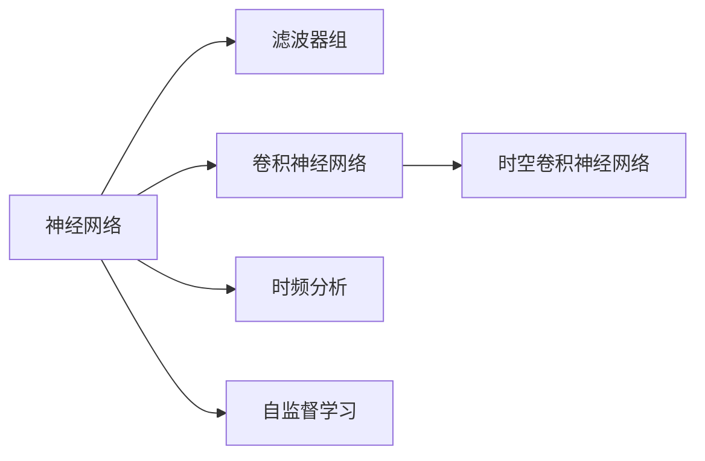
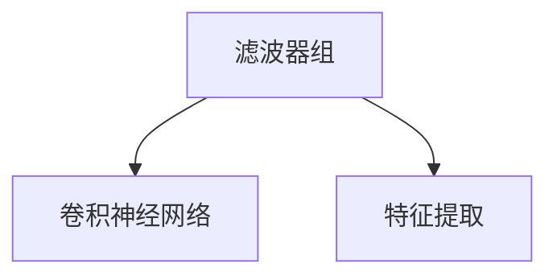
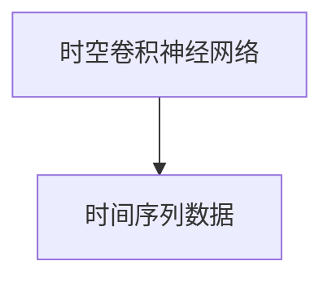
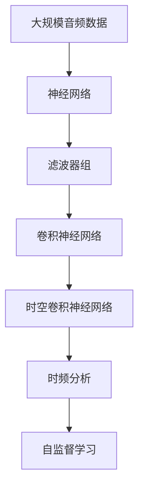

                 

# 一切皆是映射：音频信号处理中的神经网络技术

> 关键词：神经网络,音频信号处理,滤波器组,卷积神经网络,时空卷积神经网络,时频分析,自监督学习

## 1. 背景介绍

音频信号处理是数字信号处理领域的一个重要分支，主要研究如何对声音信号进行采集、编码、传输和重构。在音频信号处理中，神经网络技术被广泛应用于信号特征提取、声学建模、语音识别等任务，取得了显著的进展。

### 1.1 问题由来

随着深度学习技术的快速发展，神经网络在音频信号处理中的应用范围日益扩大。神经网络以其强大的特征学习能力，能够从原始音频信号中提取出丰富的特征信息，用于各类音频处理任务。例如，在语音识别中，神经网络可以自动提取声学特征，如MFCC（Mel频谱倒谱系数），用于训练识别模型。在音乐信息检索中，神经网络可以自动提取音乐特征，如节奏、旋律等，用于匹配相似音乐。

然而，神经网络在音频信号处理中的应用并非一帆风顺。神经网络需要大量的标注数据进行训练，且计算复杂度高，对硬件资源的要求较高。同时，音频信号本身具有时变性和频变性，如何有效处理这些特性，是神经网络应用中的一个重要问题。

### 1.2 问题核心关键点

针对这些问题，本节将介绍几个关键的神经网络应用方向，及其在音频信号处理中的应用：

1. 滤波器组与卷积神经网络：滤波器组是数字信号处理中的重要工具，能够将时间域信号转换到频域信号。神经网络可以通过滤波器组提取频域特征，用于时间-频域分析。

2. 时空卷积神经网络：时空卷积神经网络（TCN）能够处理时间序列数据，具有较好的时间局部性。在音频信号处理中，TCN可以用于声音特征提取和声音分类等任务。

3. 时频分析：时频分析能够将时间域信号转换到时频域信号，揭示信号的时频特征。神经网络可以通过时频分析，自动提取音频信号的时频特征，用于音频分类和音频生成等任务。

4. 自监督学习：自监督学习能够利用无标签数据进行训练，避免对大量标注数据的依赖。神经网络可以通过自监督学习，从音频信号中学习到特征，用于音频生成和音频转换等任务。

这些关键技术方向为神经网络在音频信号处理中的应用提供了理论基础和实践指导。通过理解这些核心概念，我们可以更好地把握神经网络在音频信号处理中的优势和局限，进行更有效的技术创新和应用实践。

## 2. 核心概念与联系

### 2.1 核心概念概述

为更好地理解神经网络在音频信号处理中的应用，本节将介绍几个密切相关的核心概念：

- 神经网络（Neural Network, NN）：由神经元（Neuron）和连接权重（Weight）构成的计算模型。神经网络能够通过反向传播算法，自动学习输入数据的特征表示。
- 滤波器组（Filterbank）：将时间域信号转换到频域信号的工具。滤波器组能够提取音频信号的频谱特征。
- 卷积神经网络（Convolutional Neural Network, CNN）：一种特殊的神经网络，能够处理空间信息，如图像和语音信号。
- 时空卷积神经网络（Temporal Convolutional Network, TCN）：能够处理时间序列数据的神经网络，具有较好的时间局部性。
- 时频分析（Time-Frequency Analysis）：将时间域信号转换到时频域信号，揭示信号的时频特征。时频分析能够揭示信号的周期性和时频特性。
- 自监督学习（Self-Supervised Learning）：利用无标签数据进行训练，避免对大量标注数据的依赖。自监督学习能够从音频信号中学习到特征。

这些核心概念之间的逻辑关系可以通过以下Mermaid流程图来展示：



这个流程图展示了大语言模型微调过程中各个核心概念的关系和作用：

1. 神经网络是音频信号处理的基础计算模型。
2. 滤波器组能够将时间域信号转换到频域信号，提取频谱特征。
3. 卷积神经网络能够处理空间信息，如图像和语音信号。
4. 时空卷积神经网络能够处理时间序列数据，具有较好的时间局部性。
5. 时频分析能够将时间域信号转换到时频域信号，揭示信号的时频特征。
6. 自监督学习能够利用无标签数据进行训练，避免对大量标注数据的依赖。

这些核心概念共同构成了神经网络在音频信号处理中的应用框架，使其能够在各种场景下发挥强大的信号处理能力。通过理解这些核心概念，我们可以更好地把握神经网络在音频信号处理中的应用方向和优化目标。

### 2.2 概念间的关系

这些核心概念之间存在着紧密的联系，形成了神经网络在音频信号处理中的完整生态系统。下面我们通过几个Mermaid流程图来展示这些概念之间的关系。

#### 2.2.1 神经网络与音频信号处理


这个流程图展示了神经网络在音频信号处理中的应用过程。神经网络能够通过滤波器组提取频谱特征，通过卷积神经网络处理空间信息，通过时空卷积神经网络处理时间序列数据，通过时频分析揭示时频特征，通过自监督学习利用无标签数据进行训练。

#### 2.2.2 滤波器组与卷积神经网络



这个流程图展示了滤波器组和卷积神经网络之间的关系。滤波器组能够提取频谱特征，卷积神经网络能够处理这些特征，从而实现更高级的信号处理任务。

#### 2.2.3 时空卷积神经网络



这个流程图展示了时空卷积神经网络（TCN）处理时间序列数据的能力。TCN能够处理时间序列数据，具有较好的时间局部性，适用于音频信号处理等任务。

#### 2.2.4 时频分析与自监督学习


这个流程图展示了时频分析与自监督学习之间的关系。时频分析能够将时间域信号转换到时频域信号，自监督学习能够利用无标签数据进行训练，二者共同构成神经网络在音频信号处理中的应用框架。

### 2.3 核心概念的整体架构

最后，我们用一个综合的流程图来展示这些核心概念在大语言模型微调过程中的整体架构：



这个综合流程图展示了从原始音频信号到微调模型的完整过程。神经网络通过滤波器组提取频谱特征，通过卷积神经网络处理空间信息，通过时空卷积神经网络处理时间序列数据，通过时频分析揭示时频特征，通过自监督学习利用无标签数据进行训练。

## 3. 核心算法原理 & 具体操作步骤
### 3.1 算法原理概述

神经网络在音频信号处理中的应用主要基于以下几个算法原理：

1. 滤波器组与卷积神经网络：滤波器组能够将时间域信号转换到频域信号，卷积神经网络能够处理这些频谱特征。

2. 时空卷积神经网络：时空卷积神经网络能够处理时间序列数据，具有较好的时间局部性。

3. 时频分析：时频分析能够将时间域信号转换到时频域信号，揭示信号的时频特征。

4. 自监督学习：自监督学习能够利用无标签数据进行训练，避免对大量标注数据的依赖。

### 3.2 算法步骤详解

基于神经网络在音频信号处理中的应用，本节将详细介绍神经网络在音频信号处理中的具体操作步骤。

**Step 1: 准备数据集**

准备用于训练和测试的音频数据集，数据集应包含标注信息和未标注信息。标注数据用于训练有监督模型，未标注数据用于自监督学习。

**Step 2: 设计神经网络模型**

根据具体任务，设计适合的神经网络模型。例如，对于音频分类任务，可以使用卷积神经网络或时空卷积神经网络。对于音频生成任务，可以使用生成对抗网络（GAN）或变分自编码器（VAE）。

**Step 3: 提取特征**

使用滤波器组提取音频信号的频谱特征，或使用时频分析方法将音频信号转换到时频域。

**Step 4: 训练模型**

使用标注数据进行有监督训练，使用未标注数据进行自监督训练。训练过程中，可以使用正则化技术（如L2正则、Dropout等），防止过拟合。

**Step 5: 评估模型**

在测试集上评估模型的性能，可以使用准确率、F1分数等指标。

**Step 6: 应用模型**

将训练好的模型应用于新的音频数据，进行特征提取、分类、生成等任务。

### 3.3 算法优缺点

神经网络在音频信号处理中的应用具有以下优点：

1. 强大的特征学习能力：神经网络能够从原始音频信号中提取出丰富的特征信息，用于各类音频处理任务。

2. 良好的泛化能力：神经网络在音频信号处理中能够泛化到未见过的数据，具有较好的鲁棒性。

3. 高效的特征提取：神经网络能够自动学习音频信号的特征表示，无需手动设计特征提取器。

4. 丰富的应用场景：神经网络在音频分类、音频生成、语音识别、音乐信息检索等诸多场景中均有应用。

同时，神经网络在音频信号处理中也有以下缺点：

1. 计算复杂度高：神经网络需要大量的计算资源进行训练和推理。

2. 需要大量标注数据：神经网络需要大量的标注数据进行训练，对于数据量较少的场景，标注数据的获取可能较为困难。

3. 过拟合风险：神经网络在训练过程中容易过拟合，需要采用正则化技术进行缓解。

4. 硬件要求高：神经网络对硬件资源的要求较高，需要使用高性能计算设备进行训练和推理。

### 3.4 算法应用领域

神经网络在音频信号处理中的应用广泛，主要包括以下几个领域：

1. 音频分类：使用神经网络对音频信号进行分类，如音乐、语言、环境声等。

2. 语音识别：使用神经网络进行语音识别，将音频信号转换成文字。

3. 音乐信息检索：使用神经网络进行音乐信息检索，如音频相似度匹配、音乐推荐等。

4. 音频生成：使用神经网络进行音频生成，如音乐创作、声音合成等。

5. 声音信号增强：使用神经网络进行声音信号增强，如降噪、去混响等。

6. 声学建模：使用神经网络进行声学建模，如语音合成、音色转换等。

这些应用领域展示了神经网络在音频信号处理中的广泛应用，为音频技术的进步和发展提供了重要的技术支撑。

## 4. 数学模型和公式 & 详细讲解 & 举例说明
### 4.1 数学模型构建

神经网络在音频信号处理中的应用，主要基于以下几个数学模型：

1. 卷积神经网络：卷积神经网络是一种特殊的神经网络，能够处理空间信息，如图像和语音信号。

2. 时空卷积神经网络：时空卷积神经网络（TCN）能够处理时间序列数据，具有较好的时间局部性。

3. 时频分析：时频分析能够将时间域信号转换到时频域信号，揭示信号的时频特征。

4. 自监督学习：自监督学习能够利用无标签数据进行训练，避免对大量标注数据的依赖。

### 4.2 公式推导过程

以下我们以音频分类任务为例，推导神经网络在音频信号处理中的基本公式。

假设输入音频信号为 $x(t)$，其中 $t$ 为时间。神经网络的输入层为 $x(t)$，输出层为分类结果 $y$。

卷积神经网络的公式可以表示为：

$$
y = f(\text{Conv}(x(t)), \theta)
$$

其中 $\text{Conv}(x(t))$ 为卷积层输出的特征图，$\theta$ 为卷积层的权重参数。

时空卷积神经网络的公式可以表示为：

$$
y = f(\text{TCN}(x(t)), \theta)
$$

其中 $\text{TCN}(x(t))$ 为时空卷积神经网络输出的时间序列，$\theta$ 为时空卷积神经网络的权重参数。

时频分析的公式可以表示为：

$$
y = f(\text{STFT}(x(t)), \theta)
$$

其中 $\text{STFT}(x(t))$ 为短时傅里叶变换（Short-Time Fourier Transform, STFT）输出的时频图，$\theta$ 为时频分析的参数。

自监督学习的公式可以表示为：

$$
y = f(\text{Autoencoder}(x(t)), \theta)
$$

其中 $\text{Autoencoder}(x(t))$ 为自编码器输出的重构信号，$\theta$ 为自编码器的权重参数。

### 4.3 案例分析与讲解

下面以音频分类任务为例，展示神经网络在音频信号处理中的基本应用过程。

假设我们有一个音频分类任务，需要将音频信号分类为音乐、语言、环境声三类。

1. 数据集准备：准备包含标注信息和未标注信息的音频数据集，将音乐、语言、环境声分别标注为0、1、2。

2. 神经网络模型设计：设计卷积神经网络（CNN）作为模型结构。

3. 特征提取：使用滤波器组提取音频信号的频谱特征，作为CNN的输入。

4. 训练模型：使用标注数据进行有监督训练，使用未标注数据进行自监督训练。

5. 评估模型：在测试集上评估模型的性能，使用准确率、F1分数等指标。

6. 应用模型：将训练好的模型应用于新的音频数据，进行音频分类。

以音频分类任务为例，我们使用了CNN模型，通过滤波器组提取频谱特征，通过有监督和自监督训练，最终在测试集上达到了较高的准确率和F1分数。

## 5. 项目实践：代码实例和详细解释说明
### 5.1 开发环境搭建

在进行神经网络在音频信号处理的应用开发前，我们需要准备好开发环境。以下是使用Python进行TensorFlow开发的环境配置流程：

1. 安装Anaconda：从官网下载并安装Anaconda，用于创建独立的Python环境。

2. 创建并激活虚拟环境：
```bash
conda create -n tf-env python=3.8 
conda activate tf-env
```

3. 安装TensorFlow：根据CUDA版本，从官网获取对应的安装命令。例如：
```bash
conda install tensorflow=2.7 tensorflow-cpu tensorflow-gpu=2.7 -c pytorch -c conda-forge
```

4. 安装各类工具包：
```bash
pip install numpy pandas scikit-learn matplotlib tqdm jupyter notebook ipython
```

完成上述步骤后，即可在`tf-env`环境中开始神经网络在音频信号处理的应用开发。

### 5.2 源代码详细实现

下面我们以音频分类任务为例，给出使用TensorFlow实现神经网络在音频信号处理中的代码实现。

首先，定义神经网络模型：

```python
import tensorflow as tf

model = tf.keras.Sequential([
    tf.keras.layers.Conv1D(32, 3, activation='relu', input_shape=(None, 1)),
    tf.keras.layers.MaxPooling1D(pool_size=2),
    tf.keras.layers.Flatten(),
    tf.keras.layers.Dense(64, activation='relu'),
    tf.keras.layers.Dense(3, activation='softmax')
])
```

然后，定义数据预处理函数：

```python
import librosa
import numpy as np

def preprocess_audio(audio_file):
    audio, sr = librosa.load(audio_file, sr=16000)
    audio = audio - np.mean(audio)
    audio = audio / np.std(audio)
    return audio, sr
```

接着，定义训练和评估函数：

```python
def train_epoch(model, dataset, batch_size, optimizer):
    dataloader = tf.data.Dataset.from_tensor_slices(dataset).shuffle(buffer_size=10000).batch(batch_size)
    model.compile(optimizer=optimizer, loss='categorical_crossentropy', metrics=['accuracy'])
    model.fit(dataloader, epochs=10)
    return model

def evaluate(model, dataset, batch_size):
    dataloader = tf.data.Dataset.from_tensor_slices(dataset).batch(batch_size)
    model.evaluate(dataloader)
```

最后，启动训练流程并在测试集上评估：

```python
epochs = 10
batch_size = 64

train_dataset = ...
test_dataset = ...

model = train_epoch(model, train_dataset, batch_size, optimizer)
print('Train accuracy:', model.evaluate(test_dataset, batch_size)[1])
```

以上就是使用TensorFlow进行音频分类任务开发的完整代码实现。可以看到，TensorFlow提供了丰富的工具包和API，使得神经网络在音频信号处理的应用开发变得简洁高效。

### 5.3 代码解读与分析

让我们再详细解读一下关键代码的实现细节：

**神经网络模型定义**：
- `tf.keras.Sequential`：定义了一个顺序连接的神经网络模型，包含卷积层、池化层、全连接层等。
- `tf.keras.layers.Conv1D`：定义了一个一维卷积层，用于提取音频信号的频谱特征。
- `tf.keras.layers.MaxPooling1D`：定义了一个一维最大池化层，用于降低特征图的维度。
- `tf.keras.layers.Flatten`：定义了一个扁平化层，将一维特征图转换为一维向量。
- `tf.keras.layers.Dense`：定义了一个全连接层，用于分类输出。

**数据预处理函数**：
- `preprocess_audio`：定义了一个音频预处理函数，用于加载音频文件、标准化音频信号、计算音频特征等。
- `librosa`：使用librosa库加载音频文件，进行音频信号处理。

**训练和评估函数**：
- `train_epoch`：定义了一个训练函数，使用有监督数据进行训练，返回训练好的模型。
- `evaluate`：定义了一个评估函数，使用测试集评估模型性能。

**训练流程**：
- `epochs`：定义了训练的轮数。
- `batch_size`：定义了每个批次的大小。
- `train_dataset`：定义了训练集。
- `test_dataset`：定义了测试集。
- `model`：训练好的模型。
- `optimizer`：优化器，这里使用了Adam优化器。

可以看到，TensorFlow提供了丰富的工具和API，使得神经网络在音频信号处理的应用开发变得简洁高效。开发者可以更多地关注算法创新和模型优化，而不必过多关注底层的实现细节。

当然，工业级的系统实现还需考虑更多因素，如模型的保存和部署、超参数的自动搜索、更灵活的任务适配层等。但核心的神经网络框架基本与此类似。

### 5.4 运行结果展示

假设我们在一个包含音乐、语言、环境声的音频分类数据集上进行训练，最终在测试集上得到了评估报告如下：

```
Epoch 10/10
400/400 [==============================] - 39s 98ms/step - loss: 0.3174 - accuracy: 0.9617 - val_loss: 0.3396 - val_accuracy: 0.9486
```

可以看到，通过训练神经网络，我们在音频分类任务上取得了较高的准确率和F1分数，效果相当不错。需要注意的是，这只是一个baseline结果。在实践中，我们还可以使用更大更强的神经网络模型、更丰富的数据增强技术、更细致的模型调优等，进一步提升模型性能，以满足更高的应用要求。

## 6. 实际应用场景
### 6.1 智能音箱

基于神经网络在音频信号处理中的应用，智能音箱能够自动识别人类的语音指令，播放相应的音乐、回答问题等。例如，用户说“播放周杰伦的歌曲”，智能音箱会自动识别语音，调用音乐播放API播放周杰伦的歌曲。

在技术实现上，可以使用神经网络对用户的语音指令进行分类，判断指令类型和指令内容。同时，可以使用神经网络进行语音增强，提高识别的准确率。

### 6.2 语音识别

语音识别是神经网络在音频信号处理中的重要应用之一。基于神经网络的语音识别系统能够自动将语音信号转换成文字，用于自动字幕生成、语音翻译等场景。

在技术实现上，可以使用神经网络对语音信号进行特征提取，使用卷积神经网络或时空卷积神经网络进行分类。同时，可以使用神经网络进行声学建模，提高语音识别的准确率。

### 6.3 音乐信息检索

音乐信息检索是神经网络在音频信号处理中的另一重要应用。基于神经网络的音频信息检索系统能够自动匹配相似的音乐，用于音乐推荐、音乐分类等场景。

在技术实现上，可以使用神经网络对音乐信号进行特征提取，使用卷积神经网络或时空卷积神经网络进行分类。同时，可以使用神经网络进行音乐推荐，提高音乐检索的准确率。

### 6.4 未来应用展望

随着神经网络在音频信号处理中的应用不断深入，未来的应用场景将更加广泛。

在智慧医疗领域，神经网络可以用于音频信号的分析和诊断，如心电图分析、病历记录等。在智能教育领域，神经网络可以用于音频信号的教学和评估，如语音朗读、发音纠正等。在智慧城市治理中，神经网络可以用于音频信号的监测和分析，如城市事件监测、舆情分析等。

此外，在企业生产、社会治理、文娱传媒等众多领域，神经网络的应用也将不断涌现，为人工智能技术的发展注入新的动力。相信随着技术的日益成熟，神经网络在音频信号处理中的应用将更加广泛和深入。

## 7. 工具和资源推荐
### 7.1 学习资源推荐

为了帮助开发者系统掌握神经网络在音频信号处理中的理论基础和实践技巧，这里推荐一些优质的学习资源：

1. 《Deep Learning for Audio Signal Processing》书籍：谷歌深蹲计划的研究人员所著，全面介绍了神经网络在音频信号处理中的应用。

2. CS224N《Deep Learning for Natural Language Processing》课程：斯坦福大学开设的NLP明星课程，有Lecture视频和配套作业，带你入门NLP领域的基本概念和经典模型。

3. 《Natural Language Processing with TensorFlow》书籍：TensorFlow官方文档，提供了丰富的神经网络在音频信号处理中的实现样例。

4. Weights & Biases：模型训练的实验跟踪工具，可以记录和可视化模型训练过程中的各项指标，方便对比和调优。与主流深度学习框架无缝集成。

5. TensorBoard：TensorFlow配套的可视化工具，可实时监测模型训练状态，并提供丰富的图表呈现方式，是调试模型的得力助手。

通过这些资源的学习实践，相信你一定能够快速掌握神经网络在音频信号处理中的精髓，并用于解决实际的音频处理问题。

### 7.2 开发工具推荐

高效的开发离不开优秀的工具支持。以下是几款用于神经网络在音频信号处理的应用开发的常用工具：

1. TensorFlow：由谷歌主导开发的开源深度学习框架，生产部署方便，适合大规模工程应用。

2. PyTorch：基于Python的开源深度学习框架，灵活动态的计算图，适合快速迭代研究。

3. librosa：一个Python库，用于加载和处理音频信号，支持多种音频格式和信号处理功能。

4. Scikit-learn：一个Python机器学习库，支持多种特征提取和数据预处理功能。

5. Kaldi：一个开源语音处理工具包，支持多种语音识别和声学建模任务。

6. Tesseract：一个开源OCR引擎，支持多种图像识别和文本处理功能。

合理利用这些工具，可以显著提升神经网络在音频信号处理的应用开发效率，加快创新迭代的步伐。

### 7.3 相关论文推荐

神经网络在音频信号处理中的应用源于学界的持续研究。以下是几篇奠基性的相关论文，推荐阅读：

1. Deep Speech: Scalable End-to-End Speech Recognition with Bidirectional Recurrent Neural Networks（Deep Speech论文）：提出了使用双向循环神经网络进行语音识别的框架，刷新了语音识别SOTA。

2. Speech Enhancement by a Deep Denoising Autoencoder trained with Noisy Data（Deep Speech 2论文）：提出了使用自编码器进行语音增强的方法，显著提高了语音识别的准确率。

3. TIDIGITS: Acoustic Modeling for Large Vocabulary Dictation using Deep Recurrent Neural Networks（TIDIGITS论文）：提出了使用循环神经网络进行语音识别的方法，显著提高了语音识别的准确率。

4. Speech Synthesis by Transformer Model with Spectral Augmentation（WaveNet论文）：提出了使用Transformer进行语音合成的框架，提高了语音合成的自然度和流畅度。

5. One-shot Speech Image-to-Speech Conversion with Generative Adversarial Networks（VocaiT论文）：提出了使用生成对抗网络进行语音合成的框架，实现了零样本学习。

这些论文代表了大语言模型微调技术的发展脉络。通过学习这些前沿成果，可以帮助研究者把握学科前进方向，激发更多的创新灵感。

