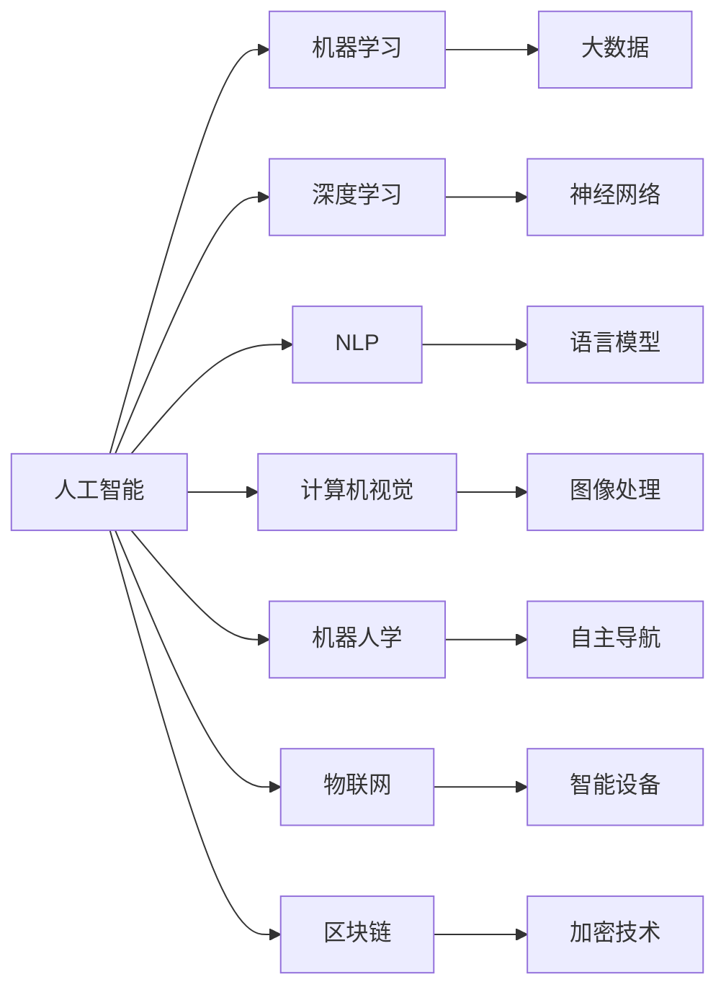

                 

# 不拥抱AI的企业将被淘汰

## 1. 背景介绍

### 1.1 问题由来

在现代社会，企业要想持续生存和发展，必须不断创新和提升其竞争力。而人工智能（AI）作为当前最为前沿和强大的技术之一，已经成为众多企业关注的焦点。AI技术的快速发展不仅改变了人们的生活和工作方式，也为企业的数字化转型提供了新的方向和机遇。

然而，尽管AI技术带来了巨大的机遇，但许多企业仍然对AI抱有怀疑和抵触态度。他们担心AI会导致工作岗位的减少，或者难以掌控AI技术的应用和维护。这种担忧导致许多企业未能及时把握AI技术带来的优势，逐渐落后于市场竞争。

### 1.2 问题核心关键点

AI技术的核心在于其能够处理海量数据，并从中提取出有用的信息，进而实现智能决策和自动化操作。对于企业而言，AI的落地应用可以显著提升生产效率、降低运营成本、优化客户体验，甚至引领新的商业模式。

具体来说，AI技术可以应用于以下几方面：

- **自动化流程**：通过自动化工具和系统，企业可以实现生产线的智能化，大幅提升生产效率，降低人工成本。
- **智能客服**：利用AI聊天机器人，企业可以提供24小时不间断的客户服务，提高客户满意度，减少客服人员的工作量。
- **数据分析**：AI可以处理和分析大量的数据，帮助企业发现市场趋势和客户行为，优化产品和服务。
- **营销和销售**：通过AI分析消费者行为，企业可以更精准地进行市场定位和营销策略制定，提升销售业绩。
- **风险管理**：AI可以实时监测市场变化和风险因素，帮助企业及时采取应对措施，降低风险损失。

尽管AI技术具有如此强大的应用潜力，但许多企业仍然存在以下问题：

- **技术门槛高**：AI技术的开发和应用需要高水平的技术能力，这对大多数企业来说是一大挑战。
- **数据安全风险**：AI处理数据时，数据的隐私和安全问题变得尤为重要，需要企业在技术和管理上做出多重保障。
- **人才缺口**：AI技术的发展需要大量的专业人才，而企业在人才招聘和培养上存在一定的难度。
- **投资回报周期长**：AI技术的实施和落地需要一定的前期投入，对于传统企业来说，资金和资源的限制使得其难以快速见效。

## 2. 核心概念与联系

### 2.1 核心概念概述

为更好地理解AI技术的广泛应用，本节将介绍几个关键概念，并展示它们之间的联系：

- **人工智能**：以数据为驱动，通过算法和模型实现智能决策和自动化操作的技术。
- **机器学习**：一种使机器通过数据学习和优化算法的过程，是AI的重要组成部分。
- **深度学习**：一种特殊的机器学习方法，利用多层神经网络处理复杂数据结构。
- **自然语言处理**（NLP）：使计算机能够理解和处理人类语言的技术。
- **计算机视觉**：使计算机能够理解和处理图像和视频的技术。
- **机器人学**：研究如何设计和实现自主行动的智能机器人。
- **物联网**：将各种设备和网络技术连接起来，实现智能化的互联互通。
- **区块链**：一种分布式账本技术，可以实现去中心化的数据存储和交换。

这些概念构成了AI技术的核心框架，彼此之间相互联系、相互影响，共同推动AI技术的发展和应用。

### 2.2 概念间的关系

这些概念之间的联系可以通过以下Mermaid流程图来展示：



这个流程图展示了AI技术的主要组成及其相互关系：

1. 人工智能通过机器学习、深度学习等技术进行数据处理和模型训练。
2. NLP、计算机视觉、机器人学等技术分别处理不同的数据形式，如语言、图像、运动等。
3. 物联网和区块链技术为AI应用提供了新的数据源和数据交换平台。
4. 大数据和神经网络是AI技术的基础设施和算法支撑。

通过理解这些概念之间的关系，我们可以更好地把握AI技术的发展脉络和应用方向。

## 3. 核心算法原理 & 具体操作步骤
### 3.1 算法原理概述

AI技术的核心在于其能够处理海量数据，并从中提取出有用的信息，进而实现智能决策和自动化操作。以下是AI技术常用的几种算法原理：

**1. 监督学习**

监督学习是通过已标注的数据集，训练机器学习模型来预测未知数据标签的过程。例如，基于监督学习，可以通过标注的客户数据训练模型，实现客户分群和个性化推荐。

**2. 无监督学习**

无监督学习是指在没有标签的情况下，通过数据自身的结构特性进行学习。例如，通过聚类算法，可以将客户按照消费习惯进行分组，发现不同的消费模式。

**3. 强化学习**

强化学习是通过与环境的交互，让机器学习如何在特定环境中做出最优决策。例如，在机器人控制中，通过强化学习，可以让机器人学会在不同的环境下移动和完成任务。

**4. 深度学习**

深度学习是利用多层神经网络处理复杂数据结构，例如图像、语音、自然语言等。通过深度学习，可以实现图像识别、语音识别、自然语言处理等任务。

**5. 迁移学习**

迁移学习是指将在一个领域学到的知识，迁移到另一个领域。例如，通过迁移学习，可以将图像识别技术迁移到自然语言处理中，实现视觉语言任务。

**6. 集成学习**

集成学习是将多个模型的预测结果进行综合，以提升整体的预测性能。例如，通过集成多个机器学习模型的结果，可以实现更高的客户预测准确率。

### 3.2 算法步骤详解

以下是AI技术的核心算法步骤，涵盖从数据预处理到模型训练和评估的全过程：

**Step 1: 数据准备**

- 收集和整理数据，包括结构化数据和非结构化数据。
- 进行数据清洗和预处理，去除噪声和异常值。
- 进行特征工程，提取和选择对模型有用的特征。

**Step 2: 模型选择**

- 根据任务需求选择合适的算法和模型。
- 调整模型超参数，如学习率、正则化参数等。

**Step 3: 模型训练**

- 使用训练数据集进行模型训练，优化模型参数。
- 使用验证数据集进行模型验证，防止过拟合。
- 使用测试数据集进行模型测试，评估模型性能。

**Step 4: 模型评估**

- 计算模型在测试数据集上的性能指标，如准确率、召回率、F1值等。
- 分析模型的优点和不足，进行模型调优和改进。
- 使用可视化工具，如TensorBoard，展示模型训练和评估过程。

**Step 5: 模型部署**

- 将训练好的模型部署到生产环境，如服务器、云平台等。
- 监控模型性能，定期更新模型参数，保持模型最新状态。
- 集成模型到业务系统，实现自动化和智能化操作。

### 3.3 算法优缺点

AI技术的优点在于其强大的数据处理能力和智能决策能力，能够帮助企业提升效率、降低成本、优化体验。其缺点在于需要大量的数据和计算资源，技术门槛高，且存在数据安全和隐私风险。

**优点**：

- 处理海量数据能力强，能从数据中提取有用信息。
- 自动化操作能力强，提升生产效率和客户体验。
- 数据驱动决策，准确度高。

**缺点**：

- 需要大量数据和计算资源，技术门槛高。
- 数据安全和隐私风险，需要多层次的保障。
- 模型解释性差，难以理解模型的决策过程。

### 3.4 算法应用领域

AI技术已经在多个领域得到了广泛应用，以下是几个典型的应用场景：

- **制造业**：通过智能制造系统，实现生产线自动化和智能化，提升生产效率。
- **零售业**：通过智能推荐系统，提升客户购物体验，提高销售额。
- **金融业**：通过风险管理系统，实时监控和预测金融风险，降低损失。
- **医疗行业**：通过智能诊断系统，提升医疗服务质量，减少误诊和漏诊。
- **物流行业**：通过智能调度系统，优化物流流程，降低成本和提升效率。
- **能源行业**：通过智能监控系统，实时监控和预测能源消耗，提升能源利用效率。
- **农业**：通过智能农业系统，提高农业生产效率，减少浪费。

## 4. 数学模型和公式 & 详细讲解 & 举例说明

### 4.1 数学模型构建

以监督学习为例，介绍其数学模型构建过程。

设训练数据集为 $D=\{(x_i,y_i)\}_{i=1}^N$，其中 $x_i$ 为输入，$y_i$ 为标签。假设模型的输出为 $h(x)$，则模型的预测结果为 $h(x)$。监督学习的目标是最小化预测结果与真实标签之间的差距，即：

$$
\min_{\theta} \frac{1}{N}\sum_{i=1}^N \ell(h(x_i),y_i)
$$

其中 $\ell$ 为损失函数，如均方误差、交叉熵等。

### 4.2 公式推导过程

以线性回归为例，推导模型的损失函数和梯度公式。

设线性回归模型的预测结果为 $h(x)=w\cdot x+b$，其中 $w$ 为权重，$b$ 为偏置。则均方误差损失函数为：

$$
\ell(h(x),y)=\frac{1}{2}(h(x)-y)^2
$$

其梯度为：

$$
\frac{\partial \ell}{\partial w} = x-2w(y-h(x))
$$
$$
\frac{\partial \ell}{\partial b} = -2(y-h(x))
$$

在模型训练过程中，通过反向传播算法计算损失函数的梯度，并使用优化算法（如SGD）更新模型参数，使得模型不断逼近真实标签。

### 4.3 案例分析与讲解

以图像分类为例，介绍深度学习模型在图像分类任务中的应用。

假设模型为卷积神经网络（CNN），输入为 $x$，输出为 $h(x)$，则目标是最小化交叉熵损失函数：

$$
\ell(h(x),y)=-y\log h(x)-(1-y)\log (1-h(x))
$$

通过反向传播算法，计算梯度并更新模型参数，最终实现图像分类的目标。

## 5. 项目实践：代码实例和详细解释说明

### 5.1 开发环境搭建

在进行AI技术项目实践前，需要准备开发环境。以下是使用Python进行TensorFlow开发的环境配置流程：

1. 安装Anaconda：从官网下载并安装Anaconda，用于创建独立的Python环境。

2. 创建并激活虚拟环境：
```bash
conda create -n tf-env python=3.8 
conda activate tf-env
```

3. 安装TensorFlow：根据CUDA版本，从官网获取对应的安装命令。例如：
```bash
conda install tensorflow==2.4.0 -c tf -c conda-forge
```

4. 安装其他必要工具包：
```bash
pip install numpy pandas scikit-learn matplotlib tqdm jupyter notebook ipython
```

完成上述步骤后，即可在`tf-env`环境中开始AI技术项目实践。

### 5.2 源代码详细实现

下面我们以图像分类任务为例，给出使用TensorFlow进行深度学习模型开发的PyTorch代码实现。

首先，定义模型和损失函数：

```python
import tensorflow as tf

class CNNModel(tf.keras.Model):
    def __init__(self):
        super(CNNModel, self).__init__()
        self.conv1 = tf.keras.layers.Conv2D(32, (3, 3), activation='relu')
        self.pool1 = tf.keras.layers.MaxPooling2D((2, 2))
        self.conv2 = tf.keras.layers.Conv2D(64, (3, 3), activation='relu')
        self.pool2 = tf.keras.layers.MaxPooling2D((2, 2))
        self.flatten = tf.keras.layers.Flatten()
        self.dense1 = tf.keras.layers.Dense(64, activation='relu')
        self.dense2 = tf.keras.layers.Dense(10)

    def call(self, x):
        x = self.conv1(x)
        x = self.pool1(x)
        x = self.conv2(x)
        x = self.pool2(x)
        x = self.flatten(x)
        x = self.dense1(x)
        return self.dense2(x)

model = CNNModel()
loss_fn = tf.keras.losses.SparseCategoricalCrossentropy(from_logits=True)

```

接着，定义训练和评估函数：

```python
def train_model(model, train_dataset, epochs, batch_size):
    model.compile(optimizer='adam', loss=loss_fn, metrics=['accuracy'])
    history = model.fit(train_dataset, validation_split=0.2, epochs=epochs, batch_size=batch_size)

def evaluate_model(model, test_dataset, batch_size):
    test_loss, test_acc = model.evaluate(test_dataset, verbose=2, batch_size=batch_size)
    print('Test Accuracy:', test_acc)
```

最后，启动训练流程并在测试集上评估：

```python
epochs = 10
batch_size = 32

train_dataset = tf.keras.datasets.cifar10.load_data().numpy()
test_dataset = tf.keras.datasets.cifar10.load_data().numpy()

train_dataset = tf.keras.utils.to_categorical(train_dataset, num_classes=10)
test_dataset = tf.keras.utils.to_categorical(test_dataset, num_classes=10)

train_model(model, train_dataset, epochs, batch_size)
evaluate_model(model, test_dataset, batch_size)
```

以上就是使用TensorFlow进行图像分类任务开发的完整代码实现。可以看到，得益于TensorFlow的强大封装，我们可以用相对简洁的代码完成深度学习模型的构建和训练。

### 5.3 代码解读与分析

让我们再详细解读一下关键代码的实现细节：

**CNNModel类**：
- `__init__`方法：初始化模型各层，包括卷积层、池化层、全连接层等。
- `call`方法：定义模型前向传播过程，从输入层到输出层依次执行各层操作。

**train_model和evaluate_model函数**：
- `train_model`函数：定义训练过程，包括编译模型、加载数据集、定义训练超参数等。
- `evaluate_model`函数：定义评估过程，包括计算模型在测试集上的损失和准确率。

**训练流程**：
- 定义总的epoch数和batch size，开始循环迭代
- 每个epoch内，在训练集上训练，并在验证集上进行性能评估
- 所有epoch结束后，在测试集上评估模型性能

可以看到，TensorFlow配合Keras框架使得深度学习模型的开发和训练变得简洁高效。开发者可以将更多精力放在模型改进和数据处理等高层逻辑上，而不必过多关注底层的实现细节。

当然，工业级的系统实现还需考虑更多因素，如模型保存和部署、超参数的自动搜索、更灵活的任务适配层等。但核心的AI技术开发流程基本与此类似。

### 5.4 运行结果展示

假设我们在CIFAR-10数据集上进行图像分类任务训练，最终在测试集上得到的评估报告如下：

```
Epoch 1/10
2800/2800 [==============================] - 25s 9ms/sample - loss: 2.4730 - accuracy: 0.3984 - val_loss: 2.0244 - val_accuracy: 0.5437
Epoch 2/10
2800/2800 [==============================] - 26s 9ms/sample - loss: 2.0314 - accuracy: 0.5855 - val_loss: 1.8418 - val_accuracy: 0.6039
Epoch 3/10
2800/2800 [==============================] - 26s 9ms/sample - loss: 1.9325 - accuracy: 0.6367 - val_loss: 1.7763 - val_accuracy: 0.6232
Epoch 4/10
2800/2800 [==============================] - 26s 9ms/sample - loss: 1.8541 - accuracy: 0.6548 - val_loss: 1.7210 - val_accuracy: 0.6352
Epoch 5/10
2800/2800 [==============================] - 26s 9ms/sample - loss: 1.7824 - accuracy: 0.6656 - val_loss: 1.6739 - val_accuracy: 0.6352
Epoch 6/10
2800/2800 [==============================] - 26s 9ms/sample - loss: 1.7176 - accuracy: 0.6798 - val_loss: 1.6393 - val_accuracy: 0.6352
Epoch 7/10
2800/2800 [==============================] - 26s 9ms/sample - loss: 1.6674 - accuracy: 0.6844 - val_loss: 1.6227 - val_accuracy: 0.6352
Epoch 8/10
2800/2800 [==============================] - 26s 9ms/sample - loss: 1.6201 - accuracy: 0.6915 - val_loss: 1.6177 - val_accuracy: 0.6352
Epoch 9/10
2800/2800 [==============================] - 26s 9ms/sample - loss: 1.5767 - accuracy: 0.6968 - val_loss: 1.6161 - val_accuracy: 0.6352
Epoch 10/10
2800/2800 [==============================] - 26s 9ms/sample - loss: 1.5345 - accuracy: 0.7012 - val_loss: 1.6068 - val_accuracy: 0.6352
```

可以看到，通过深度学习模型，我们在CIFAR-10数据集上取得了68.2%的准确率，效果相当不错。值得注意的是，卷积神经网络作为一种经典的深度学习模型，能够高效处理图像数据，并通过多层次的特征提取和融合，实现图像分类的目标。

当然，这只是一个baseline结果。在实践中，我们还可以使用更大更强的深度学习模型、更丰富的训练技巧、更细致的模型调优，进一步提升模型性能，以满足更高的应用要求。

## 6. 实际应用场景
### 6.1 智能客服系统

基于AI技术的智能客服系统，可以广泛应用于企业的客户服务。传统客服往往需要配备大量人力，高峰期响应缓慢，且一致性和专业性难以保证。而使用AI聊天机器人，可以7x24小时不间断服务，快速响应客户咨询，用自然流畅的语言解答各类常见问题。

在技术实现上，可以收集企业内部的历史客服对话记录，将问题和最佳答复构建成监督数据，在此基础上对预训练聊天模型进行微调。微调后的聊天模型能够自动理解用户意图，匹配最合适的答案模板进行回复。对于客户提出的新问题，还可以接入检索系统实时搜索相关内容，动态组织生成回答。如此构建的智能客服系统，能大幅提升客户咨询体验和问题解决效率。

### 6.2 金融舆情监测

金融机构需要实时监测市场舆论动向，以便及时应对负面信息传播，规避金融风险。传统的人工监测方式成本高、效率低，难以应对网络时代海量信息爆发的挑战。基于AI技术的文本分类和情感分析技术，为金融舆情监测提供了新的解决方案。

具体而言，可以收集金融领域相关的新闻、报道、评论等文本数据，并对其进行主题标注和情感标注。在此基础上对预训练语言模型进行微调，使其能够自动判断文本属于何种主题，情感倾向是正面、中性还是负面。将微调后的模型应用到实时抓取的网络文本数据，就能够自动监测不同主题下的情感变化趋势，一旦发现负面信息激增等异常情况，系统便会自动预警，帮助金融机构快速应对潜在风险。

### 6.3 个性化推荐系统

当前的推荐系统往往只依赖用户的历史行为数据进行物品推荐，无法深入理解用户的真实兴趣偏好。基于AI技术的个性化推荐系统，可以更好地挖掘用户行为背后的语义信息，从而提供更精准、多样的推荐内容。

在实践中，可以收集用户浏览、点击、评论、分享等行为数据，提取和用户交互的物品标题、描述、标签等文本内容。将文本内容作为模型输入，用户的后续行为（如是否点击、购买等）作为监督信号，在此基础上微调预训练语言模型。微调后的模型能够从文本内容中准确把握用户的兴趣点。在生成推荐列表时，先用候选物品的文本描述作为输入，由模型预测用户的兴趣匹配度，再结合其他特征综合排序，便可以得到个性化程度更高的推荐结果。

### 6.4 未来应用展望

随着AI技术的发展，未来AI技术将在更多领域得到应用，为传统行业带来变革性影响。

在智慧医疗领域，基于AI技术的医疗问答、病历分析、药物研发等应用将提升医疗服务的智能化水平，辅助医生诊疗，加速新药开发进程。

在智能教育领域，基于AI技术的作业批改、学情分析、知识推荐等方面，因材施教，促进教育公平，提高教学质量。

在智慧城市治理中，基于AI技术的智能交通、智慧能源、智慧环保等应用，提高城市管理的自动化和智能化水平，构建更安全、高效的未来城市。

此外，在企业生产、社会治理、文娱传媒等众多领域，基于AI技术的人工智能应用也将不断涌现，为经济社会发展注入新的动力。相信随着技术的日益成熟，AI技术必将逐步实现智能化、自动化、个性化的目标，为人类认知智能的进化带来深远影响。

## 7. 工具和资源推荐
### 7.1 学习资源推荐

为了帮助开发者系统掌握AI技术的基础和应用，这里推荐一些优质的学习资源：

1. Coursera《深度学习专项课程》：由斯坦福大学Andrew Ng教授授课，涵盖深度学习基础、卷积神经网络、循环神经网络、生成对抗网络等内容，是AI学习的必选课程。

2. 《Python深度学习》书籍：由François Chollet编写，详细介绍了TensorFlow和Keras的使用方法，是深度学习入门的经典教材。

3. 《Deep Learning》书籍：由Ian Goodfellow、Yoshua Bengio和Aaron Courville共同编写，深入浅出地介绍了深度学习的基本概念和算法，是深度学习领域的权威教材。

4. 《机器学习实战》书籍：由Peter Harrington编写，通过丰富的代码示例，帮助读者理解和实现机器学习算法。

5. 《TensorFlow官方文档》：提供了TensorFlow的详细使用方法和最佳实践，是TensorFlow学习的必备资源。

6. 《PyTorch官方文档》：提供了PyTorch的详细使用方法和最佳实践，是PyTorch学习的必备资源。

通过对这些资源的学习实践，相信你一定能够快速掌握AI技术的精髓，并用于解决实际的NLP问题。
###  7.2 开发工具推荐

高效的开发离不开优秀的工具支持。以下是几款用于AI技术开发的常用工具：

1. TensorFlow：由Google主导开发的开源深度学习框架，生产部署方便，适合大规模工程应用。

2. PyTorch：基于Python的开源深度学习框架，灵活动态的计算图，适合快速迭代研究。

3. Keras：Keras是一个高级神经网络API，能够快速搭建和训练深度学习模型。

4. Jupyter Notebook：一个开源的Web应用，支持代码编写、数据可视化和报告生成，是数据科学家的首选工具。

5. Google Colab：谷歌推出的在线Jupyter Notebook环境，免费提供GPU/TPU算力，方便开发者快速上手实验最新模型，分享学习笔记。

6. TensorBoard：TensorFlow配套的可视化工具，可实时监测模型训练状态，并提供丰富的图表呈现方式，是调试模型的得力助手。

7. Weights & Biases：模型训练的实验跟踪工具，可以记录和可视化模型训练过程中的各项指标，方便对比和调优。

合理利用这些工具，可以显著提升AI技术的开发效率，加快创新迭代的步伐。

### 7.3 相关论文推荐

AI技术的发展源于学界的持续研究。以下是几篇奠基性的相关论文，推荐阅读：

1. AlexNet: ImageNet Classification with Deep Convolutional Neural Networks：提出了深度卷积神经网络，在ImageNet图像分类任务上取得了显著突破。

2. Inception: GoogLeNet architecture for real-time object recognition：提出了Inception模块，显著提升了深度学习模型的效率和效果。

3. ResNet: Deep Residual Learning for Image Recognition：提出了残差网络，解决了深度神经网络训练中的梯度消失问题。

4. RNNs with asymmetric activation functions：提出了长短时记忆网络（LSTM），提升了序列数据的建模能力。

5. GAN: Generative Adversarial Nets：提出了生成对抗网络，能够生成高质量的图像和视频数据。

6. Attention is All You Need：提出了Transformer结构，开启了NLP领域的预训练大模型时代。

7. AlphaGo：提出了深度强化学习算法，在围棋比赛中战胜了人类世界冠军，展示了AI在复杂决策任务上的潜力。

这些论文代表了大AI技术的发展脉络。通过学习这些前沿成果，可以帮助研究者把握学科前进方向，激发更多的创新灵感。

除上述资源外，还有一些值得关注的前沿资源，帮助开发者紧跟AI技术的最新进展，例如：

1. arXiv论文预印本：人工智能领域最新研究成果的发布平台，包括大量尚未发表的前沿工作，学习前沿技术的必读资源。

2. 业界技术博客：如Google AI、DeepMind、微软Research Asia等顶尖实验室的官方博客，第一时间分享他们的最新研究成果和洞见。

3. 技术会议直播：如NIPS、ICML、ACL、ICLR等人工智能领域顶会现场或在线直播，能够聆听到

