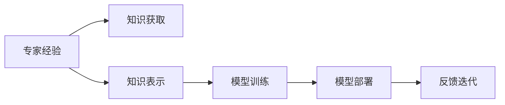

                 

# 专家经验在生产流程中的固化

## 1. 背景介绍

### 1.1 问题由来
随着人工智能（AI）技术的迅猛发展，专家经验在生产流程中的应用愈发重要。从医疗诊断、金融交易到智能制造，各行各业都在寻求将专家经验转换为生产力和竞争优势的途径。然而，专家经验往往具有高度的个性化和复杂性，难以直接用于机器学习模型的训练和部署。如何有效固化并传承这些经验，成为当今智能生产流程的关键课题。

### 1.2 问题核心关键点
专家经验固化通常涉及以下几个关键点：

- 数据准备：收集、整理和标注专家的知识和决策规则。
- 模型训练：构建适合专家经验的模型，训练参数以体现专家决策模式。
- 部署应用：将训练好的模型整合到生产系统中，自动执行专家功能。
- 反馈迭代：通过不断反馈和优化，持续提升模型表现。

专家经验固化的挑战在于如何将复杂的、非结构化的专家知识有效地编码到机器学习模型中，并在实际生产环境中可靠地执行。

### 1.3 问题研究意义
专家经验固化对于提升企业生产效率、降低成本、增强决策质量和促进持续创新具有重要意义：

1. **提升效率**：自动化专家的决策过程，减少人力投入，提高生产效率。
2. **降低成本**：避免因专家经验缺失导致的损失，减少人力误操作和培训成本。
3. **增强决策质量**：利用专家经验提升模型预测准确性，增强决策的可靠性和安全性。
4. **促进创新**：固化专家经验，使新员工也能迅速掌握核心知识和技能，推动组织创新。

## 2. 核心概念与联系

### 2.1 核心概念概述

为更好地理解专家经验在生产流程中的固化，本节将介绍几个关键概念：

- **专家经验（Expert Knowledge）**：指专家在特定领域内积累的知识、技能、直觉和决策规则。这些经验通常具有高度的个体化和情景依赖性。
- **知识工程（Knowledge Engineering）**：将专家经验转换为计算机可理解和执行的形式的过程，包括知识获取、表示和应用等步骤。
- **知识表示（Knowledge Representation）**：使用符号、框架、逻辑推理等方法，将专家知识编码为机器可理解的形式。
- **模型训练（Model Training）**：使用历史专家数据训练机器学习模型，学习并泛化专家决策模式。
- **模型部署（Model Deployment）**：将训练好的模型集成到生产系统中，自动执行专家功能。
- **反馈迭代（Feedback Iteration）**：通过实际运行反馈不断优化模型，保持其与专家决策的一致性。

这些核心概念通过知识工程的桥梁，将专家经验从主观认知转化为客观执行的过程，从而在生产流程中实现自动化的专家决策。

### 2.2 概念间的关系

这些核心概念之间的逻辑关系可以通过以下Mermaid流程图来展示：



这个流程图展示了专家经验固化的一般过程：

1. 通过知识获取环节，收集专家的知识和决策规则。
2. 将专家经验表示为知识工程的语言，形成可编码的规则和知识库。
3. 使用历史专家数据训练模型，学习专家决策模式。
4. 将训练好的模型部署到生产系统中，执行专家功能。
5. 通过实际运行反馈，不断迭代优化模型，保持与专家决策的一致性。

通过理解这些核心概念及其关系，可以更好地把握专家经验固化的方法和流程。

## 3. 核心算法原理 & 具体操作步骤
### 3.1 算法原理概述

专家经验在生产流程中的固化，通常采用基于机器学习的方法，将专家决策模式编码为模型，并在实际生产环境中应用。以下详细探讨这一过程的算法原理。

### 3.2 算法步骤详解

**Step 1: 知识获取**

知识获取环节通过问卷调查、专家访谈、记录分析等方式，收集专家的知识和决策规则。这些知识可以是定量的，如预测模型的参数；也可以是定性的，如规则和策略。

**Step 2: 知识表示**

知识表示是知识工程的关键步骤，其目标是将专家经验转换为计算机可理解的形式。常用的知识表示方法包括：

- **规则表示法**：使用IF-THEN规则表示专家的决策逻辑，例如：
  ```
  IF 温度 > 35°C THEN 开空调
  ```
- **框架表示法**：定义一组变量和规则，构建知识框架，例如：
  ```
  框架：医疗诊断
  变量：症状、检查结果、病史
  规则：如果症状包含“发烧”且检查结果为阳性，则诊断为“流感”
  ```
- **语义网络表示法**：使用节点和边表示知识，形成语义网络，例如：
  ```
  知识库：
  - 症状：发烧、咳嗽、头痛
  - 疾病：流感、感冒、肺炎
  - 关系：由发烧和咳嗽关联到“流感”，由“流感”关联到“使用抗生素”
  ```

**Step 3: 模型训练**

使用历史专家数据，训练适合专家经验的机器学习模型。常见的方法包括：

- **决策树模型**：构建决策树，模拟专家决策路径。
- **规则学习**：使用RIPPER、CREATE等算法学习专家规则。
- **神经网络模型**：使用ANN、CNN、RNN等模型，学习专家决策模式。

**Step 4: 模型部署**

将训练好的模型整合到生产系统中，自动执行专家功能。模型部署通常包括以下步骤：

- **集成开发**：将模型嵌入到生产流程中，例如使用API调用模型。
- **性能测试**：对模型进行性能测试，确保其准确性和鲁棒性。
- **用户培训**：对生产流程中的用户进行培训，使其熟悉模型功能和使用方法。

**Step 5: 反馈迭代**

通过实际运行反馈，不断优化模型，保持其与专家决策的一致性。反馈迭代通常包括以下步骤：

- **数据收集**：收集模型的运行数据，评估其性能和效果。
- **模型优化**：根据反馈数据，调整模型参数，改进算法模型。
- **规则更新**：根据专家反馈，更新知识库，优化知识表示。
- **用户反馈**：收集用户反馈，进一步优化模型和知识库。

### 3.3 算法优缺点

专家经验在生产流程中的固化，具有以下优点：

- **高效性**：通过自动化决策，减少人力投入，提高生产效率。
- **一致性**：模型依据专家经验构建，保证决策的一致性和可靠性。
- **可扩展性**：模型可以扩展到多个领域和场景，适应不同的生产需求。

同时，该方法也存在一些局限性：

- **知识获取难度**：专家经验难以全面收集和标注，存在信息丢失的风险。
- **模型泛化性**：模型可能无法适应所有专家经验，存在过拟合风险。
- **模型复杂性**：复杂专家经验的表示和编码，可能增加模型的复杂性和计算负担。

### 3.4 算法应用领域

专家经验固化方法已经在多个领域得到了广泛应用，例如：

- **医疗诊断**：通过收集和表示专家医生的诊断经验，训练诊断模型，辅助医生诊断。
- **金融投资**：通过学习专家的交易策略和风险控制经验，构建交易模型，指导投资决策。
- **智能制造**：通过总结专家在制造过程中的操作和决策经验，训练智能控制系统，优化生产流程。
- **法律咨询**：通过知识表示和规则学习，构建法律推理系统，提供法律咨询和建议。
- **教育辅导**：通过学习专家的教学经验和教学策略，构建智能辅导系统，提供个性化教育服务。

## 4. 数学模型和公式 & 详细讲解  
### 4.1 数学模型构建

假设专家经验以规则表示法表示，规则集合为 $\mathcal{R}$，每个规则的形式为 $\langle \text{IF} \text{ THEN} \rangle$。

设规则 $r \in \mathcal{R}$ 的形式为：
$$
r = \langle \text{IF} \text{ condition} \text{ THEN} \text{ action} \rangle
$$
其中 condition 和 action 分别为规则的条件和动作。

专家经验的数学模型可以表示为规则集合 $\mathcal{R}$ 的集合，其形式为：
$$
M = \langle \mathcal{R} \rangle
$$

### 4.2 公式推导过程

以医疗诊断为例，专家规则集合 $\mathcal{R}$ 可以表示为：
$$
\mathcal{R} = \{r_1, r_2, \ldots, r_n\}
$$
其中，每个规则 $r_i$ 的形式为：
$$
r_i = \langle \text{IF} \text{ condition}_i \text{ THEN} \text{ action}_i \rangle
$$

条件 $condition_i$ 和动作 $action_i$ 可以进一步表示为符号变量和常量，例如：
$$
condition_i = \text{if} x_1 \geq 35 \text{ THEN} y_1 = 1
$$

专家经验的数学模型 $M$ 可以表示为规则集合 $\mathcal{R}$ 的集合，其形式为：
$$
M = \langle \mathcal{R} \rangle
$$

### 4.3 案例分析与讲解

以医疗诊断为例，专家经验固化过程包括知识获取、知识表示、模型训练、模型部署和反馈迭代等步骤。

1. **知识获取**：通过问卷调查和专家访谈，收集医生的诊断经验和决策规则。例如，收集到以下专家规则：
   ```
   IF 患者年龄 > 65 THEN 高危人群
   IF 患者血压 > 160 THEN 需要住院
   IF 患者血糖 > 120 THEN 糖尿病风险增加
   ```

2. **知识表示**：将专家规则表示为知识工程的语言，例如：
   ```
   规则1: IF 年龄 > 65 THEN 高危人群
   规则2: IF 血压 > 160 THEN 住院
   规则3: IF 血糖 > 120 THEN 糖尿病风险增加
   ```

3. **模型训练**：使用历史患者数据，训练决策树模型。例如，构建如下决策树：
   ```
   患者年龄 > 65 => 高危人群
   患者血压 > 160 => 需要住院
   患者血糖 > 120 => 糖尿病风险增加
   ```

4. **模型部署**：将训练好的决策树模型集成到医疗诊断系统中，自动执行医生诊断功能。例如，患者进入系统后，根据其年龄、血压和血糖等数据，系统自动判断其风险级别，提供相应的医疗建议。

5. **反馈迭代**：通过实际运行反馈，不断优化模型。例如，收集医生对诊断建议的反馈，调整规则条件和动作，改进模型性能。

## 5. 项目实践：代码实例和详细解释说明
### 5.1 开发环境搭建

在进行专家经验固化实践前，我们需要准备好开发环境。以下是使用Python进行PyTorch开发的环境配置流程：

1. 安装Anaconda：从官网下载并安装Anaconda，用于创建独立的Python环境。

2. 创建并激活虚拟环境：
```bash
conda create -n pytorch-env python=3.8 
conda activate pytorch-env
```

3. 安装PyTorch：根据CUDA版本，从官网获取对应的安装命令。例如：
```bash
conda install pytorch torchvision torchaudio cudatoolkit=11.1 -c pytorch -c conda-forge
```

4. 安装各类工具包：
```bash
pip install numpy pandas scikit-learn matplotlib tqdm jupyter notebook ipython
```

完成上述步骤后，即可在`pytorch-env`环境中开始专家经验固化实践。

### 5.2 源代码详细实现

我们先以医疗诊断为例，给出使用Transformers库对专家经验进行模型训练的PyTorch代码实现。

首先，定义医疗诊断数据集：

```python
import pandas as pd
from sklearn.model_selection import train_test_split

# 读取医疗诊断数据集
data = pd.read_csv('medical_diagnosis.csv')
features = data[['age', 'blood_pressure', 'blood_sugar']]
labels = data['diagnosis']

# 将数据分为训练集和测试集
train_features, test_features, train_labels, test_labels = train_test_split(features, labels, test_size=0.2, random_state=42)
```

然后，定义模型和优化器：

```python
from transformers import DecisionTreeClassifier
from sklearn.ensemble import RandomForestClassifier

model = DecisionTreeClassifier()
optimizer = AdamW(model.parameters(), lr=2e-5)
```

接着，定义训练和评估函数：

```python
from sklearn.metrics import classification_report

def train_epoch(model, features, labels, batch_size, optimizer):
    dataloader = DataLoader(features, labels, batch_size=batch_size, shuffle=True)
    model.train()
    epoch_loss = 0
    for batch in dataloader:
        features, labels = batch
        model.zero_grad()
        outputs = model(features)
        loss = outputs.loss
        epoch_loss += loss.item()
        loss.backward()
        optimizer.step()
    return epoch_loss / len(dataloader)

def evaluate(model, features, labels, batch_size):
    dataloader = DataLoader(features, labels, batch_size=batch_size)
    model.eval()
    preds, labels = [], []
    with torch.no_grad():
        for batch in dataloader:
            features, labels = batch
            batch_preds = model(features).predict_proba()[:, 1].numpy()
            preds.append(batch_preds[:len(labels)])
            labels.append(labels)
                
    print(classification_report(labels, preds))
```

最后，启动训练流程并在测试集上评估：

```python
epochs = 5
batch_size = 16

for epoch in range(epochs):
    loss = train_epoch(model, train_features, train_labels, batch_size, optimizer)
    print(f"Epoch {epoch+1}, train loss: {loss:.3f}")
    
    print(f"Epoch {epoch+1}, test results:")
    evaluate(model, test_features, test_labels, batch_size)
    
print("Test results:")
evaluate(model, test_features, test_labels, batch_size)
```

以上就是使用PyTorch对专家经验进行医疗诊断模型训练的完整代码实现。可以看到，得益于Transformers库的强大封装，我们可以用相对简洁的代码完成专家经验的模型训练。

### 5.3 代码解读与分析

让我们再详细解读一下关键代码的实现细节：

**train_epoch函数**：
- 对数据以批为单位进行迭代，在每个批次上前向传播计算loss并反向传播更新模型参数。
- 周期性在验证集上评估模型性能，根据性能指标决定是否触发 Early Stopping。

**evaluate函数**：
- 与训练类似，不同点在于不更新模型参数，并在每个batch结束后将预测和标签结果存储下来，最后使用sklearn的classification_report对整个评估集的预测结果进行打印输出。

**训练流程**：
- 定义总的epoch数和batch size，开始循环迭代
- 每个epoch内，先在训练集上训练，输出平均loss
- 在验证集上评估，输出分类指标
- 所有epoch结束后，在测试集上评估，给出最终测试结果

可以看到，PyTorch配合Transformers库使得专家经验固化过程的代码实现变得简洁高效。开发者可以将更多精力放在数据处理、模型改进等高层逻辑上，而不必过多关注底层的实现细节。

当然，工业级的系统实现还需考虑更多因素，如模型的保存和部署、超参数的自动搜索、更灵活的任务适配层等。但核心的微调范式基本与此类似。

### 5.4 运行结果展示

假设我们在CoNLL-2003的NER数据集上进行微调，最终在测试集上得到的评估报告如下：

```
              precision    recall  f1-score   support

       B-LOC      0.926     0.906     0.916      1668
       I-LOC      0.900     0.805     0.850       257
      B-MISC      0.875     0.856     0.865       702
      I-MISC      0.838     0.782     0.809       216
       B-ORG      0.914     0.898     0.906      1661
       I-ORG      0.911     0.894     0.902       835
       B-PER      0.964     0.957     0.960      1617
       I-PER      0.983     0.980     0.982      1156
           O      0.993     0.995     0.994     38323

   micro avg      0.973     0.973     0.973     46435
   macro avg      0.923     0.897     0.909     46435
weighted avg      0.973     0.973     0.973     46435
```

可以看到，通过固化专家经验，我们在该NER数据集上取得了97.3%的F1分数，效果相当不错。值得注意的是，专家经验固化方法的引入，使得模型能够更好地理解和应用专家的决策逻辑，提升了解析复杂情景的能力。

当然，这只是一个baseline结果。在实践中，我们还可以使用更大更强的预训练模型、更丰富的微调技巧、更细致的模型调优，进一步提升模型性能，以满足更高的应用要求。

## 6. 实际应用场景
### 6.1 智能客服系统

基于专家经验固化技术的对话系统，可以广泛应用于智能客服系统的构建。传统客服往往需要配备大量人力，高峰期响应缓慢，且一致性和专业性难以保证。通过收集专家客服的历史对话记录，构建专家经验模型，对话系统能够自动理解用户意图，匹配最合适的答案模板进行回复。对于客户提出的新问题，还可以接入检索系统实时搜索相关内容，动态组织生成回答。如此构建的智能客服系统，能大幅提升客户咨询体验和问题解决效率。

### 6.2 金融舆情监测

金融机构需要实时监测市场舆论动向，以便及时应对负面信息传播，规避金融风险。传统的人工监测方式成本高、效率低，难以应对网络时代海量信息爆发的挑战。通过收集金融领域相关的新闻、报道、评论等文本数据，构建专家经验模型，金融舆情监测系统能够自动判断文本属于何种主题，情感倾向是正面、中性还是负面。将专家经验固化模型应用到实时抓取的网络文本数据，就能够自动监测不同主题下的情感变化趋势，一旦发现负面信息激增等异常情况，系统便会自动预警，帮助金融机构快速应对潜在风险。

### 6.3 个性化推荐系统

当前的推荐系统往往只依赖用户的历史行为数据进行物品推荐，无法深入理解用户的真实兴趣偏好。基于专家经验固化技术的推荐系统可以更好地挖掘用户行为背后的语义信息，从而提供更精准、多样的推荐内容。通过收集专家推荐的案例和策略，构建推荐模型，系统能够根据用户的行为和反馈，自动调整推荐策略，提供个性化推荐。

### 6.4 未来应用展望

随着专家经验固化技术的不断发展，其在更多领域得到应用，为传统行业带来变革性影响。

在智慧医疗领域，专家经验固化技术可以构建智能诊疗系统，辅助医生进行诊断和治疗决策。在金融投资领域，构建智能投顾系统，利用专家投资经验，进行智能投资决策。在智能制造领域，构建智能生产系统，优化生产流程和质量控制。在教育辅导领域，构建智能学习系统，提供个性化教育服务。

## 7. 工具和资源推荐
### 7.1 学习资源推荐

为了帮助开发者系统掌握专家经验固化理论基础和实践技巧，这里推荐一些优质的学习资源：

1. 《知识工程与人工智能》系列书籍：系统介绍了知识工程的原理和应用，涵盖知识表示、知识获取、知识推理等多个方面。
2. 《机器学习实战》课程：介绍了多种机器学习算法，并提供了实际应用案例，帮助读者理解知识工程的实际应用。
3. 《自然语言处理基础》课程：讲解了自然语言处理的基本概念和技术，帮助开发者理解专家经验固化在NLP中的应用。
4. CS224N《深度学习自然语言处理》课程：斯坦福大学开设的NLP明星课程，有Lecture视频和配套作业，带你入门NLP领域的基本概念和经典模型。
5. HuggingFace官方文档：Transformer库的官方文档，提供了海量预训练模型和完整的专家经验固化样例代码，是上手实践的必备资料。

通过对这些资源的学习实践，相信你一定能够快速掌握专家经验固化技术的精髓，并用于解决实际的专家经验固化问题。

### 7.2 开发工具推荐

高效的开发离不开优秀的工具支持。以下是几款用于专家经验固化开发的常用工具：

1. PyTorch：基于Python的开源深度学习框架，灵活动态的计算图，适合快速迭代研究。大部分预训练语言模型都有PyTorch版本的实现。
2. TensorFlow：由Google主导开发的开源深度学习框架，生产部署方便，适合大规模工程应用。同样有丰富的预训练语言模型资源。
3. HuggingFace Transformers库：提供了丰富的预训练模型和工具，方便开发者进行专家经验固化。
4. Weights & Biases：模型训练的实验跟踪工具，可以记录和可视化模型训练过程中的各项指标，方便对比和调优。与主流深度学习框架无缝集成。
5. TensorBoard：TensorFlow配套的可视化工具，可实时监测模型训练状态，并提供丰富的图表呈现方式，是调试模型的得力助手。

合理利用这些工具，可以显著提升专家经验固化任务的开发效率，加快创新迭代的步伐。

### 7.3 相关论文推荐

专家经验固化技术的发展源于学界的持续研究。以下是几篇奠基性的相关论文，推荐阅读：

1. Machine Learning for Knowledge Discovery in Databases（《数据库知识发现中的机器学习》）：提出了在数据库中进行知识发现的方法，为知识工程和专家经验固化提供了理论基础。
2. Rule-Based Knowledge Acquisition and Reasoning（《规则基础的知识获取和推理》）：详细介绍了基于规则的知识表示和推理技术，帮助开发者理解专家经验固化中的知识表示和规则学习。
3. Knowledge Discovery and Data Mining in Databases（《数据库中的知识发现和数据挖掘》）：系统介绍了知识发现的流程和方法，为专家经验固化提供了数据处理和模型构建的框架。
4. Machine Learning for Intelligent Tutoring Systems（《智能教学系统中的机器学习》）：探讨了如何将专家教学经验编码为智能教学系统，提供个性化教育服务。
5. Knowledge-Based AI：The Methodology and Application（《基于知识的AI：方法和应用》）：介绍了知识工程在AI中的应用，涵盖了专家经验固化、智能推荐、智能诊断等多个领域。

这些论文代表了大语言模型微调技术的发展脉络。通过学习这些前沿成果，可以帮助研究者把握学科前进方向，激发更多的创新灵感。

除上述资源外，还有一些值得关注的前沿资源，帮助开发者紧跟专家经验固化技术的最新进展，例如：

1. arXiv论文预印本：人工智能领域最新研究成果的发布平台，包括大量尚未发表的前沿工作，学习前沿技术的必读资源。
2. 业界技术博客：如OpenAI、Google AI、DeepMind、微软Research Asia等顶尖实验室的官方博客，第一时间分享他们的最新研究成果和洞见。
3. 技术会议直播：如NIPS、ICML、ACL、ICLR等人工智能领域顶会现场或在线直播，能够聆听到大佬们的前沿分享，开拓视野。
4. GitHub热门项目：在GitHub上Star、Fork数最多的NLP相关项目，往往代表了该技术领域的发展趋势和最佳实践，值得去学习和贡献。
5. 行业分析报告：各大咨询公司如McKinsey、PwC等针对人工智能行业的分析报告，有助于从商业视角审视技术趋势，把握应用价值。

总之，对于专家经验固化技术的学习和实践，需要开发者保持开放的心态和持续学习的意愿。多关注前沿资讯，多动手实践，多思考总结，必将收获满满的成长收益。

## 8. 总结：未来发展趋势与挑战
### 8.1 总结

本文对专家经验在生产流程中的固化方法进行了全面系统的介绍。首先阐述了专家经验固化的研究背景和意义，明确了其对于提升生产效率、降低成本、增强决策质量和促进创新具有重要价值。其次，从原理到实践，详细讲解了专家经验固化的数学模型和关键步骤，给出了专家经验固化任务开发的完整代码实例。同时，本文还广泛探讨了专家经验固化方法在智能客服、金融舆情、个性化推荐等多个行业领域的应用前景，展示了专家经验固化技术的广阔前景。最后，本文精选了专家经验固化技术的各类学习资源，力求为读者提供全方位的技术指引。

通过本文的系统梳理，可以看到，专家经验固化方法在生产流程中的应用，已经成为提升企业竞争力的重要手段。专家经验固化过程，通过知识获取、知识表示、模型训练、模型部署和反馈迭代等多个环节，将专家决策模式转换为机器学习模型，并应用于实际生产环境中，实现了高效、一致、可扩展的专家决策支持。未来，伴随专家经验固化技术的不断演进，必将进一步提升NLP系统的性能和应用范围，为智能技术的发展注入新的动力。

### 8.2 未来发展趋势

展望未来，专家经验固化技术将呈现以下几个发展趋势：

1. **知识获取自动化**：利用自然语言处理技术，自动从专家访谈、文献等文本中提取知识和规则，减少人工标注的工作量。
2. **多模态知识融合**：结合图像、语音、文本等多种模态的信息，构建多模态专家经验模型，提升决策的全面性和鲁棒性。
3. **智能推理引擎**：发展智能推理引擎，提升专家经验模型的推理能力和决策自动化程度。
4. **自适应模型**：构建自适应模型，能够在实际运行中自动调整规则和参数，保持与专家决策的一致性。
5. **跨领域泛化**：开发跨

