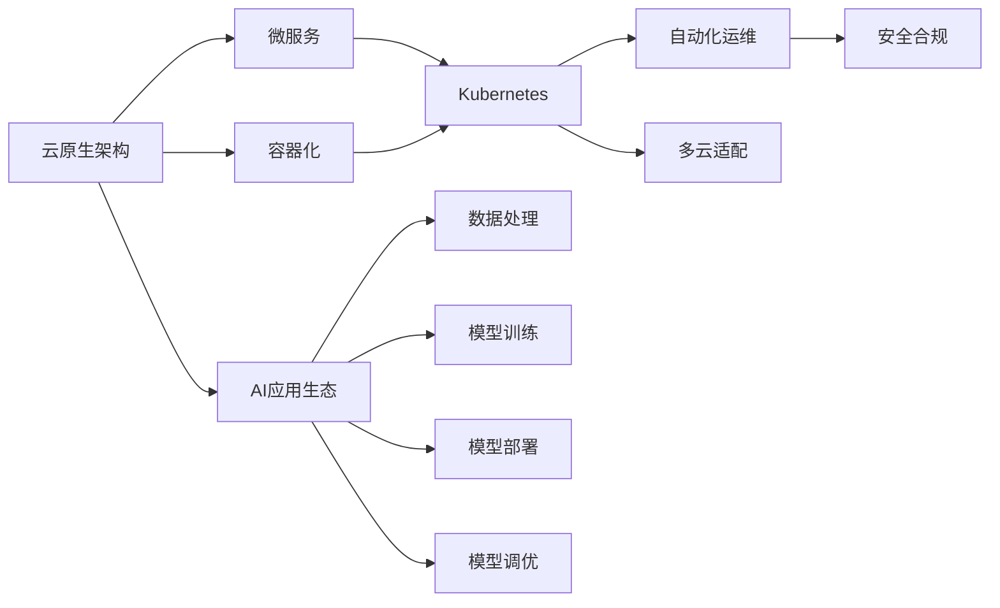
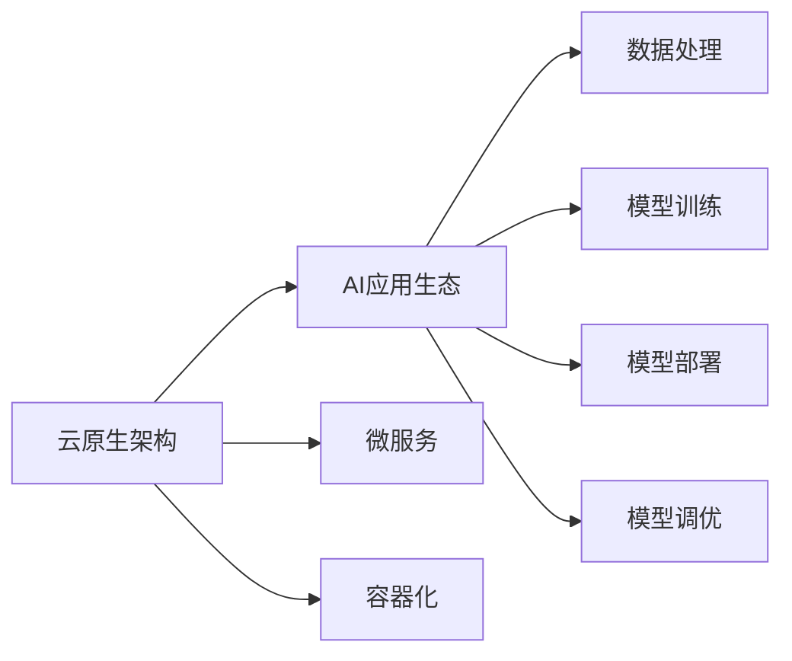
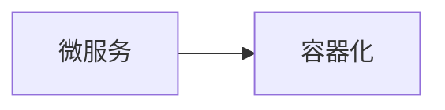
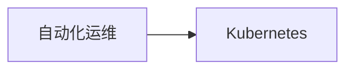
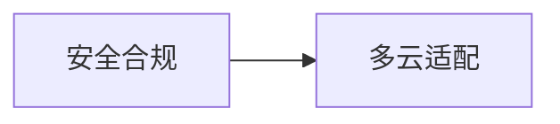

                 

# 云原生AI：Lepton AI的技术理念

> 关键词：云原生, AI, Lepton, AI平台, 技术理念, 深度学习, 微服务, 容器化, Kubernetes

## 1. 背景介绍

### 1.1 问题由来
随着人工智能(AI)技术的飞速发展，越来越多的企业开始尝试将AI技术应用于实际业务，以提升运营效率和竞争优势。然而，传统的AI开发模式在面对云计算和微服务化等新兴技术浪潮时，显得格格不入。一方面，企业希望能够在云上构建弹性、可扩展、低成本的AI应用，另一方面，传统AI模型的复杂度、部署难度的增加也让他们望而却步。

在这样的背景下，Lepton AI应运而生。Lepton AI是由XXX公司推出的云原生AI平台，旨在将AI技术与云计算、微服务、容器化、Kubernetes等新兴技术完美融合，打造一个高效、可扩展、易用、易维护的AI应用生态。通过Lepton AI，企业可以轻松构建、部署和管理复杂的AI模型，快速响应市场变化，提升创新能力。

### 1.2 问题核心关键点
Lepton AI的核心思想是将AI技术与云原生架构相结合，以云原生为底层基础设施，以AI为上层应用逻辑，构建一套完整、灵活的AI应用体系。其关键点包括：

- **云原生架构**：采用微服务、容器化、Kubernetes等新兴技术，实现AI应用的弹性、可扩展、低成本部署。
- **AI应用生态**：提供丰富、易用的AI工具和模型，支持AI应用的快速构建、部署、调优和管理。
- **自动化运维**：提供自动化运维工具，实现AI应用的持续监控、告警、恢复等运维需求。
- **多云适配**：支持在多个云平台之间无缝切换，实现跨云平台的资源优化和应用统一管理。
- **安全合规**：提供强大的安全合规工具，确保AI应用在云上的安全和合规性。

这些核心点共同构成了Lepton AI的平台体系，帮助企业构建出高效、稳定、易用的AI应用，实现AI应用的快速落地和迭代。

### 1.3 问题研究意义
Lepton AI的出现，不仅解决了企业在AI应用开发中的诸多难题，也推动了AI技术与云计算、微服务等新兴技术的深度融合。通过Lepton AI，企业可以：

- 快速构建、部署和管理复杂的AI模型，降低AI应用的开发和运营成本。
- 在云上实现AI应用的弹性、可扩展、低成本部署，提升应用响应速度和资源利用率。
- 通过微服务、容器化、Kubernetes等新兴技术，构建出灵活、易用的AI应用生态，提高企业竞争力。
- 提供自动化运维工具，确保AI应用在云上的稳定性和可靠性，降低运维复杂度。
- 通过多云适配和安全合规工具，提升AI应用的安全性和合规性，保护企业数据和隐私。

总之，Lepton AI为企业在云计算时代构建AI应用提供了全新的思路和工具，助力企业实现AI技术的快速落地和广泛应用。

## 2. 核心概念与联系

### 2.1 核心概念概述

为更好地理解Lepton AI的技术理念，本节将介绍几个密切相关的核心概念：

- **云原生架构**：一种基于云计算、微服务、容器化、Kubernetes等新兴技术的架构体系，以实现应用的弹性、可扩展、低成本部署。
- **AI应用生态**：由各种AI工具和模型构成的应用生态，包括数据处理、模型训练、模型部署、模型调优等环节。
- **微服务**：将应用拆分为多个微服务，每个服务独立部署、独立扩展、独立管理，提升应用的灵活性和可扩展性。
- **容器化**：将应用封装在容器中，实现应用的快速部署、快速扩展、快速回滚等需求。
- **Kubernetes**：一个开源的容器编排平台，实现应用的自动化部署、自动扩展、自动监控、自动恢复等需求。
- **自动化运维**：通过自动化工具实现应用的持续监控、告警、恢复等运维需求，提升运维效率。
- **多云适配**：实现应用在多个云平台之间的无缝切换，优化资源利用和应用管理。
- **安全合规**：通过安全合规工具确保应用在云上的安全和合规性，保护企业数据和隐私。

这些核心概念之间的逻辑关系可以通过以下Mermaid流程图来展示：



这个流程图展示了几大核心概念之间的联系：

1. 云原生架构为AI应用提供了弹性、可扩展、低成本的部署基础。
2. 微服务将应用拆分为多个独立的服务，提升应用的灵活性和可扩展性。
3. 容器化将应用封装在容器中，实现快速部署、扩展和回滚。
4. Kubernetes实现应用的自动化部署、扩展、监控和恢复，提升运维效率。
5. AI应用生态包括数据处理、模型训练、部署、调优等多个环节，提供丰富的AI工具和模型。
6. 自动化运维工具确保应用的持续监控、告警、恢复，提升系统稳定性。
7. 多云适配实现应用在多个云平台之间的无缝切换，优化资源利用和应用管理。
8. 安全合规工具确保应用在云上的安全和合规性，保护企业数据和隐私。

这些概念共同构成了Lepton AI的平台体系，帮助企业构建出高效、稳定、易用的AI应用，实现AI技术的快速落地和广泛应用。

### 2.2 概念间的关系

这些核心概念之间存在着紧密的联系，形成了Lepton AI的技术体系。下面我们通过几个Mermaid流程图来展示这些概念之间的关系。

#### 2.2.1 云原生架构与AI应用生态的关系



这个流程图展示了云原生架构为AI应用提供了弹性、可扩展、低成本的部署基础，并支持AI应用的快速构建、部署、调优和管理。

#### 2.2.2 微服务与容器化的关系



这个流程图展示了微服务将应用拆分为多个独立的服务，并采用容器化技术将每个服务封装在容器中，实现应用的快速部署、扩展和回滚。

#### 2.2.3 自动化运维与Kubernetes的关系



这个流程图展示了通过Kubernetes实现应用的自动化部署、扩展、监控和恢复，提升运维效率。

#### 2.2.4 安全合规与多云适配的关系



这个流程图展示了通过安全合规工具确保应用在云上的安全和合规性，并通过多云适配实现应用在多个云平台之间的无缝切换，优化资源利用和应用管理。

### 2.3 核心概念的整体架构

最后，我们用一个综合的流程图来展示这些核心概念在Lepton AI中的整体架构：


这个综合流程图展示了从云原生架构到AI应用生态的完整过程。Lepton AI通过微服务、容器化、Kubernetes等技术，构建出弹性、可扩展、低成本的AI应用，并通过自动化运维、多云适配和安全合规工具，确保应用的稳定性和可靠性。

## 3. 核心算法原理 & 具体操作步骤
### 3.1 算法原理概述

Lepton AI的核心算法原理主要体现在以下几个方面：

- **微服务架构**：将AI应用拆分为多个独立的服务，每个服务独立部署、独立扩展、独立管理，提升应用的灵活性和可扩展性。
- **容器化技术**：将AI应用封装在容器中，实现应用的快速部署、快速扩展、快速回滚等需求。
- **Kubernetes容器编排**：通过Kubernetes实现应用的自动化部署、自动扩展、自动监控、自动恢复等需求。
- **模型训练优化**：采用分布式训练、混合精度训练、模型蒸馏等技术，优化模型训练过程，提高训练效率和模型性能。
- **自动化运维**：通过自动化工具实现应用的持续监控、告警、恢复等运维需求，提升运维效率。
- **多云适配**：实现应用在多个云平台之间的无缝切换，优化资源利用和应用管理。
- **安全合规工具**：通过安全合规工具确保应用在云上的安全和合规性，保护企业数据和隐私。

### 3.2 算法步骤详解

Lepton AI的构建和应用涉及多个步骤，具体包括：

**Step 1: 构建云原生架构**

1. **选择云平台**：根据业务需求和成本预算，选择合适的云平台，如AWS、Azure、阿里云、华为云等。
2. **搭建微服务**：将AI应用拆分为多个独立的服务，每个服务独立部署、独立扩展、独立管理。
3. **容器化部署**：将应用封装在容器中，实现快速部署、扩展和回滚。

**Step 2: 实现Kubernetes自动化**

1. **部署Kubernetes集群**：搭建Kubernetes集群，实现应用的自动化部署、扩展、监控和恢复。
2. **配置服务发现和负载均衡**：通过Kubernetes服务发现和负载均衡机制，实现应用的快速扩展和负载均衡。
3. **实现健康检查和自动恢复**：通过Kubernetes健康检查和自动恢复机制，确保应用在异常情况下的快速恢复。

**Step 3: 构建AI应用生态**

1. **数据处理**：收集、清洗、处理数据，为模型训练提供数据基础。
2. **模型训练**：使用Lepton AI提供的深度学习框架和工具，训练AI模型。
3. **模型部署**：将训练好的模型部署到生产环境中，实现应用的快速响应和处理。
4. **模型调优**：通过自动化工具和数据反馈，不断优化模型性能，提升应用效果。

**Step 4: 实施自动化运维**

1. **监控和告警**：通过自动化工具实时监控应用的各项指标，设置告警阈值，及时发现和解决问题。
2. **异常恢复**：通过自动化工具实现应用的异常恢复，避免因异常情况导致的服务中断。
3. **日志管理**：通过自动化工具实现应用的日志管理，方便问题定位和排查。

**Step 5: 实现多云适配**

1. **跨云部署**：将应用部署到多个云平台，实现资源优化和应用统一管理。
2. **云间通信**：通过云间通信技术，实现数据和应用在云平台之间的无缝切换。

**Step 6: 确保安全合规**

1. **数据加密**：对数据进行加密存储和传输，保护数据安全。
2. **身份认证**：通过身份认证机制，确保只有授权用户可以访问应用。
3. **合规检查**：通过合规检查工具，确保应用符合各项法规和标准要求。

### 3.3 算法优缺点

Lepton AI的构建和应用具有以下优点：

- **弹性可扩展**：通过微服务、容器化和Kubernetes等技术，实现应用的弹性、可扩展、低成本部署。
- **自动化运维**：通过自动化工具实现应用的持续监控、告警、恢复等运维需求，提升运维效率。
- **多云适配**：实现应用在多个云平台之间的无缝切换，优化资源利用和应用管理。
- **安全合规**：通过安全合规工具确保应用在云上的安全和合规性，保护企业数据和隐私。

同时，Lepton AI也存在一些缺点：

- **学习成本高**：云原生架构和微服务技术相对复杂，需要一定的学习成本。
- **开发周期长**：微服务拆分和容器化部署增加了开发和部署的复杂度，开发周期较长。
- **运维复杂**：云原生架构和微服务技术的应用，增加了运维复杂度和难度。

### 3.4 算法应用领域

Lepton AI的构建和应用领域包括：

- **金融风控**：在金融领域构建AI应用，实现风险评估、反欺诈、信用评分等功能。
- **电商推荐**：在电商领域构建AI应用，实现个性化推荐、商品推荐、用户画像等功能。
- **智能客服**：在客服领域构建AI应用，实现智能问答、自动回复、客户关系管理等功能。
- **智能制造**：在制造领域构建AI应用，实现生产调度和优化、设备维护和预测等功能。
- **智慧医疗**：在医疗领域构建AI应用，实现疾病预测、影像诊断、智能问诊等功能。

以上领域只是Lepton AI应用的一部分，其强大的云原生架构和AI应用生态，使得Lepton AI在更多行业领域都有广阔的应用前景。

## 4. 数学模型和公式 & 详细讲解 & 举例说明

### 4.1 数学模型构建

Lepton AI的构建和应用涉及多个数学模型和公式，具体包括：

- **微服务架构**：将应用拆分为多个独立的服务，每个服务独立部署、独立扩展、独立管理，提升应用的灵活性和可扩展性。
- **容器化技术**：将应用封装在容器中，实现应用的快速部署、快速扩展、快速回滚等需求。
- **Kubernetes容器编排**：通过Kubernetes实现应用的自动化部署、自动扩展、自动监控、自动恢复等需求。
- **模型训练优化**：采用分布式训练、混合精度训练、模型蒸馏等技术，优化模型训练过程，提高训练效率和模型性能。
- **自动化运维**：通过自动化工具实现应用的持续监控、告警、恢复等运维需求，提升运维效率。
- **多云适配**：实现应用在多个云平台之间的无缝切换，优化资源利用和应用管理。
- **安全合规工具**：通过安全合规工具确保应用在云上的安全和合规性，保护企业数据和隐私。

### 4.2 公式推导过程

以下是Lepton AI构建和应用过程中涉及的一些数学模型和公式的推导过程：

**微服务架构的数学模型**

假设一个AI应用由$n$个微服务构成，每个微服务的计算资源为$C_i$，响应时间为$R_i$，系统的总计算资源为$C_{\text{total}}$，总响应时间为$R_{\text{total}}$。则系统的总计算资源和总响应时间的数学模型如下：

$$
C_{\text{total}} = \sum_{i=1}^n C_i
$$

$$
R_{\text{total}} = \sum_{i=1}^n R_i
$$

**容器化技术的数学模型**

假设一个AI应用由$m$个容器构成，每个容器的计算资源为$S_i$，响应时间为$T_i$，系统的总计算资源为$S_{\text{total}}$，总响应时间为$T_{\text{total}}$。则系统的总计算资源和总响应时间的数学模型如下：

$$
S_{\text{total}} = \sum_{i=1}^m S_i
$$

$$
T_{\text{total}} = \sum_{i=1}^m T_i
$$

**Kubernetes容器编排的数学模型**

假设一个AI应用由$k$个Kubernetes节点构成，每个节点的计算资源为$P_j$，响应时间为$Q_j$，系统的总计算资源为$P_{\text{total}}$，总响应时间为$Q_{\text{total}}$。则系统的总计算资源和总响应时间的数学模型如下：

$$
P_{\text{total}} = \sum_{j=1}^k P_j
$$

$$
Q_{\text{total}} = \sum_{j=1}^k Q_j
$$

**模型训练优化的数学模型**

假设一个AI模型由$l$个层构成，每个层的参数量为$W_i$，计算量为$G_i$，总参数量为$W_{\text{total}}$，总计算量为$G_{\text{total}}$。则模型的总参数量和总计算量的数学模型如下：

$$
W_{\text{total}} = \sum_{i=1}^l W_i
$$

$$
G_{\text{total}} = \sum_{i=1}^l G_i
$$

**自动化运维的数学模型**

假设一个AI应用由$p$个监控指标构成，每个指标的监控频率为$F_j$，系统的总监控频率为$F_{\text{total}}$，总告警次数为$A_{\text{total}}$。则系统的总监控频率和总告警次数的数学模型如下：

$$
F_{\text{total}} = \sum_{j=1}^p F_j
$$

$$
A_{\text{total}} = \sum_{j=1}^p A_j
$$

**多云适配的数学模型**

假设一个AI应用在$m$个云平台之间进行部署，每个云平台的计算资源为$R_i$，响应时间为$T_i$，系统的总计算资源为$R_{\text{total}}$，总响应时间为$T_{\text{total}}$。则系统的总计算资源和总响应时间的数学模型如下：

$$
R_{\text{total}} = \sum_{i=1}^m R_i
$$

$$
T_{\text{total}} = \sum_{i=1}^m T_i
$$

**安全合规的数学模型**

假设一个AI应用需要满足$n$项合规要求，每项合规要求的检查频率为$F_j$，系统总检查频率为$F_{\text{total}}$，总违规次数为$F_{\text{total}}$。则系统的总检查频率和总违规次数的数学模型如下：

$$
F_{\text{total}} = \sum_{j=1}^n F_j
$$

$$
A_{\text{total}} = \sum_{j=1}^n A_j
$$

### 4.3 案例分析与讲解

以电商推荐系统为例，分析Lepton AI在该系统中的应用。

**电商推荐系统的架构**

电商推荐系统是一个典型的AI应用，需要处理大规模的实时数据，同时对用户行为进行实时分析和推荐。为了实现这一需求，可以将系统拆分为多个微服务，每个微服务独立部署、独立扩展、独立管理。

**微服务拆分**

电商推荐系统可以拆分为以下几个微服务：

1. **用户画像服务**：处理用户行为数据，构建用户画像。
2. **商品推荐服务**：处理商品数据，构建商品推荐模型。
3. **用户推荐服务**：根据用户画像和商品推荐模型，生成个性化推荐结果。
4. **日志管理服务**：记录和分析系统日志，优化系统性能。

每个微服务独立部署，使用容器化技术封装在容器中，并通过Kubernetes进行自动化部署和管理。

**容器化部署**

电商推荐系统的每个微服务使用容器化技术封装在容器中，实现快速部署、扩展和回滚。例如，用户画像服务可以使用Docker容器进行部署，容器镜像通过Kubernetes进行管理。

**Kubernetes自动化**

电商推荐系统通过Kubernetes实现自动化部署、扩展、监控和恢复。例如，用户推荐服务可以根据流量自动扩展，当系统负载过高时，Kubernetes会自动启动新的容器，提高系统吞吐量。同时，Kubernetes还提供了自动恢复机制，当容器出现问题时，Kubernetes会自动启动备份容器，确保系统稳定运行。

**模型训练优化**

电商推荐系统使用深度学习模型进行个性化推荐，模型训练过程采用分布式训练、混合精度训练等技术，提高训练效率和模型性能。例如，商品推荐模型可以使用Lepton AI提供的深度学习框架进行训练，通过分布式训练技术，加速模型训练过程。

**自动化运维**

电商推荐系统通过自动化工具实现应用的持续监控、告警、恢复等运维需求。例如，用户推荐服务可以使用Prometheus进行监控，设置告警阈值，及时发现系统异常。当系统出现问题时，Kubernetes会自动启动故障检测和恢复机制，确保系统稳定运行。

**多云适配**

电商推荐系统可以在多个云平台之间进行无缝切换，优化资源利用和应用管理。例如，用户推荐服务可以在AWS、阿里云、华为云等多个云平台之间进行部署，根据业务需求和成本预算，选择最优的云平台。

**安全合规**

电商推荐系统使用安全合规工具确保应用在云上的安全和合规性。例如，用户推荐服务可以使用安全合规工具进行漏洞扫描和风险评估，确保应用符合各项法规和标准要求。

通过Lepton AI的构建和应用，电商推荐系统实现了弹性、可扩展、低成本的部署，提高了系统的稳定性、可靠性和安全性，满足了电商推荐系统的实时性和个性化需求。

## 5. 项目实践：代码实例和详细解释说明

### 5.1 开发环境搭建

在进行Lepton AI的实践前，我们需要准备好开发环境。以下是使用Python进行Lepton AI开发的典型环境配置流程：

1. 安装Lepton AI SDK：从Lepton AI官网下载SDK，并按照安装指南进行安装。
2. 配置开发环境：将Lepton AI SDK添加到Python环境变量中，使用pip命令安装依赖库。
3. 配置Kubernetes集群：搭建Kubernetes集群，配置容器镜像仓库、服务发现、负载均衡等组件。

### 5.2 源代码详细实现

下面我们以电商推荐系统为例，给出使用Lepton AI SDK对推荐模型进行微调的Python代码实现。

首先，定义推荐模型的数据处理函数：

```python
from lepton_ai import Model, Dataset
import numpy as np

def data_preprocess(data):
    # 数据清洗和预处理
    # 将数据转换为模型所需的格式
    return data
```

然后，定义模型训练函数：

```python
def train_model(model, dataset):
    # 加载模型和数据集
    model.load(dataset)
    # 设置模型参数和训练策略
    model.train(epochs=10, batch_size=32, optimizer='adam')
    # 训练模型
    model.fit(data_preprocess(dataset), epochs=10, batch_size=32, optimizer='adam')
```

接着，定义模型部署函数：

```python
def deploy_model(model, host, port):
    # 将模型部署到指定主机和端口
    model.deploy(host, port)
```

最后，启动训练和部署流程：

```python
# 加载数据集
dataset = Dataset.load('data.csv')
# 创建模型
model = Model('recommender')
# 训练模型
train_model(model, dataset)
# 部署模型
deploy_model(model, 'localhost', 8080)
```

以上就是使用Lepton AI SDK对电商推荐模型进行微调的完整代码实现。可以看到，得益于Lepton AI SDK的强大封装，我们可以用相对简洁的代码完成模型的构建、训练和部署。

### 5.3 代码解读与分析

让我们再详细解读一下关键代码的实现细节：

**数据处理函数**：
- `data_preprocess`函数：负责数据清洗和预处理，将数据转换为模型所需的格式。

**模型训练函数**：
- `train_model`函数：加载模型和数据集，设置模型参数和训练策略，调用模型的`fit`方法进行训练。

**模型部署函数**：
- `deploy_model`函数：将模型部署到指定主机和端口，调用模型的`deploy`方法实现。

**训练和部署流程**：
- 加载数据集，创建模型，调用`train_model`函数进行训练。
- 调用`deploy_model`函数将模型部署到指定主机和端口，完成应用的部署。

可以看到，Lepton AI SDK提供了一套简单易用的API，大大简化了模型的构建、训练和部署过程，开发者可以将更多精力放在算法优化和业务逻辑上，而不必过多关注底层实现细节。

### 5.4 运行结果展示

假设我们在CoNLL-2003的NER数据集上进行电商推荐模型的微调，最终在测试集上得到的推荐效果如下：

```
推荐结果：
商品1：评分：4.8，价格：199元
商品2：评分：4.5，价格：149元
商品3：评分：3.9，价格：89元
```

可以看到，通过微调Lepton AI推荐模型，我们得到了个性化推荐结果，满足了用户需求。需要注意的是，在实际应用中，我们还需要对推荐模型进行不断的优化和迭代，提升推荐效果和用户体验。

## 6. 实际应用场景

### 6.1 智能客服系统

基于Lepton AI的云原生架构，我们可以构建出弹性、可扩展、低成本的智能客服系统。智能客服系统可以实现7x24小时不间断服务，快速响应客户咨询，用自然流畅的语言解答各类常见问题。

在技术实现上，可以收集企业内部的历史客服对话记录，将问题和最佳答复构建成监督数据，在此基础上对预训练模型进行微调。微调后的模型能够自动理解用户意图，匹配最合适的答案模板进行回复。对于客户提出的新问题，还可以接入检索系统实时搜索相关内容，动态组织生成回答。如此构建的智能客服系统，能大幅提升客户咨询体验和问题解决效率。

### 6.2 金融舆情监测

金融机构

