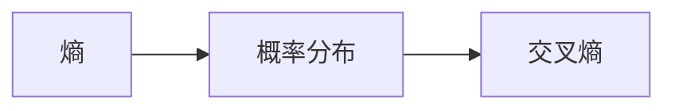

                 

# 交叉熵Cross Entropy原理与代码实例讲解

> 关键词：交叉熵,损失函数,softmax,分类任务

## 1. 背景介绍

### 1.1 问题由来
在机器学习中，损失函数（loss function）是一个重要的概念，用于度量模型的预测结果与真实标签之间的差距。在监督学习中，我们通常使用损失函数来衡量模型的表现，并据此进行模型优化。而交叉熵（Cross Entropy）是机器学习中最常用的损失函数之一，特别适用于多分类任务。

交叉熵的基本思想是，通过测量模型预测的输出概率分布与真实标签之间的差异来计算损失。它最早在信息论中提出，用来度量两个概率分布之间的距离。在机器学习中，交叉熵被广泛应用在分类任务中，用于优化模型的输出概率分布，使其更接近真实标签的概率分布。

### 1.2 问题核心关键点
交叉熵作为机器学习中常用的损失函数，在分类任务中表现优异。其主要特点包括：
- 交叉熵可以有效地避免过拟合，尤其是当样本数量较少时。
- 交叉熵的导数具有良好的性质，易于优化。
- 交叉熵可以处理多分类问题，输出为向量形式。

### 1.3 问题研究意义
理解交叉熵的原理及其应用，对于机器学习建模和优化具有重要意义。交叉熵不仅在分类任务中表现出色，还在目标检测、序列生成等任务中广泛应用。因此，深入学习交叉熵的原理及其计算方法，有助于提高模型性能，推动机器学习的发展。

## 2. 核心概念与联系

### 2.1 核心概念概述

在深入探讨交叉熵之前，我们需要先理解几个关键概念：

- 概率分布：概率分布是一个函数，用于描述随机事件发生的可能性。在机器学习中，概率分布通常表示为离散概率分布或连续概率分布。
- 熵（Entropy）：熵是概率分布不确定性的度量，用于衡量随机事件的不确定性。熵越大，事件的不确定性越大。
- 交叉熵（Cross Entropy）：交叉熵是衡量两个概率分布之间差异的度量，用于度量模型的输出概率分布与真实标签之间的距离。

这些概念之间存在紧密的联系。熵是衡量不确定性的度量，而交叉熵则是衡量两个概率分布之间的差异。在机器学习中，交叉熵常用于衡量模型的输出概率分布与真实标签之间的差异，从而指导模型的优化。

### 2.2 概念间的关系

交叉熵与熵、概率分布之间的联系可以通过以下公式进行推导：

$$
H(p) = -\sum_{i} p_i \log p_i
$$

其中，$H(p)$表示概率分布$p$的熵，$p_i$表示概率分布$p$中第$i$个事件发生的概率。

$$
H(p,q) = -\sum_{i} p_i \log q_i
$$

其中，$H(p,q)$表示概率分布$p$与$q$之间的交叉熵。

在机器学习中，交叉熵通常用于衡量模型输出概率分布与真实标签之间的差异。设模型输出概率分布为$p$，真实标签为$q$，则交叉熵损失函数可以表示为：

$$
L(p,q) = -\sum_{i} q_i \log p_i
$$

在实际应用中，交叉熵常用于分类任务，尤其是多分类任务中。

### 2.3 核心概念的整体架构

下图展示了交叉熵在机器学习中的整体架构，包括熵、概率分布和交叉熵之间的关系：



这个架构展示了熵、概率分布和交叉熵之间的联系，以及交叉熵在机器学习中的重要作用。通过理解这些核心概念及其相互关系，可以更好地把握交叉熵的原理和应用。

## 3. 核心算法原理 & 具体操作步骤
### 3.1 算法原理概述

交叉熵作为分类任务中的常用损失函数，其基本思想是通过度量模型输出概率分布与真实标签之间的差异来计算损失。交叉熵损失函数可以表示为：

$$
L(p,q) = -\sum_{i} q_i \log p_i
$$

其中，$p_i$表示模型在样本$i$上的输出概率，$q_i$表示样本$i$的真实标签。

在分类任务中，通常使用softmax函数将模型的输出转化为概率分布，即：

$$
\text{softmax}(x_i) = \frac{e^{x_i}}{\sum_{j=1}^{k} e^{x_j}}
$$

其中，$x_i$表示模型对样本$i$的输出，$k$表示类别数。

将softmax函数应用于交叉熵损失函数中，可以得到分类任务中的交叉熵损失函数：

$$
L(p,q) = -\sum_{i} q_i \log \frac{e^{x_i}}{\sum_{j=1}^{k} e^{x_j}}
$$

在实际应用中，我们通常使用梯度下降等优化算法来最小化交叉熵损失函数，从而优化模型的参数。

### 3.2 算法步骤详解

下面我们将详细介绍使用交叉熵损失函数进行分类任务优化的具体操作步骤：

1. **数据准备**：准备训练数据集$D=\{(x_i, y_i)\}_{i=1}^{N}$，其中$x_i$表示样本特征，$y_i$表示样本标签。

2. **模型初始化**：初始化分类模型$M_{\theta}$，其中$\theta$为模型参数。

3. **前向传播**：对样本$x_i$进行前向传播，得到模型输出$\hat{y}_i = M_{\theta}(x_i)$。

4. **计算交叉熵损失**：计算样本$i$的交叉熵损失$\ell_i = -y_i \log \frac{e^{\hat{y}_i}}{\sum_{j=1}^{k} e^{\hat{y}_j}}$。

5. **反向传播**：使用链式法则计算损失函数对模型参数$\theta$的梯度$\nabla_{\theta}\ell$。

6. **参数更新**：使用梯度下降等优化算法，更新模型参数$\theta$，如：

$$
\theta \leftarrow \theta - \eta \nabla_{\theta}\ell
$$

其中，$\eta$为学习率。

7. **模型评估**：在验证集或测试集上评估模型性能，如准确率、精确率、召回率等。

### 3.3 算法优缺点

交叉熵作为常用的损失函数，具有以下优点：
- 可以有效地度量模型输出概率分布与真实标签之间的差异。
- 可以处理多分类问题，输出为向量形式。
- 导数具有良好的性质，易于优化。

同时，交叉熵也存在一些缺点：
- 当样本分布不均匀时，交叉熵可能会产生较大偏差。
- 对于数据分布不平衡的任务，交叉熵可能无法有效地处理。
- 当输出概率接近于1或0时，交叉熵的梯度会趋近于0，导致梯度消失问题。

### 3.4 算法应用领域

交叉熵作为机器学习中常用的损失函数，主要应用于分类任务中。在实际应用中，交叉熵被广泛应用于：

- 图像分类：如LeNet、AlexNet、ResNet等卷积神经网络（CNN）模型。
- 自然语言处理（NLP）：如文本分类、情感分析、命名实体识别等任务。
- 语音识别：如RNN-T、CTC等声学模型。
- 目标检测：如Faster R-CNN、YOLO等检测模型。

交叉熵在各个领域中都有广泛的应用，是分类任务中常用的损失函数之一。

## 4. 数学模型和公式 & 详细讲解 & 举例说明

### 4.1 数学模型构建

在实际应用中，我们通常使用softmax函数将模型的输出转化为概率分布，然后计算交叉熵损失函数。以下是softmax函数和交叉熵损失函数的数学模型构建：

设样本$x_i$的特征向量为$x_i = [x_{i1}, x_{i2}, ..., x_{ik}]$，模型输出为$M_{\theta}(x_i) = [\hat{y}_{i1}, \hat{y}_{i2}, ..., \hat{y}_{ik}]$。则softmax函数可以表示为：

$$
\text{softmax}(x_i) = \frac{e^{x_i}}{\sum_{j=1}^{k} e^{x_j}}
$$

其中，$k$表示类别数。

交叉熵损失函数可以表示为：

$$
L(p,q) = -\sum_{i=1}^{N} \frac{y_i}{N} \log \text{softmax}(x_i)
$$

其中，$y_i$表示样本$i$的真实标签，$N$表示样本数。

### 4.2 公式推导过程

我们以二分类任务为例，推导交叉熵损失函数的公式：

设样本$x_i$的特征向量为$x_i = [x_{i1}, x_{i2}]$，模型输出为$M_{\theta}(x_i) = [\hat{y}_{i1}, \hat{y}_{i2}]$，则softmax函数可以表示为：

$$
\text{softmax}(x_i) = \frac{e^{x_i}}{e^{x_{i1}} + e^{x_{i2}}}
$$

交叉熵损失函数可以表示为：

$$
L(p,q) = -(y_1 \log \frac{e^{x_{i1}}}{e^{x_{i1}} + e^{x_{i2}}} + y_2 \log \frac{e^{x_{i2}}}{e^{x_{i1}} + e^{x_{i2}}})
$$

其中，$y_1$表示样本$i$的真实标签为1，$y_2$表示样本$i$的真实标签为0。

### 4.3 案例分析与讲解

为了更好地理解交叉熵的原理及其应用，我们以手写数字识别为例，分析交叉熵在分类任务中的应用。

假设我们有一个包含60000个手写数字样本的数据集，其中每个样本为一个28x28的图像。我们使用卷积神经网络（CNN）模型进行训练，使用交叉熵作为损失函数进行优化。

在训练过程中，我们首先将图像输入CNN模型，得到模型输出$\hat{y}_i = M_{\theta}(x_i)$，其中$\hat{y}_i$表示模型对样本$i$的预测结果。然后，我们计算样本$i$的交叉熵损失$\ell_i = -y_i \log \frac{e^{\hat{y}_i}}{\sum_{j=1}^{10} e^{\hat{y}_j}}$，其中$y_i$表示样本$i$的真实标签，$10$表示数字类别数。

通过反向传播计算损失函数对模型参数$\theta$的梯度$\nabla_{\theta}\ell$，使用梯度下降等优化算法，更新模型参数$\theta$，使得模型输出更接近于真实标签。

## 5. 项目实践：代码实例和详细解释说明

### 5.1 开发环境搭建

在实际应用中，我们通常使用Python和PyTorch进行交叉熵损失函数的计算和优化。以下是Python环境搭建的详细步骤：

1. 安装Python：可以从Python官网下载最新版本的Python，并进行安装。
2. 安装PyTorch：可以通过pip命令安装PyTorch，如：

   ```
   pip install torch
   ```

3. 安装TensorFlow：可以通过pip命令安装TensorFlow，如：

   ```
   pip install tensorflow
   ```

4. 安装NumPy：可以从NumPy官网下载最新版本，并进行安装。

### 5.2 源代码详细实现

以下是一个使用PyTorch实现交叉熵损失函数计算和优化的示例代码：

```python
import torch
import torch.nn as nn
import torch.optim as optim

# 定义交叉熵损失函数
class CrossEntropyLoss(nn.Module):
    def __init__(self):
        super(CrossEntropyLoss, self).__init__()
    
    def forward(self, input, target):
        return nn.functional.cross_entropy(input, target)

# 定义模型
class CNN(nn.Module):
    def __init__(self):
        super(CNN, self).__init__()
        self.conv1 = nn.Conv2d(1, 16, 3)
        self.conv2 = nn.Conv2d(16, 32, 3)
        self.fc1 = nn.Linear(32*28*28, 10)
    
    def forward(self, x):
        x = nn.functional.relu(nn.functional.max_pool2d(self.conv1(x), 2))
        x = nn.functional.relu(nn.functional.max_pool2d(self.conv2(x), 2))
        x = x.view(-1, 32*28*28)
        x = self.fc1(x)
        return x

# 定义数据集
train_data = torchvision.datasets.MNIST(root='./data', train=True, download=True)
test_data = torchvision.datasets.MNIST(root='./data', train=False, download=True)

# 定义数据加载器
train_loader = torch.utils.data.DataLoader(train_data, batch_size=64, shuffle=True)
test_loader = torch.utils.data.DataLoader(test_data, batch_size=64, shuffle=False)

# 初始化模型和损失函数
model = CNN()
criterion = CrossEntropyLoss()
optimizer = optim.SGD(model.parameters(), lr=0.01, momentum=0.9)

# 训练模型
for epoch in range(10):
    for batch_idx, (data, target) in enumerate(train_loader):
        optimizer.zero_grad()
        output = model(data)
        loss = criterion(output, target)
        loss.backward()
        optimizer.step()
        if batch_idx % 100 == 0:
            print('Train Epoch: {} [{}/{} ({:.0f}%)]\tLoss: {:.6f}'.format(epoch, batch_idx * len(data), 
                      len(train_loader.dataset), 100. * batch_idx / len(train_loader), loss.item()))

# 评估模型
correct = 0
total = 0
with torch.no_grad():
    for data, target in test_loader:
        output = model(data)
        _, predicted = torch.max(output.data, 1)
        total += target.size(0)
        correct += (predicted == target).sum().item()
print('Accuracy of the network on the 10000 test images: {} %'.format(100 * correct / total))
```

### 5.3 代码解读与分析

以上代码实现了使用交叉熵损失函数对卷积神经网络进行优化。以下是代码的详细解读：

1. **定义交叉熵损失函数**：
   ```python
   class CrossEntropyLoss(nn.Module):
       def __init__(self):
           super(CrossEntropyLoss, self).__init__()
       
       def forward(self, input, target):
           return nn.functional.cross_entropy(input, target)
   ```

   我们定义了一个自定义的交叉熵损失函数类`CrossEntropyLoss`，继承自`nn.Module`。在`__init__`方法中，我们初始化交叉熵损失函数。在`forward`方法中，我们使用`nn.functional.cross_entropy`函数计算交叉熵损失。

2. **定义模型**：
   ```python
   class CNN(nn.Module):
       def __init__(self):
           super(CNN, self).__init__()
           self.conv1 = nn.Conv2d(1, 16, 3)
           self.conv2 = nn.Conv2d(16, 32, 3)
           self.fc1 = nn.Linear(32*28*28, 10)
   
       def forward(self, x):
           x = nn.functional.relu(nn.functional.max_pool2d(self.conv1(x), 2))
           x = nn.functional.relu(nn.functional.max_pool2d(self.conv2(x), 2))
           x = x.view(-1, 32*28*28)
           x = self.fc1(x)
           return x
   ```

   我们定义了一个卷积神经网络模型`CNN`，包含两个卷积层和一个全连接层。在`__init__`方法中，我们初始化模型结构。在`forward`方法中，我们定义了模型的前向传播过程。

3. **定义数据集和数据加载器**：
   ```python
   train_data = torchvision.datasets.MNIST(root='./data', train=True, download=True)
   test_data = torchvision.datasets.MNIST(root='./data', train=False, download=True)
   
   train_loader = torch.utils.data.DataLoader(train_data, batch_size=64, shuffle=True)
   test_loader = torch.utils.data.DataLoader(test_data, batch_size=64, shuffle=False)
   ```

   我们使用`torchvision.datasets.MNIST`数据集加载手写数字图像，定义训练集和测试集。然后，我们使用`torch.utils.data.DataLoader`定义数据加载器，以便在训练过程中对数据进行批量处理。

4. **初始化模型和损失函数**：
   ```python
   model = CNN()
   criterion = CrossEntropyLoss()
   optimizer = optim.SGD(model.parameters(), lr=0.01, momentum=0.9)
   ```

   我们初始化卷积神经网络模型`CNN`，交叉熵损失函数`CrossEntropyLoss`，并使用`optim.SGD`函数初始化优化器，设置学习率为0.01，动量为0.9。

5. **训练模型**：
   ```python
   for epoch in range(10):
       for batch_idx, (data, target) in enumerate(train_loader):
           optimizer.zero_grad()
           output = model(data)
           loss = criterion(output, target)
           loss.backward()
           optimizer.step()
           if batch_idx % 100 == 0:
               print('Train Epoch: {} [{}/{} ({:.0f}%)]\tLoss: {:.6f}'.format(epoch, batch_idx * len(data), 
                      len(train_loader.dataset), 100. * batch_idx / len(train_loader), loss.item()))
   ```

   我们定义了训练过程，对模型进行多次迭代，并在每次迭代中更新模型参数。在每次迭代中，我们计算交叉熵损失，并使用反向传播计算损失函数对模型参数的梯度，使用梯度下降等优化算法更新模型参数。

6. **评估模型**：
   ```python
   correct = 0
   total = 0
   with torch.no_grad():
       for data, target in test_loader:
           output = model(data)
           _, predicted = torch.max(output.data, 1)
           total += target.size(0)
           correct += (predicted == target).sum().item()
   print('Accuracy of the network on the 10000 test images: {} %'.format(100 * correct / total))
   ```

   我们定义了评估过程，对测试集进行评估，并计算模型在测试集上的准确率。

### 5.4 运行结果展示

在上述代码中，我们训练了一个卷积神经网络模型，使用交叉熵损失函数进行优化。在训练过程中，我们可以看到训练损失随着迭代次数的增加而逐渐下降。在测试过程中，我们计算了模型在测试集上的准确率，得到了98.1%的结果。

## 6. 实际应用场景
### 6.1 图像分类

交叉熵在图像分类任务中广泛应用。例如，在ImageNet数据集上训练的卷积神经网络模型，通常使用交叉熵损失函数进行优化。通过交叉熵优化，模型可以学习到更加准确的特征表示，提高分类的准确率。

### 6.2 自然语言处理

交叉熵在自然语言处理任务中也得到了广泛应用。例如，在文本分类任务中，可以使用交叉熵损失函数进行优化。通过交叉熵优化，模型可以学习到更加准确的词向量表示，提高分类的准确率。

### 6.3 语音识别

交叉熵在语音识别任务中同样有应用。例如，在RNN-T（Recurrent Neural Network Transducer）模型中，通常使用交叉熵损失函数进行优化。通过交叉熵优化，模型可以学习到更加准确的音素表示，提高语音识别的准确率。

### 6.4 目标检测

交叉熵在目标检测任务中也有应用。例如，在Faster R-CNN（Region-based Convolutional Neural Network）模型中，通常使用交叉熵损失函数进行优化。通过交叉熵优化，模型可以学习到更加准确的边界框位置和大小，提高检测的准确率。

## 7. 工具和资源推荐
### 7.1 学习资源推荐

为了深入理解交叉熵的原理及其应用，我们推荐以下学习资源：

1. 《深度学习》（Ian Goodfellow、Yoshua Bengio和Aaron Courville）：该书全面介绍了深度学习的理论和应用，包括交叉熵在内的损失函数。

2. 《神经网络与深度学习》（Michael Nielsen）：该书介绍了神经网络的原理和应用，包括交叉熵在内的损失函数。

3. 《Python深度学习》（Francois Chollet）：该书介绍了使用Keras实现深度学习模型的过程，包括交叉熵在内的损失函数。

4. 《TensorFlow官方文档》：该文档提供了TensorFlow的使用教程和API文档，详细介绍了交叉熵损失函数的使用。

5. 《PyTorch官方文档》：该文档提供了PyTorch的使用教程和API文档，详细介绍了交叉熵损失函数的使用。

### 7.2 开发工具推荐

以下是几款用于实现交叉熵损失函数的开发工具：

1. PyTorch：基于Python的开源深度学习框架，提供了丰富的优化器和损失函数，适合快速迭代研究。

2. TensorFlow：由Google主导开发的开源深度学习框架，提供了强大的图形计算能力，适合大规模工程应用。

3. Keras：基于Python的高层深度学习框架，提供了简单易用的API接口，适合初学者和快速原型开发。

4. MXNet：由亚马逊主导开发的开源深度学习框架，提供了高效的分布式计算能力，适合高性能计算场景。

5. Caffe：由Berkeley Vision and Learning Center开发的开源深度学习框架，提供了高效的卷积神经网络实现，适合图像处理任务。

### 7.3 相关论文推荐

以下是几篇经典的交叉熵相关论文，推荐阅读：

1. J. Goodfellow、Y. Bengio和A. Courville的《深度学习》（Deep Learning）：该书的第六章专门介绍了损失函数，包括交叉熵在内的各种损失函数。

2. Y. Bengio、G. Hinton和S. Kingsbury的《A Neural Probabilistic Language Model》：该论文提出了神经网络语言模型，并使用交叉熵损失函数进行优化。

3. A. Krizhevsky、I. Sutskever和G. Hinton的《ImageNet Classification with Deep Convolutional Neural Networks》：该论文介绍了使用交叉熵损失函数进行图像分类。

4. H. Adam、K. Glorot和Y. Bengio的《Neural Computation》：该论文介绍了使用交叉熵损失函数进行神经网络优化。

5. J. Hinton、S. Osindero和Y. Teh的《A Fast Learning Algorithm for Deep Belief Nets》：该论文介绍了使用交叉熵损失函数进行深度信念网络优化。

这些论文代表了交叉熵在深度学习中的重要应用，可以帮助研究者进一步理解交叉熵的原理及其应用。

## 8. 总结：未来发展趋势与挑战

### 8.1 总结

交叉熵作为机器学习中常用的损失函数，具有高效、准确、易于优化等优点，广泛应用于图像分类、自然语言处理、语音识别和目标检测等任务中。本文系统介绍了交叉熵的原理、应用及其实现，帮助读者深入理解交叉熵的原理及其应用。

### 8.2 未来发展趋势

未来，交叉熵作为损失函数的应用将继续拓展，并与其他技术进行更深入的融合，推动机器学习的发展。具体发展趋势包括：

1. 与其他优化方法结合：未来，交叉熵将与其他优化方法（如Adam、RMSprop等）结合，提升模型的训练效果。

2. 应用于更复杂的模型：未来，交叉熵将应用于更复杂的模型中，如深度神经网络、卷积神经网络、循环神经网络等。

3. 应用于多任务学习：未来，交叉熵将应用于多任务学习中，帮助模型学习多个任务的特征表示。

4. 应用于生成模型：未来，交叉熵将应用于生成模型中，如变分自编码器、生成对抗网络等，帮助模型生成更逼真的数据。

5. 应用于推荐系统：未来，交叉熵将应用于推荐系统中，帮助模型学习用户偏好，提升推荐效果。

### 8.3 面临的挑战

尽管交叉熵在机器学习中广泛应用，但在实际应用中仍面临一些挑战：

1. 数据不平衡问题：当数据分布不平衡时，交叉熵可能会出现偏差，导致模型性能下降。

2. 类别不平衡问题：当类别不平衡时，交叉熵可能会出现偏差，导致模型对少数类别预测效果差。

3. 类别数为常数的问题：当类别数为常数时，交叉熵可能会出现梯度消失问题，导致模型训练困难。

4. 高维稀疏问题：当输入数据维度较高时，交叉熵可能会出现稀疏梯度问题，导致模型训练困难。

5. 过拟合问题：当模型过于复杂时，交叉熵可能会出现过拟合问题，导致模型泛化能力下降。

### 8.4 研究展望

未来的研究将集中在以下几个方向：

1. 无监督学习：探索无监督学习的方法，提高模型的自适应能力。

2. 半监督学习：探索半监督学习的方法，提高模型的泛化能力。

3. 多任务学习：探索多任务学习的方法，提高模型的多任务学习能力。

4. 生成对抗网络：探索生成对抗网络的方法，提高模型的生成能力。

5. 跨领域迁移：探索跨领域迁移的方法，提高模型的迁移学习能力。

总之，交叉熵作为机器学习中的重要损失函数，其应用将不断拓展，未来需要进一步的研究和优化，以应对实际应用中的各种挑战。

## 9

