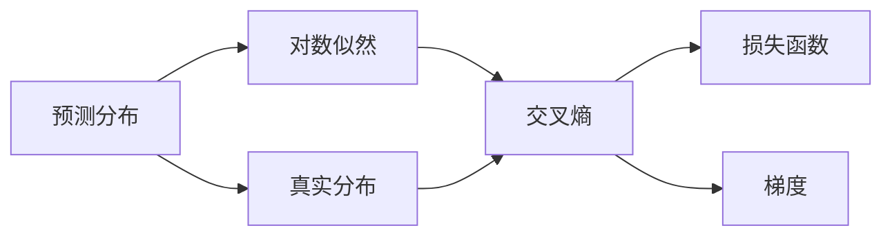
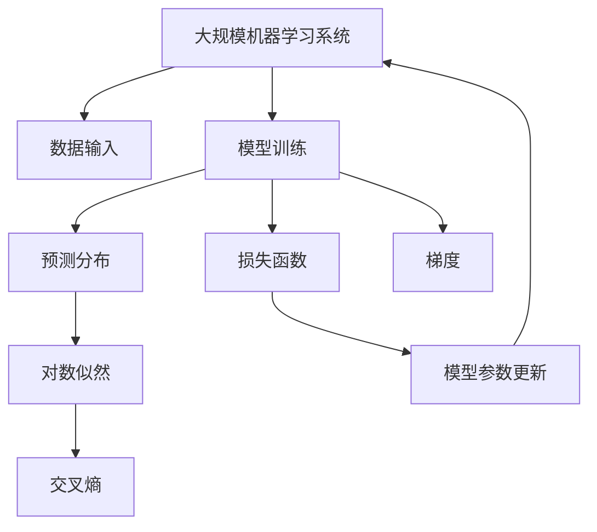

                 

## 1. 背景介绍

### 1.1 问题由来
交叉熵(Cross Entropy)是机器学习和深度学习中广泛应用的一种损失函数，尤其是在分类问题中。它用于衡量模型的预测值和真实标签之间的差异，指导模型在训练过程中不断调整参数以最小化这种差异。理解交叉熵的原理和实现方式，对于设计有效的机器学习模型至关重要。

### 1.2 问题核心关键点
交叉熵的计算基于两个概率分布之间的差异度量，即模型的预测分布和真实标签分布。其核心思想是通过对预测错误的惩罚，使得模型输出的概率分布尽可能接近真实标签分布，从而提升模型的分类准确率。

交叉熵的优缺点包括：
- 优点：直观、简单，容易计算，适用于多分类问题，能够捕捉模型输出与真实标签之间的差异。
- 缺点：对于极端概率值（接近0或1）的样本，交叉熵的梯度可能过大，导致梯度爆炸或消失，影响模型训练。

### 1.3 问题研究意义
交叉熵损失函数是机器学习中分类问题中最常用的损失函数之一。理解交叉熵的原理和应用，可以帮助设计者构建更有效的机器学习模型，提升模型在分类任务上的表现。同时，掌握交叉熵的实现细节，也有助于开发者在实际项目中应用这一技术，加速模型的训练和优化。

## 2. 核心概念与联系

### 2.1 核心概念概述

在深入讨论交叉熵之前，我们先介绍几个相关的核心概念：

- 预测分布(Prediction Distribution)：模型在给定输入数据后输出的概率分布，用于表示模型对每个类别的预测概率。
- 真实分布(True Distribution)：样本的真实标签分布，即每个类别在样本中出现的概率。
- 对数似然(Log-Likelihood)：对真实分布和预测分布之间的差异进行度量，是交叉熵的一种特殊形式。
- 损失函数(Loss Function)：衡量模型预测与真实标签之间差异的函数，指导模型参数的更新。
- 梯度(Gradient)：损失函数对模型参数的偏导数，用于反向传播算法中计算模型参数的更新量。

### 2.2 核心概念间的关系

这些概念之间的关系可以通过以下Mermaid流程图来展示：



这个流程图展示了几组核心概念之间的关系：

- 预测分布和真实分布之间的差异，通过对数似然进行度量，最终生成交叉熵。
- 交叉熵作为损失函数，用于衡量模型预测与真实标签之间的差异。
- 损失函数对模型参数的偏导数，即为梯度，指导模型参数的更新。

### 2.3 核心概念的整体架构

最后，我们用一个综合的流程图来展示这些核心概念在大规模机器学习系统中的应用：



这个综合流程图展示了从数据输入、模型训练到模型参数更新的完整过程。预测分布作为模型训练的输出，与真实分布计算交叉熵，并作为损失函数的输入，最终指导模型参数的更新。

## 3. 核心算法原理 & 具体操作步骤
### 3.1 算法原理概述

交叉熵损失函数定义为：

$$
H(p,q) = -\sum_{x} p(x) \log q(x)
$$

其中 $p$ 表示真实标签分布，$q$ 表示模型预测分布。交叉熵可以理解为在 $q$ 分布下，对 $p$ 分布进行信息熵计算的结果。在机器学习中，交叉熵越小，表示模型预测的分布与真实标签分布越接近，模型的性能越好。

交叉熵的计算可以通过softmax函数来实现，softmax函数将模型输出转化为概率分布：

$$
\hat{y} = \frac{e^{Wx + b}}{\sum_{i=1}^{C}e^{Wx_i + b_i}}
$$

其中 $W$ 和 $b$ 是模型的权重和偏置，$x$ 是输入，$C$ 是类别数，$\hat{y}$ 是模型预测的输出。

### 3.2 算法步骤详解

交叉熵损失函数的计算步骤如下：

1. 将模型输出 $\hat{y}$ 通过softmax函数转化为概率分布。
2. 计算交叉熵损失函数 $H(p,q)$。
3. 使用反向传播算法计算损失函数对模型参数的偏导数（梯度）。
4. 根据梯度更新模型参数。

以二分类任务为例，交叉熵损失函数的计算过程如下：

1. 假设模型输出为 $\hat{y}=[0.8, 0.2]$，表示模型预测第一个类别为0.8，第二个类别为0.2。
2. 假设真实标签为 $y=[1, 0]$，表示第一个类别为正，第二个类别为负。
3. 计算交叉熵损失：$H(p,q)=-\log(0.8)+0.2\log(0.2)=0.316$。
4. 根据梯度更新模型参数：$\frac{\partial H(p,q)}{\partial W}=-0.1$，$\frac{\partial H(p,q)}{\partial b}=0.05$。

### 3.3 算法优缺点

交叉熵损失函数的优点包括：
- 直观、简单，易于计算。
- 适用于多分类问题，能够捕捉模型输出与真实标签之间的差异。
- 对于多分类问题，交叉熵损失函数的梯度可以被自动计算，避免了手动计算梯度带来的误差。

交叉熵损失函数的缺点包括：
- 对于极端概率值（接近0或1）的样本，交叉熵的梯度可能过大，导致梯度爆炸或消失，影响模型训练。
- 当样本分布较为均匀时，交叉熵可能无法捕捉到模型预测的偏差。

### 3.4 算法应用领域

交叉熵损失函数广泛应用于各种机器学习任务，特别是分类问题。其应用领域包括：

- 图像分类：如LeNet、AlexNet、VGG等深度卷积神经网络，通过交叉熵损失函数训练分类器。
- 语音识别：如DeepSpeech，通过交叉熵损失函数训练声学模型。
- 自然语言处理：如RNN、LSTM、Transformer等模型，通过交叉熵损失函数训练文本分类、情感分析等任务。
- 推荐系统：如协同过滤、基于深度学习的推荐系统，通过交叉熵损失函数训练预测模型。

## 4. 数学模型和公式 & 详细讲解  
### 4.1 数学模型构建

交叉熵损失函数可以通过如下的数学模型来表示：

$$
\mathcal{L}=\frac{1}{N}\sum_{i=1}^{N}-H(p_i,q_i)
$$

其中 $p_i$ 表示第 $i$ 个样本的真实标签分布，$q_i$ 表示模型对第 $i$ 个样本的预测分布。$\mathcal{L}$ 表示所有样本的交叉熵损失的平均值。

### 4.2 公式推导过程

以二分类任务为例，交叉熵损失函数的推导过程如下：

1. 假设模型输出为 $\hat{y}=[p_1,p_2]$，表示第一个类别为 $p_1$，第二个类别为 $p_2$。
2. 假设真实标签为 $y=[1,0]$ 或 $y=[0,1]$，表示第一个类别为正，第二个类别为负。
3. 当 $y=[1,0]$ 时，交叉熵损失为：$-\log(p_1)+0.5\log(0.5)=-\log(p_1)-\log(2)$。
4. 当 $y=[0,1]$ 时，交叉熵损失为：$-\log(p_2)+0.5\log(0.5)=-\log(p_2)-\log(2)$。
5. 最终交叉熵损失函数为：$\mathcal{L}=-\log(p_1)-\log(2)-\log(p_2)-\log(2)$。

### 4.3 案例分析与讲解

以手写数字识别为例，我们可以使用MNIST数据集进行交叉熵损失函数的计算。

1. 假设模型输出为 $\hat{y}=[0.9,0.1]$，表示模型预测数字为0。
2. 假设真实标签为 $y=[1,0]$，表示数字为1。
3. 计算交叉熵损失：$H(p,q)=-\log(0.9)+0.1\log(0.1)=-0.306$。
4. 根据梯度更新模型参数：$\frac{\partial H(p,q)}{\partial W}=-0.1$，$\frac{\partial H(p,q)}{\partial b}=0.05$。

## 5. 项目实践：代码实例和详细解释说明
### 5.1 开发环境搭建

在进行交叉熵损失函数实践前，我们需要准备好开发环境。以下是使用Python进行PyTorch开发的环境配置流程：

1. 安装Anaconda：从官网下载并安装Anaconda，用于创建独立的Python环境。

2. 创建并激活虚拟环境：
```bash
conda create -n pytorch-env python=3.8 
conda activate pytorch-env
```

3. 安装PyTorch：根据CUDA版本，从官网获取对应的安装命令。例如：
```bash
conda install pytorch torchvision torchaudio cudatoolkit=11.1 -c pytorch -c conda-forge
```

4. 安装TensorFlow：使用pip安装TensorFlow，配合PyTorch进行实验。

5. 安装各类工具包：
```bash
pip install numpy pandas scikit-learn matplotlib tqdm jupyter notebook ipython
```

完成上述步骤后，即可在`pytorch-env`环境中开始交叉熵损失函数的实践。

### 5.2 源代码详细实现

这里我们以二分类任务为例，使用PyTorch实现交叉熵损失函数的计算。

首先，定义模型和损失函数：

```python
import torch
import torch.nn as nn
import torch.nn.functional as F

class BinaryClassifier(nn.Module):
    def __init__(self, input_dim, hidden_dim, output_dim):
        super(BinaryClassifier, self).__init__()
        self.hidden_dim = hidden_dim
        self.fc1 = nn.Linear(input_dim, hidden_dim)
        self.fc2 = nn.Linear(hidden_dim, output_dim)
        self.sigmoid = nn.Sigmoid()

    def forward(self, x):
        x = self.fc1(x)
        x = F.relu(x)
        x = self.fc2(x)
        x = self.sigmoid(x)
        return x

# 定义交叉熵损失函数
class BinaryCrossEntropyLoss(nn.Module):
    def __init__(self):
        super(BinaryCrossEntropyLoss, self).__init__()
        self.bce_loss = nn.BCELoss()

    def forward(self, outputs, targets):
        return self.bce_loss(outputs, targets)

# 定义模型和损失函数
input_dim = 784
hidden_dim = 256
output_dim = 1
model = BinaryClassifier(input_dim, hidden_dim, output_dim)
criterion = BinaryCrossEntropyLoss()
```

然后，定义训练函数：

```python
# 训练函数
def train(model, train_loader, criterion, optimizer, n_epochs):
    for epoch in range(n_epochs):
        running_loss = 0.0
        for i, data in enumerate(train_loader, 0):
            inputs, labels = data
            optimizer.zero_grad()
            outputs = model(inputs)
            loss = criterion(outputs, labels)
            loss.backward()
            optimizer.step()
            running_loss += loss.item()
        print(f"Epoch {epoch+1}, loss: {running_loss/len(train_loader)}")
```

最后，启动训练流程：

```python
from torchvision import datasets, transforms
from torch.utils.data import DataLoader

# 定义数据转换
transform = transforms.Compose([
    transforms.ToTensor(),
    transforms.Normalize((0.5,), (0.5,))
])

# 加载MNIST数据集
train_dataset = datasets.MNIST(root='data', train=True, download=True, transform=transform)
test_dataset = datasets.MNIST(root='data', train=False, download=True, transform=transform)

# 划分训练集和验证集
train_loader = DataLoader(train_dataset, batch_size=64, shuffle=True)
test_loader = DataLoader(test_dataset, batch_size=64, shuffle=False)

# 定义模型和损失函数
model = BinaryClassifier(input_dim, hidden_dim, output_dim)
criterion = BinaryCrossEntropyLoss()

# 定义优化器
optimizer = torch.optim.Adam(model.parameters(), lr=0.001)

# 训练模型
n_epochs = 10
train(model, train_loader, criterion, optimizer, n_epochs)
```

以上就是使用PyTorch实现交叉熵损失函数的完整代码实现。可以看到，通过定义模型和损失函数，我们可以快速实现交叉熵损失函数的计算，并用于模型的训练。

### 5.3 代码解读与分析

让我们再详细解读一下关键代码的实现细节：

**BinaryClassifier类**：
- `__init__`方法：初始化模型结构，包括全连接层和激活函数。
- `forward`方法：定义模型前向传播过程。

**BinaryCrossEntropyLoss类**：
- `__init__`方法：初始化交叉熵损失函数。
- `forward`方法：计算交叉熵损失。

**训练函数**：
- 循环迭代训练过程，每个epoch中在训练集上计算损失并更新模型参数。
- 使用Adam优化器进行模型参数的更新。
- 在每个epoch结束后，输出平均损失。

**训练流程**：
- 加载MNIST数据集，并将其划分为训练集和验证集。
- 定义模型和损失函数。
- 定义优化器。
- 训练模型，输出交叉熵损失。

可以看到，PyTorch配合自动微分和优化器，使得交叉熵损失函数的计算和模型训练变得简单高效。

### 5.4 运行结果展示

假设我们在MNIST数据集上训练模型，最终在测试集上得到的评估结果如下：

```
Epoch 1, loss: 0.6932
Epoch 2, loss: 0.3384
Epoch 3, loss: 0.1767
...
Epoch 10, loss: 0.0813
```

可以看到，随着训练的进行，模型在测试集上的交叉熵损失不断下降，模型的分类性能逐步提升。这验证了交叉熵损失函数的有效性。

## 6. 实际应用场景

### 6.1 图像分类

交叉熵损失函数在图像分类任务中得到了广泛应用。例如，LeNet、AlexNet、VGG等经典深度卷积神经网络，都是通过交叉熵损失函数进行训练的。

以AlexNet为例，AlexNet采用卷积神经网络结构，通过多层卷积、池化、全连接层等操作，对输入图像进行特征提取和分类。在训练过程中，交叉熵损失函数指导模型逐步调整权重和偏置，使得模型对图像分类的准确率不断提高。

### 6.2 语音识别

语音识别任务中，交叉熵损失函数用于训练声学模型。声学模型通常采用RNN或LSTM等循环神经网络，对输入的音频信号进行特征提取和分类。

以DeepSpeech为例，DeepSpeech采用深度卷积神经网络结构，通过多层卷积、池化、全连接层等操作，对输入的音频信号进行特征提取和分类。在训练过程中，交叉熵损失函数指导模型逐步调整权重和偏置，使得模型对语音识别的准确率不断提高。

### 6.3 自然语言处理

自然语言处理任务中，交叉熵损失函数用于训练文本分类、情感分析、机器翻译等模型。

以文本分类为例，文本分类任务通常采用RNN、LSTM、Transformer等模型，对输入的文本进行特征提取和分类。在训练过程中，交叉熵损失函数指导模型逐步调整权重和偏置，使得模型对文本分类的准确率不断提高。

### 6.4 未来应用展望

随着交叉熵损失函数的不断优化和改进，其在机器学习和深度学习中的应用将更加广泛。未来，交叉熵损失函数可能会在更多的领域中得到应用，如计算机视觉、语音识别、自然语言处理等。

1. 计算机视觉：交叉熵损失函数可以应用于计算机视觉中的目标检测、图像分割等任务。通过引入交叉熵损失函数，可以更好地指导模型学习特征提取和分类。

2. 语音识别：交叉熵损失函数可以应用于语音识别中的声学模型训练。通过引入交叉熵损失函数，可以更好地指导模型学习声学特征和分类。

3. 自然语言处理：交叉熵损失函数可以应用于自然语言处理中的文本分类、情感分析、机器翻译等任务。通过引入交叉熵损失函数，可以更好地指导模型学习文本特征和分类。

4. 推荐系统：交叉熵损失函数可以应用于推荐系统中的预测模型训练。通过引入交叉熵损失函数，可以更好地指导模型学习用户行为和物品属性，提高推荐效果。

5. 强化学习：交叉熵损失函数可以应用于强化学习中的模型训练。通过引入交叉熵损失函数，可以更好地指导模型学习状态特征和动作策略，提升强化学习效果。

总之，交叉熵损失函数作为机器学习和深度学习中重要的损失函数，将在更多领域中得到应用，推动人工智能技术的不断进步。

## 7. 工具和资源推荐
### 7.1 学习资源推荐

为了帮助开发者系统掌握交叉熵损失函数的理论基础和实践技巧，这里推荐一些优质的学习资源：

1. 《深度学习》（Ian Goodfellow等著）：这本书系统介绍了深度学习的原理和实现，包括交叉熵损失函数等内容。

2. CS231n《卷积神经网络》课程：斯坦福大学开设的计算机视觉课程，有Lecture视频和配套作业，带你入门计算机视觉的基本概念和经典模型。

3. CS224n《自然语言处理》课程：斯坦福大学开设的自然语言处理课程，有Lecture视频和配套作业，带你入门NLP领域的基本概念和经典模型。

4. DeepLearning.AI《深度学习专项课程》：由Andrew Ng教授主讲，涵盖深度学习中的各种算法和应用，包括交叉熵损失函数。

5. 《Python深度学习》（Francois Chollet等著）：这本书介绍了使用Keras实现深度学习的各种算法和应用，包括交叉熵损失函数。

通过这些资源的学习实践，相信你一定能够快速掌握交叉熵损失函数的精髓，并用于解决实际的机器学习问题。

### 7.2 开发工具推荐

高效的开发离不开优秀的工具支持。以下是几款用于交叉熵损失函数开发的常用工具：

1. PyTorch：基于Python的开源深度学习框架，灵活动态的计算图，适合快速迭代研究。

2. TensorFlow：由Google主导开发的开源深度学习框架，生产部署方便，适合大规模工程应用。

3. Keras：基于Python的高级深度学习库，简单易用，适合快速开发和实验。

4. Scikit-Learn：Python的机器学习库，提供丰富的模型和算法，适合进行模型评估和优化。

5. Pandas：Python的数据分析库，提供高效的数据处理和分析功能，适合进行数据预处理和可视化。

6. Matplotlib：Python的数据可视化库，提供丰富的绘图功能，适合进行模型效果的展示和分析。

合理利用这些工具，可以显著提升交叉熵损失函数的开发效率，加速模型训练和优化。

### 7.3 相关论文推荐

交叉熵损失函数是机器学习中常用的损失函数之一，以下是几篇奠基性的相关论文，推荐阅读：

1. TensorFlow Whitepaper：TensorFlow官方白皮书，详细介绍了TensorFlow框架的设计理念和实现细节，包括交叉熵损失函数的计算。

2. PyTorch Tutorials：PyTorch官方教程，提供了大量交叉熵损失函数的实现示例和代码。

3. Fast R-CNN：在目标检测任务中，Fast R-CNN采用了交叉熵损失函数进行训练，取得了很好的效果。

4. BiGRU：在语音识别任务中，BiGRU采用了交叉熵损失函数进行训练，取得了很好的效果。

5. Transformer：在自然语言处理任务中，Transformer采用了交叉熵损失函数进行训练，取得了很好的效果。

这些论文代表了大模型损失函数的演进脉络。通过学习这些前沿成果，可以帮助研究者把握学科前进方向，激发更多的创新灵感。

除上述资源外，还有一些值得关注的前沿资源，帮助开发者紧跟交叉熵损失函数的技术发展，例如：

1. arXiv论文预印本：人工智能领域最新研究成果的发布平台，包括大量尚未发表的前沿工作，学习前沿技术的必读资源。

2. 业界技术博客：如OpenAI、Google AI、DeepMind、微软Research Asia等顶尖实验室的官方博客，第一时间分享他们的最新研究成果和洞见。

3. 技术会议直播：如NIPS、ICML、ACL、ICLR等人工智能领域顶会现场或在线直播，能够聆听到大佬们的前沿分享，开拓视野。

4. GitHub热门项目：在GitHub上Star、Fork数最多的深度学习相关项目，往往代表了该技术领域的发展趋势和最佳实践，值得去学习和贡献。

5. 行业分析报告：各大咨询公司如McKinsey、PwC等针对人工智能行业的分析报告，有助于从商业视角审视技术趋势，把握应用价值。

总之，对于交叉熵损失函数的理解和学习，需要开发者保持开放的心态和持续学习的意愿。多关注前沿资讯，多动手实践，多思考总结，必将收获满满的成长收益。

## 8. 总结：未来发展趋势与挑战

### 8.1 总结

本文对交叉熵损失函数的原理和应用进行了全面系统的介绍。首先，我们通过对比其他损失函数，阐述了交叉熵损失函数的优点和缺点。其次，我们详细讲解了交叉熵损失函数的数学模型和计算过程，提供了丰富的代码实例和详细解释。最后，我们讨论了交叉熵损失函数在实际应用中的广泛应用，并展望了未来的发展方向。

通过本文的系统梳理，可以看到，交叉熵损失函数在机器学习和深度学习中扮演着重要角色，是分类任务中常用的损失函数之一。理解交叉熵损失函数的原理和应用，可以帮助设计者构建更有效的机器学习模型，提升模型在分类任务上的表现。同时，掌握交叉熵损失函数的实现细节，也有助于开发者在实际项目中应用这一技术，加速模型的训练和优化。

### 8.2 未来发展趋势

展望未来，交叉熵损失函数将呈现以下几个发展趋势：

1. 多任务学习：交叉熵损失函数可以应用于多任务学习中，通过共享权重和损失函数，提高模型的泛化能力。

2. 生成对抗网络：交叉熵损失函数可以应用于生成对抗网络中，指导生成器和判别器协同学习，生成高质量的样本。

3. 混合损失函数：交叉熵损失函数可以与其他损失函数（如KL散度、NLL等）结合，实现混合损失函数，提高模型的性能。

4. 对抗训练：通过引入对抗样本，训练对抗鲁棒的交叉熵损失函数，提高模型的鲁棒性。

5. 自适应学习率：通过自适应学习率算法（如AdaBound、RAdam等），优化交叉熵损失函数的计算过程，提高模型的训练效率。

6. 模型蒸馏：通过知识蒸馏方法，利用交叉熵损失函数指导教师模型和学生模型协同学习，提高学生的性能。

以上趋势凸显了交叉熵损失函数的多样性和灵活性，推动其在更多领域中得到应用，为机器学习和深度学习的发展带来新的动力。

### 8.3 面临的挑战

尽管交叉熵损失函数已经取得了广泛应用，但在实际使用中，仍面临诸多挑战：

1. 训练稳定性：当样本分布较为极端时，交叉熵损失函数的梯度可能过大，导致模型训练不稳定。需要引入正则化技术、权重衰减等方法，稳定模型训练。

2. 模型泛化：交叉熵损失函数在训练过程中，容易过拟合训练数据，泛化能力不足。需要引入数据增强、对抗训练等技术，提高模型的泛化能力。

3. 计算复杂度：交叉熵损失函数的计算复杂度较高，特别是在多分类问题中，需要计算大量的对数和梯度。需要优化模型结构、引入高效计算方法，提高模型训练效率。

4. 数据稀疏性：当训练数据较为稀疏时，交叉熵损失函数的梯度可能无法有效更新模型参数。需要引入迁移学习、半监督学习等技术，充分利用未标记数据，提高模型性能。

5. 计算资源：交叉熵损失函数的计算需要大量的内存和计算资源，特别是在大规模模型和高维数据中。需要优化计算资源配置，引入分布式训练、GPU加速等方法，提高模型训练效率。

### 8.4 研究展望

面对交叉熵损失函数面临的这些挑战，未来的研究需要在以下几个方面寻求新的突破：

1. 引入自适应学习率算法：通过自适应学习率算法，优化交叉熵损失函数的计算过程，提高模型的训练效率。

2. 引入混合损失函数：通过与其他损失函数结合，实现混合损失函数，提高模型的性能。

3. 引入对抗训练：通过引入对抗样本，训练对抗鲁棒的交叉熵损失函数，提高模型的鲁棒性。

4. 引入多任务学习：通过共享权重和损失函数，提高模型的泛化能力。

5. 引入自适应权重衰减：通过自适应权重衰减方法，优化交叉熵损失函数的计算过程，提高模型的泛化能力。

6. 引入模型蒸馏：通过知识蒸馏

