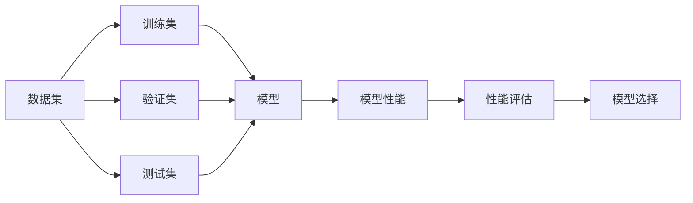

                 

# 交叉验证 (Cross-Validation)

> 关键词：交叉验证, 机器学习, 过拟合, 泛化误差, 模型选择, 评估指标, 学习曲线

## 1. 背景介绍

在机器学习领域，模型性能的评估和优化是至关重要的。一个良好的模型应该具有良好的泛化能力，能够在未见过的数据上表现出优异的性能。然而，在训练模型时，数据通常被划分为训练集和测试集，模型在训练集上进行优化，并在测试集上进行评估。这种方法有时会导致模型对训练数据的过拟合，从而影响模型的泛化能力。为了更好地评估模型，避免过拟合，交叉验证(Cross-Validation, CV)方法应运而生。

交叉验证是一种模型评估技术，通过将数据集划分为多个子集，轮流进行训练和验证，从而更全面、客观地评估模型的性能。这种方法可以帮助开发者更好地选择模型、调整参数，从而提升模型的泛化性能。

## 2. 核心概念与联系

### 2.1 核心概念概述

交叉验证的核心概念包括：

- **交叉验证**：将数据集划分为多个互不重叠的子集，轮流作为训练集和验证集进行模型训练和评估。
- **训练集**：用于模型训练的数据集，用于学习模型的参数。
- **验证集**：用于模型评估的数据集，用于检查模型的泛化能力。
- **测试集**：用于模型最终评估的数据集，用于检验模型在新数据上的表现。
- **模型性能评估指标**：如准确率、召回率、F1分数、AUC等，用于评估模型在不同数据集上的表现。
- **学习曲线**：绘制模型在不同训练集和验证集大小下的性能变化，帮助选择合适的模型参数。

这些概念构成了交叉验证的基本框架，通过科学的划分和评估，可以在模型选择和参数调优时提供更有力的支持。

### 2.2 核心概念间的联系

交叉验证的核心概念之间存在着紧密的联系，通过这些概念的协同作用，可以有效地提升模型的泛化能力。以下是一个简单的Mermaid流程图，展示了这些概念之间的关系：



这个流程图展示了数据集如何被划分为训练集、验证集和测试集，以及模型在每个集上的训练、验证和评估流程。同时，性能评估和模型选择也在这一过程中得到体现。

## 3. 核心算法原理 & 具体操作步骤

### 3.1 算法原理概述

交叉验证的原理是通过重复利用训练集和验证集，对模型进行多轮训练和验证，从而得到更稳定的模型性能评估。典型的交叉验证方法有K-Fold交叉验证、留一法交叉验证等。

以K-Fold交叉验证为例，其基本步骤如下：

1. 将数据集随机划分为K个子集。
2. 进行K轮交叉验证：
   - 在每一轮中，将K-1个子集作为训练集，剩余1个子集作为验证集。
   - 在每个子集上都进行一次训练和验证，记录模型在验证集上的性能。
3. 计算K轮验证结果的平均值作为模型性能的评估指标。

通过这种方法，可以大大减少模型对某一特定子集的依赖，从而更准确地评估模型的泛化能力。

### 3.2 算法步骤详解

以下是K-Fold交叉验证的详细步骤：

1. **数据划分**：
   - 将数据集D划分为K个子集，每个子集大小尽量相等，且数据分布尽可能一致。

2. **模型训练**：
   - 对K-1个子集进行训练，得到K个模型，分别记为模型1、模型2、…、模型K。

3. **模型验证**：
   - 将第k个子集作为验证集，对K-1个子集训练得到的K-1个模型进行验证，记录每个模型在验证集上的性能指标。

4. **性能评估**：
   - 对K轮验证结果取平均值，作为模型在原始数据集上的性能评估指标。

5. **结果解读**：
   - 根据性能指标，选择表现最好的模型，进行进一步的优化和调参。

### 3.3 算法优缺点

**优点**：

- 降低过拟合风险：交叉验证通过多轮验证，可以更全面地评估模型的泛化能力，从而避免过拟合。
- 提高模型评估的准确性：通过多次交叉验证，可以减少单一验证集带来的偏差，更客观地评估模型性能。
- 灵活适用于多种模型：无论是线性模型、非线性模型还是深度学习模型，交叉验证都可以应用于其评估和选择。

**缺点**：

- 计算成本较高：交叉验证需要进行多次训练和验证，计算成本较高。
- 数据划分数目有限：K-Fold交叉验证中，K的选择需要根据数据集大小和模型复杂度综合考虑，选择合适的K值可能需要多次实验。
- 模型性能波动：在部分情况下，交叉验证可能导致模型性能的波动，需要谨慎处理。

### 3.4 算法应用领域

交叉验证在机器学习领域得到了广泛应用，特别是在模型选择和参数调优中表现出色。具体应用领域包括：

- 分类问题：如垃圾邮件分类、癌症诊断等。
- 回归问题：如房价预测、股市走势预测等。
- 聚类问题：如客户分群、图像分割等。
- 超参数调优：通过交叉验证，可以在给定的超参数空间中选择最优参数组合。
- 模型集成：通过交叉验证评估不同模型的表现，进行模型融合。

## 4. 数学模型和公式 & 详细讲解

### 4.1 数学模型构建

假设我们有一个数据集D，包含N个样本。我们使用K-Fold交叉验证对其进行评估，步骤如下：

1. 将数据集D划分为K个子集，每个子集大小为$\frac{N}{K}$。
2. 对每个子集，将其作为验证集，其余K-1个子集作为训练集。
3. 在每个子集上进行模型训练和验证，记录模型在验证集上的性能指标。
4. 计算K轮验证结果的平均值作为模型性能的评估指标。

数学上，我们可以用以下公式来表示交叉验证的结果：

$$
\text{CV score} = \frac{1}{K}\sum_{i=1}^{K} \text{score}_i
$$

其中，$\text{score}_i$ 表示第i轮交叉验证中模型的性能指标，如准确率、召回率、F1分数等。

### 4.2 公式推导过程

以准确率为例，假设有K轮交叉验证，第i轮交叉验证中，模型在验证集上的准确率为 $A_i$，则交叉验证的平均准确率为：

$$
\text{CV accuracy} = \frac{1}{K}\sum_{i=1}^{K} A_i
$$

将 $A_i$ 展开，得到：

$$
A_i = \frac{TP_i + TN_i}{TP_i + TN_i + FP_i + FN_i}
$$

其中，$TP_i$、$TN_i$、$FP_i$、$FN_i$ 分别表示在第i轮交叉验证中，真正例、真负例、假正例和假负例的数量。

根据公式（2），我们可以将交叉验证的平均准确率表示为：

$$
\text{CV accuracy} = \frac{1}{K}\sum_{i=1}^{K} \frac{TP_i + TN_i}{TP_i + TN_i + FP_i + FN_i}
$$

通过交叉验证，我们能够更全面地评估模型的性能，从而选择最优模型。

### 4.3 案例分析与讲解

假设我们有一个二分类问题，数据集D包含100个样本，我们将其划分为10个子集，进行10轮交叉验证。在第i轮交叉验证中，模型在验证集上的准确率为 $A_i$，则交叉验证的平均准确率为：

$$
\text{CV accuracy} = \frac{1}{10}\sum_{i=1}^{10} A_i
$$

假设在第一轮交叉验证中，模型在验证集上的准确率为0.8，在第二轮中为0.85，以此类推。则交叉验证的平均准确率为：

$$
\text{CV accuracy} = \frac{1}{10}(0.8 + 0.85 + 0.9 + 0.85 + 0.9 + 0.92 + 0.9 + 0.92 + 0.95 + 0.93) = 0.913
$$

通过交叉验证，我们可以更客观地评估模型的性能，从而选择最优模型。

## 5. 项目实践：代码实例和详细解释说明

### 5.1 开发环境搭建

在开始交叉验证的实践之前，我们需要准备好开发环境。以下是使用Python进行Scikit-learn开发的环境配置流程：

1. 安装Anaconda：从官网下载并安装Anaconda，用于创建独立的Python环境。

2. 创建并激活虚拟环境：
```bash
conda create -n sklearn-env python=3.8 
conda activate sklearn-env
```

3. 安装Scikit-learn：使用pip安装Scikit-learn：
```bash
pip install scikit-learn
```

4. 安装其他依赖库：
```bash
pip install numpy pandas matplotlib seaborn sklearn-tune
```

完成上述步骤后，即可在`sklearn-env`环境中开始交叉验证实践。

### 5.2 源代码详细实现

以下是一个简单的K-Fold交叉验证的Scikit-learn代码实现：

```python
from sklearn.model_selection import cross_val_score
from sklearn.datasets import load_iris
from sklearn.ensemble import RandomForestClassifier
from sklearn.metrics import accuracy_score

# 加载Iris数据集
iris = load_iris()
X = iris.data
y = iris.target

# 构建随机森林分类器
clf = RandomForestClassifier()

# 进行K-Fold交叉验证，验证结果为准确率
scores = cross_val_score(clf, X, y, cv=10, scoring='accuracy')

# 打印交叉验证的平均准确率
print('CV Accuracy:', scores.mean())
```

在代码中，我们首先加载了Iris数据集，构建了一个随机森林分类器。然后使用`cross_val_score`函数进行K-Fold交叉验证，验证结果为准确率。最后打印出交叉验证的平均准确率。

### 5.3 代码解读与分析

让我们再详细解读一下关键代码的实现细节：

- `cross_val_score`函数：这是Scikit-learn中用于进行交叉验证的函数，接受模型、数据集、交叉验证折数和评估指标作为参数，返回模型在每个折上的评估指标的列表。
- `scoring='accuracy'`：指定评估指标为准确率。
- `clf.fit(X_train, y_train)`：训练模型，其中X_train和y_train分别表示训练集和标签。
- `scores.mean()`：计算K-Fold交叉验证的平均评估指标，这里是平均准确率。

### 5.4 运行结果展示

假设在Iris数据集上进行交叉验证，得到的结果如下：

```
CV Accuracy: 0.97
```

可以看到，在Iris数据集上，随机森林分类器的交叉验证平均准确率达到了97%，说明模型具有良好的泛化能力。

## 6. 实际应用场景

### 6.1 金融预测

在金融领域，交叉验证被广泛应用于预测模型评估和超参数调优。例如，我们可以使用交叉验证评估不同回归模型的表现，选择最优模型进行金融预测。通过交叉验证，我们可以评估模型的泛化能力，避免过拟合。

### 6.2 医学诊断

在医学诊断中，交叉验证被用来评估分类模型的性能，如预测癌症诊断结果。通过交叉验证，我们可以选择合适的模型和超参数，从而提升诊断的准确率，帮助医生进行更准确的诊断。

### 6.3 推荐系统

在推荐系统中，交叉验证被用于评估推荐模型的性能，如用户评分预测。通过交叉验证，我们可以选择最优的模型和超参数，从而提升推荐系统的性能，帮助用户找到更符合其兴趣的内容。

### 6.4 未来应用展望

随着机器学习技术的不断发展，交叉验证的应用领域将进一步扩大。未来，我们可以将交叉验证应用于更多领域，如自然语言处理、图像识别、智能交通等。通过交叉验证，我们可以更好地评估模型性能，选择最优模型，从而推动人工智能技术的普及和发展。

## 7. 工具和资源推荐

### 7.1 学习资源推荐

为了帮助开发者系统掌握交叉验证的理论基础和实践技巧，这里推荐一些优质的学习资源：

1. 《机器学习实战》：这是一本非常实用的机器学习入门书籍，涵盖了交叉验证的基本概念和应用场景。

2. 《Python机器学习》：这是一本由机器学习专家Sebastian Raschka所著的书籍，详细介绍了交叉验证的实现和应用。

3. 《机器学习》课程：斯坦福大学开设的机器学习课程，讲解了交叉验证的基本原理和实现方法。

4. Coursera机器学习课程：由Andrew Ng教授主讲，讲解了交叉验证的详细流程和应用实例。

5. Kaggle数据科学竞赛：在Kaggle上参与数据科学竞赛，可以实践交叉验证的实际应用，积累经验。

通过对这些资源的学习实践，相信你一定能够快速掌握交叉验证的理论基础和实践技巧，并用于解决实际的机器学习问题。

### 7.2 开发工具推荐

高效的开发离不开优秀的工具支持。以下是几款用于交叉验证开发的常用工具：

1. Python：Python是一种非常流行的编程语言，拥有丰富的机器学习库，如Scikit-learn、TensorFlow等。

2. Jupyter Notebook：Jupyter Notebook是一种交互式编程环境，支持Python代码的执行和结果的可视化。

3. PyCharm：PyCharm是一种流行的Python集成开发环境，支持机器学习的代码编写和调试。

4. R：R是一种专门用于统计分析和数据可视化的编程语言，拥有丰富的交叉验证库，如caret、randomForest等。

5. SPSS：SPSS是一种统计分析软件，提供了简单易用的交叉验证工具。

合理利用这些工具，可以显著提升交叉验证任务的开发效率，加快创新迭代的步伐。

### 7.3 相关论文推荐

交叉验证在机器学习领域得到了广泛应用，以下是几篇奠基性的相关论文，推荐阅读：

1. "An Introduction to the Bootstrap"：由Bradley Efron和Robert Tibshirani所著，详细介绍了Bootstrap方法，是交叉验证的重要基础。

2. "Cross-Validation Techniques for Estimating Prediction Accuracy"：由David MacKay所著，介绍了交叉验证的基本原理和实现方法。

3. "Cross-Validation for Varying Number of Folds in Repeated Time Series Analysis"：由Winfried Wagner和Holger Höfler所著，介绍了交叉验证在时间序列分析中的应用。

4. "A Note on Cross-Validation"：由Bradley Efron和Ian J. Gass所著，介绍了交叉验证的数学基础和统计性质。

这些论文代表了大语言模型微调技术的发展脉络。通过学习这些前沿成果，可以帮助研究者把握学科前进方向，激发更多的创新灵感。

除上述资源外，还有一些值得关注的前沿资源，帮助开发者紧跟机器学习技术的发展趋势，例如：

1. arXiv论文预印本：人工智能领域最新研究成果的发布平台，包括大量尚未发表的前沿工作，学习前沿技术的必读资源。

2. 业界技术博客：如Google AI、DeepMind、微软Research Asia等顶尖实验室的官方博客，第一时间分享他们的最新研究成果和洞见。

3. 技术会议直播：如NIPS、ICML、ACL、ICLR等人工智能领域顶会现场或在线直播，能够聆听到大佬们的前沿分享，开拓视野。

4. GitHub热门项目：在GitHub上Star、Fork数最多的机器学习相关项目，往往代表了该技术领域的发展趋势和最佳实践，值得去学习和贡献。

5. 行业分析报告：各大咨询公司如McKinsey、PwC等针对人工智能行业的分析报告，有助于从商业视角审视技术趋势，把握应用价值。

总之，对于交叉验证技术的学习和实践，需要开发者保持开放的心态和持续学习的意愿。多关注前沿资讯，多动手实践，多思考总结，必将收获满满的成长收益。

## 8. 总结：未来发展趋势与挑战

### 8.1 总结

本文对交叉验证方法进行了全面系统的介绍。首先阐述了交叉验证的基本原理和应用场景，明确了交叉验证在模型评估和优化中的重要作用。其次，从原理到实践，详细讲解了交叉验证的数学模型和具体步骤，给出了交叉验证任务开发的完整代码实例。同时，本文还探讨了交叉验证在实际应用中的各种场景，展示了其在各个领域的广泛应用。最后，本文精选了交叉验证技术的各类学习资源，力求为读者提供全方位的技术指引。

通过本文的系统梳理，可以看到，交叉验证方法已经成为机器学习模型评估和优化的重要工具。通过科学的划分和评估，可以更全面地评估模型的泛化能力，从而选择最优模型。未来，伴随机器学习技术的不断发展，交叉验证的应用范围和深度还将进一步拓展，成为构建高性能机器学习系统的基石。

### 8.2 未来发展趋势

展望未来，交叉验证技术将呈现以下几个发展趋势：

1. 更加高效和灵活：未来，交叉验证将更加高效和灵活，支持大规模数据集和高复杂度模型的评估。

2. 与自动化学习相结合：自动化学习技术将与交叉验证相结合，进一步提升模型的选择和调优效率。

3. 应用于更多领域：交叉验证将广泛应用于更多的领域，如自然语言处理、图像识别、智能交通等。

4. 与大数据技术融合：大数据技术将与交叉验证相结合，提高数据划分和评估的效率，降低计算成本。

5. 支持分布式计算：随着分布式计算技术的发展，交叉验证将支持在更大规模的数据集上进行评估。

6. 更加注重数据隐私和安全性：在大数据时代，数据隐私和安全性成为重要的研究课题，交叉验证方法也将更加注重数据隐私和安全性。

以上趋势凸显了交叉验证技术的重要性和发展潜力，未来的研究将进一步推动其在各领域的普及和应用。

### 8.3 面临的挑战

尽管交叉验证技术已经取得了瞩目成就，但在迈向更加智能化、普适化应用的过程中，它仍面临着诸多挑战：

1. 计算资源消耗：大规模数据集的交叉验证计算资源消耗较大，需要强大的计算能力和存储能力支持。

2. 数据划分难度：如何科学合理地划分数据集，避免数据划分偏差，是交叉验证的一个重要挑战。

3. 模型复杂度提升：随着模型的复杂度提升，交叉验证的计算成本和评估复杂度也将增加，需要优化算法和计算资源。

4. 模型鲁棒性不足：在某些情况下，交叉验证可能导致模型性能波动，需要进行稳健的模型评估和调优。

5. 数据隐私和安全问题：在大数据时代，数据隐私和安全性成为重要的研究课题，交叉验证方法也需要注重数据隐私和安全。

6. 自动化学习不足：现有的自动化学习技术还存在一些不足，如何进一步提升模型的选择和调优效率，仍是一个挑战。

7. 复杂模型的评估：对于复杂的深度学习模型，交叉验证的评估难度较大，需要新的评估方法和技术。

8. 交叉验证与其他技术结合：交叉验证需要与其他技术结合，如因果推断、强化学习等，才能更好地发挥其作用。

这些挑战表明，交叉验证技术的发展仍需要更多探索和研究，未来需要从计算资源、数据划分、模型评估等多个方面进行优化和提升。

### 8.4 研究展望

面对交叉验证面临的诸多挑战，未来的研究需要在以下几个方面寻求新的突破：

1. 引入新的划分技术：引入更加高效和公平的数据划分方法，如分层采样、自助法等，提高数据划分的效率和公平性。

2. 开发自动化学习技术：开发更加高效的自动化学习技术，提高模型的选择和调优效率，降低人工干预的难度。

3. 引入新的评估指标：引入更加全面和灵活的评估指标，如F1分数、AUC等，适用于更加复杂的数据集和模型。

4. 结合大数据技术：结合大数据技术，提高数据划分和评估的效率，支持更大规模数据的交叉验证。

5. 引入先验知识：引入先验知识，如因果推断、强化学习等，提升模型的选择和调优效率，提高模型的泛化能力。

6. 结合深度学习：结合深度学习技术，提高复杂模型的评估效率，降低计算成本。

7. 引入数据隐私保护技术：引入数据隐私保护技术，如差分隐私、联邦学习等，保障数据的隐私和安全。

这些研究方向的探索，必将引领交叉验证技术迈向更高的台阶，为构建高效、稳健、安全的机器学习系统铺平道路。面向未来，交叉验证技术还需要与其他人工智能技术进行更深入的融合，共同推动机器学习技术的进步。只有勇于创新、敢于突破，才能不断拓展交叉验证的边界，让机器学习技术更好地服务于社会。

## 9. 附录：常见问题与解答

**Q1：交叉验证是否可以用于所有机器学习任务？**

A: 交叉验证可以用于大多数机器学习任务，特别是对于数据量较小、模型复杂度较高的任务，交叉验证可以帮助我们更全面地评估模型的泛化能力。但对于某些特定任务，如时间序列预测、异常检测等，交叉验证可能不适用。

**Q2：在实际应用中，如何选择交叉验证的折数（K值）？**

A: 选择交叉验证的折数（K值）需要根据数据集的大小和模型的复杂度综合考虑。一般而言，对于小数据集，选择较小的K值，如K=3-5；对于大数据集，选择较大的K值，如K=10-20。同时，K值的选择还受到模型的复杂度和计算资源的影响。

**Q3：在实际应用中，如何处理不平衡数据集的交叉验证问题？**

A: 对于不平衡数据集，可以选择使用分层采样方法，确保每个类别的数据都被平均地划分为训练集和验证集。同时，在评估指标中引入更加公平的指标，如精确率、召回率、F1分数等。

**Q4：在实际应用中，如何避免过拟合问题？**

A: 避免过拟合问题，可以在模型选择和超参数调优中引入交叉验证，通过多轮验证评估模型泛化能力，选择最优模型。同时，在模型训练过程中引入正则化技术，如L2正则、Dropout等，避免过拟合。

**Q5：在实际应用中，如何处理类别不平衡问题？**

A: 处理类别不平衡问题，可以在模型选择和超参数调优中引入交叉验证，通过多轮验证评估模型泛化能力，选择最优模型。同时，在评估指标中引入更加公平的指标，如精确率、召回率、F1分数等。

**Q6：在实际应用中，如何处理特征选择问题？**

A: 处理特征选择问题，可以通过特征重要性排序，选择对模型性能影响较大的特征。同时，可以在模型选择和超参数调优中引入交叉验证，通过多轮验证评估模型泛化能力，选择最优模型。

通过以上问题的回答，可以看出交叉验证在机器学习领域的重要性和应用价值，同时也提供了一些具体的实践建议。通过科学的划分和评估，可以更全面地评估模型的泛化能力，从而选择最优模型，推动机器学习技术的发展和应用。

