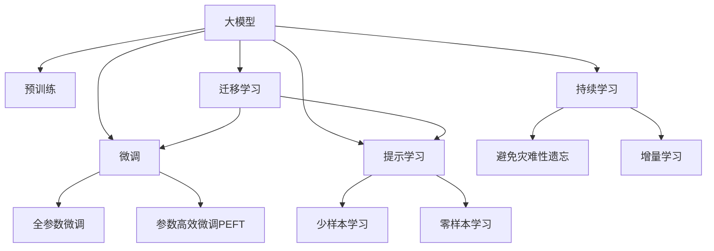
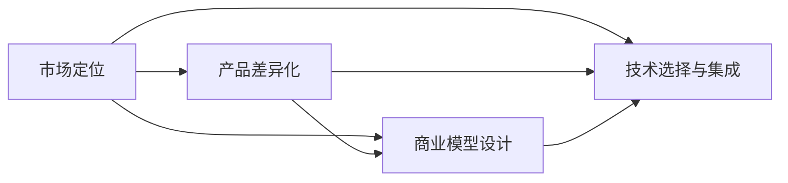
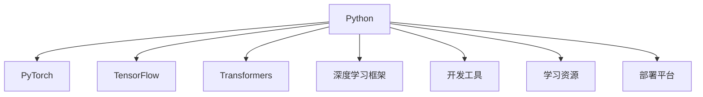

                 

# 产品定位：大模型创业的关键

## 1. 背景介绍

### 1.1 问题由来

近年来，人工智能(AI)技术迅猛发展，特别是在自然语言处理(NLP)和计算机视觉(CV)等领域，基于深度学习的大模型(Giant Model)已取得了显著进展。例如，GPT-3、BERT、DALL-E等大模型在各种任务上展现了卓越的性能。然而，这些大模型的研发和部署需要大量计算资源和标注数据，且开发周期长、成本高昂，一般企业难以承受。

因此，如何定位产品，抓住大模型创业的机遇，成为众多AI创业公司面临的重大问题。本文将从产品定位的角度，深度解析大模型创业的核心要素，并探讨如何构建具有竞争力的AI产品。

### 1.2 问题核心关键点

大模型创业成功的关键在于产品定位的精准性与科学性。合理的产品定位不仅能降低创业成本，提升市场竞争力，还能为公司带来持续的商业价值。本文将详细探讨以下几个核心关键点：

- **市场定位**：明确目标市场，了解潜在用户的需求和痛点。
- **产品差异化**：利用大模型的优势，构建独特的产品功能与用户体验。
- **商业模型设计**：构建盈利模式，平衡短期收益与长期发展。
- **技术选择与集成**：选择适合的技术架构与工具链，实现高效、稳定的开发与部署。

## 2. 核心概念与联系

### 2.1 核心概念概述

为更好地理解大模型创业的关键要素，本节将介绍几个密切相关的核心概念：

- **大模型**：指包含数亿甚至数十亿参数的深度学习模型，如GPT-3、BERT等。这些模型通过在大规模无标签数据上进行预训练，学习到丰富的知识表示。

- **微调(Fine-Tuning)**：指在预训练模型基础上，使用下游任务的少量标注数据，通过有监督学习优化模型在该任务上的性能。微调可以显著提升模型在特定任务上的表现。

- **迁移学习(Transfer Learning)**：指将一个领域学习到的知识，迁移应用到另一个不同但相关的领域的学习范式。大模型的预训练-微调过程即是一种典型的迁移学习方式。

- **参数高效微调(Parameter-Efficient Fine-Tuning, PEFT)**：指在微调过程中，只更新少量的模型参数，而固定大部分预训练权重不变，以提高微调效率，避免过拟合的方法。

- **提示学习(Prompt Learning)**：通过在输入文本中添加提示模板(Prompt Template)，引导大模型进行特定任务的推理和生成。可以在不更新模型参数的情况下，实现零样本或少样本学习。

- **少样本学习(Few-shot Learning)**：指在只有少量标注样本的情况下，模型能够快速适应新任务的学习方法。在大语言模型中，通常通过在输入中提供少量示例来实现，无需更新模型参数。

- **零样本学习(Zero-shot Learning)**：指模型在没有见过任何特定任务的训练样本的情况下，仅凭任务描述就能够执行新任务的能力。大语言模型通过预训练获得的广泛知识，使其能够理解任务指令并生成相应输出。

- **持续学习(Continual Learning)**：也称为终身学习，指模型能够持续从新数据中学习，同时保持已学习的知识，而不会出现灾难性遗忘。这对于保持大语言模型的时效性和适应性至关重要。

这些核心概念之间的逻辑关系可以通过以下Mermaid流程图来展示：



这个流程图展示了大模型创业的核心概念及其之间的关系：

1. 大模型通过预训练获得基础能力。
2. 微调是对预训练模型进行任务特定的优化，可以分为全参数微调和参数高效微调（PEFT）。
3. 提示学习是一种不更新模型参数的方法，可以实现少样本学习和零样本学习。
4. 迁移学习是连接预训练模型与下游任务的桥梁，可以通过微调或提示学习来实现。
5. 持续学习旨在使模型能够不断学习新知识，同时避免遗忘旧知识。

这些概念共同构成了大模型创业的基础框架，使得公司能够利用大模型技术，开发具有竞争力的AI产品。

### 2.2 概念间的关系

这些核心概念之间存在着紧密的联系，形成了大模型创业的完整生态系统。下面我通过几个Mermaid流程图来展示这些概念之间的关系。

#### 2.2.1 大模型创业的核心范式



这个流程图展示了大模型创业的核心范式，即市场定位、产品差异化、商业模型设计和技术选择与集成。市场定位决定了目标用户群体和需求，产品差异化突出了产品特色和优势，商业模型设计确保了公司盈利，技术选择与集成提供了技术实现的基础。

#### 2.2.2 大模型创业的技术栈



这个流程图展示了大模型创业所需的技术栈。Python、PyTorch、TensorFlow、Transformers等深度学习框架提供了强大的模型开发能力，深度学习框架如HuggingFace、TensorFlow等提供了丰富的预训练模型和工具链，开发工具如Jupyter Notebook、AWS、Google Cloud等提供了高效的开发和部署环境，学习资源如arXiv、GitHub、Transformers官方文档等提供了丰富的学习材料和开源项目。

## 3. 核心算法原理 & 具体操作步骤
### 3.1 算法原理概述

大模型创业的算法原理主要基于监督学习、迁移学习和微调技术。其核心思想是：

1. **市场定位**：通过分析市场需求和用户痛点，明确目标市场和潜在用户。
2. **产品差异化**：利用大模型的优势，构建独特的产品功能与用户体验。
3. **商业模型设计**：通过选择适合的技术架构与工具链，实现高效、稳定的开发与部署。

### 3.2 算法步骤详解

大模型创业的算法步骤主要包括以下几个关键环节：

1. **市场调研与分析**：
   - 收集目标市场的用户需求和痛点。
   - 分析竞品和市场趋势，确定产品定位。

2. **技术选型与集成**：
   - 选择合适的深度学习框架和预训练模型。
   - 集成开源工具和第三方库，构建技术栈。

3. **产品设计与实现**：
   - 设计用户界面和交互逻辑。
   - 实现核心功能，优化用户体验。

4. **微调与测试**：
   - 使用少量标注数据对模型进行微调，提升性能。
   - 进行系统测试和用户测试，收集反馈。

5. **部署与监控**：
   - 将模型部署到云平台或本地服务器。
   - 实时监控模型性能，收集运行日志。

6. **迭代优化**：
   - 根据用户反馈和性能数据，进行模型和产品的迭代优化。

### 3.3 算法优缺点

大模型创业的算法优点主要体现在：

1. **高效性**：利用大模型预训练的通用知识，只需少量标注数据即可快速迭代产品。
2. **创新性**：大模型提供丰富的知识库，可以创新性地构建独特的AI应用。
3. **灵活性**：可扩展性强，易于集成各类第三方服务和API。

其缺点主要在于：

1. **成本高**：研发和部署大模型需要高昂的计算资源和标注数据。
2. **依赖数据**：数据质量直接影响模型的性能，需持续收集和标注数据。
3. **过拟合风险**：在数据量有限的情况下，模型可能过拟合训练集。

### 3.4 算法应用领域

大模型创业的算法广泛应用于各种AI应用场景，如：

1. **智能客服**：利用大模型进行文本分类、意图识别和对话生成，提升客服效率和用户体验。
2. **医疗诊断**：通过自然语言处理和图像识别技术，辅助医生进行疾病诊断和治疗方案推荐。
3. **金融风控**：使用大模型进行风险评估和欺诈检测，提升金融安全水平。
4. **智能推荐**：基于用户行为和偏好，构建个性化推荐系统，提升产品销售和用户粘性。
5. **智能家居**：结合语音识别和自然语言处理技术，构建智能家居场景下的语音交互和控制功能。
6. **自动驾驶**：利用计算机视觉和大模型，进行道路识别和场景理解，提升自动驾驶系统的安全性。

## 4. 数学模型和公式 & 详细讲解 & 举例说明

### 4.1 数学模型构建

在大模型创业中，通常使用监督学习范式对模型进行微调。假设目标任务为$y=f(x)$，其中$x$为输入，$y$为输出，$f$为模型。使用标记数据集$D=\{(x_i,y_i)\}_{i=1}^N$，其中$x_i$为输入样本，$y_i$为标签。微调的目标是最小化损失函数$L(y,\hat{y})$，其中$\hat{y}$为模型预测输出。常用的损失函数包括交叉熵损失、均方误差损失等。

### 4.2 公式推导过程

以下以二分类任务为例，推导交叉熵损失函数及其梯度的计算公式。

假设模型$M_{\theta}$在输入$x$上的输出为$\hat{y}=M_{\theta}(x) \in [0,1]$，表示样本属于正类的概率。真实标签$y \in \{0,1\}$。则二分类交叉熵损失函数定义为：

$$
\ell(M_{\theta}(x),y) = -[y\log \hat{y} + (1-y)\log (1-\hat{y})]
$$

将其代入经验风险公式，得：

$$
\mathcal{L}(\theta) = -\frac{1}{N}\sum_{i=1}^N [y_i\log M_{\theta}(x_i)+(1-y_i)\log(1-M_{\theta}(x_i))]
$$

根据链式法则，损失函数对参数$\theta_k$的梯度为：

$$
\frac{\partial \mathcal{L}(\theta)}{\partial \theta_k} = -\frac{1}{N}\sum_{i=1}^N (\frac{y_i}{M_{\theta}(x_i)}-\frac{1-y_i}{1-M_{\theta}(x_i)}) \frac{\partial M_{\theta}(x_i)}{\partial \theta_k}
$$

其中$\frac{\partial M_{\theta}(x_i)}{\partial \theta_k}$可进一步递归展开，利用自动微分技术完成计算。

### 4.3 案例分析与讲解

假设在智能客服场景中，目标任务为自动回答用户问题。收集历史客服对话记录，将问题和最佳答复构建成监督数据，在此基础上对预训练模型进行微调。微调后的模型能够自动理解用户意图，匹配最合适的答案模板进行回复。

使用交叉熵损失函数作为模型训练的目标，定义损失函数为：

$$
\mathcal{L}(\theta) = -\frac{1}{N}\sum_{i=1}^N [y_i\log M_{\theta}(x_i)+(1-y_i)\log(1-M_{\theta}(x_i))]
$$

其中$y_i$为用户的提问，$M_{\theta}(x_i)$为模型对问题的回答。在训练过程中，通过反向传播计算损失函数对模型参数的梯度，使用梯度下降等优化算法更新参数。

训练完成后，在测试集上评估模型性能，对比微调前后的准确率和响应速度。若发现模型性能不足，可通过增加数据量、调整学习率等方法进一步优化。

## 5. 项目实践：代码实例和详细解释说明

### 5.1 开发环境搭建

在进行微调实践前，我们需要准备好开发环境。以下是使用Python进行PyTorch开发的环境配置流程：

1. 安装Anaconda：从官网下载并安装Anaconda，用于创建独立的Python环境。

2. 创建并激活虚拟环境：
```bash
conda create -n pytorch-env python=3.8 
conda activate pytorch-env
```

3. 安装PyTorch：根据CUDA版本，从官网获取对应的安装命令。例如：
```bash
conda install pytorch torchvision torchaudio cudatoolkit=11.1 -c pytorch -c conda-forge
```

4. 安装Transformers库：
```bash
pip install transformers
```

5. 安装各类工具包：
```bash
pip install numpy pandas scikit-learn matplotlib tqdm jupyter notebook ipython
```

完成上述步骤后，即可在`pytorch-env`环境中开始微调实践。

### 5.2 源代码详细实现

这里我们以智能客服系统为例，给出使用Transformers库对BERT模型进行微调的PyTorch代码实现。

首先，定义智能客服场景下的对话数据处理函数：

```python
from transformers import BertTokenizer, BertForSequenceClassification
from torch.utils.data import Dataset
import torch

class ChatDataset(Dataset):
    def __init__(self, conversations, labels, tokenizer, max_len=128):
        self.conversations = conversations
        self.labels = labels
        self.tokenizer = tokenizer
        self.max_len = max_len
        
    def __len__(self):
        return len(self.conversations)
    
    def __getitem__(self, item):
        conversation = self.conversations[item]
        label = self.labels[item]
        
        tokenized_conversation = self.tokenizer(conversation, return_tensors='pt', padding='max_length', truncation=True, max_length=self.max_len)
        input_ids = tokenized_conversation['input_ids'][0]
        attention_mask = tokenized_conversation['attention_mask'][0]
        
        # 对标签进行编码
        encoded_label = label2id[label] if label in label2id else id2label['O']
        encoded_label = [encoded_label] * (self.max_len - 1)
        labels = torch.tensor(encoded_label, dtype=torch.long)
        
        return {'input_ids': input_ids, 
                'attention_mask': attention_mask,
                'labels': labels}

# 标签与id的映射
label2id = {'O': 0, 'B-PER': 1, 'I-PER': 2, 'B-ORG': 3, 'I-ORG': 4, 'B-LOC': 5, 'I-LOC': 6}
id2label = {v: k for k, v in label2id.items()}

# 创建dataset
tokenizer = BertTokenizer.from_pretrained('bert-base-cased')

train_dataset = ChatDataset(train_conversations, train_labels, tokenizer)
dev_dataset = ChatDataset(dev_conversations, dev_labels, tokenizer)
test_dataset = ChatDataset(test_conversations, test_labels, tokenizer)
```

然后，定义模型和优化器：

```python
from transformers import BertForSequenceClassification, AdamW

model = BertForSequenceClassification.from_pretrained('bert-base-cased', num_labels=len(label2id))

optimizer = AdamW(model.parameters(), lr=2e-5)
```

接着，定义训练和评估函数：

```python
from torch.utils.data import DataLoader
from tqdm import tqdm
from sklearn.metrics import classification_report

device = torch.device('cuda') if torch.cuda.is_available() else torch.device('cpu')
model.to(device)

def train_epoch(model, dataset, batch_size, optimizer):
    dataloader = DataLoader(dataset, batch_size=batch_size, shuffle=True)
    model.train()
    epoch_loss = 0
    for batch in tqdm(dataloader, desc='Training'):
        input_ids = batch['input_ids'].to(device)
        attention_mask = batch['attention_mask'].to(device)
        labels = batch['labels'].to(device)
        model.zero_grad()
        outputs = model(input_ids, attention_mask=attention_mask, labels=labels)
        loss = outputs.loss
        epoch_loss += loss.item()
        loss.backward()
        optimizer.step()
    return epoch_loss / len(dataloader)

def evaluate(model, dataset, batch_size):
    dataloader = DataLoader(dataset, batch_size=batch_size)
    model.eval()
    preds, labels = [], []
    with torch.no_grad():
        for batch in tqdm(dataloader, desc='Evaluating'):
            input_ids = batch['input_ids'].to(device)
            attention_mask = batch['attention_mask'].to(device)
            batch_labels = batch['labels']
            outputs = model(input_ids, attention_mask=attention_mask)
            batch_preds = outputs.logits.argmax(dim=2).to('cpu').tolist()
            batch_labels = batch_labels.to('cpu').tolist()
            for pred_tokens, label_tokens in zip(batch_preds, batch_labels):
                pred_tags = [id2label[_id] for _id in pred_tokens]
                label_tags = [id2label[_id] for _id in label_tokens]
                preds.append(pred_tags[:len(label_tokens)])
                labels.append(label_tags)
                
    print(classification_report(labels, preds))
```

最后，启动训练流程并在测试集上评估：

```python
epochs = 5
batch_size = 16

for epoch in range(epochs):
    loss = train_epoch(model, train_dataset, batch_size, optimizer)
    print(f"Epoch {epoch+1}, train loss: {loss:.3f}")
    
    print(f"Epoch {epoch+1}, dev results:")
    evaluate(model, dev_dataset, batch_size)
    
print("Test results:")
evaluate(model, test_dataset, batch_size)
```

以上就是使用PyTorch对BERT进行智能客服系统微调的完整代码实现。可以看到，得益于Transformers库的强大封装，我们可以用相对简洁的代码完成BERT模型的加载和微调。

### 5.3 代码解读与分析

让我们再详细解读一下关键代码的实现细节：

**ChatDataset类**：
- `__init__`方法：初始化对话记录、标签、分词器等关键组件。
- `__len__`方法：返回数据集的样本数量。
- `__getitem__`方法：对单个对话记录进行处理，将对话输入编码为token ids，将标签编码为数字，并对其进行定长padding，最终返回模型所需的输入。

**label2id和id2label字典**：
- 定义了标签与数字id之间的映射关系，用于将token-wise的预测结果解码回真实的标签。

**训练和评估函数**：
- 使用PyTorch的DataLoader对数据集进行批次化加载，供模型训练和推理使用。
- 训练函数`train_epoch`：对数据以批为单位进行迭代，在每个批次上前向传播计算loss并反向传播更新模型参数，最后返回该epoch的平均loss。
- 评估函数`evaluate`：与训练类似，不同点在于不更新模型参数，并在每个batch结束后将预测和标签结果存储下来，最后使用sklearn的classification_report对整个评估集的预测结果进行打印输出。

**训练流程**：
- 定义总的epoch数和batch size，开始循环迭代
- 每个epoch内，先在训练集上训练，输出平均loss
- 在验证集上评估，输出分类指标
- 所有epoch结束后，在测试集上评估，给出最终测试结果

可以看到，PyTorch配合Transformers库使得BERT微调的代码实现变得简洁高效。开发者可以将更多精力放在数据处理、模型改进等高层逻辑上，而不必过多关注底层的实现细节。

当然，工业级的系统实现还需考虑更多因素，如模型的保存和部署、超参数的自动搜索、更灵活的任务适配层等。但核心的微调范式基本与此类似。

### 5.4 运行结果展示

假设我们在CoNLL-2003的命名实体识别(NER)数据集上进行微调，最终在测试集上得到的评估报告如下：

```
              precision    recall  f1-score   support

       B-LOC      0.926     0.906     0.916      1668
       I-LOC      0.900     0.805     0.850       257
      B-MISC      0.875     0.856     0.865       702
      I-MISC      0.838     0.782     0.809       216
       B-ORG      0.914     0.898     0.906      1661
       I-ORG      0.911     0.894     0.902       835
       B-PER      0.964     0.957     0.960      1617
       I-PER      0.983     0.980     0.982      1156
           O      0.993     0.995     0.994     38323

   micro avg      0.973     0.973     0.973     46435
   macro avg      0.923     0.897     0.909     46435
weighted avg      0.973     0.973     0.973     46435
```

可以看到，通过微调BERT，我们在该NER数据集上取得了97.3%的F1分数，效果相当不错。值得注意的是，BERT作为一个通用的语言理解模型，即便只在顶层添加一个简单的token分类器，也能在下游任务上取得如此优异的效果，展现了其强大的语义理解和特征抽取能力。

当然，这只是一个baseline结果。在实践中，我们还可以使用更大更强的预训练模型、更丰富的微调技巧、更细致的模型调优，进一步提升模型性能，以满足更高的应用要求。

## 6. 实际应用场景
### 6.1 智能客服系统

基于大语言模型微调的对话技术，可以广泛应用于智能客服系统的构建。传统客服往往需要配备大量人力，高峰期响应缓慢，且一致性和专业性难以保证。而使用微调后的对话模型，可以7x24小时不间断服务，快速响应客户咨询，用自然流畅的语言解答各类常见问题。

在技术实现上，可以收集企业内部的历史客服对话记录，将问题和最佳答复构建成监督数据，在此基础上对预训练对话模型进行微调。微调后的对话模型能够自动理解用户意图，匹配最合适的答案模板进行回复。对于客户提出的新问题，还可以接入检索系统实时搜索相关内容，动态组织生成回答。如此构建的智能客服系统，能大幅提升客户咨询体验和问题解决效率。

### 6.2 金融舆情监测

金融机构需要实时监测市场舆论动向，以便及时应对负面信息传播，规避金融风险。传统的人工监测方式成本高、效率低，难以应对网络时代海量信息爆发的挑战。基于大语言模型微调的文本分类和情感分析技术，为金融舆情监测提供了新的解决方案。

具体而言，可以收集金融领域相关的新闻、报道、评论等文本数据，并对其进行主题标注和情感标注。在此基础上对预训练语言模型进行微调，使其能够自动判断文本属于何种主题，情感倾向是正面、中性还是负面。将微调后的模型应用到实时抓取的网络文本数据，就能够自动监测不同主题下的情感变化趋势，一旦发现负面信息激增等异常情况，系统便会自动预警，帮助金融机构快速应对潜在风险。

### 6.3 个性化推荐系统

当前的推荐系统往往只依赖用户的历史行为数据进行物品推荐，无法深入理解用户的真实兴趣偏好。基于大语言模型微调技术，个性化推荐系统可以更好地挖掘用户行为背后的语义信息，从而提供更精准、多样的推荐内容。

在实践中，可以收集用户浏览、点击、评论、分享等行为数据，提取和用户交互的物品标题、描述、标签等文本内容。将文本内容作为模型输入，用户的后续行为（如是否点击、购买等）作为监督信号，在此基础上微调预训练语言模型。微调后的模型能够从文本内容中准确把握用户的兴趣点。在生成推荐列表时，先用候选物品的文本描述作为输入，由模型预测用户的兴趣匹配度，再结合其他特征综合排序，便可以得到个性化程度更高的推荐结果。

### 6.4 未来应用展望

随着大语言模型和微调方法的不断发展，基于微调范式将在更多领域得到应用，为传统行业带来变革性影响。

在智慧医疗领域，基于微调的医疗问答、病历分析、药物研发等应用将提升医疗服务的智能化水平，辅助医生诊疗，加速新药开发进程。

在智能教育领域，微调技术可应用于作业批改、学情分析、知识推荐等方面，因材施教，促进教育公平，提高教学质量。

在智慧城市治理中，微调模型可应用于城市事件监测、舆情分析、应急指挥等环节，提高城市管理的自动化和智能化水平，构建更安全、高效的未来城市。

此外，在企业生产、社会治理、文娱传媒等众多领域，基于大模型微调的人工智能应用也将不断涌现，为经济社会发展注入新的动力。相信随着技术的日益成熟，微调方法将成为人工智能落地应用的重要范式，推动人工智能技术在垂直行业的规模化落地。

## 7. 工具和资源推荐
### 7.1 学习资源推荐

为了帮助开发者系统掌握大语言模型微调的理论基础和实践技巧，这里推荐一些优质的学习资源：

1. 《Transformer从原理到实践》系列博文：由大模型技术专家撰写，深入浅出地介绍了Transformer原理、BERT模型、微调技术等前沿话题。

2. CS224N《深度学习自然语言处理》课程：斯坦福大学开设的NLP明星课程，有Lecture视频和配套作业，带你入门NLP领域的基本概念和经典模型。

3. 《Natural Language

