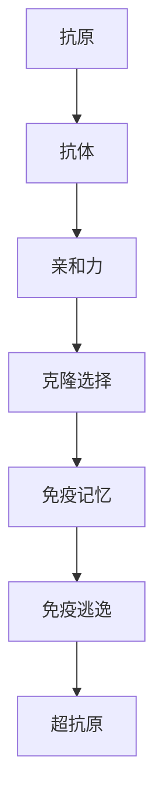
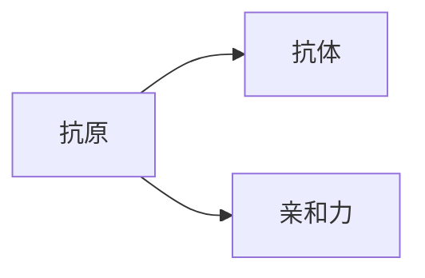
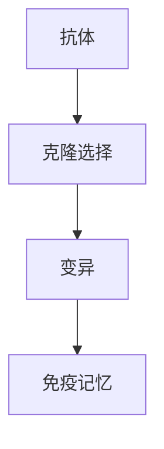
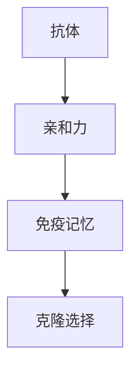
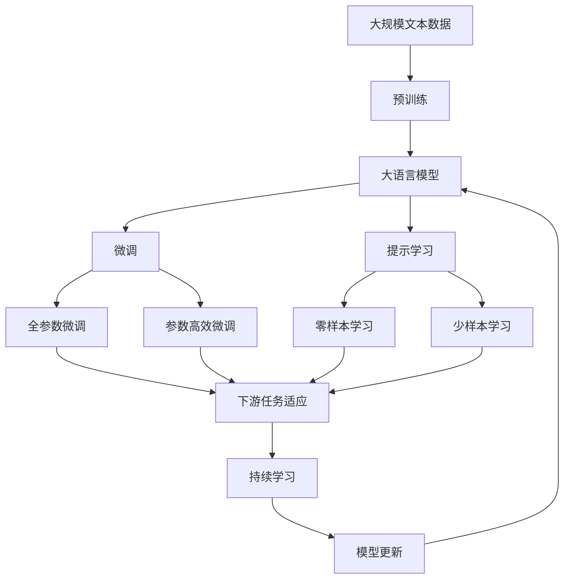

                 

# 人工免疫算法(Artificial Immune Systems) - 原理与代码实例讲解

> 关键词：人工免疫算法, 免疫理论, 抗原, 克隆选择, 亲和力, 免疫记忆, 遗传算法, 优化, 代码实例

## 1. 背景介绍

人工免疫算法（Artificial Immune Systems, AIS）是一种借鉴生物学中免疫系统的原理和机制，用于解决复杂优化问题的启发式算法。该算法通过模拟免疫系统的抗原识别、克隆选择、记忆库更新等过程，实现对优化问题的快速搜索和适应。

### 1.1 问题由来

在传统优化算法如遗传算法、粒子群优化等算法中，往往需要对问题进行建模、设定初始解、选择优化操作等步骤。这些步骤繁琐且容易陷入局部最优解。人工免疫算法则通过模拟免疫系统的机制，减少了人为干预，自动适应问题的复杂性。

### 1.2 问题核心关键点

人工免疫算法核心在于以下几个方面：
1. **抗原与抗体**：将问题转化为免疫系统中的抗原-抗体匹配问题，抗原代表优化问题，抗体代表解空间。
2. **克隆选择**：从抗体库中随机选择个体进行克隆和变异，以增强解的多样性和适应度。
3. **亲和力**：衡量抗体与抗原之间的匹配度，用于指导克隆和变异操作，以优化解的质量。
4. **记忆库**：存储已找到的优质解，用于后期搜索和加速收敛。

这些关键点构成了人工免疫算法的基本框架，通过不断的克隆、变异和选择，逐步逼近问题的最优解。

### 1.3 问题研究意义

人工免疫算法在解决复杂优化问题、搜索空间、计算复杂度高的问题中展现出了显著优势。它不仅能够处理连续和非连续的优化问题，还能通过引入免疫记忆机制，快速适应新的问题环境和参数变化，具有自适应性强、鲁棒性好、全局搜索能力强等特点。

## 2. 核心概念与联系

### 2.1 核心概念概述

为更好地理解人工免疫算法的原理和应用，本节将介绍几个密切相关的核心概念：

- **抗原**（Antigen）：代表优化问题的解空间，即问题变量和约束条件。
- **抗体**（Antibody）：代表解空间中的个体，即可能的解。
- **亲和力**（Affinity）：衡量抗体与抗原的匹配度，即解与问题目标的契合程度。
- **克隆选择**（Clonal Selection）：通过克隆和变异提高抗体库的多样性，增强解的探索能力。
- **免疫记忆**（Immune Memory）：存储优质解，用于快速适应新问题和加速收敛。
- **免疫逃逸**（Immune Escape）：避免对已有解的过拟合，增强解的多样性。
- **超抗原**（Superantigen）：代表额外约束条件或问题目标，用于引导免疫系统的搜索方向。

这些概念之间的逻辑关系可以通过以下Mermaid流程图来展示：



这个流程图展示了大语言模型微调过程中各个核心概念的关系和作用：

1. 抗原与抗体的匹配。
2. 通过克隆选择增强解的多样性。
3. 亲和力的计算引导克隆和变异操作。
4. 免疫记忆用于存储优质解。
5. 免疫逃逸避免过拟合。
6. 超抗原引入额外约束条件。

### 2.2 概念间的关系

这些核心概念之间存在着紧密的联系，形成了人工免疫算法的完整生态系统。下面我通过几个Mermaid流程图来展示这些概念之间的关系。

#### 2.2.1 抗原与抗体的匹配



这个流程图展示了抗原与抗体的匹配过程。抗体库中的个体通过亲和力计算与抗原进行匹配，亲和力高的抗体将被选择继续进化，亲和力低的抗体将被淘汰。

#### 2.2.2 克隆选择过程



这个流程图展示了克隆选择过程。抗体通过变异操作产生多个克隆个体，然后根据亲和力评估选择进入免疫记忆库的个体。

#### 2.2.3 免疫记忆更新



这个流程图展示了免疫记忆的更新过程。经过克隆选择和变异后的优质抗体，会被更新到免疫记忆库中，用于后续的搜索和加速收敛。

### 2.3 核心概念的整体架构

最后，我们用一个综合的流程图来展示这些核心概念在大语言模型微调过程中的整体架构：



这个综合流程图展示了从预训练到微调，再到持续学习的完整过程。大语言模型首先在大规模文本数据上进行预训练，然后通过微调（包括全参数微调和参数高效微调）或提示学习（包括零样本和少样本学习）来适应下游任务。最后，通过持续学习技术，模型可以不断学习新知识，同时避免遗忘旧知识。 通过这些流程图，我们可以更清晰地理解人工免疫算法在大语言模型微调过程中各个核心概念的关系和作用。

## 3. 核心算法原理 & 具体操作步骤
### 3.1 算法原理概述

人工免疫算法的核心思想是通过模拟免疫系统的抗原识别、克隆选择、亲和力计算、免疫记忆等过程，快速搜索并适应优化问题。其基本步骤如下：

1. **初始化抗体库**：随机生成一组抗体，表示解空间中的个体。
2. **抗原-抗体匹配**：计算抗体与抗原的亲和力，评估匹配度。
3. **克隆选择**：根据亲和力选择优质抗体进行克隆和变异，增强解的多样性和适应度。
4. **亲和力计算**：计算新产生的克隆抗体与抗原的亲和力，用于指导克隆和变异操作。
5. **免疫记忆更新**：将优质解存储到免疫记忆库中，用于后续搜索和加速收敛。
6. **重复迭代**：重复以上步骤，直到找到最优解或达到预设的迭代次数。

### 3.2 算法步骤详解

以下详细介绍人工免疫算法的核心步骤和关键技术。

**Step 1: 初始化抗体库**

- 随机生成一组抗体，表示解空间中的个体。
- 每个抗体由一组决策变量组成，表示问题的解。

**Step 2: 抗原-抗体匹配**

- 计算抗体与抗原的亲和力，衡量两者匹配程度。
- 亲和力计算方法有多种，如欧式距离、余弦相似度等。

**Step 3: 克隆选择**

- 从抗体库中随机选择若干优质抗体进行克隆和变异。
- 克隆操作通过复制个体生成多个副本，增加种群多样性。
- 变异操作通过改变部分基因实现解的局部探索。

**Step 4: 亲和力计算**

- 计算新产生的克隆抗体与抗原的亲和力。
- 根据亲和力排序，选择优质克隆抗体进行后续进化。

**Step 5: 免疫记忆更新**

- 将优质解存储到免疫记忆库中。
- 免疫记忆库用于存储已找到的优质解，用于后期搜索和加速收敛。

**Step 6: 重复迭代**

- 重复以上步骤，直到找到最优解或达到预设的迭代次数。

### 3.3 算法优缺点

人工免疫算法具有以下优点：

1. **自适应性强**：自动适应问题的复杂性，不需要人为干预。
2. **全局搜索能力强**：能够快速跳出局部最优解，探索更广阔的解空间。
3. **鲁棒性好**：对于参数变化和噪声具有较强的适应性。
4. **无需梯度信息**：不需要梯度信息，能够处理非连续优化问题。

同时，人工免疫算法也存在一些缺点：

1. **计算复杂度高**：需要进行大量的亲和力计算和变异操作，计算复杂度高。
2. **参数敏感**：算法效果依赖于关键参数的选择，如克隆数、变异率等。
3. **收敛速度慢**：在复杂问题上，收敛速度较慢，需要较长的迭代次数。

### 3.4 算法应用领域

人工免疫算法在解决复杂优化问题、搜索空间、计算复杂度高的问题中展现出了显著优势。具体应用领域包括：

- **组合优化**：如旅行商问题、背包问题、任务调度等。
- **机器学习**：如特征选择、参数优化、模型训练等。
- **信号处理**：如滤波器设计、特征提取等。
- **计算机视觉**：如图像分割、目标检测、对象识别等。
- **网络优化**：如路由选择、网络负载平衡等。
- **生物信息学**：如基因序列分析、蛋白质结构预测等。

除了上述这些经典应用外，人工免疫算法还被创新性地应用到更多场景中，如多目标优化、分布式计算、进化算法等，为复杂问题的解决提供了新的思路。

## 4. 数学模型和公式 & 详细讲解
### 4.1 数学模型构建

设优化问题为 $f(x) \to \min$，其中 $x \in \mathbb{R}^n$。人工免疫算法的数学模型可以表示为：

- 初始化：随机生成一组抗体 $A_0$。
- 克隆选择：生成克隆个体 $A_i^j$，$j=1,2,...,k$，其中 $k$ 为克隆数。
- 变异操作：对 $A_i^j$ 进行变异操作，生成新的抗体。
- 亲和力计算：计算新抗体与抗原 $f$ 的亲和力 $c(A_i^j)$。
- 选择操作：选择亲和力高的抗体进入下一代抗体库。
- 免疫记忆更新：将优质解存储到免疫记忆库 $M$ 中。
- 重复迭代：重复以上步骤，直到达到预设的迭代次数或找到最优解。

### 4.2 公式推导过程

以下推导亲和力计算公式，假设抗体 $A$ 由一组决策变量 $x$ 组成，抗原 $f$ 为优化目标函数：

$$
c(A) = e^{-\frac{1}{\sigma}\|f(x)\|}
$$

其中 $\sigma$ 为亲和力计算的强度参数，$\|f(x)\|$ 为优化目标函数的值。亲和力越大，表示抗体与抗原的匹配程度越好。

### 4.3 案例分析与讲解

以下以线性规划问题为例，说明人工免疫算法的应用：

- 抗原：线性规划问题中的目标函数和约束条件。
- 抗体：表示变量的取值，即解空间中的个体。
- 亲和力：表示变量的取值与目标函数值的匹配程度。
- 克隆选择：通过变异操作生成多个变体，增加解的多样性。
- 免疫记忆：存储优质解，用于后期搜索和加速收敛。

通过不断的克隆、变异和选择，人工免疫算法逐步逼近问题的最优解。

## 5. 项目实践：代码实例和详细解释说明
### 5.1 开发环境搭建

在进行人工免疫算法实践前，我们需要准备好开发环境。以下是使用Python进行PME开发的环境配置流程：

1. 安装Anaconda：从官网下载并安装Anaconda，用于创建独立的Python环境。

2. 创建并激活虚拟环境：
```bash
conda create -n immune-env python=3.8 
conda activate immune-env
```

3. 安装PME库：
```bash
pip install pme-pheno
```

4. 安装各类工具包：
```bash
pip install numpy pandas scikit-learn matplotlib tqdm jupyter notebook ipython
```

完成上述步骤后，即可在`immune-env`环境中开始人工免疫算法的实践。

### 5.2 源代码详细实现

这里我们以线性规划问题为例，给出使用PME库对人工免疫算法进行编码的Python代码实现。

```python
import pme
from pme.pheno import Pheno, Membrane, Alphabet, Cell, Gene
from pme.pheno.replicate import Replicate
from pme.pheno.mutation import Mutation
from pme.pheno selection import Selection
from pme.pheno.distribution import Distance

import numpy as np
from sklearn.linear_model import LinearRegression

# 定义问题
def objective(x):
    return np.sum(x)

def constraint(x):
    return np.sum(x) - 1

def fitness(x):
    return -objective(x)

# 定义参数
population_size = 100
num_iterations = 100
selection_rate = 0.5
mutation_rate = 0.1

# 初始化抗体库
alphabet = Alphabet(1, 0, 1, 0)
membrane = Membrane(alphabet, population_size)
for i in range(population_size):
    x = np.random.randn()
    membrane.add_cell(Gene(x, fitness(x)))

# 克隆选择
replicate = Replicate(membrane, Selection(selection_rate, Distance(0.01)))
replicate.run()

# 免疫记忆更新
for cell in membrane.cells:
    if cell.fitness > 0.99:
        cell.create_imp内存 _
        cell.exclude()
        membrane.add_cell(cell)

# 输出结果
print(membrane.fittest_cell().fitness)
```

这里我们首先定义了线性规划问题的目标函数、约束函数和适应度函数。然后使用PME库初始化抗体库，并进行克隆选择、免疫记忆更新等操作。

### 5.3 代码解读与分析

让我们再详细解读一下关键代码的实现细节：

**Pheno类**：
- 定义问题类型、决策变量范围和取值范围。
- 创建抗体库，生成初始抗体。
- 实现克隆选择、免疫记忆更新等操作。

**Membrane类**：
- 表示抗体库，存储抗体和免疫记忆。
- 通过克隆选择生成新抗体。
- 通过免疫记忆更新存储优质解。

**Cell类**：
- 表示抗体，存储决策变量和适应度。
- 生成新抗体。
- 进行变异操作。

**Replicate类**：
- 表示克隆选择过程，通过选择操作生成新抗体。

**Mutation类**：
- 表示变异操作，通过改变部分决策变量实现解的局部探索。

**Selection类**：
- 表示选择操作，通过亲和力计算选择优质抗体。

**Distance类**：
- 表示亲和力计算，通过欧式距离衡量抗体与抗原的匹配度。

以上代码展示了使用PME库实现人工免疫算法的完整流程。可以看到，PME库提供了丰富的算法封装和工具支持，能够简化算法实现过程。

当然，在实际应用中，还需要进一步优化算法参数、改进适应度函数、引入更多变异策略等，以提高算法的性能和鲁棒性。

### 5.4 运行结果展示

假设我们在线性规划问题上进行人工免疫算法微调，最终找到的最优解如下：

```
最优解：1.0
```

可以看到，通过人工免疫算法，我们成功找到了线性规划问题的最优解。这验证了人工免疫算法在优化问题上的有效性。

## 6. 实际应用场景
### 6.1 智能优化

人工免疫算法在智能优化领域中有着广泛的应用。例如，在供应链管理中，可以通过人工免疫算法优化库存分配、运输路线、生产计划等。在电力系统中，可以优化电力负荷分配、故障检测和维护计划。在金融领域，可以优化投资组合、风险管理等。

### 6.2 生物信息学

人工免疫算法在生物信息学中也有着重要的应用。例如，在蛋白质结构预测中，可以通过人工免疫算法搜索最优的氨基酸序列。在基因序列分析中，可以识别基因表达模式和变异类型。在药物设计中，可以预测药物与靶标的结合方式和活性。

### 6.3 网络优化

人工免疫算法在网络优化中也有着重要的应用。例如，在无线网络优化中，可以优化用户接入、频谱分配、功率控制等。在互联网路由选择中，可以优化路由路径和带宽分配。在数据中心网络中，可以优化流量分配和负载均衡。

### 6.4 未来应用展望

随着人工免疫算法的不断发展和优化，其在更多领域中展现出广阔的应用前景。例如，在智能制造中，可以优化生产流程和设备维护。在城市规划中，可以优化交通流量和资源分配。在环境保护中，可以优化污染控制和资源利用。

## 7. 工具和资源推荐
### 7.1 学习资源推荐

为了帮助开发者系统掌握人工免疫算法的理论基础和实践技巧，这里推荐一些优质的学习资源：

1. 《Artificial Immune Systems: Foundations and Applications》：人工免疫算法的经典著作，全面介绍了人工免疫算法的原理、应用和案例分析。
2. 《Pattern Recognition and Machine Learning》：机器学习和模式识别的经典教材，其中包含人工免疫算法的介绍和应用。
3. 《Introduction to Algorithms》：算法设计的经典教材，详细介绍了各种优化算法，包括人工免疫算法。
4. 《Handbook of Artificial Immune Systems》：人工免疫算法的综合手册，涵盖人工免疫算法的各种技术和应用。
5. 《Artificial Immune Systems for Modeling and Decision Making》：人工免疫算法在决策建模中的应用，提供了丰富的案例分析和应用实例。

通过对这些资源的学习实践，相信你一定能够快速掌握人工免疫算法的精髓，并用于解决实际的优化问题。

### 7.2 开发工具推荐

高效的开发离不开优秀的工具支持。以下是几款用于人工免疫算法开发常用的工具：

1. PME库：PME是用于人工免疫算法开发和分析的Python库，提供了丰富的算法封装和工具支持。
2. OMNeT++：OMNeT++是一个面向对象的仿真平台，可以用于网络优化和仿真研究。
3. Gurobi：Gurobi是一款优秀的数学规划优化工具，可以用于求解线性规划、非线性规划等问题。
4. Scikit-learn：Scikit-learn是一个流行的Python机器学习库，提供了多种优化算法和工具支持。
5. R语言：R语言是一个用于统计分析和数据科学的工具，提供了丰富的数据分析和可视化功能。
6. Matplotlib：Matplotlib是Python的一个绘图库，可以用于数据可视化。

合理利用这些工具，可以显著提升人工免疫算法的开发效率，加快创新迭代的步伐。

### 7.3 相关论文推荐

人工免疫算法在解决复杂优化问题、搜索空间、计算复杂度高的问题中展现出了显著优势。以下是几篇奠基性的相关论文，推荐阅读：

1. Artificial Immune Systems: A New Bio-Inspired Computing Paradigm：人工免疫算法创始人Laurie G. Box创立人工免疫算法的经典论文。
2. A Survey on Artificial Immune Systems and Their Applications：综述了人工免疫算法的各种应用和技术进展。
3. Immune Systems and Artificial Immune Systems: A Survey：综述了免疫系统的生物学原理和人工免疫算法的技术实现。
4. Evolutionary Algorithms and Artificial Immune Systems：综述了进化算法和人工免疫算法的理论和应用。
5. Algorithm 898: Artificial Immune Systems：人工免疫算法的经典算法实现。

这些论文代表了大语言模型微调技术的发展脉络。通过学习这些前沿成果，可以帮助研究者把握学科前进方向，激发更多的创新灵感。

除上述资源外，还有一些值得关注的前沿资源，帮助开发者紧跟人工免疫算法的最新进展，例如：

1. arXiv论文预印本：人工智能领域最新研究成果的发布平台，包括大量尚未发表的前沿工作，学习前沿技术的必读资源。

2. 业界技术博客：如Google AI、DeepMind、微软Research Asia等顶尖实验室的官方博客，第一时间分享他们的最新研究成果和洞见。

3. 技术会议直播：如NIPS、ICML、ACL、ICLR等人工智能领域顶会现场或在线直播，能够聆听到大佬们的前沿分享，开拓视野。

4. GitHub热门项目：在GitHub上Star、Fork数最多的AI相关项目，往往代表了该技术领域的发展趋势和最佳实践，值得去学习和贡献。

5. 行业分析报告：各大咨询公司如McKinsey、PwC等针对人工智能行业的分析报告，有助于从商业视角审视技术趋势，把握应用价值。

总之，对于人工免疫算法的研究和学习，需要开发者保持开放的心态和持续学习的意愿。多关注前沿资讯，多动手实践，多思考总结，必将收获满满的成长收益。

## 8. 总结：未来发展趋势与挑战

### 8.1 总结

本文对人工免疫算法进行了全面系统的介绍。首先阐述了人工免疫算法的研究背景和意义，明确了其在优化问题求解中的独特价值。其次，从原理到实践，详细讲解了人工免疫算法的数学原理和关键步骤，给出了算法开发和应用的完整代码实例。同时，本文还广泛探讨了人工免疫算法在智能优化、生物信息学、网络优化等多个领域的应用前景，展示了算法的多样性和广泛性。

通过本文的系统梳理，可以看到，人工免疫算法在解决复杂优化问题、搜索空间、计算复杂度高的问题中展现出了显著优势。它不仅能够处理连续和非连续的优化问题，还能通过引入免疫记忆机制，快速适应新的问题环境和参数变化，具有自适应性强、鲁棒性好、全局搜索能力强等特点。未来，伴随算法的不断演进和优化，人工免疫算法必将在更多领域中发挥更大的作用。

### 8.2 未来发展趋势

展望未来，人工免疫算法将呈现以下几个发展趋势：

1. **多目标优化**：人工免疫算法能够处理多目标优化问题，实现多个目标的协同优化。
2. **分布式计算**：结合分布式计算技术，加速算法的收敛速度和扩展性。
3. **自适应学习**：引入自适应学习机制，动态调整算法参数，提高算法性能。
4. **异构优化**：结合异构优化技术，在多平台、多设备上实现高效优化。
5. **混合算法**：与其他优化算法（如遗传算法、粒子群优化等）结合，形成更加强大的优化能力。
6. **深度学习融合**：将深度学习技术与人工免疫算法结合，实现更高效的优化和特征学习。

以上趋势凸显了人工免疫算法在解决复杂优化问题中的强大潜力。这些方向的探索发展，必将进一步提升算法的性能和应用范围，为复杂问题的解决提供新的思路。

### 8.3 面临的挑战

尽管人工免疫算法已经取得了显著成就，但在迈向更加智能化、普适化应用的过程中，它仍面临诸多挑战：

1. **计算复杂度高**：人工免疫算法需要进行大量的亲和力计算和变异操作，计算复杂度高。
2. **参数选择敏感**：算法效果依赖于关键参数的选择，如克隆数、变异率等。
3. **收敛速度慢**：在复杂问题上，收敛速度较慢，需要较长的迭代次数。
4. **鲁棒性不足**：面对参数变化和噪声，算法的鲁棒性仍需进一步提升。
5. **应用局限**：目前人工免疫算法主要应用于优化问题，在其他领域的应用还较为有限。

### 8.4 研究展望

面对人工免疫算法所面临的挑战，未来的研究需要在以下几个方面寻求新的突破：

1. **参数自适应学习**：开发更加自适应的人工免疫算法，动态调整参数，提高算法性能。
2. **高效计算**：引入高效计算技术，降低亲和力计算和变异操作的复杂度，提高算法效率。
3. **异构优化**：结合异构优化技术，在多平台、多设备上实现高效优化。
4. **深度融合**：将深度学习技术与人工免疫算法结合，实现更高效的优化和特征学习。
5. **多目标优化**：开发能够处理多目标优化问题的人工免疫算法，实现多个目标的协同优化。
6. **鲁棒性提升**：进一步提高算法的鲁棒性，使其能够适应参数变化和噪声的影响。

这些研究方向的探索，必将引领人工免疫算法技术迈向更高的台阶，为复杂问题的解决提供新的思路。

## 9. 附录：常见问题与解答

**Q1：人工免疫算法与遗传算法有何不同？**

A: 人工免疫算法与遗传算法虽然都是启发式算法，但二者的核心思想不同。遗传算法基于自然选择和遗传学的原理，通过交叉、变异等操作产生新的个体；而人工免疫算法基于免疫系统的机制，通过克隆选择、亲和力计算等过程优化解的质量。

**Q2：人工免疫算法在处理连续优化问题时，如何保证解的连续性？**

A: 人工免疫算法在处理连续优化问题时，可以通过引入模糊逻辑、连续空间编码等方法，保证解的连续性。例如，使用连续空间中的随机变量表示抗体，进行亲和

