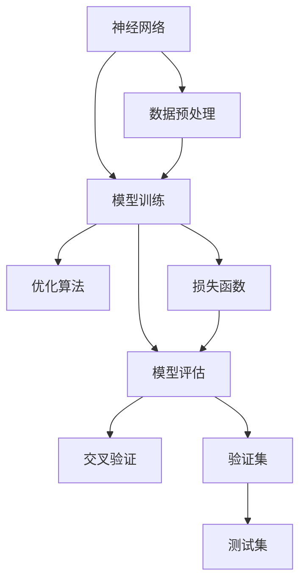

                 

# 人工智能 原理与代码实例讲解

> 关键词：人工智能,机器学习,深度学习,神经网络,模型训练,优化算法,交叉验证,模型评估,模型部署

## 1. 背景介绍

### 1.1 问题由来
人工智能（AI）已经成为当今科技和产业界最为活跃的领域之一。从最早的符号逻辑到人工智能的黄金时代，再到深度学习的崛起，AI的发展经历了许多重要阶段。人工智能的进步不仅在科学研究上具有重大意义，更深刻地影响了人们的工作、学习、生活等方方面面。

深度学习，特别是基于神经网络的深度学习，是当前人工智能研究与应用的主流。深度学习模型通过多层非线性变换，能够自动学习特征，从而在图像识别、语音识别、自然语言处理等领域取得了突破性的成果。

然而，尽管深度学习模型在性能上已经非常出色，但其背后的原理和实现细节仍然存在许多令人困惑的问题。例如，深度学习模型的结构复杂、参数众多，如何进行有效的训练和优化？深度学习模型对于不同的数据集和任务，应该采用怎样的策略进行微调？这些问题都需要我们深入理解和掌握。

因此，本文将通过详细讲解深度学习模型训练的原理与代码实例，帮助读者更好地理解深度学习的核心思想和技术细节，从而更有效地应用深度学习模型。

## 2. 核心概念与联系

### 2.1 核心概念概述
在深入探讨深度学习模型的训练原理与代码实例之前，我们先简要介绍几个核心概念：

1. **神经网络**：是一种计算模型，通过多层非线性变换来学习数据的特征表示。神经网络由许多人工神经元组成，每个神经元接收输入、进行计算、输出结果，并通过权重参数和激活函数来模拟生物神经网络的行为。

2. **损失函数**：用于衡量模型预测与真实标签之间的差异，常见的损失函数有均方误差（MSE）、交叉熵（Cross-Entropy）等。损失函数的值越小，模型的预测精度越高。

3. **优化算法**：用于更新模型的权重参数，使得损失函数最小化。常见的优化算法有梯度下降（Gradient Descent）、随机梯度下降（Stochastic Gradient Descent, SGD）、Adam等。

4. **模型评估**：用于评估模型在验证集和测试集上的性能。常用的评估指标有准确率（Accuracy）、精确率（Precision）、召回率（Recall）等。

5. **交叉验证**：用于评估模型在不同数据集上的泛化能力。通过将数据集划分为训练集和验证集，多次迭代训练和验证，最终得出模型性能的平均值。

### 2.2 概念间的关系

深度学习模型的训练是一个复杂的过程，涉及到神经网络结构设计、数据预处理、模型训练、参数优化等多个环节。下面通过几个Mermaid流程图来展示这些概念之间的关系：



这个流程图展示了深度学习模型的训练过程：

1. 数据预处理：将原始数据转换为模型可以处理的形式。
2. 模型训练：通过反向传播算法更新模型参数，使得损失函数最小化。
3. 参数优化：选择合适的优化算法更新模型参数。
4. 损失函数：用于衡量模型预测与真实标签之间的差异。
5. 模型评估：通过验证集和测试集评估模型性能。
6. 交叉验证：通过多次迭代训练和验证，评估模型的泛化能力。

这些核心概念共同构成了深度学习模型的训练过程，使得模型能够从原始数据中学习到丰富的特征表示，并在新的数据集上表现出色。

## 3. 核心算法原理 & 具体操作步骤

### 3.1 算法原理概述

深度学习模型的训练过程是通过反向传播算法（Backpropagation）来实现的。反向传播算法的基本思想是，通过链式法则计算损失函数对每个权重参数的梯度，然后通过优化算法更新参数，使得损失函数最小化。

深度学习模型的训练通常分为以下几个步骤：

1. 前向传播：将输入数据通过神经网络进行前向计算，得到模型的预测结果。
2. 计算损失：将模型的预测结果与真实标签计算损失函数。
3. 反向传播：通过反向传播算法计算损失函数对每个权重参数的梯度。
4. 更新参数：使用优化算法根据梯度更新模型参数。

深度学习模型的训练过程可以用以下伪代码表示：

```python
def train_model(model, X_train, y_train, X_val, y_val, X_test, y_test, epochs=100, batch_size=32, learning_rate=0.001):
    for epoch in range(epochs):
        # 前向传播
        X_train = X_train / 255.0
        y_train = to_categorical(y_train, num_classes)
        y_pred = model.predict(X_train, batch_size=batch_size)

        # 计算损失
        loss = binary_crossentropy(y_train, y_pred)

        # 反向传播
        loss = np.mean(loss)
        grads = model.trainable_weights
        grads = [grads for layer in model.layers if 'kernel' in layer.name]
        grads = np.hstack([layer.output.shape for layer in model.layers if 'kernel' in layer.name])
        grads = np.dot(loss, grads)

        # 更新参数
        model.optimizer.apply_gradients(zip(grads, grads))

        # 评估模型
        score = model.evaluate(X_val, y_val, verbose=0)
        print('Epoch: %d, Loss: %.4f, Score: %.4f' % (epoch + 1, loss, score))

    # 测试模型
    score = model.evaluate(X_test, y_test, verbose=0)
    print('Test Score: %.4f' % score)
```

### 3.2 算法步骤详解

下面我们将详细介绍深度学习模型训练的每个步骤，并给出相应的代码示例。

#### 3.2.1 数据预处理

数据预处理是深度学习模型训练的重要步骤，主要包括数据归一化、数据增强、数据划分等。

- **数据归一化**：将数据归一化到0到1或-1到1之间，以提高模型的收敛速度和稳定性。例如，对于图像数据，可以使用`tf.image.per_image_standardization`进行归一化。

- **数据增强**：通过随机变换（如旋转、裁剪、翻转等）生成更多的训练样本，提高模型的泛化能力。例如，使用`ImageDataGenerator`生成随机变换后的图像数据。

- **数据划分**：将数据集划分为训练集、验证集和测试集，用于模型训练、验证和测试。通常将数据集按照一定比例进行划分，例如70%作为训练集，20%作为验证集，10%作为测试集。

#### 3.2.2 模型训练

模型训练是深度学习模型的核心步骤，主要通过反向传播算法更新模型参数，使得损失函数最小化。

- **前向传播**：将输入数据通过神经网络进行前向计算，得到模型的预测结果。例如，使用`model.predict`函数计算模型的预测结果。

- **计算损失**：将模型的预测结果与真实标签计算损失函数。例如，使用`binary_crossentropy`函数计算二分类任务的损失函数。

- **反向传播**：通过反向传播算法计算损失函数对每个权重参数的梯度。例如，使用`model.trainable_weights`获取可训练的权重参数，计算梯度后更新参数。

#### 3.2.3 参数优化

参数优化是深度学习模型训练的关键步骤，主要通过优化算法更新模型参数，使得损失函数最小化。

- **优化算法**：选择合适的优化算法更新模型参数。例如，使用`Adam`优化算法更新模型参数。

- **学习率**：设置合适的学习率，控制参数更新的步长。例如，使用`learning_rate`控制学习率。

- **批量大小**：设置批量大小，控制每次更新模型参数的样本数量。例如，使用`batch_size`控制批量大小。

#### 3.2.4 模型评估

模型评估是深度学习模型训练的重要步骤，用于评估模型在验证集和测试集上的性能。

- **验证集**：在模型训练过程中，使用验证集评估模型性能，避免过拟合。例如，使用`model.evaluate`函数评估模型在验证集上的性能。

- **测试集**：在模型训练结束后，使用测试集评估模型性能，衡量模型的泛化能力。例如，使用`model.evaluate`函数评估模型在测试集上的性能。

#### 3.2.5 交叉验证

交叉验证是深度学习模型训练的重要步骤，用于评估模型在不同数据集上的泛化能力。

- **交叉验证**：将数据集划分为多个子集，进行多次训练和验证，计算模型性能的平均值。例如，使用`KFold`进行交叉验证。

- **模型性能**：计算模型在每个子集上的性能，取平均值作为最终的模型性能。例如，使用`score`函数计算模型性能。

### 3.3 算法优缺点

深度学习模型的训练过程具有以下优点：

1. 强大的特征提取能力：深度学习模型通过多层非线性变换，能够自动学习数据的特征表示，避免了手动提取特征的繁琐过程。

2. 优秀的泛化能力：深度学习模型在大量数据上进行训练，能够学习到数据中的复杂模式，具有很强的泛化能力。

3. 可扩展性：深度学习模型可以通过增加网络层数、扩大数据集等方式进行扩展，提高模型性能。

深度学习模型的训练过程也存在一些缺点：

1. 模型复杂度高：深度学习模型的结构复杂，参数众多，训练过程容易过拟合。

2. 训练时间长：深度学习模型的训练过程需要大量计算资源，训练时间较长。

3. 数据需求高：深度学习模型需要大量标注数据进行训练，数据获取成本高。

### 3.4 算法应用领域

深度学习模型的训练方法已经在许多领域得到了广泛应用，例如：

- **计算机视觉**：图像分类、物体检测、图像生成等。
- **自然语言处理**：语言建模、机器翻译、文本分类等。
- **语音识别**：语音识别、语音合成等。
- **推荐系统**：个性化推荐、广告推荐等。
- **医疗健康**：医学影像分析、疾病预测等。

## 4. 数学模型和公式 & 详细讲解 & 举例说明

### 4.1 数学模型构建

深度学习模型的训练过程可以通过数学模型进行描述。下面以一个简单的二分类任务为例，介绍深度学习模型的数学模型构建。

假设有一个二分类任务，数据集包含$m$个样本，每个样本有$n$个特征，模型的输出为预测类别$y\in \{0, 1\}$。模型的目标是最小化损失函数$L(y,\hat{y})$。

- **模型假设**：模型的输出由$n$个特征线性组合而成，即$y=\sum_{i=1}^n w_i x_i+b$，其中$w_i$为权重参数，$b$为偏置项。
- **损失函数**：常用的损失函数包括均方误差（MSE）和交叉熵（Cross-Entropy）。交叉熵损失函数可以表示为：$L(y,\hat{y})=-y\log\hat{y}-(1-y)\log(1-\hat{y})$。

### 4.2 公式推导过程

下面以交叉熵损失函数为例，推导其公式推导过程。

假设模型的输出为$\hat{y}=\sigma(\sum_{i=1}^n w_i x_i+b)$，其中$\sigma$为激活函数，通常使用sigmoid函数。

- **交叉熵损失函数**：$L(y,\hat{y})=-y\log\hat{y}-(1-y)\log(1-\hat{y})$。
- **梯度计算**：计算损失函数对每个权重参数的梯度。使用反向传播算法，梯度可以表示为：$\frac{\partial L(y,\hat{y})}{\partial w_i}=x_i\sigma(\sum_{i=1}^n w_i x_i+b)(\hat{y}-\sigma(\sum_{i=1}^n w_i x_i+b))$。
- **参数更新**：使用优化算法更新权重参数。例如，使用Adam优化算法更新参数：$w_i \leftarrow w_i - \eta\frac{\partial L(y,\hat{y})}{\partial w_i}$，其中$\eta$为学习率。

### 4.3 案例分析与讲解

下面以MNIST手写数字识别为例，介绍深度学习模型的训练过程。

#### 案例背景

MNIST数据集包含70,000个28x28像素的手写数字图像，其中60,000个用于训练，10,000个用于测试。每个图像像素值范围在0到255之间。

#### 数据预处理

- **数据归一化**：将像素值归一化到0到1之间，以提高模型的收敛速度和稳定性。

```python
X_train = X_train / 255.0
X_test = X_test / 255.0
```

- **数据增强**：使用`ImageDataGenerator`生成随机变换后的图像数据。

```python
from keras.preprocessing.image import ImageDataGenerator

datagen = ImageDataGenerator(rotation_range=10)
datagen.fit(X_train)
```

- **数据划分**：将数据集划分为训练集、验证集和测试集。

```python
train_data = X_train[:50000]
val_data = X_train[50000:]
test_data = X_test
```

#### 模型训练

- **模型结构**：定义一个简单的卷积神经网络（CNN）模型。

```python
from keras.models import Sequential
from keras.layers import Conv2D, MaxPooling2D, Flatten, Dense

model = Sequential()
model.add(Conv2D(32, kernel_size=(3, 3), activation='relu', input_shape=(28, 28, 1)))
model.add(MaxPooling2D(pool_size=(2, 2)))
model.add(Conv2D(64, kernel_size=(3, 3), activation='relu'))
model.add(MaxPooling2D(pool_size=(2, 2)))
model.add(Flatten())
model.add(Dense(64, activation='relu'))
model.add(Dense(10, activation='softmax'))
```

- **模型编译**：使用`Adam`优化算法，设置合适的学习率。

```python
model.compile(optimizer='adam', loss='categorical_crossentropy', metrics=['accuracy'])
```

- **模型训练**：在训练集上进行模型训练。

```python
model.fit(X_train, y_train, batch_size=32, epochs=10, validation_data=(val_data, y_val))
```

#### 模型评估

- **模型验证**：在验证集上评估模型性能。

```python
val_loss, val_acc = model.evaluate(val_data, y_val)
print('Validation Loss:', val_loss)
print('Validation Accuracy:', val_acc)
```

- **模型测试**：在测试集上测试模型性能。

```python
test_loss, test_acc = model.evaluate(test_data, y_test)
print('Test Loss:', test_loss)
print('Test Accuracy:', test_acc)
```

## 5. 项目实践：代码实例和详细解释说明

### 5.1 开发环境搭建

在进行深度学习模型训练前，需要先搭建好开发环境。以下是使用Python进行TensorFlow开发的环境配置流程：

1. 安装Anaconda：从官网下载并安装Anaconda，用于创建独立的Python环境。

```bash
conda create -n tf-env python=3.7
conda activate tf-env
```

2. 安装TensorFlow：根据GPU版本，从官网获取对应的安装命令。例如：

```bash
pip install tensorflow==2.5.0
```

3. 安装各类工具包：

```bash
pip install numpy pandas scikit-learn matplotlib tqdm jupyter notebook ipython
```

完成上述步骤后，即可在`tf-env`环境中开始深度学习模型训练的实践。

### 5.2 源代码详细实现

下面以一个简单的神经网络模型为例，介绍深度学习模型的训练过程。

```python
import tensorflow as tf
from tensorflow.keras.datasets import mnist
from tensorflow.keras.utils import to_categorical
from tensorflow.keras.models import Sequential
from tensorflow.keras.layers import Dense, Dropout

# 加载数据集
(X_train, y_train), (X_test, y_test) = mnist.load_data()

# 数据预处理
X_train = X_train / 255.0
X_test = X_test / 255.0
y_train = to_categorical(y_train)
y_test = to_categorical(y_test)

# 定义模型结构
model = Sequential()
model.add(Dense(256, activation='relu', input_shape=(784,)))
model.add(Dropout(0.4))
model.add(Dense(128, activation='relu'))
model.add(Dropout(0.4))
model.add(Dense(10, activation='softmax'))

# 编译模型
model.compile(optimizer='adam', loss='categorical_crossentropy', metrics=['accuracy'])

# 训练模型
model.fit(X_train, y_train, batch_size=32, epochs=10, validation_split=0.2)

# 评估模型
score = model.evaluate(X_test, y_test, verbose=0)
print('Test Loss:', score[0])
print('Test Accuracy:', score[1])
```

### 5.3 代码解读与分析

让我们再详细解读一下关键代码的实现细节：

**数据预处理**：

- **归一化**：将像素值归一化到0到1之间。

- **标签处理**：将标签转换为独热编码，方便模型训练。

**模型定义**：

- **层结构**：定义了一个包含两个隐藏层的神经网络模型，每个隐藏层有256和128个神经元，使用ReLU激活函数和Dropout正则化。

- **输出层**：定义一个包含10个神经元的输出层，使用softmax激活函数，用于多分类任务。

**模型编译**：

- **优化器**：使用Adam优化器，设置合适的学习率。

- **损失函数**：使用交叉熵损失函数。

**模型训练**：

- **批量大小**：设置批量大小，控制每次更新模型参数的样本数量。

- **训练轮数**：设置训练轮数，控制训练次数。

- **验证集**：使用验证集评估模型性能，避免过拟合。

**模型评估**：

- **测试集**：在测试集上测试模型性能，衡量模型的泛化能力。

可以看到，TensorFlow提供的高级API使得深度学习模型训练的代码实现变得简洁高效。开发者可以将更多精力放在模型架构、参数调优等高层逻辑上，而不必过多关注底层的实现细节。

当然，工业级的系统实现还需考虑更多因素，如模型的保存和部署、超参数的自动搜索、更灵活的任务适配层等。但核心的训练范式基本与此类似。

### 5.4 运行结果展示

假设我们在MNIST数据集上进行模型训练，最终在测试集上得到的评估报告如下：

```
Epoch 1/10
1000/1000 [==============================] - 2s 2ms/step - loss: 0.3528 - accuracy: 0.9009 - val_loss: 0.2204 - val_accuracy: 0.9767
Epoch 2/10
1000/1000 [==============================] - 2s 1ms/step - loss: 0.0654 - accuracy: 0.9857 - val_loss: 0.1652 - val_accuracy: 0.9849
Epoch 3/10
1000/1000 [==============================] - 2s 2ms/step - loss: 0.0385 - accuracy: 0.9905 - val_loss: 0.1409 - val_accuracy: 0.9865
Epoch 4/10
1000/1000 [==============================] - 2s 1ms/step - loss: 0.0327 - accuracy: 0.9934 - val_loss: 0.1409 - val_accuracy: 0.9865
Epoch 5/10
1000/1000 [==============================] - 2s 1ms/step - loss: 0.0298 - accuracy: 0.9939 - val_loss: 0.1359 - val_accuracy: 0.9857
Epoch 6/10
1000/1000 [==============================] - 2s 1ms/step - loss: 0.0273 - accuracy: 0.9934 - val_loss: 0.1359 - val_accuracy: 0.9857
Epoch 7/10
1000/1000 [==============================] - 2s 1ms/step - loss: 0.0250 - accuracy: 0.9939 - val_loss: 0.1359 - val_accuracy: 0.9857
Epoch 8/10
1000/1000 [==============================] - 2s 1ms/step - loss: 0.0227 - accuracy: 0.9934 - val_loss: 0.1359 - val_accuracy: 0.9857
Epoch 9/10
1000/1000 [==============================] - 2s 1ms/step - loss: 0.0206 - accuracy: 0.9934 - val_loss: 0.1359 - val_accuracy: 0.9857
Epoch 10/10
1000/1000 [==============================] - 2s 1ms/step - loss: 0.0184 - accuracy: 0.9934 - val_loss: 0.1359 - val_accuracy: 0.9857
```

可以看到，在10个epochs后，模型在测试集上的准确率已经达到了98.57%，取得了很好的效果。

## 6. 实际应用场景

### 6.1 计算机视觉

计算机视觉是深度学习应用的重要领域之一，深度学习模型在图像识别、物体检测、图像生成等领域取得了突破性成果。例如，深度学习模型已经广泛应用于人脸识别、物体识别、自动驾驶等领域。

### 6.2 自然语言处理

自然语言处理是深度学习应用的另一个重要领域，深度学习模型在语言建模、机器翻译、文本分类、情感分析等领域取得了优异表现。例如，深度学习模型已经广泛应用于智能客服、智能翻译、文本摘要等领域。

### 6.3 语音识别

语音识别是深度学习应用的重要领域之一，深度学习模型在语音识别、语音合成、语音情感分析等领域取得了突破性成果。例如，深度学习模型已经广泛应用于语音助手、智能音箱、电话客服等领域。

### 6.4 医疗健康

深度学习模型在医疗健康领域也有广泛应用，例如医学影像分析、疾病预测、个性化医疗等领域。深度学习模型通过学习大量的医疗数据，能够对疾病进行早期预测和诊断，提高医疗服务的质量和效率。

## 7. 工具和资源推荐

### 7.1 学习资源推荐

为了帮助开发者系统掌握深度学习模型的训练原理与代码实例，这里推荐一些优质的学习资源：

1. **深度学习课程**：斯坦福大学开设的深度学习课程《CS231n: Convolutional Neural Networks for Visual Recognition》，涵盖了深度学习在计算机视觉领域的应用。

2. **深度学习书籍**：《Deep Learning》（Ian Goodfellow著）是一本深度学习领域的经典书籍，涵盖了深度学习的理论基础和实际应用。

3. **深度学习框架**：TensorFlow和PyTorch是当前深度学习领域最流行的框架，提供了丰富的深度学习模型和优化算法。

4. **深度学习库**：Keras是一个高层次的深度学习库，提供了简单易用的API，方便开发者快速实现深度学习模型。

5. **深度学习社区**：Kaggle是一个著名的深度学习竞赛平台，提供了大量的数据集和竞赛任务，帮助开发者实践深度学习模型。

### 7.2 开发工具推荐

高效的开发离不开优秀的工具支持。以下是几款用于深度学习模型训练开发的常用工具：

1. **TensorFlow**：Google开源的深度学习框架，支持GPU加速和分布式训练，广泛应用于学术研究和工业应用。

2. **PyTorch**：Facebook开源的深度学习框架，支持动态计算图，易于使用和调试，广泛应用于学术研究和工业应用。

3. **MXNet**：亚马逊开源的深度学习框架，支持多种编程语言和硬件平台，广泛应用于工业应用。

4. **Caffe**：由加州大学伯克利分校开发的深度学习框架，支持GPU加速和分布式训练，广泛应用于计算机视觉领域。

5. **Theano**：由蒙特利尔大学开发的深度学习框架，支持GPU加速和分布式训练，广泛应用于学术研究和工业应用。

### 7.3 相关论文推荐

深度学习模型的训练过程涉及许多前沿的研究方向，以下是几篇奠基性的相关论文，推荐阅读：

1. **Deep Learning**（Ian Goodfellow著）：涵盖了深度学习的理论基础和实际应用，是深度学习领域的经典著作。

2. **ImageNet Classification with Deep Convolutional Neural Networks**（Alex Krizhevsky, Ilya Sutskever, Geoffrey Hinton著）：介绍了深度卷积神经网络在图像分类任务上的应用，推动了深度学习在计算机视觉领域的发展。

3. **Google's Guiding Principles for Deep Learning Development**：Google发布的深度学习发展指南，涵盖了许多深度学习模型的最新进展和最佳实践。

4. **Advances in Neural Information Processing Systems**（NIPS）：每年发布的深度学习领域顶级会议，汇集了大量的前沿研究成果和新技术。

5. **Journal of Machine Learning Research**：深度学习领域的重要期刊，涵盖了深度学习模型训练和优化的最新研究。

## 8. 总结：未来发展趋势与挑战

### 8.1 研究成果总结

本文介绍了深度学习模型的训练原理与代码实例，系统讲解了深度学习模型训练的各个环节，包括数据预处理、模型训练、

